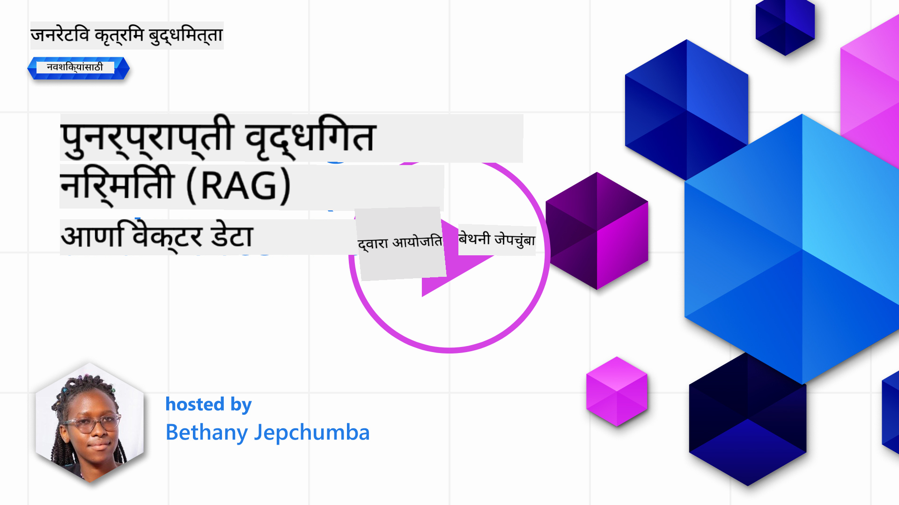
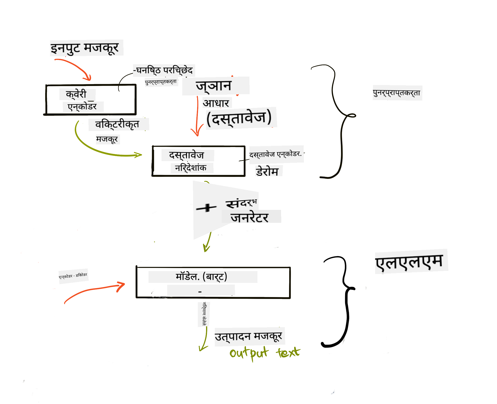
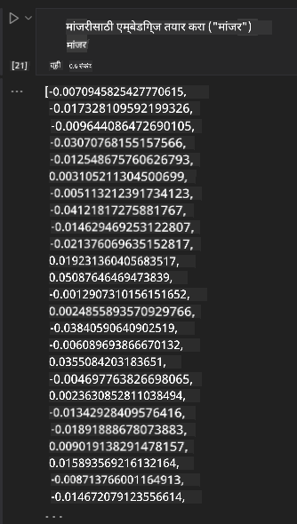

<!--
CO_OP_TRANSLATOR_METADATA:
{
  "original_hash": "e2861bbca91c0567ef32bc77fe054f9e",
  "translation_date": "2025-05-20T01:10:18+00:00",
  "source_file": "15-rag-and-vector-databases/README.md",
  "language_code": "mr"
}
-->
# रिट्रीव्हल ऑगमेंटेड जनरेशन (RAG) आणि व्हेक्टर डेटाबेस

[](https://aka.ms/gen-ai-lesson15-gh?WT.mc_id=academic-105485-koreyst)

सर्च अनुप्रयोगांच्या धड्यात, आम्ही तुमचा स्वतःचा डेटा मोठ्या भाषा मॉडेल्समध्ये (LLMs) समाकलित कसा करायचा हे थोडक्यात शिकले. या धड्यात, आम्ही तुमच्या LLM अनुप्रयोगात डेटा ग्राउंडिंगच्या संकल्पनांवर, प्रक्रियेच्या यांत्रिकीवर आणि डेटा साठवण्याच्या पद्धतींवर अधिक खोलवर जाणार आहोत, ज्यात एम्बेडिंग आणि टेक्स्ट दोन्ही समाविष्ट आहेत.

> **व्हिडिओ लवकरच येत आहे**

## परिचय

या धड्यात आम्ही खालील गोष्टी कव्हर करू:

- RAG ची ओळख, ते काय आहे आणि AI (कृत्रिम बुद्धिमत्ता) मध्ये ते का वापरले जाते.

- व्हेक्टर डेटाबेस काय आहेत हे समजून घेणे आणि आमच्या अनुप्रयोगासाठी एक तयार करणे.

- अनुप्रयोगात RAG समाकलित कसे करावे याचे व्यावहारिक उदाहरण.

## शिकण्याची उद्दिष्टे

हा धडा पूर्ण केल्यानंतर, तुम्ही सक्षम असाल:

- डेटा रिट्रीव्हल आणि प्रोसेसिंगमध्ये RAG चे महत्त्व स्पष्ट करा.

- RAG अनुप्रयोग सेटअप करा आणि तुमचा डेटा LLM वर ग्राउंड करा

- LLM अनुप्रयोगांमध्ये RAG आणि व्हेक्टर डेटाबेसची प्रभावीपणे समाकलित करा.

## आमचे परिदृश्य: आमच्या स्वतःच्या डेटासह आमचे LLM सुधारित करणे

या धड्यासाठी, आम्हाला आमच्या स्वतःच्या नोट्स शिक्षण स्टार्टअपमध्ये जोडायच्या आहेत, ज्यामुळे चॅटबॉटला विविध विषयांवर अधिक माहिती मिळते. आमच्याकडे असलेल्या नोट्स वापरून, शिकणारे चांगले अभ्यास करू शकतील आणि विविध विषय समजू शकतील, ज्यामुळे त्यांच्या परीक्षांसाठी पुनरावलोकन करणे सोपे होईल. आमचे परिदृश्य तयार करण्यासाठी, आम्ही वापरू:

- `Azure OpenAI:` आम्ही आमचा चॅटबॉट तयार करण्यासाठी वापरणार असलेला LLM

- `AI for beginners' lesson on Neural Networks`: हा डेटा आम्ही आमच्या LLM वर ग्राउंड करणार आहोत

- `Azure AI Search` आणि `Azure Cosmos DB:` व्हेक्टर डेटाबेस आमचा डेटा साठवण्यासाठी आणि सर्च इंडेक्स तयार करण्यासाठी

वापरकर्ते त्यांच्या नोट्समधून सराव क्विझ तयार करू शकतील, पुनरावलोकन फ्लॅश कार्ड्स आणि संक्षिप्त आढावे तयार करू शकतील. सुरू करण्यासाठी, चला RAG काय आहे आणि कसे कार्य करते ते पाहूया:

## रिट्रीव्हल ऑगमेंटेड जनरेशन (RAG)

LLM चालित चॅटबॉट वापरकर्ता प्रॉम्प्ट्स प्रक्रिया करून प्रतिसाद तयार करतो. ते परस्परसंवादी असण्यासाठी डिझाइन केलेले आहे आणि विविध विषयांवर वापरकर्त्यांसोबत संवाद साधते. तथापि, त्याचे प्रतिसाद दिलेल्या संदर्भावर आणि त्याच्या मूलभूत प्रशिक्षण डेटावर मर्यादित आहेत. उदाहरणार्थ, GPT-4 ज्ञान कटऑफ सप्टेंबर 2021 आहे, म्हणजेच, या कालावधीनंतर घडलेल्या घटनांचे ज्ञान त्याला नाही. याव्यतिरिक्त, LLMs च्या प्रशिक्षणासाठी वापरलेला डेटा गोपनीय माहिती जसे की वैयक्तिक नोट्स किंवा कंपनीचे उत्पादन मॅन्युअल वगळतो.

### RAGs (रिट्रीव्हल ऑगमेंटेड जनरेशन) कसे कार्य करतात


समजा तुम्हाला तुमच्या नोट्समधून क्विझ तयार करणारा चॅटबॉट तैनात करायचा आहे, तुम्हाला ज्ञान बेसशी कनेक्शन आवश्यक असेल. येथे RAG मदतीला येतो. RAGs खालीलप्रमाणे कार्य करतात:

- **ज्ञान बेस:** रिट्रीव्हलपूर्वी, हे दस्तऐवज साठवणे आणि पूर्व-प्रक्रिया करणे आवश्यक आहे, मोठ्या दस्तऐवजांना लहान तुकड्यांमध्ये विभाजित करणे, त्यांना टेक्स्ट एम्बेडिंगमध्ये रूपांतरित करणे आणि डेटाबेसमध्ये साठवणे.

- **वापरकर्ता क्वेरी:** वापरकर्ता प्रश्न विचारतो

- **रिट्रीव्हल:** जेव्हा वापरकर्ता प्रश्न विचारतो, तेव्हा एम्बेडिंग मॉडेल आमच्या ज्ञान बेसमधून संबंधित माहिती पुनर्प्राप्त करते ज्यामुळे अधिक संदर्भ प्रदान केला जाईल जो प्रॉम्प्टमध्ये समाविष्ट केला जाईल.

- **ऑगमेंटेड जनरेशन:** LLM पुनर्प्राप्त केलेल्या डेटाच्या आधारे त्याचा प्रतिसाद सुधारतो. ते पूर्व-प्रशिक्षित डेटावर आधारित प्रतिसाद तयार करण्यास अनुमती देते आणि जोडलेल्या संदर्भातील संबंधित माहिती देखील देते. पुनर्प्राप्त केलेला डेटा LLM च्या प्रतिसादांना वाढवण्यासाठी वापरला जातो. LLM नंतर वापरकर्त्याच्या प्रश्नाचे उत्तर देते.



RAGs साठी आर्किटेक्चर ट्रान्सफॉर्मर्स वापरून लागू केले जाते ज्यामध्ये दोन भाग असतात: एन्कोडर आणि डिकोडर. उदाहरणार्थ, जेव्हा वापरकर्ता प्रश्न विचारतो, तेव्हा इनपुट टेक्स्ट 'एन्कोड' करून शब्दांचा अर्थ घेणारे व्हेक्टर तयार केले जातात आणि व्हेक्टर 'डिकोड' करून आमच्या दस्तऐवज इंडेक्समध्ये जाऊन वापरकर्ता क्वेरीवर आधारित नवीन टेक्स्ट तयार करतात. LLM आउटपुट तयार करण्यासाठी एन्कोडर-डिकोडर मॉडेल दोन्ही वापरते.

प्रस्तावित पेपरनुसार RAG लागू करताना दोन दृष्टिकोन आहेत: [ज्ञान-गहन NLP (नैसर्गिक भाषा प्रक्रिया सॉफ्टवेअर) कार्यांसाठी रिट्रीव्हल-ऑगमेंटेड जनरेशन](https://arxiv.org/pdf/2005.11401.pdf?WT.mc_id=academic-105485-koreyst):

- **_RAG-Sequence_** वापरकर्ता क्वेरीला सर्वोत्कृष्ट संभाव्य उत्तर देण्यासाठी पुनर्प्राप्त केलेले दस्तऐवज वापरणे

- **RAG-Token** दस्तऐवज वापरून पुढील टोकन तयार करणे, नंतर ते वापरकर्त्याच्या क्वेरीला उत्तर देण्यासाठी पुनर्प्राप्त करणे

### RAGs का वापरावे? 

- **माहिती समृद्धता:** टेक्स्ट प्रतिसाद अद्ययावत आणि वर्तमान आहेत याची खात्री करते. त्यामुळे, अंतर्गत ज्ञान बेसमध्ये प्रवेश करून डोमेन विशिष्ट कार्यक्षमता सुधारते.

- **सत्यापनीय डेटा** वापरून वापरकर्ता क्वेरींना संदर्भ प्रदान करण्यासाठी बनावटपणा कमी करते.

- ते **किफायतशीर** आहेत कारण ते LLM ट्यून करण्याच्या तुलनेत अधिक आर्थिकदृष्ट्या आहेत

## ज्ञान बेस तयार करणे

आमचा अनुप्रयोग आमच्या वैयक्तिक डेटावर आधारित आहे म्हणजेच, AI फॉर बिगिनर्स अभ्यासक्रमातील न्यूरल नेटवर्क धडा.

### व्हेक्टर डेटाबेस

पारंपारिक डेटाबेसच्या विपरीत, व्हेक्टर डेटाबेस हा एम्बेडेड व्हेक्टर साठवण्यासाठी, व्यवस्थापित करण्यासाठी आणि शोधण्यासाठी डिझाइन केलेला विशेष डेटाबेस आहे. तो दस्तऐवजांचे संख्यात्मक प्रतिनिधित्व साठवतो. डेटा संख्यात्मक एम्बेडिंगमध्ये विभाजित केल्याने आमच्या AI प्रणालीसाठी डेटा समजणे आणि प्रक्रिया करणे सोपे होते.

आम्ही आमचे एम्बेडिंग व्हेक्टर डेटाबेसमध्ये साठवतो कारण LLMs च्या इनपुट म्हणून स्वीकारलेल्या टोकनच्या संख्येची मर्यादा असते. तुम्ही संपूर्ण एम्बेडिंग LLM ला पास करू शकत नाही म्हणून, तुम्हाला त्यांना तुकड्यांमध्ये विभाजित करणे आवश्यक आहे आणि जेव्हा वापरकर्ता प्रश्न विचारतो, तेव्हा प्रश्नासारखे एम्बेडिंग प्रॉम्प्टसह परत केले जातील. तुकड्यांमध्ये विभाजन केल्याने LLM मधून पास होणाऱ्या टोकनच्या संख्येवर खर्च कमी होतो.

काही लोकप्रिय व्हेक्टर डेटाबेसमध्ये Azure Cosmos DB, Clarifyai, Pinecone, Chromadb, ScaNN, Qdrant आणि DeepLake समाविष्ट आहेत. तुम्ही खालील कमांडसह Azure CLI वापरून Azure Cosmos DB मॉडेल तयार करू शकता:

```bash
az login
az group create -n <resource-group-name> -l <location>
az cosmosdb create -n <cosmos-db-name> -r <resource-group-name>
az cosmosdb list-keys -n <cosmos-db-name> -g <resource-group-name>
```

### टेक्स्टपासून एम्बेडिंगपर्यंत

आमचा डेटा साठवण्यापूर्वी, आम्हाला तो डेटाबेसमध्ये साठवण्यापूर्वी व्हेक्टर एम्बेडिंगमध्ये रूपांतरित करणे आवश्यक आहे. जर तुम्ही मोठ्या दस्तऐवजांशी किंवा लांब टेक्स्टशी काम करत असाल, तर तुम्ही अपेक्षित क्वेरींनुसार त्यांना तुकड्यांमध्ये विभाजित करू शकता. तुकड्यांमध्ये विभाजन वाक्य स्तरावर किंवा परिच्छेद स्तरावर केले जाऊ शकते. तुकड्यांमध्ये शब्दांच्या आसपासचे अर्थ घेतल्यामुळे, तुम्ही तुकड्याला काही अन्य संदर्भ जोडू शकता, उदाहरणार्थ, दस्तऐवज शीर्षक जोडून किंवा तुकड्याच्या आधी किंवा नंतर काही टेक्स्ट समाविष्ट करून. तुम्ही डेटा खालीलप्रमाणे तुकड्यांमध्ये विभाजित करू शकता:

```python
def split_text(text, max_length, min_length):
    words = text.split()
    chunks = []
    current_chunk = []

    for word in words:
        current_chunk.append(word)
        if len(' '.join(current_chunk)) < max_length and len(' '.join(current_chunk)) > min_length:
            chunks.append(' '.join(current_chunk))
            current_chunk = []

    # If the last chunk didn't reach the minimum length, add it anyway
    if current_chunk:
        chunks.append(' '.join(current_chunk))

    return chunks
```

तुकड्यांमध्ये विभाजित केल्यानंतर, आम्ही आमचा टेक्स्ट वेगवेगळ्या एम्बेडिंग मॉडेल्स वापरून एम्बेड करू शकतो. काही मॉडेल्स तुम्ही वापरू शकता: word2vec, OpenAI द्वारे ada-002, Azure Computer Vision आणि बरेच काही. वापरण्यासाठी मॉडेल निवडणे तुम्ही वापरत असलेल्या भाषांवर, एन्कोड केलेल्या सामग्रीच्या प्रकारावर (टेक्स्ट/इमेजेस/ऑडिओ), ते एन्कोड करू शकणाऱ्या इनपुटच्या आकारावर आणि एम्बेडिंग आउटपुटच्या लांबीवर अवलंबून असेल.

OpenAI च्या `text-embedding-ada-002` मॉडेलचा वापर करून एम्बेडेड टेक्स्टचे उदाहरण:


## रिट्रीव्हल आणि व्हेक्टर सर्च

जेव्हा वापरकर्ता प्रश्न विचारतो, तेव्हा रिट्रीव्हर क्वेरी एन्कोडर वापरून त्याचे व्हेक्टरमध्ये रूपांतर करतो, तेव्हा तो इनपुटशी संबंधित दस्तऐवजांमधील संबंधित व्हेक्टरसाठी आमच्या दस्तऐवज शोध इंडेक्समध्ये शोधतो. एकदा पूर्ण झाल्यानंतर, ते इनपुट व्हेक्टर आणि दस्तऐवज व्हेक्टर दोन्ही टेक्स्टमध्ये रूपांतरित करते आणि LLM द्वारे पास करते.

### रिट्रीव्हल

रिट्रीव्हल तेव्हा होते जेव्हा प्रणाली जलदपणे इंडेक्समधून शोध निकष पूर्ण करणारे दस्तऐवज शोधण्याचा प्रयत्न करते. रिट्रीव्हरचे लक्ष्य असे दस्तऐवज मिळवणे आहे जे संदर्भ प्रदान करण्यासाठी वापरले जातील आणि तुमच्या डेटावर LLM ला ग्राउंड करतील.

आमच्या डेटाबेसमध्ये शोध करण्याचे अनेक मार्ग आहेत जसे की:

- **कीवर्ड शोध** - टेक्स्ट शोधांसाठी वापरला जातो

- **सामान्य शोध** - शब्दांच्या सामान्य अर्थाचा वापर करते

- **व्हेक्टर शोध** - एम्बेडिंग मॉडेल्स वापरून दस्तऐवज टेक्स्टपासून व्हेक्टर प्रतिनिधित्वात रूपांतरित करतो. वापरकर्त्याच्या प्रश्नाच्या जवळचे व्हेक्टर प्रतिनिधित्व असलेल्या दस्तऐवजांची क्वेरी करून रिट्रीव्हल केली जाईल.

- **हायब्रिड** - कीवर्ड आणि व्हेक्टर शोध दोन्हीचे संयोजन.

रिट्रीव्हलमध्ये एक आव्हान येते जेव्हा डेटाबेसमध्ये क्वेरीसाठी समान प्रतिसाद नाही, तेव्हा प्रणाली त्यांना मिळू शकणारी सर्वोत्तम माहिती परत करेल, तथापि, तुम्ही प्रासंगिकतेसाठी कमाल अंतर सेट अप करणे किंवा कीवर्ड आणि व्हेक्टर शोध दोन्ही एकत्रित करणारा हायब्रिड शोध वापरणे यासारख्या युक्त्या वापरू शकता. या धड्यात आम्ही हायब्रिड शोध वापरणार आहोत, व्हेक्टर आणि कीवर्ड शोध दोन्हीचे संयोजन. आम्ही आमचा डेटा डेटा फ्रेममध्ये साठवू ज्यामध्ये तुकडे तसेच एम्बेडिंग असलेल्या स्तंभांचा समावेश असेल.

### व्हेक्टर समानता

रिट्रीव्हर ज्ञान डेटाबेसमधील जवळच्या एम्बेडिंगसाठी शोधेल, जवळचा शेजारी, कारण ते समान टेक्स्ट आहेत. वापरकर्ता क्वेरी विचारतो अशा परिस्थितीत, ते प्रथम एम्बेड केले जाते आणि नंतर समान एम्बेडिंगसह जुळवले जाते. वेक्टर किती समान आहेत हे शोधण्यासाठी वापरले जाणारे सामान्य मापन म्हणजे दोन वेक्टरमधील कोनावर आधारित कोसाइन समानता.

आम्ही समानता मोजू शकतो इतर पर्यायांचा वापर करून जसे की युक्लिडियन अंतर जे वेक्टर एंडपॉइंट्स दरम्यान सरळ रेषा आहे आणि डॉट प्रॉडक्ट जे दोन वेक्टरच्या संबंधित घटकांच्या उत्पादनेची बेरीज मोजते.

### सर्च इंडेक्स

रिट्रीव्हल करताना, आम्हाला शोध करण्यापूर्वी आमच्या ज्ञान बेससाठी सर्च इंडेक्स तयार करणे आवश्यक आहे. इंडेक्स आमचे एम्बेडिंग साठवेल आणि मोठ्या डेटाबेसमध्ये देखील सर्वात समान तुकडे जलदपणे पुनर्प्राप्त करू शकेल. आम्ही स्थानिक स्तरावर आमचा इंडेक्स तयार करू शकतो:

```python
from sklearn.neighbors import NearestNeighbors

embeddings = flattened_df['embeddings'].to_list()

# Create the search index
nbrs = NearestNeighbors(n_neighbors=5, algorithm='ball_tree').fit(embeddings)

# To query the index, you can use the kneighbors method
distances, indices = nbrs.kneighbors(embeddings)
```

### पुनर्रँकिंग

एकदा तुम्ही डेटाबेस क्वेरी केल्यानंतर, तुम्हाला सर्वात संबंधित गोष्टींमधून परिणाम क्रमवारीत लावण्याची आवश्यकता असू शकते. पुनर्रँकिंग LLM मशीन लर्निंगचा वापर करून शोध परिणामांची प्रासंगिकता सुधारण्यासाठी त्यांना सर्वात संबंधित क्रमाने लावतो. Azure AI Search वापरून, पुनर्रँकिंग तुमच्यासाठी स्वयंचलितपणे केले जाते जेव्हा पुनर्रँकिंगचा एक उदाहरण जवळच्या शेजाऱ्यांचा वापर करून:

```python
# Find the most similar documents
distances, indices = nbrs.kneighbors([query_vector])

index = []
# Print the most similar documents
for i in range(3):
    index = indices[0][i]
    for index in indices[0]:
        print(flattened_df['chunks'].iloc[index])
        print(flattened_df['path'].iloc[index])
        print(flattened_df['distances'].iloc[index])
    else:
        print(f"Index {index} not found in DataFrame")
```

## सर्व काही एकत्र आणणे

शेवटचा टप्पा म्हणजे आमच्या डेटावर आधारित प्रतिसाद मिळवण्यासाठी आमच्या LLM मध्ये समावेश करणे. आम्ही ते खालीलप्रमाणे लागू करू शकतो:

```python
user_input = "what is a perceptron?"

def chatbot(user_input):
    # Convert the question to a query vector
    query_vector = create_embeddings(user_input)

    # Find the most similar documents
    distances, indices = nbrs.kneighbors([query_vector])

    # add documents to query  to provide context
    history = []
    for index in indices[0]:
        history.append(flattened_df['chunks'].iloc[index])

    # combine the history and the user input
    history.append(user_input)

    # create a message object
    messages=[
        {"role": "system", "content": "You are an AI assistant that helps with AI questions."},
        {"role": "user", "content": history[-1]}
    ]

    # use chat completion to generate a response
    response = openai.chat.completions.create(
        model="gpt-4",
        temperature=0.7,
        max_tokens=800,
        messages=messages
    )

    return response.choices[0].message

chatbot(user_input)
```

## आमच्या अनुप्रयोगाचे मूल्यांकन करणे

### मूल्यांकन मेट्रिक्स

- प्रदान केलेल्या प्रतिसादांचा दर्जा सुनिश्चित करणे की ते नैसर्गिक, प्रवाही आणि मानवासारखे वाटते

- डेटा ग्राउंडिंग: प्रतिसाद पुरवलेल्या दस्तऐवजांमधून आला आहे का हे मूल्यांकन करणे

- प्रासंगिकता: प्रतिसाद जुळतो आणि विचारलेल्या प्रश्नाशी संबंधित आहे का हे मूल्यांकन करणे

- प्रवाहीता - प्रतिसाद व्याकरणदृष्ट्या अर्थपूर्ण आहे का

## RAG (रिट्रीव्हल ऑगमेंटेड जनरेशन) आणि व्हेक्टर डेटाबेस वापरण्यासाठी वापर केस

फंक्शन कॉल्स तुमच्या अॅपमध्ये सुधारणा करू शकतात अशा अनेक वेगवेगळ्या वापर केस आहेत जसे की:

- प्रश्न आणि उत्तर देणे: तुमच्या कंपनीच्या डेटाला ग्राउंड करणे जे कर्मचारी प्रश्न विचारण्यासाठी वापरू शकतात.

- शिफारसी प्रणाली: जिथे तुम्ही सर्वात समान मूल्ये जुळवणारी प्रणाली तयार करू शकता उदा. चित्रपट, रेस्टॉरंट्स आणि बरेच काही.

- चॅटबॉट सेवा: तुम्ही चॅट इतिहास साठवू शकता आणि वापरकर्ता डेटावर आधारित संभाषण वैयक्तिकृत करू शकता.

- व्हेक्टर एम्बेडिंगवर आधारित इमेज शोध, इमेज ओळख आणि विसंगती शोधताना उपयुक्त.

## सारांश

आम्ही RAG चे मूलभूत क्षेत्र कव्हर केले आहे आमचा डेटा अनुप्रयोगात जोडणे, वापरकर्ता क्वेरी आणि आउटपुट. RAG तयार करणे सुलभ करण्यासाठी, तुम्ही Semanti Kernel, Langchain किंवा Autogen सारख्या फ्रेमवर्कचा वापर करू शकता.

## असाइनमेंट

रिट्रीव्हल ऑगमेंटेड जनरेशन (RAG) चा अभ्यास पुढे सुरू ठेवण्यासाठी तुम्ही तयार करू शकता:

- तुमच्या पसंतीच्या फ्रेमवर्कचा वापर करून अनुप्रयोगासाठी फ्रंट-एंड तयार करा

- फ्रेमवर्कचा वापर करा, किंवा LangChain किंवा Semantic Kernel, आणि तुमचा अनुप्रयोग पुन्हा तयार करा.

धडा पूर्ण केल्याबद्दल अभिनंदन 👏.

## शिक्षण येथे थांबत नाही, प्रव

**अस्वीकरण**:  
हा दस्तऐवज AI अनुवाद सेवा [Co-op Translator](https://github.com/Azure/co-op-translator) वापरून अनुवादित केला गेला आहे. आम्ही अचूकतेसाठी प्रयत्नशील असलो तरी, कृपया लक्षात ठेवा की स्वयंचलित अनुवादांमध्ये त्रुटी किंवा अचूकतेचा अभाव असू शकतो. मूळ भाषेतील दस्तऐवज हा अधिकृत स्रोत मानला पाहिजे. महत्त्वपूर्ण माहितीकरिता, व्यावसायिक मानवी अनुवादाची शिफारस केली जाते. या अनुवादाच्या वापरामुळे उद्भवणाऱ्या कोणत्याही गैरसमज किंवा चुकीच्या अर्थासाठी आम्ही जबाबदार नाही.