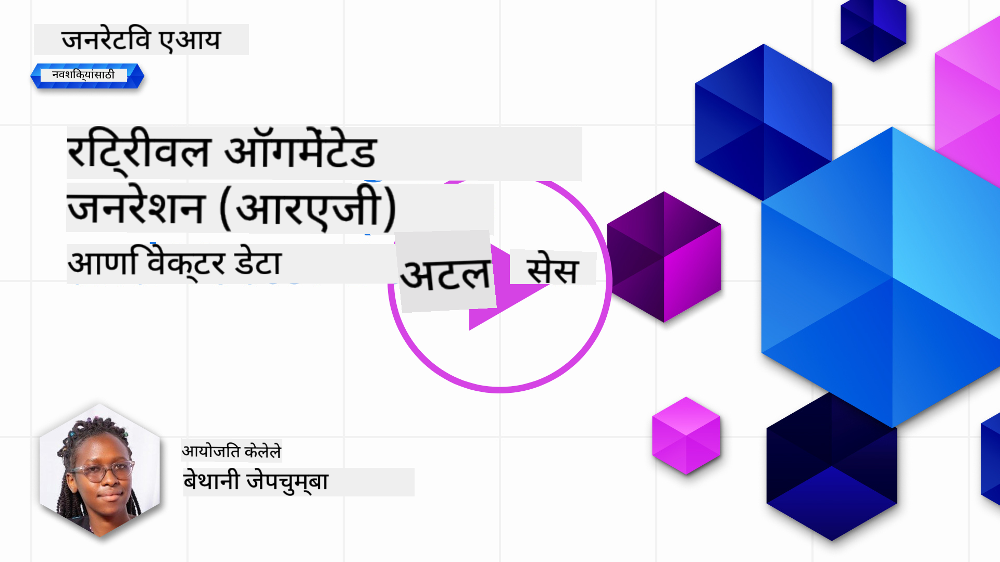
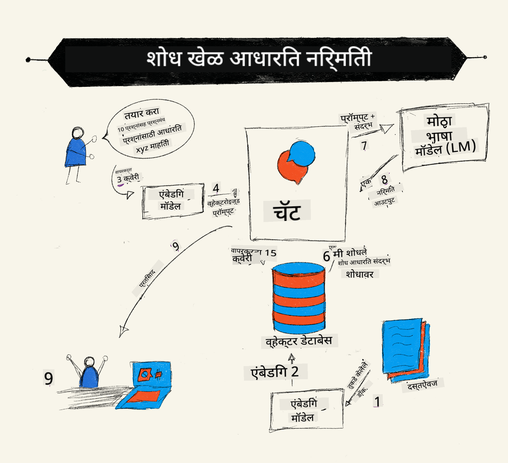
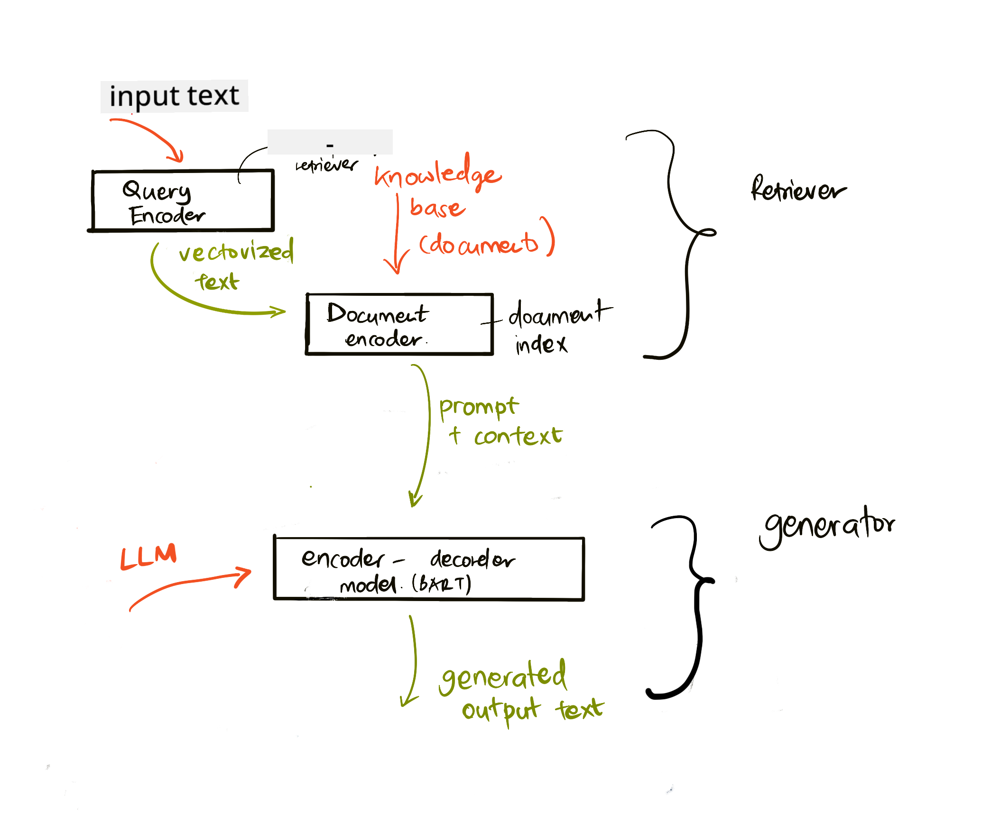
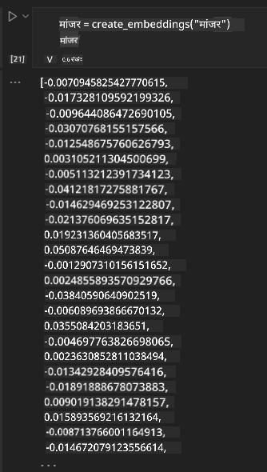

<!--
CO_OP_TRANSLATOR_METADATA:
{
  "original_hash": "e2861bbca91c0567ef32bc77fe054f9e",
  "translation_date": "2025-06-25T22:25:27+00:00",
  "source_file": "15-rag-and-vector-databases/README.md",
  "language_code": "mr"
}
-->
# रिट्रीवल ऑगमेंटेड जनरेशन (RAG) आणि व्हेक्टर डेटाबेस

[](https://aka.ms/gen-ai-lesson15-gh?WT.mc_id=academic-105485-koreyst)

शोध अनुप्रयोगांच्या धड्यात, आम्ही आपल्या स्वत:च्या डेटाचा मोठ्या भाषा मॉडेल्स (LLMs) मध्ये समाकलन कसा करावा हे थोडक्यात शिकले. या धड्यात, आम्ही आपल्या LLM अनुप्रयोगात डेटाची आधारभूतता, प्रक्रियेचे यांत्रिकी आणि एम्बेडिंग्स आणि टेक्स्ट समाविष्ट करण्याच्या पद्धती यांचा सखोल अभ्यास करू.

> **व्हिडिओ लवकरच येत आहे**

## परिचय

या धड्यात आम्ही खालील बाबींचा समावेश करणार आहोत:

- RAG ची ओळख, ते काय आहे आणि AI (कृत्रिम बुद्धिमत्ता) मध्ये त्याचा उपयोग का केला जातो.

- व्हेक्टर डेटाबेस काय आहेत हे समजून घेणे आणि आपल्या अनुप्रयोगासाठी एक तयार करणे.

- RAG ला अनुप्रयोगात कसे समाकलित करायचे याचे एक व्यावहारिक उदाहरण.

## शिकण्याची उद्दिष्टे

हा धडा पूर्ण केल्यानंतर, आपण सक्षम असाल:

- डेटाच्या पुनर्प्राप्ती आणि प्रक्रिया मध्ये RAG चे महत्त्व स्पष्ट करा.

- RAG अनुप्रयोग सेटअप करा आणि आपला डेटा LLM मध्ये आधारभूत करा

- LLM अनुप्रयोगांमध्ये RAG आणि व्हेक्टर डेटाबेसचे प्रभावी समाकलन.

## आमची परिस्थिती: आमच्या स्वत:च्या डेटासह आमच्या LLM चे सुधारणा करणे

या धड्यासाठी, आम्हाला आमच्या स्वत:च्या नोंदी शैक्षणिक स्टार्टअपमध्ये जोडायच्या आहेत, ज्यामुळे चॅटबॉटला विविध विषयांवरील अधिक माहिती मिळते. आमच्याकडे असलेल्या नोंदींचा वापर करून, शिकणारे चांगले अभ्यास करू शकतील आणि विविध विषय समजून घेऊ शकतील, ज्यामुळे त्यांच्या परीक्षांसाठी पुनरावलोकन करणे सोपे होईल. आमची परिस्थिती तयार करण्यासाठी, आम्ही वापरणार आहोत:

- `Azure OpenAI:` आम्ही आमचा चॅटबॉट तयार करण्यासाठी वापरणार असलेला LLM

- `AI for beginners' lesson on Neural Networks`: हा डेटा आम्ही आमच्या LLM वर आधारभूत करणार आहोत

- `Azure AI Search` आणि `Azure Cosmos DB:` व्हेक्टर डेटाबेस आमचा डेटा साठवण्यासाठी आणि शोध निर्देशांक तयार करण्यासाठी

वापरकर्ते त्यांच्या नोंदींमधून सराव क्विझ तयार करू शकतील, पुनरावलोकन फ्लॅश कार्ड्स आणि संक्षिप्त आढावा तयार करू शकतील. सुरुवात करण्यासाठी, RAG काय आहे आणि ते कसे कार्य करते हे पाहूया:

## रिट्रीवल ऑगमेंटेड जनरेशन (RAG)

एक LLM समर्थित चॅटबॉट वापरकर्त्याच्या सूचना प्रक्रिया करून प्रतिसाद तयार करतो. हे संवादात्मक असण्यासाठी तयार केले जाते आणि विविध विषयांवर वापरकर्त्यांसोबत संवाद साधते. तथापि, त्याचे प्रतिसाद दिलेल्या संदर्भापुरते मर्यादित असतात आणि त्याच्या मूलभूत प्रशिक्षण डेटावर आधारित असतात. उदाहरणार्थ, GPT-4 चा ज्ञान कटऑफ सप्टेंबर 2021 आहे, म्हणजेच, त्याला या कालावधीनंतर घडलेल्या घटनांचे ज्ञान नाही. याशिवाय, LLM प्रशिक्षणासाठी वापरलेला डेटा गोपनीय माहिती जसे की वैयक्तिक नोंदी किंवा कंपनीचे उत्पादन मॅन्युअल वगळतो.

### RAGs (रिट्रीवल ऑगमेंटेड जनरेशन) कसे कार्य करते



समजा तुम्हाला तुमच्या नोंदींमधून क्विझ तयार करणारा चॅटबॉट तैनात करायचा आहे, तुम्हाला ज्ञान बेसशी कनेक्शन आवश्यक असेल. येथे RAG मदतीला येतो. RAGs खालीलप्रमाणे कार्य करते:

- **ज्ञान बेस:** पुनर्प्राप्तीपूर्वी, या दस्तऐवजांना इनजेस्ट आणि पूर्व-प्रक्रिया करणे आवश्यक आहे, सामान्यतः मोठ्या दस्तऐवजांना लहान तुकड्यांमध्ये विभाजित करणे, त्यांना टेक्स्ट एम्बेडिंगमध्ये बदलणे आणि डेटाबेसमध्ये साठवणे.

- **वापरकर्ता प्रश्न:** वापरकर्ता प्रश्न विचारतो

- **पुनर्प्राप्ती:** जेव्हा वापरकर्ता प्रश्न विचारतो, तेव्हा एम्बेडिंग मॉडेल आमच्या ज्ञान बेसमधून संबंधित माहिती पुनर्प्राप्त करते जेणेकरून अधिक संदर्भ प्रदान करता येईल जो सूचनेमध्ये समाविष्ट केला जाईल.

- **ऑगमेंटेड जनरेशन:** LLM पुनर्प्राप्त केलेल्या डेटावर आधारित त्याचा प्रतिसाद सुधारतो. हे पूर्व-प्रशिक्षित डेटावर आधारित प्रतिसाद तयार करण्याची परवानगी देते तसेच जोडलेल्या संदर्भातून संबंधित माहिती. पुनर्प्राप्त डेटा LLM च्या प्रतिसादांना ऑगमेंट करण्यासाठी वापरला जातो. नंतर LLM वापरकर्त्याच्या प्रश्नाचे उत्तर परत करते.



RAGs साठी आर्किटेक्चर ट्रान्सफॉर्मर्स वापरून अंमलात आणले जाते ज्यात दोन भाग असतात: एन्कोडर आणि डिकोडर. उदाहरणार्थ, जेव्हा वापरकर्ता प्रश्न विचारतो, तेव्हा इनपुट टेक्स्ट 'एन्कोड' व्हेक्टरमध्ये केले जाते जे शब्दांचे अर्थ पकडते आणि व्हेक्टर 'डिकोड' केले जातात आमच्या दस्तऐवज निर्देशांकात आणि वापरकर्ता प्रश्नावर आधारित नवीन टेक्स्ट तयार करतात. LLM आउटपुट तयार करण्यासाठी एन्कोडर-डिकोडर मॉडेल वापरतो.

प्रस्तावित पेपरनुसार RAG अंमलात आणताना दोन दृष्टिकोन: [ज्ञान-केंद्रित NLP (नैसर्गिक भाषा प्रक्रिया सॉफ्टवेअर) कार्यांसाठी रिट्रीवल-ऑगमेंटेड जनरेशन](https://arxiv.org/pdf/2005.11401.pdf?WT.mc_id=academic-105485-koreyst) आहेत:

- **_RAG-सीक्वेन्स_** वापरकर्त्याच्या प्रश्नाला सर्वोत्तम संभाव्य उत्तर अंदाज करण्यासाठी पुनर्प्राप्त दस्तऐवजांचा वापर करणे

- **RAG-टोकन** दस्तऐवजांचा वापर पुढील टोकन तयार करण्यासाठी करणे, नंतर वापरकर्त्याच्या प्रश्नाचे उत्तर देण्यासाठी त्यांना पुनर्प्राप्त करणे

### RAGs का वापरावे?

- **माहिती समृद्धता:** टेक्स्ट प्रतिसाद अद्ययावत आणि वर्तमान असल्याचे सुनिश्चित करते. त्यामुळे, अंतर्गत ज्ञान बेसमध्ये प्रवेश करून डोमेन विशिष्ट कार्यक्षमता सुधारते.

- **अधिकृत डेटा** वापरून वापरकर्ता प्रश्नांना संदर्भ प्रदान करण्यासाठी ज्ञान बेसमध्ये फॅब्रिकेशन कमी करते.

- **खर्च प्रभावी** आहे कारण ते LLM च्या फाइन-ट्यूनिंगच्या तुलनेत अधिक किफायतशीर आहेत.

## ज्ञान बेस तयार करणे

आमचा अनुप्रयोग आमच्या वैयक्तिक डेटावर आधारित आहे म्हणजेच, AI फॉर बिगिनर्स अभ्यासक्रमातील न्यूरल नेटवर्क धडा.

### व्हेक्टर डेटाबेस

पारंपारिक डेटाबेसच्या विपरीत, व्हेक्टर डेटाबेस एक विशेष डेटाबेस आहे जो एम्बेडेड व्हेक्टर साठवण्यासाठी, व्यवस्थापित करण्यासाठी आणि शोधण्यासाठी तयार केला जातो. ते दस्तऐवजांच्या संख्यात्मक प्रतिनिधित्वांचे संग्रहण करते. डेटाला संख्यात्मक एम्बेडिंगमध्ये विभाजित करणे आमच्या AI प्रणालीसाठी डेटा समजून घेणे आणि प्रक्रिया करणे सोपे करते.

आम्ही आमची एम्बेडिंग व्हेक्टर डेटाबेसमध्ये साठवतो कारण LLMs स्वीकारतात अशा इनपुट टोकनची संख्या मर्यादित असते. संपूर्ण एम्बेडिंग LLM ला पास करता येत नसल्यामुळे, आम्हाला त्यांना तुकड्यांमध्ये विभागणे आवश्यक आहे आणि जेव्हा वापरकर्ता प्रश्न विचारतो, तेव्हा प्रश्नासारखे एम्बेडिंग सूचनेसह परत केले जातील. तुकड्यांमध्ये विभागणे LLM द्वारे पास केलेल्या टोकनच्या संख्येवरील खर्च देखील कमी करते.

काही लोकप्रिय व्हेक्टर डेटाबेसमध्ये Azure Cosmos DB, Clarifyai, Pinecone, Chromadb, ScaNN, Qdrant आणि DeepLake यांचा समावेश आहे. आपण Azure CLI वापरून खालील कमांडसह Azure Cosmos DB मॉडेल तयार करू शकता:

```bash
az login
az group create -n <resource-group-name> -l <location>
az cosmosdb create -n <cosmos-db-name> -r <resource-group-name>
az cosmosdb list-keys -n <cosmos-db-name> -g <resource-group-name>
```

### टेक्स्ट ते एम्बेडिंग्स

आमचा डेटा साठवण्यापूर्वी, आम्हाला तो डेटाबेसमध्ये साठवण्यापूर्वी व्हेक्टर एम्बेडिंगमध्ये बदलण्याची आवश्यकता असेल. जर आपण मोठ्या दस्तऐवजांसह किंवा लांब टेक्स्टसह काम करत असाल, तर आपण अपेक्षित क्वेरींवर आधारित त्यांना तुकड्यांमध्ये विभागू शकता. तुकडे वाक्य स्तरावर किंवा परिच्छेद स्तरावर केले जाऊ शकतात. तुकडे त्यांच्या आसपासच्या शब्दांमधून अर्थ घेत असल्याने, आपण तुकड्याला काही अन्य संदर्भ जोडू शकता, उदाहरणार्थ, दस्तऐवज शीर्षक जोडून किंवा तुकड्याच्या आधी किंवा नंतर काही टेक्स्ट समाविष्ट करून. आपण डेटा खालीलप्रमाणे तुकडे करू शकता:

```python
def split_text(text, max_length, min_length):
    words = text.split()
    chunks = []
    current_chunk = []

    for word in words:
        current_chunk.append(word)
        if len(' '.join(current_chunk)) < max_length and len(' '.join(current_chunk)) > min_length:
            chunks.append(' '.join(current_chunk))
            current_chunk = []

    # If the last chunk didn't reach the minimum length, add it anyway
    if current_chunk:
        chunks.append(' '.join(current_chunk))

    return chunks
```

एकदा तुकडे केले की, आम्ही नंतर आमचा टेक्स्ट विविध एम्बेडिंग मॉडेल्स वापरून एम्बेड करू शकतो. काही मॉडेल्स आपण वापरू शकता: word2vec, OpenAI द्वारे ada-002, Azure Computer Vision आणि बरेच काही. कोणते मॉडेल वापरायचे हे निवडणे आपण वापरत असलेल्या भाषांवर, एन्कोड केलेल्या सामग्रीच्या प्रकारावर (टेक्स्ट/प्रतिमा/ऑडिओ), ते एन्कोड करू शकणारे इनपुटचे आकार आणि एम्बेडिंग आउटपुटच्या लांबीवर अवलंबून असेल.

OpenAI च्या `text-embedding-ada-002` मॉडेलचा वापर करून एम्बेडेड टेक्स्टचे उदाहरण आहे:


## पुनर्प्राप्ती आणि व्हेक्टर शोध

जेव्हा वापरकर्ता प्रश्न विचारतो, तेव्हा पुनर्प्राप्तकर्ता क्वेरी एन्कोडर वापरून ते व्हेक्टरमध्ये बदलतो, नंतर ते दस्तऐवज शोध निर्देशांकाद्वारे इनपुटशी संबंधित दस्तऐवजांमध्ये संबंधित व्हेक्टर शोधतो. एकदा पूर्ण झाल्यावर, ते इनपुट व्हेक्टर आणि दस्तऐवज व्हेक्टर दोन्ही टेक्स्टमध्ये बदलते आणि LLM द्वारे पास करते.

### पुनर्प्राप्ती

पुनर्प्राप्ती तेव्हा होते जेव्हा प्रणाली शोध निकष पूर्ण करणारे दस्तऐवज निर्देशांकातून लवकर शोधण्याचा प्रयत्न करते. पुनर्प्राप्तीकर्त्याचे लक्ष्य असे दस्तऐवज मिळवणे आहे जे संदर्भ प्रदान करण्यासाठी वापरले जातील आणि आपल्या डेटावर LLM ला आधारभूत करतील.

आमच्या डेटाबेसमध्ये शोध करण्याचे अनेक मार्ग आहेत जसे:

- **कीवर्ड शोध** - टेक्स्ट शोधांसाठी वापरला जातो

- **सिमॅंटिक शोध** - शब्दांच्या सिमॅंटिक अर्थाचा वापर करतो

- **व्हेक्टर शोध** - एम्बेडिंग मॉडेल्स वापरून दस्तऐवजांना टेक्स्ट ते व्हेक्टर प्रतिनिधित्वांमध्ये बदलतो. वापरकर्त्याच्या प्रश्नाशी सर्वात जवळच्या व्हेक्टर प्रतिनिधित्व असलेल्या दस्तऐवजांची क्वेरी करून पुनर्प्राप्ती केली जाईल.

- **हायब्रिड** - कीवर्ड आणि व्हेक्टर शोध दोन्हीचे संयोजन.

पुनर्प्राप्तीच्या बाबतीत एक आव्हान येते जेव्हा डेटाबेसमध्ये क्वेरीशी समान प्रतिसाद नाही, प्रणाली नंतर ते मिळवू शकणारी सर्वोत्तम माहिती परत करेल, तथापि, आपण जसे की सेटअपमधील साम्यतेसाठी कमाल अंतर सेट करणे किंवा हायब्रिड शोध वापरणे जे कीवर्ड आणि व्हेक्टर शोध दोन्हीचे संयोजन करते अशा रणनीती वापरू शकता. या धड्यात आपण हायब्रिड शोध वापरणार आहोत, व्हेक्टर आणि कीवर्ड शोध दोन्हीचे संयोजन. आम्ही आमचा डेटा डेटाफ्रेममध्ये साठवू ज्यामध्ये तुकडे तसेच एम्बेडिंग्स असलेल्या स्तंभांचा समावेश असेल.

### व्हेक्टर समानता

पुनर्प्राप्तकर्ता ज्ञान डेटाबेसमधून जवळजवळ असलेल्या एम्बेडिंग्ससाठी शोध घेईल, जवळचा शेजारी, कारण ते समान टेक्स्ट आहेत. परिस्थितीमध्ये वापरकर्ता क्वेरी विचारतो, ते प्रथम एम्बेड केले जाते आणि नंतर समान एम्बेडिंग्ससह जुळवले जाते. वेगवेगळ्या व्हेक्टर किती समान आहेत हे शोधण्यासाठी वापरले जाणारे सामान्य मोजमाप कोसाइन समानता आहे जे दोन व्हेक्टरमधील कोनावर आधारित आहे.

आम्ही समानता मोजण्यासाठी इतर पर्याय वापरू शकतो जसे की युक्लिडियन अंतर जे व्हेक्टर एंडपॉइंट्समधील सरळ रेषा आहे आणि डॉट प्रॉडक्ट जे दोन व्हेक्टरच्या संबंधित घटकांच्या उत्पादनांची बेरीज मोजते.

### शोध निर्देशांक

पुनर्प्राप्ती करताना, आम्हाला शोध करण्यापूर्वी आमच्या ज्ञान बेससाठी शोध निर्देशांक तयार करणे आवश्यक आहे. निर्देशांक आमची एम्बेडिंग्स साठवेल आणि मोठ्या डेटाबेसमध्येही सर्वात समान तुकडे जलदगतीने पुनर्प्राप्त करू शकेल. आम्ही आमचा निर्देशांक स्थानिकरित्या वापरून तयार करू शकतो:

```python
from sklearn.neighbors import NearestNeighbors

embeddings = flattened_df['embeddings'].to_list()

# Create the search index
nbrs = NearestNeighbors(n_neighbors=5, algorithm='ball_tree').fit(embeddings)

# To query the index, you can use the kneighbors method
distances, indices = nbrs.kneighbors(embeddings)
```

### पुनर्व्यवस्था

एकदा आपण डेटाबेसची क्वेरी केली की, आपल्याला सर्वात संबंधित परिणामांपासून परिणाम क्रमबद्ध करणे आवश्यक आहे. पुनर्व्यवस्था LLM मशीन लर्निंगचा उपयोग करून शोध परिणामांची प्रासंगिकता सुधारण्यासाठी त्यांना सर्वात संबंधित क्रमाने क्रमबद्ध करते. Azure AI शोध वापरून, पुनर्व्यवस्था आपल्यासाठी स्वयंचलितपणे केली जाते सिमॅंटिक पुनर्व्यवस्था वापरून. जवळच्या शेजाऱ्यांचा वापर करून पुनर्व्यवस्था कसे कार्य करते याचे उदाहरण:

```python
# Find the most similar documents
distances, indices = nbrs.kneighbors([query_vector])

index = []
# Print the most similar documents
for i in range(3):
    index = indices[0][i]
    for index in indices[0]:
        print(flattened_df['chunks'].iloc[index])
        print(flattened_df['path'].iloc[index])
        print(flattened_df['distances'].iloc[index])
    else:
        print(f"Index {index} not found in DataFrame")
```

## सर्व काही एकत्र आणणे

शेवटचा चरण म्हणजे आमचा LLM मिश्रणात जोडणे जेणेकरून आपला डेटा आधारभूत असलेले प्रतिसाद मिळू शकतील. आम्ही ते खालीलप्रमाणे अंमलात आणू शकतो:

```python
user_input = "what is a perceptron?"

def chatbot(user_input):
    # Convert the question to a query vector
    query_vector = create_embeddings(user_input)

    # Find the most similar documents
    distances, indices = nbrs.kneighbors([query_vector])

    # add documents to query  to provide context
    history = []
    for index in indices[0]:
        history.append(flattened_df['chunks'].iloc[index])

    # combine the history and the user input
    history.append(user_input)

    # create a message object
    messages=[
        {"role": "system", "content": "You are an AI assistant that helps with AI questions."},
        {"role": "user", "content": history[-1]}
    ]

    # use chat completion to generate a response
    response = openai.chat.completions.create(
        model="gpt-4",
        temperature=0.7,
        max_tokens=800,
        messages=messages
    )

    return response.choices[0].message

chatbot(user_input)
```

## आमच्या अनुप्रयोगाचे मूल्यांकन

### मूल्यांकन मेट्रिक्स

- पुरवलेले प्रतिसादांची गुणवत्ता सुनिश्चित करणे की ते नैसर्गिक, प्रवाही आणि मानवासारखे वाटते

- डेटाचे आधारभूतता: पुरवलेल्या दस्तऐवजांमधून आलेला प्रतिसाद आहे की नाही याचे मूल्यांकन करणे

- प्रासंगिकता: प्रतिसाद प्रश्नाशी जुळतो आणि संबंधित आहे की नाही याचे मूल्यांकन करणे

- प्रवाहीता - प्रतिसाद व्याकरणानुसार अर्थपूर्ण आहे की नाही

## RAG (रिट्रीवल ऑगमेंटेड जनरेशन) आणि व्हेक्टर डेटाबेस वापरण्यासाठी वापर प्रकरणे

अनेक विविध वापर प्रकरणे आहेत जिथे फंक्शन कॉल्स तुमच्या अ‍ॅपला सुधारू शकतात जसे:

- प्रश्न आणि उत्तर देणे: आपल्या कंपनीच्या डेटाला चॅटशी आधारभूत करणे जे कर्मचार्यांना प्रश्न विचारण्यासाठी वापरले जाऊ शकते.

- शिफारसी प्रणाली: जिथे आपण सर्वात समान मूल्ये जुळवणारी प्रणाली तयार करू शकता उदाहरणार्थ चित्रपट, रेस्टॉरंट्स आणि बरेच काही.

- चॅटबॉट सेवा: आपण चॅट इतिहास साठवू शकता आणि वापरकर्ता डेटावर आधारित संवाद वैयक्तिकृत करू शकता.

- व्हेक्टर एम्बेडिंगवर आधारित प्रतिमा शोध, प्रतिमा ओळख आणि विसंगती शोध करताना उपयुक्त.

## सारांश

आम्ही RAG च्या मूलभूत क्षेत्रांचा समावेश केला आहे ज्यामध्ये अनुप्रयोगात आमचा डेटा जोडणे, वापरकर्ता क्वेरी आणि आउटपुट. RAG तयार करणे सोपे करण्यासाठी, आपण Semanti Kernel, Langchain किंवा Autogen सारख्या फ्रेमवर्कचा वापर करू शकता.

## असाइनमेंट

रिट्रीवल ऑगमेंटेड जनरेशन (RAG) चे शिक्षण सुरू ठेवण्यासाठी आपण हे तयार करू शकता:

- आपल्या पसंतीच्या फ्रेमवर्कचा वापर करून अनुप्रयोगासाठी फ्रंट-एंड तयार करा

- LangChain किंवा Semantic Kernel या फ्रेमवर्कचा उपयोग करा आणि आपला अनुप्रयोग पुन्हा तयार करा.

धडा पूर्ण केल्याबद्दल अभिनंदन 👏.

## शिक्षण येथे थांबत नाही, प्रवास सुरू ठेवा

हा धडा पूर्ण केल्यानंतर, आमच्या [जनरेटिव AI लर्न

**अस्वीकृती**:
हा दस्तऐवज AI अनुवाद सेवा [Co-op Translator](https://github.com/Azure/co-op-translator) वापरून अनुवादित केला आहे. आम्ही अचूकतेसाठी प्रयत्नशील असलो तरी कृपया लक्षात ठेवा की स्वयंचलित अनुवादांमध्ये त्रुटी किंवा अचूकतेचा अभाव असू शकतो. मूळ भाषेतील मूळ दस्तऐवज हा अधिकृत स्रोत मानला जावा. महत्त्वपूर्ण माहितीसाठी, व्यावसायिक मानवी अनुवादाची शिफारस केली जाते. या अनुवादाच्या वापरामुळे उद्भवणाऱ्या कोणत्याही गैरसमज किंवा चुकीच्या अर्थासाठी आम्ही जबाबदार नाही.