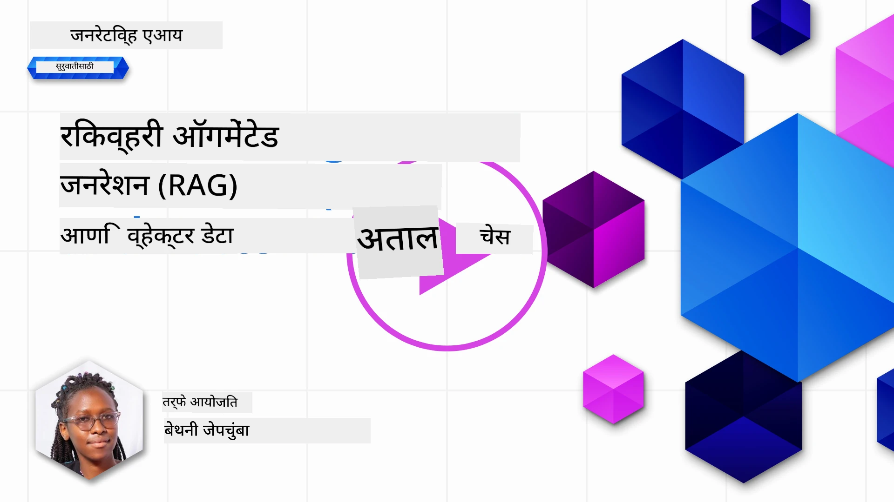
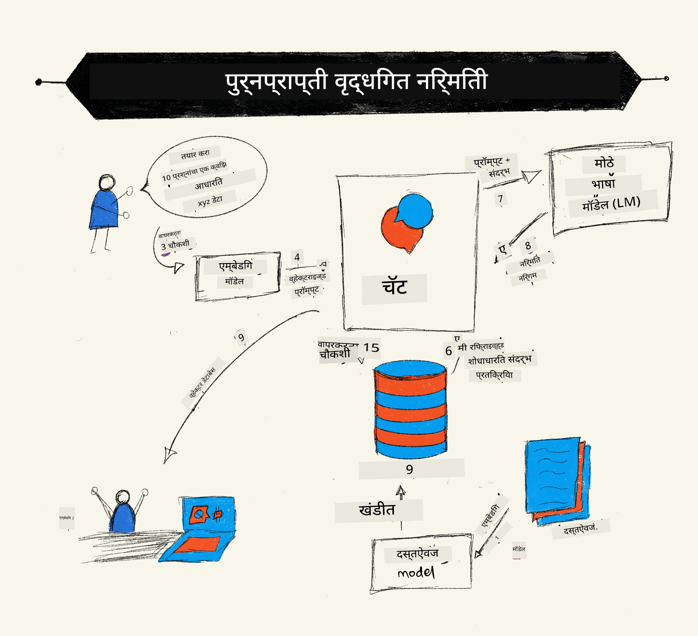
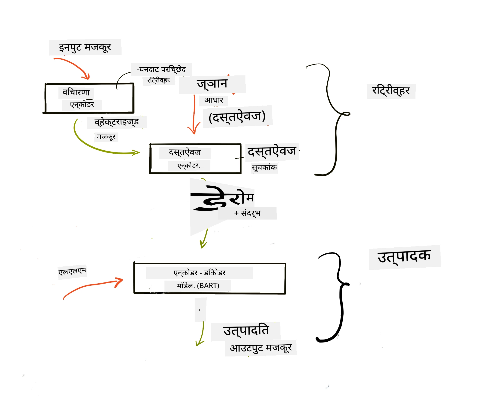
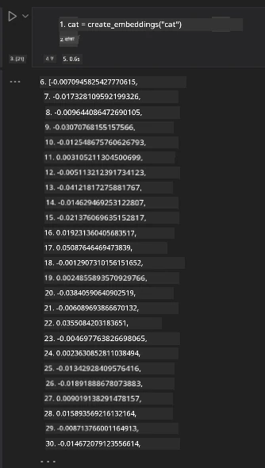

# पुनर्प्राप्ती वाढवलेली निर्मिती (RAG) आणि व्हेक्टर डेटाबेस

[](https://youtu.be/4l8zhHUBeyI?si=BmvDmL1fnHtgQYkL)

शोध अनुप्रयोगधाटी मध्ये, आपण थोडक्यात शिकले की आपले स्वतःचे डेटा मोठ्या भाषेच्या मॉडेल्स (LLMs) मध्ये कसे एकत्रित करायचे. या धाटीमध्ये, आपण आपल्या LLM अनुप्रयोगात आपल्या डेटाचे आधार तयार करण्याच्या संकल्पनांमध्ये अधिक खोलवर जाऊ, प्रक्रियेची यांत्रिकी आणि डेटा साठवण्याच्या पद्धतींबद्दल, ज्यात एम्बेडिंग्ज आणि मजकूर दोन्हींचा समावेश होतो.

> **व्हिडिओ लवकरच येणार आहे**

## परिचय

या धाटीमध्ये आपण खालील गोष्टींचा समावेश करू:

- RAG ची ओळख, काय आहे आणि AI (कृत्रिम बुद्धिमत्ता) मध्ये का वापरले जाते.

- व्हेक्टर डेटाबेस काय आहेत हे समजून घेणे आणि आपल्यासाठी एक तयार करणे.

- अनुप्रयोगात RAG कसे एकत्रित करायचे याचे व्यावहारिक उदाहरण.

## शिक्षणाचे उद्दिष्टे

या धाटी पूर्ण केल्यानंतर, आपण पुढील गोष्टी करू शकता:

- डेटाची पुनर्प्राप्ती आणि प्रक्रियेमध्ये RAG चे महत्त्व समजावून सांगणे.

- RAG अनुप्रयोग सेट अप करणे आणि आपल्या डेटाला LLM शी आधार करणे.

- LLM अनुप्रयोगांमध्ये RAG आणि व्हेक्टर डेटाबेसचे प्रभावी एकत्रीकरण.

## आपला परिदृश्य: आपल्या स्वतःच्या डेटाने आपले LLM सुधारित करणे

या धाटीसाठी, आपले स्वतःचे नोट्स शिक्षण सुरूवातीला जोडायचे आहेत, ज्यामुळे चॅटबॉटला विविध विषयांबद्दल अधिक माहिती मिळेल. आपल्याकडे उपलब्ध असलेल्या नोट्सचा वापर करून, विद्यार्थ्यांना चांगले अभ्यास करता येईल आणि वेगवेगळ्या विषयांची निगडीत माहिती समजून घेता येईल, ज्यामुळे त्यांच्या परीक्षांची पुनरावृत्ती सोपे होईल. आमचे परिदृश्य तयार करण्यासाठी, आपण वापरणार आहोत:

- `Azure OpenAI:` आपला चॅटबॉट तयार करण्यासाठी वापरण्यात येणारा LLM

- `AI for beginners' lesson on Neural Networks`: हा डेटा असेल ज्यावर आपण आपले LLM आधार करू

- `Azure AI Search` आणि `Azure Cosmos DB:` आपला डेटा साठवण्यासाठी आणि शोध अनुक्रमणिका तयार करण्यासाठी व्हेक्टर डेटाबेस

वापरकर्ते त्यांच्या नोट्समधून सराव क्विझ तयार करू शकतील, पुनरावृत्ती फ्लॅश कार्ड्स आणि त्याचा संक्षिप्त आढावा तयार करू शकतील. सुरू करण्यासाठी, पाहूया RAG काय आहे आणि ते कसे कार्य करते:

## पुनर्प्राप्ती वाढवलेली निर्मिती (RAG)

एक LLM-शक्तीशाली चॅटबॉट वापरकर्त्याच्या प्रॉम्प्ट्सवर प्रक्रिया करून प्रतिसाद तयार करतो. तो संवादात्मक असतो आणि वापरकर्त्यांशी विविध विषयांवर संवाद साधतो. तथापि, त्याचे प्रतिसाद दिलेल्या संदर्भात आणि त्याच्या मूळ प्रशिक्षण डेटावर मर्यादित असतात. उदाहरणार्थ, GPT-4 चा ज्ञान कटऑफ सप्टेंबर 2021 आहे, म्हणजे त्याला या कालखंडानंतर घडलेल्या घटनांची माहिती नाही. शिवाय, LLM प्रशिक्षणासाठी वापरलेला डेटा गोपनीय माहिती जसे की वैयक्तिक नोट्स किंवा कंपनीचा उत्पादन मॅन्युअल यांचा समावेश करत नाही.

### RAGs (पुनर्प्राप्ती वाढवलेली निर्मिती) कसे कार्य करतात



समजा आपण असा चॅटबॉट तैनात करू इच्छिता जो आपल्या नोट्सवरून क्विझ तयार करतो, त्यासाठी आपल्याला ज्ञान बेसशी कनेक्शन आवश्यक आहे. हेच RAG लाभकारी ठरते. RAG खालीलप्रमाणे काम करतात:

- **ज्ञान बेस:** पुनर्प्राप्तीपूर्वी, या दस्तऐवजांचे इनपुट आणि पूर्वप्रक्रिया करणे आवश्यक असते, सहसा मोठ्या दस्तऐवजांना लहान भागांमध्ये विभागणे, त्यांना टेक्स्ट एम्बेडिंगमध्ये रूपांतरित करणे आणि डेटाबेसमध्ये साठवणे.

- **वापरकर्ता चौकशी:** वापरकर्ता प्रश्न विचारतो

- **पुनर्प्राप्ती:** जेव्हा वापरकर्ता प्रश्न विचारतो, तेव्हा एम्बेडिंग मॉडेल ज्ञान बेसमधून संबंधित माहिती शोधून आणते जी प्रॉम्प्टमध्ये समाविष्ट केली जाईल.

- **वाढवलेली निर्मिती:** LLM त्याच्या प्रतिसादामध्ये पुनर्प्राप्त केलेल्या डेटाच्या आधारे सुधारणा करते. ते फक्त पूर्व-प्रशिक्षित डेटावर आधारित नाही तर जोडलेल्या संदर्भातील संबंधित माहितीवर आधारित उत्तर तयार करते. पुनर्प्राप्त डेटा वापरून LLM चे प्रतिसाद वाढवले जातात. नंतर LLM वापरकर्त्याच्या प्रश्नाला उत्तर देते.



RAG चे आर्किटेक्चर ट्रान्सफॉर्मर्स वापरून अंमलात आणले जाते जे दोन भागांमध्ये विभागलेले असते: एनकोडर आणि डिकोडर. उदाहरणार्थ, जेव्हा वापरकर्ता प्रश्न विचारतो, इनपुट मजकूर 'एनकोड' होतो ज्याद्वारे शब्दांचा अर्थ कॅप्चर करणारे व्हेक्टर तयार होतात आणि हे व्हेक्टर 'डिकोड' होतात आमच्या दस्तऐवज अनुक्रमणिकेत आणि वापरकर्त्याच्या चौकशीवर आधारित नवीन मजकूर तयार करतात. LLM आउटपुट तयार करण्यासाठी एनकोडर-डिकोडर मॉडेल वापरतो.

प्रस्तावित कागदपत्रानुसार RAG अंमलबजावणीसाठी दोन दृष्टिकोन आहेत: [Retrieval-Augmented Generation for Knowledge intensive NLP (natural language processing software) Tasks](https://arxiv.org/pdf/2005.11401.pdf?WT.mc_id=academic-105485-koreyst):

- **_RAG-Sequence_** वापरकर्त्याच्या प्रश्नासाठी उत्तम संभाव्य उत्तर भाकीत करण्यासाठी पुनर्प्राप्त दस्तऐवज वापरणे

- **RAG-Token** दस्तऐवज वापरून पुढील टोकन तयार करणे, नंतर वापरकर्त्याच्या प्रश्नाला उत्तर देण्यासाठी त्यांना पुनर्प्राप्त करणे

### आपण RAG का वापराल?

- **माहितीची समृद्धी:** हे पाठ प्रतिसाद अद्ययावत आणि वर्तमान असल्याची खात्री देते. त्यामुळे, ती अंतर्गत ज्ञान बेसमध्ये प्रवेश करून विशिष्ट कार्यांवर कार्यक्षमता वाढवते.

- वापरकर्त्याच्या चौकशीस संदर्भ देण्यासाठी **सत्यापित डेटा** वापरून भासवाटप कमी करते.

- हे **खर्च-कमी** आहे कारण LLM फाइन-ट्यूनिंगच्या तुलनेत अधिक अर्थसंगत आहे.

## ज्ञान बेस तयार करणे

आपला अनुप्रयोग आपल्याच्या वैयक्तिक डेटावर आधारित आहे म्हणजेच AI For Beginners शैक्षणिक अभ्यासक्रमावरील न्यूरेल नेटवर्क धाटी.

### व्हेक्टर डेटाबेस

पारंपरिक डेटाबेसपेक्षा वेगळे, व्हेक्टर डेटाबेस ही एक विशेष डेटाबेस आहे जी एम्बेड केलेल्या व्हेक्टरसाठी साठवण, व्यवस्थापन आणि शोध करण्यासाठी डिझाइन केलेली आहे. हे दस्तऐवजांचे संख्यात्मक प्रतिनिधित्व साठवते. डेटाला संख्यात्मक एम्बेडिंगमध्ये मोडल्याने आपला AI प्रणालीला डेटा समजून घेणे आणि प्रक्रियेस सुलभ होते.

आपण आमची एम्बेडिंग्ज व्हेक्टर डेटाबेसमध्ये साठवतो कारण LLM मध्ये इनपुट म्हणून टोकनची मर्यादा असते. जिथे पूर्ण एम्बेडिंग्स LLM ला दिले जाऊ शकत नाहीत, तेथे आपण त्यांना तुकडे करणे आवश्यक आहे आणि जेव्हा वापरकर्ता प्रश्न विचारतो, सर्वात योग्य प्रश्नाशी सुसंगत एम्बेडिंग्ज प्रश्नासोबत परत केल्या जातील. तुकडे केल्याने टोकनच्या संख्येवरील खर्च कमी होतो.

काही लोकप्रिय व्हेक्टर डेटाबेसमध्ये Azure Cosmos DB, Clarifyai, Pinecone, Chromadb, ScaNN, Qdrant आणि DeepLake यांचा समावेश आहे. आपण Azure CLI वापरून Azure Cosmos DB मॉडेल तयार करू शकता खालील आदेशाने:

```bash
az login
az group create -n <resource-group-name> -l <location>
az cosmosdb create -n <cosmos-db-name> -r <resource-group-name>
az cosmosdb list-keys -n <cosmos-db-name> -g <resource-group-name>
```

### मजकूरापासून एम्बेडिंग्जपर्यंत

डेटा साठवण्याअगोदर, आपल्याला तो डेटाबेसमध्ये साठवण्यापूर्वी व्हेक्टर एम्बेडिंग्जमध्ये रूपांतरित करणे आवश्यक आहे. मोठ्या दस्तऐवजांसह किंवा लांब मजकूरांसह काम करत असल्यास, आपण अपेक्षित चौकशींवर आधारित तुकडे करू शकता. तुकडे करणे वाक्यस्तरावर किंवा परिच्छेदस्तरावर करता येईल. कारण तुकडे त्यांच्या सभोवतालच्या शब्दांचा अर्थ घेतात, आपण एका तुकड्यात इतर संदर्भ जोडू शकता, उदाहरणार्थ दस्तऐवज शीर्षक जोडणे किंवा तुकड्यापूर्वी किंवा नंतर काही मजकूर समाविष्ट करणे. आपण डेटाला खालीलप्रमाणे तुकडे करू शकता:

```python
def split_text(text, max_length, min_length):
    words = text.split()
    chunks = []
    current_chunk = []

    for word in words:
        current_chunk.append(word)
        if len(' '.join(current_chunk)) < max_length and len(' '.join(current_chunk)) > min_length:
            chunks.append(' '.join(current_chunk))
            current_chunk = []

    # जर शेवटचा भाग किमान लांबीपर्यंत पोहोचला नाही, तरीही तो जोडा
    if current_chunk:
        chunks.append(' '.join(current_chunk))

    return chunks
```

एकदा तुकडे केल्यानंतर, आपण आपला मजकूर विविध एम्बेडिंग मॉडेल्स वापरून एम्बेड करू शकता. काही मॉडेल्स ज्यांचा आपण वापर करू शकता ते आहेत: word2vec, OpenAI द्वारे ada-002, Azure कंप्यूटर व्हिजन आणि बरेच काही. वापरण्यासाठी मॉडेल निवडणे आपण वापरत असलेल्या भाषा, एनकोड केलेल्या सामग्रीचा प्रकार (मजकूर/प्रतिमा/ऑडिओ), त्याचा इनपुट आकार आणि एम्बेडिंग आउटपुटची लांबी यावर अवलंबून असेल.

OpenAI च्या `text-embedding-ada-002` मॉडेल वापरून एम्बेड केलेल्या मजकूराचे उदाहरण:


## पुनर्प्राप्ती आणि व्हेक्टर शोध

जेव्हा वापरकर्ता प्रश्न विचारतो, तेव्हा रिट्रीव्हर क्वेरी एनकोडर वापरून तो प्रश्न व्हेक्टरमध्ये रूपांतरित करतो आणि नंतर संबंधित व्हेक्टरसाठी आमच्या दस्तऐवज शोध अनुक्रमणिकेत शोध करतो. प्रक्रिया पूर्ण झाल्यानंतर, इनपुट व्हेक्टर आणि दस्तऐवज व्हेक्टर दोन्ही मजकूरात रूपांतरित होतात आणि LLM मधून पास केल्या जातात.

### पुनर्प्राप्ती

पुनर्प्राप्ती तेव्हा होते जेव्हा सिस्टम जलदगतीने अनुक्रमणिकेतून योग्य दस्तऐवज शोधण्याचा प्रयत्न करते. रिट्रीव्हरचे उद्दिष्ट डॉक्युमेंट मिळवणे आहे जे संदर्भ प्रदान करण्यासाठी वापरले जातील आणि LLM ला आपला डेटा आधारावर सेट करतील.

आमच्या डेटाबेसमध्ये शोध करण्याचे काही मार्ग आहेत जसे की:

- **कीवर्ड शोध** - मजकूर शोधासाठी वापरला जातो

- **व्हेक्टर शोध** - दस्तऐवजांना एम्बेडिंग मॉडेल वापरून टेक्स्टमधून व्हेक्टरमध्ये रूपांतरित करतो, ज्यामुळे शब्दांच्या अर्थानुसार **सांमंतिक शोध** करता येतो. पुनर्प्राप्ती तेव्हाच केली जाईल जेव्हा वापरकर्त्याच्या प्रश्नाशी सर्वात जवळचे व्हेक्टर असलेले दस्तऐवज शोधले जातील.

- **हायब्रिड** - कीवर्ड आणि व्हेक्टर दोन्ही शोधांचा संयोजन.

पुनर्प्राप्तीमध्ये एक समस्या येते जेव्हा क्वेरीसाठी डेटाबेसमध्ये तत्सम उत्तर नसते, तेव्हा सिस्टम सर्वोत्तम उपलब्ध माहिती परत करते, परंतु आपण संबंधिततेसाठी कमाल अंतर निश्चित करू शकता किंवा दोन्ही कीवर्ड व व्हेक्टर शोधांचा संयोजन करणारा हायब्रिड शोध वापरू शकता. या धाटीमध्ये आपण हायब्रिड शोध वापरणार आहोत. आम्ही आमचा डेटा तुकड्यांसह आणि एम्बेडिंग्जसह डेटा फ्रेममध्ये साठवू.

### व्हेक्टर साम्य

रिट्रीव्हर ज्ञान डेटाबेसमधून जवळजवळ एकसारखे एम्बेडिंग्ज शोधेल, कारण तसे मजकूर असले पाहिजेत. परिदृश्यात, वापरकर्ता क्वेरी विचारतो, प्रथम त्या क्वेरीचे एम्बेडिंग केले जाते आणि मग तत्सम एम्बेडिंग्ज शोधल्या जातात. वेगवेगळ्या व्हेक्टरची किती साम्य आहे ते शोधण्यासाठी सामान्य मोजमाप म्हणजे कोसाइन समानता, जी दोन व्हेक्टरच्या कोनावर आधारित आहे.

आम्ही इतर पर्याय देखील वापरू शकतो जसे की युक्लिडियन अंतर जे व्हेक्टरच्या टोकांमधील थेट रेषा आहे आणि बिंदू गुणाकार जे दोन व्हेक्टरमधील संबंधित घटकांच्या गुणाकाराचा योग मोजतो.

### शोध अनुक्रमणिका

पुनर्प्राप्ती करताना, आपल्याला आपल्या ज्ञान बेससाठी शोध अनुक्रमणिका तयार करावी लागेल. अनुक्रमणिका आमच्या एम्बेडिंग्ज साठवेल आणि मोठ्या डेटाबेसमध्ये देखील सर्वात तत्सम तुकडे पटकन परत करू शकेल. आपण स्थानिकरित्या आपली अनुक्रमणिका तयार करू शकतो:

```python
from sklearn.neighbors import NearestNeighbors

embeddings = flattened_df['embeddings'].to_list()

# शोध अनुक्रमणिका तयार करा
nbrs = NearestNeighbors(n_neighbors=5, algorithm='ball_tree').fit(embeddings)

# अनुक्रमणिकेवर चौकशी करण्यासाठी, आपण kneighbors पद्धत वापरू शकता
distances, indices = nbrs.kneighbors(embeddings)
```

### पुनःक्रमबद्धीकरण

जेव्हा आपण डेटाबेस प्रश्न विचारता तेव्हा, आपल्याला परिणामांची पुनः क्रमवारी लावण्याची आवश्यकता असू शकते सर्वात संबंधित कडून सुरुवात करून. पुनःक्रमबद्धीकरण LLM मशीन लर्निंग वापरून शोध परिणामांची संबंधितता सुधारते. Azure AI Search वापरून, पुनःक्रमबद्धीकरण आपोआपच सुमेलेन्टिक रीरेंकर वापरून होते. जवळच्या शेजाऱ्यांचा वापर करून पुनःक्रमबद्धीकरण कसे काम करते याचे उदाहरण:

```python
# सर्वाधिक साम्य असलेली कागदपत्रे शोधा
distances, indices = nbrs.kneighbors([query_vector])

index = []
# सर्वाधिक साम्य असलेली कागदपत्रे छापा
for i in range(3):
    index = indices[0][i]
    for index in indices[0]:
        print(flattened_df['chunks'].iloc[index])
        print(flattened_df['path'].iloc[index])
        print(flattened_df['distances'].iloc[index])
    else:
        print(f"Index {index} not found in DataFrame")
```

## सर्व एकत्र आणणे

शेवटचे पाऊल म्हणजे आपले LLM मिसळण्याकडे जोडले जावे जेणेकरून आपल्याला आधारित डेटा असलेले प्रतिसाद मिळू शकतील. आपण ते खालीलप्रमाणे अंमलात आणू शकतो:

```python
user_input = "what is a perceptron?"

def chatbot(user_input):
    # प्रश्नाला क्वेरी वेक्टरमध्ये रूपांतरित करा
    query_vector = create_embeddings(user_input)

    # सर्वाधिक समान दस्तऐवज शोधा
    distances, indices = nbrs.kneighbors([query_vector])

    # संदर्भ प्रदान करण्यासाठी दस्तऐवज क्वेरीत जोडा
    history = []
    for index in indices[0]:
        history.append(flattened_df['chunks'].iloc[index])

    # इतिहास आणि वापरकर्ता इनपुट एकत्र करा
    history.append(user_input)

    # एक संदेश ऑब्जेक्ट तयार करा
    messages=[
        {"role": "system", "content": "You are an AI assistant that helps with AI questions."},
        {"role": "user", "content": "\n\n".join(history) }
    ]

    # प्रतिसाद तयार करण्यासाठी Responses API वापरा
    response = client.responses.create(
        model="gpt-5-mini",
        max_output_tokens=800,
        input=messages,
        store=False,
    )

    return response.output_text

chatbot(user_input)
```

## आपला अनुप्रयोग मूल्यांकन करणे

### मूल्यांकन मेट्रिक्स

- दिलेल्या प्रतिसादांची गुणवत्ता, ती नैसर्गिक, सुरळीत आणि मानवीसारखी वाटते का याची खात्री करणे

- डेटा आधारित असण्याचे मूल्यमापन: प्रतिसाद दिलेल्या दस्तऐवजांवरून आला का हे तपासणे

- संबंधितता: प्रतिसाद प्रश्नाशी जुळतो आणि संबंधित आहे का हे तपासणे

- सुरळीततेचे मूल्यमापन - प्रतिसाद व्याकरणानुसार अर्थपूर्ण आहे का

## RAG (पुनर्प्राप्ती वाढवलेली निर्मिती) आणि व्हेक्टर डेटाबेस वापरण्याच्या उपयोग प्रकरणे

अनेक विविध उपयोग प्रकरणे आहेत जिथे फंक्शन कॉल आपल्या अनुप्रयोगाला सुधारू शकतात जसे:

- प्रश्नोत्तर: आपल्या कंपनी डेटाला चॅटशी आधार देणे जे कर्मचारी प्रश्न विचारण्यासाठी वापरू शकतात.

- शिफारस प्रणाली: जेथे आपण अशा प्रणाली तयार करू शकता जिचा उपयोग सर्वात तत्सम मूल्ये जुळविण्यासाठी होतो उदा. चित्रपट, रेस्टॉरंट्स आणि बरेच काही.

- चॅटबॉट सेवा: आपण चॅट इतिहास साठवू शकता आणि वापरकर्त्याच्या डेटावर आधारित संवाद वैयक्तिकृत करू शकता.

- व्हेक्टर एम्बेडिंगवर आधारित प्रतिमा शोध, प्रतिमा ओळख आणि अपवादांची तपासणी करताना उपयुक्त.

## सारांश

आपण RAG चे मूलभूत क्षेत्रे आढळून लग्न केली - आपला डेटा अनुप्रयोगात जोडणे, वापरकर्ता क्वेरी आणि आउटपुट. RAG तयार करण्यास सुलभ करण्यासाठी, आपण Semanti Kernel, Langchain किंवा Autogen यांसारख्या फ्रेमवर्क्स वापरू शकता.

## निबंध

RAG (पुनर्प्राप्ती वाढवलेली निर्मिती) याच्या शिकण्याला पुढे सुरू ठेवण्यासाठी, आपण तयार करू शकता:

- आपल्या पसंतीच्या फ्रेमवर्कचा वापर करून अनुप्रयोगासाठी फ्रंट-एंड तयार करा

- LangChain किंवा Semantic Kernel पैकी कोणतीही फ्रेमवर्क वापरा आणि आपला अनुप्रयोग पुन्हा तयार करा.

धाटी पूर्ण केल्याबद्दल अभिनंदन 👏.

## शिकणे इथे थांबत नाही, प्रवास सुरू ठेवा

या धाटी पूर्ण केल्यावर, आमच्या [जनरेटिव AI शिक्षण संग्रह](https://aka.ms/genai-collection?WT.mc_id=academic-105485-koreyst) वर पहा आणि आपल्या जनरेटिव AI ज्ञानाला पुढे वाढवा!

---

<!-- CO-OP TRANSLATOR DISCLAIMER START -->
**अस्वीकरण**:
हा दस्तऐवज AI भाषांतर सेवा [Co-op Translator](https://github.com/Azure/co-op-translator) चा वापर करून अनुवादित केला आहे. जरी आम्ही अचूकतेसाठी प्रयत्न करतो, तरी कृपया लक्षात घ्या की स्वयंचलित भाषांतरांमध्ये त्रुटी किंवा अचूकतेची कमतरता असू शकते. मूळ दस्तऐवज त्याच्या मूळ भाषेत अधिकृत स्रोत मानला पाहिजे. महत्त्वाची माहिती असल्यास, व्यावसायिक मानवी भाषांतराची शिफारस केली जाते. या भाषांतराच्या वापरामुळे उद्भवणाऱ्या कोणत्याही गैरसमज किंवा चुकीच्या अर्थलावणीसाठी आम्ही जबाबदार नाही.
<!-- CO-OP TRANSLATOR DISCLAIMER END -->