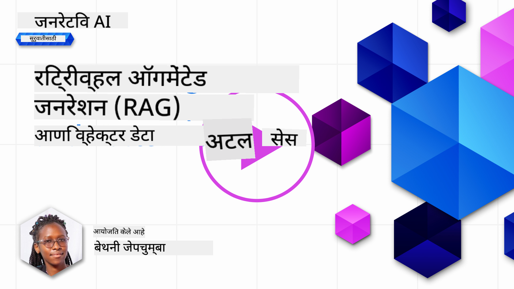
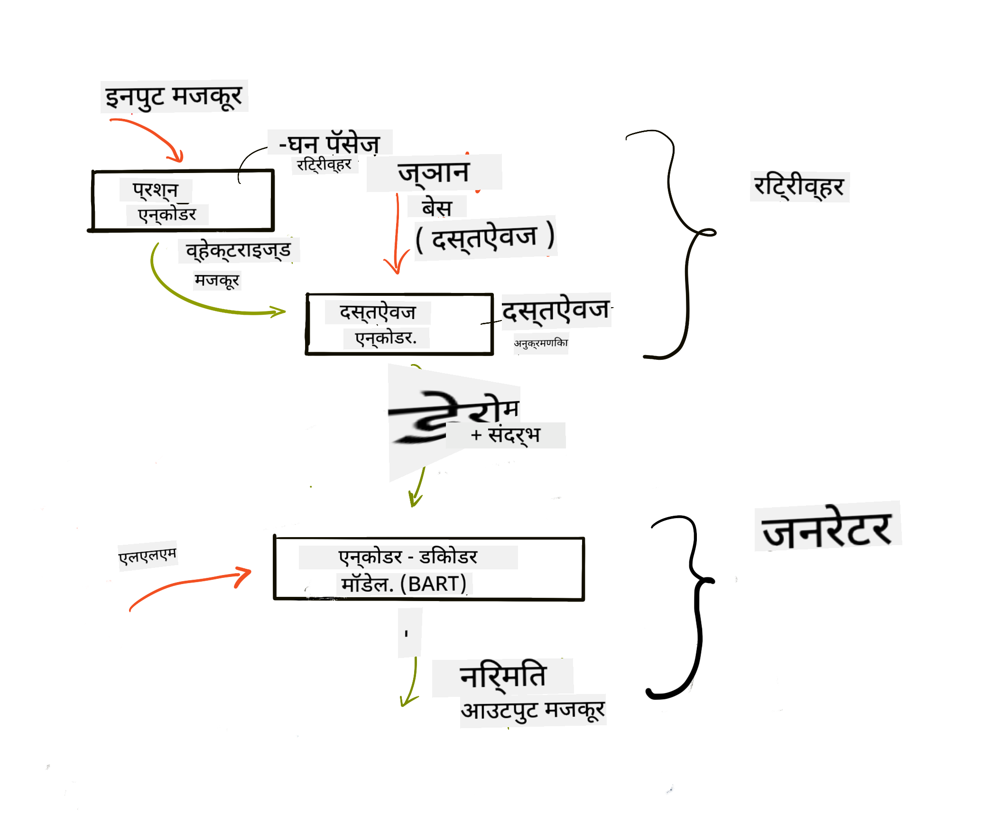
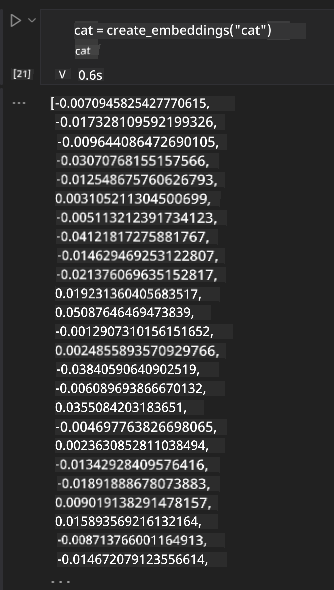

<!--
CO_OP_TRANSLATOR_METADATA:
{
  "original_hash": "b4b0266fbadbba7ded891b6485adc66d",
  "translation_date": "2025-10-17T13:37:41+00:00",
  "source_file": "15-rag-and-vector-databases/README.md",
  "language_code": "mr"
}
-->
# रिट्रीव्हल ऑगमेंटेड जनरेशन (RAG) आणि व्हेक्टर डेटाबेस

[](https://youtu.be/4l8zhHUBeyI?si=BmvDmL1fnHtgQYkL)

सर्च अॅप्लिकेशन्सच्या धड्यात, आपण थोडक्यात शिकले की आपला डेटा मोठ्या भाषा मॉडेल्स (LLMs) मध्ये कसा समाविष्ट करायचा. या धड्यात, आपण आपल्या LLM अॅप्लिकेशनमध्ये डेटा ग्राउंडिंगच्या संकल्पनांवर, प्रक्रियेच्या यांत्रिकीवर आणि डेटा साठवण्यासाठीच्या पद्धतींवर अधिक सखोल चर्चा करू, ज्यामध्ये एम्बेडिंग्स आणि टेक्स्ट दोन्ही समाविष्ट आहेत.

> **व्हिडिओ लवकरच येत आहे**

## परिचय

या धड्यात आपण खालील गोष्टी कव्हर करू:

- RAG म्हणजे काय, ते कसे कार्य करते आणि AI (कृत्रिम बुद्धिमत्ता) मध्ये त्याचा उपयोग का केला जातो याची ओळख.

- व्हेक्टर डेटाबेस म्हणजे काय हे समजून घेणे आणि आपल्या अॅप्लिकेशनसाठी एक तयार करणे.

- RAG अॅप्लिकेशनमध्ये कसे समाकलित करायचे याचे व्यावहारिक उदाहरण.

## शिकण्याची उद्दिष्टे

हा धडा पूर्ण केल्यानंतर, आपण हे करू शकता:

- डेटा रिट्रीव्हल आणि प्रोसेसिंगमध्ये RAG चे महत्त्व स्पष्ट करा.

- RAG अॅप्लिकेशन सेटअप करा आणि आपला डेटा LLM वर ग्राउंड करा.

- LLM अॅप्लिकेशन्समध्ये RAG आणि व्हेक्टर डेटाबेस प्रभावीपणे समाकलित करा.

## आमचे परिदृश्य: आमच्या LLM मध्ये आमचा स्वतःचा डेटा समाविष्ट करणे

या धड्यासाठी, आम्हाला आमच्या स्वतःच्या नोट्स एज्युकेशन स्टार्टअपमध्ये समाविष्ट करायच्या आहेत, ज्यामुळे चॅटबॉटला विविध विषयांवरील अधिक माहिती मिळेल. आमच्याकडे असलेल्या नोट्स वापरून, शिकणाऱ्यांना चांगले अभ्यास करता येईल आणि विविध विषय समजून घेता येतील, ज्यामुळे त्यांच्या परीक्षांसाठी पुनरावलोकन करणे सोपे होईल. आमचे परिदृश्य तयार करण्यासाठी, आम्ही वापरू:

- `Azure OpenAI:` चॅटबॉट तयार करण्यासाठी वापरलेले LLM

- `AI फॉर बिगिनर्सचा न्यूरल नेटवर्क्सवरील धडा:` हा डेटा आम्ही आमच्या LLM वर ग्राउंड करू

- `Azure AI Search` आणि `Azure Cosmos DB:` आमचा डेटा साठवण्यासाठी आणि सर्च इंडेक्स तयार करण्यासाठी व्हेक्टर डेटाबेस

वापरकर्ते त्यांच्या नोट्समधून प्रॅक्टिस क्विझ तयार करू शकतील, पुनरावलोकन फ्लॅश कार्ड्स तयार करू शकतील आणि त्याचा संक्षिप्त आढावा घेऊ शकतील. सुरुवात करण्यासाठी, RAG म्हणजे काय आणि ते कसे कार्य करते ते पाहूया:

## रिट्रीव्हल ऑगमेंटेड जनरेशन (RAG)

LLM-सक्षम चॅटबॉट वापरकर्त्याच्या प्रॉम्प्ट्सवर प्रक्रिया करून प्रतिसाद तयार करतो. तो संवादात्मक असतो आणि विविध विषयांवर वापरकर्त्यांशी संवाद साधतो. तथापि, त्याचे प्रतिसाद दिलेल्या संदर्भ आणि त्याच्या मूलभूत प्रशिक्षण डेटावर मर्यादित असतात. उदाहरणार्थ, GPT-4 चा ज्ञान कटऑफ सप्टेंबर 2021 आहे, म्हणजेच, त्याला या कालावधीनंतर घडलेल्या घटनांचे ज्ञान नाही. याशिवाय, LLMs च्या प्रशिक्षणासाठी वापरलेला डेटा गोपनीय माहिती जसे की वैयक्तिक नोट्स किंवा कंपनीचे उत्पादन मॅन्युअल वगळतो.

### RAGs (रिट्रीव्हल ऑगमेंटेड जनरेशन) कसे कार्य करतात


समजा तुम्हाला तुमच्या नोट्समधून क्विझ तयार करणारा चॅटबॉट तैनात करायचा आहे, तुम्हाला ज्ञान बेसशी कनेक्शन आवश्यक असेल. येथे RAG मदतीला येतो. RAGs खालीलप्रमाणे कार्य करतात:

- **ज्ञान बेस:** रिट्रीव्हलपूर्वी, या दस्तऐवजांना मोठ्या दस्तऐवजांना लहान तुकड्यांमध्ये विभागणे, त्यांना टेक्स्ट एम्बेडिंगमध्ये रूपांतरित करणे आणि डेटाबेसमध्ये साठवणे यासारख्या प्रक्रिया करून घेतले जाते.

- **वापरकर्ता क्वेरी:** वापरकर्ता प्रश्न विचारतो.

- **रिट्रीव्हल:** जेव्हा वापरकर्ता प्रश्न विचारतो, तेव्हा एम्बेडिंग मॉडेल आमच्या ज्ञान बेसमधून संबंधित माहिती पुनर्प्राप्त करते जी प्रॉम्प्टमध्ये समाविष्ट केली जाईल.

- **ऑगमेंटेड जनरेशन:** LLM पुनर्प्राप्त केलेल्या डेटाच्या आधारे त्याचा प्रतिसाद सुधारतो. हे प्रतिसाद केवळ पूर्व-प्रशिक्षित डेटावर आधारित नसून जोडलेल्या संदर्भातील संबंधित माहितीवर आधारित असण्याची परवानगी देते. पुनर्प्राप्त केलेला डेटा LLM च्या प्रतिसादांना ऑगमेंट करण्यासाठी वापरला जातो. त्यानंतर LLM वापरकर्त्याच्या प्रश्नाचे उत्तर परत करते.



RAGs साठी आर्किटेक्चर ट्रान्सफॉर्मर्स वापरून अंमलात आणले जाते ज्यामध्ये दोन भाग असतात: एन्कोडर आणि डिकोडर. उदाहरणार्थ, जेव्हा वापरकर्ता प्रश्न विचारतो, तेव्हा इनपुट टेक्स्ट 'एन्कोड' केला जातो ज्यामुळे शब्दांचा अर्थ कॅप्चर करणारे व्हेक्टर तयार होतात आणि व्हेक्टर 'डिकोड' केले जातात आमच्या दस्तऐवज इंडेक्समध्ये आणि वापरकर्ता क्वेरीच्या आधारे नवीन टेक्स्ट तयार करतात. LLM आउटपुट तयार करण्यासाठी एन्कोडर-डिकोडर मॉडेल वापरतो.

प्रस्तावित पेपरनुसार RAG अंमलात आणताना दोन पद्धती आहेत: [रिट्रीव्हल-ऑगमेंटेड जनरेशन फॉर नॉलेज इंटेन्सिव NLP (नॅचरल लँग्वेज प्रोसेसिंग सॉफ्टवेअर) टास्क्स](https://arxiv.org/pdf/2005.11401.pdf?WT.mc_id=academic-105485-koreyst):

- **_RAG-सीक्वेन्स_** पुनर्प्राप्त दस्तऐवजांचा वापर करून वापरकर्ता क्वेरीसाठी सर्वोत्तम संभाव्य उत्तर भाकीत करणे.

- **RAG-टोकन** दस्तऐवजांचा वापर करून पुढील टोकन तयार करणे, नंतर वापरकर्त्याच्या क्वेरीला उत्तर देण्यासाठी त्यांना पुनर्प्राप्त करणे.

### RAG का वापरावे? 

- **माहिती समृद्धता:** टेक्स्ट प्रतिसाद अद्ययावत आणि वर्तमान असल्याचे सुनिश्चित करते. त्यामुळे, अंतर्गत ज्ञान बेसमध्ये प्रवेश करून डोमेन-विशिष्ट कार्यांवर कार्यक्षमता वाढवते.

- **सत्यापनीय डेटा** वापरून वापरकर्ता क्वेरींना संदर्भ प्रदान करून फॅब्रिकेशन कमी करते.

- **खर्च प्रभावी:** कारण ते LLM फाइन-ट्यूनिंगच्या तुलनेत अधिक आर्थिकदृष्ट्या फायदेशीर आहेत.

## ज्ञान बेस तयार करणे

आमचे अॅप्लिकेशन आमच्या वैयक्तिक डेटावर आधारित आहे, म्हणजेच AI फॉर बिगिनर्सच्या अभ्यासक्रमातील न्यूरल नेटवर्क्सवरील धडा.

### व्हेक्टर डेटाबेस

पारंपरिक डेटाबेसच्या विपरीत, व्हेक्टर डेटाबेस एम्बेडेड व्हेक्टर साठवण्यासाठी, व्यवस्थापित करण्यासाठी आणि शोधण्यासाठी डिझाइन केलेला विशेष डेटाबेस आहे. तो दस्तऐवजांचे संख्यात्मक प्रतिनिधित्व साठवतो. डेटा संख्यात्मक एम्बेडिंगमध्ये विभागल्याने आमच्या AI प्रणालीसाठी डेटा समजून घेणे आणि प्रक्रिया करणे सोपे होते.

आम्ही आमचे एम्बेडिंग्स व्हेक्टर डेटाबेसमध्ये साठवतो कारण LLMs मध्ये इनपुट म्हणून स्वीकारलेल्या टोकनची मर्यादा असते. तुम्ही संपूर्ण एम्बेडिंग्स LLM ला पास करू शकत नाही, त्यामुळे आम्हाला त्यांना तुकड्यांमध्ये विभागावे लागेल आणि जेव्हा वापरकर्ता प्रश्न विचारतो, तेव्हा प्रश्नाशी सर्वाधिक जुळणारे एम्बेडिंग्स प्रॉम्प्टसह परत केले जातील. तुकडे करणे LLM मधून पास होणाऱ्या टोकनच्या संख्येवरील खर्च कमी करते.

Azure Cosmos DB, Clarifyai, Pinecone, Chromadb, ScaNN, Qdrant आणि DeepLake यासारखे काही लोकप्रिय व्हेक्टर डेटाबेस आहेत. तुम्ही Azure CLI वापरून खालील कमांडसह Azure Cosmos DB मॉडेल तयार करू शकता:

```bash
az login
az group create -n <resource-group-name> -l <location>
az cosmosdb create -n <cosmos-db-name> -r <resource-group-name>
az cosmosdb list-keys -n <cosmos-db-name> -g <resource-group-name>
```

### टेक्स्ट ते एम्बेडिंग्स

आमचा डेटा साठवण्यापूर्वी, आम्हाला तो व्हेक्टर एम्बेडिंग्समध्ये रूपांतरित करणे आवश्यक आहे. जर तुम्ही मोठ्या दस्तऐवजांवर किंवा लांब टेक्स्टवर काम करत असाल, तर तुम्ही अपेक्षित क्वेरींवर आधारित त्यांना तुकड्यांमध्ये विभागू शकता. तुकडे करणे वाक्य स्तरावर किंवा परिच्छेद स्तरावर केले जाऊ शकते. तुकडे शब्दांभोवती अर्थ प्राप्त करतात, त्यामुळे तुम्ही तुकड्याला काही अतिरिक्त संदर्भ जोडू शकता, उदाहरणार्थ, दस्तऐवज शीर्षक जोडून किंवा तुकड्याच्या आधी किंवा नंतर काही टेक्स्ट समाविष्ट करून. तुम्ही डेटा खालीलप्रमाणे तुकडे करू शकता:

```python
def split_text(text, max_length, min_length):
    words = text.split()
    chunks = []
    current_chunk = []

    for word in words:
        current_chunk.append(word)
        if len(' '.join(current_chunk)) < max_length and len(' '.join(current_chunk)) > min_length:
            chunks.append(' '.join(current_chunk))
            current_chunk = []

    # If the last chunk didn't reach the minimum length, add it anyway
    if current_chunk:
        chunks.append(' '.join(current_chunk))

    return chunks
```

तुकडे केल्यानंतर, आम्ही आमचा टेक्स्ट वेगवेगळ्या एम्बेडिंग मॉडेल्स वापरून एम्बेड करू शकतो. तुम्ही वापरू शकता अशा काही मॉडेल्समध्ये समाविष्ट आहे: word2vec, OpenAI चा ada-002, Azure Computer Vision आणि बरेच काही. कोणते मॉडेल वापरायचे ते निवडणे तुम्ही वापरत असलेल्या भाषांवर, एन्कोड केलेल्या सामग्रीच्या प्रकारावर (टेक्स्ट/इमेजेस/ऑडिओ), एन्कोड करू शकणाऱ्या इनपुटच्या आकारावर आणि एम्बेडिंग आउटपुटच्या लांबीवर अवलंबून असेल.

OpenAI च्या `text-embedding-ada-002` मॉडेलचा वापर करून एम्बेड केलेल्या टेक्स्टचे उदाहरण:


## रिट्रीव्हल आणि व्हेक्टर सर्च

जेव्हा वापरकर्ता प्रश्न विचारतो, तेव्हा रिट्रीव्हर क्वेरी एन्कोडर वापरून त्याला व्हेक्टरमध्ये रूपांतरित करतो, त्यानंतर दस्तऐवज सर्च इंडेक्समधून इनपुटशी संबंधित दस्तऐवजांसाठी संबंधित व्हेक्टर शोधतो. एकदा झाले की, तो इनपुट व्हेक्टर आणि दस्तऐवज व्हेक्टर दोन्ही टेक्स्टमध्ये रूपांतरित करतो आणि LLM मधून पास करतो.

### रिट्रीव्हल

रिट्रीव्हल तेव्हा होते जेव्हा सिस्टम इंडेक्समधून शोध निकष पूर्ण करणारे दस्तऐवज जलद शोधण्याचा प्रयत्न करते. रिट्रीव्हरचे उद्दिष्ट असे दस्तऐवज मिळवणे आहे जे संदर्भ प्रदान करण्यासाठी आणि तुमच्या डेटावर LLM ग्राउंड करण्यासाठी वापरले जातील.

आमच्या डेटाबेसमध्ये शोध करण्याचे अनेक मार्ग आहेत जसे की:

- **कीवर्ड सर्च** - टेक्स्ट सर्चसाठी वापरले जाते.

- **सेमॅंटिक सर्च** - शब्दांचा सेमॅंटिक अर्थ वापरतो.

- **व्हेक्टर सर्च** - एम्बेडिंग मॉडेल्स वापरून दस्तऐवज टेक्स्ट ते व्हेक्टर प्रतिनिधित्वांमध्ये रूपांतरित करतो. रिट्रीव्हल वापरकर्त्याच्या प्रश्नाशी सर्वात जवळचे व्हेक्टर प्रतिनिधित्व असलेल्या दस्तऐवजांची क्वेरी करून केली जाईल.

- **हायब्रिड** - कीवर्ड आणि व्हेक्टर सर्च दोन्हीचे संयोजन.

रिट्रीव्हलसह एक आव्हान येते जेव्हा डेटाबेसमध्ये क्वेरीशी समान प्रतिसाद नसतो, सिस्टम नंतर त्यांना मिळू शकणारी सर्वोत्तम माहिती परत करेल, तथापि, तुम्ही अशा युक्त्या वापरू शकता जसे की प्रासंगिकतेसाठी कमाल अंतर सेट करणे किंवा कीवर्ड आणि व्हेक्टर सर्च दोन्ही एकत्र करणारा हायब्रिड सर्च वापरणे. या धड्यात आपण हायब्रिड सर्च वापरू, कीवर्ड आणि व्हेक्टर सर्चचे संयोजन. आम्ही आमचा डेटा तुकड्यांसह तसेच एम्बेडिंग्स असलेल्या स्तंभांसह डेटाफ्रेममध्ये साठवू.

### व्हेक्टर साम्य

रिट्रीव्हर ज्ञान डेटाबेसमधून एकमेकांच्या जवळ असलेल्या एम्बेडिंग्ससाठी शोध करेल, सर्वात जवळचा शेजारी, कारण ते समान टेक्स्ट आहेत. जर वापरकर्ता क्वेरी विचारतो, तर ते प्रथम एम्बेड केले जाते आणि नंतर समान एम्बेडिंग्सशी जुळवले जाते. दोन व्हेक्टरमधील कोनावर आधारित असलेल्या कोसाइन साम्याचा वापर करून वेगवेगळ्या व्हेक्टर किती समान आहेत हे शोधण्यासाठी सामान्य मोजमाप केले जाते.

आम्ही साम्य मोजण्यासाठी इतर पर्याय वापरू शकतो जसे की युक्लिडियन अंतर जे व्हेक्टर एंडपॉइंट्समधील सरळ रेषा आहे आणि डॉट प्रॉडक्ट जे दोन व्हेक्टरच्या संबंधित घटकांच्या उत्पादनांची बेरीज मोजते.

### सर्च इंडेक्स

रिट्रीव्हल करताना, आम्हाला शोध करण्यापूर्वी आमच्या ज्ञान बेससाठी सर्च इंडेक्स तयार करणे आवश्यक आहे. इंडेक्स आमचे एम्बेडिंग्स साठवेल आणि मोठ्या डेटाबेसमध्येही सर्वात समान तुकडे जलद पुनर्प्राप्त करू शकेल. आम्ही आमचा इंडेक्स स्थानिक पातळीवर तयार करू शकतो:

```python
from sklearn.neighbors import NearestNeighbors

embeddings = flattened_df['embeddings'].to_list()

# Create the search index
nbrs = NearestNeighbors(n_neighbors=5, algorithm='ball_tree').fit(embeddings)

# To query the index, you can use the kneighbors method
distances, indices = nbrs.kneighbors(embeddings)
```

### री-रँकिंग

एकदा तुम्ही डेटाबेस क्वेरी केल्यानंतर, तुम्हाला सर्वात संबंधित निकालांनुसार निकाल क्रमवारीत लावण्याची आवश्यकता असू शकते. री-रँकिंग LLM मशीन लर्निंगचा उपयोग करून शोध निकालांची प्रासंगिकता सुधारते आणि त्यांना सर्वात संबंधित क्रमाने लावते. Azure AI Search वापरून, री-रँकिंग स्वयंचलितपणे तुमच्यासाठी केले जाते सेमॅंटिक री-रँकर वापरून. जवळच्या शेजाऱ्यांचा वापर करून री-रँकिंग कसे कार्य करते याचे उदाहरण:

```python
# Find the most similar documents
distances, indices = nbrs.kneighbors([query_vector])

index = []
# Print the most similar documents
for i in range(3):
    index = indices[0][i]
    for index in indices[0]:
        print(flattened_df['chunks'].iloc[index])
        print(flattened_df['path'].iloc[index])
        print(flattened_df['distances'].iloc[index])
    else:
        print(f"Index {index} not found in DataFrame")
```

## सर्व काही एकत्र आणणे

शेवटचा टप्पा म्हणजे आमचा LLM मिक्समध्ये जोडणे जेणेकरून आम्हाला आमच्या डेटावर ग्राउंड केलेले प्रतिसाद मिळतील. आम्ही ते खालीलप्रमाणे अंमलात आणू शकतो:

```python
user_input = "what is a perceptron?"

def chatbot(user_input):
    # Convert the question to a query vector
    query_vector = create_embeddings(user_input)

    # Find the most similar documents
    distances, indices = nbrs.kneighbors([query_vector])

    # add documents to query  to provide context
    history = []
    for index in indices[0]:
        history.append(flattened_df['chunks'].iloc[index])

    # combine the history and the user input
    history.append(user_input)

    # create a message object
    messages=[
        {"role": "system", "content": "You are an AI assistant that helps with AI questions."},
        {"role": "user", "content": history[-1]}
    ]

    # use chat completion to generate a response
    response = openai.chat.completions.create(
        model="gpt-4",
        temperature=0.7,
        max_tokens=800,
        messages=messages
    )

    return response.choices[0].message

chatbot(user_input)
```

## आमच्या अॅप्लिकेशनचे मूल्यांकन करणे

### मूल्यांकन मेट्रिक्स

- पुरवलेल्या प्रतिसादांची गुणवत्ता सुनिश्चित करणे की ते नैसर्गिक, प्रवाही आणि मानवीसारखे वाटते.

- डेटाची ग्राउंडेडनेस: प्रतिसाद पुरवलेल्या दस्तऐवजांमधून आला आहे का ते मूल्यांकन करणे.

- प्रासंगिकता: प्रतिसाद प्रश्नाशी जुळतो आणि संबंधित आहे का ते मूल्यांकन करणे.

- प्रवाहीपणा - प्रतिसाद व्याकरणदृष्ट्या अर्थपूर्ण आहे का ते तपासणे.

## RAG (रिट्रीव्हल ऑगमेंटेड जनरेशन) आणि व्हेक्टर डेटाबेस वापरण्याचे उपयोग

फंक्शन कॉल्स तुमच्या अॅपला सुधारण्यात मदत करू शकतात अशा अनेक वेगवेगळ्या उपयोग प्रकरणे आहेत जसे की:

- प्रश्न आणि उत्तर देणे: तुमच्या कंपनीचा डेटा चॅटमध्ये ग्राउंड करणे जो कर्मचारी प्रश्न विचारण्यासाठी वापरू शकतात.

- शिफारस प्रणाली: जिथे तुम्ही सर्वात समान मूल्ये जसे की चित्रपट, रेस्टॉरंट्स आणि बरेच काही जुळवणारी प्रणाली तयार करू शकता.

- चॅटबॉट सेवा: तुम्ही चॅट इतिहास साठवू शकता आणि वापरकर्ता डेटावर आधारित संभाषण वैयक्तिकृत करू शकता.

- व्हेक्टर एम्बेडिंग्सवर आधारित इमेज सर्च, इमेज ओळख आणि अॅनोमली डिटेक्शन करताना उपयुक्त.

## सारांश

आम्ही RAG च्या मूलभूत क्षेत्रांचा आढावा घेतला आहे ज्यामध्ये आमचा डेटा अॅप्लिकेशनमध्ये जोडणे, वापरकर्ता क्वेरी आणि आउटपुट समाविष्ट आहे. RAG तयार करणे सोपे करण्यासाठी, तुम्ही Semanti Kernel, Langchain किंवा Autogen सारख्या फ्रेमवर्कचा वापर करू शकता.

## असाइनमेंट

रिट्रीव्हल

---

**अस्वीकरण**:  
हा दस्तऐवज AI भाषांतर सेवा [Co-op Translator](https://github.com/Azure/co-op-translator) वापरून भाषांतरित करण्यात आला आहे. आम्ही अचूकतेसाठी प्रयत्नशील असलो तरी, कृपयास लक्षात ठेवा की स्वयंचलित भाषांतरे त्रुटी किंवा अचूकतेच्या अभावाने युक्त असू शकतात. मूळ भाषेतील दस्तऐवज हा अधिकृत स्रोत मानला जावा. महत्त्वाच्या माहितीसाठी व्यावसायिक मानवी भाषांतराची शिफारस केली जाते. या भाषांतराचा वापर करून उद्भवलेल्या कोणत्याही गैरसमज किंवा चुकीच्या अर्थासाठी आम्ही जबाबदार राहणार नाही.