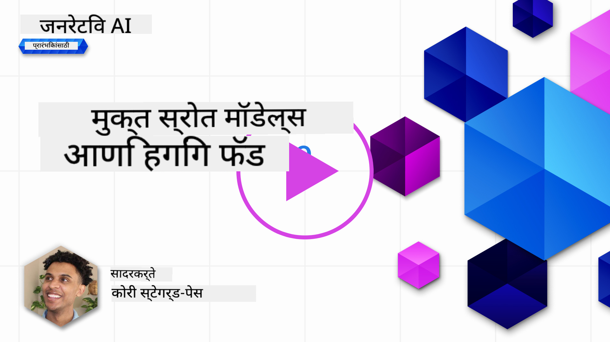
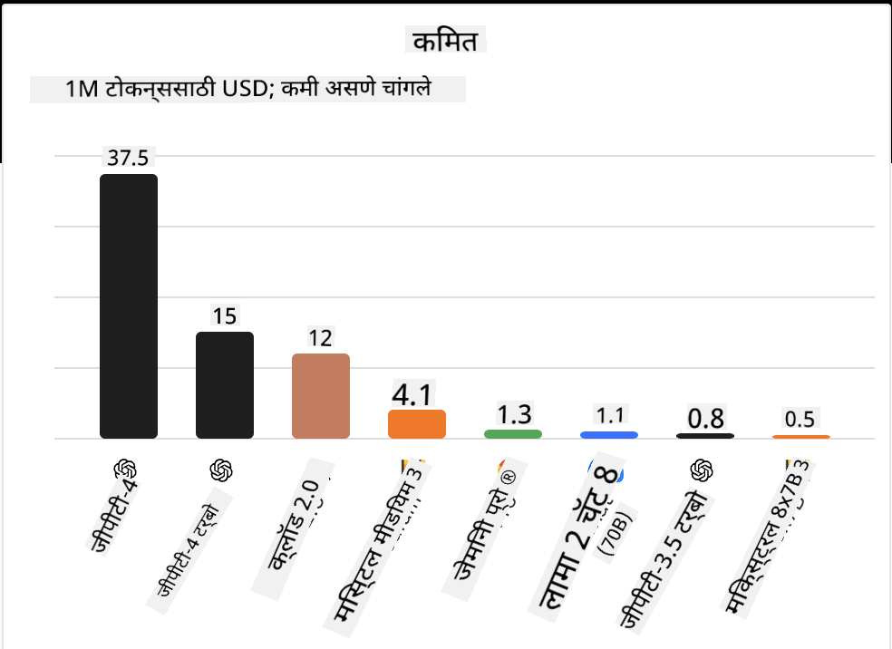
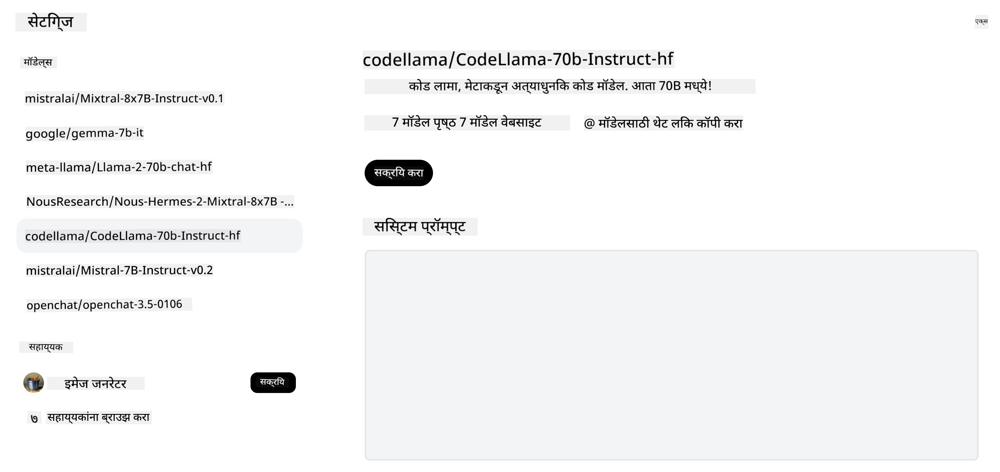
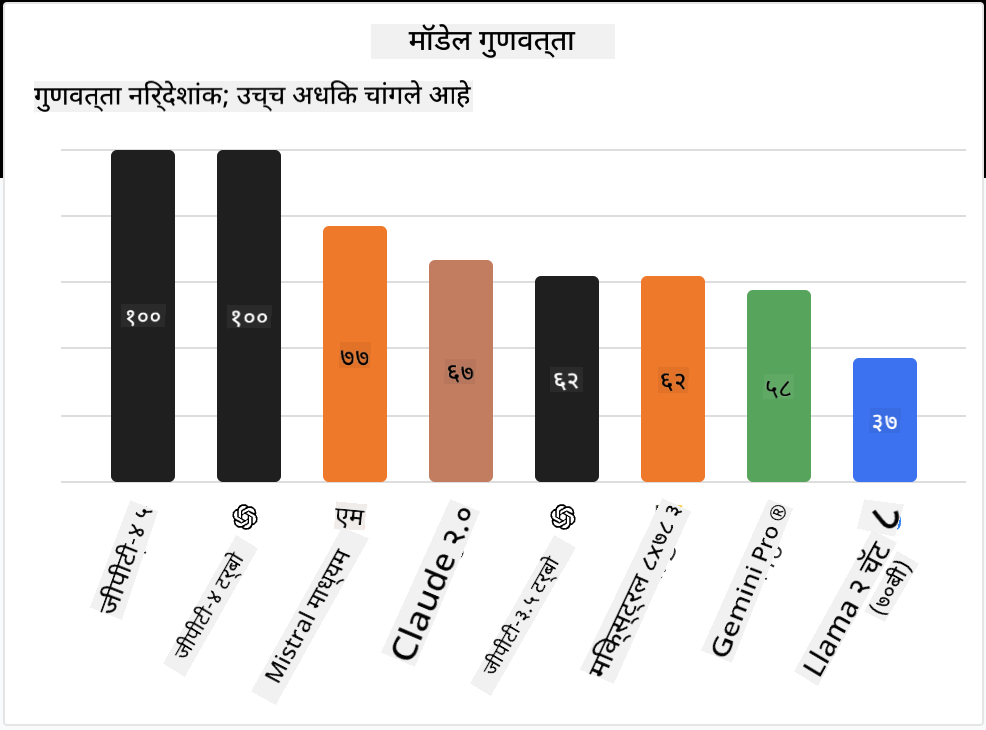

<!--
CO_OP_TRANSLATOR_METADATA:
{
  "original_hash": "a2a83aac52158c23161046cbd13faa2b",
  "translation_date": "2025-10-17T13:45:53+00:00",
  "source_file": "16-open-source-models/README.md",
  "language_code": "mr"
}
-->

## परिचय

ओपन-सोर्स LLMs चा जग रोमांचक आणि सतत बदलत आहे. या धड्याचा उद्देश ओपन सोर्स मॉडेल्सचा सखोल अभ्यास करणे आहे. जर तुम्हाला मालकी हक्क असलेल्या मॉडेल्स आणि ओपन सोर्स मॉडेल्स यांची तुलना कशी करायची याबद्दल माहिती हवी असेल, तर ["Exploring and Comparing Different LLMs" lesson](../02-exploring-and-comparing-different-llms/README.md?WT.mc_id=academic-105485-koreyst) येथे जा. या धड्यात फाइन-ट्यूनिंगचा विषय देखील समाविष्ट केला जाईल, परंतु अधिक तपशीलवार स्पष्टीकरण ["Fine-Tuning LLMs" lesson](../18-fine-tuning/README.md?WT.mc_id=academic-105485-koreyst) मध्ये सापडेल.

## शिकण्याची उद्दिष्टे

- ओपन सोर्स मॉडेल्सची समज मिळवा
- ओपन सोर्स मॉडेल्ससह काम करण्याचे फायदे समजून घ्या
- Hugging Face आणि Azure AI Studio वर उपलब्ध ओपन मॉडेल्सचा अभ्यास करा

## ओपन सोर्स मॉडेल्स म्हणजे काय?

ओपन सोर्स सॉफ्टवेअरने विविध क्षेत्रांमध्ये तंत्रज्ञानाच्या वाढीसाठी महत्त्वाची भूमिका बजावली आहे. ओपन सोर्स इनिशिएटिव्ह (OSI) ने सॉफ्टवेअरला ओपन सोर्स म्हणून वर्गीकृत करण्यासाठी [10 निकष](https://web.archive.org/web/20241126001143/https://opensource.org/osd?WT.mc_id=academic-105485-koreyst) परिभाषित केले आहेत. स्त्रोत कोड OSI द्वारे मंजूर केलेल्या परवान्याखाली उघडपणे सामायिक केला पाहिजे.

LLMs च्या विकासामध्ये सॉफ्टवेअर विकसित करण्यासारखे घटक असले तरी प्रक्रिया तंतोतंत समान नाही. यामुळे LLMs च्या संदर्भात ओपन सोर्सची व्याख्या यावर समुदायामध्ये बरीच चर्चा झाली आहे. पारंपरिक ओपन सोर्स व्याख्येशी जुळण्यासाठी मॉडेलसाठी खालील माहिती सार्वजनिकपणे उपलब्ध असावी:

- मॉडेल प्रशिक्षणासाठी वापरलेले डेटासेट.
- प्रशिक्षणाचा एक भाग म्हणून पूर्ण मॉडेल वजन.
- मूल्यांकन कोड.
- फाइन-ट्यूनिंग कोड.
- पूर्ण मॉडेल वजन आणि प्रशिक्षण मेट्रिक्स.

सध्या फक्त काही मॉडेल्स या निकषांशी जुळतात. [Allen Institute for Artificial Intelligence (AllenAI) द्वारे तयार केलेले OLMo मॉडेल](https://huggingface.co/allenai/OLMo-7B?WT.mc_id=academic-105485-koreyst) या श्रेणीमध्ये बसते.

या धड्यासाठी, आम्ही मॉडेल्सला "ओपन मॉडेल्स" म्हणून संबोधू कारण लेखनाच्या वेळी ते वरील निकषांशी जुळत नसतील.

## ओपन मॉडेल्सचे फायदे

**अत्यंत सानुकूलनीय** - ओपन मॉडेल्स तपशीलवार प्रशिक्षण माहिती सह जारी केल्यामुळे, संशोधक आणि विकसक मॉडेलच्या अंतर्गत भागात बदल करू शकतात. यामुळे विशिष्ट कार्य किंवा अभ्यासाच्या क्षेत्रासाठी अत्यंत विशेष मॉडेल्स तयार करणे शक्य होते. याचे काही उदाहरणे म्हणजे कोड जनरेशन, गणितीय ऑपरेशन्स आणि जीवशास्त्र.

**खर्च** - या मॉडेल्सचा वापर आणि तैनातीसाठी प्रति टोकन खर्च मालकी हक्क असलेल्या मॉडेल्सच्या तुलनेत कमी आहे. जनरेटिव्ह AI अनुप्रयोग तयार करताना, तुमच्या वापराच्या प्रकरणावर काम करताना कार्यक्षमता विरुद्ध किंमत विचारात घेणे आवश्यक आहे.

  
स्त्रोत: Artificial Analysis

**लवचिकता** - ओपन मॉडेल्ससह काम केल्याने वेगवेगळ्या मॉडेल्सचा वापर किंवा त्यांचे संयोजन करण्याच्या बाबतीत लवचिकता मिळते. याचे एक उदाहरण म्हणजे [HuggingChat Assistants](https://huggingface.co/chat?WT.mc_id=academic-105485-koreyst) जिथे वापरकर्ता थेट यूजर इंटरफेसमध्ये वापरलेले मॉडेल निवडू शकतो:

## वेगवेगळ्या ओपन मॉडेल्सचा अभ्यास

### Llama 2

[LLama2](https://huggingface.co/meta-llama?WT.mc_id=academic-105485-koreyst), Meta द्वारे विकसित केलेले, चॅट आधारित अनुप्रयोगांसाठी अनुकूलित ओपन मॉडेल आहे. याचे कारण त्याच्या फाइन-ट्यूनिंग पद्धतीमध्ये मोठ्या प्रमाणात संवाद आणि मानवी अभिप्राय समाविष्ट आहे. या पद्धतीमुळे मॉडेल मानवी अपेक्षांशी अधिक जुळणारे परिणाम तयार करते ज्यामुळे चांगला वापरकर्ता अनुभव मिळतो.

Llama च्या फाइन-ट्यून केलेल्या आवृत्त्यांचे काही उदाहरणे म्हणजे [Japanese Llama](https://huggingface.co/elyza/ELYZA-japanese-Llama-2-7b?WT.mc_id=academic-105485-koreyst), जे जपानी भाषेत विशेष आहे आणि [Llama Pro](https://huggingface.co/TencentARC/LLaMA-Pro-8B?WT.mc_id=academic-105485-koreyst), जे बेस मॉडेलची सुधारित आवृत्ती आहे.

### Mistral

[Mistral](https://huggingface.co/mistralai?WT.mc_id=academic-105485-koreyst) हे उच्च कार्यक्षमता आणि कार्यक्षमतेवर लक्ष केंद्रित करणारे ओपन मॉडेल आहे. हे Mixture-of-Experts पद्धतीचा वापर करते ज्यामध्ये एक गट विशेष तज्ञ मॉडेल्स एकत्रित करून एक प्रणाली तयार केली जाते जिथे इनपुटनुसार विशिष्ट मॉडेल्स निवडले जातात. यामुळे गणना अधिक प्रभावी होते कारण मॉडेल्स फक्त त्यांना विशेष असलेल्या इनपुट्सना संबोधित करतात.

Mistral च्या फाइन-ट्यून केलेल्या आवृत्त्यांचे काही उदाहरणे म्हणजे [BioMistral](https://huggingface.co/BioMistral/BioMistral-7B?text=Mon+nom+est+Thomas+et+mon+principal?WT.mc_id=academic-105485-koreyst), जे वैद्यकीय क्षेत्रावर लक्ष केंद्रित करते आणि [OpenMath Mistral](https://huggingface.co/nvidia/OpenMath-Mistral-7B-v0.1-hf?WT.mc_id=academic-105485-koreyst), जे गणितीय गणना करते.

### Falcon

[Falcon](https://huggingface.co/tiiuae?WT.mc_id=academic-105485-koreyst) हे Technology Innovation Institute (**TII**) द्वारे तयार केलेले LLM आहे. Falcon-40B 40 अब्ज पॅरामीटर्सवर प्रशिक्षित केले गेले आहे ज्याने GPT-3 पेक्षा कमी गणना बजेटसह चांगली कामगिरी केली आहे. हे FlashAttention अल्गोरिदम आणि मल्टीक्वेरी अटेंशनचा वापर करते ज्यामुळे इनफरन्स वेळेच्या वेळी मेमरी आवश्यकता कमी होते. या कमी इनफरन्स वेळेसह, Falcon-40B चॅट अनुप्रयोगांसाठी योग्य आहे.

Falcon च्या फाइन-ट्यून केलेल्या आवृत्त्यांचे काही उदाहरणे म्हणजे [OpenAssistant](https://huggingface.co/OpenAssistant/falcon-40b-sft-top1-560?WT.mc_id=academic-105485-koreyst), ओपन मॉडेल्सवर आधारित असिस्टंट आणि [GPT4ALL](https://huggingface.co/nomic-ai/gpt4all-falcon?WT.mc_id=academic-105485-koreyst), जे बेस मॉडेलपेक्षा उच्च कार्यक्षमता देते.

## कसे निवडावे

ओपन मॉडेल निवडण्यासाठी एकच उत्तर नाही. सुरुवात करण्यासाठी Azure AI Studio च्या टास्कनुसार फिल्टर फीचरचा वापर करणे चांगले ठिकाण आहे. हे तुम्हाला मॉडेलने कोणत्या प्रकारच्या कार्यांसाठी प्रशिक्षण दिले आहे हे समजण्यास मदत करेल. Hugging Face देखील LLM Leaderboard ठेवते जे विशिष्ट मेट्रिक्सवर आधारित सर्वोत्तम कार्य करणारी मॉडेल्स दर्शवते.

वेगवेगळ्या प्रकारांमध्ये LLMs ची तुलना करताना, [Artificial Analysis](https://artificialanalysis.ai/?WT.mc_id=academic-105485-koreyst) हे आणखी एक उत्कृष्ट साधन आहे:

  
स्त्रोत: Artificial Analysis

जर विशिष्ट वापराच्या प्रकरणावर काम करत असाल, तर त्याच क्षेत्रावर लक्ष केंद्रित केलेल्या फाइन-ट्यून केलेल्या आवृत्त्या शोधणे प्रभावी ठरू शकते. तुमच्या आणि तुमच्या वापरकर्त्यांच्या अपेक्षेनुसार ते कसे कार्य करतात हे पाहण्यासाठी अनेक ओपन मॉडेल्ससह प्रयोग करणे ही आणखी एक चांगली पद्धत आहे.

## पुढील पायऱ्या

ओपन मॉडेल्सचा सर्वोत्तम भाग म्हणजे तुम्ही त्यांच्यासोबत काम करणे लवकर सुरू करू शकता. [Azure AI Foundry Model Catalog](https://ai.azure.com?WT.mc_id=academic-105485-koreyst) पहा, ज्यामध्ये आम्ही येथे चर्चा केलेल्या मॉडेल्ससह Hugging Face संग्रह वैशिष्ट्यीकृत आहे.

## शिक्षण येथे थांबत नाही, प्रवास सुरू ठेवा

हा धडा पूर्ण केल्यानंतर, आमचा [Generative AI Learning collection](https://aka.ms/genai-collection?WT.mc_id=academic-105485-koreyst) पहा आणि तुमचे जनरेटिव्ह AI ज्ञान वाढवत रहा!

---

**अस्वीकरण**:  
हा दस्तऐवज AI भाषांतर सेवा [Co-op Translator](https://github.com/Azure/co-op-translator) वापरून भाषांतरित करण्यात आला आहे. आम्ही अचूकतेसाठी प्रयत्नशील असलो तरी, कृपयास लक्षात ठेवा की स्वयंचलित भाषांतरे त्रुटी किंवा अचूकतेच्या अभावाने युक्त असू शकतात. मूळ भाषेतील दस्तऐवज हा अधिकृत स्रोत मानला जावा. महत्त्वाच्या माहितीसाठी, व्यावसायिक मानवी भाषांतराची शिफारस केली जाते. या भाषांतराचा वापर करून उद्भवलेल्या कोणत्याही गैरसमज किंवा चुकीच्या अर्थासाठी आम्ही जबाबदार राहणार नाही.