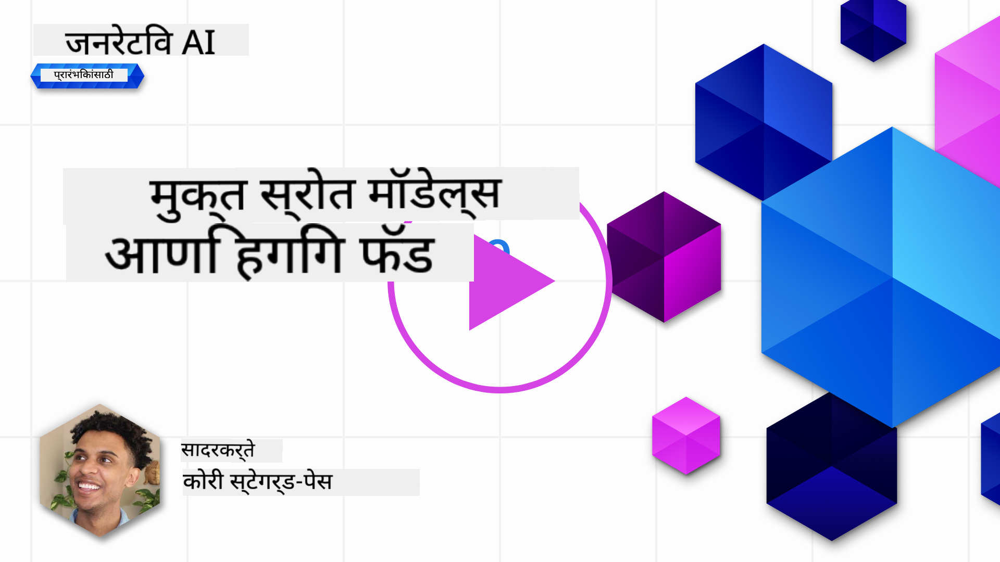
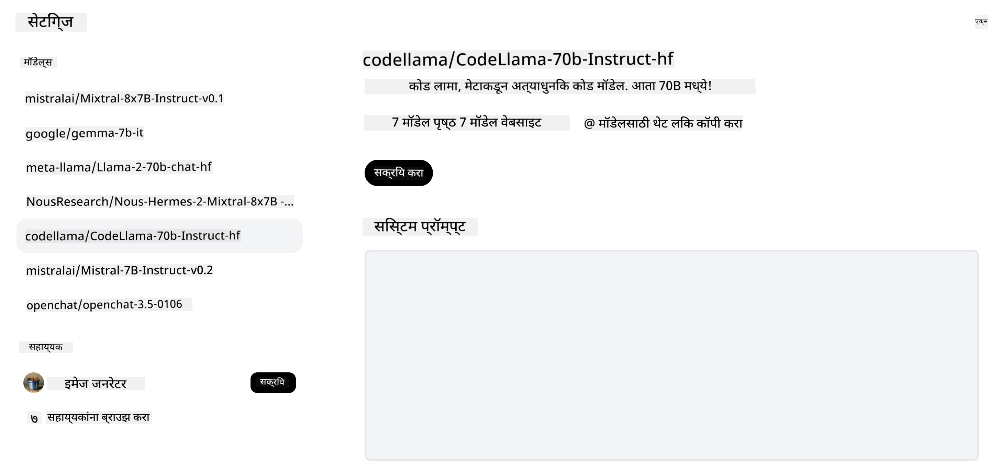
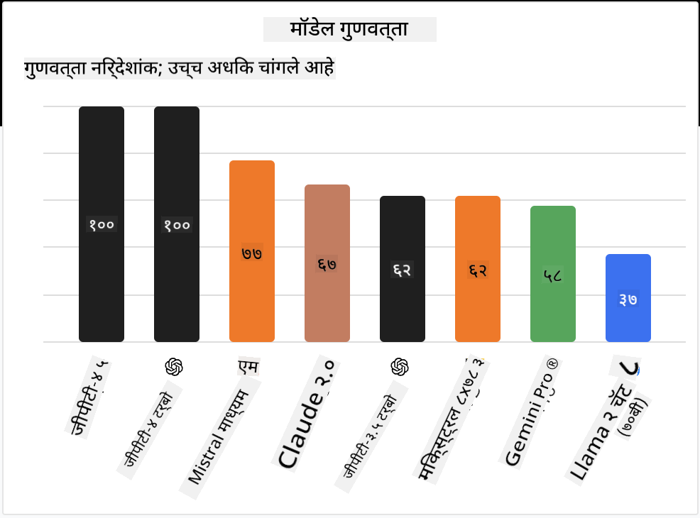

<!--
CO_OP_TRANSLATOR_METADATA:
{
  "original_hash": "0bba96e53ab841d99db731892a51fab8",
  "translation_date": "2025-06-25T23:53:07+00:00",
  "source_file": "16-open-source-models/README.md",
  "language_code": "mr"
}
-->

## परिचय

ओपन-सोर्स LLM चा जग रोमांचक आणि सतत विकसित होत आहे. या धड्याचा उद्देश ओपन-सोर्स मॉडेल्सचा सखोल अभ्यास करणे आहे. जर तुम्हाला मालकी हक्काचे मॉडेल्स ओपन-सोर्स मॉडेल्सशी कसे तुलना करतात याची माहिती हवी असेल, तर ["विविध LLM चा शोध आणि तुलना" धडा](../02-exploring-and-comparing-different-llms/README.md?WT.mc_id=academic-105485-koreyst) पहा. हा धडा फाइन-ट्यूनिंग विषयावर देखील विचार करेल, परंतु अधिक तपशीलवार स्पष्टीकरण ["फाइन-ट्यूनिंग LLMs" धडा](../18-fine-tuning/README.md?WT.mc_id=academic-105485-koreyst) मध्ये मिळू शकते.

## शिकण्याची उद्दिष्टे

- ओपन-सोर्स मॉडेल्सचे समज मिळवा
- ओपन-सोर्स मॉडेल्ससह काम करण्याचे फायदे समजून घ्या
- Hugging Face आणि Azure AI Studio वर उपलब्ध ओपन मॉडेल्सचा शोध घ्या

## ओपन-सोर्स मॉडेल्स काय आहेत?

विविध क्षेत्रांमध्ये तंत्रज्ञानाच्या वाढीमध्ये ओपन-सोर्स सॉफ्टवेअरने महत्त्वपूर्ण भूमिका बजावली आहे. ओपन-सोर्स इनिशिएटिव्ह (OSI) ने सॉफ्टवेअरला ओपन-सोर्स म्हणून वर्गीकृत करण्यासाठी [10 निकष](https://web.archive.org/web/20241126001143/https://opensource.org/osd?WT.mc_id=academic-105485-koreyst) परिभाषित केले आहेत. OSI ने मंजूर केलेल्या परवान्याखाली स्त्रोत कोड खुलेपणाने सामायिक केला पाहिजे.

LLMs च्या विकासात सॉफ्टवेअर विकसित करण्यासारखे घटक असले तरी प्रक्रिया नेमकी तीच नाही. LLM च्या संदर्भात ओपन-सोर्सची व्याख्या यावर समुदायात बरीच चर्चा झाली आहे. पारंपारिक ओपन-सोर्स व्याख्येशी मॉडेल जुळण्यासाठी खालील माहिती सार्वजनिकपणे उपलब्ध असावी:

- मॉडेलला प्रशिक्षण देण्यासाठी वापरलेले डेटासेट्स.
- प्रशिक्षणाचा एक भाग म्हणून पूर्ण मॉडेल वेट्स.
- मूल्यांकन कोड.
- फाइन-ट्यूनिंग कोड.
- पूर्ण मॉडेल वेट्स आणि प्रशिक्षण मेट्रिक्स.

सध्या फक्त काही मॉडेल्स या निकषाशी जुळतात. [Allen Institute for Artificial Intelligence (AllenAI) द्वारे तयार केलेले OLMo मॉडेल](https://huggingface.co/allenai/OLMo-7B?WT.mc_id=academic-105485-koreyst) या श्रेणीत बसते.

या धड्यासाठी, आम्ही मॉडेल्सला "ओपन मॉडेल्स" म्हणून संदर्भित करू कारण लेखनाच्या वेळी ते वरील निकषाशी जुळत नाहीत.

## ओपन मॉडेल्सचे फायदे

**अत्यंत सानुकूलनक्षम** - ओपन मॉडेल्स तपशीलवार प्रशिक्षण माहितीसह रिलीज केल्यामुळे, संशोधक आणि विकसक मॉडेलच्या अंतर्गत संरचनेत बदल करू शकतात. हे विशिष्ट कार्य किंवा अभ्यासाच्या क्षेत्रासाठी सूक्ष्म-ट्यून केलेले अत्यंत विशेष मॉडेल्स तयार करण्यास सक्षम करते. याचे काही उदाहरणे कोड जनरेशन, गणितीय ऑपरेशन्स आणि जीवशास्त्र आहेत.

**खर्च** - या मॉडेल्सचा वापर आणि तैनात करण्यासाठी प्रति टोकन खर्च मालकी हक्काच्या मॉडेल्सपेक्षा कमी आहे. जेनेरेटिव्ह AI अनुप्रयोग तयार करताना, तुमच्या वापराच्या प्रकरणावर काम करताना कार्यक्षमता आणि किंमत यावर विचार केला पाहिजे.

 स्त्रोत: कृत्रिम विश्लेषण

**लवचिकता** - ओपन मॉडेल्ससह काम केल्यामुळे तुम्हाला वेगवेगळ्या मॉडेल्सचा वापर करण्यासाठी किंवा त्यांचे संयोजन करण्यासाठी लवचिकता मिळते. याचे एक उदाहरण [HuggingChat सहाय्यक](https://huggingface.co/chat?WT.mc_id=academic-105485-koreyst) आहे जिथे वापरकर्ता थेट वापरकर्ता इंटरफेसमध्ये वापरलेले मॉडेल निवडू शकतो:

## विविध ओपन मॉडेल्सचा शोध

### Llama 2

[LLama2](https://huggingface.co/meta-llama?WT.mc_id=academic-105485-koreyst), Meta द्वारे विकसित केलेले एक ओपन मॉडेल आहे जे चॅट आधारित अनुप्रयोगांसाठी अनुकूलित आहे. हे त्याच्या फाइन-ट्यूनिंग पद्धतीमुळे आहे, ज्यामध्ये मोठ्या प्रमाणात संवाद आणि मानवी अभिप्राय समाविष्ट होता. या पद्धतीसह, मॉडेल मानवी अपेक्षेशी जुळणारे अधिक परिणाम तयार करते जे चांगला वापरकर्ता अनुभव प्रदान करते.

Llama चे फाइन-ट्यून केलेले काही आवृत्त्यांचे उदाहरणे [जपानी Llama](https://huggingface.co/elyza/ELYZA-japanese-Llama-2-7b?WT.mc_id=academic-105485-koreyst), जे जपानी भाषेत विशेष आहे आणि [Llama Pro](https://huggingface.co/TencentARC/LLaMA-Pro-8B?WT.mc_id=academic-105485-koreyst), जे बेस मॉडेलचे सुधारित आवृत्ती आहे.

### Mistral

[Mistral](https://huggingface.co/mistralai?WT.mc_id=academic-105485-koreyst) एक ओपन मॉडेल आहे ज्याचा उच्च कार्यक्षमता आणि कार्यक्षमतेवर जोर आहे. हे Mixture-of-Experts दृष्टिकोन वापरते जे एक विशेष तज्ञ मॉडेल्सच्या गटाला एक प्रणालीमध्ये एकत्रित करते जिथे इनपुटच्या आधारे, विशिष्ट मॉडेल्स निवडले जातात. हे गणना अधिक प्रभावी बनवते कारण मॉडेल्स केवळ त्यांच्या विशेषीकृत इनपुट्सवर लक्ष केंद्रित करतात.

Mistral चे फाइन-ट्यून केलेले काही आवृत्त्यांचे उदाहरणे [BioMistral](https://huggingface.co/BioMistral/BioMistral-7B?text=Mon+nom+est+Thomas+et+mon+principal?WT.mc_id=academic-105485-koreyst), जे वैद्यकीय क्षेत्रावर लक्ष केंद्रित करते आणि [OpenMath Mistral](https://huggingface.co/nvidia/OpenMath-Mistral-7B-v0.1-hf?WT.mc_id=academic-105485-koreyst), जे गणितीय गणना करते.

### Falcon

[Falcon](https://huggingface.co/tiiuae?WT.mc_id=academic-105485-koreyst) हे तंत्रज्ञान इनोव्हेशन संस्थेने (**TII**) तयार केलेले LLM आहे. Falcon-40B चे 40 अब्ज पॅरामीटर्सवर प्रशिक्षण देण्यात आले होते ज्याने कमी संगणकीय बजेटसह GPT-3 पेक्षा चांगली कामगिरी दर्शविली आहे. हे FlashAttention अल्गोरिदम आणि मल्टीक्वेरी अटेन्शनच्या वापरामुळे आहे जे त्याला अनुमानाच्या वेळी मेमरीच्या आवश्यकतांना कमी करण्यास सक्षम करते. या कमी केलेल्या अनुमानाच्या वेळेसह, Falcon-40B चॅट अनुप्रयोगांसाठी योग्य आहे.

Falcon चे फाइन-ट्यून केलेले काही आवृत्त्यांचे उदाहरणे [OpenAssistant](https://huggingface.co/OpenAssistant/falcon-40b-sft-top1-560?WT.mc_id=academic-105485-koreyst), ओपन मॉडेल्सवर तयार केलेले एक सहाय्यक आणि [GPT4ALL](https://huggingface.co/nomic-ai/gpt4all-falcon?WT.mc_id=academic-105485-koreyst), जे बेस मॉडेलपेक्षा उच्च कार्यक्षमता देते.

## कसे निवडावे

ओपन मॉडेल निवडण्यासाठी एकच उत्तर नाही. Azure AI Studio च्या कार्यानुसार फिल्टर फीचर वापरणे एक चांगली सुरुवात आहे. हे तुम्हाला मॉडेल कोणत्या प्रकारच्या कार्यांसाठी प्रशिक्षित केले गेले आहे हे समजण्यास मदत करेल. Hugging Face देखील एक LLM लीडरबोर्ड राखते जे विशिष्ट मेट्रिक्सवर आधारित सर्वोत्तम कार्य करणारे मॉडेल्स दर्शवते.

विविध प्रकारांमध्ये LLM ची तुलना करताना, [Artificial Analysis](https://artificialanalysis.ai/?WT.mc_id=academic-105485-koreyst) आणखी एक उत्तम संसाधन आहे:

 स्त्रोत: कृत्रिम विश्लेषण

जर विशिष्ट वापराच्या प्रकरणावर काम करत असाल, तर त्याच क्षेत्रावर लक्ष केंद्रित केलेल्या फाइन-ट्यून केलेल्या आवृत्त्यांचा शोध घेणे प्रभावी ठरू शकते. तुमच्या आणि तुमच्या वापरकर्त्यांच्या अपेक्षेनुसार ते कसे कार्य करतात हे पाहण्यासाठी एकाधिक ओपन मॉडेल्ससह प्रयोग करणे ही आणखी एक चांगली पद्धत आहे.

## पुढील पायऱ्या

ओपन मॉडेल्सचा सर्वात चांगला भाग म्हणजे तुम्ही त्यांच्याशी काम करणे लवकर सुरू करू शकता. [Azure AI Studio मॉडेल कॅटलॉग](https://ai.azure.com?WT.mc_id=academic-105485-koreyst) पहा, ज्यामध्ये आम्ही येथे चर्चा केलेल्या मॉडेल्ससह एक विशिष्ट Hugging Face संग्रह आहे.

## शिक्षण येथे थांबत नाही, प्रवास सुरू ठेवा

हा धडा पूर्ण केल्यानंतर, आमचा [Generative AI Learning collection](https://aka.ms/genai-collection?WT.mc_id=academic-105485-koreyst) पहा जेणेकरून तुमचे जेनेरेटिव्ह AI ज्ञान वाढवता येईल!

**अस्वीकृती:**
हे दस्तऐवज AI अनुवाद सेवा [Co-op Translator](https://github.com/Azure/co-op-translator) वापरून अनुवादित करण्यात आले आहे. आम्ही अचूकतेसाठी प्रयत्न करतो, परंतु कृपया लक्षात ठेवा की स्वयंचलित अनुवादांमध्ये त्रुटी किंवा अचूकतेचा अभाव असू शकतो. मूळ भाषेतील दस्तऐवज अधिकृत स्रोत मानला पाहिजे. महत्त्वपूर्ण माहितीसाठी, व्यावसायिक मानवी अनुवादाची शिफारस केली जाते. या अनुवादाच्या वापरामुळे उद्भवलेल्या कोणत्याही गैरसमज किंवा चुकीच्या अर्थासाठी आम्ही जबाबदार नाही.