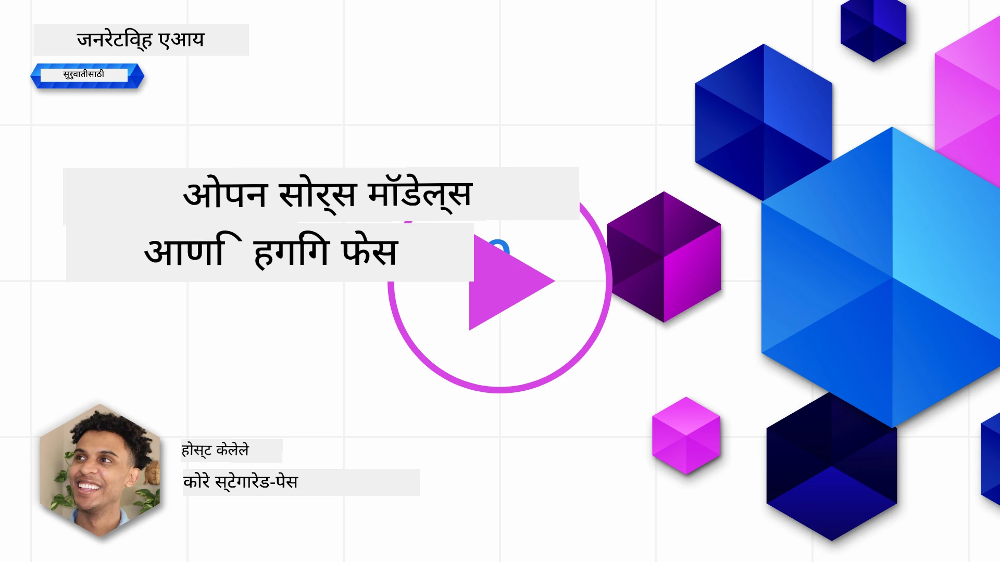
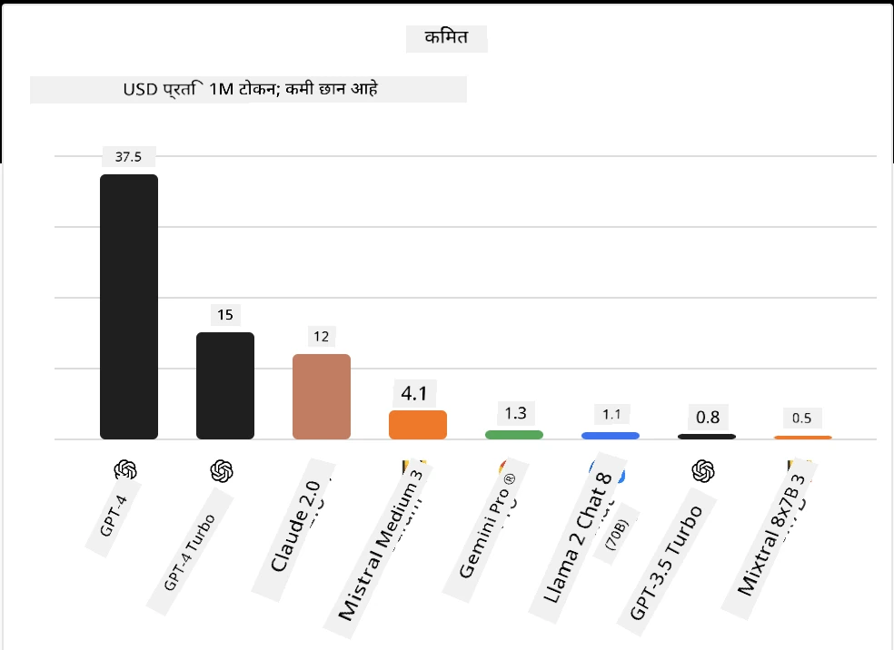
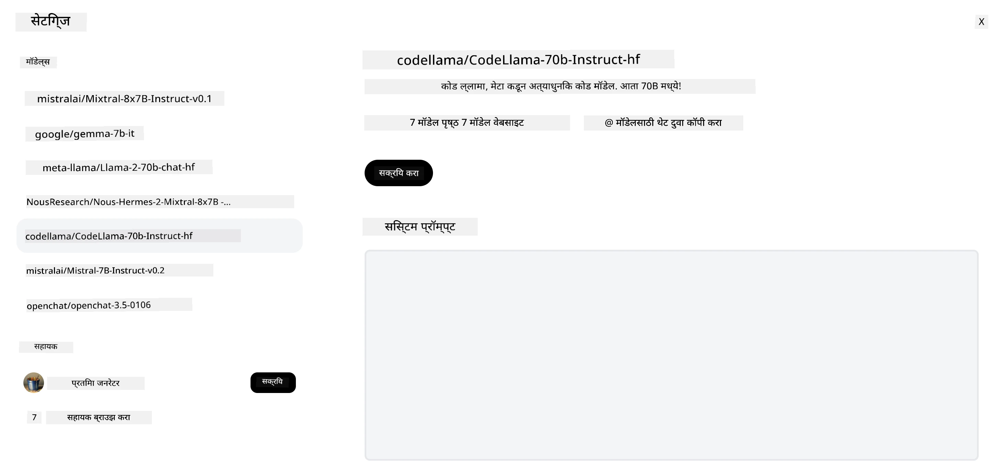
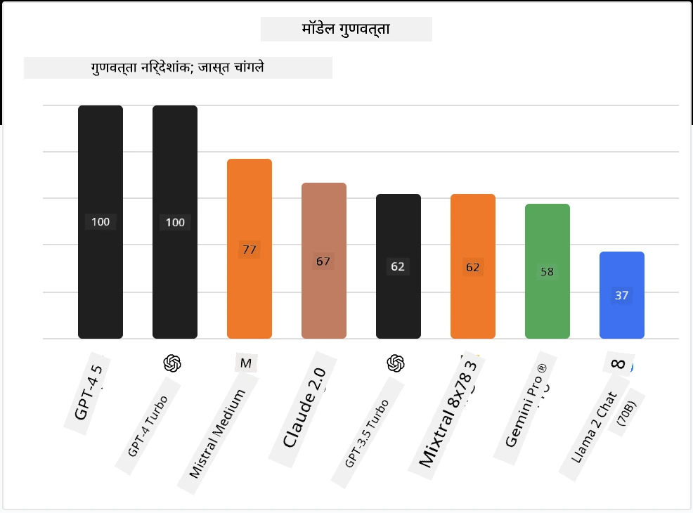

## परिचय

मुक्त-स्रोत LLM जग रोमांचक आणि सतत विकसित होत आहे. हा धडा मुक्त स्रोत मॉडेल्सवर खोलवर पाहणी करण्याचा उद्देश ठेवतो. तुम्हाला माहिती हवी असल्यास की मालकीच्या मॉडेल्सची मुक्त स्रोत मॉडेल्सशी तुलना कशी होते, तर ["वेगवेगळ्या LLMs चा अभ्यास आणि तुलना" धडा](../02-exploring-and-comparing-different-llms/README.md?WT.mc_id=academic-105485-koreyst) येथे जा. हा धडा फाइन-ट्यूनिंग विषयावर देखील कव्हर करतो पण त्याचे अधिक सविस्तर स्पष्टीकरण ["LLMs फाइन-ट्यूनिंग" धडा](../18-fine-tuning/README.md?WT.mc_id=academic-105485-koreyst) मध्ये मिळेल.

## शिकण्याचे उद्दिष्टे

- मुक्त स्रोत मॉडेल्सची समज प्राप्त करा
- मुक्त स्रोत मॉडेल्ससह कार्य करण्याचे फायदे समजून घ्या
- Hugging Face आणि Microsoft Foundry मॉडेल कॅटलॉगवर उपलब्ध खुले मॉडेल्सचा अभ्यास करा

## मुक्त स्रोत मॉडेल्स म्हणजे काय?

मुक्त स्रोत सॉफ्टवेअरने विविध शाखांमधील तंत्रज्ञानाच्या विकासात महत्त्वाची भूमिका बजावली आहे. Open Source Initiative (OSI) ने [१० निकष](https://web.archive.org/web/20241126001143/https://opensource.org/osd?WT.mc_id=academic-105485-koreyst) निश्चित केले आहेत ज्यांच्या आधारावर सॉफ्टवेअरला मुक्त स्रोत म्हणून वर्गीकृत केले जाते. स्रोत कोड ही OSI द्वारे मान्यताप्राप्त परवान्याअंतर्गत खुलेपणाने सामायिक केला जातो.

जिथे LLMs चा विकास सॉफ्टवेअर विकासासारखा आहे, तथापि प्रक्रिया अगदी सारखी नाही. त्यामुळे LLMs च्या संदर्भात मुक्त स्रोत याच्या व्याख्येबाबत समुदायात भरपूर चर्चा झाली आहे. पारंपारिक मुक्त स्रोत व्याख्येशी सुसंगत राहण्यासाठी खालील माहिती सार्वजनिकपणे उपलब्ध असणे आवश्यक आहे:

- मॉडेल ट्रेन करण्यासाठी वापरलेली डेटासेट्स.
- प्रशिक्षणाचा एक भाग म्हणून पूर्ण मॉडेल वेट्स.
- मूल्यमापन कोड.
- फाइन-ट्यूनिंग कोड.
- पूर्ण मॉडेल वेट्स आणि प्रशिक्षण मेट्रिक्स.

सध्याच्या काळात केवळ काही मॉडेल्स या निकषांशी सुसंगत आहेत. [Allen Institute for Artificial Intelligence (AllenAI) द्वारे तयार केलेला OLMo मॉडेल](https://huggingface.co/allenai/OLMo-7B?WT.mc_id=academic-105485-koreyst) या श्रेणीत येतो.

या धड्यासाठी, पुढे आम्ही मॉडेल्सना "ओपन मॉडेल्स" असे संबोधू, कारण त्यांनी आताच्या वेळी वर दिलेल्या निकषांशी जुळणार नाही असा काहीसा धोका आहे.

## मुक्त मॉडेल्सचे फायदे

**अत्यंत सानुकूलायोग्य** - मुक्त मॉडेल्ससह सविस्तर प्रशिक्षण माहिती दिल्यामुळे संशोधक आणि विकसक मॉडेलच्या अंतर्गत रचनेत बदल करू शकतात. हे मॉडेल योग्य प्रकारे विशिष्ट कार्य किंवा अभ्यासक्षेत्रासाठी फाइन-ट्यून करता येते. यामध्ये कोड निर्मिती, गणितीय क्रिया आणि जीवशास्त्र यांचा समावेश आहे.

**खर्च** - या मॉडेल्सचा वापर आणि तैनाती यासाठी प्रति टोकन खर्च मालकीच्या मॉडेल्सच्या तुलनेत कमी असतो. Generative AI अनुप्रयोग तयार करताना वापर प्रकरणानुसार कार्यक्षमता व किंमत यांचा विचार करणे महत्त्वाचे आहे.

स्रोत: Artificial Analysis

**लवचिकता** - मुक्त मॉडेल्ससह वेगवेगळे मॉडेल वापरणे किंवा एकत्र करणे याबाबत लवचिकता मिळते. याचे उदाहरण म्हणजे [HuggingChat सहाय्यक](https://huggingface.co/chat?WT.mc_id=academic-105485-koreyst) जिथे वापरकर्ता थेट उपयोगकर्ता इंटरफेसमध्ये वापरल्या जाणाऱ्या मॉडेलची निवड करू शकतो:

## वेगवेगळ्या मुक्त मॉडेल्सचा अभ्यास

### Llama 2

[LLama2](https://huggingface.co/meta-llama?WT.mc_id=academic-105485-koreyst), मेटा द्वारे विकसित केलेले, हे मुक्त मॉडेल संवाद आधारित अनुप्रयोगांसाठी ऑप्टिमाइझ केलेले आहे. याचे मूल कारण म्हणजे त्याचा फाइन-ट्यूनिंग पद्धत ज्यात मोठ्या प्रमाणात संवाद आणि मानवी अभिप्राय समाविष्ट आहे. या पद्धतीमुळे मॉडेल मानवी अपेक्षांशी अधिक अनुरूप निकाल तयार करते, जे वापरकर्त्यांना चांगला अनुभव देते.

Llama च्या फाइन-ट्यून केलेल्या आवृत्त्यांमध्ये [जपानी Llama](https://huggingface.co/elyza/ELYZA-japanese-Llama-2-7b?WT.mc_id=academic-105485-koreyst) समाविष्ट आहे जी जपानी भाषेत कौशल्य असलेली आहे आणि [Llama Pro](https://huggingface.co/TencentARC/LLaMA-Pro-8B?WT.mc_id=academic-105485-koreyst) जी मूळ मॉडेलच्या सुधारित आवृत्ती आहे.

### Mistral

[Mistral](https://huggingface.co/mistralai?WT.mc_id=academic-105485-koreyst) हा एक मुक्त मॉडेल आहे जो उच्च कार्यक्षमता आणि कार्यक्षमता यावर भर देतो. हे Mixture-of-Experts पद्धत वापरते ज्यामध्ये विशेष कौशल्य असलेल्या विशेषज्ञ मॉडेल्सचा समूह एकत्र केला जातो, इनपुटनुसार विशिष्ट मॉडेल निवडले जातात. त्यामुळे गणना अधिक प्रभावी होते कारण मॉडेल्स केवळ त्यांना विशेषज्ञ असलेल्या इनपुटवरच काम करतात.

Mistral चे काही फाइन-ट्यून केलेले आवृत्ती उदाहरणे म्हणजे [BioMistral](https://huggingface.co/BioMistral/BioMistral-7B?text=Mon+nom+est+Thomas+et+mon+principal?WT.mc_id=academic-105485-koreyst), ज्याचा लक्ष वैद्यकीय क्षेत्रावर आहे आणि [OpenMath Mistral](https://huggingface.co/nvidia/OpenMath-Mistral-7B-v0.1-hf?WT.mc_id=academic-105485-koreyst), जो गणितीय गणना करतो.

### Falcon

[Falcon](https://huggingface.co/tiiuae?WT.mc_id=academic-105485-koreyst) हा LLM Technology Innovation Institute (**TII**) ने तयार केला आहे. Falcon-40B ४० अब्ज पॅरामीटर्सवर प्रशिक्षित आहे ज्याने GPT-3 पेक्षा कमी गणना खर्चात चांगली कामगिरी केली आहे. हे FlashAttention अल्गोरिदम आणि मल्टीक्वेरी अटेन्शन वापरून स्मृतीची गरज कमी करते. कमी इनफरन्स वेळेसह Falcon-40B चॅट अनुप्रयोगांसाठी उपयुक्त आहे.

Falcon च्या काही फाइन-ट्यून आवृत्त्यांमध्ये [OpenAssistant](https://huggingface.co/OpenAssistant/falcon-40b-sft-top1-560?WT.mc_id=academic-105485-koreyst), एक मुक्त मॉडेल्सवर आधारित सहाय्यक आणि [GPT4ALL](https://huggingface.co/nomic-ai/gpt4all-falcon?WT.mc_id=academic-105485-koreyst) ज्याची कार्यक्षमता मूळ मॉडेलच्या पेक्षा जास्त आहे यांचा समावेश आहे.

## कसे निवडावे

मुक्त मॉडेल निवडण्याचे एकच उत्तर नाही. सुरुवात करण्यासाठी Microsoft Foundry मॉडेल कॅटलॉगमधील टास्क नुसार फिल्टर वापरून पाहणे फायदेशीर ठरते. यामुळे तुम्हाला समजेल की कोणत्या प्रकारच्या कार्यासाठी मॉडेल प्रशिक्षित केले आहे. Hugging Face देखील LLM लीडरबोर्ड राखतो जो काही मेट्रिक्सवर आधारित सर्वोत्तम मॉडेल दाखवतो.

वेगवेगळ्या प्रकारांतील LLMs ची तुलना करताना [Artificial Analysis](https://artificialanalysis.ai/?WT.mc_id=academic-105485-koreyst) हा आणखी एक उत्तम साधन आहे:

स्रोत: Artificial Analysis

एखाद्या विशिष्ट वापर प्रकरणावर काम करत असल्यास, त्याच क्षेत्रातील फाइन-ट्यून केलेल्या आवृत्त्यांच्या शोधाचा उपयोग होऊ शकतो. अनेक मुक्त मॉडेल्स वापरून त्यांची कार्यक्षमता तुमच्या आणि वापरकर्त्यांच्या अपेक्षांनुसार कशी आहे हे तपासणे चांगली पद्धत आहे.

## पुढील टप्पे

मुक्त मॉडेल्सबाबत उत्तम गोष्ट म्हणजे तुम्ही त्यांच्याबरोबर काम सुरू करू शकता जलद. [Microsoft Foundry मॉडेल कॅटलॉग](https://ai.azure.com?WT.mc_id=academic-105485-koreyst) येथे बघा, ज्यात तुम्ही येथे चर्चा केलेल्या मॉडेल्ससहित खास Hugging Face संग्रह आहे.

## शिक्षण येथे थांबत नाही, प्रवास सुरू ठेवा

हा धडा पूर्ण केल्यानंतर, आमच्या [Generative AI Learning संग्रह](https://aka.ms/genai-collection?WT.mc_id=academic-105485-koreyst) सरावून तुमचे Generative AI ज्ञान वाढवत राहा!

---

<!-- CO-OP TRANSLATOR DISCLAIMER START -->
**अस्वीकरण**:
हा दस्तऐवज AI भाषांतर सेवा [Co-op Translator](https://github.com/Azure/co-op-translator) चा वापर करून अनुवादित केला आहे. जरी आम्ही अचूकतेसाठी प्रयत्न करतो, तरी कृपया लक्षात घ्या की स्वयंचलित भाषांतरांमध्ये त्रुटी किंवा अचूकतेची कमतरता असू शकते. मूळ दस्तऐवज त्याच्या मूळ भाषेत अधिकृत स्रोत मानला पाहिजे. महत्त्वाची माहिती असल्यास, व्यावसायिक मानवी भाषांतराची शिफारस केली जाते. या भाषांतराच्या वापरामुळे उद्भवणाऱ्या कोणत्याही गैरसमज किंवा चुकीच्या अर्थलावणीसाठी आम्ही जबाबदार नाही.
<!-- CO-OP TRANSLATOR DISCLAIMER END -->