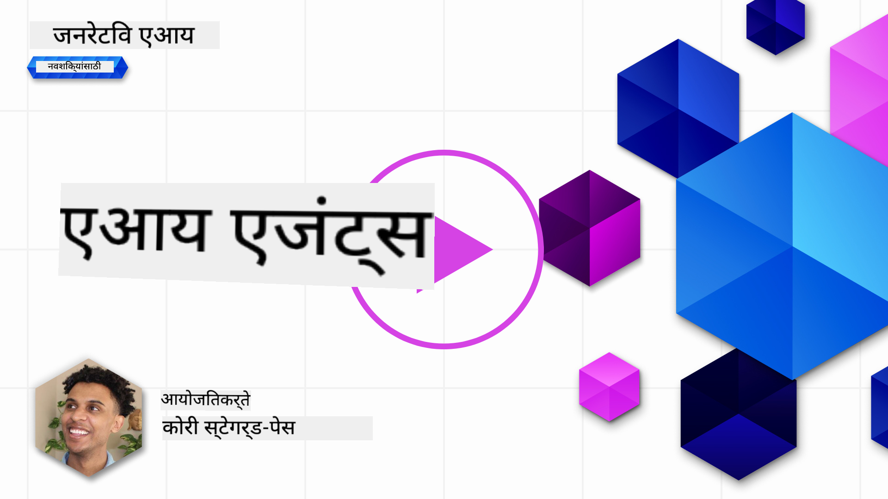
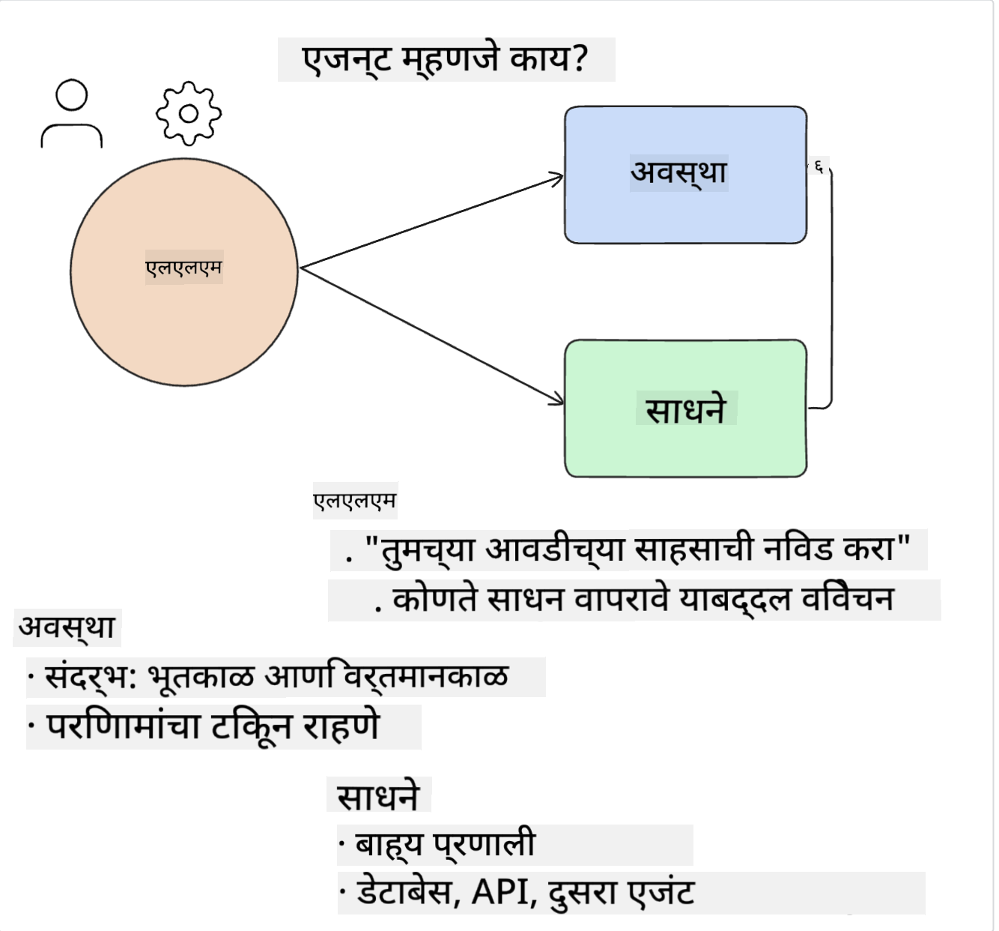
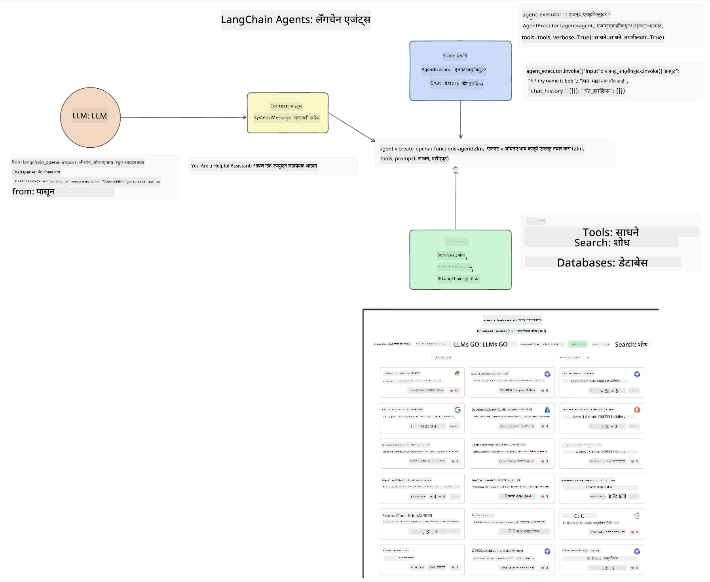
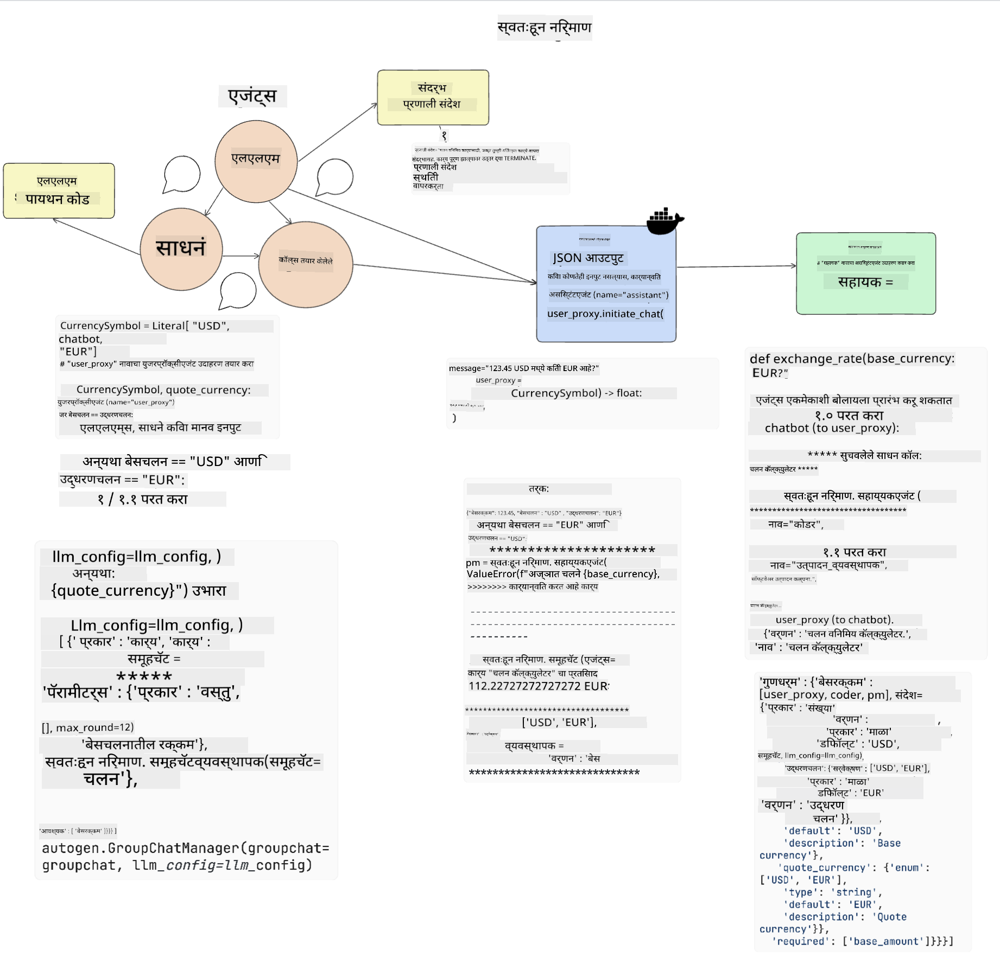
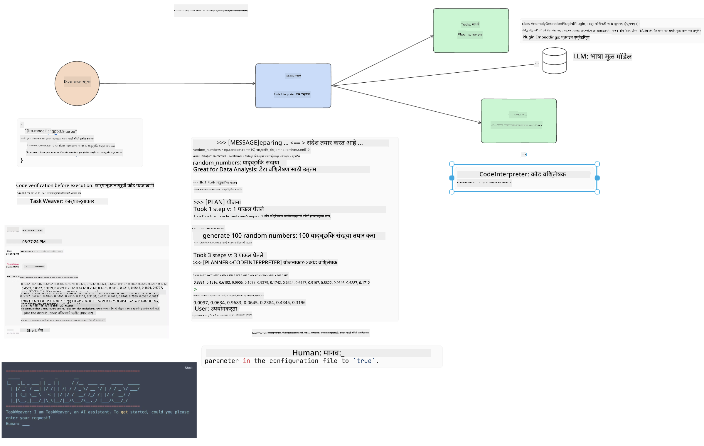
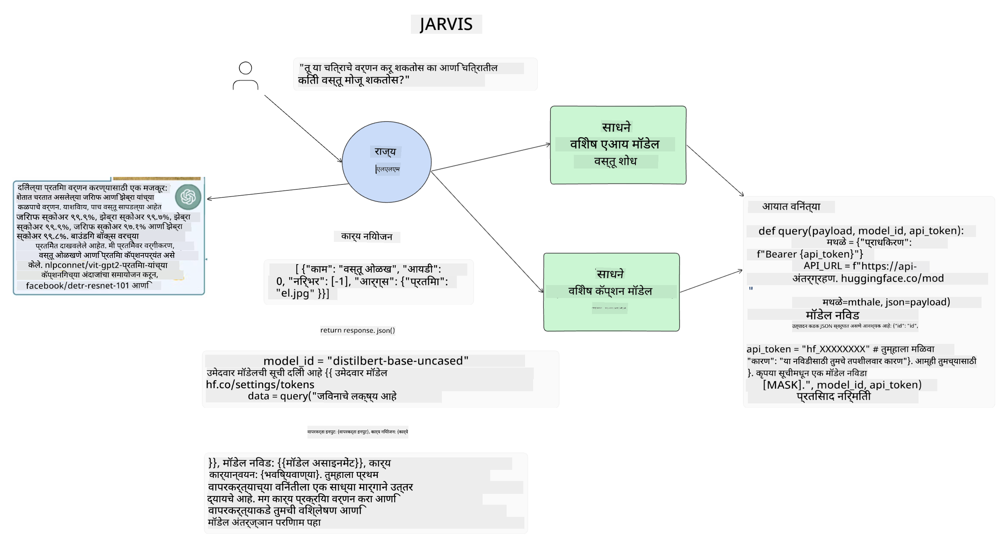

<!--
CO_OP_TRANSLATOR_METADATA:
{
  "original_hash": "11f03c81f190d9cbafd0f977dcbede6c",
  "translation_date": "2025-05-20T07:18:23+00:00",
  "source_file": "17-ai-agents/README.md",
  "language_code": "mr"
}
-->
[](https://aka.ms/gen-ai-lesson17-gh?WT.mc_id=academic-105485-koreyst)

## परिचय

AI एजंट्स जनरेटिव AI मधील एक रोमांचक विकास दर्शवतात, ज्यामुळे मोठ्या भाषा मॉडेल्स (LLMs) सहाय्यकांपासून कृती घेणारे एजंट्समध्ये परिवर्तित होतात. AI एजंट फ्रेमवर्क्स डेव्हलपर्सना LLMs ला साधने आणि राज्य व्यवस्थापनाची प्रवेश देणारी अनुप्रयोग तयार करण्यास सक्षम करतात. हे फ्रेमवर्क्स दृश्यमानता वाढवतात, ज्यामुळे वापरकर्ते आणि डेव्हलपर्सना LLMs द्वारे नियोजित क्रियांचे निरीक्षण करणे शक्य होते, ज्यामुळे अनुभव व्यवस्थापन सुधारते.

पाठात खालील क्षेत्रांचा समावेश असेल:

- AI एजंट काय आहे ते समजून घेणे - AI एजंट नक्की काय आहे?
- चार वेगवेगळ्या AI एजंट फ्रेमवर्क्सचा अभ्यास करणे - त्यांना काय विशेष बनवते?
- विविध वापर प्रकरणांमध्ये हे AI एजंट्स लागू करणे - आम्ही AI एजंट्स कधी वापरावे?

## शिकण्याची उद्दिष्टे

हा पाठ घेतल्यानंतर, आपण सक्षम असाल:

- AI एजंट्स काय आहेत आणि ते कसे वापरले जाऊ शकतात हे स्पष्ट करा.
- काही लोकप्रिय AI एजंट फ्रेमवर्क्समधील फरक समजून घ्या आणि ते कसे वेगळे आहेत.
- AI एजंट्स कसे कार्य करतात हे समजून घ्या जेणेकरून त्यांच्यासह अनुप्रयोग तयार करता येतील.

## AI एजंट्स काय आहेत?

AI एजंट्स जनरेटिव AI च्या जगात एक अत्यंत रोमांचक क्षेत्र आहे. या उत्साहासोबत कधी कधी संज्ञा आणि त्यांच्या अनुप्रयोगाची गोंधळ येतो. गोष्टी सोप्या आणि AI एजंट्सचा संदर्भ देणाऱ्या बहुतेक साधनांचा समावेश करून ठेवण्यासाठी, आम्ही ही व्याख्या वापरणार आहोत:

AI एजंट्स मोठ्या भाषा मॉडेल्स (LLMs) ला **राज्य** आणि **साधने** प्रवेश देऊन कार्ये पूर्ण करण्यास अनुमती देतात.



या संज्ञांची व्याख्या करूया:

**मोठे भाषा मॉडेल्स** - हे या अभ्यासक्रमात संदर्भित मॉडेल्स आहेत जसे की GPT-3.5, GPT-4, Llama-2, इ.

**राज्य** - हे संदर्भित करते त्या संदर्भाला ज्यामध्ये LLM कार्य करत आहे. LLM आपल्या मागील कृतींच्या संदर्भाचा आणि वर्तमान संदर्भाचा वापर करतो, त्याच्या पुढील कृतीसाठी निर्णय घेण्यास मार्गदर्शन करते. AI एजंट फ्रेमवर्क्स डेव्हलपर्सना हा संदर्भ सोप्या पद्धतीने ठेवण्यास अनुमती देतात.

**साधने** - वापरकर्त्याने विनंती केलेले कार्य पूर्ण करण्यासाठी आणि LLM ने नियोजित केलेले कार्य पूर्ण करण्यासाठी LLM ला साधनांची आवश्यकता असते. काही साधनांचे उदाहरणे म्हणजे डेटाबेस, API, बाह्य अनुप्रयोग किंवा दुसरे LLM!

ही व्याख्याने आपल्याला पुढे जाण्यासाठी चांगली जमीन देण्यास मदत करतील जेव्हा आम्ही त्यांची अंमलबजावणी कशी करतो ते पाहतो. काही वेगवेगळ्या AI एजंट फ्रेमवर्क्सचा अभ्यास करूया:

## LangChain Agents

[LangChain Agents](https://python.langchain.com/docs/how_to/#agents?WT.mc_id=academic-105485-koreyst) ही आम्ही वर दिलेल्या व्याख्यानांची अंमलबजावणी आहे.

**राज्य** व्यवस्थापित करण्यासाठी, ते `AgentExecutor` नावाच्या अंगभूत कार्याचा वापर करते. हे परिभाषित `agent` आणि उपलब्ध `tools` स्वीकारते.

`Agent Executor` देखील चॅट इतिहास साठवतो जेणेकरून चॅटचा संदर्भ मिळतो.



LangChain एक [साधनांचा कॅटलॉग](https://integrations.langchain.com/tools?WT.mc_id=academic-105485-koreyst) ऑफर करते जे आपल्या अनुप्रयोगात आयात केले जाऊ शकतात ज्यामध्ये LLM प्रवेश मिळवू शकतो. हे समुदाय आणि LangChain टीमद्वारे तयार केले जातात.

आपण मग या साधनांचे परिभाषण करून `Agent Executor` मध्ये पाठवू शकता.

दृश्यमानता AI एजंट्सबद्दल बोलताना एक महत्त्वपूर्ण पैलू आहे. अनुप्रयोग डेव्हलपर्ससाठी हे समजून घेणे महत्त्वाचे आहे की LLM कोणते साधन वापरत आहे आणि का. त्यासाठी, LangChain टीमने LangSmith विकसित केले आहे.

## AutoGen

पुढील AI एजंट फ्रेमवर्क ज्याची आम्ही चर्चा करणार आहोत ते आहे [AutoGen](https://microsoft.github.io/autogen/?WT.mc_id=academic-105485-koreyst). AutoGen चा मुख्य फोकस संवाद आहे. एजंट्स **संवादी** आणि **सानुकूलनीय** आहेत.

**संवादी -** LLMs दुसऱ्या LLM सोबत संवाद सुरू आणि चालू ठेवू शकतात जेणेकरून कार्य पूर्ण करता येईल. हे `AssistantAgents` तयार करून आणि त्यांना एक विशिष्ट प्रणाली संदेश देऊन केले जाते.

```python

autogen.AssistantAgent( name="Coder", llm_config=llm_config, ) pm = autogen.AssistantAgent( name="Product_manager", system_message="Creative in software product ideas.", llm_config=llm_config, )

```

**सानुकूलनीय** - एजंट्स केवळ LLMs म्हणूनच नव्हे तर वापरकर्ता किंवा साधन म्हणूनही परिभाषित केले जाऊ शकतात. एक डेव्हलपर म्हणून, आपण `UserProxyAgent` परिभाषित करू शकता जो कार्य पूर्ण करण्यासाठी वापरकर्त्याशी फीडबॅकसाठी संवाद साधण्याची जबाबदारी घेतो. हा फीडबॅक कार्याच्या अंमलबजावणीला चालू ठेवू शकतो किंवा थांबवू शकतो.

```python
user_proxy = UserProxyAgent(name="user_proxy")
```

### राज्य आणि साधने

राज्य बदलण्यासाठी आणि व्यवस्थापित करण्यासाठी, सहाय्यक एजंट कार्य पूर्ण करण्यासाठी पायथन कोड तयार करतो.

प्रक्रियेचे एक उदाहरण येथे आहे:



#### प्रणाली संदेशासह परिभाषित LLM

```python
system_message="For weather related tasks, only use the functions you have been provided with. Reply TERMINATE when the task is done."
```

हा प्रणाली संदेश या विशिष्ट LLM ला कोणते कार्ये त्याच्या कार्यासाठी संबंधित आहेत हे निर्देशित करतो. लक्षात ठेवा, AutoGen सह आपण विविध प्रणाली संदेशांसह अनेक परिभाषित AssistantAgents ठेवू शकता.

#### चॅट वापरकर्त्याद्वारे सुरू केला जातो

```python
user_proxy.initiate_chat( chatbot, message="I am planning a trip to NYC next week, can you help me pick out what to wear? ", )

```

वापरकर्ता_प्रॉक्सी (मानव) मधून आलेला हा संदेश एजंटच्या प्रक्रियेची सुरुवात करेल जेणेकरून त्याने कोणत्या कार्ये कार्यान्वित करावीत हे शोधता येईल.

#### कार्य कार्यान्वित केले जाते

```bash
chatbot (to user_proxy):

***** Suggested tool Call: get_weather ***** Arguments: {"location":"New York City, NY","time_periond:"7","temperature_unit":"Celsius"} ******************************************************** --------------------------------------------------------------------------------

>>>>>>>> EXECUTING FUNCTION get_weather... user_proxy (to chatbot): ***** Response from calling function "get_weather" ***** 112.22727272727272 EUR ****************************************************************

```

एकदा प्रारंभिक चॅट प्रक्रिया झाली की, एजंट सुचवलेले साधन कॉल करण्यासाठी पाठवेल. या प्रकरणात, हे `get_weather`. Depending on your configuration, this function can be automatically executed and read by the Agent or can be executed based on user input.

You can find a list of [AutoGen code samples](https://microsoft.github.io/autogen/docs/Examples/?WT.mc_id=academic-105485-koreyst) to further explore how to get started building.

## Taskweaver

The next agent framework we will explore is [Taskweaver](https://microsoft.github.io/TaskWeaver/?WT.mc_id=academic-105485-koreyst). It is known as a "code-first" agent because instead of working strictly with `strings` , it can work with DataFrames in Python. This becomes extremely useful for data analysis and generation tasks. This can be things like creating graphs and charts or generating random numbers.

### State and Tools

To manage the state of the conversation, TaskWeaver uses the concept of a `Planner`. The `Planner` is a LLM that takes the request from the users and maps out the tasks that need to be completed to fulfill this request.

To complete the tasks the `Planner` is exposed to the collection of tools called `Plugins` नावाचे कार्य आहे. हे पायथन वर्ग किंवा सामान्य कोड इंटरप्रेटर असू शकतात. हे प्लगइन्स एम्बेडिंग्ज म्हणून साठवले जातात जेणेकरून LLM योग्य प्लगइन शोधू शकेल.



अनियमितता शोधण्याचे कार्य हाताळण्यासाठी प्लगइनचे एक उदाहरण येथे आहे:

```python
class AnomalyDetectionPlugin(Plugin): def __call__(self, df: pd.DataFrame, time_col_name: str, value_col_name: str):
```

कार्य कार्यान्वित करण्यापूर्वी कोड सत्यापित केला जातो. Taskweaver मध्ये संदर्भ व्यवस्थापनासाठी आणखी एक वैशिष्ट्य आहे `experience`. Experience allows for the context of a conversation to be stored over to the long term in a YAML file. This can be configured so that the LLM improves over time on certain tasks given that it is exposed to prior conversations.

## JARVIS

The last agent framework we will explore is [JARVIS](https://github.com/microsoft/JARVIS?tab=readme-ov-file?WT.mc_id=academic-105485-koreyst). What makes JARVIS unique is that it uses an LLM to manage the `state` संवादाचा आणि `tools` अन्य AI मॉडेल्स आहेत. प्रत्येक AI मॉडेल्स विशिष्ट कार्ये जसे की वस्तू शोधणे, लिप्यंतरण किंवा चित्राचे वर्णन करणे अशा कार्ये करतात.



LLM, एक सामान्य उद्देश मॉडेल म्हणून, वापरकर्त्याच्या विनंती प्राप्त करतो आणि विशिष्ट कार्य आणि कार्य पूर्ण करण्यासाठी आवश्यक असलेल्या कोणत्याही आर्ग्युमेंट्स/डेटा ओळखतो.

```python
[{"task": "object-detection", "id": 0, "dep": [-1], "args": {"image": "e1.jpg" }}]
```

LLM नंतर विनंती विशेष AI मॉडेलला समजण्यासारखी बनवतो, जसे की JSON. AI मॉडेलने कार्याच्या आधारे आपली भविष्यवाणी परत केली की, LLM प्रतिसाद प्राप्त करतो.

कार्य पूर्ण करण्यासाठी अनेक मॉडेल्स आवश्यक असल्यास, ते त्या मॉडेल्सकडून प्रतिसाद देखील समजून घेईल आणि त्यांना एकत्र करून वापरकर्त्याला प्रतिसाद देईल.

खालील उदाहरण दर्शवते की वापरकर्ता चित्रातील वस्तूंचे वर्णन आणि गणना मागितल्यास हे कसे कार्य करेल:

## असाइनमेंट

AI एजंट्सचे शिक्षण सुरू ठेवण्यासाठी आपण AutoGen सह बांधू शकता:

- एक अनुप्रयोग जो शिक्षण स्टार्टअपच्या विविध विभागांसह व्यवसाय बैठकाचे अनुकरण करतो.
- LLMs ला विविध व्यक्तिमत्त्वे आणि प्राधान्ये समजून घेण्यास मार्गदर्शन करणारे प्रणाली संदेश तयार करा आणि वापरकर्त्याला नवीन उत्पादन कल्पना सादर करण्यास सक्षम करा.
- LLM नंतर प्रत्येक विभागाकडून प्रश्न विचारेल जेणेकरून सादरीकरण आणि उत्पादन कल्पना सुधारता येईल.

## शिक्षण येथे थांबत नाही, प्रवास सुरू ठेवा

हा पाठ पूर्ण केल्यानंतर, आमचा [Generative AI Learning collection](https://aka.ms/genai-collection?WT.mc_id=academic-105485-koreyst) तपासा जेणेकरून आपल्या जनरेटिव AI ज्ञानाला पुढे वाढवता येईल!

**अस्वीकरण**:  
हा दस्तऐवज AI अनुवाद सेवा [Co-op Translator](https://github.com/Azure/co-op-translator) वापरून अनुवादित करण्यात आला आहे. आम्ही अचूकतेसाठी प्रयत्नशील असलो तरी कृपया लक्षात घ्या की स्वयंचलित अनुवादांमध्ये चुका किंवा अचूकतेचा अभाव असू शकतो. मूळ भाषेतील मूळ दस्तऐवज हा प्राधिकृत स्रोत मानावा. महत्वाची माहिती असल्यास, व्यावसायिक मानव अनुवादाची शिफारस केली जाते. या अनुवादाच्या वापरातून उद्भवलेल्या कोणत्याही गैरसमजुती किंवा चुकीच्या अर्थ लावण्यास आम्ही जबाबदार नाही.