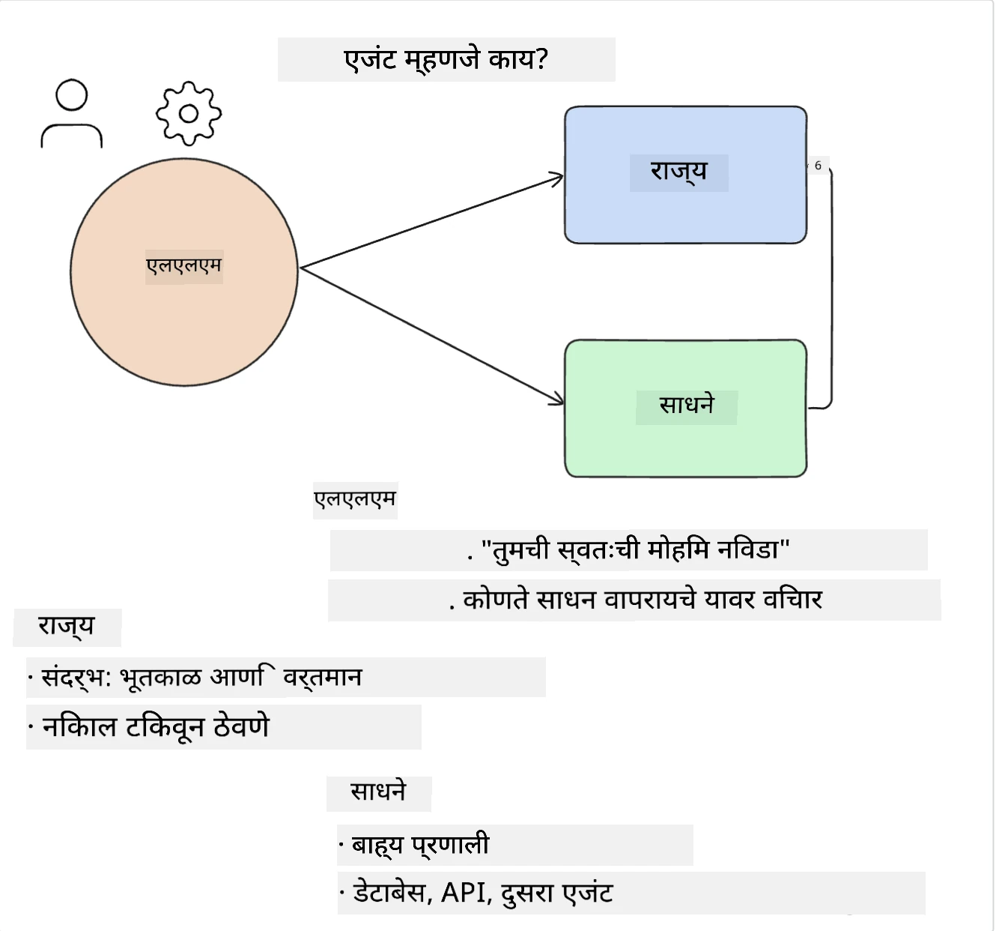
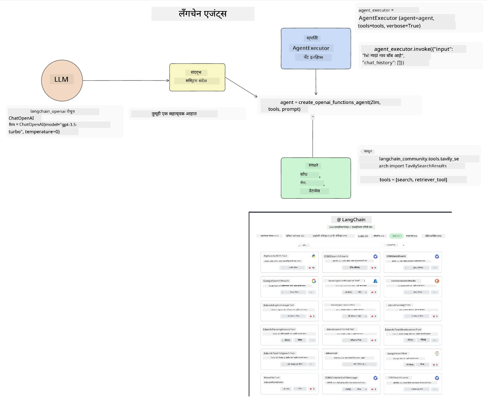
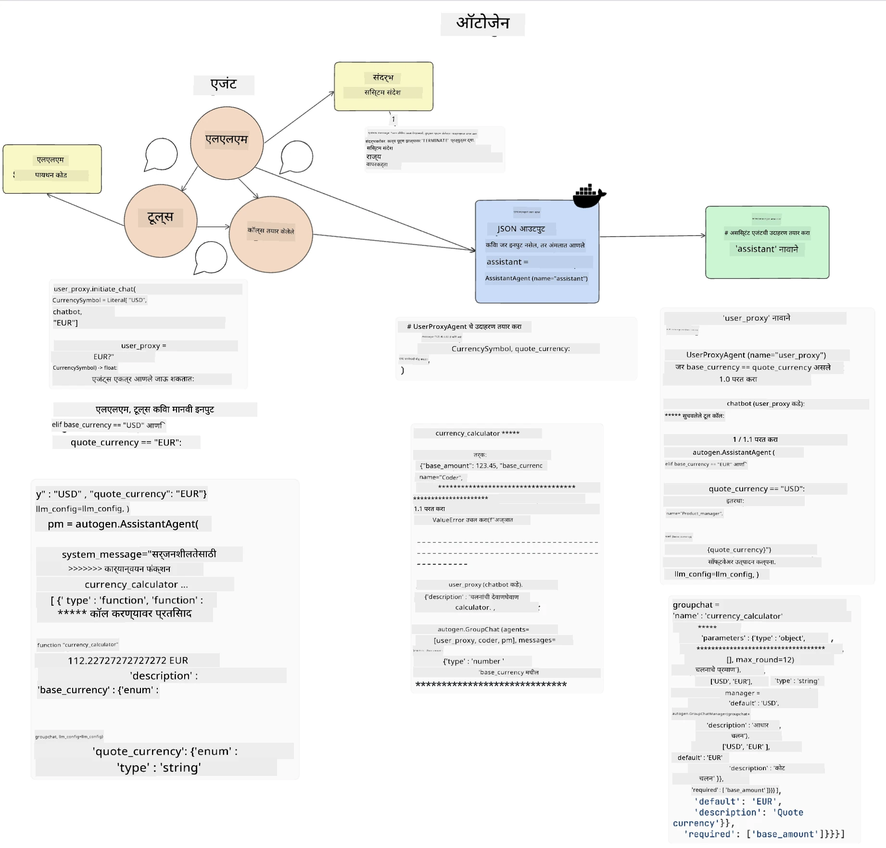
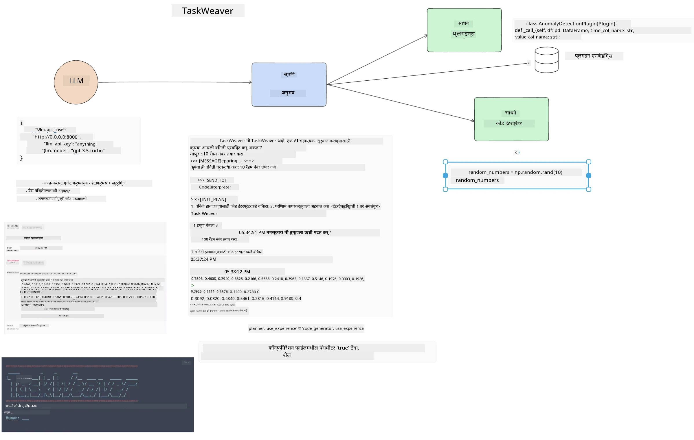
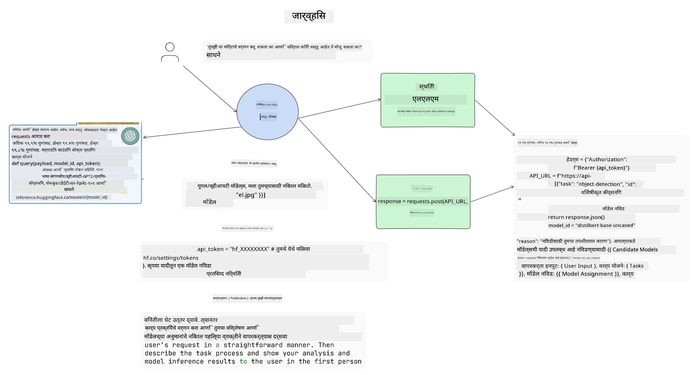

[](https://youtu.be/yAXVW-lUINc?si=bOtW9nL6jc3XJgOM)

## परिचय

एआय एजंट हे जनरेटिव एआयमधील एक रोमांचक प्रगतीचे प्रतिनिधित्व करतात, जे मोठ्या भाषा मॉडेल्स (LLMs) ना सहाय्यकांपासून क्रिया घेण्यास सक्षम एजंटमध्ये विकसित होण्याची परवानगी देतात. एआय एजंट फ्रेमवर्क विकसितकर्त्यांना अशा अ‍ॅप्लिकेशन्स तयार करण्यास सक्षम करतात ज्यात LLMs ना साधने आणि स्थिती व्यवस्थापनाचा प्रवेश दिला जातो. हे फ्रेमवर्क वापरकर्ते आणि विकासकांना LLMs द्वारे नियोजित क्रिया पाहण्याची सोयही पुरवतात, ज्यामुळे अनुभव व्यवस्थापन सुधारते.

हा धडा खालील क्षेत्रांना समजावून घ्येल:

- एआय एजंट म्हणजे काय - एआय एजंट म्हणजे नेमके काय आहे?
- चार वेगवेगळ्या एआय एजंट फ्रेमवर्क्सचा शोध - त्यांचे वैशिष्ट्य काय आहे?
- वेगवेगळ्या वापर केसेसमध्ये या एआय एजंटचा वापर - आपण कधी एआय एजंट वापरायला हवेत?

## शिकण्याचे उद्दिष्ट

ह्या धड्याने तुम्हाला पुढील गोष्टी करता येतील:

- एआय एजंट म्हणजे काय आणि ते कसे वापरले जाऊ शकतात याचे स्पष्टीकरण देणे.
- काही लोकप्रिय एआय एजंट फ्रेमवर्कमधील फरक समजून घेणे.
- एआय एजंट कसे कार्य करतात हे समजून ते वापरून अ‍ॅप्लिकेशन्स तयार करणे.

## एआय एजंट म्हणजे काय?

एआय एजंट हे जनरेटिव एआयच्या जगात अतिशय रोमांचक क्षेत्र आहे. या उत्साहाबरोबर अनेक वेळा संज्ञांची आणि त्याच्या वापराची गोंधळ निर्माण होतो. सर्वसाधारणपणे आणि बहुतेक एआय एजंट साधनांचा समावेश करायला खालील व्याख्या वापरूया:

एआय एजंट मोठ्या भाषा मॉडेल्स (LLMs) ना **स्थिती** आणि **साधने** वापरण्याची परवानगी देऊन कार्ये पार पाडण्याची क्षमता देतात.



चला या संज्ञा परिभाषित करूया:

**मोठे भाषा मॉडेल्स** - या पाठ्यक्रमात उल्लेखित GPT-3.5, GPT-4, Llama-2 सारख्या मॉडेल्स होय.

**स्थिती** - याचा अर्थ LLM काम करत असलेल्या संदर्भाशी आहे. LLM पूर्वीच्या क्रियांचा आणि वर्तमान संदर्भाचा उपयोग करून पुढील क्रियांसाठी निर्णय घेण्यास मार्गदर्शन करते. एआय एजंट फ्रेमवर्क विकसकांना हा संदर्भ सहज राखण्यास मदत करतात.

**साधने** - वापरकर्त्याने मागितलेली आणि LLM ने नियोजित केलेली कार्य पूर्ण करण्यासाठी LLM ला साधनांचा वापर करावा लागतो. उदाहरणार्थ, डेटाबेस, API, बाह्य अ‍ॅप्लिकेशन किंवा अगदी दुसरे LLM!

ही व्याख्याने तुम्हाला पुढे समजायला मदत करतील. चला काही वेगवेगळ्या एआय एजंट फ्रेमवर्कचा अभ्यास करूया:

## LangChain एजंट्स

[LangChain Agents](https://python.langchain.com/docs/how_to/#agents?WT.mc_id=academic-105485-koreyst) ही वरील दिलेल्या व्याख्यांचा अंमलबजावणीची एक उदाहरणे आहे.

स्थिती व्यवस्थापित करण्यासाठी ते `AgentExecutor` नावाचे अंगभूत फंक्शन वापरते. हे `agent` आणि त्यासाठी उपलब्ध असलेली `tools` स्वीकारते.

`Agent Executor` चॅट इतिहास देखील साठवते जेणेकरून चॅटचा संदर्भ पुरवता येतो.



LangChain मध्ये वापरकर्ता अ‍ॅप्लिकेशनमध्ये आयात करू शकणाऱ्या साधनांचा [कॅटलॉग](https://integrations.langchain.com/tools?WT.mc_id=academic-105485-koreyst) उपलब्ध आहे. हे साधने समुदाय आणि LangChain टीमने तयार केली आहेत.

तुम्ही नंतर ही साधने परिभाषित करून `Agent Executor` ला पास करू शकता.

दृश्यमानता ही एआय एजंटबाबत बोलताना एक महत्त्वाचा पैलू आहे. कोणते साधन LLM वापरत आहे आणि का हे समजून घेणे अ‍ॅप्लिकेशन विकासकांसाठी महत्त्वाचे आहे. यासाठी LangChain टीमने LangSmith तयार केले आहे.

## AutoGen

आम्ही पुढे जे एआय एजंट फ्रेमवर्क पाहणार आहोत ते म्हणजे [AutoGen](https://microsoft.github.io/autogen/?WT.mc_id=academic-105485-koreyst). AutoGen चे मुख्य लक्ष संभाषणांवर आहे. एजंट दोन्ही **संभाषणीय** आणि **सानुकूलनीय** आहेत.

**संभाषणीय -** LLM दुसऱ्या LLM सोबत संभाषण सुरू करू शकतो आणि चालू ठेवू शकतो जेणेकरून कार्य पूर्ण करता येईल. हे `AssistantAgents` तयार करून आणि त्यांना विशिष्ट सिस्टम मेसेज देऊन केले जाते.

```python

autogen.AssistantAgent( name="Coder", llm_config=llm_config, ) pm = autogen.AssistantAgent( name="Product_manager", system_message="Creative in software product ideas.", llm_config=llm_config, )

```

**सानुकूलनीय** - एजंट फक्त LLMs म्हणून नसून वापरकर्ता किंवा साधन म्हणूनही परिभाषित केले जाऊ शकतात. एक विकसक म्हणून तुम्ही `UserProxyAgent` परिभाषित करू शकता जो वापरकर्त्याशी संवाद साधून फीडबॅक घेण्याचा जबाबदार असतो. हा फीडबॅक कार्याच्या अंमलबजावणीला चालू ठेवू शकतो किंवा थांबवू शकतो.

```python
user_proxy = UserProxyAgent(name="user_proxy")
```

### स्थिती आणि साधने

स्थिती बदलण्यासाठी आणि व्यवस्थापित करण्यासाठी, सहाय्यक एजंट कार्य पूर्ण करण्यासाठी पायथन कोड तयार करतो.

खाली या प्रक्रियेचे एक उदाहरण आहे:



#### सिस्टम मेसेजसह LLM ची व्याख्या

```python
system_message="For weather related tasks, only use the functions you have been provided with. Reply TERMINATE when the task is done."
```

हा सिस्टम मेसेज या विशिष्ट LLM ला दिशा देतो की त्याच्या कार्यासाठी कोणती फंक्शन्स उपयुक्त आहेत. लक्षात ठेवा, AutoGen मध्ये तुम्ही विविध सिस्टम मेसेजसह एकापेक्षा अधिक AssistantAgents परिभाषित करू शकता.

#### वापरकर्त्याने चॅट सुरू केली

```python
user_proxy.initiate_chat( chatbot, message="I am planning a trip to NYC next week, can you help me pick out what to wear? ", )

```

हा user_proxy (मानव) कडून संदेश एजंटला सुरू करण्यासाठी लागणाऱ्या फंक्शनची चौकशी करण्याच्या प्रक्रियेला प्रारंभ करतो.

#### फंक्शनची अंमलबजावणी

```bash
chatbot (to user_proxy):

***** Suggested tool Call: get_weather ***** Arguments: {"location":"New York City, NY","time_periond:"7","temperature_unit":"Celsius"} ******************************************************** --------------------------------------------------------------------------------

>>>>>>>> EXECUTING FUNCTION get_weather... user_proxy (to chatbot): ***** Response from calling function "get_weather" ***** 112.22727272727272 EUR ****************************************************************

```

प्रारंभिक चॅट प्रक्रिया झाल्यानंतर एजंट वापरण्याचा प्रस्तावित साधन कॉल पाठवतो. या प्रकरणात `get_weather` नावाचे फंक्शन आहे. तुमच्या सेटिंगनुसार, हे फंक्शन आपोआप किंवा वापरकर्त्याच्या इनपुटवर अंमलात आणले जाऊ शकते.

अधिक अभ्यासासाठी तुम्ही [AutoGen कोड नमुने](https://microsoft.github.io/autogen/docs/Examples/?WT.mc_id=academic-105485-koreyst) पाहू शकता.

## Taskweaver

पुढील एजंट फ्रेमवर्क आहे [Taskweaver](https://microsoft.github.io/TaskWeaver/?WT.mc_id=academic-105485-koreyst). याला "कोड-प्रथम" एजंट म्हणून ओळखले जाते कारण तो केवळ `strings` मध्ये काम न करता, Python मधील डेटा फ्रेम्ससोबत काम करू शकतो. हे डेटा विश्लेषण आणि निर्मितीसाठी खूप उपयुक्त ठरते. जसे की ग्राफ आणि चार्ट तयार करणे किंवा यादृच्छिक संख्या तयार करणे.

### स्थिती आणि साधने

संवादातील स्थिती व्यवस्थापनासाठी TaskWeaver `Planner` या संकल्पनेचा वापर करते. `Planner` हा एक LLM आहे जो वापरकर्त्याच्या विनंतीला घेतो आणि ती पूर्ण करण्यासाठी आवश्यक कार्यांची रूपरेषा आखतो.

कार्य पूर्ण करण्यासाठी `Planner` ला `Plugins` नावाच्या साधनांच्या संग्रहाकडे प्रवेश दिला जातो. हे पायथन क्लासेस किंवा सामान्य कोड इंटरप्रिटर असू शकतात. ही प्लगइन्स एम्बेडिंग म्हणून साठवली जातात ज्यामुळे LLM योग्य प्लगइन शोधू शकते.



येथे अनोमली डिटेक्शन हँडल करण्यासाठी प्लगइनचे उदाहरण आहे:

```python
class AnomalyDetectionPlugin(Plugin): def __call__(self, df: pd.DataFrame, time_col_name: str, value_col_name: str):
```

कोडची अंमलबजावणीपूर्वी पडताळणी केली जाते. Taskweaver मध्ये संदर्भ व्यवस्थापित करण्यासाठी आणखी एक वैशिष्ट्य म्हणजे `experience`. अनुभव ही YAML फाइलमध्ये दीर्घकालीन संवाद संदर्भ साठवण्याची परवानगी देते. यामुळे LLM कालांतराने काही विशिष्ट कार्यांमध्ये सुधारणा करू शकतो, कारण तो पूर्वीच्या संभाषणांशी परिचित होतो.

## JARVIS

आम्ही पाहिलेल्या शेवटच्या एजंट फ्रेमवर्कचे नाव आहे [JARVIS](https://github.com/microsoft/JARVIS?tab=readme-ov-file&WT.mc_id=academic-105485-koreyst). JARVIS चे वैशिष्ट्य म्हणजे ते संभाषणाची `स्थिती` व्यवस्थापित करण्यासाठी एक LLM वापरते आणि `साधने` म्हणून इतर AI मॉडेल्स वापरते. प्रत्येक AI मॉडेल विशिष्ट कार्यांसाठी विशेषज्ञ मॉडेल्स असतात जसे की ऑब्जेक्ट डिटेक्शन, ट्रान्सक्रिप्शन किंवा इमेज कॅप्शनिंग.



सामान्य उद्देशाचा मॉडेल असलेल्या LLM ला वापरकर्त्यांकडून विनंती मिळते, जो विशिष्ट कार्य आणि त्यासाठी आवश्यक असलेले युक्तिवाद/डेटा ओळखतो.

```python
[{"task": "object-detection", "id": 0, "dep": [-1], "args": {"image": "e1.jpg" }}]
```

नंतर LLM ही विनंती विशिष्ट AI मॉडेल समजून घेईल अशा स्वरूपात स्वरूपित करते, जसे JSON. जेव्हा AI मॉडेल कार्यानुसार आपली भविष्यवाणी देते, तेव्हा LLM उत्तर प्राप्त करतो.

जर काम पूर्ण करण्यासाठी अनेक मॉडेल्स आवश्यक असतील, तर तो त्या मॉडेल्सच्या उत्तराचा अर्थ लावेल आणि नंतर त्या एकत्र करुन वापरकर्त्यास उत्तर निर्माण करेल.

खालील उदाहरणात वापरकर्ता छायाचित्रातील वस्तूंचे वर्णन आणि मोजणी मागत आहे ते दाखवले आहे:

## असाइनमेंट

तुमच्या एआय एजंट शिकण्याला पुढे वाढवण्यासाठी AutoGen चा वापर करून तुम्ही खालील अ‍ॅप्लिकेशन्स तयार करू शकता:

- शिक्षण स्टार्टअपच्या भिन्न विभागांशी व्यवसाय बैठक अनुकरण करणारी अ‍ॅप्लिकेशन.
- LLMs ना वेगवेगळ्या व्यक्तिरेखा आणि प्राधान्ये समजावणारे सिस्टम मेसेज तयार करा, ज्यामुळे वापरकर्ता नवीन उत्पादन कल्पना सादर करू शकेल.
- नंतर LLM प्रत्येक विभागाकडून प्रदर्शन व उत्पादन कल्पना सुधारण्यासाठी प्रश्न तयार करेल.

## शिकणे येथे थांबत नाही, प्रवास सुरू ठेवा

हा धडा पूर्ण केल्यानंतर, आमच्या [जनरेटिव एआय शिक्षण संकलन](https://aka.ms/genai-collection?WT.mc_id=academic-105485-koreyst) मध्ये जाऊन तुमचे जनरेटिव एआय ज्ञान अधिक वाढवा!

---

<!-- CO-OP TRANSLATOR DISCLAIMER START -->
**सूचना**:  
हा दस्तऐवज AI अनुवाद सेवेद्वारे [Co-op Translator](https://github.com/Azure/co-op-translator) वापरून अनुवादित केला आहे. आम्ही अचूकतेसाठी प्रयत्न करतो, परंतु कृपया लक्षात घ्या की स्वयंचलित अनुवादांमध्ये चुका किंवा अचूकतेचा अभाव असू शकतो. मूळ दस्तऐवज त्याच्या मूळ भाषेत अधिकृत स्रोत मानला जातो. महत्त्वपूर्ण माहिती साठी व्यावसायिक मानवी अनुवाद करणे शिफारसीय आहे. या अनुवादाच्या वापरामुळे उद्भवणाऱ्या कोणत्याही गैरसमजुती किंवा चुकीच्या अर्थलाही आम्ही जबाबदार नाही.
<!-- CO-OP TRANSLATOR DISCLAIMER END -->