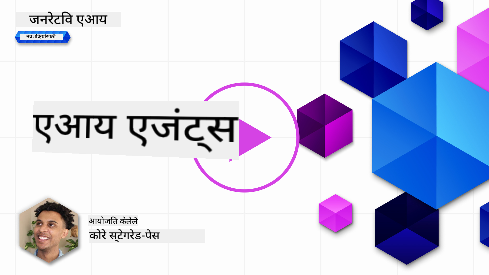
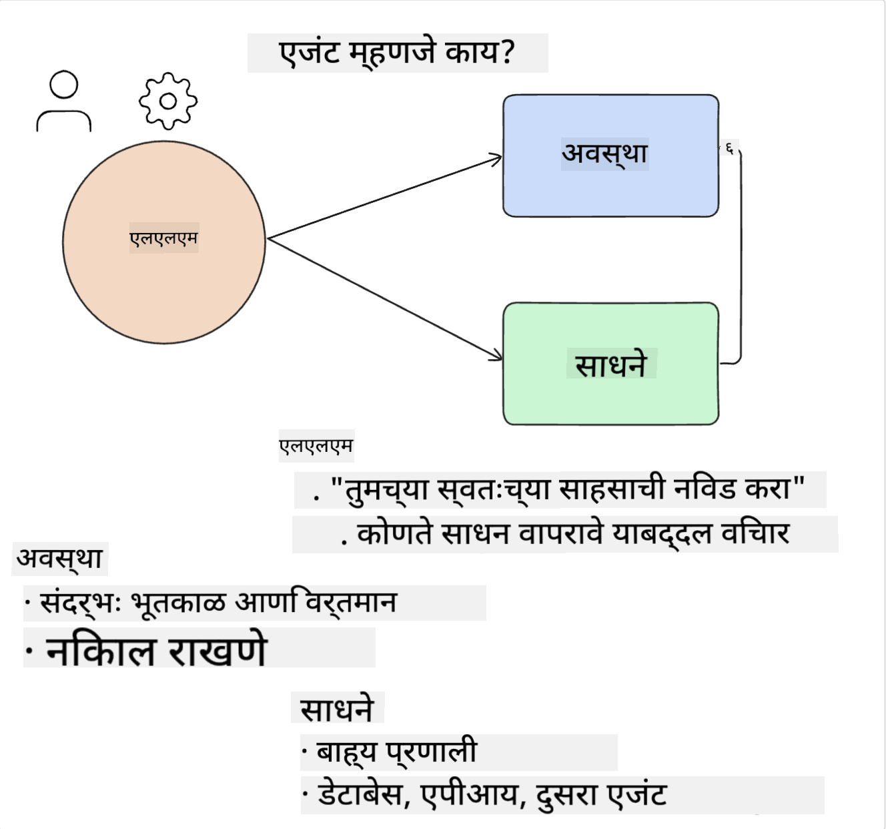
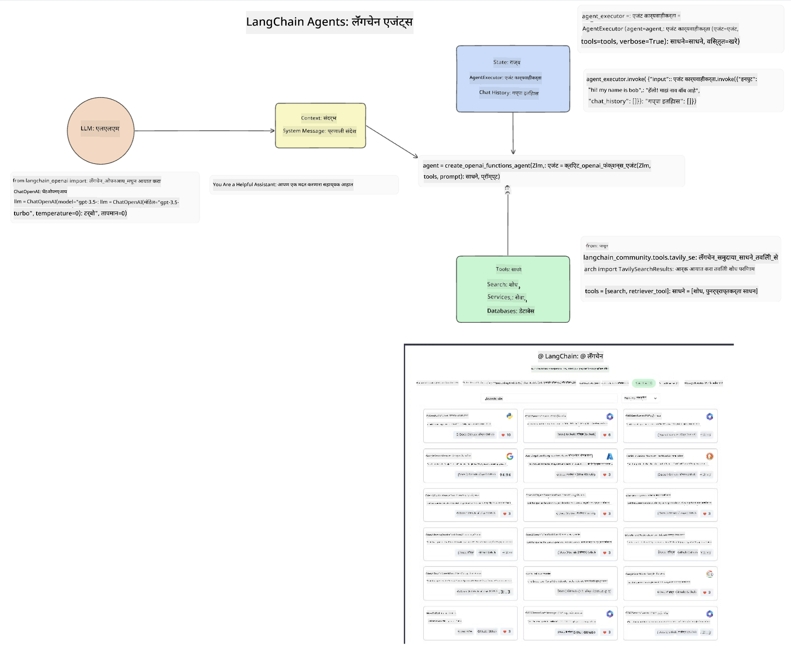
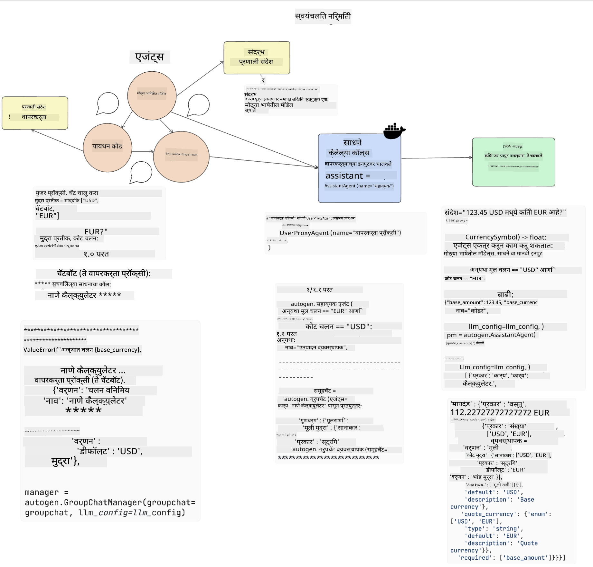
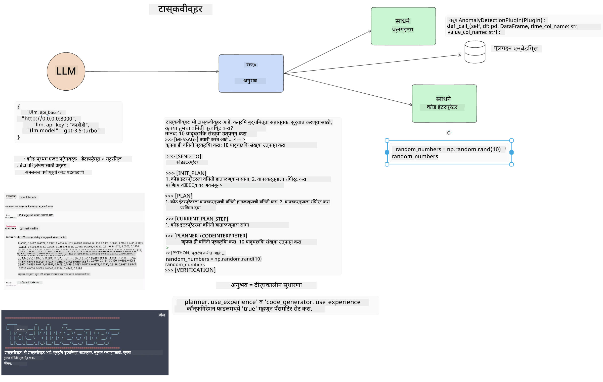
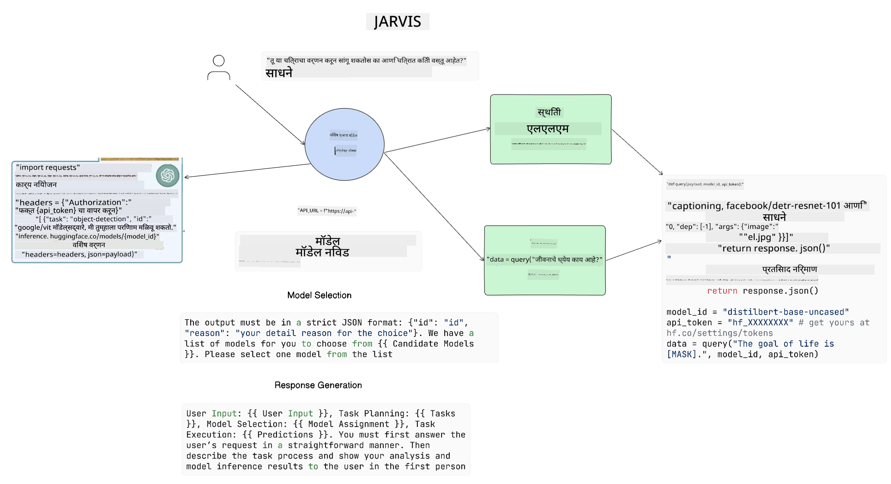

<!--
CO_OP_TRANSLATOR_METADATA:
{
  "original_hash": "11f03c81f190d9cbafd0f977dcbede6c",
  "translation_date": "2025-06-26T00:13:53+00:00",
  "source_file": "17-ai-agents/README.md",
  "language_code": "mr"
}
-->
[](https://aka.ms/gen-ai-lesson17-gh?WT.mc_id=academic-105485-koreyst)

## परिचय

AI एजंट्स जनरेटिव AI मधील एक रोमांचक विकास दर्शवतात, ज्यामुळे मोठ्या भाषा मॉडेल्स (LLMs) सहाय्यकांपासून कृती करण्यास सक्षम एजंट्समध्ये विकसित होऊ शकतात. AI एजंट फ्रेमवर्क्स विकसकांना LLMs ना साधने आणि स्थिती व्यवस्थापनाचा प्रवेश देणाऱ्या अनुप्रयोगांची निर्मिती करण्यास सक्षम करतात. हे फ्रेमवर्क्स दृश्यता वाढवतात, ज्यामुळे वापरकर्त्यांना आणि विकसकांना LLMs द्वारे नियोजित कृतींचे निरीक्षण करण्याची परवानगी मिळते, ज्यामुळे अनुभव व्यवस्थापन सुधारते.

या धड्यात खालील गोष्टींचा समावेश असेल:

- AI एजंट म्हणजे काय हे समजून घेणे - AI एजंट नेमके काय आहे?
- चार वेगवेगळ्या AI एजंट फ्रेमवर्क्सचा अभ्यास करणे - त्यांना अनोखे काय बनवते?
- विविध उपयोग प्रकरणांमध्ये हे AI एजंट्स लागू करणे - AI एजंट्स कधी वापरावे?

## शिकण्याची उद्दिष्टे

हा धडा घेतल्यानंतर, आपण हे करू शकाल:

- AI एजंट्स काय आहेत आणि त्यांचा कसा वापर केला जाऊ शकतो हे स्पष्ट करा.
- काही लोकप्रिय AI एजंट फ्रेमवर्क्समधील फरक समजून घ्या आणि ते कसे भिन्न आहेत ते समजून घ्या.
- AI एजंट्स कसे कार्य करतात हे समजून घेऊन त्यांच्यासह अनुप्रयोग तयार करा.

## AI एजंट्स काय आहेत?

जनरेटिव AI च्या जगात AI एजंट्स एक अत्यंत रोमांचक क्षेत्र आहे. या उत्साहासह कधीकधी अटी आणि त्यांच्या अनुप्रयोगांची गोंधळ येतो. गोष्टी साध्या आणि AI एजंट्सचा संदर्भ देणाऱ्या बहुतेक साधनांचा समावेश करण्यासाठी, आम्ही ही व्याख्या वापरणार आहोत:

AI एजंट्स मोठ्या भाषा मॉडेल्स (LLMs) ना कार्ये करण्यास परवानगी देतात ज्यामुळे त्यांना **स्थिती** आणि **साधनांचा** प्रवेश मिळतो.



या अटींची व्याख्या करूया:

**मोठी भाषा मॉडेल्स** - हे या अभ्यासक्रमात संदर्भित मॉडेल्स आहेत जसे की GPT-3.5, GPT-4, Llama-2, इत्यादी.

**स्थिती** - हे त्या संदर्भाशी संबंधित आहे ज्यामध्ये LLM कार्यरत आहे. LLM आपल्या मागील कृतींच्या संदर्भाचा आणि वर्तमान संदर्भाचा वापर करते, त्याच्या पुढील कृतींसाठी निर्णय घेण्याचे मार्गदर्शन करते. AI एजंट फ्रेमवर्क्स विकसकांना हा संदर्भ सुलभतेने ठेवण्यास परवानगी देतात.

**साधने** - वापरकर्त्याने विनंती केलेले कार्य पूर्ण करण्यासाठी आणि LLM ने नियोजित केलेले कार्य पूर्ण करण्यासाठी, LLM ला साधनांचा प्रवेश आवश्यक आहे. साधनांचे काही उदाहरणे म्हणजे डेटाबेस, API, बाह्य अनुप्रयोग किंवा दुसरे LLM देखील असू शकते!

या व्याख्या तुम्हाला पुढे जाण्यासाठी चांगली माहिती देतील कारण आपण त्यांची अंमलबजावणी कशी केली जाते ते पाहणार आहोत. चला काही वेगवेगळ्या AI एजंट फ्रेमवर्क्सचा अभ्यास करूया:

## लँगचेन एजंट्स

[लँगचेन एजंट्स](https://python.langchain.com/docs/how_to/#agents?WT.mc_id=academic-105485-koreyst) ही आपण दिलेली व्याख्या अंमलात आणण्याची एक पद्धत आहे.

**स्थिती** व्यवस्थापित करण्यासाठी, ते `AgentExecutor` नावाची अंगभूत फंक्शन वापरते. हे परिभाषित `agent` आणि त्याला उपलब्ध असलेले `tools` स्वीकारते.

`Agent Executor` देखील चॅट इतिहास साठवते जेणेकरून चॅटचा संदर्भ मिळेल.



लँगचेन एक [साधनांची सूची](https://integrations.langchain.com/tools?WT.mc_id=academic-105485-koreyst) देते ज्यांना तुमच्या अनुप्रयोगात आयात करता येते ज्यामध्ये LLM ला प्रवेश मिळतो. हे समुदायाने आणि लँगचेन टीमने बनवले आहेत.

तुम्ही नंतर ही साधने परिभाषित करू शकता आणि त्यांना `Agent Executor` कडे पास करू शकता.

AI एजंट्सबद्दल बोलताना दृश्यता हा आणखी एक महत्त्वाचा पैलू आहे. LLM कोणते साधन वापरत आहे आणि का हे अनुप्रयोग विकसकांना समजून घेणे महत्त्वाचे आहे. यासाठी, लँगचेनच्या टीमने लँगस्मिथ विकसित केले आहे.

## ऑटोजेन

पुढील AI एजंट फ्रेमवर्क आपण चर्चा करू ते आहे [ऑटोजेन](https://microsoft.github.io/autogen/?WT.mc_id=academic-105485-koreyst). ऑटोजेनचा मुख्य फोकस संवादांवर आहे. एजंट्स दोन्ही **संवादी** आणि **सानुकूलनक्षम** आहेत.

**संवादी -** LLMs दुसऱ्या LLM सह संवाद सुरू करू शकतात आणि सुरू ठेवू शकतात जेणेकरून कार्य पूर्ण होईल. हे `AssistantAgents` तयार करून आणि त्यांना विशिष्ट प्रणाली संदेश देऊन केले जाते.

```python

autogen.AssistantAgent( name="Coder", llm_config=llm_config, ) pm = autogen.AssistantAgent( name="Product_manager", system_message="Creative in software product ideas.", llm_config=llm_config, )

```

**सानुकूलनक्षम** - एजंट्स केवळ LLMs म्हणूनच नव्हे तर वापरकर्ता किंवा साधन म्हणून देखील परिभाषित केले जाऊ शकतात. विकसक म्हणून, तुम्ही `UserProxyAgent` परिभाषित करू शकता जे कार्य पूर्ण करण्यासाठी अभिप्रायासाठी वापरकर्त्याशी संवाद साधण्यास जबाबदार आहे. हा अभिप्राय कार्याची अंमलबजावणी सुरू ठेवू शकतो किंवा थांबवू शकतो.

```python
user_proxy = UserProxyAgent(name="user_proxy")
```

### स्थिती आणि साधने

स्थिती बदलण्यासाठी आणि व्यवस्थापित करण्यासाठी, सहाय्यक एजंट कार्य पूर्ण करण्यासाठी Python कोड तयार करतो.

येथे प्रक्रियेचे एक उदाहरण आहे:



#### LLM एक प्रणाली संदेशासह परिभाषित केलेले आहे

```python
system_message="For weather related tasks, only use the functions you have been provided with. Reply TERMINATE when the task is done."
```

हा प्रणाली संदेश या विशिष्ट LLM ला त्याच्या कार्यासाठी कोणते कार्ये संबंधित आहेत हे निर्देशित करतो. लक्षात ठेवा, ऑटोजेनसह तुम्ही वेगवेगळ्या प्रणाली संदेशांसह एकाधिक परिभाषित सहाय्यक एजंट्स असू शकता.

#### चॅट वापरकर्त्याद्वारे सुरू केले जाते

```python
user_proxy.initiate_chat( chatbot, message="I am planning a trip to NYC next week, can you help me pick out what to wear? ", )

```

हे user_proxy (मानव) कडून आलेले संदेश आहे जे एजंटला ते कोणते कार्ये अंमलात आणावे हे शोधण्यासाठी प्रक्रिया सुरू करेल.

#### कार्य अंमलात आणले जाते

```bash
chatbot (to user_proxy):

***** Suggested tool Call: get_weather ***** Arguments: {"location":"New York City, NY","time_periond:"7","temperature_unit":"Celsius"} ******************************************************** --------------------------------------------------------------------------------

>>>>>>>> EXECUTING FUNCTION get_weather... user_proxy (to chatbot): ***** Response from calling function "get_weather" ***** 112.22727272727272 EUR ****************************************************************

```

प्रारंभिक चॅट प्रक्रिया झाल्यावर, एजंट सुचवलेले साधन कॉल करेल. या प्रकरणात, हे `get_weather`. Depending on your configuration, this function can be automatically executed and read by the Agent or can be executed based on user input.

You can find a list of [AutoGen code samples](https://microsoft.github.io/autogen/docs/Examples/?WT.mc_id=academic-105485-koreyst) to further explore how to get started building.

## Taskweaver

The next agent framework we will explore is [Taskweaver](https://microsoft.github.io/TaskWeaver/?WT.mc_id=academic-105485-koreyst). It is known as a "code-first" agent because instead of working strictly with `strings` , it can work with DataFrames in Python. This becomes extremely useful for data analysis and generation tasks. This can be things like creating graphs and charts or generating random numbers.

### State and Tools

To manage the state of the conversation, TaskWeaver uses the concept of a `Planner`. The `Planner` is a LLM that takes the request from the users and maps out the tasks that need to be completed to fulfill this request.

To complete the tasks the `Planner` is exposed to the collection of tools called `Plugins` नावाचे कार्य आहे. हे Python वर्ग किंवा सामान्य कोड इंटरप्रेटर असू शकतात. हे प्लगइन्स एम्बेडिंग्ज म्हणून साठवले जातात जेणेकरून LLM योग्य प्लगइनसाठी चांगले शोध घेऊ शकेल.



येथे विसंगती शोधण्यासाठी एक प्लगइन हाताळण्याचे एक उदाहरण आहे:

```python
class AnomalyDetectionPlugin(Plugin): def __call__(self, df: pd.DataFrame, time_col_name: str, value_col_name: str):
```

कार्य अंमलात आणण्यापूर्वी कोड सत्यापित केला जातो. Taskweaver मध्ये संदर्भ व्यवस्थापित करण्यासाठी आणखी एक वैशिष्ट्य म्हणजे संभाषणाचा `experience`. Experience allows for the context of a conversation to be stored over to the long term in a YAML file. This can be configured so that the LLM improves over time on certain tasks given that it is exposed to prior conversations.

## JARVIS

The last agent framework we will explore is [JARVIS](https://github.com/microsoft/JARVIS?tab=readme-ov-file?WT.mc_id=academic-105485-koreyst). What makes JARVIS unique is that it uses an LLM to manage the `state` आणि `tools` इतर AI मॉडेल्स आहेत. प्रत्येक AI मॉडेल्स विशेष मॉडेल्स आहेत जे विशिष्ट कार्ये करतात जसे की ऑब्जेक्ट शोध, लिप्यंतर किंवा प्रतिमा वर्णन.



LLM, एक सामान्य उद्देश मॉडेल असल्याने, वापरकर्त्याकडून विनंती प्राप्त करते आणि विशिष्ट कार्य आणि कार्य पूर्ण करण्यासाठी आवश्यक असलेले कोणतेही युक्तिवाद/डेटा ओळखतो.

```python
[{"task": "object-detection", "id": 0, "dep": [-1], "args": {"image": "e1.jpg" }}]
```

नंतर LLM विनंती अशा प्रकारे स्वरूपित करते की विशेष AI मॉडेल ते समजून घेऊ शकतात, जसे की JSON. एकदा AI मॉडेलने कार्याच्या आधारावर त्याची भविष्यवाणी परत केली की, LLM प्रतिसाद प्राप्त करते.

कार्य पूर्ण करण्यासाठी एकाधिक मॉडेल्स आवश्यक असल्यास, ते वापरकर्त्याला प्रतिसाद तयार करण्यासाठी एकत्र आणण्यापूर्वी त्या मॉडेल्सकडून प्राप्त झालेला प्रतिसाद देखील समजेल.

खालील उदाहरण दर्शविते की जेव्हा वापरकर्ता चित्रातील वस्तूंचे वर्णन आणि मोजणी विनंती करतो तेव्हा हे कसे कार्य करेल:

## असाइनमेंट

AI एजंट्सचे शिक्षण सुरू ठेवण्यासाठी तुम्ही ऑटोजेनसह बांधू शकता:

- एका शिक्षण स्टार्टअपच्या वेगवेगळ्या विभागांसह व्यावसायिक बैठकीचे अनुकरण करणारा अनुप्रयोग.
- LLMs ला विविध व्यक्तिमत्त्वे आणि प्राधान्यक्रम समजून घेण्यासाठी मार्गदर्शन करणारे प्रणाली संदेश तयार करा आणि वापरकर्त्याला नवीन उत्पादन कल्पना मांडण्याची परवानगी द्या.
- नंतर LLM प्रत्येक विभागाकडून पिच आणि उत्पादन कल्पना परिष्कृत आणि सुधारण्यासाठी फॉलो-अप प्रश्न तयार करेल.

## शिक्षण येथे थांबत नाही, प्रवास सुरू ठेवा

हा धडा पूर्ण केल्यानंतर, आमच्या [जनरेटिव AI शिक्षण संग्रह](https://aka.ms/genai-collection?WT.mc_id=academic-105485-koreyst) ला पहा जेणेकरून तुमचे जनरेटिव AI ज्ञान वाढत राहील!

**अस्वीकरण**:  
हा दस्तऐवज AI अनुवाद सेवा [Co-op Translator](https://github.com/Azure/co-op-translator) वापरून अनुवादित केला आहे. आम्ही अचूकतेसाठी प्रयत्नशील असलो तरी कृपया लक्षात घ्या की स्वयंचलित अनुवादांमध्ये त्रुटी किंवा अशुद्धता असू शकतात. मूळ भाषेतील दस्तऐवज हा प्राधिकृत स्रोत मानला जावा. महत्त्वाच्या माहितीसाठी व्यावसायिक मानवी अनुवादाची शिफारस केली जाते. या अनुवादाच्या वापरामुळे उद्भवलेल्या कोणत्याही गैरसमज किंवा चुकीच्या अर्थाबद्दल आम्ही जबाबदार नाही.