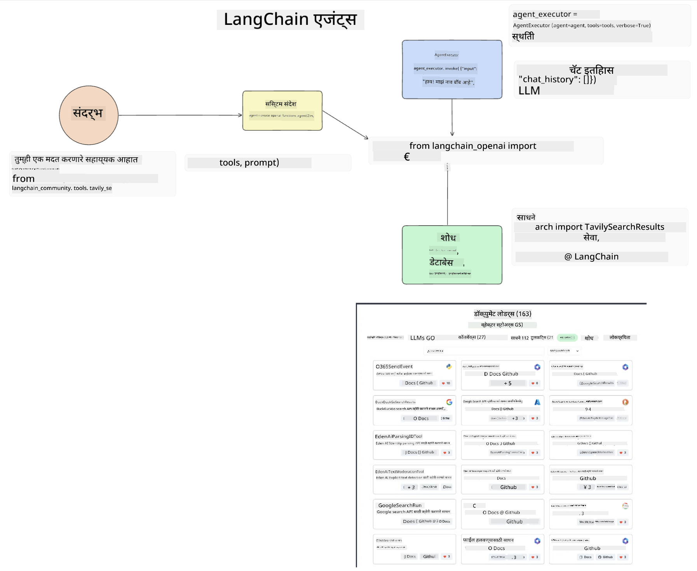
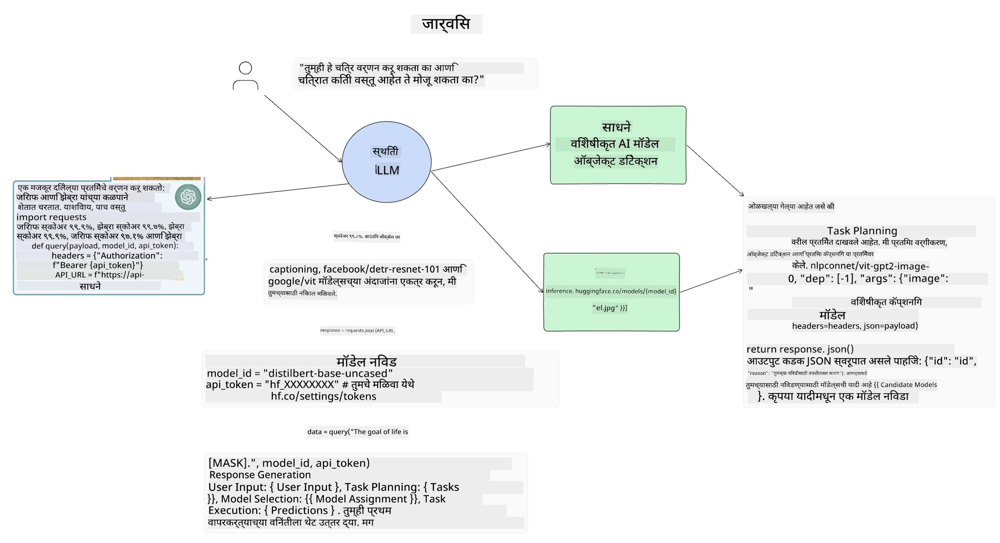

<!--
CO_OP_TRANSLATOR_METADATA:
{
  "original_hash": "8e8d1f6a63da606af7176a87ff8e92b6",
  "translation_date": "2025-10-17T13:46:17+00:00",
  "source_file": "17-ai-agents/README.md",
  "language_code": "mr"
}
-->
[](https://youtu.be/yAXVW-lUINc?si=bOtW9nL6jc3XJgOM)

## परिचय

AI एजंट्स हे जनरेटिव्ह AI मधील एक रोमांचक प्रगती दर्शवतात, ज्यामुळे मोठ्या भाषा मॉडेल्स (LLMs) सहाय्यकांपासून कृती घेणाऱ्या एजंट्समध्ये विकसित होऊ शकतात. AI एजंट फ्रेमवर्क्स विकसकांना LLMs ला टूल्स आणि स्टेट मॅनेजमेंटमध्ये प्रवेश देणाऱ्या अॅप्लिकेशन्स तयार करण्यास सक्षम करतात. हे फ्रेमवर्क्स दृश्यमानता वाढवतात, ज्यामुळे वापरकर्ते आणि विकसकांना LLMs ने नियोजित केलेल्या कृतींचे निरीक्षण करता येते आणि अनुभव व्यवस्थापन सुधारते.

या धड्यात खालील गोष्टींचा समावेश असेल:

- AI एजंट म्हणजे काय हे समजून घेणे - AI एजंट नेमके काय आहे?
- चार वेगवेगळ्या AI एजंट फ्रेमवर्क्सचा अभ्यास - त्यांचे वैशिष्ट्य काय आहे?
- विविध उपयोगांमध्ये या AI एजंट्सचा वापर करणे - AI एजंट्स कधी वापरावे?

## शिकण्याची उद्दिष्टे

हा धडा घेतल्यानंतर, तुम्ही हे करू शकाल:

- AI एजंट्स काय आहेत आणि त्यांचा कसा उपयोग केला जाऊ शकतो हे स्पष्ट करा.
- काही लोकप्रिय AI एजंट फ्रेमवर्क्समधील फरक समजून घ्या आणि ते कसे वेगळे आहेत हे जाणून घ्या.
- AI एजंट्स कसे कार्य करतात हे समजून घ्या जेणेकरून त्यांच्यासह अॅप्लिकेशन्स तयार करता येतील.

## AI एजंट्स म्हणजे काय?

AI एजंट्स हे जनरेटिव्ह AI च्या जगातील एक अत्यंत रोमांचक क्षेत्र आहे. या उत्साहासोबतच कधीकधी संज्ञा आणि त्यांचा उपयोग याबद्दल गोंधळ निर्माण होतो. गोष्टी सोप्या आणि AI एजंट्सचा संदर्भ देणाऱ्या बहुतेक टूल्सचा समावेश करण्यासाठी, आपण ही व्याख्या वापरणार आहोत:

AI एजंट्स मोठ्या भाषा मॉडेल्स (LLMs) ला **स्टेट** आणि **टूल्स** मध्ये प्रवेश देऊन कार्ये करण्यास सक्षम करतात.


या संज्ञा स्पष्ट करूया:

**मोठे भाषा मॉडेल्स** - या कोर्समध्ये GPT-3.5, GPT-4, Llama-2 इत्यादी मॉडेल्सचा संदर्भ दिला जातो.

**स्टेट** - याचा अर्थ LLM कार्य करत असलेल्या संदर्भाशी आहे. LLM त्याच्या मागील कृतींच्या संदर्भाचा आणि वर्तमान संदर्भाचा वापर करून पुढील कृतींसाठी निर्णय घेते. AI एजंट फ्रेमवर्क्स विकसकांना हा संदर्भ अधिक सोप्या पद्धतीने राखण्यास अनुमती देतात.

**टूल्स** - वापरकर्त्याने विनंती केलेले कार्य पूर्ण करण्यासाठी आणि LLM ने नियोजित केलेले कार्य पूर्ण करण्यासाठी LLM ला टूल्समध्ये प्रवेश आवश्यक आहे. टूल्सचे काही उदाहरणे म्हणजे डेटाबेस, API, बाह्य अॅप्लिकेशन किंवा दुसरे LLM!

या व्याख्या तुम्हाला पुढे जाण्यासाठी चांगली पायाभरणी देतील कारण आपण त्यांची अंमलबजावणी कशी केली जाते हे पाहतो. चला काही वेगवेगळ्या AI एजंट फ्रेमवर्क्सचा अभ्यास करूया:

## LangChain एजंट्स

[LangChain एजंट्स](https://python.langchain.com/docs/how_to/#agents?WT.mc_id=academic-105485-koreyst) ही वर दिलेल्या व्याख्यांची अंमलबजावणी आहे.

**स्टेट** व्यवस्थापित करण्यासाठी, ते `AgentExecutor` नावाच्या अंगभूत फंक्शनचा वापर करते. हे परिभाषित `agent` आणि त्याला उपलब्ध असलेल्या `tools` स्वीकारते.

`Agent Executor` देखील चॅट इतिहास साठवतो जेणेकरून चॅटचा संदर्भ प्रदान करता येईल.



LangChain एक [टूल्स कॅटलॉग](https://integrations.langchain.com/tools?WT.mc_id=academic-105485-koreyst) ऑफर करते जे तुमच्या अॅप्लिकेशनमध्ये आयात केले जाऊ शकते ज्यामध्ये LLM ला प्रवेश मिळतो. हे समुदाय आणि LangChain टीमद्वारे तयार केले जाते.

तुम्ही नंतर ही टूल्स परिभाषित करू शकता आणि ती `Agent Executor` ला पास करू शकता.

दृश्यमानता ही AI एजंट्सबद्दल बोलताना आणखी एक महत्त्वाचा पैलू आहे. LLM कोणते टूल वापरत आहे आणि का हे अॅप्लिकेशन विकसकांसाठी समजून घेणे महत्त्वाचे आहे. यासाठी, LangChain टीमने LangSmith विकसित केले आहे.

## AutoGen

आपण चर्चा करणार असलेला पुढील AI एजंट फ्रेमवर्क म्हणजे [AutoGen](https://microsoft.github.io/autogen/?WT.mc_id=academic-105485-koreyst). AutoGen मुख्यतः संवादांवर लक्ष केंद्रित करते. एजंट्स **संवादक्षम** आणि **सानुकूल करण्यायोग्य** असतात.

**संवादक्षम -** LLMs एका कार्यासाठी दुसऱ्या LLM सोबत संवाद सुरू करू शकतात आणि चालू ठेवू शकतात. हे `AssistantAgents` तयार करून आणि त्यांना विशिष्ट सिस्टम संदेश देऊन केले जाते.

```python

autogen.AssistantAgent( name="Coder", llm_config=llm_config, ) pm = autogen.AssistantAgent( name="Product_manager", system_message="Creative in software product ideas.", llm_config=llm_config, )

```

**सानुकूल करण्यायोग्य** - एजंट्स केवळ LLMs म्हणूनच नाही तर वापरकर्ता किंवा टूल म्हणून परिभाषित केले जाऊ शकतात. विकसक म्हणून, तुम्ही `UserProxyAgent` परिभाषित करू शकता जो कार्य पूर्ण करण्यासाठी अभिप्रायासाठी वापरकर्त्याशी संवाद साधण्यास जबाबदार आहे. हा अभिप्राय कार्याची अंमलबजावणी सुरू ठेवू शकतो किंवा थांबवू शकतो.

```python
user_proxy = UserProxyAgent(name="user_proxy")
```

### स्टेट आणि टूल्स

स्टेट बदलण्यासाठी आणि व्यवस्थापित करण्यासाठी, असिस्टंट एजंट कार्य पूर्ण करण्यासाठी Python कोड तयार करतो.

येथे प्रक्रियेचे एक उदाहरण आहे:


#### सिस्टम संदेशासह परिभाषित LLM

```python
system_message="For weather related tasks, only use the functions you have been provided with. Reply TERMINATE when the task is done."
```

हा सिस्टम संदेश या विशिष्ट LLM ला त्याच्या कार्यासाठी कोणते फंक्शन्स संबंधित आहेत हे निर्देशित करतो. लक्षात ठेवा, AutoGen सह तुम्ही वेगवेगळ्या सिस्टम संदेशांसह एकाधिक परिभाषित AssistantAgents ठेवू शकता.

#### वापरकर्त्याद्वारे चॅट सुरू केले जाते

```python
user_proxy.initiate_chat( chatbot, message="I am planning a trip to NYC next week, can you help me pick out what to wear? ", )

```

Human (user_proxy) कडून आलेला हा संदेश एजंटला त्याने अंमलबजावणी करावयाच्या संभाव्य फंक्शन्सचा शोध घेण्याची प्रक्रिया सुरू करेल.

#### फंक्शन अंमलबजावित केले जाते

```bash
chatbot (to user_proxy):

***** Suggested tool Call: get_weather ***** Arguments: {"location":"New York City, NY","time_periond:"7","temperature_unit":"Celsius"} ******************************************************** --------------------------------------------------------------------------------

>>>>>>>> EXECUTING FUNCTION get_weather... user_proxy (to chatbot): ***** Response from calling function "get_weather" ***** 112.22727272727272 EUR ****************************************************************

```

प्रारंभिक चॅट प्रक्रिया झाल्यानंतर, एजंट सुचवलेले टूल कॉल करेल. या प्रकरणात, `get_weather` नावाचा फंक्शन आहे. तुमच्या कॉन्फिगरेशनवर अवलंबून, हे फंक्शन एजंटद्वारे स्वयंचलितपणे अंमलबजावित केले जाऊ शकते किंवा वापरकर्त्याच्या इनपुटवर आधारित अंमलबजावित केले जाऊ शकते.

AutoGen कोड नमुन्यांची यादी [येथे](https://microsoft.github.io/autogen/docs/Examples/?WT.mc_id=academic-105485-koreyst) मिळू शकते ज्यामुळे तुम्ही सुरुवात कशी करावी हे अधिक शोधू शकता.

## Taskweaver

आपण अभ्यास करणार असलेला पुढील एजंट फ्रेमवर्क म्हणजे [Taskweaver](https://microsoft.github.io/TaskWeaver/?WT.mc_id=academic-105485-koreyst). हे "कोड-फर्स्ट" एजंट म्हणून ओळखले जाते कारण `strings` सह कठोरपणे कार्य करण्याऐवजी, ते Python मधील DataFrames सह कार्य करू शकते. हे डेटा विश्लेषण आणि जनरेशन कार्यांसाठी अत्यंत उपयुक्त ठरते. यामध्ये ग्राफ्स आणि चार्ट तयार करणे किंवा रँडम नंबर जनरेट करणे यासारख्या गोष्टींचा समावेश होतो.

### स्टेट आणि टूल्स

संवादाचा स्टेट व्यवस्थापित करण्यासाठी, TaskWeaver `Planner` ची संकल्पना वापरते. `Planner` हा LLM आहे जो वापरकर्त्यांकडून विनंती घेतो आणि ही विनंती पूर्ण करण्यासाठी पूर्ण करावयाच्या कार्यांची योजना आखतो.

कार्ये पूर्ण करण्यासाठी `Planner` ला `Plugins` नावाच्या टूल्सच्या संग्रहात प्रवेश दिला जातो. हे Python क्लासेस किंवा सामान्य कोड इंटरप्रिटर असू शकतात. हे प्लगिन्स एम्बेडिंग्ज म्हणून संग्रहित केले जातात जेणेकरून LLM योग्य प्लगिन शोधू शकेल.


येथे अॅनोमली डिटेक्शन हाताळण्यासाठी प्लगिनचे एक उदाहरण आहे:

```python
class AnomalyDetectionPlugin(Plugin): def __call__(self, df: pd.DataFrame, time_col_name: str, value_col_name: str):
```

कोड अंमलबजावित करण्यापूर्वी सत्यापित केले जाते. Taskweaver मध्ये संदर्भ व्यवस्थापित करण्यासाठी आणखी एक वैशिष्ट्य म्हणजे `experience`. अनुभव संवादाचा संदर्भ दीर्घकालीन YAML फाइलमध्ये साठवण्याची परवानगी देतो. हे कॉन्फिगर केले जाऊ शकते जेणेकरून LLM पूर्वीच्या संवादांमुळे विशिष्ट कार्यांवर वेळोवेळी सुधारणा करू शकेल.

## JARVIS

आपण अभ्यास करणार असलेला शेवटचा एजंट फ्रेमवर्क म्हणजे [JARVIS](https://github.com/microsoft/JARVIS?tab=readme-ov-file?WT.mc_id=academic-105485-koreyst). JARVIS चे वैशिष्ट्य म्हणजे ते संवादाचा `state` व्यवस्थापित करण्यासाठी LLM वापरते आणि `tools` इतर AI मॉडेल्स असतात. प्रत्येक AI मॉडेल्स विशिष्ट कार्ये करतात जसे की ऑब्जेक्ट डिटेक्शन, ट्रान्सक्रिप्शन किंवा इमेज कॅप्शनिंग.



LLM, एक सामान्य उद्देश मॉडेल, वापरकर्त्यांकडून विनंती प्राप्त करते आणि विशिष्ट कार्य आणि कार्य पूर्ण करण्यासाठी आवश्यक असलेले कोणतेही आर्ग्युमेंट्स/डेटा ओळखते.

```python
[{"task": "object-detection", "id": 0, "dep": [-1], "args": {"image": "e1.jpg" }}]
```

LLM नंतर विनंती विशेष AI मॉडेल समजून घेऊ शकेल अशा प्रकारे स्वरूपित करते, जसे की JSON. AI मॉडेलने कार्याच्या आधारे त्याचा अंदाज परत दिल्यानंतर, LLM प्रतिसाद प्राप्त करते.

जर कार्य पूर्ण करण्यासाठी एकाधिक मॉडेल्स आवश्यक असतील, तर ते वापरकर्त्याला प्रतिसाद तयार करण्यापूर्वी त्या मॉडेल्सकडून प्रतिसादांची व्याख्या करेल.

खालील उदाहरण दर्शवते की जेव्हा वापरकर्ता चित्रातील ऑब्जेक्ट्सचे वर्णन आणि संख्या विचारतो तेव्हा हे कसे कार्य करेल:

## असाइनमेंट

AI एजंट्सचे शिक्षण सुरू ठेवण्यासाठी तुम्ही AutoGen सह तयार करू शकता:

- शिक्षण स्टार्टअपच्या विविध विभागांसह व्यवसाय बैठकाचे अनुकरण करणारे अॅप्लिकेशन.
- LLMs ला वेगवेगळ्या व्यक्तिमत्त्वे आणि प्राधान्ये समजून घेण्यासाठी मार्गदर्शन करणारे सिस्टम संदेश तयार करा आणि वापरकर्त्याला नवीन उत्पादन कल्पना सादर करण्यास सक्षम करा.
- नंतर LLM प्रत्येक विभागाकडून फॉलो-अप प्रश्न तयार करेल जेणेकरून पिच आणि उत्पादन कल्पना सुधारता येईल.

## शिक्षण येथे थांबत नाही, प्रवास सुरू ठेवा

हा धडा पूर्ण केल्यानंतर, आमचा [Generative AI Learning collection](https://aka.ms/genai-collection?WT.mc_id=academic-105485-koreyst) पहा आणि तुमचे जनरेटिव्ह AI ज्ञान वाढवत रहा!

---

**अस्वीकरण**:  
हा दस्तऐवज AI भाषांतर सेवा [Co-op Translator](https://github.com/Azure/co-op-translator) वापरून भाषांतरित करण्यात आला आहे. आम्ही अचूकतेसाठी प्रयत्नशील असलो तरी, कृपया लक्षात ठेवा की स्वयंचलित भाषांतरांमध्ये त्रुटी किंवा अचूकतेचा अभाव असू शकतो. मूळ भाषेतील दस्तऐवज हा अधिकृत स्रोत मानला जावा. महत्त्वाच्या माहितीसाठी व्यावसायिक मानवी भाषांतराची शिफारस केली जाते. या भाषांतराचा वापर करून निर्माण झालेल्या कोणत्याही गैरसमज किंवा चुकीच्या अर्थासाठी आम्ही जबाबदार राहणार नाही.