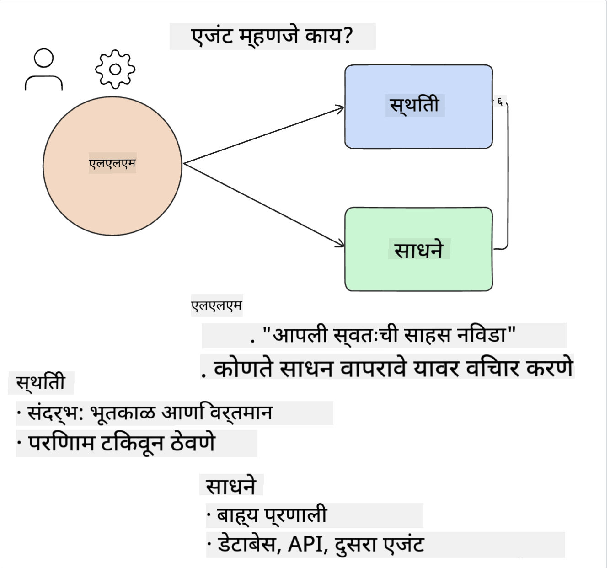
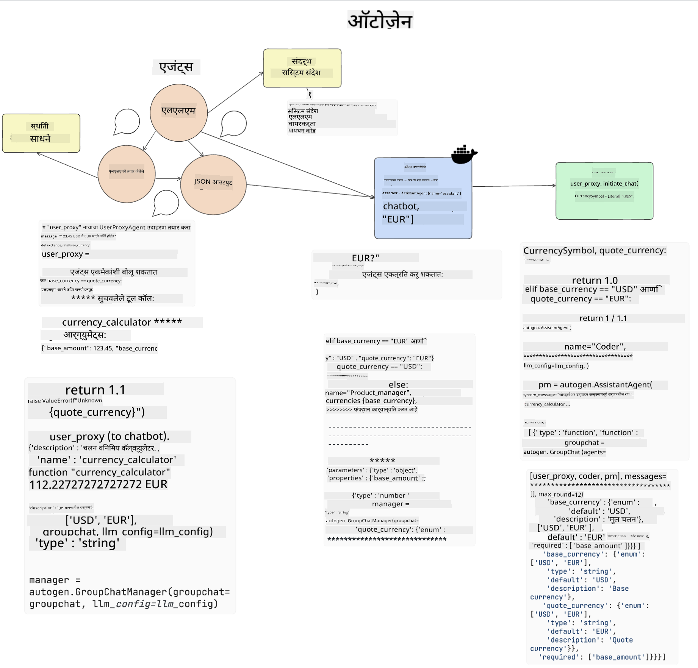
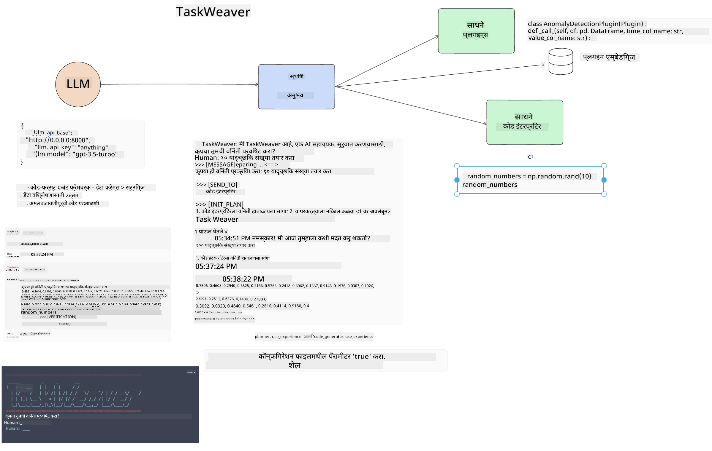

<!--
CO_OP_TRANSLATOR_METADATA:
{
  "original_hash": "11f03c81f190d9cbafd0f977dcbede6c",
  "translation_date": "2025-07-09T17:22:33+00:00",
  "source_file": "17-ai-agents/README.md",
  "language_code": "mr"
}
-->
[](https://aka.ms/gen-ai-lesson17-gh?WT.mc_id=academic-105485-koreyst)

## परिचय

AI एजंट्स हे जनरेटिव AI मधील एक रोमांचक प्रगतीचे उदाहरण आहे, जे मोठ्या भाषा मॉडेल्स (LLMs) ना सहाय्यकांपासून क्रियाशील एजंट्समध्ये रूपांतरित करण्यास सक्षम करतात. AI एजंट फ्रेमवर्क्स विकसकांना असे अनुप्रयोग तयार करण्याची परवानगी देतात जे LLMs ना साधने आणि स्थिती व्यवस्थापनाचा प्रवेश देतात. हे फ्रेमवर्क्स दृश्यता सुधारणे देखील शक्य करतात, ज्यामुळे वापरकर्ते आणि विकसक LLMs द्वारे नियोजित क्रियाकलापांचे निरीक्षण करू शकतात आणि त्यामुळे अनुभव व्यवस्थापन सुधारते.

या धड्यात खालील विषयांचा समावेश असेल:

- AI एजंट म्हणजे काय - AI एजंट म्हणजे नेमके काय?
- चार वेगवेगळ्या AI एजंट फ्रेमवर्क्सचा अभ्यास - त्यांची वैशिष्ट्ये काय आहेत?
- विविध वापर प्रकरणांमध्ये AI एजंट्सचा वापर - AI एजंट्स कधी वापरावेत?

## शिकण्याचे उद्दिष्ट

हा धडा पूर्ण केल्यानंतर, तुम्ही सक्षम असाल:

- AI एजंट्स काय आहेत आणि त्यांचा कसा वापर करता येतो हे समजावून सांगू शकता.
- काही लोकप्रिय AI एजंट फ्रेमवर्क्समधील फरक समजून घेऊ शकता.
- AI एजंट्स कसे कार्य करतात हे समजून त्यांच्यासह अनुप्रयोग तयार करू शकता.

## AI एजंट्स म्हणजे काय?

AI एजंट्स हे जनरेटिव AI च्या जगात एक अत्यंत रोमांचक क्षेत्र आहे. या उत्साहासोबत कधी कधी संज्ञा आणि त्यांचा वापर याबाबत गोंधळही होतो. सर्वसाधारणपणे आणि बहुतेक AI एजंट्स संदर्भित करणाऱ्या साधनांचा समावेश करण्यासाठी, आपण खालील व्याख्या वापरणार आहोत:

AI एजंट्स मोठ्या भाषा मॉडेल्स (LLMs) ना **स्थिती** आणि **साधनां** चा प्रवेश देऊन कार्ये पार पाडण्यास सक्षम करतात.



या संज्ञा स्पष्ट करूया:

**मोठे भाषा मॉडेल्स** - या कोर्समध्ये वापरले जाणारे GPT-3.5, GPT-4, Llama-2 इत्यादी मॉडेल्स.

**स्थिती** - LLM ज्या संदर्भात काम करत आहे तो संदर्भ. LLM त्याच्या मागील क्रियाकलापांचा आणि सध्याच्या संदर्भाचा वापर करून पुढील क्रियांसाठी निर्णय घेतो. AI एजंट फ्रेमवर्क्स विकसकांना हा संदर्भ अधिक सोप्या पद्धतीने व्यवस्थापित करण्यास मदत करतात.

**साधने** - वापरकर्त्याने मागितलेले आणि LLM ने नियोजित केलेले कार्य पूर्ण करण्यासाठी LLM ला साधनांचा प्रवेश आवश्यक असतो. साधनांमध्ये डेटाबेस, API, बाह्य अनुप्रयोग किंवा अगदी दुसरे LLM देखील असू शकतात!

ही व्याख्या पुढे कशी अंमलात आणली जाते हे पाहताना तुम्हाला चांगली समज देईल. चला काही वेगवेगळ्या AI एजंट फ्रेमवर्क्स पाहूया:

## LangChain Agents

[LangChain Agents](https://python.langchain.com/docs/how_to/#agents?WT.mc_id=academic-105485-koreyst) ही वरील व्याख्यांचा अंमलबजावणी आहे.

**स्थिती** व्यवस्थापित करण्यासाठी, ते `AgentExecutor` नावाच्या अंगभूत फंक्शनचा वापर करतात. हे `agent` आणि उपलब्ध `tools` स्वीकारते.

`AgentExecutor` चॅट इतिहास साठवते जेणेकरून चॅटचा संदर्भ मिळू शकेल.


LangChain एक [साधनांची सूची](https://integrations.langchain.com/tools?WT.mc_id=academic-105485-koreyst) देते जी तुम्ही तुमच्या अनुप्रयोगात आयात करू शकता आणि ज्याचा LLM वापर करू शकतो. ही साधने समुदाय आणि LangChain टीमने तयार केली आहेत.

तुम्ही नंतर ही साधने परिभाषित करून `AgentExecutor` ला देऊ शकता.

AI एजंट्सबाबत बोलताना दृश्यता ही देखील महत्त्वाची बाब आहे. अनुप्रयोग विकसकांसाठी हे समजणे आवश्यक आहे की LLM कोणते साधन का वापरत आहे. यासाठी LangChain टीमने LangSmith विकसित केले आहे.

## AutoGen

पुढील AI एजंट फ्रेमवर्क आहे [AutoGen](https://microsoft.github.io/autogen/?WT.mc_id=academic-105485-koreyst). AutoGen चे मुख्य लक्ष संभाषणांवर आहे. एजंट्स हे दोन्ही **संभाषणक्षम** आणि **सानुकूलनीय** आहेत.

**संभाषणक्षम -** LLMs दुसऱ्या LLM सोबत संभाषण सुरू आणि चालू ठेवू शकतात जेणेकरून कार्य पूर्ण करता येईल. हे `AssistantAgents` तयार करून आणि त्यांना विशिष्ट सिस्टम संदेश देऊन केले जाते.

```python

autogen.AssistantAgent( name="Coder", llm_config=llm_config, ) pm = autogen.AssistantAgent( name="Product_manager", system_message="Creative in software product ideas.", llm_config=llm_config, )

```

**सानुकूलनीय** - एजंट्स फक्त LLM म्हणूनच नव्हे तर वापरकर्ता किंवा साधन म्हणून देखील परिभाषित केले जाऊ शकतात. विकसक म्हणून, तुम्ही `UserProxyAgent` परिभाषित करू शकता जो वापरकर्त्याशी संवाद साधून कार्य पूर्ण करण्यासाठी अभिप्राय घेतो. हा अभिप्राय कार्य चालू ठेवू शकतो किंवा थांबवू शकतो.

```python
user_proxy = UserProxyAgent(name="user_proxy")
```

### स्थिती आणि साधने

स्थिती बदलण्यासाठी आणि व्यवस्थापित करण्यासाठी, सहाय्यक एजंट Python कोड तयार करतो जे कार्य पूर्ण करते.

प्रक्रियेचे उदाहरण:



#### सिस्टम संदेशासह LLM परिभाषित

```python
system_message="For weather related tasks, only use the functions you have been provided with. Reply TERMINATE when the task is done."
```

हा सिस्टम संदेश या विशिष्ट LLM ला कोणते फंक्शन्स त्याच्या कार्यासाठी संबंधित आहेत हे निर्देशित करतो. लक्षात ठेवा, AutoGen मध्ये तुम्ही वेगवेगळ्या सिस्टम संदेशांसह अनेक AssistantAgents परिभाषित करू शकता.

#### वापरकर्त्याद्वारे संभाषण सुरू

```python
user_proxy.initiate_chat( chatbot, message="I am planning a trip to NYC next week, can you help me pick out what to wear? ", )

```

`user_proxy` (मानव) कडून हा संदेश एजंटला कोणती फंक्शन्स चालवायची आहेत हे शोधण्याची प्रक्रिया सुरू करतो.

#### फंक्शन चालवले जाते

```bash
chatbot (to user_proxy):

***** Suggested tool Call: get_weather ***** Arguments: {"location":"New York City, NY","time_periond:"7","temperature_unit":"Celsius"} ******************************************************** --------------------------------------------------------------------------------

>>>>>>>> EXECUTING FUNCTION get_weather... user_proxy (to chatbot): ***** Response from calling function "get_weather" ***** 112.22727272727272 EUR ****************************************************************

```

प्रारंभिक चॅट प्रक्रिया झाल्यानंतर, एजंट सुचवलेले साधन कॉल करतो. या उदाहरणात, `get_weather` नावाचे फंक्शन आहे. तुमच्या कॉन्फिगरेशननुसार, हे फंक्शन स्वयंचलितपणे चालवले जाऊ शकते किंवा वापरकर्त्याच्या इनपुटवर चालवले जाऊ शकते.

अधिक जाणून घेण्यासाठी [AutoGen कोड नमुने](https://microsoft.github.io/autogen/docs/Examples/?WT.mc_id=academic-105485-koreyst) पाहू शकता.

## Taskweaver

पुढील एजंट फ्रेमवर्क आहे [Taskweaver](https://microsoft.github.io/TaskWeaver/?WT.mc_id=academic-105485-koreyst). याला "कोड-प्रथम" एजंट म्हणून ओळखले जाते कारण ते फक्त `strings` सोबत काम करत नाही तर Python मधील DataFrames सोबतही काम करू शकते. हे डेटा विश्लेषण आणि निर्मिती कार्यांसाठी खूप उपयुक्त ठरते. जसे की ग्राफ आणि चार्ट तयार करणे किंवा यादृच्छिक संख्या निर्माण करणे.

### स्थिती आणि साधने

संवादाची स्थिती व्यवस्थापित करण्यासाठी, TaskWeaver `Planner` या संकल्पनेचा वापर करते. `Planner` हा एक LLM आहे जो वापरकर्त्यांच्या विनंती घेतो आणि त्या विनंती पूर्ण करण्यासाठी आवश्यक कार्यांची रूपरेषा तयार करतो.

कार्य पूर्ण करण्यासाठी `Planner` ला `Plugins` नावाच्या साधनांच्या संचाचा प्रवेश असतो. हे Python क्लासेस किंवा सामान्य कोड इंटरप्रेटर असू शकतात. हे प्लगइन्स एम्बेडिंग्ज म्हणून साठवले जातात जेणेकरून LLM योग्य प्लगइन शोधू शकेल.



अनोमली डिटेक्शनसाठी प्लगइनचे उदाहरण:

```python
class AnomalyDetectionPlugin(Plugin): def __call__(self, df: pd.DataFrame, time_col_name: str, value_col_name: str):
```

कोड चालवण्यापूर्वी तपासला जातो. Taskweaver मध्ये संदर्भ व्यवस्थापनासाठी आणखी एक वैशिष्ट्य म्हणजे `experience`. Experience मुळे संभाषणाचा संदर्भ दीर्घकालीन YAML फाईलमध्ये साठवला जातो. यामुळे LLM पूर्वीच्या संभाषणांवर आधारित विशिष्ट कार्यांमध्ये वेळोवेळी सुधारणा करू शकतो.

## JARVIS

शेवटचा एजंट फ्रेमवर्क आहे [JARVIS](https://github.com/microsoft/JARVIS?tab=readme-ov-file?WT.mc_id=academic-105485-koreyst). JARVIS चे वैशिष्ट्य म्हणजे तो संभाषणाची `स्थिती` व्यवस्थापित करण्यासाठी LLM वापरतो आणि `tools` म्हणून इतर AI मॉडेल्स वापरतो. प्रत्येक AI मॉडेल विशिष्ट कार्ये पार पाडण्यासाठी तज्ञ असते जसे की ऑब्जेक्ट डिटेक्शन, ट्रान्सक्रिप्शन किंवा इमेज कॅप्शनिंग.


LLM, एक सामान्य उद्देश मॉडेल म्हणून, वापरकर्त्याची विनंती प्राप्त करते आणि विशिष्ट कार्य व त्यासाठी आवश्यक असलेले डेटा/आर्ग्युमेंट्स ओळखते.

```python
[{"task": "object-detection", "id": 0, "dep": [-1], "args": {"image": "e1.jpg" }}]
```

नंतर LLM विनंती अशी स्वरूपित करते की तज्ञ AI मॉडेल समजू शकेल, जसे JSON. AI मॉडेल त्याच्या अंदाजानुसार प्रतिसाद परत करते आणि LLM तो प्रतिसाद प्राप्त करते.

जर कार्य पूर्ण करण्यासाठी अनेक मॉडेल्सची गरज असेल, तर LLM त्या मॉडेल्सचे प्रतिसाद देखील समजून घेते आणि नंतर वापरकर्त्यासाठी अंतिम प्रतिसाद तयार करते.

खालील उदाहरणात वापरकर्ता एखाद्या चित्रातील वस्तूंचे वर्णन आणि संख्या विचारत आहे:

## असाइनमेंट

AI एजंट्सबाबत तुमचे शिक्षण पुढे सुरू ठेवण्यासाठी AutoGen वापरून तुम्ही तयार करू शकता:

- शिक्षण स्टार्टअपच्या विविध विभागांसह व्यवसाय बैठकचे अनुकरण करणारे अनुप्रयोग.
- LLMs ना वेगवेगळ्या व्यक्तिमत्त्वे आणि प्राधान्ये समजावून सांगणारे सिस्टम संदेश तयार करा, ज्यामुळे वापरकर्ता नवीन उत्पादन कल्पना सादर करू शकेल.
- नंतर LLM प्रत्येक विभागाकडून फॉलो-अप प्रश्न तयार करेल जेणेकरून सादरीकरण आणि उत्पादन कल्पना सुधारता येईल.

## शिक्षण येथे थांबत नाही, प्रवास सुरू ठेवा

हा धडा पूर्ण केल्यानंतर, आमच्या [Generative AI Learning collection](https://aka.ms/genai-collection?WT.mc_id=academic-105485-koreyst) मध्ये जाऊन तुमचे Generative AI ज्ञान अधिक वाढवा!

**अस्वीकरण**:  
हा दस्तऐवज AI अनुवाद सेवा [Co-op Translator](https://github.com/Azure/co-op-translator) वापरून अनुवादित केला आहे. आम्ही अचूकतेसाठी प्रयत्नशील असलो तरी, कृपया लक्षात घ्या की स्वयंचलित अनुवादांमध्ये चुका किंवा अचूकतेची कमतरता असू शकते. मूळ दस्तऐवज त्याच्या स्थानिक भाषेत अधिकृत स्रोत मानला जावा. महत्त्वाच्या माहितीसाठी व्यावसायिक मानवी अनुवाद करण्याची शिफारस केली जाते. या अनुवादाच्या वापरामुळे उद्भवणाऱ्या कोणत्याही गैरसमजुती किंवा चुकीच्या अर्थलागी आम्ही जबाबदार नाही.