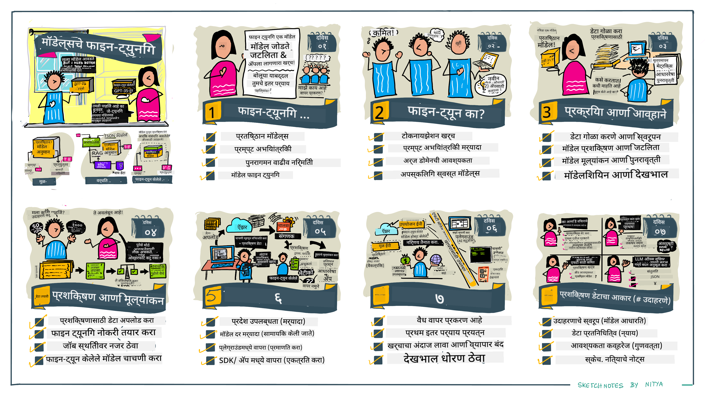

<!--
CO_OP_TRANSLATOR_METADATA:
{
  "original_hash": "68664f7e754a892ae1d8d5e2b7bd2081",
  "translation_date": "2025-05-20T07:42:45+00:00",
  "source_file": "18-fine-tuning/README.md",
  "language_code": "mr"
}
-->

# तुमच्या LLM ला फाइन-ट्यून करणे

मोठ्या भाषिक मॉडेल्सचा वापर करून जनरेटिव्ह AI अनुप्रयोग तयार करताना नवीन आव्हाने येतात. एक महत्त्वाचा मुद्दा म्हणजे मॉडेलने दिलेल्या वापरकर्त्याच्या विनंतीसाठी तयार केलेल्या सामग्रीच्या प्रतिसादाची गुणवत्ता (अचूकता आणि सुसंगतता) सुनिश्चित करणे. मागील धड्यांमध्ये, आम्ही प्रॉम्प्ट इंजिनीअरिंग आणि रिट्रीव्हल-ऑगमेंटेड जनरेशन सारख्या तंत्रांवर चर्चा केली जी विद्यमान मॉडेलच्या इनपुट प्रॉम्प्टमध्ये बदल करून समस्या सोडवण्याचा प्रयत्न करतात.

आजच्या धड्यात, आम्ही तिसऱ्या तंत्रावर चर्चा करतो, **फाइन-ट्यूनिंग**, जे अतिरिक्त डेटा वापरून मॉडेलला पुन्हा प्रशिक्षण देऊन आव्हानावर मात करण्याचा प्रयत्न करते. चला तपशीलात जाऊया.

## शिकण्याची उद्दिष्टे

हा धडा पूर्व-प्रशिक्षित भाषिक मॉडेल्ससाठी फाइन-ट्यूनिंगची संकल्पना सादर करतो, या दृष्टिकोनाचे फायदे आणि आव्हाने एक्सप्लोर करतो आणि तुमच्या जनरेटिव्ह AI मॉडेल्सच्या कार्यक्षमतेत सुधारणा करण्यासाठी फाइन-ट्यूनिंगचा वापर कधी आणि कसा करावा याबद्दल मार्गदर्शन प्रदान करतो.

या धड्याच्या शेवटी, तुम्ही खालील प्रश्नांची उत्तरे देऊ शकता:

- भाषिक मॉडेल्ससाठी फाइन-ट्यूनिंग म्हणजे काय?
- फाइन-ट्यूनिंग कधी आणि का उपयुक्त आहे?
- मी पूर्व-प्रशिक्षित मॉडेलला कसे फाइन-ट्यून करू शकतो?
- फाइन-ट्यूनिंगचे मर्यादा काय आहेत?

तयार आहात? चला सुरुवात करूया.

## चित्रमय मार्गदर्शक

आम्ही जे कव्हर करू त्याचे मोठे चित्र मिळवायचे आहे का? या धड्यासाठी शिकण्याच्या प्रवासाचे वर्णन करणारे चित्रमय मार्गदर्शक पहा - फाइन-ट्यूनिंगसाठी मुख्य संकल्पना आणि प्रेरणा शिकण्यापासून ते फाइन-ट्यूनिंग कार्य पूर्ण करण्यासाठी सर्वोत्तम पद्धती समजून घेण्यापर्यंत. हे अन्वेषण करण्यासाठी एक आकर्षक विषय आहे, म्हणून तुमच्या स्वयं-मार्गदर्शित शिकण्याच्या प्रवासाला समर्थन देण्यासाठी अतिरिक्त लिंकसाठी [संसाधने](./RESOURCES.md?WT.mc_id=academic-105485-koreyst) पृष्ठ तपासण्याचे विसरू नका!

## भाषिक मॉडेल्ससाठी फाइन-ट्यूनिंग म्हणजे काय?

परिभाषेनुसार, मोठे भाषिक मॉडेल्स इंटरनेटसह विविध स्रोतांमधून मिळवलेल्या मोठ्या प्रमाणातील मजकूरावर _पूर्व-प्रशिक्षित_ केलेले असतात. जसे आपण मागील धड्यांमध्ये शिकलो आहोत, वापरकर्त्याच्या प्रश्नांना ("प्रॉम्प्ट्स") मॉडेलच्या प्रतिसादांची गुणवत्ता सुधारण्यासाठी आपल्याला _प्रॉम्प्ट इंजिनीअरिंग_ आणि _रिट्रीव्हल-ऑगमेंटेड जनरेशन_ सारख्या तंत्रांची आवश्यकता आहे.

प्रॉम्प्ट इंजिनीअरिंगचे एक लोकप्रिय तंत्र म्हणजे मॉडेलला प्रतिसादात अपेक्षित असलेल्या गोष्टींबद्दल अधिक मार्गदर्शन देणे, _सूचना_ (स्पष्ट मार्गदर्शन) प्रदान करून किंवा _त्याला काही उदाहरणे देऊन_ (अप्रत्यक्ष मार्गदर्शन) हे केले जाते. याला _फ्यू-शॉट लर्निंग_ म्हणतात परंतु याला दोन मर्यादा आहेत:

- मॉडेल टोकन मर्यादा तुम्ही देऊ शकणार्‍या उदाहरणांची संख्या मर्यादित करू शकतात आणि प्रभावीता मर्यादित करू शकतात.
- मॉडेल टोकन खर्च प्रत्येक प्रॉम्प्टला उदाहरणे जोडणे महाग करू शकतात आणि लवचिकता मर्यादित करू शकतात.

फाइन-ट्यूनिंग हे मशीन लर्निंग सिस्टीम्समध्ये एक सामान्य प्रथा आहे जिथे आपण पूर्व-प्रशिक्षित मॉडेल घेतो आणि विशिष्ट कार्यक्षमतेवर त्याची कार्यक्षमता सुधारण्यासाठी नवीन डेटासह पुन्हा प्रशिक्षण देतो. भाषिक मॉडेल्सच्या संदर्भात, आपण विशिष्ट कार्य किंवा अनुप्रयोग डोमेनसाठी उदाहरणांची निवडक संच _सह_ पूर्व-प्रशिक्षित मॉडेलला फाइन-ट्यून करू शकतो जेणेकरून एक **कस्टम मॉडेल** तयार केले जाऊ शकते जे त्या विशिष्ट कार्य किंवा डोमेनसाठी अधिक अचूक आणि सुसंगत असू शकते. फाइन-ट्यूनिंगचा एक साइड-फायदा म्हणजे फ्यू-शॉट लर्निंगसाठी आवश्यक असलेल्या उदाहरणांची संख्या कमी करणे - टोकन वापर आणि संबंधित खर्च कमी करणे.

## मॉडेल्सला फाइन-ट्यून कधी आणि का करावे?

_या_ संदर्भात, जेव्हा आपण फाइन-ट्यूनिंगबद्दल बोलतो तेव्हा आम्ही **सुपरव्हाइज्ड** फाइन-ट्यूनिंगचा संदर्भ घेतो जिथे पुनः प्रशिक्षण **नवीन डेटा जोडून** केले जाते जो मूळ प्रशिक्षण डेटासेटचा भाग नव्हता. हे अनसुपरव्हाइज्ड फाइन-ट्यूनिंग दृष्टिकोनापेक्षा वेगळे आहे जिथे मॉडेलला मूळ डेटावर पुन्हा प्रशिक्षण दिले जाते, परंतु भिन्न हायपरपॅरामीटर्ससह.

लक्षात ठेवण्यासारखी महत्त्वाची गोष्ट म्हणजे फाइन-ट्यूनिंग ही एक प्रगत तंत्र आहे ज्यासाठी अपेक्षित परिणाम मिळवण्यासाठी एक विशिष्ट स्तराची कौशल्य आवश्यक आहे. चुकीच्या पद्धतीने केल्यास, हे अपेक्षित सुधारणा प्रदान करू शकत नाही आणि तुमच्या लक्ष्यित डोमेनसाठी मॉडेलच्या कार्यक्षमतेतही घट करू शकते.

म्हणून, तुम्ही भाषिक मॉडेल्सला फाइन-ट्यून कसे करायचे ते शिकण्यापूर्वी, तुम्हाला हे जाणून घेणे आवश्यक आहे की तुम्ही हा मार्ग का स्वीकारावा आणि फाइन-ट्यूनिंगची प्रक्रिया कधी सुरू करावी. स्वतःला हे प्रश्न विचारून सुरुवात करा:

- **वापर केस**: फाइन-ट्यूनिंगसाठी तुमचा _वापर केस_ काय आहे? विद्यमान पूर्व-प्रशिक्षित मॉडेलच्या कोणत्या पैलूवर तुम्ही सुधारणा करू इच्छिता?
- **पर्याय**: इच्छित परिणाम साध्य करण्यासाठी तुम्ही _इतर तंत्रांचा_ प्रयत्न केला आहे का? तुलना करण्यासाठी त्यांचा वापर करून एक बेसलाइन तयार करा.
  - प्रॉम्प्ट इंजिनीअरिंग: संबंधित प्रॉम्प्ट प्रतिसादांची उदाहरणे असलेल्या फ्यू-शॉट प्रॉम्प्टिंग सारख्या तंत्रांचा प्रयत्न करा. प्रतिसादांची गुणवत्ता मूल्यांकन करा.
  - रिट्रीव्हल ऑगमेंटेड जनरेशन: तुमच्या डेटाचा शोध घेऊन पुनर्प्राप्त केलेल्या क्वेरी परिणामांसह प्रॉम्प्ट्स वाढवण्याचा प्रयत्न करा. प्रतिसादांची गुणवत्ता मूल्यांकन करा.
- **खर्च**: तुम्ही फाइन-ट्यूनिंगसाठी खर्च ओळखले आहेत का?
  - ट्यूनॅबिलिटी - फाइन-ट्यूनिंगसाठी पूर्व-प्रशिक्षित मॉडेल उपलब्ध आहे का?
  - प्रयत्न - प्रशिक्षण डेटा तयार करण्यासाठी, मॉडेलचे मूल्यांकन आणि परिष्करण करण्यासाठी.
  - संगणन - फाइन-ट्यूनिंग जॉब चालवण्यासाठी आणि फाइन-ट्यून केलेले मॉडेल तैनात करण्यासाठी
  - डेटा - फाइन-ट्यूनिंग प्रभावासाठी पुरेशा गुणवत्ता उदाहरणांमध्ये प्रवेश
- **फायदे**: तुम्ही फाइन-ट्यूनिंगसाठी फायदे पुष्टी केले आहेत का?
  - गुणवत्ता - फाइन-ट्यून केलेल्या मॉडेलने बेसलाइनपेक्षा चांगली कामगिरी केली आहे का?
  - खर्च - प्रॉम्प्ट्स सुलभ करून टोकन वापर कमी करतो का?
  - विस्तारक्षमता - तुम्ही नवीन डोमेनसाठी बेस मॉडेल पुनर्प्रयोजित करू शकता का?

या प्रश्नांची उत्तरे देऊन, तुम्ही तुमच्या वापर केससाठी फाइन-ट्यूनिंग योग्य दृष्टिकोन आहे का हे ठरवू शकता. आदर्शपणे, दृष्टिकोन फक्त तेव्हाच वैध आहे जेव्हा फायदे खर्चापेक्षा जास्त असतात. एकदा तुम्ही पुढे जाण्याचा निर्णय घेतला की, पूर्व-प्रशिक्षित मॉडेलला फाइन-ट्यून कसे करता येईल याचा विचार करण्याची वेळ आली आहे.

निर्णय प्रक्रियेबद्दल अधिक माहिती मिळवायची आहे का? [फाइन-ट्यून करावे किंवा फाइन-ट्यून करु नये](https://www.youtube.com/watch?v=0Jo-z-MFxJs) पहा

## पूर्व-प्रशिक्षित मॉडेलला कसे फाइन-ट्यून करू शकतो?

पूर्व-प्रशिक्षित मॉडेलला फाइन-ट्यून करण्यासाठी, तुम्हाला आवश्यक आहे:

- फाइन-ट्यून करण्यासाठी पूर्व-प्रशिक्षित मॉडेल
- फाइन-ट्यूनिंगसाठी वापरण्यासाठी डेटासेट
- फाइन-ट्यूनिंग जॉब चालवण्यासाठी प्रशिक्षण वातावरण
- फाइन-ट्यून केलेले मॉडेल तैनात करण्यासाठी होस्टिंग वातावरण

## फाइन-ट्यूनिंग प्रत्यक्षात

खालील संसाधने निवडक मॉडेल आणि निवडक डेटासेट वापरून तुम्हाला वास्तविक उदाहरणातून मार्गदर्शन करण्यासाठी चरण-दर-चरण ट्यूटोरियल प्रदान करतात. या ट्यूटोरियल्समधून काम करण्यासाठी, तुम्हाला विशिष्ट प्रदात्यावर खाते आवश्यक आहे, संबंधित मॉडेल आणि डेटासेट्समध्ये प्रवेशासह.

| प्रदाता     | ट्यूटोरियल                                                                                                                                                                       | वर्णन                                                                                                                                                                                                                                                                                                                                                                                                                        |
| ------------ | ------------------------------------------------------------------------------------------------------------------------------------------------------------------------------ | ---------------------------------------------------------------------------------------------------------------------------------------------------------------------------------------------------------------------------------------------------------------------------------------------------------------------------------------------------------------------------------------------------------------------------------- |
| OpenAI       | [चॅट मॉडेल्स कसे फाइन-ट्यून करावे](https://github.com/openai/openai-cookbook/blob/main/examples/How_to_finetune_chat_models.ipynb?WT.mc_id=academic-105485-koreyst)                | प्रशिक्षण डेटा तयार करून, फाइन-ट्यूनिंग जॉब चालवून आणि अनुमानासाठी फाइन-ट्यून केलेले मॉडेल वापरून विशिष्ट डोमेन ("रेसिपी असिस्टंट") साठी `gpt-35-turbo` फाइन-ट्यून करणे शिकणे.                                                                                                                                                                                                                                              |
| Azure OpenAI | [GPT 3.5 टर्बो फाइन-ट्यूनिंग ट्यूटोरियल](https://learn.microsoft.com/azure/ai-services/openai/tutorials/fine-tune?tabs=python-new%2Ccommand-line?WT.mc_id=academic-105485-koreyst) | फाइन-ट्यूनिंग जॉब चालवण्यासाठी प्रशिक्षण डेटा तयार करण्याच्या आणि अपलोड करण्याच्या चरणांचा अवलंब करून **Azure वर** `gpt-35-turbo-0613` मॉडेल फाइन-ट्यून करणे शिकणे. नवीन मॉडेल तैनात करा आणि वापरा.                                                                                                                                                                                                                                                                 |
| Hugging Face | [Hugging Face सह LLMs फाइन-ट्यून करणे](https://www.philschmid.de/fine-tune-llms-in-2024-with-trl?WT.mc_id=academic-105485-koreyst)                                               | हा ब्लॉग पोस्ट तुम्हाला _ओपन LLM_ (उदा: `CodeLlama 7B`) फाइन-ट्यूनिंगसाठी [transformers](https://huggingface.co/docs/transformers/index?WT.mc_id=academic-105485-koreyst) लायब्ररी आणि [Transformer Reinforcement Learning (TRL)](https://huggingface.co/docs/trl/index?WT.mc_id=academic-105485-koreyst]) सह आणि Hugging Face वर ओपन [datasets](https://huggingface.co/docs/datasets/index?WT.mc_id=academic-105485-koreyst) वापरून मार्गदर्शन करते. |
|              |                                                                                                                                                                                |                                                                                                                                                                                                                                                                                                                                                                                                                                    |
| 🤗 AutoTrain | [AutoTrain सह LLMs फाइन-ट्यून करणे](https://github.com/huggingface/autotrain-advanced/?WT.mc_id=academic-105485-koreyst)                                                         | AutoTrain (किंवा AutoTrain Advanced) ही Hugging Face द्वारे विकसित केलेली पायथन लायब्ररी आहे जी LLM फाइन-ट्यूनिंगसह अनेक वेगवेगळ्या कार्यांसाठी फाइन-ट्यूनिंग करण्यास अनुमती देते. AutoTrain हे नो-कोड सोल्यूशन आहे आणि फाइन-ट्यूनिंग तुमच्या स्वतःच्या क्लाउडमध्ये, Hugging Face Spaces वर किंवा स्थानिक स्तरावर केले जाऊ शकते. हे वेब-आधारित GUI, CLI आणि yaml कॉन्फिग फाइल्सद्वारे प्रशिक्षण दोन्हीला समर्थन देते.                                                                               |
|              |                                                                                                                                                                                |                                                                                                                                                                                                                                                                                                                                                                                                                                    |

## असाइनमेंट

वरील ट्यूटोरियल्सपैकी एक निवडा आणि त्यातून चालत जा. _आम्ही फक्त संदर्भासाठी या रेपोमध्ये Jupyter Notebooks मध्ये या ट्यूटोरियल्सची आवृत्ती पुनरुत्पादित करू शकतो. कृपया नवीनतम आवृत्त्या मिळवण्यासाठी मूळ स्रोतांचा थेट वापर करा_.

## उत्कृष्ट काम! तुमचे शिक्षण सुरू ठेवा.

हा धडा पूर्ण केल्यानंतर, तुमचे जनरेटिव्ह AI ज्ञान वाढवण्यासाठी आमचा [Generative AI Learning collection](https://aka.ms/genai-collection?WT.mc_id=academic-105485-koreyst) पहा!

अभिनंदन!! तुम्ही या कोर्सच्या v2 मालिकेतील अंतिम धडा पूर्ण केला आहे! शिकणे आणि तयार करणे थांबवू नका. \*\*फक्त या विषयासाठी अतिरिक्त सूचनांसाठी [RESOURCES](RESOURCES.md?WT.mc_id=academic-105485-koreyst) पृष्ठ पहा.

आमच्या v1 मालिकेतील धड्यांचे अधिक असाइनमेंट आणि संकल्पनांसह अद्यतनित केले गेले आहे. त्यामुळे तुमचे ज्ञान ताजेतवाने करण्यासाठी एक मिनिट घ्या - आणि कृपया [तुमचे प्रश्न आणि अभिप्राय शेअर करा](https://github.com/microsoft/generative-ai-for-beginners/issues?WT.mc_id=academic-105485-koreyst) या धड्यांना समुदायासाठी सुधारण्यासाठी आम्हाला मदत करण्यासाठी.

**अस्वीकृति**:  
हा दस्तऐवज AI भाषांतर सेवा [Co-op Translator](https://github.com/Azure/co-op-translator) चा वापर करून भाषांतरित केला आहे. आम्ही अचूकतेसाठी प्रयत्नशील असलो तरी कृपया लक्षात ठेवा की स्वयंचलित भाषांतरे त्रुटी किंवा अचूकतेच्या अभावाने ग्रस्त असू शकतात. मूळ भाषेतील दस्तऐवज अधिकृत स्रोत मानला जावा. महत्त्वाच्या माहितीसाठी, व्यावसायिक मानवी भाषांतराची शिफारस केली जाते. या भाषांतराचा वापर करून उद्भवणाऱ्या कोणत्याही गैरसमज किंवा चुकीच्या अर्थासाठी आम्ही जबाबदार नाही.