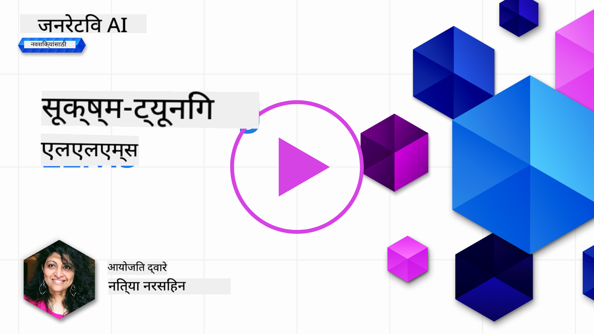
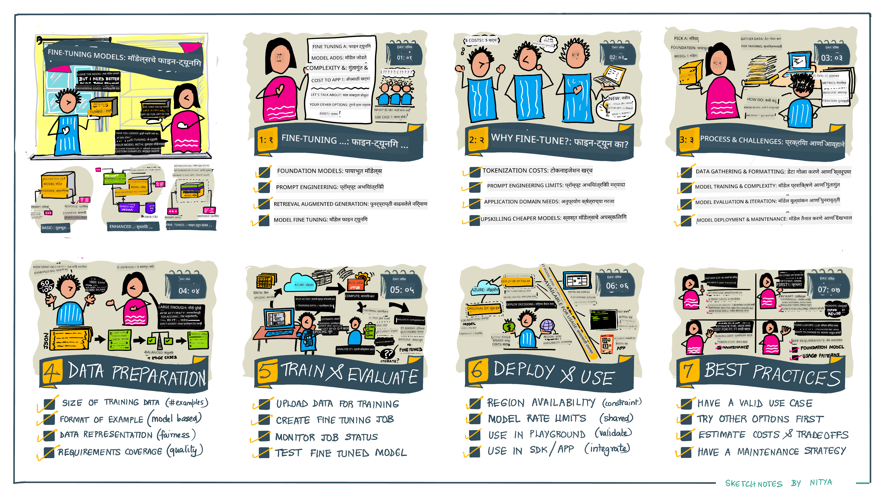

<!--
CO_OP_TRANSLATOR_METADATA:
{
  "original_hash": "807f0d9fc1747e796433534e1be6a98a",
  "translation_date": "2025-10-17T13:52:15+00:00",
  "source_file": "18-fine-tuning/README.md",
  "language_code": "mr"
}
-->

# तुमचा LLM फाइन-ट्यून करणे

मोठ्या भाषा मॉडेल्सचा वापर करून जनरेटिव्ह AI अॅप्लिकेशन्स तयार करताना नवीन आव्हाने येतात. मुख्य समस्या म्हणजे वापरकर्त्याच्या विनंतीसाठी मॉडेलद्वारे तयार केलेल्या सामग्रीमध्ये प्रतिसादाची गुणवत्ता (अचूकता आणि सुसंगतता) सुनिश्चित करणे. मागील धड्यांमध्ये, आम्ही प्रॉम्प्ट इंजिनिअरिंग आणि रिट्रीव्हल-अगमेंटेड जनरेशन यासारख्या तंत्रांचा अभ्यास केला जो विद्यमान मॉडेलसाठी _प्रॉम्प्ट इनपुट बदलून_ समस्या सोडवण्याचा प्रयत्न करतो.

आजच्या धड्यात, आम्ही तिसऱ्या तंत्राचा अभ्यास करतो, **फाइन-ट्यूनिंग**, जे _मॉडेलला अतिरिक्त डेटासह पुन्हा प्रशिक्षण देऊन_ आव्हान सोडवण्याचा प्रयत्न करते. चला, तपशीलात जाऊया.

## शिकण्याची उद्दिष्टे

हा धडा प्री-ट्रेन केलेल्या भाषा मॉडेल्ससाठी फाइन-ट्यूनिंगची संकल्पना सादर करतो, या दृष्टिकोनाचे फायदे आणि आव्हाने शोधतो आणि तुमच्या जनरेटिव्ह AI मॉडेल्सची कार्यक्षमता सुधारण्यासाठी फाइन-ट्यूनिंग कधी आणि कसे वापरावे याबद्दल मार्गदर्शन प्रदान करतो.

या धड्याच्या शेवटी, तुम्ही खालील प्रश्नांची उत्तरे देऊ शकता:

- भाषा मॉडेल्ससाठी फाइन-ट्यूनिंग म्हणजे काय?
- फाइन-ट्यूनिंग कधी आणि का उपयुक्त आहे?
- प्री-ट्रेन मॉडेल कसे फाइन-ट्यून करू शकतो?
- फाइन-ट्यूनिंगची मर्यादा काय आहेत?

तयार आहात? चला सुरुवात करूया.

## चित्रात्मक मार्गदर्शक

आम्ही सखोल अभ्यास करण्यापूर्वी आपण काय कव्हर करणार आहोत याची मोठी चित्र मिळवायची आहे का? या धड्याच्या शिकण्याच्या प्रवासाचे वर्णन करणारा चित्रात्मक मार्गदर्शक पहा - फाइन-ट्यूनिंगसाठी मुख्य संकल्पना आणि प्रेरणा शिकण्यापासून ते प्रक्रिया समजून घेणे आणि फाइन-ट्यूनिंग कार्य अंमलात आणण्यासाठी सर्वोत्तम पद्धती समजून घेणे. हे एक आकर्षक विषय आहे, त्यामुळे तुमच्या स्व-मार्गदर्शित शिक्षण प्रवासाला समर्थन देण्यासाठी अतिरिक्त दुव्यांसाठी [Resources](./RESOURCES.md?WT.mc_id=academic-105485-koreyst) पृष्ठ तपासायला विसरू नका!

## भाषा मॉडेल्ससाठी फाइन-ट्यूनिंग म्हणजे काय?

परिभाषेने, मोठ्या भाषा मॉडेल्स _प्री-ट्रेन_ केले जातात, विविध स्रोतांमधून इंटरनेटसह मोठ्या प्रमाणात मजकूरावर आधारित. मागील धड्यांमध्ये, आम्ही वापरकर्त्याच्या प्रश्नांना ("प्रॉम्प्ट्स") प्रतिसाद देण्यासाठी मॉडेलच्या गुणवत्तेत सुधारणा करण्यासाठी _प्रॉम्प्ट इंजिनिअरिंग_ आणि _रिट्रीव्हल-अगमेंटेड जनरेशन_ यासारख्या तंत्रांची आवश्यकता असल्याचे शिकले.

प्रॉम्प्ट इंजिनिअरिंग तंत्रामध्ये मॉडेलला प्रतिसादामध्ये अपेक्षित असलेल्या गोष्टींबद्दल अधिक मार्गदर्शन देणे समाविष्ट आहे, _सूचना_ (स्पष्ट मार्गदर्शन) प्रदान करून किंवा _काही उदाहरणे देऊन_ (अप्रत्यक्ष मार्गदर्शन). याला _फ्यू-शॉट लर्निंग_ म्हणतात, परंतु याला दोन मर्यादा आहेत:

- मॉडेल टोकन मर्यादा तुम्ही देऊ शकणाऱ्या उदाहरणांची संख्या मर्यादित करू शकते आणि प्रभावीपणा मर्यादित करू शकते.
- मॉडेल टोकन खर्च प्रत्येक प्रॉम्प्टमध्ये उदाहरणे जोडणे महाग बनवू शकते आणि लवचिकता मर्यादित करू शकते.

फाइन-ट्यूनिंग ही मशीन लर्निंग सिस्टममध्ये सामान्य प्रथा आहे जिथे आम्ही प्री-ट्रेन मॉडेल घेतो आणि विशिष्ट कार्यावर त्याची कार्यक्षमता सुधारण्यासाठी नवीन डेटासह पुन्हा प्रशिक्षण देतो. भाषा मॉडेल्सच्या संदर्भात, आम्ही प्री-ट्रेन मॉडेल _विशिष्ट कार्य किंवा अॅप्लिकेशन डोमेनसाठी उदाहरणांचा निवडक संच_ वापरून फाइन-ट्यून करू शकतो जेणेकरून विशिष्ट कार्य किंवा डोमेनसाठी अधिक अचूक आणि संबंधित असलेले **कस्टम मॉडेल** तयार करता येईल. फाइन-ट्यूनिंगचा एक साइड-फायदा म्हणजे फ्यू-शॉट लर्निंगसाठी आवश्यक उदाहरणांची संख्या कमी होऊ शकते - टोकन वापर आणि संबंधित खर्च कमी होतो.

## मॉडेल्स कधी आणि का फाइन-ट्यून करावेत?

_या_ संदर्भात, जेव्हा आपण फाइन-ट्यूनिंगबद्दल बोलतो, तेव्हा आम्ही **सुपरव्हाइज्ड** फाइन-ट्यूनिंगचा संदर्भ देतो जिथे पुन्हा प्रशिक्षण **नवीन डेटा जोडून** केले जाते जो मूळ प्रशिक्षण डेटासेटचा भाग नव्हता. हे अनसुपरव्हाइज्ड फाइन-ट्यूनिंग दृष्टिकोनापेक्षा वेगळे आहे जिथे मॉडेल मूळ डेटावर पुन्हा प्रशिक्षण दिले जाते, परंतु भिन्न हायपरपॅरामीटर्ससह.

महत्त्वाची गोष्ट लक्षात ठेवण्यासारखी आहे की फाइन-ट्यूनिंग ही एक प्रगत तंत्र आहे ज्यासाठी अपेक्षित परिणाम मिळविण्यासाठी विशिष्ट स्तराच्या कौशल्याची आवश्यकता असते. चुकीच्या पद्धतीने केल्यास, ते अपेक्षित सुधारणा प्रदान करू शकत नाही आणि तुमच्या लक्ष्यित डोमेनसाठी मॉडेलची कार्यक्षमता कमी करू शकते.

म्हणून, भाषा मॉडेल्स "कसे" फाइन-ट्यून करायचे ते शिकण्यापूर्वी, तुम्हाला "का" हे मार्ग निवडावे लागेल आणि फाइन-ट्यूनिंग प्रक्रिया सुरू करण्यासाठी "कधी" विचार करणे आवश्यक आहे. स्वतःला हे प्रश्न विचारून सुरुवात करा:

- **वापर प्रकरण**: फाइन-ट्यूनिंगसाठी तुमचे _वापर प्रकरण_ काय आहे? तुम्हाला सध्याच्या प्री-ट्रेन मॉडेलच्या कोणत्या पैलू सुधारायचे आहेत?
- **पर्याय**: इच्छित परिणाम साध्य करण्यासाठी _इतर तंत्र_ वापरले आहेत का? तुलना करण्यासाठी बेसलाइन तयार करण्यासाठी त्यांचा वापर करा.
  - प्रॉम्प्ट इंजिनिअरिंग: संबंधित प्रॉम्प्ट प्रतिसादांच्या उदाहरणांसह फ्यू-शॉट प्रॉम्प्टिंग सारख्या तंत्रांचा प्रयत्न करा. प्रतिसादांची गुणवत्ता मूल्यांकन करा.
  - रिट्रीव्हल-अगमेंटेड जनरेशन: तुमच्या डेटाचा शोध घेऊन पुनर्प्राप्त केलेल्या क्वेरी परिणामांसह प्रॉम्प्ट्स वाढवण्याचा प्रयत्न करा. प्रतिसादांची गुणवत्ता मूल्यांकन करा.
- **खर्च**: तुम्ही फाइन-ट्यूनिंगसाठी खर्च ओळखले आहेत का?
  - ट्यूनॅबिलिटी - प्री-ट्रेन मॉडेल फाइन-ट्यूनिंगसाठी उपलब्ध आहे का?
  - प्रयत्न - प्रशिक्षण डेटा तयार करण्यासाठी, मॉडेलचे मूल्यांकन आणि परिष्करणासाठी.
  - संगणन - फाइन-ट्यूनिंग जॉब चालवण्यासाठी आणि फाइन-ट्यून मॉडेल तैनात करण्यासाठी.
  - डेटा - फाइन-ट्यूनिंग प्रभावासाठी पुरेसे गुणवत्ता उदाहरणे प्रवेश.
- **फायदे**: तुम्ही फाइन-ट्यूनिंगसाठी फायदे पुष्टी केले आहेत का?
  - गुणवत्ता - फाइन-ट्यून मॉडेलने बेसलाइनपेक्षा चांगली कामगिरी केली आहे का?
  - खर्च - प्रॉम्प्ट्स सुलभ करून टोकन वापर कमी करतो का?
  - विस्तारक्षमता - तुम्ही बेस मॉडेल नवीन डोमेनसाठी पुनरुत्पादित करू शकता का?

हे प्रश्नांची उत्तरे देऊन, तुम्ही फाइन-ट्यूनिंग तुमच्या वापर प्रकरणासाठी योग्य दृष्टिकोन आहे का हे ठरवू शकता. आदर्शपणे, दृष्टिकोन वैध आहे फक्त फायदे खर्चापेक्षा जास्त असल्यास. एकदा तुम्ही पुढे जाण्याचा निर्णय घेतला की, प्री-ट्रेन मॉडेल कसे फाइन-ट्यून करू शकता याचा विचार करण्याची वेळ आली आहे.

निर्णय प्रक्रियेवर अधिक अंतर्दृष्टी मिळवायची आहे का? [To fine-tune or not to fine-tune](https://www.youtube.com/watch?v=0Jo-z-MFxJs) पहा.

## प्री-ट्रेन मॉडेल कसे फाइन-ट्यून करू शकतो?

प्री-ट्रेन मॉडेल फाइन-ट्यून करण्यासाठी, तुम्हाला आवश्यक आहे:

- फाइन-ट्यून करण्यासाठी प्री-ट्रेन मॉडेल
- फाइन-ट्यूनिंगसाठी वापरण्यासाठी डेटासेट
- फाइन-ट्यूनिंग जॉब चालवण्यासाठी प्रशिक्षण वातावरण
- फाइन-ट्यून मॉडेल तैनात करण्यासाठी होस्टिंग वातावरण

## फाइन-ट्यूनिंग अॅक्शनमध्ये

खालील संसाधने निवडलेल्या मॉडेलसह निवडक डेटासेट वापरून वास्तविक उदाहरणाद्वारे तुम्हाला मार्गदर्शन करण्यासाठी चरण-दर-चरण ट्यूटोरियल प्रदान करतात. या ट्यूटोरियल्सद्वारे काम करण्यासाठी, तुम्हाला विशिष्ट प्रदात्यावर खाते आवश्यक आहे, संबंधित मॉडेल आणि डेटासेट्ससह प्रवेश आवश्यक आहे.

| प्रदाता       | ट्यूटोरियल                                                                                                                                                                       | वर्णन                                                                                                                                                                                                                                                                                                                                                                                                                        |
| ------------ | ------------------------------------------------------------------------------------------------------------------------------------------------------------------------------ | ---------------------------------------------------------------------------------------------------------------------------------------------------------------------------------------------------------------------------------------------------------------------------------------------------------------------------------------------------------------------------------------------------------------------------------- |
| OpenAI       | [How to fine-tune chat models](https://github.com/openai/openai-cookbook/blob/main/examples/How_to_finetune_chat_models.ipynb?WT.mc_id=academic-105485-koreyst)                | प्रशिक्षण डेटा तयार करून, फाइन-ट्यूनिंग जॉब चालवून आणि अनुमानासाठी फाइन-ट्यून मॉडेल वापरून विशिष्ट डोमेन ("रेसिपी असिस्टंट") साठी `gpt-35-turbo` फाइन-ट्यून करणे शिकणे.                                                                                                                                                                                                                                              |
| Azure OpenAI | [GPT 3.5 Turbo fine-tuning tutorial](https://learn.microsoft.com/azure/ai-services/openai/tutorials/fine-tune?tabs=python-new%2Ccommand-line?WT.mc_id=academic-105485-koreyst) | प्रशिक्षण डेटा तयार करण्यासाठी आणि अपलोड करण्यासाठी, फाइन-ट्यूनिंग जॉब चालवण्यासाठी Azure वर `gpt-35-turbo-0613` मॉडेल फाइन-ट्यून करणे शिकणे. नवीन मॉडेल तैनात करा आणि वापरा.                                                                                                                                                                                                                                                                 |
| Hugging Face | [Fine-tuning LLMs with Hugging Face](https://www.philschmid.de/fine-tune-llms-in-2024-with-trl?WT.mc_id=academic-105485-koreyst)                                               | हा ब्लॉग पोस्ट तुम्हाला [transformers](https://huggingface.co/docs/transformers/index?WT.mc_id=academic-105485-koreyst) लायब्ररी आणि [Transformer Reinforcement Learning (TRL)](https://huggingface.co/docs/trl/index?WT.mc_id=academic-105485-koreyst) सह उघडलेल्या [datasets](https://huggingface.co/docs/datasets/index?WT.mc_id=academic-105485-koreyst) वर Hugging Face वर _open LLM_ (उदा: `CodeLlama 7B`) फाइन-ट्यूनिंग शिकवते. |
|              |                                                                                                                                                                                |                                                                                                                                                                                                                                                                                                                                                                                                                                    |
| 🤗 AutoTrain | [Fine-tuning LLMs with AutoTrain](https://github.com/huggingface/autotrain-advanced/?WT.mc_id=academic-105485-koreyst)                                                         | AutoTrain (किंवा AutoTrain Advanced) ही Hugging Face द्वारे विकसित केलेली एक पायथन लायब्ररी आहे जी LLM फाइन-ट्यूनिंगसह अनेक वेगवेगळ्या कार्यांसाठी फाइन-ट्यूनिंगला अनुमती देते. AutoTrain ही नो-कोड सोल्यूशन आहे आणि फाइन-ट्यूनिंग तुमच्या स्वतःच्या क्लाउडमध्ये, Hugging Face Spaces वर किंवा स्थानिक पातळीवर केली जाऊ शकते. हे वेब-आधारित GUI, CLI आणि yaml कॉन्फिग फाइल्सद्वारे प्रशिक्षण दोन्ही समर्थन करते.                                                                               |
|              |                                                                                                                                                                                |                                                                                                                                                                                                                                                                                                                                                                                                                                    |

## असाइनमेंट

वरील ट्यूटोरियल्सपैकी एक निवडा आणि त्याद्वारे काम करा. _आम्ही या रेपोमध्ये संदर्भासाठी या ट्यूटोरियल्सची आवृत्ती Jupyter Notebooks मध्ये पुनरुत्पादित करू शकतो. कृपया नवीनतम आवृत्त्या मिळवण्यासाठी मूळ स्रोत थेट वापरा_.

## उत्तम काम! तुमचे शिक्षण सुरू ठेवा.

हा धडा पूर्ण केल्यानंतर, आमचा [Generative AI Learning collection](https://aka.ms/genai-collection?WT.mc_id=academic-105485-koreyst) तपासा जेणेकरून तुमचे जनरेटिव्ह AI ज्ञान वाढवता येईल!

अभिनंदन!! तुम्ही या कोर्ससाठी v2 मालिकेतील अंतिम धडा पूर्ण केला आहे! शिकणे आणि तयार करणे थांबवू नका. \*\*या विषयासाठी अतिरिक्त सूचनांच्या यादीसाठी [RESOURCES](RESOURCES.md?WT.mc_id=academic-105485-koreyst) पृष्ठ तपासा.

आमच्या v1 मालिकेतील धडे अधिक असाइनमेंट्स आणि संकल्पनांसह अद्यतनित केले गेले आहेत. त्यामुळे तुमचे ज्ञान ताजेतवाने करण्यासाठी एक मिनिट घ्या - आणि कृपया [share your questions and feedback](https://github.com/microsoft/generative-ai-for-beginners/issues?WT.mc_id=academic-105485-koreyst) समुदायासाठी हे धडे सुधारण्यात मदत करण्यासाठी.

---

**अस्वीकरण**:  
हा दस्तऐवज AI भाषांतर सेवा [Co-op Translator](https://github.com/Azure/co-op-translator) वापरून भाषांतरित करण्यात आला आहे. आम्ही अचूकतेसाठी प्रयत्नशील असलो तरी, कृपयास लक्षात घ्या की स्वयंचलित भाषांतरे त्रुटी किंवा अचूकतेच्या अभावाने युक्त असू शकतात. मूळ भाषेतील दस्तऐवज हा अधिकृत स्रोत मानला जावा. महत्त्वाच्या माहितीसाठी, व्यावसायिक मानवी भाषांतराची शिफारस केली जाते. या भाषांतराचा वापर करून उद्भवलेल्या कोणत्याही गैरसमज किंवा चुकीच्या अर्थासाठी आम्ही जबाबदार नाही.