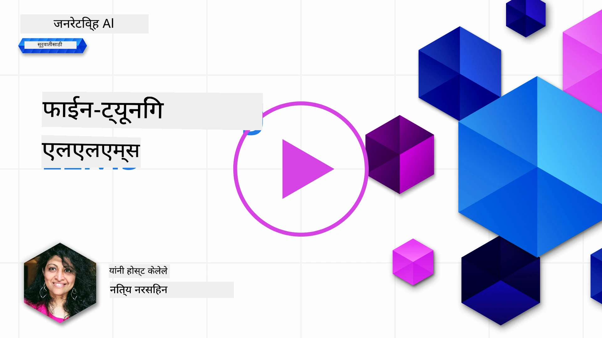
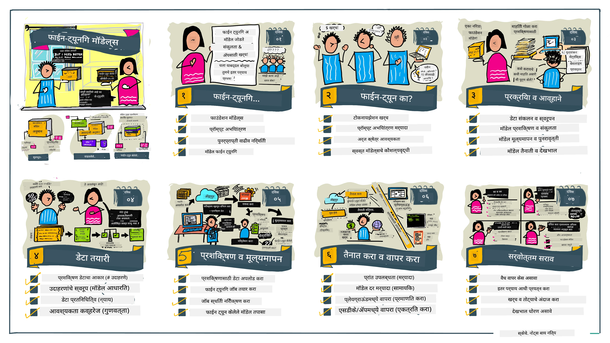

# तुमचा LLM फाईन-ट्यून करा

मोठे भाषा मॉडेल्स वापरून जनरेटिव्ह AI अनुप्रयोग तयार करताना नवीन आव्हाने येतात. मुख्य समस्या म्हणजे दिलेल्या वापरकर्ता विनंतीसाठी मॉडेलद्वारे तयार केलेल्या सामग्रीत प्रतिसादाची गुणवत्ता (अचूकता आणि सादृश्यता) सुनिश्चित करणे. मागील धड्यांमध्ये, आपण प्रॉम्प्ट इंजिनिअरिंग आणि रिट्रीव्हल-ऑगमेंटेड जनरेशन सारख्या तंत्रज्ञानावर चर्चा केली जी समस्या मॉडेलच्या आधीच्याच प्रॉम्प्ट इनपुटमध्ये बदल करून सोडवण्याचा प्रयत्न करतात.

आजच्या धड्यात, आपण तिसरे तंत्रज्ञान, **फाईन-ट्यूनिंग**, यावर चर्चा करणार आहोत, जे _मॉडेल स्वतःला_ अतिरिक्त डेटासह पुन्हा प्रशिक्षण देऊन आव्हान दूर करण्याचा प्रयत्न करते. चला तपशीलात पाहूया.

## शिक्षण उद्दिष्टे

हा धडा पूर्वप्रशिक्षित भाषा मॉडेल्ससाठी फाईन-ट्यूनिंग या संकल्पनेची ओळख करतो, या पद्धतीच्या फायदे आणि आव्हाने तपासतो, आणि तुमच्या जनरेटिव्ह AI मॉडेल्सच्या कार्यक्षमतेत सुधारणा करण्यासाठी फाईन-ट्यूनिंग केव्हा आणि कसे करावे यासाठी मार्गदर्शन देतो.

या धड्याच्या शेवटी, तुम्ही खालील प्रश्नांची उत्तरे देऊ शकाल:

- भाषा मॉडेल्ससाठी फाईन-ट्यूनिंग म्हणजे काय?
- फाईन-ट्यूनिंग केव्हा आणि का उपयुक्त आहे?
- मी पूर्वप्रशिक्षित मॉडेल कसे फाईन-ट्यून करू शकतो?
- फाईन-ट्यूनिंगच्या मर्यादा काय आहेत?

तयार? चला सुरू करूया.

## चित्रांसह मार्गदर्शक

आपण सुरुवातीस आकडेवारीच्या एकूण चित्रावर पाहू इच्छित असल्यास, हा चित्रांसह मार्गदर्शक तपासा जो फाईन-ट्यूनिंगसाठी कोर संकल्पना आणि प्रेरणा शिकण्यापासून ते पुन्हा प्रशिक्षण प्रक्रियेपर्यंत आणि उत्तम सरावांसाठी शिकवतो. ही एक आकर्षक विषय आहे, म्हणून तुमच्या स्व-मार्गदर्शित शिक्षण यात्रेसाठी [साधनांसाठी](./RESOURCES.md?WT.mc_id=academic-105485-koreyst) पृष्ठ जरूर तपासा!

## भाषा मॉडेल्ससाठी फाईन-ट्यूनिंग म्हणजे काय?

परिभाषेनुसार, मोठे भाषा मॉडेल्स हे इंटरनेटसारख्या विविध स्रोतांकडून मोठ्या प्रमाणात मजकूरावर _पूर्वप्रशिक्षित_ केलेले असतात. आपण मागील धड्यांमध्ये शिकले आहे की, वापरकर्त्याच्या प्रश्नांना ("प्रॉम्प्ट्स") अधिक चांगले उत्तर मिळवण्यासाठी _प्रॉम्प्ट इंजिनिअरिंग_ आणि _रिट्रीव्हल-ऑगमेंटेड जनरेशन_ सारख्या तंत्रज्ञानांची आवश्यकता आहे.

एक लोकप्रिय प्रॉम्प्ट-इंजिनिअरिंग तंत्र म्हणजे मॉडेलला अपेक्षित प्रतिसादाबद्दल अधिक मार्गदर्शन देणे, ते पाठविलेले _सूचना_ (स्पष्ट मार्गदर्शन) किंवा _काही उदाहरणे देणे_ (अप्रत्यक्ष मार्गदर्शन) याद्वारे. याला _फ्यू-शॉट लर्निंग_ म्हणतात, पण याला दोन मर्यादा आहेत:

- मॉडेलच्या टोकन मर्यादांमुळे तुम्ही दिलेले उदाहरणांची संख्या मर्यादित होते, ज्यामुळे परिणामकारकता कमी होते.
- मॉडेलच्या टोकन खर्चामुळे प्रत्येक प्रॉम्प्टमध्ये उदाहरणे घालणे महागडे पडू शकते, ज्यामुळे लवचिकता कमी होते.

फाईन-ट्यूनिंग ही मशीन लर्निंग सिस्टम्समध्ये एक सामान्य पद्धत आहे जिथे आपण पूर्वप्रशिक्षित मॉडेल घेऊन नवीन डेटाने पुनःप्रशिक्षित करतो ज्यामुळे एखाद्या विशिष्ट कार्यावर त्याचा कार्यप्रदर्शन सुधारेल. भाषा मॉडेल्सच्या संदर्भात, आपण पूर्वप्रशिक्षित मॉडेलला _विशिष्ट कार्य किंवा अनुप्रयोग क्षेत्रासाठी एका क्युरेट केलेल्या उदाहरण संचासह_ फाईन-ट्यून करू शकतो आणि अशाप्रकारे प्रत्येक क्षेत्रासाठी अधिक अचूक आणि सुसंगत **सानुकूल मॉडेल** तयार करू शकतो. फाईन-ट्यूनिंगचा एक साइड-बेनिफिट म्हणजे फ्यू-शॉट लर्निंगसाठी आवश्यक उदाहरणांची संख्या देखील कमी होऊ शकते - ज्यामुळे टोकन वापर आणि संबंधित खर्चांमध्ये बचत होते.

## आपण कधी आणि का फाईन-ट्यून करावी?

_या_ संदर्भात, जेव्हा आपण फाईन-ट्यूनिंगबद्दल बोलतो, तेव्हा आपण **सुपरवाइज्ड** फाईन-ट्यूनिंगबद्दल बोलत आहोत जिथे पुनःप्रशिक्षणासाठी **मूळ प्रशिक्षण डेटासेटमधील नव्हते असे नवीन डेटा जोडले जातो**. हे अनसुपरवाइज्ड फाईन-ट्यूनिंगच्या पद्धतीपेक्षा वेगळे आहे जिथे मॉडेल मूळ डेटा वापरून पण वेगळ्या हायपरपॅरामीटर्ससह पुनःप्रशिक्षित केले जाते.

महत्वाची गोष्ट म्हणजे फाईन-ट्यूनिंग ही एक प्रगत तंत्र आहे ज्यासाठी अपेक्षित परिणाम मिळविण्यासाठी विशिष्ट कौशल्य आवश्यक असते. जर चुकीच्या पद्धतीने केली, तर अपेक्षित सुधारणा मिळणार नाहीत आणि तुमच्या लक्षित क्षेत्रासाठी मॉडेलचा कार्यप्रदर्शन नाश होऊ शकतो.

म्हणून "कसे" फाईन-ट्यून करावे हे शिकण्याआधी, तुम्हाला माहित असणे आवश्यक आहे की "का" तुम्हाला फाईन-ट्यूनिंगचा मार्ग स्वीकारायचा आहे आणि "कधी" फाईन-ट्यूनिंग प्रक्रिया सुरू करायची आहे. स्वतःला हे प्रश्न विचारा:

- **वापर प्रकरण**: तुमचा फाईन-ट्यूनिंगसाठी _वापर प्रकरण_ काय आहे? सध्याच्या पूर्वप्रशिक्षित मॉडेलमधील कोणते पैलू तुम्हाला सुधारायचे आहेत?
- **पर्याय**: तुम्ही अपेक्षित परिणाम साध्य करण्यासाठी _इतर तंत्र वापरले आहेत का_? त्यांच्याशी तुलना करण्यासाठी त्यांचा उपयोग करा.
  - प्रॉम्प्ट इंजिनिअरिंग: संबंधित प्रॉम्प्ट उत्तरांच्या उदाहरणांसह फ्यू-शॉट प्रॉम्प्टिंग वापरून प्रयत्न करा. प्रतिसादांची गुणवत्ता तपासा.
  - रिट्रीव्हल ऑगमेंटेड जनरेशन: तुमच्या डेटावर शोध घेऊन प्रश्न उत्तर बढ़वून पहा. प्रतिसादांची गुणवत्ता तपासा.
- **खर्च**: फाईन-ट्यूनिंगसाठी खर्चांची माहिती आहे का?
  - ट्युनिबिलिटी - पूर्वप्रशिक्षित मॉडेल फाईन-ट्यूनिंगसाठी उपलब्ध आहे का?
  - प्रयत्न - प्रशिक्षण डेटाच्या तयारीसाठी, मॉडेलचे मूल्यांकन आणि सुधारणा करण्यासाठी
  - संगणकीय साधन - फाईन-ट्यूनिंग जॉब चालवण्यासाठी आणि फाईन-ट्यून केलेले मॉडेल तैनात करण्यासाठी
  - डेटा - फाईन-ट्यूनिंगसाठी पुरेशी दर्जेदार उदाहरणे उपलब्ध आहेत का?
- **फायदे**: फाईन-ट्यूनिंगचे फायदे पुष्टी केले आहेत का?
  - गुणवत्ता - फाईन-ट्यून केलेले मॉडेल मूळातल्या मॉडेलपेक्षा चांगले आहे का?
  - खर्च - प्रॉम्प्ट सोप्या करून टोकन वापर कमी करतो का?
  - विस्तारणीयता - तुम्ही मूळ मॉडेल नवीन क्षेत्रांसाठी पुन्हा वापरू शकता का?

या प्रश्नांची उत्तरे देऊन, तुम्ही ठरवू शकता की फाईन-ट्यूनिंग तुमच्या वापर प्रकरणासाठी योग्य आहे का. आदर्शपणे, तो मार्ग फक्त तेव्हाच योग्य आहे जेव्हा फायदे खर्चांपेक्षा जास्त असतात. एकदा तुम्ही पुढे जाण्याचा निर्णय घेतल्यास, तुम्हाला फाईन-ट्यूनिंग कसे करायचे हे विचारायला पाहिजे.

निर्णय प्रक्रियेबद्दल अधिक माहिती हवी का? पाहा [To fine-tune or not to fine-tune](https://www.youtube.com/watch?v=0Jo-z-MFxJs)

## आपण पूर्वप्रशिक्षित मॉडेल कसे फाईन-ट्यून करू शकतो?

पूर्वप्रशिक्षित मॉडेल फाईन-ट्यून करण्यासाठी, तुमच्याकडे असणे आवश्यक आहे:

- फाईन-ट्यून करण्यासाठी पूर्वप्रशिक्षित मॉडेल
- फाईन-ट्यूनसाठी वापरण्यासाठी डेटासेट
- फाईन-ट्यूनिंग जॉब चालविण्याचा प्रशिक्षिण वातावरण
- फाईन-ट्यून केलेले मॉडेल तैनात करण्यासाठी होस्टिंग वातावरण

## फाईन-ट्यूनिंग क्रियाशील

खालील संसाधने निवडलेल्या मॉडेलशी आणि क्युरेट केलेल्या डेटासेटसह एक वास्तविक उदाहरण दाखवून स्टेप-बाय-स्टेप ट्यूटोरियल देतात. या ट्यूटोरियल्सवर काम करण्यासाठी, तुम्हाला संबंधित प्रदात्याचे खाते आणि संबंधित मॉडेल व डेटासेटसाठी प्रवेश आवश्यक आहे.

| प्रदाता     | ट्यूटोरियल                                                                                                                                                                    | वर्णन                                                                                                                                                                                                                                                                                                                                                                                                                              |
| ------------ | ------------------------------------------------------------------------------------------------------------------------------------------------------------------------------ | ---------------------------------------------------------------------------------------------------------------------------------------------------------------------------------------------------------------------------------------------------------------------------------------------------------------------------------------------------------------------------------------------------------------------------------- |
| OpenAI       | [How to fine-tune chat models](https://github.com/openai/openai-cookbook/blob/main/examples/How_to_finetune_chat_models.ipynb?WT.mc_id=academic-105485-koreyst)               | `gpt-35-turbo` ला एका विशिष्ट क्षेत्रासाठी ("recipe assistant") कसे फाईन-ट्यून करायचे ते शिकून घ्या; त्यासाठी प्रशिक्षण डेटा तयार करणे, फाईन-ट्यूनिंग जॉब चालवणे, आणि फाईन-ट्यून केलेले मॉडेल वापरून इन्फरन्स करणे.                                                                                                                                                                                                             |
| Azure OpenAI | [GPT 3.5 Turbo fine-tuning tutorial](https://learn.microsoft.com/azure/ai-services/openai/tutorials/fine-tune?tabs=python-new%2Ccommand-line&WT.mc_id=academic-105485-koreyst) | Azure वर `gpt-35-turbo-0613` मॉडेल कसे फाईन-ट्यून करायचे ते शिका; प्रशिक्षण डेटा तयार करणे व अपलोड करणे, फाईन-ट्यूनिंग जॉब चालविणे, नवीन मॉडेल तैनात करणे आणि उपयोग करणे.                                                                                                                                                                                                                                                        |
| Hugging Face | [Fine-tuning LLMs with Hugging Face](https://www.philschmid.de/fine-tune-llms-in-2024-with-trl?WT.mc_id=academic-105485-koreyst)                                              | या ब्लॉग पोस्टमध्ये तुम्हाला `_open LLM_` (उदा. `CodeLlama 7B`) कसे फाईन-ट्यून करायचे ते शिकवले आहे, ज्यासाठी [transformers](https://huggingface.co/docs/transformers/index?WT.mc_id=academic-105485-koreyst) लायब्ररी आणि [Transformer Reinforcement Learning (TRL)](https://huggingface.co/docs/trl/index?WT.mc_id=academic-105485-koreyst) वापरली जाते, तसेच Hugging Face वर उपलब्ध खुल्या [datasets](https://huggingface.co/docs/datasets/index?WT.mc_id=academic-105485-koreyst) सोबत. |
|              |                                                                                                                                                                                |                                                                                                                                                                                                                                                                                                                                                                                                                                    |
| 🤗 AutoTrain | [Fine-tuning LLMs with AutoTrain](https://github.com/huggingface/autotrain-advanced/?WT.mc_id=academic-105485-koreyst)                                                        | AutoTrain (किंवा AutoTrain Advanced) ही Hugging Face द्वारे विकसित पायथन लायब्ररी आहे जी अनेक वेगवेगळ्या कामांसाठी, त्यात LLM फाईन-ट्यूनिंगसाठी, सोपी फाईन-ट्यूनिंगची सुविधा देते. AutoTrain हे नो-कोड समाधान आहे आणि तुम्ही ते तुमच्या स्वतःच्या क्लाऊडमध्ये, Hugging Face Spaces मध्ये किंवा स्थानिकरित्या वापरू शकता. या मध्ये वेब-GUI, CLI आणि yaml कॉन्फिग फाइल्सद्वारे प्रशिक्षण यांचा समावेश आहे.                                        |
|              |                                                                                                                                                                                |                                                                                                                                                                                                                                                                                                                                                                                                                                    |
| 🦥 Unsloth | [Fine-tuning LLMs with Unsloth](https://github.com/unslothai/unsloth)                                                          | Unsloth हे एक खुल्या स्त्रोत फ्रेमवर्क आहे जे LLM फाईन-ट्यूनिंग आणि रिइन्फोर्समेंट लर्निंग (RL) ला समर्थन देते. Unsloth स्थानिक प्रशिक्षण, मूल्यांकन आणि तैनाती सहजतेने करण्यासाठी तयार [नोटबुक्स](https://github.com/unslothai/notebooks) प्रदान करते. हे टेक्स्ट-टू-स्पीच (TTS), BERT आणि मल्टीमोडल मॉडेल्सना देखील समर्थन देते. सुरुवात करण्यासाठी त्यांचा तपशीलवार [Fine-tuning LLMs Guide](https://docs.unsloth.ai/get-started/fine-tuning-llms-guide) वाचा.                           |
|              |                                                                                                                                                                                |                                                                                                                                                                                                                                                                                                                                                                                                                                    |
## असाइनमेंट

वरील ट्यूटोरियलपैकी एक निवडा आणि त्याचा अभ्यास करा. _आम्ही कदाचित या ट्यूटोरियलमधील एक आवृत्ती Jupyter Notebooks मध्ये रेफरन्ससाठी येथे ठेवू शकू, तरीही कृपया तुमच्या स्वतःच्या अभिप्रायासाठी मूळ स्त्रोत थेट वापरा._

## उत्कृष्ट काम! तुमचे शिक्षण सुरू ठेवा.

हा धडा पूर्ण केल्यानंतर, आमच्या [Generative AI Learning collection](https://aka.ms/genai-collection?WT.mc_id=academic-105485-koreyst) पाहा आणि तुमचे जनरेटिव्ह AI ज्ञान अधिक वाढवा!

अभिनंदन!! तुम्ही या कोर्सच्या v2 मालिकेतील अंतिम धडा पूर्ण केला आहे! शिक्षण आणि निर्मिती यांना थांबवू नका. \*\*फक्त या विषयासाठी अतिरिक्त सूचना पाहण्यासाठी [RESOURCES](RESOURCES.md?WT.mc_id=academic-105485-koreyst) पृष्ठ तपासा.

आमच्या v1 मालिकेतील धडे देखील अधिक असाइनमेंट्स आणि संकल्पनांसह अद्ययावत झाले आहेत. त्यामुळे एक मिनिट काढून तुमचे ज्ञान ताजे करा - आणि कृपया [तुमचे प्रश्न व अभिप्राय](https://github.com/microsoft/generative-ai-for-beginners/issues?WT.mc_id=academic-105485-koreyst) शेअर करा ज्यामुळे आम्हाला समुदायासाठी हे धडे सुधारण्यात मदत होईल.

---

<!-- CO-OP TRANSLATOR DISCLAIMER START -->
**स्पष्टीकरण**:
हा दस्तऐवज AI अनुवाद सेवा [Co-op Translator](https://github.com/Azure/co-op-translator) वापरून अनुवादित केला आहे. आम्ही अचूकतेसाठी प्रयत्न करतो, परंतु कृपया लक्षात घ्या की स्वयंचलित अनुवादांमध्ये चुका किंवा अचूकतेच्या त्रुटी असू शकतात. मूळ दस्तऐवज त्याच्या स्थानिक भाषेत अधिकृत स्रोत मानला जावा. महत्त्वाची माहिती साठी व्यावसायिक मानवी अनुवादाची शिफारस केली जाते. या अनुवाद वापरामुळे उद्भवणाऱ्या कोणत्याही गैरसमजुतीसाठी किंवा चुकीच्या अर्थसंकल्पांसाठी आम्ही जबाबदार नाही.
<!-- CO-OP TRANSLATOR DISCLAIMER END -->