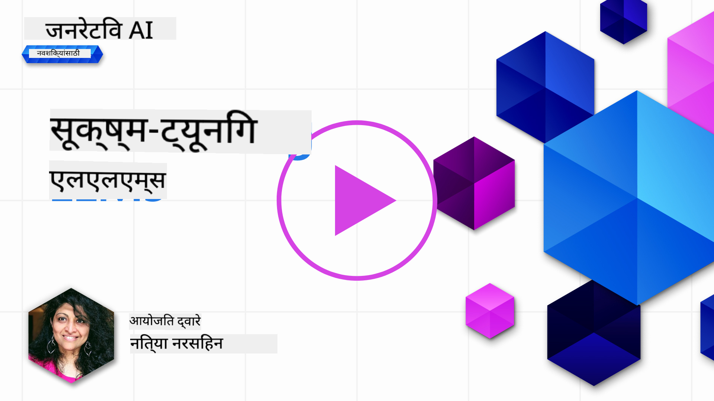
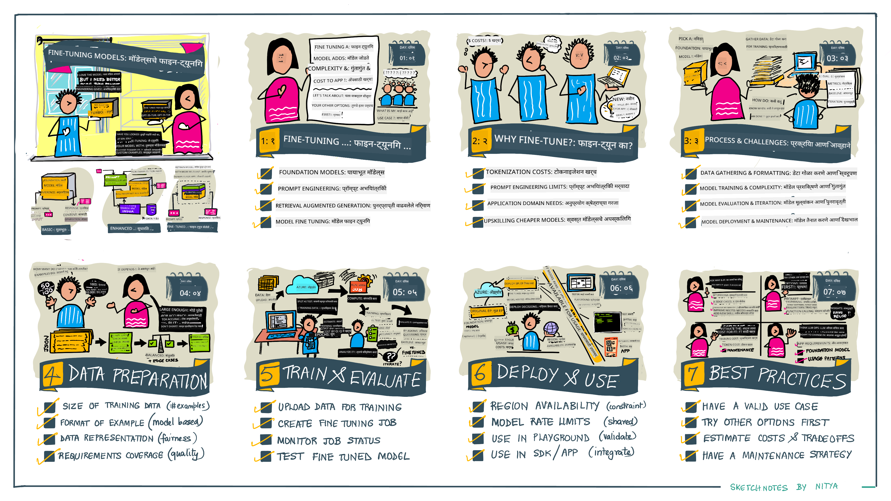

<!--
CO_OP_TRANSLATOR_METADATA:
{
  "original_hash": "68664f7e754a892ae1d8d5e2b7bd2081",
  "translation_date": "2025-06-26T00:37:21+00:00",
  "source_file": "18-fine-tuning/README.md",
  "language_code": "mr"
}
-->

# तुमचे LLM फाइन-ट्यूनिंग करा

मोठ्या भाषा मॉडेल्सचा वापर करून जनरेटिव्ह AI अनुप्रयोग तयार करताना नवीन आव्हाने येतात. एक प्रमुख मुद्दा म्हणजे दिलेल्या वापरकर्त्याच्या विनंतीसाठी मॉडेलद्वारे व्युत्पन्न केलेल्या सामग्रीमध्ये प्रतिसादाची गुणवत्ता (अचूकता आणि सुसंगतता) सुनिश्चित करणे. मागील धड्यांमध्ये, आम्ही _मॉडेलमध्ये इनपुट बदलून_ समस्येचे निराकरण करण्याचा प्रयत्न करणाऱ्या प्रॉम्प्ट इंजिनिअरिंग आणि रिट्रीव्हल-अगमेंटेड जनरेशन सारख्या तंत्रांचा चर्चा केला.

आजच्या धड्यात, आम्ही तिसऱ्या तंत्राचा, **फाइन-ट्यूनिंग**, चर्चा करतो, जे _स्वत: मॉडेलला पुनः प्रशिक्षण देऊन_ आव्हान सोडवण्याचा प्रयत्न करते. चला, तपशीलात जाऊया.

## शिकण्याचे उद्दिष्ट

हा धडा प्री-ट्रेन केलेल्या भाषा मॉडेल्ससाठी फाइन-ट्यूनिंगची संकल्पना सादर करतो, या दृष्टिकोनाचे फायदे आणि आव्हाने शोधतो आणि तुमच्या जनरेटिव्ह AI मॉडेल्सच्या कार्यक्षमतेत सुधारणा करण्यासाठी फाइन ट्यूनिंग कधी आणि कसे वापरावे याबद्दल मार्गदर्शन प्रदान करतो.

या धड्याच्या शेवटी, तुम्हाला खालील प्रश्नांची उत्तरे देता येतील:

- भाषा मॉडेल्ससाठी फाइन ट्यूनिंग म्हणजे काय?
- फाइन ट्यूनिंग कधी आणि का उपयुक्त आहे?
- मी प्री-ट्रेन केलेले मॉडेल कसे फाइन-ट्यून करू शकतो?
- फाइन-ट्यूनिंगचे मर्यादा काय आहेत?

तयार आहात? चला सुरुवात करूया.

## चित्रित मार्गदर्शक

आम्ही काय कव्हर करू याचे मोठे चित्र मिळवायचे आहे का? या चित्रित मार्गदर्शकाची तपासणी करा जी फाइन-ट्यूनिंगसाठी कोर संकल्पना आणि प्रेरणा शिकण्यापासून ते फाइन-ट्यूनिंग कार्यासाठी सर्वोत्तम पद्धती आणि प्रक्रिया समजून घेण्याच्या शिकण्याच्या प्रवासाचे वर्णन करते. हे अन्वेषणासाठी एक आकर्षक विषय आहे, त्यामुळे तुमच्या स्व-मार्गदर्शित शिकण्याच्या प्रवासाला समर्थन देण्यासाठी अतिरिक्त लिंकसाठी [संसाधने](./RESOURCES.md?WT.mc_id=academic-105485-koreyst) पृष्ठ तपासायला विसरू नका!

## भाषा मॉडेल्ससाठी फाइन-ट्यूनिंग म्हणजे काय?

परिभाषेप्रमाणे, मोठी भाषा मॉडेल्स इंटरनेटसह विविध स्रोतांकडून मिळालेल्या मोठ्या प्रमाणातील मजकूरावर _प्री-ट्रेन_ केलेली आहेत. जसे आपण मागील धड्यांमध्ये शिकले आहे, वापरकर्त्याच्या प्रश्नांना ("प्रॉम्प्ट्स") मॉडेलच्या प्रतिसादांची गुणवत्ता सुधारण्यासाठी _प्रॉम्प्ट इंजिनिअरिंग_ आणि _रिट्रीव्हल-अगमेंटेड जनरेशन_ सारख्या तंत्रांची आवश्यकता आहे.

प्रॉम्प्ट इंजिनिअरिंग तंत्रामध्ये मॉडेलला प्रतिसादात काय अपेक्षित आहे याबद्दल अधिक मार्गदर्शन देणे समाविष्ट आहे, _सूचना_ (स्पष्ट मार्गदर्शन) प्रदान करून किंवा _त्याला काही उदाहरणे देऊन_ (अस्पष्ट मार्गदर्शन). याला _फ्यू-शॉट लर्निंग_ असे म्हटले जाते परंतु त्याला दोन मर्यादा आहेत:

- मॉडेल टोकन मर्यादा तुम्ही देऊ शकता त्या उदाहरणांची संख्या मर्यादित करू शकतात आणि कार्यक्षमता मर्यादित करू शकतात.
- मॉडेल टोकन खर्च प्रत्येक प्रॉम्प्टमध्ये उदाहरणे जोडणे महाग बनवू शकते आणि लवचिकता मर्यादित करू शकते.

फाइन-ट्यूनिंग ही मशीन लर्निंग प्रणालींमध्ये सामान्य पद्धत आहे जिथे आम्ही प्री-ट्रेन केलेले मॉडेल घेतो आणि विशिष्ट कार्यावर त्याच्या कार्यक्षमतेत सुधारणा करण्यासाठी नवीन डेटा सह त्याला पुन्हा प्रशिक्षण देतो. भाषा मॉडेल्सच्या संदर्भात, आम्ही प्री-ट्रेन केलेले मॉडेल _दिलेल्या कार्यासाठी किंवा अनुप्रयोग डोमेनसाठी क्युरेट केलेल्या उदाहरणांच्या सेटसह_ फाइन-ट्यून करू शकतो ज्यामुळे **कस्टम मॉडेल** तयार होते जे त्या विशिष्ट कार्यासाठी किंवा डोमेनसाठी अधिक अचूक आणि संबंधित असू शकते. फाइन-ट्यूनिंगचा एक साइड-फायदा म्हणजे फ्यू-शॉट लर्निंगसाठी आवश्यक उदाहरणांची संख्या कमी करू शकते - टोकन वापर आणि संबंधित खर्च कमी करणे.

## मॉडेल्सचे फाइन-ट्यूनिंग कधी आणि का करावे?

_या_ संदर्भात, जेव्हा आपण फाइन-ट्यूनिंगबद्दल बोलतो, तेव्हा आम्ही **सुपरवाइज्ड** फाइन-ट्यूनिंगचा उल्लेख करतो जिथे पुनः प्रशिक्षण **नवीन डेटा जोडून** केले जाते जो मूळ प्रशिक्षण डेटासेटचा भाग नव्हता. हे अनसुपरवाइज्ड फाइन-ट्यूनिंग दृष्टिकोनापेक्षा वेगळे आहे जिथे मॉडेल मूळ डेटावर पुन्हा प्रशिक्षण दिले जाते, परंतु भिन्न हायपरपॅरामीटर्ससह.

लक्षात ठेवण्याची मुख्य गोष्ट म्हणजे फाइन-ट्यूनिंग हे एक प्रगत तंत्र आहे जे अपेक्षित परिणाम मिळवण्यासाठी विशिष्ट स्तराच्या कौशल्याची आवश्यकता आहे. जर चुकीचे केले तर, ते अपेक्षित सुधारणा प्रदान करू शकत नाही, आणि तुमच्या लक्षित डोमेनसाठी मॉडेलची कार्यक्षमता कमी करू शकते.

तर, तुम्ही भाषा मॉडेल्स कसे फाइन-ट्यून करायचे ते शिकण्यापूर्वी, तुम्हाला हे माहित असणे आवश्यक आहे की तुम्ही हा मार्ग का स्वीकारावा, आणि फाइन-ट्यूनिंग प्रक्रिया कधी सुरू करावी. स्वतःला हे प्रश्न विचारून प्रारंभ करा:

- **वापर केस**: तुमचा फाइन-ट्यूनिंगसाठी _वापर केस_ काय आहे? सध्याच्या प्री-ट्रेन मॉडेलच्या कोणत्या पैलू सुधारण्यासाठी तुम्ही प्रयत्न करत आहात?
- **पर्याय**: तुम्ही अपेक्षित परिणाम साध्य करण्यासाठी _इतर तंत्र_ वापरून पाहिले आहे का? त्यांचा तुलना करण्यासाठी बेसलाइन तयार करण्यासाठी वापरा.
  - प्रॉम्प्ट इंजिनिअरिंग: संबंधित प्रॉम्प्ट प्रतिसादांचे उदाहरणे देऊन फ्यू-शॉट प्रॉम्प्टिंगसारख्या तंत्रांचा प्रयत्न करा. प्रतिसादांची गुणवत्ता मूल्यांकन करा.
  - रिट्रीव्हल अगमेंटेड जनरेशन: तुमच्या डेटाची शोध घेऊन पुनर्प्राप्त केलेल्या क्वेरी परिणामांसह प्रॉम्प्ट्स वाढवण्याचा प्रयत्न करा. प्रतिसादांची गुणवत्ता मूल्यांकन करा.
- **खर्च**: तुम्ही फाइन-ट्यूनिंगसाठी खर्च ओळखले आहेत का?
  - ट्यूनॅबिलिटी - प्री-ट्रेन मॉडेल फाइन-ट्यूनिंगसाठी उपलब्ध आहे का?
  - प्रयत्न - प्रशिक्षण डेटा तयार करण्यासाठी, मॉडेल मूल्यांकन आणि परिष्कृत करण्यासाठी.
  - संगणक - फाइन-ट्यूनिंग जॉब चालवण्यासाठी, आणि फाइन-ट्यून केलेले मॉडेल तैनात करण्यासाठी
  - डेटा - फाइन-ट्यूनिंग प्रभावासाठी पुरेशा गुणवत्ता उदाहरणांमध्ये प्रवेश
- **फायदे**: तुम्ही फाइन-ट्यूनिंगसाठी फायदे निश्चित केले आहेत का?
  - गुणवत्ता - फाइन-ट्यून केलेले मॉडेल बेसलाइनपेक्षा अधिक चांगले होते का?
  - खर्च - प्रॉम्प्ट्स सोप्या करून टोकन वापर कमी करते का?
  - विस्तारक्षमता - तुम्ही नवीन डोमेनसाठी बेस मॉडेल पुनर्प्रयोजित करू शकता का?

या प्रश्नांची उत्तरे देऊन, तुम्ही तुमच्या वापर केससाठी फाइन-ट्यूनिंग योग्य दृष्टिकोन आहे का हे ठरवू शकता. आदर्शपणे, दृष्टिकोन वैध आहे केवळ तेव्हाच जेव्हा फायदे खर्चांपेक्षा अधिक आहेत. एकदा तुम्ही पुढे जाण्याचा निर्णय घेतला की, तुम्ही प्री-ट्रेन मॉडेल कसे फाइन ट्यून करू शकता याचा विचार करण्याची वेळ आली आहे.

निर्णय घेण्याच्या प्रक्रियेबद्दल अधिक अंतर्दृष्टी मिळवायची आहे का? [फाइन-ट्यून करायचे की नाही करायचे](https://www.youtube.com/watch?v=0Jo-z-MFxJs) पहा

## आम्ही प्री-ट्रेन केलेले मॉडेल कसे फाइन-ट्यून करू शकतो?

प्री-ट्रेन केलेले मॉडेल फाइन-ट्यून करण्यासाठी तुम्हाला आवश्यक आहे:

- फाइन-ट्यून करण्यासाठी प्री-ट्रेन केलेले मॉडेल
- फाइन-ट्यूनिंगसाठी वापरण्यासाठी डेटासेट
- फाइन-ट्यूनिंग जॉब चालवण्यासाठी प्रशिक्षण वातावरण
- फाइन-ट्यून केलेले मॉडेल तैनात करण्यासाठी होस्टिंग वातावरण

## फाइन-ट्यूनिंग प्रत्यक्षात

खालील संसाधने निवडलेल्या मॉडेलसह क्युरेटेड डेटासेट वापरून तुम्हाला खऱ्या उदाहरणातून मार्गदर्शन करणारे ट्यूटोरियल्स प्रदान करतात. या ट्यूटोरियल्सद्वारे काम करण्यासाठी, तुम्हाला विशिष्ट प्रदात्यावर खाते आवश्यक आहे, संबंधित मॉडेल आणि डेटासेटमध्ये प्रवेशासह.

| प्रदाता     | ट्यूटोरियल                                                                                                                                                                        | वर्णन                                                                                                                                                                                                                                                                                                                                                                                                                        |
| ------------ | -------------------------------------------------------------------------------------------------------------------------------------------------------------------------------- | ---------------------------------------------------------------------------------------------------------------------------------------------------------------------------------------------------------------------------------------------------------------------------------------------------------------------------------------------------------------------------------------------------------------------------------- |
| OpenAI       | [चॅट मॉडेल्स कसे फाइन-ट्यून करायचे](https://github.com/openai/openai-cookbook/blob/main/examples/How_to_finetune_chat_models.ipynb?WT.mc_id=academic-105485-koreyst)                | प्रशिक्षण डेटा तयार करून, फाइन-ट्यूनिंग जॉब चालवून आणि अनुमानासाठी फाइन-ट्यून केलेले मॉडेल वापरून विशिष्ट डोमेन ("रेसिपी असिस्टंट") साठी `gpt-35-turbo` फाइन-ट्यून करायला शिकता.                                                                                                                                                                                                                                              |
| Azure OpenAI | [GPT 3.5 Turbo फाइन-ट्यूनिंग ट्यूटोरियल](https://learn.microsoft.com/azure/ai-services/openai/tutorials/fine-tune?tabs=python-new%2Ccommand-line?WT.mc_id=academic-105485-koreyst) | प्रशिक्षण डेटा तयार करण्यासाठी आणि अपलोड करण्यासाठी, फाइन-ट्यूनिंग जॉब चालवण्यासाठी उपाययोजना करून **Azure वर** `gpt-35-turbo-0613` मॉडेल फाइन-ट्यून करायला शिकता. नवीन मॉडेल तैनात करा आणि वापरा.                                                                                                                                                                                                                                                                 |
| Hugging Face | [Hugging Face सह LLMs फाइन-ट्यूनिंग](https://www.philschmid.de/fine-tune-llms-in-2024-with-trl?WT.mc_id=academic-105485-koreyst)                                               | हे ब्लॉग पोस्ट तुम्हाला [transformers](https://huggingface.co/docs/transformers/index?WT.mc_id=academic-105485-koreyst) लायब्ररी आणि [Transformer Reinforcement Learning (TRL)](https://huggingface.co/docs/trl/index?WT.mc_id=academic-105485-koreyst]) सह उघडलेल्या [datasets](https://huggingface.co/docs/datasets/index?WT.mc_id=academic-105485-koreyst) वर Hugging Face वर _उघड LLM_ (उदा: `CodeLlama 7B`) फाइन-ट्यूनिंग करताना मार्गदर्शन करते. |
|              |                                                                                                                                                                                  |                                                                                                                                                                                                                                                                                                                                                                                                                                    |
| 🤗 AutoTrain | [AutoTrain सह LLMs फाइन-ट्यूनिंग](https://github.com/huggingface/autotrain-advanced/?WT.mc_id=academic-105485-koreyst)                                                         | AutoTrain (किंवा AutoTrain Advanced) हे Hugging Face द्वारे विकसित केलेले पायथन लायब्ररी आहे जे अनेक वेगवेगळ्या कार्यांसाठी फाइनट्यूनिंगला अनुमती देते ज्यामध्ये LLM फाइनट्यूनिंग समाविष्ट आहे. AutoTrain हे नो-कोड सोल्यूशन आहे आणि फाइनट्यूनिंग तुमच्या स्वत:च्या क्लाउडमध्ये, Hugging Face Spaces वर किंवा स्थानिक पातळीवर केले जाऊ शकते. ते वेब-आधारित GUI, CLI आणि yaml कॉन्फिग फाइल्सद्वारे प्रशिक्षण दोन्हीला समर्थन देते.                                                                               |
|              |                                                                                                                                                                                  |                                                                                                                                                                                                                                                                                                                                                                                                                                    |

## असाइनमेंट

वरील ट्यूटोरियल्सपैकी एक निवडा आणि त्यांच्यामध्ये चालून जा. _आम्ही या रेपोमधील Jupyter नोटबुक्समध्ये या ट्यूटोरियल्सची आवृत्ती केवळ संदर्भासाठी पुनरुत्पादित करू शकतो. कृपया नवीनतम आवृत्त्या मिळवण्यासाठी मूळ स्रोत थेट वापरा_.

## उत्तम काम! तुमचे शिक्षण चालू ठेवा.

हा धडा पूर्ण केल्यानंतर, तुमचे जनरेटिव्ह AI ज्ञान वाढवण्यासाठी आमचा [Generative AI Learning collection](https://aka.ms/genai-collection?WT.mc_id=academic-105485-koreyst) तपासा!

अभिनंदन!! तुम्ही या अभ्यासक्रमासाठी v2 मालिकेचा अंतिम धडा पूर्ण केला आहे! शिकणे आणि तयार करणे थांबवू नका. \*\*फक्त या विषयासाठी अतिरिक्त सूचनांच्या सूचीसाठी [RESOURCES](RESOURCES.md?WT.mc_id=academic-105485-koreyst) पृष्ठ तपासा.

आमच्या v1 मालिकेतील धड्यांमध्ये अधिक असाइनमेंट्स आणि संकल्पनांसह अद्यतनित केले गेले आहे. त्यामुळे तुमचे ज्ञान ताजेतवाने करण्यासाठी एक मिनिट घ्या - आणि कृपया [तुमचे प्रश्न आणि अभिप्राय शेअर करा](https://github.com/microsoft/generative-ai-for-beginners/issues?WT.mc_id=academic-105485-koreyst) जेणेकरून आम्ही समुदायासाठी हे धडे सुधारू शकू.

**अस्वीकरण**:
हा दस्तऐवज AI भाषांतर सेवा [Co-op Translator](https://github.com/Azure/co-op-translator) वापरून अनुवादित करण्यात आला आहे. आम्ही अचूकतेसाठी प्रयत्नशील असलो तरी, कृपया लक्षात ठेवा की स्वयंचलित भाषांतरांमध्ये त्रुटी किंवा अशुद्धता असू शकतात. मूळ भाषेतील मूळ दस्तऐवज अधिकृत स्रोत मानावा. महत्त्वपूर्ण माहितीसाठी, व्यावसायिक मानवी भाषांतराची शिफारस केली जाते. या भाषांतराचा वापर केल्यामुळे उद्भवलेल्या कोणत्याही गैरसमज किंवा चुकीच्या अर्थासाठी आम्ही जबाबदार नाही.