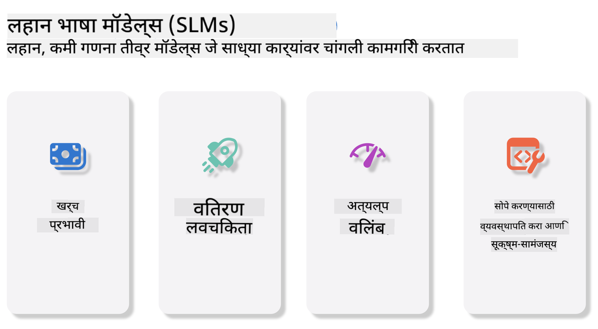
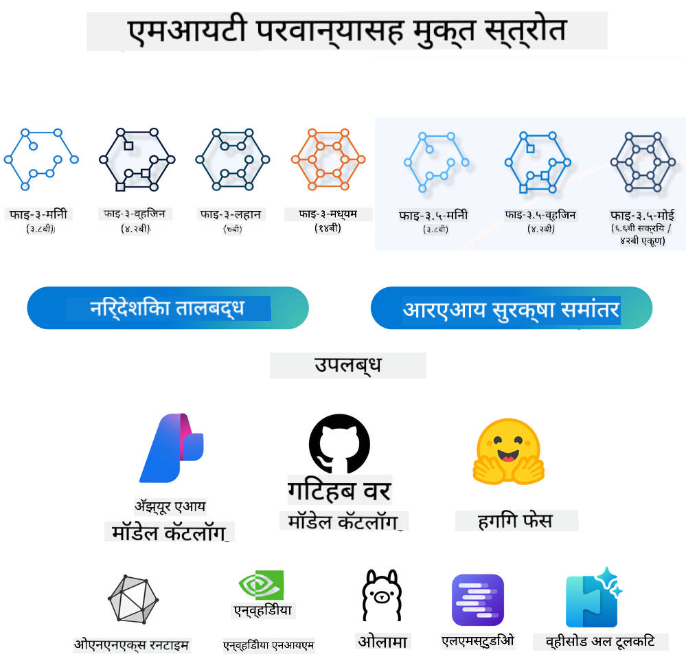
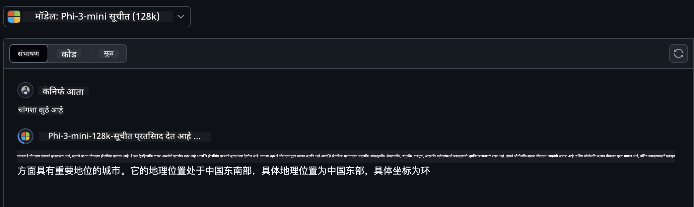
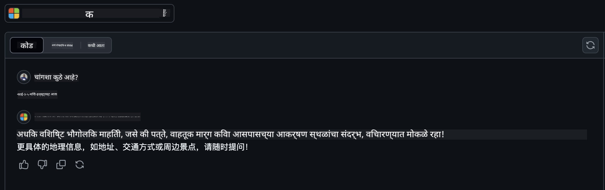

<!--
CO_OP_TRANSLATOR_METADATA:
{
  "original_hash": "124ad36cfe96f74038811b6e2bb93e9d",
  "translation_date": "2025-05-20T09:31:56+00:00",
  "source_file": "19-slm/README.md",
  "language_code": "mr"
}
-->
# जनरेटिव AI साठी छोटे भाषा मॉडेल्सची सुरुवात जनरेटिव AI हे कृत्रिम बुद्धिमत्तेचे एक आकर्षक क्षेत्र आहे जे नवीन सामग्री निर्माण करण्यास सक्षम प्रणाली तयार करण्यावर लक्ष केंद्रित करते. ही सामग्री मजकूर आणि प्रतिमांपासून संगीत आणि संपूर्ण आभासी वातावरणापर्यंत असू शकते. जनरेटिव AI चे सर्वात रोमांचक अनुप्रयोग भाषेच्या मॉडेल्सच्या क्षेत्रात आहेत. ## छोटे भाषा मॉडेल्स काय आहेत? छोटे भाषा मॉडेल (SLM) हे मोठे भाषा मॉडेल (LLM) चे कमी आकाराचे प्रकार दर्शवते, जे LLM च्या अनेक आर्किटेक्चरल तत्त्वे आणि तंत्रज्ञानांचा वापर करतात, तर लक्षणीय कमी गणनात्मक पदचिन्ह दाखवतात. SLM हे भाषा मॉडेल्सचे एक उपसंच आहे जे मानवासारखा मजकूर तयार करण्यासाठी डिझाइन केलेले आहे. त्यांचे मोठे समकक्ष, जसे की GPT-4, यांच्या विपरीत, SLM अधिक कॉम्पॅक्ट आणि कार्यक्षम आहेत, ज्यामुळे ते अनुप्रयोगांसाठी आदर्श बनतात जिथे गणनात्मक संसाधने मर्यादित आहेत. त्यांच्या लहान आकार असूनही, ते अनेक कार्ये करू शकतात. सामान्यतः, SLM हे LLM चे संक्षेपण किंवा आसवन करून तयार केले जातात, ज्याचा उद्देश मूळ मॉडेलच्या कार्यक्षमता आणि भाषिक क्षमता यांचा एक मोठा भाग राखणे आहे. मॉडेल आकारात कमी केल्यामुळे एकूण जटिलता कमी होते, ज्यामुळे SLM मेमरी वापर आणि गणनात्मक आवश्यकतांच्या बाबतीत अधिक कार्यक्षम होते. या ऑप्टिमायझेशन असूनही, SLM अद्याप नैसर्गिक भाषा प्रक्रिया (NLP) कार्यांची विस्तृत श्रेणी करू शकतात: - मजकूर निर्मिती: सुसंगत आणि संदर्भाने संबंधित वाक्ये किंवा परिच्छेद तयार करणे. - मजकूर पूर्णता: दिलेल्या संकेतावर आधारित वाक्ये भाकीत करणे आणि पूर्ण करणे. - भाषांतर: एका भाषेतून दुसऱ्या भाषेत मजकूर रूपांतर करणे. - संक्षेपण: लांब मजकूराचे लहान, अधिक पचवण्यायोग्य सारांशांमध्ये संक्षेप करणे. त्यांच्या मोठ्या समकक्षांच्या तुलनेत कार्यप्रदर्शन किंवा समजण्याच्या खोलीत काही व्यापार-कारभारांसह. ## छोटे भाषा मॉडेल्स कसे कार्य करतात? SLM मोठ्या प्रमाणात मजकूर डेटा वर प्रशिक्षित केले जातात. प्रशिक्षणादरम्यान, ते भाषेच्या नमुने आणि संरचना शिकतात, ज्यामुळे त्यांना व्याकरणाने योग्य आणि संदर्भानुसार योग्य मजकूर तयार करणे शक्य होते. प्रशिक्षण प्रक्रिया यांचा समावेश आहे: - डेटा संकलन: विविध स्रोतांकडून मोठ्या प्रमाणात मजकूर डेटा गोळा करणे. - पूर्वप्रक्रिया: प्रशिक्षणासाठी योग्य बनवण्यासाठी डेटा साफ करणे आणि आयोजित करणे. - प्रशिक्षण: मशीन लर्निंग अल्गोरिदम वापरून मॉडेलला मजकूर समजून घेणे आणि तयार करणे शिकवणे. - सूक्ष्म-समायोजन: विशिष्ट कार्यांवर मॉडेलचे कार्यप्रदर्शन सुधारण्यासाठी समायोजित करणे. SLM च्या विकासाची आवश्यकता वाढत आहे की ज्या मॉडेल्सना संसाधन-आधारित वातावरणात तैनात केले जाऊ शकते, जसे की मोबाइल उपकरणे किंवा एज संगणन प्लॅटफॉर्म, जिथे पूर्ण-स्केल LLM त्यांचे जड संसाधन मागण्या मुळे अव्यवहार्य असू शकतात. कार्यक्षमतेवर लक्ष केंद्रित करून, SLM कार्यप्रदर्शन आणि प्रवेशयोग्यता यांचा संतुलन राखतात, विविध डोमेनमध्ये व्यापक अनुप्रयोग सक्षम करतात.  ## शिकण्याची उद्दिष्टे या धड्यात, आम्ही SLM चे ज्ञान सादर करण्याची आशा करतो आणि Microsoft Phi-3 सह विविध परिस्थितींमध्ये मजकूर सामग्री, दृष्टी आणि MoE शिकण्यासाठी एकत्र करतो. या धड्याच्या शेवटी, आपण खालील प्रश्नांची उत्तरे देऊ शकता: - SLM काय आहे - SLM आणि LLM मधील फरक काय आहे - Microsoft Phi-3/3.5 कुटुंब काय आहे - Microsoft Phi-3/3.5 कुटुंबाची अनुमान कशी करावी तयार? चला सुरू करूया. ## मोठे भाषा मॉडेल्स (LLM) आणि छोटे भाषा मॉडेल्स (SLM) मधील फरक LLM आणि SLM दोन्ही संभाव्य मशीन लर्निंगच्या मूलभूत तत्त्वांवर आधारित आहेत, त्यांच्या आर्किटेक्चरल डिझाइन, प्रशिक्षण पद्धती, डेटा निर्मिती प्रक्रिया, आणि मॉडेल मूल्यांकन तंत्रांमध्ये समान दृष्टिकोन अनुसरण करतात. तथापि, या दोन प्रकारच्या मॉडेल्समध्ये अनेक प्रमुख घटक फरक करतात. ## छोटे भाषा मॉडेल्सचे अनुप्रयोग SLM मध्ये विस्तृत अनुप्रयोग श्रेणी आहे, ज्यामध्ये: - चॅटबॉट्स: ग्राहक समर्थन प्रदान करणे आणि संभाषणात्मक पद्धतीने वापरकर्त्यांसह संवाद साधणे. - सामग्री निर्मिती: लेखकांना कल्पना तयार करण्यात किंवा संपूर्ण लेख तयार करण्यात सहाय्य करणे. - शिक्षण: विद्यार्थ्यांना लेखन असाइनमेंटमध्ये किंवा नवीन भाषा शिकण्यात मदत करणे. - प्रवेशयोग्यता: अपंग व्यक्तींसाठी साधने तयार करणे, जसे की मजकूर-ते-भाषण प्रणाली. **आकार** LLM आणि SLM मधील प्राथमिक फरक मॉडेल्सच्या आकारात आहे. ChatGPT (GPT-4) सारखे LLM अंदाजे 1.76 ट्रिलियन पॅरामीटर्स असू शकतात, तर खुल्या स्रोताचे SLM, जसे की Mistral 7B, लक्षणीय कमी पॅरामीटर्ससह डिझाइन केलेले आहेत - अंदाजे 7 बिलियन. ही विषमता प्रामुख्याने मॉडेल आर्किटेक्चर आणि प्रशिक्षण प्रक्रियेमधील फरकांमुळे आहे. उदाहरणार्थ, ChatGPT एक एन्कोडर-डिकोडर फ्रेमवर्कमध्ये स्वयंचलित यंत्रणा वापरतो, तर Mistral 7B स्लाइडिंग विंडो अटेन्शन वापरतो, जे डिकोडर-केवळ मॉडेलमध्ये अधिक कार्यक्षम प्रशिक्षण सक्षम करते. या आर्किटेक्चरल वैर्यन्सचे मॉडेल्सच्या जटिलता आणि कार्यप्रदर्शनावर गंभीर परिणाम आहेत. **समज** SLM सामान्यतः विशिष्ट डोमेनमध्ये कार्यप्रदर्शनासाठी ऑप्टिमाइझ केले जातात, ज्यामुळे ते अत्यंत विशेषज्ञ बनतात परंतु त्यांच्या क्षमतेत मर्यादित असू शकतात की विविध ज्ञान क्षेत्रांमध्ये व्यापक संदर्भात्मक समज प्रदान करणे. दुसरीकडे, LLM अधिक व्यापक स्तरावर मानवासारखी बुद्धिमत्ता अनुकरण करण्याचा प्रयत्न करतात. मोठ्या, विविध डेटासेटवर प्रशिक्षित, LLM विविध डोमेनमध्ये चांगले कार्य करण्यासाठी डिझाइन केलेले आहेत, अधिक बहुविधता आणि अनुकूलता प्रदान करतात. परिणामी, LLM अधिक विस्तृत डाउनस्ट्रीम कार्यांसाठी अधिक योग्य आहेत, जसे की नैसर्गिक भाषा प्रक्रिया आणि प्रोग्रामिंग. **गणना** LLM चे प्रशिक्षण आणि तैनाती संसाधन-गहन प्रक्रिया आहेत, ज्यासाठी मोठ्या प्रमाणात GPU क्लस्टर्ससह लक्षणीय गणनात्मक पायाभूत सुविधा आवश्यक असतात. उदाहरणार्थ, ChatGPT सारखे मॉडेल स्क्रॅचपासून प्रशिक्षण देण्यासाठी विस्तारित कालावधीसाठी हजारो GPUs आवश्यक असू शकतात. त्याउलट, SLM, त्यांच्या कमी पॅरामीटर्ससह, गणनात्मक संसाधनांच्या बाबतीत अधिक प्रवेशयोग्य आहेत. Mistral 7B सारखे मॉडेल्स स्थानिक मशीनवर प्रशिक्षित आणि चालवले जाऊ शकतात ज्यात मध्यम GPU क्षमता असते, जरी प्रशिक्षण अद्याप अनेक GPUs वर अनेक तास मागणी करते. **पूर्वग्रह** पूर्वग्रह हे LLM मधील ज्ञात समस्या आहे, मुख्यतः प्रशिक्षण डेटाच्या स्वरूपामुळे. हे मॉडेल्स इंटरनेटवरील कच्च्या, खुलेपणाने उपलब्ध डेटावर अवलंबून असतात, जे काही गटांचे प्रतिनिधित्व कमी करू शकते किंवा चुकीचे प्रतिनिधित्व करू शकते, चुकीचे लेबलिंग सादर करू शकते, किंवा बोली, भौगोलिक विविधता, आणि व्याकरण नियमांद्वारे प्रभावित भाषिक पूर्वग्रह प्रतिबिंबित करू शकते. याव्यतिरिक्त, LLM आर्किटेक्चरची जटिलता पूर्वग्रह अनवधानाने वाढवू शकते, जे सावध सूक्ष्म-समायोजनाशिवाय लक्षात येऊ शकत नाही. दुसरीकडे, SLM, अधिक मर्यादित, डोमेन-विशिष्ट डेटासेटवर प्रशिक्षित असताना, अशा पूर्वग्रहांना कमी संवेदनशील असतात, तरी ते त्यांच्यापासून प्रतिकारक्षम नाहीत. **अनुमान** SLM चा कमी आकार त्यांना अनुमान वेगाच्या बाबतीत महत्त्वपूर्ण फायदा प्रदान करतो, ज्यामुळे त्यांना स्थानिक हार्डवेअरवर कार्यक्षमतेने आउटपुट तयार करणे शक्य होते, विस्तृत समांतर प्रक्रिया आवश्यक नसते. त्याउलट, LLM, त्यांच्या आकार आणि जटिलतेमुळे, स्वीकार्य अनुमान वेळा साध्य करण्यासाठी लक्षणीय समांतर गणनात्मक संसाधने आवश्यक असतात. अनेक समवर्ती वापरकर्त्यांची उपस्थिती विशेषत: स्केलवर तैनात केल्यावर LLM च्या प्रतिसाद वेळा अधिक धीमा करते. सारांश, जरी LLM आणि SLM मशीन लर्निंगमध्ये एक मूलभूत आधार सामायिक करतात, ते मॉडेल आकार, संसाधन आवश्यकता, संदर्भात्मक समज, पूर्वग्रहाची संवेदनशीलता, आणि अनुमान वेगाच्या बाबतीत लक्षणीय फरक करतात. हे फरक त्यांच्या संबंधित वापर प्रकरणांसाठी योग्यतेचे प्रतिबिंबित करतात, LLM अधिक बहुविध परंतु संसाधन-गहन असताना, आणि SLM कमी गणनात्मक मागण्या असलेल्या अधिक डोमेन-विशिष्ट कार्यक्षमतेची ऑफर करत आहेत. ***टीप: या अध्यायात, आम्ही Microsoft Phi-3 / 3.5 चा उदाहरण म्हणून वापरून SLM सादर करू.*** ## Phi-3 / Phi-3.5 कुटुंब परिचय Phi-3 / 3.5 कुटुंब मुख्यतः मजकूर, दृष्टि, आणि एजंट (MoE) अनुप्रयोग परिस्थितींवर लक्ष केंद्रित करते: ### Phi-3 / 3.5 निर्देश मुख्यतः मजकूर निर्मिती, चॅट पूर्णता, आणि सामग्री माहिती निष्कर्षण इत्यादीसाठी. **Phi-3-मिनी** 3.8B भाषा मॉडेल Microsoft Azure AI Studio, Hugging Face, आणि Ollama वर उपलब्ध आहे. Phi-3 मॉडेल्स महत्त्वपूर्ण मानकांवर समान आणि मोठ्या आकाराच्या भाषा मॉडेल्सपेक्षा चांगले कार्य करतात (खाली मानक संख्या पहा, उच्च संख्या चांगले आहेत). Phi-3-मिनी त्याच्या आकाराच्या मॉडेल्सपेक्षा चांगले कार्य करते, तर Phi-3-लहान आणि Phi-3-मध्यम मोठ्या मॉडेल्सपेक्षा चांगले कार्य करतात, ज्यामध्ये GPT-3.5 समाविष्ट आहे **Phi-3-लहान आणि मध्यम** फक्त 7B पॅरामीटर्ससह, Phi-3-लहान विविध भाषा, तर्क, कोडिंग, आणि गणित मानकांवर GPT-3.5T पेक्षा चांगले कार्य करते. 14B पॅरामीटर्ससह Phi-3-मध्यम हा ट्रेंड सुरू ठेवतो आणि Gemini 1.0 Pro पेक्षा चांगले कार्य करते. **Phi-3.5-मिनी** आपण ते Phi-3-मिनी चा अपग्रेड म्हणून विचार करू शकतो. पॅरामीटर्स अपरिवर्तित राहून, ते अनेक भाषांना समर्थन करण्याची क्षमता सुधारते (20+ भाषांना समर्थन: अरबी, चीनी, चेक, डॅनिश, डच, इंग्रजी, फिनिश, फ्रेंच, जर्मन, हिब्रू, हंगेरीयन, इटालियन, जपानी, कोरियन, नॉर्वेजियन, पोलिश, पोर्तुगीज, रशियन, स्पॅनिश, स्वीडिश, थाई, तुर्की, युक्रेनियन) आणि दीर्घ संदर्भासाठी मजबूत समर्थन जोडते. 3.8B पॅरामीटर्ससह Phi-3.5-मिनी समान आकाराच्या भाषा मॉडेल्सपेक्षा चांगले कार्य करते आणि त्याच्या आकाराच्या मॉडेल्सच्या तुलनेत आहे. ### Phi-3 / 3.5 दृष्टि आम्ही Phi-3/3.5 च्या निर्देश मॉडेलला Phi च्या समजण्याची क्षमता म्हणून विचार करू शकतो, आणि दृष्टि म्हणजे Phi ला जग समजण्याची क्षमता देणे. **Phi-3-दृष्टि** Phi-3-दृष्टि, फक्त 4.2B पॅरामीटर्ससह, हा ट्रेंड सुरू ठेवतो आणि मोठ्या मॉडेल्सपेक्षा चांगले कार्य करते जसे की Claude-3 Haiku आणि Gemini 1.0 Pro V सामान्य दृश्य तर्क कार्यांवर, OCR, आणि टेबल आणि आकृती समज कार्यांवर. **Phi-3.5-दृष्टि** Phi-3.5-दृष्टि देखील Phi-3-दृष्टि चा अपग्रेड आहे, अनेक प्रतिमांना समर्थन जोडते. आपण ते दृष्टि सुधारणा म्हणून विचार करू शकतो, केवळ चित्रे पाहणे नाही तर व्हिडिओ देखील. Phi-3.5-दृष्टि OCR, टेबल आणि चार्ट समज कार्यांवर मोठ्या मॉडेल्सपेक्षा चांगले कार्य करते जसे की Claude-3.5 Sonnet आणि Gemini 1.5 Flash आणि सामान्य दृश्य ज्ञान तर्क कार्यांवर समान कार्य करते. अनेक फ्रेम इनपुटला समर्थन, म्हणजे अनेक इनपुट प्रतिमांवर तर्क करणे ### Phi-3.5-MoE ***विशेषज्ञांचा मिश्रण (MoE)*** मॉडेल्सला कमी गणनासह पूर्वप्रशिक्षित करण्यास सक्षम करते, म्हणजे आपण घन मॉडेलसारख्या समान गणना बजेटसह मॉडेल किंवा डेटासेट आकार लक्षणीय वाढवू शकता. विशेषतः, MoE मॉडेलने पूर्वप्रशिक्षणादरम्यान घन समकक्षासारखे समान गुणवत्ता जलद प्राप्त करणे आवश्यक आहे. Phi-3.5-MoE 16x3.8B विशेषज्ञ मॉड्यूल्सचा समावेश आहे. Phi-3.5-MoE फक्त 6.6B सक्रिय पॅरामीटर्ससह समान स्तराचे तर्क, भाषा समज, आणि गणित मोठ्या मॉडेल्सप्रमाणे प्राप्त करते आम्ही Phi-3/3.5 कुटुंब मॉडेल विविध परिस्थितींवर आधारित वापरू शकतो. LLM च्या विपरीत, आपण Phi-3/3.5-मिनी किंवा Phi-3/3.5-दृष्टि एज उपकरणांवर तैनात करू शकता. ## Phi-3/3.5 कुटुंब मॉडेल्स कसे वापरावे आम्ही Phi-3/3.5 विविध परिस्थितींमध्ये वापरण्याची आशा करतो. पुढे, आम्ही Phi-3/3.5 विविध परिस्थितींवर आधारित वापरू.  ### अनुमान फरक क्लाउडची API **GitHub मॉडेल्स** GitHub
मॉडेल्स हा सर्वात थेट मार्ग आहे. आपण GitHub मॉडेल्सद्वारे Phi-3/3.5-Instruct मॉडेलला जलद प्रवेश मिळवू शकता. Azure AI Inference SDK / OpenAI SDK सह एकत्रित, आपण Phi-3/3.5-Instruct कॉल पूर्ण करण्यासाठी API ला कोडद्वारे प्रवेश करू शकता. आपण Playground द्वारे विविध प्रभाव देखील चाचणी करू शकता. - डेमो: चीनी परिस्थितींमध्ये Phi-3-mini आणि Phi-3.5-mini च्या प्रभावांची तुलना   **Azure AI Studio** किंवा आपण दृष्टि आणि MoE मॉडेल्स वापरू इच्छित असल्यास, आपण Azure AI Studio वापरून कॉल पूर्ण करू शकता. आपण इच्छुक असल्यास, आपण Azure AI Studio द्वारे Phi-3/3.5 Instruct, Vision, MoE कॉल कसे करायचे हे शिकण्यासाठी Phi-3 Cookbook वाचू शकता [या लिंकवर क्लिक करा](https://github.com/microsoft/Phi-3CookBook/blob/main/md/02.QuickStart/AzureAIStudio_QuickStart.md?WT.mc_id=academic-105485-koreyst) **NVIDIA NIM** Azure आणि GitHub द्वारे प्रदान केलेल्या क्लाउड-आधारित मॉडेल कॅटलॉग सोल्यूशन्स व्यतिरिक्त, आपण [Nivida NIM](https://developer.nvidia.com/nim?WT.mc_id=academic-105485-koreyst) वापरून संबंधित कॉल्स पूर्ण करू शकता. आपण NIVIDA NIM ला भेट देऊन Phi-3/3.5 कुटुंबाच्या API कॉल्स पूर्ण करू शकता. NVIDIA NIM (NVIDIA Inference Microservices) हे एक सेट आहे जे डेवलपर्सना विविध वातावरणांमध्ये, जसे की क्लाउड्स, डेटा सेंटर, आणि वर्कस्टेशन्समध्ये AI मॉडेल्स कार्यक्षमतेने तैनात करण्यास मदत करण्यासाठी डिझाइन केलेले आहे. NVIDIA NIM ची काही मुख्य वैशिष्ट्ये येथे आहेत: - **तैनातीची सुलभता:** NIM एकल कमांडसह AI मॉडेल्सची तैनाती करण्याची परवानगी देते, ज्यामुळे ते विद्यमान कार्यप्रवाहात समाकलित करणे सोपे होते. - **ऑप्टिमाइझ्ड कार्यप्रदर्शन:** हे NVIDIA च्या पूर्व-ऑप्टिमाइझ्ड इन्फरन्स इंजिन्स, जसे की TensorRT आणि TensorRT-LLM, कमी विलंब आणि उच्च थ्रूपुट सुनिश्चित करण्यासाठी वापरते. - **स्केलेबिलिटी:** NIM कुबेरनेट्सवर ऑटोस्केलिंगला समर्थन देते, ज्यामुळे ते विविध कार्यभार प्रभावीपणे हाताळू शकते. - **सुरक्षा आणि नियंत्रण:** संस्थांना त्यांच्या डेटा आणि अनुप्रयोगांवर नियंत्रण ठेवता येते NIM मायक्रोसर्व्हिसेस त्यांच्या स्वतःच्या व्यवस्थापित पायाभूत सुविधांवर स्वयं-होस्ट करून. - **मानक API:** NIM उद्योग-मानक API प्रदान करते, जे चॅटबॉट्स, AI सहाय्यक आणि अधिक सारख्या AI अनुप्रयोग तयार करणे आणि समाकलित करणे सोपे बनवते. NIM हे NVIDIA AI Enterprise चा एक भाग आहे, ज्याचे उद्दिष्ट AI मॉडेल्सचे कार्यान्वयन आणि ऑपरेशनलायझेशन सुलभ करणे आहे, हे सुनिश्चित करून की ते NVIDIA GPUs वर कार्यक्षमतेने चालतात. - डेमो: Nividia NIM वापरून Phi-3.5-Vision-API कॉल करणे [[या लिंकवर क्लिक करा](../../../19-slm/python/Phi-3-Vision-Nividia-NIM.ipynb)] ### स्थानिक वातावरणात Phi-3/3.5 वर अनुमान Phi-3 किंवा GPT-3 सारख्या कोणत्याही भाषा मॉडेलशी संबंधित अनुमान म्हणजे ते प्राप्त करणार्‍या इनपुटवर आधारित प्रतिसाद किंवा अंदाज तयार करण्याची प्रक्रिया आहे. जेव्हा आपण Phi-3 ला एक प्रॉम्प्ट किंवा प्रश्न प्रदान करता, तेव्हा ते त्याच्या प्रशिक्षित न्यूरल नेटवर्कचा वापर करून डेटा मध्ये नमुने आणि संबंधांचे विश्लेषण करून सर्वात संभाव्य आणि संबंधित प्रतिसाद अनुमानित करते. **Hugging Face Transformer** Hugging Face Transformers हे नैसर्गिक भाषा प्रक्रिया (NLP) आणि इतर मशीन लर्निंग कार्यांसाठी डिझाइन केलेले एक शक्तिशाली लायब्ररी आहे. याबद्दल काही प्रमुख मुद्दे येथे आहेत: 1. **पूर्वप्रशिक्षित मॉडेल्स**: हे हजारो पूर्वप्रशिक्षित मॉडेल्स प्रदान करते जे मजकूर वर्गीकरण, नामांकित घटक ओळख, प्रश्नोत्तरे, सारांश, भाषांतर, आणि मजकूर निर्मिती यांसारख्या विविध कार्यांसाठी वापरले जाऊ शकतात. 2. **फ्रेमवर्क इंटरऑपरेबिलिटी**: लायब्ररी अनेक खोल शिकण्याचे फ्रेमवर्क समर्थन करते, ज्यात PyTorch, TensorFlow, आणि JAX समाविष्ट आहेत. हे एका फ्रेमवर्कमध्ये मॉडेल प्रशिक्षण घेण्यास आणि दुसर्‍यामध्ये वापरण्यास परवानगी देते. 3. **मल्टीमॉडल क्षमता**: NLP व्यतिरिक्त, Hugging Face Transformers संगणकीय दृष्टि (उदा., प्रतिमा वर्गीकरण, वस्तू ओळख) आणि ऑडिओ प्रक्रिया (उदा., भाषण ओळख, ऑडिओ वर्गीकरण) मध्ये कार्यांचे समर्थन करते. 4. **वापरण्याची सुलभता**: लायब्ररी API आणि साधने प्रदान करते ज्यामुळे मॉडेल्स सहजपणे डाउनलोड आणि फाइन-ट्यून करता येतात, ज्यामुळे ते नवशिक्या आणि तज्ञांसाठी प्रवेशयोग्य होते. 5. **समुदाय आणि संसाधने**: Hugging Face कडे एक उत्साही समुदाय आणि विस्तृत दस्तऐवजीकरण, ट्युटोरियल्स, आणि मार्गदर्शिका आहेत ज्यामुळे वापरकर्त्यांना प्रारंभ करण्यास आणि लायब्ररीचा अधिकाधिक फायदा घेण्यास मदत होते. [अधिकृत दस्तऐवजीकरण](https://huggingface.co/docs/transformers/index?WT.mc_id=academic-105485-koreyst) किंवा त्यांचा [GitHub रिपॉझिटरी](https://github.com/huggingface/transformers?WT.mc_id=academic-105485-koreyst). हा सर्वात सामान्यत: वापरला जाणारा पद्धत आहे, परंतु त्यासाठी GPU प्रवेग आवश्यक आहे. सर्वात शेवटी, Vision आणि MoE सारख्या दृश्यांना मोठ्या प्रमाणात गणना आवश्यक असते, जी CPU मध्ये खूप मर्यादित असेल जर ती क्वांटाइझ केली गेली नाहीत. - डेमो: Transformer वापरून Phi-3.5-Instuct कॉल करणे [या लिंकवर क्लिक करा](../../../19-slm/python/phi35-instruct-demo.ipynb) - डेमो: Transformer वापरून Phi-3.5-Vision कॉल करणे[या लिंकवर क्लिक करा](../../../19-slm/python/phi35-vision-demo.ipynb) - डेमो: Transformer वापरून Phi-3.5-MoE कॉल करणे[या लिंकवर क्लिक करा](../../../19-slm/python/phi35_moe_demo.ipynb) **Ollama** [Ollama](https://ollama.com/?WT.mc_id=academic-105485-koreyst) हे एक प्लॅटफॉर्म आहे जे मोठ्या भाषा मॉडेल्स (LLMs) आपल्या मशीनवर स्थानिकरित्या चालविणे सोपे बनवते. हे विविध मॉडेल्सला समर्थन देते जसे की Llama 3.1, Phi 3, Mistral, आणि Gemma 2, इतरांसह. प्लॅटफॉर्म मॉडेल वजन, कॉन्फिगरेशन, आणि डेटा एका सिंगल पॅकेजमध्ये बंडल करून प्रक्रिया सुलभ करते, ज्यामुळे वापरकर्त्यांना त्यांच्या स्वतःच्या मॉडेल्सला सानुकूलित आणि तयार करण्यासाठी अधिक प्रवेशयोग्य बनते. Ollama macOS, Linux, आणि Windows साठी उपलब्ध आहे. हे एक उत्तम साधन आहे जर आपण क्लाउड सेवांचा अवलंब न करता LLMs सह प्रयोग करणे किंवा तैनात करणे इच्छित असाल. Ollama हा सर्वात थेट मार्ग आहे, आपल्याला फक्त खालील विधान कार्यान्वित करणे आवश्यक आहे. ```bash

ollama run phi3.5

``` **ONNX Runtime for GenAI** [ONNX Runtime](https://github.com/microsoft/onnxruntime-genai?WT.mc_id=academic-105485-koreyst) हे एक क्रॉस-प्लॅटफॉर्म इन्फरन्स आणि प्रशिक्षण मशीन-लर्निंग प्रवेगक आहे. ONNX Runtime for Generative AI (GENAI) हे एक शक्तिशाली साधन आहे जे आपल्याला विविध प्लॅटफॉर्मवर जनरेटिव AI मॉडेल्स कार्यक्षमतेने चालविण्यास मदत करते. ## ONNX Runtime काय आहे? ONNX Runtime हे एक ओपन-सोर्स प्रकल्प आहे जे मशीन लर्निंग मॉडेल्सच्या उच्च-प्रदर्शन इन्फरन्सला सक्षम करते. हे Open Neural Network Exchange (ONNX) स्वरूपातील मॉडेल्सला समर्थन देते, जे मशीन लर्निंग मॉडेल्सचे प्रतिनिधित्व करण्यासाठी एक मानक आहे.ONNX Runtime इन्फरन्स जलद ग्राहक अनुभव आणि कमी खर्च सक्षम करू शकतो, PyTorch आणि TensorFlow/Keras सारख्या खोल शिकण्याचे फ्रेमवर्क तसेच scikit-learn, LightGBM, XGBoost, इत्यादी क्लासिकल मशीन लर्निंग लायब्ररींमधून मॉडेल्सला समर्थन देतो. ONNX Runtime वेगवेगळ्या हार्डवेअर, ड्रायव्हर्स, आणि ऑपरेटिंग सिस्टिमशी सुसंगत आहे, आणि हार्डवेअर प्रवेगकांचा लाभ घेऊन जिथे लागू असेल तिथे ग्राफ ऑप्टिमायझेशन आणि ट्रान्सफॉर्मसह इष्टतम कार्यप्रदर्शन प्रदान करते ## जनरेटिव AI काय आहे? जनरेटिव AI म्हणजे AI प्रणाली ज्याला नवीन सामग्री, जसे की मजकूर, प्रतिमा, किंवा संगीत, निर्माण करता येते, ज्यावर आधारित डेटा त्यांनी प्रशिक्षण घेतला आहे. उदाहरणांमध्ये GPT-3 सारखे भाषा मॉडेल्स आणि Stable Diffusion सारखे प्रतिमा निर्मिती मॉडेल्स समाविष्ट आहेत. ONNX Runtime for GenAI लायब्ररी ONNX मॉडेल्ससाठी जनरेटिव AI लूप प्रदान करते, ज्यामध्ये ONNX Runtime सह इन्फरन्स, लॉजिट्स प्रक्रिया, शोध आणि नमुना, आणि KV कॅशे व्यवस्थापन समाविष्ट आहे. ## ONNX Runtime for GENAI ONNX Runtime for GENAI ONNX Runtime च्या क्षमतांना जनरेटिव AI मॉडेल्सला समर्थन देण्यासाठी विस्तारित करते. येथे काही मुख्य वैशिष्ट्ये आहेत: - **व्यापक प्लॅटफॉर्म समर्थन:** हे विविध प्लॅटफॉर्मवर कार्य करते, ज्यात Windows, Linux, macOS, Android, आणि iOS समाविष्ट आहेत. - **मॉडेल समर्थन:** हे LLaMA, GPT-Neo, BLOOM, आणि अधिक सारख्या लोकप्रिय जनरेटिव AI मॉडेल्सला समर्थन देते. - **कार्यप्रदर्शन ऑप्टिमायझेशन:** हे NVIDIA GPUs, AMD GPUs, आणि अधिक2 सारख्या वेगवेगळ्या हार्डवेअर प्रवेगकांसाठी ऑप्टिमायझेशन समाविष्ट करते. - **वापरण्याची सुलभता:** हे अनुप्रयोगांमध्ये सुलभ समाकलनासाठी API प्रदान करते, ज्यामुळे आपण कमी कोडसह मजकूर, प्रतिमा, आणि इतर सामग्री निर्माण करू शकता - वापरकर्ते उच्च स्तर generate() पद्धतीला कॉल करू शकतात, किंवा लूपमध्ये मॉडेलच्या प्रत्येक पुनरावृत्तीस चालवू शकतात, एकावेळी एक टोकन निर्माण करून, आणि पर्यायीपणे लूपमध्ये जनरेशन पॅरामीटर्स अद्यतनित करून. - ONNX runtime देखील ग्रीडी/बीम शोध आणि TopP, TopK नमुना समर्थन करते टोकन अनुक्रम निर्माण करण्यासाठी आणि पुनरावृत्ती दंडांसारख्या अंगभूत लॉजिट्स प्रक्रिया. आपण सहजपणे सानुकूल स्कोअरिंग देखील जोडू शकता. ## प्रारंभ करणे ONNX Runtime for GENAI सह प्रारंभ करण्यासाठी, आपण खालील पायऱ्या अनुसरण करू शकता: ### ONNX Runtime स्थापित करा: ```Python
pip install onnxruntime
``` ### जनरेटिव AI विस्तार स्थापित करा: ```Python
pip install onnxruntime-genai
``` ### मॉडेल चालवा: येथे Python मध्ये एक साधा उदाहरण आहे: ```Python
import onnxruntime_genai as og

model = og.Model('path_to_your_model.onnx')

tokenizer = og.Tokenizer(model)

input_text = "Hello, how are you?"

input_tokens = tokenizer.encode(input_text)

output_tokens = model.generate(input_tokens)

output_text = tokenizer.decode(output_tokens)

print(output_text) 
``` ### डेमो: ONNX Runtime GenAI वापरून Phi-3.5-Vision कॉल करणे ```python

import onnxruntime_genai as og

model_path = './Your Phi-3.5-vision-instruct ONNX Path'

img_path = './Your Image Path'

model = og.Model(model_path)

processor = model.create_multimodal_processor()

tokenizer_stream = processor.create_stream()

text = "Your Prompt"

prompt = "<|user|>\n"

prompt += "<|image_1|>\n"

prompt += f"{text}<|end|>\n"

prompt += "<|assistant|>\n"

image = og.Images.open(img_path)

inputs = processor(prompt, images=image)

params = og.GeneratorParams(model)

params.set_inputs(inputs)

params.set_search_options(max_length=3072)

generator = og.Generator(model, params)

while not generator.is_done():

    generator.compute_logits()
    
    generator.generate_next_token()

    new_token = generator.get_next_tokens()[0]
    
    code += tokenizer_stream.decode(new_token)
    
    print(tokenizer_stream.decode(new_token), end='', flush=True)

``` **इतर** ONNX Runtime आणि Ollama संदर्भ पद्धती व्यतिरिक्त, आपण विविध निर्मात्यांनी प्रदान केलेल्या मॉडेल संदर्भ पद्धतींवर आधारित परिमाणात्मक मॉडेल्सच्या संदर्भांना पूर्ण करू शकतो. जसे की Apple MLX फ्रेमवर्क Apple Metal सह, Qualcomm QNN NPU सह, Intel OpenVINO CPU/GPU सह, इत्यादी. आपण [Phi-3 Cookbook](https://github.com/microsoft/phi-3cookbook?WT.mc_id=academic-105485-koreyst) वरून अधिक सामग्री देखील मिळवू शकता ## अधिक आम्ही Phi-3/3.5 कुटुंबाची मूलभूत माहिती शिकली आहे, परंतु SLM बद्दल अधिक जाणून घेण्यासाठी आम्हाला अधिक ज्ञानाची आवश्यकता आहे. Phi-3 Cookbook मध्ये आपण उत्तरे शोधू शकता. अधिक जाणून घेण्यासाठी, कृपया [Phi-3 Cookbook](https://github.com/microsoft/phi-3cookbook?WT.mc_id=academic-105485-koreyst) ला भेट द्या.

**अस्वीकृति**:  
हा दस्तऐवज AI भाषांतर सेवा [Co-op Translator](https://github.com/Azure/co-op-translator) वापरून अनुवादित केला आहे. आम्ही अचूकतेसाठी प्रयत्नशील असलो तरी कृपया लक्षात ठेवा की स्वयंचलित भाषांतरांमध्ये त्रुटी किंवा अपूर्णता असू शकते. मूळ भाषेतील दस्तऐवज हा अधिकृत स्रोत मानला जावा. महत्त्वपूर्ण माहितीच्या बाबतीत व्यावसायिक मानवी भाषांतराची शिफारस केली जाते. या भाषांतराचा वापर करून उद्भवलेल्या कोणत्याही गैरसमज किंवा चुकीच्या अर्थासाठी आम्ही जबाबदार नाही.