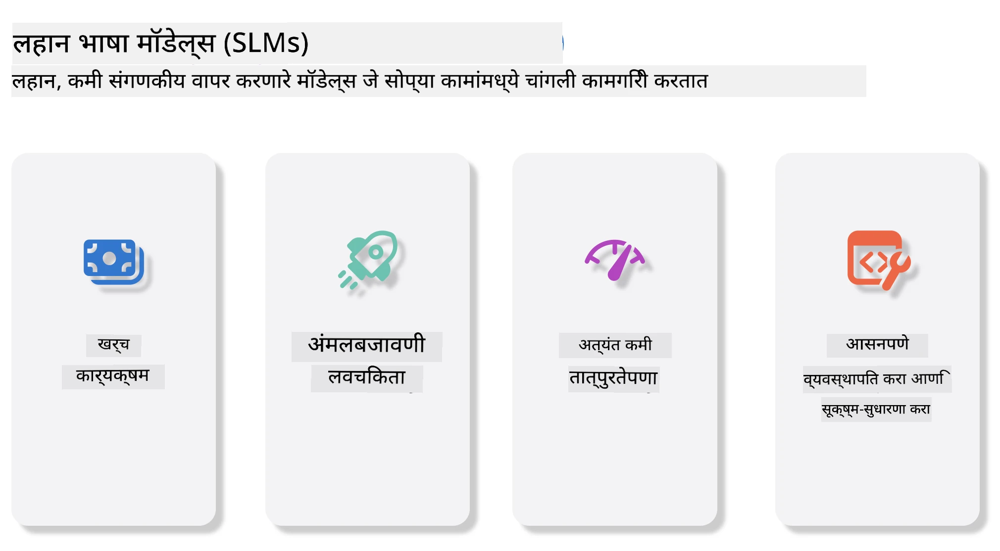
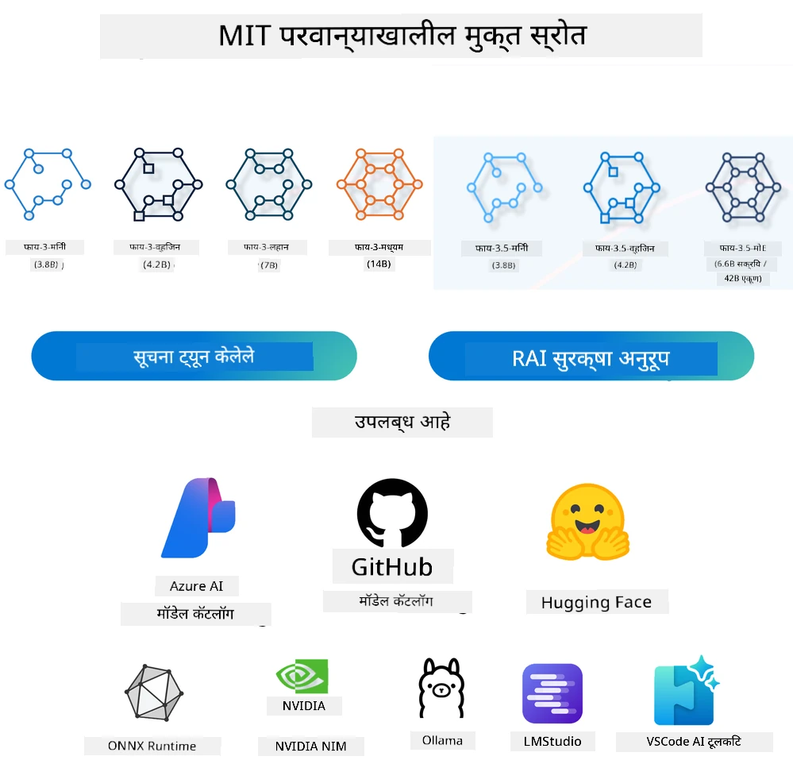
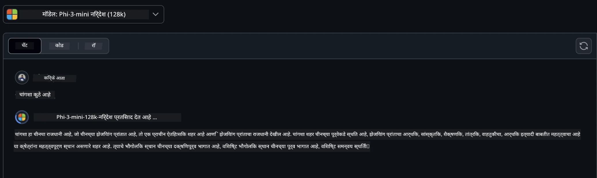
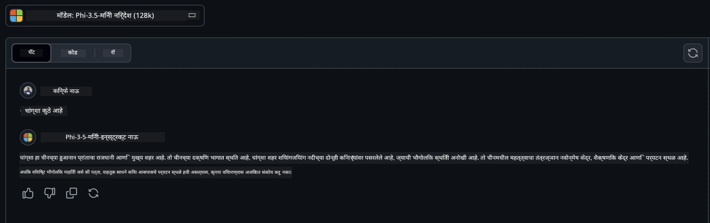

# जनरेटिव AI साठी लहान भाषा मॉडेल्सचे परिचय सुरुवातीसाठी
जनरेटिव AI ही कृत्रिम बुद्धिमत्तेची एक मनोरंजक शाखा आहे जी नवीन सामग्री तयार करण्यास सक्षम प्रणाली निर्माण करण्यावर लक्ष केंद्रित करते. ही सामग्री मजकूर, प्रतिमा, संगीत आणि अगदी संपूर्ण आभासी वातावरणापर्यंत विविध प्रकारची असू शकते. जनरेटिव AI च्या सर्वात रोमांचक अनुप्रयोगांपैकी एक म्हणजे भाषा मॉडेल्सचा क्षेत्र.

## लहान भाषा मॉडेल्स म्हणजे काय?

लहान भाषा मॉडेल (SLM) हा मोठ्या भाषा मॉडेल (LLM) चा एक कमी प्रमाणित प्रकार आहे, जो LLM च्या अनेक आर्किटेक्चरल तत्वे आणि तंत्रज्ञानांचा वापर करतो, परंतु संगणकीय खुणा खूपच कमी प्रमाणात दर्शवितो.

SLMs हे मानवीसारखा मजकूर तयार करण्यासाठी डिझाइन केलेले भाषा मॉडेल्सचा एक उपसमुहोप आहे. GPT-4 सारख्या त्यांच्या मोठ्या समकक्षांपेक्षा वेगळे, SLMs अधिक लहान आणि कार्यक्षम आहेत, ज्यामुळे ते अशा अनुप्रयोगांसाठी आदर्श ठरतात जिथे संगणकीय संसाधने मर्यादित असतात. त्यांच्या लहान आकार असूनही, ते विविध कार्ये पार पाडू शकतात. सामान्यतः, SLMs LLMs ची संपीडन किंवा डिस्टिलेशन करून तयार केले जातात, मुख्य मॉडेलच्या कार्यक्षमता आणि भाषिक क्षमतांचा मोठ्या प्रमाणात जतन करण्याचे उद्दिष्ट ठेवून. या मॉडेल आकारातील कपात संपूर्ण जटिलता कमी करते, ज्यामुळे स्मृती वापर आणि संगणकीय गरजांमध्ये SLMs अधिक कार्यक्षम होतात. या ऑप्टिमायझेशन्स असूनही, SLMs अनेक नैसर्गिक भाषा प्रक्रिया (NLP) कार्ये पुढीलप्रमाणे पार पाडू शकतात:

- मजकूर निर्माण: सुसंगत आणि संदर्भानुसार योग्य वाक्ये किंवा परिच्छेद तयार करणे.
- मजकूर पूर्ण करणे: दिलेल्या प्रॉम्प्टवर आधारित वाक्यांची भविष्यवाणी आणि पूर्णता करणे.
- भाषांतर: एका भाषेतील मजकूर दुसऱ्या भाषेत रूपांतरित करणे.
- सारांश: लांब मजकूराचे संक्षिप्त आणि सुलभ सारांश तयार करणे.

थोडक्यात, त्यांच्या मोठ्या समकक्षांशी तुलना करता कार्यक्षमता किंवा समजण्याच्या खोलीतील काही देयकांसह.

## लहान भाषा मॉडेल्स कसे कार्य करतात?
SLMs खूप मोठ्या प्रमाणात मजकूर डेटावर प्रशिक्षण घेतले जातात. प्रशिक्षणाच्या दरम्यान, ते भाषेची नमुने आणि रचने शिकतात, ज्यामुळे ते व्याकरणिकदृष्ट्या बरोबर आणि संदर्भास अनुरूप मजकूर तयार करू शकतात. प्रशिक्षण प्रक्रियेमध्ये समाविष्ट आहे:

- डेटा संकलन: विविध स्रोतांमधून मोठ्या प्रमाणातील मजकूर डेटासेट गोळा करणे.
- प्रीप्रोसेसिंग: डेटा स्वच्छ करणे आणि प्रशिक्षणासाठी योग्य पद्धतीने आयोजित करणे.
- प्रशिक्षण: मशीन लर्निंग अल्गोरिदमचा वापर करून मॉडेलला मजकूर समजून घेणे आणि तयार करणे शिकवणे.
- फायन-ट्युनिंग: विशिष्ट कार्यांवर मॉडेलचे कार्य सुधारण्यासाठी समायोजन करणे.

SLMs चा विकास अशा परिसंस्थांमध्ये तैनात होणाऱ्या मॉडेल्सची वाढती गरज लक्षात घेऊन केला गेला आहे, जसे की मोबाईल डिव्हाइसेस किंवा एज कॉम्प्युटिंग प्लॅटफॉर्म्स, जिथे पूर्ण-आकाराचे LLM वापरणे त्यांच्या जड संसाधनांच्या मागणीमुळे अशक्य असू शकते. कार्यक्षमता या बाबतीत लक्ष केंद्रित करून, SLMs कार्यक्षमता आणि प्रवेशयोग्यता यांच्यात संतुलन साधतात, ज्यामुळे विविध क्षेत्रांत व्यापक वापर शक्य होतो.



## शिकण्याची उद्दिष्टे

या धड्यात, आम्हाला SLM चे ज्ञान परिचित करून द्यायचे आहे आणि त्यास Microsoft Phi-3 बरोबर एकत्र करून मजकूर सामग्री, दृष्टी आणि MoE मधील वेगवेगळ्या परिस्थिती शिकायच्या आहेत.

या धड्याच्या शेवटी, आपल्याला खालील प्रश्नांची उत्तरे देणे शक्य असावे:

- SLM म्हणजे काय?
- SLM आणि LLM मध्ये काय फरक आहे?
- Microsoft Phi-3/3.5 कुटुंब काय आहे?
- Microsoft Phi-3/3.5 कुटुंबासह कसे इनफरन्स चालवायचे?

तयार आहात? चला सुरुवात करूया.

## मोठ्या भाषा मॉडेल्स (LLMs) आणि लहान भाषा मॉडेल्स (SLMs) मधील फरक

दोन्ही LLMs आणि SLMs प्राबॅबिलिस्टिक मशीन लर्निंगच्या मूलभूत तत्त्वांवर आधारित आहेत, आणि त्यांचा आर्किटेक्चरल डिझाइन, प्रशिक्षण पद्धती, डेटा उत्पत्ती प्रक्रिया आणि मॉडेल मूल्यांकन तंत्रांमध्ये समान दृष्टिकोन पाळतात. तरीही, या दोन प्रकारांमध्ये अनेक महत्त्वाचे फरक आहेत.

## लहान भाषा मॉडेल्सचे अनुप्रयोग

SLMs चे वापर खालीलप्रमाणे विविध क्षेत्रांत आहे:

- चॅटबॉट्स: ग्राहक समर्थन प्रदान करणे आणि वापरकर्त्यांशी संभाषणाद्वारे संवाद साधणे.
- सामग्री निर्मिती: लेखकांना कल्पना तयार करण्यात मदत करणे किंवा अगदी संपूर्ण लेखांचा मसुदा तयार करणे.
- शिक्षण: विद्यार्थ्यांना लेखन कामे किंवा नवीन भाषा शिकण्यात मदत करणे.
- प्रवेशयोग्यता: अपंग व्यक्तींसाठी टूल्स तयार करणे, जसे मजकूर ते आवाज प्रणाली.

**आकार**

LLMs आणि SLMs यातील मुख्य फरक म्हणजे मॉडेलचा आकार. ChatGPT (GPT-4) सारखे LLMs अंदाजे 1.76 ट्रिलियन पॅरामीटर्सचे असू शकतात, तर Mistral 7B सारखे मुक्त स्रोत SLMs सुमारे 7 अब्ज पॅरामीटर्ससह डिझाइन केलेले असतात. हा फरक मुख्यत्वे मॉडेल आर्किटेक्चर आणि प्रशिक्षण प्रक्रियेतल्या भिन्नतेमुळे होतो. उदाहरणार्थ, ChatGPT एक एन्कोडर-डिकोडर फ्रेमवर्कमधील सेल्फ-अटेंशन मेकॅनिझम वापरतो, तर Mistral 7B स्लायडिंग विंडो अटेंशन वापरतो, जे डिकोडर-ओन्ली मॉडेलमध्ये अधिक कार्यक्षम प्रशिक्षण सक्षम करते. या आर्किटेक्चरल फरकामुळे मॉडेलच्या जटिलता आणि कार्यक्षमतेवर खोल परिणाम होतो.

**समज**

SLMs सामान्यतः विशिष्ट क्षेत्रांमध्ये कार्यक्षमतेसाठी ऑप्टिमाइझ केलेले असतात, ज्यामुळे ते अत्यंत तज्ञ असतात पण बहुविध ज्ञान क्षेत्रांमध्ये व्यापक संदर्भात्मक समज प्रदान करण्यात मर्यादित असू शकतात. त्याच्या उलट, LLMs अधिक व्यापक पातळीवर मानवीसारखी बुद्धिमत्ता अनुकरण करण्याचा उद्देश घेतात. विविध विस्तृत डेटासेटवर प्रशिक्षित, LLMs विविध क्षेत्रांमध्ये चांगले प्रदर्शन करण्यासाठी डिझाइन केलेले असतात, ज्यामुळे त्यांची बहुमुखीपणा आणि अनुकूलता वाढते. परिणामी, LLMs नैसर्गिक भाषा प्रक्रिया आणि प्रोग्रामिंग सारख्या वेगवेगळ्या डाउनस्ट्रीम कार्यांसाठी अधिक योग्य आहेत.

**कंप्युटिंग**

LLMs चे प्रशिक्षण आणि तैनाती हे संसाधन-तीव्र प्रक्रिया आहेत, ज्यासाठी मोठ्या प्रमाणात संगणकीय इन्फ्रास्ट्रक्चर आवश्यक असते, जसे की मोठ्या स्केलच्या GPU क्लस्टर्स. उदाहरणार्थ, ChatGPT सारखा मॉडेल शून्यापासून प्रशिक्षित करण्यासाठी हजारो GPUs लांब काळासाठी लागतात. त्याच्या उलट, SLMs त्यांच्या कमी पॅरामीटर मोजणीमुळे संगणकीय संसाधनांच्या बाबतीत अधिक प्रवेशयोग्य असतात. Mistral 7B सारखे मॉडेल स्थानिक मशीनवर मध्यम क्षमतांच्या GPU सह प्रशिक्षण व रन करता येतात, जरी प्रशिक्षण काही तासात अनेक GPUs वर चालावे लागते.

**सपेख**

सपेख हे LLMs मध्ये ज्ञात समस्या आहे, मुख्यत्वे प्रशिक्षण डेटाच्या स्वरूपामुळे. हे मॉडेल्स इंटरनेटवरील खुल्या डेटावर अवलंबून असतात, जे काही गटांचे अंडररिप्रेझेंटेशन अथवा चुकीचे प्रतिनिधित्व करू शकते, चुकीच्या लेबलिंगचे कारण बनू शकते, किंवा बोलीभाषा, भौगोलिक भेद आणि व्याकरण नियमांनी प्रभावित भाषिक सपेख प्रतिबिंबित करू शकते. शिवाय, LLM आर्किटेक्चरल कॉम्प्लेक्सिटी सपेख वाढवू शकते, जी काळजीपूर्वक फायन-ट्युनिंगशिवाय लक्षात येत नाही. दुसरीकडे, अधिक नियंत्रित, विशेष क्षेत्र-विशिष्ट डेटासेटवर प्रशिक्षित SLMs सपेखसाठी कमी संवेदनशील असतात, तरी ते पूर्णपणे मुक्त नाहीत.

**इनफरन्स**

SLMs चा आकार कमी असल्यामुळे त्यांना इनफरन्स गतीच्या बाबतीत मोठे फायदे मिळतात, ज्यामुळे ते स्थानिक हार्डवेअरवर परिणामकारकपणे आउटपुट तयार करू शकतात, विस्तृत समांतर प्रक्रिया न करता. त्याच्या उलट, LLMs, त्यांच्या आकार आणि जटिलतेमुळे, स्वीकारार्ह इनफरन्स वेळेसाठी महत्त्वाचे समांतर संगणकीय संसाधन आवश्यक असते. एकाच वेळी अनेक वापरकर्त्यांचे अस्तित्व LLMs ची प्रतिसाद वेळ आणखी मंद करते, विशेषतः मोठ्या प्रमाणावर लागू केल्यावर.

सारांशतः, जरी LLMs आणि SLMs या दोन्ही मशीन लर्निंगच्या मूलभूत आधारावर आधारित असले तरी, त्यांचा मॉडेलचा आकार, संसाधन गरजा, संदर्भ समज, सपेख संवेदनशीलता आणि इनफरन्स गती यामध्ये लक्षणीय फरक आहे. हे फरक त्यांच्या विविध वापर प्रकरणांसाठी योग्यतेचा परावर्तक आहेत, ज्यात LLMs अधिक बहुमुखी पण संसाधन-भारी आहेत आणि SLMs कमी संगणकीय मागण्या असलेल्या विशिष्ट क्षेत्रासाठी अधिक कार्यक्षम आहेत.

***टीप: या धड्यात, आम्ही Microsoft Phi-3 / 3.5 चा उपयोग करून SLM परिचय करून देणार आहोत.***

## Phi-3 / Phi-3.5 कुटुंबाची ओळख

Phi-3 / 3.5 कुटुंब मुख्यत्वे मजकूर, दृष्टी आणि एजंट (MoE) अनुप्रयोग परिस्थितींवर लक्ष केंद्रित करते:

### Phi-3 / 3.5 Instruct

मुख्यतः मजकूर निर्मिती, चॅट पूर्णता, आणि सामग्री माहिती काढणे इत्यादीसाठी.

**Phi-3-mini**

3.8B भाषा मॉडेल Microsoft Azure AI Studio, Hugging Face, आणि Ollama वर उपलब्ध आहे. Phi-3 मॉडेल्स समान आणि मोठ्या आकाराच्या भाषा मॉडेल्सच्या महत्त्वाच्या बेंचमार्कवर (खाली बेंचमार्क आणखी वाचा, जास्त आकडे चांगले) स्पष्ट आघाडी घेतात. Phi-3-mini आकाराने दुप्पट असलेल्या मॉडेल्सपेक्षा उत्तम आहे, तर Phi-3-small आणि Phi-3-medium मोठ्या मॉडेल्स, त्यात GPT-3.5 यांचा समावेश आहे त्यापेक्षा श्रेष्ठ आहेत.

**Phi-3-small & medium**

फक्त 7B पॅरामीटर्ससह, Phi-3-small GPT-3.5T यावर विविध भाषा, विचारशक्ती, कोडिंग, आणि गणित बेंचमार्कवर आघाडी घेते.

14B पॅरामीटर्स असलेले Phi-3-medium ही सुरुवात सतत पुढे नेते आणि Gemini 1.0 Pro पेक्षा अधिक चांगले आहे.

**Phi-3.5-mini**

हे Phi-3-mini चे अपग्रेड समजले जाऊ शकते. जबकि पॅरामीटर अचल आहेत, ते अनेक भाषा समर्थन क्षमता सुधारते (20+ भाषा: अरेबिक, चिनी, चेक, डेनीश, डच, इंग्रजी, फिनिश, फ्रेंच, जर्मन, हिब्रू, हंगेरी, इटालियन, जपानी, कोरियन, नॉर्वेजियन, पोलिश, पोर्तुगीज, रशियन, स्पॅनिश, स्वीडिश, थाई, टर्किश, युक्रेनियन) आणि दीर्घ संदर्भासाठी अधिक मजबूत समर्थन जोडते.

3.8B पॅरामीटर्ससह Phi-3.5-mini समान आकाराच्या भाषा मॉडेल्सपेक्षा उत्तम आहे आणि दुप्पट आकाराच्या मॉडेल्सच्या समकक्ष आहे.

### Phi-3 / 3.5 Vision

Phi-3/3.5 चा Instruct मॉडेल म्हणजे Phi ची समजण्याची क्षमता, आणि Vision हे Phi ला जग समजण्यासाठी डोळे देतो.

**Phi-3-Vision**

फक्त 4.2B पॅरामीटर्ससह Phi-3-vision या प्रवाहाला चालना देते आणि Claude-3 Haiku आणि Gemini 1.0 Pro V सारख्या मोठ्या मॉडेल्सवर सामान्य दृश्य तर्क, OCR, टेबल आणि आकृती समजण्याच्या कार्यांवर आघाडी घेते.

**Phi-3.5-Vision**

Phi-3.5-Vision हा देखील Phi-3-Vision चा अपग्रेड आहे, जे अनेक चित्रांकरिता समर्थन जोडते. तुम्ही ते दृष्टीतील सुधारणा म्हणून पाहू शकता, केवळ चित्र पाहू शकत नाही तर व्हिडिओ देखील.

Phi-3.5-vision मोठ्या मॉडेल्स, जसे Claude-3.5 Sonnet आणि Gemini 1.5 Flash ओवर OCR, टेबल आणि चार्ट समजण्याच्या कार्यांवर आघाडी घेते आणि सामान्य दृश्य ज्ञान तर्क कार्यांवर तितकाच आहे. बहुनिहाय फ्रेम इनपुटला समर्थन देते, म्हणजे एकापेक्षा जास्त इनपुट चित्रांवर तर्क करणे शक्य.

### Phi-3.5-MoE

***Mixture of Experts (MoE)*** मॉडेल्सना खूप कमी संगणकीय संसाधनांसह प्रीट्रेन करण्यास सक्षम करते, ज्याचा अर्थ समान संगणकीय बजेटसह तुम्ही मॉडेल किंवा डेटासेटचा आकार मोठ्या प्रमाणावर वाढवू शकता. विशेषतः, MoE मॉडेल त्यांच्या घन counterparts पेक्षा प्रीट्रेनिंग दरम्यान समान गुणवत्तेपर्यंत अधिक जलद पोहोचते.

Phi-3.5-MoE मध्ये 16x3.8B तज्ञ मॉड्यूल्स असतात. फक्त 6.6B सक्रिय पॅरामीटर्ससह Phi-3.5-MoE मोठ्या मॉडेल्ससारखेच तर्क, भाषा समज आणि गणित कार्यक्षमतेसाठी सक्षम आहे.

आम्ही वेगवेगळ्या परिस्थितींमध्ये Phi-3/3.5 कुटुंबाचा वापर करू शकतो. LLM पेक्षा वेगळे, तुम्ही Phi-3/3.5-mini किंवा Phi-3/3.5-Vision एज डिव्हाइसेसवर तैनात करू शकता.

## Phi-3/3.5 कुटुंब मॉडेल्सचा कसा वापर करावा

आम्हाला Phi-3/3.5 वेगवेगळ्या परिस्थितींमध्ये वापरायचे आहे. पुढे, आम्ही वेगवेगळ्या परिस्थितींवर आधारित Phi-3/3.5 वापरणार आहोत.



### क्लाउड API द्वारे इनफरन्स

**GitHub मॉडेल्स**

GitHub मॉडेल्स हे सर्वात थेट मार्ग आहे. तुम्ही Phi-3/3.5-Instruct मॉडेलवर जलद प्रवेश करू शकता. Azure AI Inference SDK / OpenAI SDK सह एकत्रितपणे, तुम्ही कोडद्वारे API कॉल पूर्ण करू शकता. तुम्ही Playground द्वारे विविध प्रभावही तपासू शकता.

- डेमो: चायनीज परिस्थितींमध्ये Phi-3-mini आणि Phi-3.5-mini चे प्रभावांची तुलना





**Azure AI Studio**

किंवा जर तुम्हाला दृष्टी आणि MoE मॉडेल्स वापरायचे असतील, तर Azure AI Studio वापरून कॉल पूर्ण करू शकता. रस असल्यास, Phi-3 कुकबुक वाचा ज्यात Azure AI Studio द्वारे Phi-3/3.5 Instruct, Vision, MoE कसे कॉल करायचे ते आहे [या दुव्यावर क्लिक करा](https://github.com/microsoft/Phi-3CookBook/blob/main/md/02.QuickStart/AzureAIStudio_QuickStart.md?WT.mc_id=academic-105485-koreyst)

**NVIDIA NIM**

Azure आणि GitHub द्वारे दिलेल्या क्लाउड-आधारित मॉडेल कॅटलॉग उपायांशिवाय, तुम्ही [NVIDIA NIM](https://developer.nvidia.com/nim?WT.mc_id=academic-105485-koreyst) वापरून संबंधित कॉल पूर्ण करू शकता. तुम्ही NVIDIA NIM मध्ये जाऊन Phi-3/3.5 कुटुंबाच्या API कॉल पूर्ण करू शकता. NVIDIA NIM (NVIDIA Inference Microservices) ही जलदगतीने कार्यान्वित होणारी मायक्रोसेवा संच आहे जे विकासकांना विविध वातावरणांमध्ये, जसे की क्लाउड, डेटा सेंटर आणि वर्कस्टेशन्समध्ये AI मॉडेल्स कार्यक्षमतेने तैनात करण्यात मदत करते.

NVIDIA NIM चे काही मुख्य वैशिष्ट्ये:
- **तैनातीची सुलभता:** NIM एआय मॉडेल्स एका कमांडने तैनात करण्यास परवानगी देतो, ज्यामुळे विद्यमान कार्यप्रवाहांमध्ये समाकलित करणे सोपे होते.
- **संकुलित कार्यक्षमता:** हे NVIDIA च्या पूर्वसंकुलित इन्फरन्स इंजिन्सचा वापर करते, जसे TensorRT आणि TensorRT-LLM, कमी विलंब आणि उच्च थ्रूपुट सुनिश्चित करण्यासाठी.
- **स्केलेबिलिटी:** NIM Kubernetes वरील ऑटोसकेलिंगस समर्थन देते, ज्यामुळे वेगवेगळ्या कार्यभारावर प्रभावी व्यवस्थापन शक्य होते.
- **सुरक्षा आणि नियंत्रण:** संस्थांना त्यांच्या स्वतःच्या व्यवस्थापित इन्फ्रास्ट्रक्चरवर स्व-होस्ट केलेल्या NIM मायक्रोसर्व्हिसेसद्वारे त्यांच्या डेटा आणि अनुप्रयोगांवर नियंत्रण ठेवता येते.
- **मानक API:** NIM उद्योगमानक API प्रदान करतो, ज्यामुळे चॅटबॉट्स, एआय सहाय्यक आणि अधिक अशा एआय अनुप्रयोगांची निर्मिती आणि समाकलन सोपे होते.

NIM हे NVIDIA AI Enterprise चा एक भाग आहे, जे एआय मॉडेल्सची तैनाती आणि ऑपरेशनलाइझेशन सुलभ करण्यासाठी आहे, ज्यामुळे ते NVIDIA GPU वर कार्यक्षमतेने चालतात.

- डेमो: NVIDIA NIM वापरून Phi-3.5-Vision-API कॉल करणे [[Click this link](./python/Phi-3-Vision-Nividia-NIM.ipynb?WT.mc_id=academic-105485-koreyst)]


### Phi-3/3.5 स्थानिकरित्या चालवणे
Phi-3 किंवा GPT-3 सारख्या कोणत्याही भाषा मॉडेलनुसार, इनफरन्स म्हणजे दिलेल्या इनपुट नुसार प्रतिसाद किंवा भाकित तयार करण्याची प्रक्रिया आहे. जेव्हा आपण Phi-3 ला प्रॉम्प्ट किंवा प्रश्न देतो, तेव्हा ते त्याच्या प्रशिक्षित न्यूरल नेटवर्कचा वापर करून सर्वात शक्य तितका आणि संबंधित प्रतिसाद तयार करण्यासाठी तिथल्या डेटामधील नमुने आणि संबंधांचे विश्लेषण करते.

**Hugging Face Transformer**
Hugging Face Transformers ही नैसर्गिक भाषा प्रक्रिया (NLP) आणि इतर मशीन लर्निंग कार्यांसाठी डिझाइन केलेली एक शक्तिशाली लायब्ररी आहे. इथं काही मुख्य मुद्दे आहेत:

1. **प्रशिक्षित मॉडेल्स:** ही हजारो प्रशिक्षित मॉडेल्स प्रदान करते, जे मजकूर वर्गीकरण, नामांकित घटक ओळख, प्रश्नोत्तर, सारांश, भाषांतर, आणि मजकूर निर्मितीसाठी वापरता येतात.

2. **फ्रेमवर्क इंटरऑपरेबिलिटी:** लायब्ररी PyTorch, TensorFlow, आणि JAX सारख्या अनेक डीप लर्निंग फ्रेमवर्क्सना समर्थन देते. त्यामुळे आपण एक फ्रेमवर्कमध्ये मॉडेल प्रशिक्षित करून दुसऱ्या फ्रेमवर्कमध्ये वापरू शकता.

3. **मल्टिमोडल क्षमता:** NLP व्यतिरिक्त, Hugging Face Transformers संगणकीय दृष्टी (उदा. प्रतिमा वर्गीकरण, ऑब्जेक्ट डिटेक्शन) आणि ऑडिओ प्रक्रिया (उदा. भाषण ओळख, ऑडिओ वर्गीकरण) कार्यांसाठी देखील समर्थन देते.

4. **वापरण्याची सुलभता:** लायब्ररी APIs आणि उपकरणं प्रदान करते ज्यामुळे मॉडेल्स सहज डाउनलोड आणि फाइन-ट्यून करता येतात, ज्यामुळे नवशिक्या आणि तज्ञ दोघांसाठी सुलभ आहे.

5. **समुदाय आणि संसाधने:** Hugging Face चा एक सक्रिय समुदाय आणि व्यापक दस्तऐवजीकरण, ट्युटोरियल्स, आणि मार्गदर्शिका आहेत, ज्यामुळे वापरकर्त्यांना लायब्ररीचा सर्वोत्तम उपयोग करता येतो.
[अधिकृत दस्तऐवज](https://huggingface.co/docs/transformers/index?WT.mc_id=academic-105485-koreyst) किंवा त्यांच्या [GitHub रेपॉजिटरी](https://github.com/huggingface/transformers?WT.mc_id=academic-105485-koreyst).

हा सर्वसामान्यपणे वापरला जाणारा मार्ग आहे, पण त्याला GPU त्वरण देखील आवश्यक आहे. शेवटी, Vision आणि MoE सारख्या परिस्थितींमध्ये बरेच गणना करावी लागते, आणि जर ते क्वांटाइज्ड न केले तर CPU वर ते खूप धीमे होतील.


- डेमो: Transformer वापरून Phi-3.5-Instruct कॉल करणे [Click this link](./python/phi35-instruct-demo.ipynb?WT.mc_id=academic-105485-koreyst)

- डेमो: Transformer वापरून Phi-3.5-Vision कॉल करणे [Click this link](./python/phi35-vision-demo.ipynb?WT.mc_id=academic-105485-koreyst)

- डेमो: Transformer वापरून Phi-3.5-MoE कॉल करणे [Click this link](./python/phi35_moe_demo.ipynb?WT.mc_id=academic-105485-koreyst)

**Ollama**
[Ollama](https://ollama.com/?WT.mc_id=academic-105485-koreyst) हा एक प्लॅटफॉर्म आहे जो मोठ्या भाषा मॉडेल्स (LLMs) स्थानिक मशीनवर चालवणे सुलभ करतो. हा Llama 3.1, Phi 3, Mistral, आणि Gemma 2 सारख्या अनेक मॉडेल्सना समर्थन करतो. हा प्लॅटफॉर्म मॉडेल वजन, कॉन्फिगरेशन आणि डेटा एकत्र करून वापरकर्त्यांसाठी त्यांच्या स्वतःचे मॉडेल्स सानुकूल आणि तयार करणे अधिक सुलभ करतो. Ollama macOS, Linux, आणि Windows साठी उपलब्ध आहे. हा क्लाउड सेवा शिवाय LLMs वापरून पाहण्याचा किंवा तैनात करण्याचा चांगला पर्याय आहे. Ollama हा सर्वात थेट मार्ग आहे, तुम्हाला फक्त खालील कमांड चालवायची आहे.


```bash

ollama run phi3.5

```


**GenAI साठी ONNX Runtime**

[ONNX Runtime](https://github.com/microsoft/onnxruntime-genai?WT.mc_id=academic-105485-koreyst) हा एक क्रॉस-प्लॅटफॉर्म इन्फरन्स आणि ट्रेनिंग मशीन लर्निंग अॅक्सेलेरेटर आहे. Generative AI (GENAI) साठी ONNX Runtime एक शक्तिशाली साधन आहे जे तुम्हाला विविध प्लॅटफॉर्मवर जनरेटिव्ह एआय मॉडेल्स कार्यक्षमतेने चालवण्यास मदत करते.

## ONNX Runtime म्हणजे काय?
ONNX Runtime हा एक ओपन-सोर्स प्रकल्प आहे जो मशीन लर्निंग मॉडेल्ससाठी उच्च कार्यक्षमतेची इन्फरन्स सक्षम करतो. तो Open Neural Network Exchange (ONNX) फॉरमॅटमधील मॉडेल्सना समर्थन करतो, जो मशीन लर्निंग मॉडेल्ससाठी एक मानक आहे. ONNX Runtime इन्फरन्स जलद ग्राहक अनुभवांसाठी आणि कमी खर्चासाठी सक्षम आहे, PyTorch आणि TensorFlow/Keras सारख्या डीप लर्निंग फ्रेमवर्क्स तसेच scikit-learn, LightGBM, XGBoost यांसारख्या पारंपरिक मशीन लर्निंग लायब्ररींसाठी मॉडेल्सना समर्थन करते. ONNX Runtime वेगवेगळ्या हार्डवेअर, ड्रायव्हर्स, आणि ऑपरेटिंग सिस्टिम्सशी सुसंगत आहे, आणि हार्डवेअर अ‍ॅक्सेलेरेटरचा फायदा घेऊन तसेच ग्राफ ऑप्टिमायझेशन्स आणि ट्रान्सफॉर्म्स वापरून उत्कृष्ट कार्यक्षमता प्रदान करतो.

## जनरेटिव्ह एआय म्हणजे काय?
जनरेटिव्ह एआय त्यांना प्रशिक्षण देण्यात आलेल्या डेटावर आधारित नवीन सामग्री जसे की मजकूर, प्रतिमा, किंवा संगीत तयार करू शकणाऱ्या एआय सिस्टिम्सना म्हणतात. उदाहरणार्थ, GPT-3 सारखी भाषा मॉडेल्स आणि Stable Diffusion सारखी प्रतिमा निर्मिती मॉडेल्स. ONNX Runtime GENAI लायब्ररी ONNX मॉडेल्ससाठी जनरेटिव्ह एआय लूप प्रदान करते, ज्यामध्ये ONNX Runtime सह इन्फरन्स, लॉजिट्स प्रक्रिया, शोध आणि नमुना घेणे, आणि KV कॅश व्यवस्थापन यांचा समावेश आहे.

## ONNX Runtime GENAI
ONNX Runtime GENAI ONNX Runtime ची क्षमता वाढवते ज्यामुळे ती जनरेटिव्ह एआय मॉडेल्सना समर्थन देते. काही मुख्य वैशिष्ट्ये:

- **व्यापक प्लॅटफॉर्म समर्थन:** Windows, Linux, macOS, Android, आणि iOS यांसहित विविध प्लॅटफॉर्मवर काम करते.
- **मॉडेल समर्थन:** LLaMA, GPT-Neo, BLOOM आणि अधिक लोकप्रिय जनरेटिव्ह एआय मॉडेल्सना समर्थन देते.
- **कार्यक्षमता ऑप्टिमायझेशन:** NVIDIA GPU, AMD GPU आणि इतर हार्डवेअर अ‍ॅक्सेलेरेटरसाठी ऑप्टिमायझेशन्सचा समावेश करतो.
- **सुलभ वापर:** अनुप्रयोगांमध्ये सहज समाकलनासाठी API प्रदान करते, ज्यामुळे तुम्ही किमान कोडने मजकूर, प्रतिमा आणि इतर सामग्री निर्माण करू शकता.
- वापरकर्ते generate() हाय-लेव्हल पद्धत कॉल करू शकतात, किंवा मॉडेलचा प्रत्येक पुनरावृत्ती लूपमध्ये चालवू शकतात, प्रत्येकी एक टोकन तयार करत आणि आवश्यकतेनुसार लूपमध्ये जनरेशन पॅरामीटर्स अपडेट करू शकतात.
- ONNX Runtime मध्ये लालसा/बीम शोध आणि TopP, TopK सॅम्पलिंगचा देखील समावेश आहे ज्यामुळे टोकन साखळ्या तयार होतात आणि पुनरावृत्ती प्रतिबंधांसारखी अंतर्निर्मित लॉजिट्स प्रक्रिया दिली जाते. तुम्ही सोप्या पद्धतीने कस्टम स्कोरिंग पण जोडू शकता.

## सुरुवात कशी करावी
ONNX Runtime GENAI वापरायला सुरू करण्यासाठी पुढील पावले अनुसरा:

### ONNX Runtime इन्स्टॉल करा:
```Python
pip install onnxruntime
```
### जनरेटिव्ह AI एक्सटेंशन्स इन्स्टॉल करा:
```Python
pip install onnxruntime-genai
```

### मॉडेल चालवा: Python मधील एक सोपा उदाहरण खाली दिलेला आहे:
```Python
import onnxruntime_genai as og

model = og.Model('path_to_your_model.onnx')

tokenizer = og.Tokenizer(model)

input_text = "Hello, how are you?"

input_tokens = tokenizer.encode(input_text)

output_tokens = model.generate(input_tokens)

output_text = tokenizer.decode(output_tokens)

print(output_text) 
```
### डेमो: ONNX Runtime GenAI वापरून Phi-3.5-Vision कॉल करणे


```python

import onnxruntime_genai as og

model_path = './Your Phi-3.5-vision-instruct ONNX Path'

img_path = './Your Image Path'

model = og.Model(model_path)

processor = model.create_multimodal_processor()

tokenizer_stream = processor.create_stream()

text = "Your Prompt"

prompt = "<|user|>\n"

prompt += "<|image_1|>\n"

prompt += f"{text}<|end|>\n"

prompt += "<|assistant|>\n"

image = og.Images.open(img_path)

inputs = processor(prompt, images=image)

params = og.GeneratorParams(model)

params.set_inputs(inputs)

params.set_search_options(max_length=3072)

generator = og.Generator(model, params)

while not generator.is_done():

    generator.compute_logits()
    
    generator.generate_next_token()

    new_token = generator.get_next_tokens()[0]
    
    output = tokenizer_stream.decode(new_token)
    
    print(tokenizer_stream.decode(new_token), end='', flush=True)

```


**इतर**

ONNX Runtime आणि Ollama संदर्भ पद्धतींशिवाय, आपण विविध उत्पादकांकडून दिलेल्या मॉडेल संदर्भ पद्धतींसह प्रमाणात्मक मॉडेल्सचा संदर्भही पूर्ण करू शकतो. जसे Apple Metal सह Apple MLX फ्रेमवर्क, Qualcomm QNN सह NPU, Intel OpenVINO सह CPU/GPU, इत्यादी. तुम्ही अधिक सामग्री [Phi-3 Cookbook](https://github.com/microsoft/phi-3cookbook?WT.mc_id=academic-105485-koreyst) येथून देखील मिळवू शकता.


## अधिक

आम्ही Phi-3/3.5 कुटुंबाच्या मूलभूत गोष्टी शिकल्या आहेत, पण SLM बद्दल अधिक जाणून घेण्यासाठी अधिक ज्ञान आवश्यक आहे. तुम्हाला उत्तरे Phi-3 Cookbook मध्ये मिळतील. जर तुम्हाला अधिक शिकायचे असेल तर कृपया [Phi-3 Cookbook](https://github.com/microsoft/phi-3cookbook?WT.mc_id=academic-105485-koreyst) येथे भेट द्या.

---

<!-- CO-OP TRANSLATOR DISCLAIMER START -->
**अस्वीकरण**:  
हा दस्तऐवज AI भाषांतर सेवा [Co-op Translator](https://github.com/Azure/co-op-translator) वापरून भाषांतरित केला आहे. आम्ही अचूकतेसाठी प्रयत्न करतो, परंतु कृपया लक्षात ठेवा की स्वयंचलित भाषांतरात चुका किंवा अचूकतेची कमतरता असू शकते. मूळ दस्तऐवज त्याच्या स्थानिक भाषेत अधिकृत स्रोत मानला जावा. महत्त्वाच्या माहितीसाठी व्यावसायिक मानवी भाषांतराची शिफारस केली जाते. या भाषांतराच्या वापरामुळे उद्भवणाऱ्या कोणत्याही गैरसमजुती किंवा चुका याबद्दल आम्ही जबाबदार नाही.
<!-- CO-OP TRANSLATOR DISCLAIMER END -->