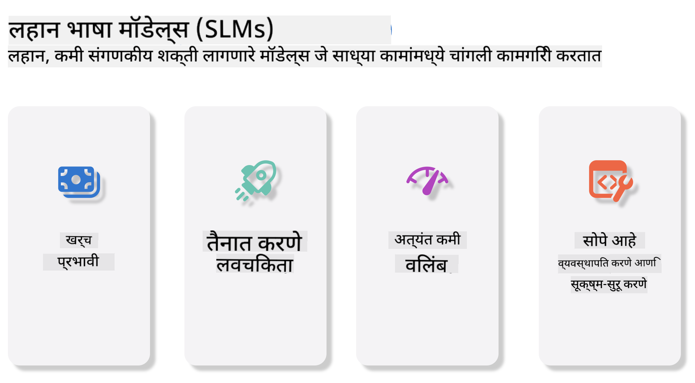
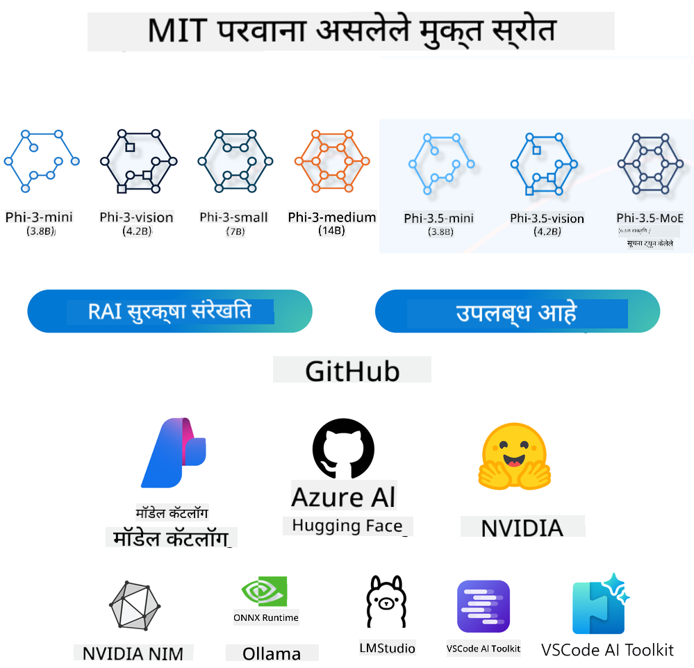
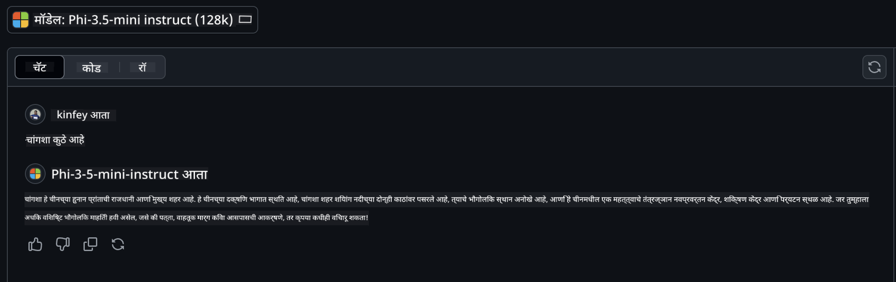

<!--
CO_OP_TRANSLATOR_METADATA:
{
  "original_hash": "124ad36cfe96f74038811b6e2bb93e9d",
  "translation_date": "2025-07-09T18:26:14+00:00",
  "source_file": "19-slm/README.md",
  "language_code": "mr"
}
-->
# जनरेटिव AI साठी लहान भाषा मॉडेल्सची ओळख नवशिक्यांसाठी  
जनरेटिव AI ही कृत्रिम बुद्धिमत्तेची एक आकर्षक शाखा आहे जी नवीन सामग्री तयार करण्यास सक्षम प्रणाली तयार करण्यावर लक्ष केंद्रित करते. ही सामग्री मजकूर, प्रतिमा, संगीत किंवा संपूर्ण आभासी वातावरणांपर्यंत असू शकते. जनरेटिव AI चा एक अत्यंत रोमांचक उपयोग म्हणजे भाषा मॉडेल्सच्या क्षेत्रात आहे.

## लहान भाषा मॉडेल्स म्हणजे काय?  

लहान भाषा मॉडेल (SLM) हा मोठ्या भाषा मॉडेल (LLM) चा एक कमी प्रमाणात असलेला प्रकार आहे, जो LLM च्या अनेक आर्किटेक्चरल तत्त्वे आणि तंत्रांचा वापर करतो, पण त्याचा संगणकीय वापर खूपच कमी असतो.  

SLM हे मानवासारखा मजकूर तयार करण्यासाठी डिझाइन केलेले भाषा मॉडेल्सचे उपसमूह आहेत. GPT-4 सारख्या मोठ्या मॉडेल्सच्या तुलनेत, SLM अधिक कॉम्पॅक्ट आणि कार्यक्षम असतात, ज्यामुळे संगणकीय संसाधने मर्यादित असलेल्या अनुप्रयोगांसाठी ते आदर्श ठरतात. लहान असतानाही, ते विविध कार्ये पार पाडू शकतात. सामान्यतः, SLM हे LLM चे संकुचित किंवा डिस्टिल्ड रूप असतात, ज्याचा उद्देश मूळ मॉडेलच्या कार्यक्षमतेचा आणि भाषिक क्षमतांचा मोठा भाग जपणे असतो. मॉडेलचा आकार कमी केल्यामुळे एकूण गुंतागुंत कमी होते, ज्यामुळे SLM मेमरी वापर आणि संगणकीय गरजांच्या दृष्टीने अधिक कार्यक्षम ठरतात. या ऑप्टिमायझेशननंतरही, SLM खालील नैसर्गिक भाषा प्रक्रिया (NLP) कार्ये पार पाडू शकतात:  

- मजकूर निर्मिती: सुसंगत आणि संदर्भानुसार योग्य वाक्ये किंवा परिच्छेद तयार करणे.  
- मजकूर पूर्ण करणे: दिलेल्या प्रॉम्प्टवरून वाक्ये भाकीत करणे आणि पूर्ण करणे.  
- भाषांतर: एका भाषेतील मजकूर दुसऱ्या भाषेत रूपांतरित करणे.  
- सारांश तयार करणे: लांब मजकूर संक्षिप्त आणि समजण्यास सोपा सारांशात रूपांतरित करणे.  

थोडक्यात, मोठ्या मॉडेल्सच्या तुलनेत काही कार्यक्षमता किंवा समजुतीच्या खोलीत काही तोटे असू शकतात.  

## लहान भाषा मॉडेल्स कसे कार्य करतात?  
SLM मोठ्या प्रमाणात मजकूर डेटावर प्रशिक्षण घेतात. प्रशिक्षणादरम्यान, ते भाषेच्या नमुन्यां आणि रचनांचा अभ्यास करतात, ज्यामुळे ते व्याकरणदृष्ट्या बरोबर आणि संदर्भानुसार योग्य मजकूर तयार करू शकतात. प्रशिक्षण प्रक्रियेत खालील टप्पे असतात:  

- डेटा संकलन: विविध स्रोतांमधून मोठ्या प्रमाणात मजकूर डेटा गोळा करणे.  
- पूर्वप्रक्रिया: डेटा स्वच्छ करणे आणि प्रशिक्षणासाठी योग्य स्वरूपात तयार करणे.  
- प्रशिक्षण: मशीन लर्निंग अल्गोरिदम वापरून मॉडेलला मजकूर समजून घेणे आणि तयार करणे शिकवणे.  
- फाइन-ट्यूनिंग: विशिष्ट कार्यांवर मॉडेलची कार्यक्षमता सुधारण्यासाठी समायोजन करणे.  

SLM चा विकास अशा मॉडेल्सच्या वाढत्या गरजेशी सुसंगत आहे जे संसाधन मर्यादित वातावरणात, जसे की मोबाइल डिव्हाइसेस किंवा एज कम्प्युटिंग प्लॅटफॉर्मवर सहजपणे वापरता येतील, जिथे पूर्ण आकाराचे LLM वापरणे अव्यवहार्य ठरू शकते. कार्यक्षमतेवर लक्ष केंद्रित करून, SLM कार्यक्षमता आणि प्रवेशयोग्यता यामध्ये संतुलन साधतात, ज्यामुळे विविध क्षेत्रांमध्ये त्यांचा वापर वाढतो.  

  

## शिकण्याचे उद्दिष्टे  

या धड्यात, आम्ही SLM ची माहिती देण्याचा आणि Microsoft Phi-3 सोबत त्याचा वापर करून मजकूर, दृष्टी आणि MoE मधील विविध परिस्थिती शिकण्याचा प्रयत्न करू.  

या धड्याच्या शेवटी, तुम्ही खालील प्रश्नांची उत्तरे देऊ शकाल:  

- SLM म्हणजे काय?  
- SLM आणि LLM मधील फरक काय आहे?  
- Microsoft Phi-3/3.5 कुटुंब म्हणजे काय?  
- Microsoft Phi-3/3.5 कुटुंबाचा इन्फरन्स कसा करायचा?  

तयार आहात? तर सुरुवात करूया.  

## मोठे भाषा मॉडेल्स (LLMs) आणि लहान भाषा मॉडेल्स (SLMs) यातील फरक  

दोन्ही LLM आणि SLM हे संभाव्य मशीन लर्निंगच्या मूलभूत तत्त्वांवर आधारित आहेत, आणि त्यांची आर्किटेक्चरल रचना, प्रशिक्षण पद्धती, डेटा निर्मिती प्रक्रिया आणि मॉडेल मूल्यांकन तंत्रे समान आहेत. मात्र, काही महत्त्वाच्या बाबतीत हे दोन मॉडेल्स वेगळे आहेत.  

## लहान भाषा मॉडेल्सचे उपयोग  

SLM चे विविध उपयोग आहेत, जसे:  

- चॅटबॉट्स: ग्राहकांना सहाय्य देणे आणि संवादात्मक पद्धतीने वापरकर्त्यांशी संवाद साधणे.  
- सामग्री निर्मिती: लेखकांना कल्पना देणे किंवा संपूर्ण लेख तयार करण्यात मदत करणे.  
- शिक्षण: विद्यार्थ्यांना लेखन कार्यात किंवा नवीन भाषा शिकण्यात मदत करणे.  
- प्रवेशयोग्यता: अपंगत्व असलेल्या लोकांसाठी मजकूर-ते-ध्वनी प्रणालीसारखी साधने तयार करणे.  

**आकार**  

LLM आणि SLM मधील मुख्य फरक म्हणजे मॉडेलचा आकार. ChatGPT (GPT-4) सारख्या LLM मध्ये अंदाजे 1.76 ट्रिलियन पॅरामीटर्स असू शकतात, तर Mistral 7B सारख्या ओपन-सोर्स SLM मध्ये सुमारे 7 अब्ज पॅरामीटर्स असतात. हा फरक मुख्यतः मॉडेल आर्किटेक्चर आणि प्रशिक्षण प्रक्रियेमुळे होतो. उदाहरणार्थ, ChatGPT मध्ये एन्कोडर-डिकोडर फ्रेमवर्कमध्ये सेल्फ-अटेंशन मेकॅनिझम वापरला जातो, तर Mistral 7B मध्ये स्लायडिंग विंडो अटेंशन वापरले जाते, जे डिकोडर-ओन्ली मॉडेलमध्ये अधिक कार्यक्षम प्रशिक्षण सक्षम करते. या आर्किटेक्चरल फरकामुळे मॉडेलची गुंतागुंत आणि कार्यक्षमता यावर मोठा परिणाम होतो.  

**समजूतदारपणा**  

SLM सहसा विशिष्ट क्षेत्रांमध्ये कार्यक्षमतेसाठी ऑप्टिमाइझ केलेले असतात, ज्यामुळे ते अत्यंत तज्ञ असतात पण व्यापक संदर्भ समजण्यात मर्यादित असू शकतात. त्याउलट, LLM मानवीसारखी बुद्धिमत्ता अधिक व्यापक पातळीवर अनुकरण करण्याचा प्रयत्न करतात. विस्तृत आणि विविध डेटासेटवर प्रशिक्षित, LLM विविध क्षेत्रांमध्ये चांगले काम करण्यासाठी डिझाइन केलेले असतात, ज्यामुळे त्यांची बहुमुखी आणि अनुकूलता वाढते. परिणामी, LLM नैसर्गिक भाषा प्रक्रिया आणि प्रोग्रामिंगसारख्या विस्तृत कार्यांसाठी अधिक योग्य ठरतात.  

**संगणकीय गरजा**  

LLM चे प्रशिक्षण आणि तैनाती संसाधन-गहन प्रक्रिया आहे, ज्यासाठी मोठ्या प्रमाणात संगणकीय इन्फ्रास्ट्रक्चर, जसे की मोठ्या GPU क्लस्टर्सची गरज असते. उदाहरणार्थ, ChatGPT सारख्या मॉडेलचे प्रशिक्षण हजारो GPU वर अनेक काळासाठी करावे लागते. त्याउलट, SLM कमी पॅरामीटर्समुळे संगणकीय संसाधनांच्या दृष्टीने अधिक प्रवेशयोग्य असतात. Mistral 7B सारखे मॉडेल मध्यम क्षमतेच्या GPU असलेल्या स्थानिक संगणकांवरही प्रशिक्षित आणि चालवता येतात, जरी प्रशिक्षणासाठी अनेक GPU वर काही तास लागतात.  

**पक्षपात**  

LLM मध्ये पक्षपात हा एक ज्ञात समस्या आहे, मुख्यतः प्रशिक्षण डेटाच्या स्वरूपामुळे. हे मॉडेल इंटरनेटवरील खुल्या डेटावर अवलंबून असतात, ज्यामुळे काही गटांचा अपूर्ण किंवा चुकीचा प्रतिनिधित्व होऊ शकतो, चुकीची लेबलिंग होऊ शकते, किंवा बोलीभाषा, भौगोलिक फरक आणि व्याकरण नियमांमुळे भाषिक पक्षपात प्रतिबिंबित होऊ शकतो. शिवाय, LLM च्या गुंतागुंतीमुळे पक्षपात अधिक वाढू शकतो, जो काळजीपूर्वक फाइन-ट्यूनिंगशिवाय लक्षात येत नाही. दुसरीकडे, SLM अधिक मर्यादित, क्षेत्र-विशिष्ट डेटासेटवर प्रशिक्षित असल्यामुळे अशा पक्षपातापासून तुलनेने कमी प्रभावित होतात, तरीही पूर्णपणे मुक्त नाहीत.  

**इन्फरन्स**  

SLM चा कमी आकार त्यांना इन्फरन्स वेगाच्या बाबतीत मोठा फायदा देतो, ज्यामुळे ते स्थानिक हार्डवेअरवर जलद आउटपुट तयार करू शकतात, ज्यासाठी मोठ्या प्रमाणात समांतर प्रक्रिया आवश्यक नसते. त्याउलट, LLM च्या आकार आणि गुंतागुंतीमुळे स्वीकारार्ह इन्फरन्स वेळ मिळवण्यासाठी मोठ्या प्रमाणात समांतर संगणकीय संसाधनांची गरज असते. अनेक वापरकर्ते एकाच वेळी वापरत असल्यास LLM ची प्रतिसाद वेळ आणखी मंदावते, विशेषतः मोठ्या प्रमाणावर तैनात केल्यावर.  

सारांश म्हणून, LLM आणि SLM दोन्ही मशीन लर्निंगच्या मूलभूत तत्त्वांवर आधारित असले तरी, ते मॉडेलचा आकार, संसाधन गरजा, संदर्भ समज, पक्षपाताची शक्यता आणि इन्फरन्स वेग यामध्ये लक्षणीय फरक दर्शवतात. हे फरक त्यांच्या वेगवेगळ्या वापरासाठी योग्यतेचे प्रतिबिंब आहेत, जिथे LLM अधिक बहुमुखी पण संसाधन-गहन असतात, तर SLM विशिष्ट क्षेत्रांमध्ये अधिक कार्यक्षम आणि कमी संगणकीय गरजांसह असतात.  

***टीप: या प्रकरणात, आम्ही Microsoft Phi-3 / 3.5 चा वापर करून SLM ची ओळख करून देऊ.***  

## Phi-3 / Phi-3.5 कुटुंबाची ओळख  

Phi-3 / 3.5 कुटुंब मुख्यतः मजकूर, दृष्टी आणि एजंट (MoE) अनुप्रयोग परिस्थितींवर लक्ष केंद्रित करते:  

### Phi-3 / 3.5 Instruct  

मुख्यतः मजकूर निर्मिती, चॅट पूर्ण करणे, आणि सामग्री माहिती काढणे यासाठी.  

**Phi-3-mini**  

3.8B पॅरामीटर्स असलेले हे भाषा मॉडेल Microsoft Azure AI Studio, Hugging Face, आणि Ollama वर उपलब्ध आहे. Phi-3 मॉडेल्स समान किंवा मोठ्या आकाराच्या भाषा मॉडेल्सच्या तुलनेत प्रमुख बेंचमार्कवर लक्षणीय चांगले काम करतात (खाली बेंचमार्क आकडे पहा, जास्त आकडे चांगले). Phi-3-mini त्याच्या आकाराच्या दुप्पट मॉडेल्सपेक्षा चांगले काम करते, तर Phi-3-small आणि Phi-3-medium मोठ्या मॉडेल्ससह, जसे की GPT-3.5, याहीपेक्षा चांगले आहेत.  

**Phi-3-small & medium**  

फक्त 7B पॅरामीटर्ससह, Phi-3-small विविध भाषा, तर्कशास्त्र, कोडिंग, आणि गणित बेंचमार्कवर GPT-3.5T ला मागे टाकते.  

Phi-3-medium, ज्यात 14B पॅरामीटर्स आहेत, हा ट्रेंड सुरू ठेवतो आणि Gemini 1.0 Pro पेक्षा चांगले काम करतो.  

**Phi-3.5-mini**  

हे Phi-3-mini चे अपग्रेड मानू शकतो. पॅरामीटर्स जसेचे तसे असले तरी, हे अनेक भाषा (20+ भाषा: अरबी, चिनी, चेक, डॅनिश, डच, इंग्रजी, फिनिश, फ्रेंच, जर्मन, हिब्रू, हंगेरी, इटालियन, जपानी, कोरियन, नॉर्वेजियन, पोलिश, पोर्तुगीज, रशियन, स्पॅनिश, स्वीडिश, थाई, टर्किश, युक्रेनियन) यांना समर्थन देते आणि लांब संदर्भासाठी अधिक मजबूत समर्थन जोडते.  

3.8B पॅरामीटर्ससह Phi-3.5-mini समान आकाराच्या भाषा मॉडेल्सपेक्षा चांगले काम करते आणि दुप्पट आकाराच्या मॉडेल्ससारखेच कार्यक्षम आहे.  

### Phi-3 / 3.5 Vision  

Phi-3/3.5 चा Instruct मॉडेल Phi ची समजण्याची क्षमता आहे, तर Vision Phi ला जग समजण्यासाठी डोळे देते.  

**Phi-3-Vision**  

फक्त 4.2B पॅरामीटर्ससह, Phi-3-vision या ट्रेंडला चालना देते आणि सामान्य दृश्य तर्कशास्त्र, OCR, आणि टेबल व आकृती समजण्याच्या कार्यांवर Claude-3 Haiku आणि Gemini 1.0 Pro V सारख्या मोठ्या मॉडेल्सपेक्षा चांगले काम करते.  

**Phi-3.5-Vision**  

Phi-3.5-Vision हे Phi-3-Vision चे अपग्रेड आहे, जे अनेक प्रतिमा समर्थन करते. तुम्ही याला दृष्टीतील सुधारणा समजू शकता, जिथे फक्त चित्रे नाही तर व्हिडिओ देखील पाहू शकतो.  

Phi-3.5-vision OCR, टेबल आणि चार्ट समजण्याच्या कार्यांवर Claude-3.5 Sonnet आणि Gemini 1.5 Flash सारख्या मोठ्या मॉडेल्सपेक्षा चांगले काम करते आणि सामान्य दृश्य ज्ञान तर्कशास्त्र कार्यांवर त्याच पातळीवर आहे. हे मल्टी-फ्रेम इनपुटला समर्थन देते, म्हणजे अनेक इनपुट प्रतिमांवर तर्कशास्त्र करू शकते.  

### Phi-3.5-MoE  

***Mixture of Experts (MoE)*** मॉडेल्सना कमी संगणकीय खर्चात प्रीट्रेन करण्यास सक्षम करते, ज्याचा अर्थ असा की तुम्ही त्याच संगणकीय बजेटमध्ये मॉडेल किंवा डेटासेटचा आकार मोठ्या प्रमाणात वाढवू शकता. विशेषतः, MoE मॉडेलने त्याच्या डेंस समकक्षापेक्षा प्रीट्रेनिंग दरम्यान समान गुणवत्ता खूप लवकर साध्य करावी.  

Phi-3.5-MoE मध्ये 16x3.8B तज्ञ मॉड्यूल्स आहेत. फक्त 6.6B सक्रिय पॅरामीटर्ससह Phi-3.5-MoE मोठ्या मॉडेल्ससारखी तर्कशक्ती, भाषा समज आणि गणित क्षमता साध्य करते.  

आम्ही वेगवेगळ्या परिस्थितींवर आधारित Phi-3/3.5 कुटुंबाचा वापर करू शकतो. LLM च्या तुलनेत, तुम्ही Phi-3/3.5-mini किंवा Phi-3/3.5-Vision एज डिव्हाइसेसवर तैनात करू शकता.  

## Phi-3/3.5 कुटुंब मॉडेल्स कसे वापरायचे  

आम्हाला Phi-3/3.5 वेगवेगळ्या परिस्थितींमध्ये वापरायचे आहे. पुढे, आम्ही वेगवेगळ्या परिस्थितींवर आधारित Phi-3/3.5 वापरणार आहोत.  

  

### क्लाउड API द्वारे इन्फरन्स फरक  

**GitHub Models**  

GitHub Models हा सर्वात थेट मार्ग आहे. तुम्ही GitHub Models द्वारे जलद Phi-3/3.5-Instruct मॉडेल वापरू शकता. Azure AI Inference SDK / OpenAI SDK सह एकत्रितपणे, तुम्ही कोडद्वारे API कॉल करून Phi-3/3.5-Instruct वापरू शकता. तुम्ही Playground मध्ये वेगवेगळे परिणाम देखील तपासू शकता.  

- डेमो: चीनी परिस्थितींमध्ये Phi-3-mini आणि Phi-3.5-mini च्या परिणामांची तुलना  

  

  

**Azure AI Studio**  

किंवा जर तुम्हाला Vision आणि MoE मॉडेल्स वापरायचे असतील, तर Azure AI Studio वापरून कॉल पूर्ण करू शकता. तुम्हाला स्वारस्य असल्यास, Phi-3 कुकबुक वाचू शकता ज्यात Azure AI Studio द्वारे Phi-3/3.5 Instruct, Vision, MoE कसे कॉल करायचे ते दिले आहे [या लिंकवर क्लिक करा](https://github.com/microsoft/Phi-3CookBook/blob/main/md/02.QuickStart/AzureAIStudio_QuickStart.md?WT.mc_id=academic-105485-koreyst)  

**NVIDIA NIM**  

Azure आणि GitHub द्वारे दिलेल्या क्लाउड-आधारित मॉडेल कॅटलॉग उपायांशिवाय, तुम्ही [NVIDIA NIM](https://developer.nvidia.com/nim?WT.mc_id=
- **सुरक्षा आणि नियंत्रण:** संस्थांना त्यांच्या स्वतःच्या व्यवस्थापित इन्फ्रास्ट्रक्चरवर NIM मायक्रोसर्व्हिसेस सेल्फ-होस्ट करून त्यांच्या डेटा आणि अनुप्रयोगांवर नियंत्रण ठेवता येते.
- **स्टँडर्ड API:** NIM उद्योगमानक API प्रदान करते, ज्यामुळे चॅटबॉट्स, AI सहाय्यक आणि इतर AI अनुप्रयोग सहज तयार आणि एकत्रित करता येतात.

NIM हा NVIDIA AI Enterprise चा भाग आहे, ज्याचा उद्देश AI मॉडेल्सच्या तैनाती आणि ऑपरेशनलायझेशनला सुलभ करणे आहे, जेणेकरून ते NVIDIA GPU वर कार्यक्षमतेने चालू शकतील.

- डेमो: Phi-3.5-Vision-API कॉल करण्यासाठी Nividia NIM वापरणे [[या लिंकवर क्लिक करा](python/Phi-3-Vision-Nividia-NIM.ipynb)]


### स्थानिक वातावरणात Phi-3/3.5 चे इन्फरन्स
Phi-3 किंवा GPT-3 सारख्या कोणत्याही भाषा मॉडेल संदर्भातील इन्फरन्स म्हणजे इनपुटवर आधारित प्रतिसाद किंवा भाकिते तयार करण्याची प्रक्रिया. जेव्हा तुम्ही Phi-3 ला एखादा प्रॉम्प्ट किंवा प्रश्न देता, तेव्हा ते त्याच्या प्रशिक्षित न्यूरल नेटवर्कचा वापर करून डेटामधील नमुने आणि संबंधांचे विश्लेषण करून सर्वात संभाव्य आणि संबंधित प्रतिसाद तयार करते.

**Hugging Face Transformer**  
Hugging Face Transformers ही नैसर्गिक भाषा प्रक्रिया (NLP) आणि इतर मशीन लर्निंग कार्यांसाठी डिझाइन केलेली एक शक्तिशाली लायब्ररी आहे. याबद्दल काही महत्त्वाचे मुद्दे:

1. **पूर्वप्रशिक्षित मॉडेल्स:** विविध कार्यांसाठी हजारो पूर्वप्रशिक्षित मॉडेल्स उपलब्ध आहेत, जसे की मजकूर वर्गीकरण, नामित घटक ओळख, प्रश्नोत्तरे, सारांश, भाषांतर आणि मजकूर निर्मिती.

2. **फ्रेमवर्क इंटरऑपरेबिलिटी:** ही लायब्ररी PyTorch, TensorFlow, आणि JAX सारख्या अनेक डीप लर्निंग फ्रेमवर्कना समर्थन देते. त्यामुळे तुम्ही एका फ्रेमवर्कमध्ये मॉडेल प्रशिक्षित करून दुसऱ्या फ्रेमवर्कमध्ये वापरू शकता.

3. **मल्टीमॉडल क्षमता:** NLP व्यतिरिक्त, Hugging Face Transformers संगणकीय दृष्टी (उदा. प्रतिमा वर्गीकरण, ऑब्जेक्ट डिटेक्शन) आणि ऑडिओ प्रक्रिया (उदा. भाषण ओळख, ऑडिओ वर्गीकरण) कार्यांसाठी देखील समर्थन करते.

4. **सोपे वापर:** लायब्ररीमध्ये मॉडेल्स सहज डाउनलोड आणि फाइन-ट्यून करण्यासाठी API आणि साधने उपलब्ध आहेत, ज्यामुळे ते नवशिक्यांसाठी आणि तज्ञांसाठी दोघांनाही सुलभ आहे.

5. **समुदाय आणि संसाधने:** Hugging Face कडे एक सक्रिय समुदाय आहे आणि विस्तृत दस्तऐवज, ट्युटोरियल्स, आणि मार्गदर्शक उपलब्ध आहेत ज्यामुळे वापरकर्त्यांना सुरुवात करणे आणि लायब्ररीचा पूर्ण फायदा घेणे सोपे होते. [अधिकृत दस्तऐवज](https://huggingface.co/docs/transformers/index?WT.mc_id=academic-105485-koreyst) किंवा त्यांचा [GitHub रेपॉजिटरी](https://github.com/huggingface/transformers?WT.mc_id=academic-105485-koreyst) पाहू शकता.

हा सर्वात सामान्य वापरला जाणारा मार्ग आहे, पण यासाठी GPU त्वरण आवश्यक आहे. कारण Vision आणि MoE सारख्या सीनमध्ये खूप गणना होते, जी CPU वर क्वांटायझेशन न केल्यास खूप मर्यादित राहील.

- डेमो: Transformer वापरून Phi-3.5-Instuct कॉल करणे [या लिंकवर क्लिक करा](python/phi35-instruct-demo.ipynb)

- डेमो: Transformer वापरून Phi-3.5-Vision कॉल करणे [या लिंकवर क्लिक करा](python/phi35-vision-demo.ipynb)

- डेमो: Transformer वापरून Phi-3.5-MoE कॉल करणे [या लिंकवर क्लिक करा](python/phi35_moe_demo.ipynb)

**Ollama**  
[Ollama](https://ollama.com/?WT.mc_id=academic-105485-koreyst) ही एक अशी प्लॅटफॉर्म आहे जी मोठ्या भाषा मॉडेल्स (LLMs) स्थानिक मशीनवर चालवणे सोपे करते. हे Llama 3.1, Phi 3, Mistral, Gemma 2 आणि इतर अनेक मॉडेल्सना समर्थन देते. प्लॅटफॉर्म मॉडेलचे वजन, कॉन्फिगरेशन आणि डेटा एका पॅकेजमध्ये एकत्र करून वापरकर्त्यांसाठी सानुकूलन आणि स्वतःचे मॉडेल तयार करणे सुलभ करते. Ollama macOS, Linux, आणि Windows साठी उपलब्ध आहे. जर तुम्हाला क्लाउड सेवा न वापरता LLMs सोबत प्रयोग करायचा किंवा तैनात करायचा असेल तर हे एक उत्तम साधन आहे. Ollama वापरण्यासाठी फक्त खालील स्टेटमेंट चालवावी लागते.

```bash

ollama run phi3.5

```


**ONNX Runtime for GenAI**

[ONNX Runtime](https://github.com/microsoft/onnxruntime-genai?WT.mc_id=academic-105485-koreyst) ही एक क्रॉस-प्लॅटफॉर्म इन्फरन्स आणि ट्रेनिंग मशीन लर्निंग त्वरण करणारी साधन आहे. ONNX Runtime for Generative AI (GENAI) हे एक शक्तिशाली टूल आहे जे तुम्हाला विविध प्लॅटफॉर्मवर जनरेटिव्ह AI मॉडेल्स कार्यक्षमतेने चालवण्यास मदत करते.

## ONNX Runtime म्हणजे काय?  
ONNX Runtime हा एक ओपन-सोर्स प्रकल्प आहे जो मशीन लर्निंग मॉडेल्सच्या उच्च-कार्यक्षमतेच्या इन्फरन्ससाठी सक्षम करतो. तो Open Neural Network Exchange (ONNX) फॉरमॅटमधील मॉडेल्सना समर्थन देतो, जो मशीन लर्निंग मॉडेल्सचे प्रतिनिधित्व करण्यासाठी एक मानक आहे. ONNX Runtime इन्फरन्स ग्राहक अनुभव जलद करण्यास आणि खर्च कमी करण्यास मदत करतो, PyTorch आणि TensorFlow/Keras सारख्या डीप लर्निंग फ्रेमवर्क्स तसेच scikit-learn, LightGBM, XGBoost सारख्या पारंपरिक मशीन लर्निंग लायब्ररींसाठी समर्थन देतो. ONNX Runtime विविध हार्डवेअर, ड्रायव्हर्स, आणि ऑपरेटिंग सिस्टीम्सशी सुसंगत आहे आणि हार्डवेअर त्वरणांसह ग्राफ ऑप्टिमायझेशन आणि ट्रान्सफॉर्म्सचा वापर करून सर्वोत्तम कार्यक्षमता प्रदान करतो.

## जनरेटिव्ह AI म्हणजे काय?  
जनरेटिव्ह AI म्हणजे असे AI सिस्टम्स जे प्रशिक्षणासाठी वापरलेल्या डेटावर आधारित नवीन सामग्री तयार करू शकतात, जसे की मजकूर, प्रतिमा किंवा संगीत. उदाहरणार्थ GPT-3 सारखे भाषा मॉडेल्स आणि Stable Diffusion सारखे प्रतिमा निर्मिती मॉडेल्स. ONNX Runtime for GenAI लायब्ररी ONNX मॉडेल्ससाठी जनरेटिव्ह AI लूप प्रदान करते, ज्यात ONNX Runtime इन्फरन्स, लॉजिट्स प्रक्रिया, शोध आणि सॅम्पलिंग, तसेच KV कॅश व्यवस्थापन यांचा समावेश आहे.

## ONNX Runtime for GENAI  
ONNX Runtime for GENAI ONNX Runtime च्या क्षमतांना वाढवून जनरेटिव्ह AI मॉडेल्सना समर्थन देते. काही मुख्य वैशिष्ट्ये:

- **व्यापक प्लॅटफॉर्म समर्थन:** Windows, Linux, macOS, Android, आणि iOS सारख्या विविध प्लॅटफॉर्मवर कार्य करते.
- **मॉडेल समर्थन:** LLaMA, GPT-Neo, BLOOM आणि इतर अनेक लोकप्रिय जनरेटिव्ह AI मॉडेल्सना समर्थन देते.
- **कार्यक्षमता ऑप्टिमायझेशन:** NVIDIA GPUs, AMD GPUs आणि इतर हार्डवेअर त्वरणांसाठी ऑप्टिमायझेशन समाविष्ट आहे.
- **सोपे वापर:** अनुप्रयोगांमध्ये सहज समाकलनासाठी API प्रदान करते, ज्यामुळे तुम्ही कमी कोडने मजकूर, प्रतिमा आणि इतर सामग्री तयार करू शकता.
- वापरकर्ते generate() हाय-लेव्हल मेथड कॉल करू शकतात, किंवा मॉडेलचा प्रत्येक पुनरावृत्ती लूपमध्ये चालवू शकतात, एकावेळी एक टोकन तयार करत आणि पर्यायीपणे लूपमध्ये जनरेशन पॅरामीटर्स अपडेट करू शकतात.
- ONNX Runtime greedy/beam search आणि TopP, TopK सॅम्पलिंगसाठी समर्थन देते, तसेच पुनरावृत्ती दंडांसारखी अंतर्निर्मित लॉजिट्स प्रक्रिया करते. तुम्ही सहज कस्टम स्कोअरिंग देखील जोडू शकता.

## सुरुवात कशी करावी  
ONNX Runtime for GENAI वापरण्यासाठी खालील टप्पे अनुसरा:

### ONNX Runtime इंस्टॉल करा:  
```Python
pip install onnxruntime
```  
### Generative AI एक्सटेंशन्स इंस्टॉल करा:  
```Python
pip install onnxruntime-genai
```

### मॉडेल चालवा: Python मध्ये एक सोपा उदाहरण:  
```Python
import onnxruntime_genai as og

model = og.Model('path_to_your_model.onnx')

tokenizer = og.Tokenizer(model)

input_text = "Hello, how are you?"

input_tokens = tokenizer.encode(input_text)

output_tokens = model.generate(input_tokens)

output_text = tokenizer.decode(output_tokens)

print(output_text) 
```  
### डेमो: ONNX Runtime GenAI वापरून Phi-3.5-Vision कॉल करणे

```python

import onnxruntime_genai as og

model_path = './Your Phi-3.5-vision-instruct ONNX Path'

img_path = './Your Image Path'

model = og.Model(model_path)

processor = model.create_multimodal_processor()

tokenizer_stream = processor.create_stream()

text = "Your Prompt"

prompt = "<|user|>\n"

prompt += "<|image_1|>\n"

prompt += f"{text}<|end|>\n"

prompt += "<|assistant|>\n"

image = og.Images.open(img_path)

inputs = processor(prompt, images=image)

params = og.GeneratorParams(model)

params.set_inputs(inputs)

params.set_search_options(max_length=3072)

generator = og.Generator(model, params)

while not generator.is_done():

    generator.compute_logits()
    
    generator.generate_next_token()

    new_token = generator.get_next_tokens()[0]
    
    code += tokenizer_stream.decode(new_token)
    
    print(tokenizer_stream.decode(new_token), end='', flush=True)

```


**इतर**

ONNX Runtime आणि Ollama संदर्भ पद्धतीव्यतिरिक्त, वेगवेगळ्या उत्पादकांनी दिलेल्या मॉडेल संदर्भ पद्धतींवर आधारित क्वांटिटेटिव्ह मॉडेल्सची देखील पूर्तता करू शकतो. जसे Apple MLX फ्रेमवर्क Apple Metal सह, Qualcomm QNN NPU सह, Intel OpenVINO CPU/GPU सह इत्यादी. तुम्ही [Phi-3 Cookbook](https://github.com/microsoft/phi-3cookbook?WT.mc_id=academic-105485-koreyst) मधून अधिक माहिती मिळवू शकता.


## अधिक

आम्ही Phi-3/3.5 कुटुंबाच्या मूलभूत गोष्टी शिकल्या आहेत, पण SLM बद्दल अधिक जाणून घेण्यासाठी अधिक ज्ञान आवश्यक आहे. त्याचे उत्तर तुम्हाला Phi-3 Cookbook मध्ये सापडेल. अधिक जाणून घेण्यासाठी कृपया [Phi-3 Cookbook](https://github.com/microsoft/phi-3cookbook?WT.mc_id=academic-105485-koreyst) भेट द्या.

**अस्वीकरण**:  
हा दस्तऐवज AI अनुवाद सेवा [Co-op Translator](https://github.com/Azure/co-op-translator) वापरून अनुवादित केला आहे. आम्ही अचूकतेसाठी प्रयत्नशील असलो तरी, कृपया लक्षात घ्या की स्वयंचलित अनुवादांमध्ये चुका किंवा अचूकतेची कमतरता असू शकते. मूळ दस्तऐवज त्याच्या स्थानिक भाषेत अधिकृत स्रोत मानला जावा. महत्त्वाच्या माहितीसाठी व्यावसायिक मानवी अनुवाद करण्याची शिफारस केली जाते. या अनुवादाच्या वापरामुळे उद्भवलेल्या कोणत्याही गैरसमजुती किंवा चुकीच्या अर्थलागी आम्ही जबाबदार नाही.