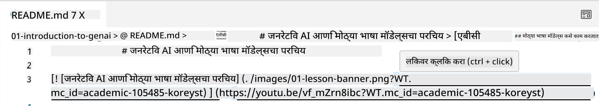
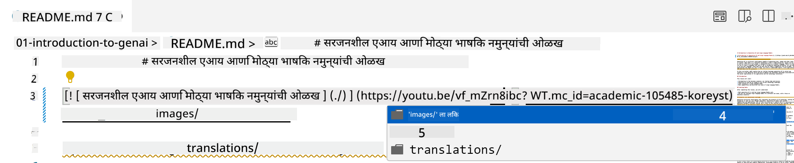
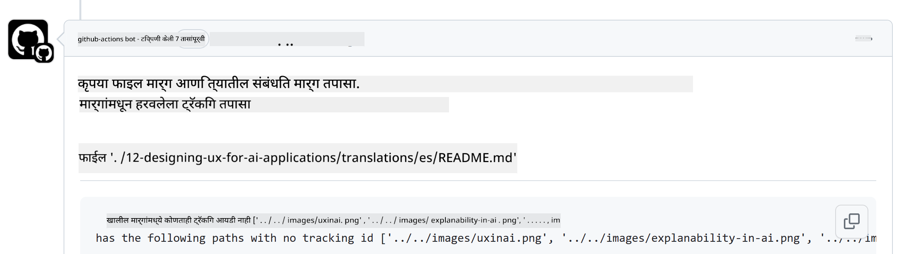
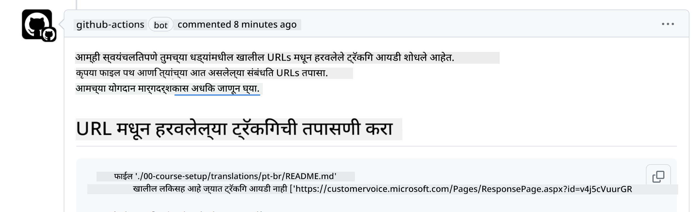
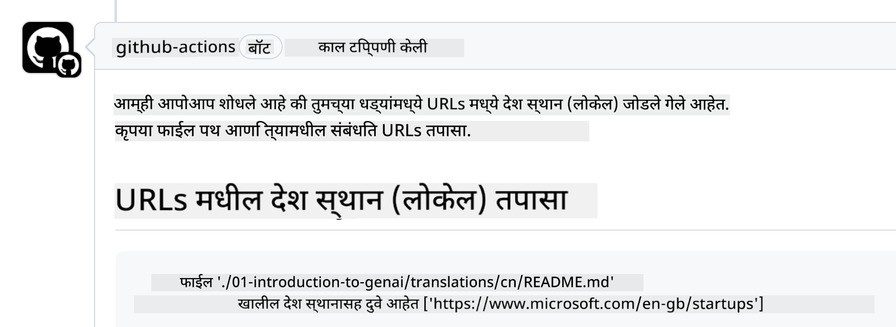

<!--
CO_OP_TRANSLATOR_METADATA:
{
  "original_hash": "57c41f2af71001a2cff9d8eb797cb843",
  "translation_date": "2025-05-19T11:12:44+00:00",
  "source_file": "CONTRIBUTING.md",
  "language_code": "mr"
}
-->
# योगदान

या प्रकल्पात योगदान आणि सूचना स्वागतार्ह आहेत. बहुतेक योगदानासाठी आपल्याला योगदानकर्ता परवाना करार (CLA) मान्य करणे आवश्यक आहे ज्यामध्ये आपण आमच्याकडे आपल्या योगदानाचा उपयोग करण्याचा अधिकार देत असल्याचे घोषित केले आहे. अधिक तपशीलांसाठी, <https://cla.microsoft.com> ला भेट द्या.

> महत्वाचे: या रिपोमध्ये मजकूर अनुवाद करताना, कृपया मशीन अनुवाद वापरू नका. आम्ही समुदायाद्वारे अनुवाद सत्यापित करू, त्यामुळे कृपया केवळ त्या भाषांमध्ये अनुवादासाठी स्वयंसेवा करा ज्यामध्ये आपण पारंगत आहात.

जेव्हा आपण एक पुल विनंती सबमिट करता, तेव्हा एक CLA-बॉट स्वयंचलितपणे ठरवेल की आपल्याला CLA प्रदान करणे आवश्यक आहे का आणि PR योग्यरित्या सजवेल (उदा., लेबल, टिप्पणी). बॉटद्वारे दिलेल्या सूचनांचे अनुसरण करा. आमच्या CLA वापरणाऱ्या सर्व रिपोझिटरीजमध्ये हे आपल्याला एकदाच करावे लागेल.

## आचारसंहिता

या प्रकल्पाने [Microsoft Open Source Code of Conduct](https://opensource.microsoft.com/codeofconduct/?WT.mc_id=academic-105485-koreyst) स्वीकारली आहे. अधिक माहितीसाठी [Code of Conduct FAQ](https://opensource.microsoft.com/codeofconduct/faq/?WT.mc_id=academic-105485-koreyst) वाचा किंवा [opencode@microsoft.com](mailto:opencode@microsoft.com) वर अतिरिक्त प्रश्न किंवा टिप्पण्या पाठवा.

## प्रश्न किंवा समस्या?

सामान्य समर्थन प्रश्नांसाठी कृपया GitHub समस्यांचे उघडणे टाळा कारण GitHub यादी फिचर विनंत्या आणि बग अहवालांसाठी वापरली जावी. यामुळे आम्ही कोडमधील वास्तविक मुद्दे किंवा बग सहजपणे ट्रॅक करू शकतो आणि सामान्य चर्चा वास्तविक कोडपासून वेगळी ठेवू शकतो.

## टायपो, समस्या, बग आणि योगदान

जेव्हा आपण 'Generative AI for Beginners' रिपोझिटरीमध्ये कोणतेही बदल सबमिट करता, तेव्हा कृपया या शिफारसींचे अनुसरण करा.

* आपल्या बदल करण्यापूर्वी नेहमी रिपोझिटरी आपल्या स्वतःच्या खात्यावर फोर्क करा
* एकाच पुल विनंतीमध्ये एकाधिक बदल एकत्र करू नका. उदाहरणार्थ, कोणत्याही बग फिक्स आणि दस्तऐवजीकरण अद्यतनांसाठी वेगवेगळे PR सबमिट करा
* जर आपल्या पुल विनंतीमध्ये विलीन संघर्ष दर्शवले जात असतील, तर मुख्य रिपोझिटरीमध्ये काय आहे त्याचे प्रतिबिंब म्हणून आपल्या स्थानिक मुख्य अद्यतनित करा आणि नंतर आपल्या बदल करा
* जर आपण अनुवाद सबमिट करत असाल, तर कृपया सर्व अनुवादित फाइल्ससाठी एक PR तयार करा कारण आम्ही सामग्रीसाठी आंशिक अनुवाद स्वीकारत नाही
* जर आपण टायपो किंवा दस्तऐवजीकरण फिक्स सबमिट करत असाल, तर योग्य ठिकाणी बदल एकाच PR मध्ये एकत्रित करू शकता

## लेखनासाठी सामान्य मार्गदर्शन

- सुनिश्चित करा की आपल्या सर्व URLs चौकोनी कंसात आणि नंतर परंतु बिनामोठ्या जागेच्या किंवा आत `` सह कंसात गुंडाळलेल्या आहेत.
- सुनिश्चित करा की कोणताही सापेक्ष लिंक (उदा. रिपोझिटरीमधील इतर फाइल्स आणि फोल्डर्ससाठी लिंक) `./` सह सुरू होते जे वर्तमान कार्यरत निर्देशिकेत असलेल्या फाइल किंवा फोल्डरचा संदर्भ देते किंवा `../` जे पालक कार्यरत निर्देशिकेत असलेल्या फाइल किंवा फोल्डरचा संदर्भ देते.
- सुनिश्चित करा की कोणताही सापेक्ष लिंक (उदा. रिपोझिटरीमधील इतर फाइल्स आणि फोल्डर्ससाठी लिंक) ट्रॅकिंग आयडी (उदा. `?` किंवा `&` आणि नंतर `wt.mc_id=` किंवा `WT.mc_id=`) त्याच्या शेवटी आहे.
- सुनिश्चित करा की खालील डोमेनमधून कोणताही URL _github.com, microsoft.com, visualstudio.com, aka.ms, आणि azure.com_ ट्रॅकिंग आयडी (उदा. `?` किंवा `&` आणि नंतर `wt.mc_id=` किंवा `WT.mc_id=`) त्याच्या शेवटी आहे.
- सुनिश्चित करा की आपल्या लिंकांमध्ये देश विशिष्ट लोकेल नाही (उदा. `/en-us/` किंवा `/en/`).
- सुनिश्चित करा की सर्व प्रतिमा `./images` फोल्डरमध्ये संग्रहित आहेत.
- सुनिश्चित करा की प्रतिमांना इंग्रजी अक्षरे, संख्या आणि डॅशेस वापरून वर्णनात्मक नावे आहेत.

## GitHub वर्कफ्लो

जेव्हा आपण एक पुल विनंती सबमिट करता, तेव्हा चार वेगवेगळ्या वर्कफ्लो नियमांची पडताळणी करण्यासाठी ट्रिगर होतील.
वर्कफ्लो तपासणी पास करण्यासाठी येथे सूचीबद्ध सूचनांचे अनुसरण करा.

- [Check Broken Relative Paths](../..)
- [Check Paths Have Tracking](../..)
- [Check URLs Have Tracking](../..)
- [Check URLs Don't Have Locale](../..)

### Check Broken Relative Paths

हा वर्कफ्लो सुनिश्चित करतो की आपल्या फाइल्समधील कोणताही सापेक्ष मार्ग कार्यरत आहे.
हे रिपोझिटरी GitHub पेजेसवर तैनात केले जाते त्यामुळे आपण सर्वकाही एकत्र ठेवण्यासाठी टाइप करताना खूप काळजीपूर्वक असावे, जेणेकरून कोणालाही चुकीच्या ठिकाणी निर्देशित केले जाऊ नये.

आपल्या लिंक योग्यरित्या कार्यरत आहेत हे सुनिश्चित करण्यासाठी फक्त VS कोड वापरून तपासा.

उदाहरणार्थ, जेव्हा आपण आपल्या फाइल्समधील कोणत्याही लिंकवर होवर करता तेव्हा **ctrl + click** दाबून लिंक अनुसरण करण्याचे संकेत दिले जातील.

जर आपण लिंकवर क्लिक केले आणि ते स्थानिकपणे कार्यरत नसेल तर, निश्चितपणे ते वर्कफ्लो ट्रिगर करेल आणि GitHub वर कार्य करणार नाही.

ही समस्या ठीक करण्यासाठी, VS कोडच्या मदतीने लिंक टाइप करण्याचा प्रयत्न करा.

जेव्हा आपण `./` किंवा `../` टाइप करता तेव्हा VS कोड आपल्याला टाइप केलेल्या अनुसार उपलब्ध पर्यायांमधून निवडण्यास सूचित करेल.

इच्छित फाइल किंवा फोल्डरवर क्लिक करून मार्ग अनुसरण करा आणि आपला मार्ग तुटलेला नाही याची खात्री करा.

एकदा आपण योग्य सापेक्ष मार्ग जोडला की, आपल्या बदलांची सत्यता तपासण्यासाठी वर्कफ्लो पुन्हा ट्रिगर होईल.
जर आपण तपासणी पास केली तर आपण जाण्यासाठी सज्ज आहात.

### Check Paths Have Tracking

हा वर्कफ्लो सुनिश्चित करतो की कोणत्याही सापेक्ष मार्गामध्ये ट्रॅकिंग आहे.
हे रिपोझिटरी GitHub पेजेसवर तैनात केले जाते त्यामुळे आम्हाला वेगवेगळ्या फाइल्स आणि फोल्डर्समधील हालचाल ट्रॅक करावी लागते.

आपल्या सापेक्ष मार्गांमध्ये ट्रॅकिंग आहे हे सुनिश्चित करण्यासाठी फक्त खालील मजकूर `?wt.mc_id=` मार्गाच्या शेवटी तपासा.
जर ते आपल्या सापेक्ष मार्गांमध्ये जोडलेले असेल तर आपण ही तपासणी पास कराल.

जर नसेल, तर आपल्याला खालील त्रुटी मिळू शकते.

ही समस्या ठीक करण्यासाठी, वर्कफ्लोने हायलाइट केलेल्या फाइल मार्ग उघडण्याचा प्रयत्न करा आणि सापेक्ष मार्गांच्या शेवटी ट्रॅकिंग आयडी जोडा.

एकदा आपण ट्रॅकिंग आयडी जोडला की, आपल्या बदलांची सत्यता तपासण्यासाठी वर्कफ्लो पुन्हा ट्रिगर होईल.
जर आपण तपासणी पास केली तर आपण जाण्यासाठी सज्ज आहात.

### Check URLs Have Tracking

हा वर्कफ्लो सुनिश्चित करतो की कोणत्याही वेब URL मध्ये ट्रॅकिंग आहे.
हे रिपोझिटरी सर्वांना उपलब्ध आहे त्यामुळे आपल्याला ट्रॅकिंग करणे आवश्यक आहे ज्यामुळे आपल्याला माहित होईल की ट्रॅफिक कुठून येत आहे.

आपल्या URLs मध्ये ट्रॅकिंग आहे हे सुनिश्चित करण्यासाठी फक्त खालील मजकूर `?wt.mc_id=` URL च्या शेवटी तपासा.
जर ते आपल्या URLs मध्ये जोडलेले असेल तर आपण ही तपासणी पास कराल.

जर नसेल, तर आपल्याला खालील त्रुटी मिळू शकते.

ही समस्या ठीक करण्यासाठी, वर्कफ्लोने हायलाइट केलेल्या फाइल मार्ग उघडण्याचा प्रयत्न करा आणि URLs च्या शेवटी ट्रॅकिंग आयडी जोडा.

एकदा आपण ट्रॅकिंग आयडी जोडला की, आपल्या बदलांची सत्यता तपासण्यासाठी वर्कफ्लो पुन्हा ट्रिगर होईल.
जर आपण तपासणी पास केली तर आपण जाण्यासाठी सज्ज आहात.

### Check URLs Don't Have Locale

हा वर्कफ्लो सुनिश्चित करतो की कोणत्याही वेब URL मध्ये देश विशिष्ट लोकेल नाही.
हे रिपोझिटरी जगभरातील सर्वांना उपलब्ध आहे त्यामुळे आपल्या देशाच्या लोकेलला URLs मध्ये समाविष्ट न करण्याचे सुनिश्चित करणे आवश्यक आहे.

आपल्या URLs मध्ये देश लोकेल नाही हे सुनिश्चित करण्यासाठी फक्त खालील मजकूर `/en-us/` किंवा `/en/` किंवा URL मध्ये कुठेही कोणत्याही अन्य भाषा लोकेल तपासा.
जर ते आपल्या URLs मध्ये उपस्थित नसेल तर आपण ही तपासणी पास कराल.

जर नसेल, तर आपल्याला खालील त्रुटी मिळू शकते.

ही समस्या ठीक करण्यासाठी, वर्कफ्लोने हायलाइट केलेल्या फाइल मार्ग उघडण्याचा प्रयत्न करा आणि URLs मधून देश लोकेल काढा.

एकदा आपण देश लोकेल काढला की, आपल्या बदलांची सत्यता तपासण्यासाठी वर्कफ्लो पुन्हा ट्रिगर होईल.
जर आपण तपासणी पास केली तर आपण जाण्यासाठी सज्ज आहात.

अभिनंदन! आपल्या योगदानाबद्दल आम्ही लवकरात लवकर आपल्याला अभिप्राय देऊ.

**अस्वीकरण**:  
हा दस्तऐवज AI अनुवाद सेवा [Co-op Translator](https://github.com/Azure/co-op-translator) वापरून अनुवादित केला गेला आहे. आम्ही अचूकतेसाठी प्रयत्नशील असलो तरी कृपया लक्षात ठेवा की स्वयंचलित अनुवादांमध्ये चुका किंवा अचूकतेचा अभाव असू शकतो. मूळ भाषेतील दस्तऐवज प्राधिकृत स्रोत मानला जावा. अत्यावश्यक माहितीसाठी, व्यावसायिक मानवी अनुवादाची शिफारस केली जाते. या अनुवादाच्या वापरातून उद्भवणाऱ्या कोणत्याही गैरसमजुती किंवा चुकीच्या अर्थासाठी आम्ही जबाबदार नाही.