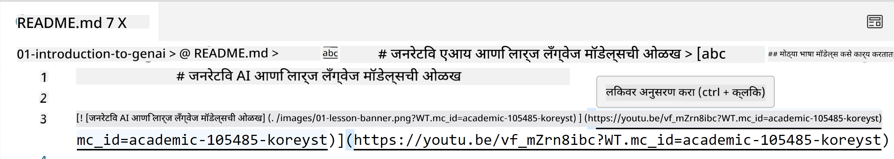
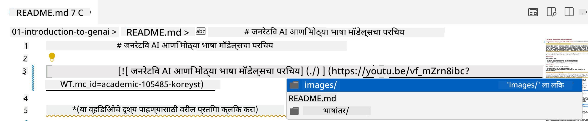
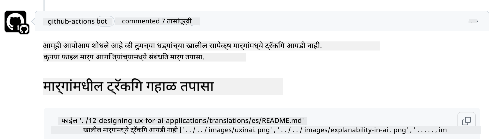
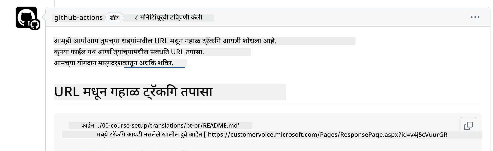
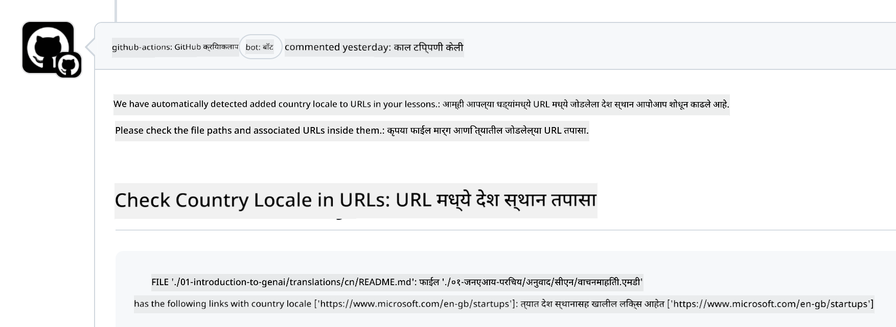

<!--
CO_OP_TRANSLATOR_METADATA:
{
  "original_hash": "57c41f2af71001a2cff9d8eb797cb843",
  "translation_date": "2025-06-25T07:06:11+00:00",
  "source_file": "CONTRIBUTING.md",
  "language_code": "mr"
}
-->
# योगदान

या प्रकल्पामध्ये योगदान आणि सूचना स्वागतार्ह आहेत. बहुतेक योगदानासाठी तुम्हाला योगदानकर्ता परवाना करार (CLA) मान्य करणे आवश्यक आहे, ज्यामुळे तुम्हाला तुमचे योगदान वापरण्याचा अधिकार आहे आणि प्रत्यक्षात तो अधिकार देतो. अधिक माहितीसाठी, <https://cla.microsoft.com> ला भेट द्या.

> महत्त्वाचे: या रिपॉझिटरीमध्ये मजकूर अनुवाद करताना कृपया मशीन अनुवाद वापरू नका. आम्ही समुदायाद्वारे अनुवादांची पडताळणी करू, त्यामुळे कृपया केवळ त्या भाषांमध्ये अनुवादासाठी स्वयंसेवा करा ज्यामध्ये तुम्ही पारंगत आहात.

जेव्हा तुम्ही पुल विनंती सबमिट करता, तेव्हा CLA-बॉट आपोआप ठरवेल की तुम्हाला CLA प्रदान करण्याची आवश्यकता आहे की नाही आणि PR योग्य प्रकारे सजवेल (उदा. लेबल, टिप्पणी). बॉटद्वारे दिलेल्या सूचनांचे अनुसरण करा. तुम्हाला आमच्या CLA वापरणाऱ्या सर्व रिपॉझिटरीमध्ये हे एकदाच करणे आवश्यक आहे.

## आचारसंहिता

या प्रकल्पाने [Microsoft Open Source Code of Conduct](https://opensource.microsoft.com/codeofconduct/?WT.mc_id=academic-105485-koreyst) स्वीकारली आहे.
अधिक माहितीसाठी [Code of Conduct FAQ](https://opensource.microsoft.com/codeofconduct/faq/?WT.mc_id=academic-105485-koreyst) वाचा किंवा [opencode@microsoft.com](mailto:opencode@microsoft.com) वर कोणत्याही अतिरिक्त प्रश्न किंवा टिप्पण्यांसाठी संपर्क साधा.

## प्रश्न किंवा समस्या?

सर्वसाधारण समर्थन प्रश्नांसाठी कृपया GitHub मुद्दे उघडू नका कारण GitHub यादीचा वापर वैशिष्ट्य विनंत्या आणि बग अहवालांसाठी केला पाहिजे. याप्रकारे आम्ही कोडमधील वास्तविक समस्या किंवा बग अधिक सहजतेने ट्रॅक करू शकतो आणि सामान्य चर्चा वास्तविक कोडपासून वेगळी ठेवू शकतो.

## टायपो, समस्या, बग आणि योगदान

जेव्हा तुम्ही Generative AI for Beginners रिपॉझिटरीमध्ये कोणतेही बदल सबमिट करत असाल, तेव्हा कृपया या शिफारसींचे पालन करा.

* तुमच्या सुधारणा करण्यापूर्वी नेहमी रिपॉझिटरीला तुमच्या स्वतःच्या खात्यावर फोर्क करा
* एकाच पुल विनंतीमध्ये अनेक बदल एकत्र करू नका. उदाहरणार्थ, बग फिक्स आणि दस्तऐवजीकरण अद्यतने स्वतंत्र PRs वापरून सबमिट करा
* जर तुमच्या पुल विनंतीमध्ये मर्ज संघर्ष दर्शवले जात असतील, तर तुमच्या स्थानिक मुख्य शाखेला मुख्य रिपॉझिटरीमध्ये काय आहे त्याचे प्रतिबिंब बनवून अद्यतनित करा आणि नंतर तुमच्या सुधारणा करा
* जर तुम्ही अनुवाद सबमिट करत असाल, तर कृपया सर्व अनुवादित फाइल्ससाठी एक PR तयार करा कारण आम्ही सामग्रीसाठी अंशतः अनुवाद स्वीकारत नाही
* जर तुम्ही टायपो किंवा दस्तऐवजीकरण फिक्स सबमिट करत असाल, तर जेथे योग्य असेल तेथे एकाच PR मध्ये सुधारणा एकत्र करू शकता

## लेखनासाठी सामान्य मार्गदर्शन

- सुनिश्चित करा की तुमचे सर्व URL चौकोनी कंसात गुंडाळलेले आहेत आणि नंतर त्याच्यानंतर कंसात अतिरिक्त जागा नसलेल्या `` आहेत.
- सुनिश्चित करा की कोणत्याही सापेक्ष लिंक (उदा. रिपॉझिटरीमधील इतर फाइल्स आणि फोल्डर्सकडे जाणाऱ्या लिंक) `./` सह सुरू होते जी चालू कार्यरत निर्देशिकेमध्ये स्थित फाइल किंवा फोल्डरला संदर्भित करते किंवा `../` जी पालक कार्यरत निर्देशिकेमध्ये स्थित फाइल किंवा फोल्डरला संदर्भित करते.
- सुनिश्चित करा की कोणत्याही सापेक्ष लिंक (उदा. रिपॉझिटरीमधील इतर फाइल्स आणि फोल्डर्सकडे जाणाऱ्या लिंक) च्या शेवटी ट्रॅकिंग आयडी आहे (उदा. `?` किंवा `&` आणि नंतर `wt.mc_id=` किंवा `WT.mc_id=`).
- सुनिश्चित करा की खालील डोमेनमधून कोणत्याही URL मध्ये ट्रॅकिंग आयडी आहे (उदा. `?` किंवा `&` आणि नंतर `wt.mc_id=` किंवा `WT.mc_id=`).
- सुनिश्चित करा की तुमच्या लिंकमध्ये देश-विशिष्ट लोकेल नाही (उदा. `/en-us/` किंवा `/en/`).
- सुनिश्चित करा की सर्व प्रतिमा `./images` फोल्डरमध्ये संग्रहित आहेत.
- सुनिश्चित करा की प्रतिमांना वर्णनात्मक नावे आहेत ज्यात इंग्रजी वर्ण, संख्या, आणि डॅशेसचा समावेश आहे.

## GitHub वर्कफ्लोज

जेव्हा तुम्ही पुल विनंती सबमिट करता, तेव्हा चार वेगवेगळ्या वर्कफ्लोज मागील नियमांची पडताळणी करण्यासाठी ट्रिगर होतील.
वर्कफ्लो चेक्स पास करण्यासाठी येथे सूचीबद्ध केलेल्या सूचनांचे अनुसरण करा.

- [Check Broken Relative Paths](../..)
- [Check Paths Have Tracking](../..)
- [Check URLs Have Tracking](../..)
- [Check URLs Don't Have Locale](../..)

### Check Broken Relative Paths

हा वर्कफ्लो सुनिश्चित करतो की तुमच्या फाइल्समधील कोणताही सापेक्ष पथ कार्यरत आहे.
हे रिपॉझिटरी GitHub पेजेसवर तैनात केले जाते त्यामुळे तुम्ही सर्व काही एकत्र जोडणाऱ्या लिंक टाइप करताना अतिशय सावधगिरी बाळगणे आवश्यक आहे जेणेकरून कोणालाही चुकीच्या ठिकाणी निर्देशित केले जाऊ नये.

तुमच्या लिंक योग्य प्रकारे कार्यरत आहेत याची खात्री करण्यासाठी फक्त VS कोड वापरून ते तपासा.

उदाहरणार्थ, जेव्हा तुम्ही तुमच्या फाइल्समधील कोणत्याही लिंकवर होवर करता तेव्हा तुम्हाला **ctrl + click** दाबून लिंकचे अनुसरण करण्याचे संकेत दिले जाईल

जर तुम्ही लिंकवर क्लिक केले आणि ते स्थानिकपणे कार्यरत नसेल तर, नक्कीच ते वर्कफ्लो ट्रिगर करेल आणि GitHub वर कार्यरत नसेल.

ही समस्या सोडवण्यासाठी, VS कोडच्या मदतीने लिंक टाइप करण्याचा प्रयत्न करा.

जेव्हा तुम्ही `./` किंवा `../` टाइप करता तेव्हा VS कोड तुम्ही टाइप केलेल्या गोष्टीनुसार उपलब्ध पर्याय निवडण्यास संकेत देईल.

इच्छित फाइल किंवा फोल्डरवर क्लिक करून पथ अनुसरण करा आणि तुम्हाला खात्री असेल की तुमचा पथ तुटलेला नाही.

एकदा तुम्ही योग्य सापेक्ष पथ जोडला, सेव्ह करा, आणि तुमचे बदल पुश करा, वर्कफ्लो तुमचे बदल पडताळण्यासाठी पुन्हा ट्रिगर होईल.
जर तुम्ही चेक पास केला तर तुम्ही पुढे जाण्यासाठी सज्ज आहात.

### Check Paths Have Tracking

हा वर्कफ्लो सुनिश्चित करतो की कोणत्याही सापेक्ष पथामध्ये ट्रॅकिंग आहे.
हे रिपॉझिटरी GitHub पेजेसवर तैनात केले जाते त्यामुळे आम्हाला वेगवेगळ्या फाइल्स आणि फोल्डर्समधील हालचाल ट्रॅक करणे आवश्यक आहे.

तुमच्या सापेक्ष पथांमध्ये ट्रॅकिंग आहे याची खात्री करण्यासाठी फक्त खालील मजकूर `?wt.mc_id=` पथाच्या शेवटी तपासा.
जर ते तुमच्या सापेक्ष पथांमध्ये जोडलेले असेल तर तुम्ही हा चेक पास कराल.

जर तसे नसेल, तर तुम्हाला खालील त्रुटी मिळू शकते.

ही समस्या सोडवण्यासाठी, वर्कफ्लोने हायलाइट केलेल्या फाइल पथ उघडण्याचा प्रयत्न करा आणि सापेक्ष पथांच्या शेवटी ट्रॅकिंग आयडी जोडा.

एकदा तुम्ही ट्रॅकिंग आयडी जोडला, सेव्ह करा, आणि तुमचे बदल पुश करा, वर्कफ्लो तुमचे बदल पडताळण्यासाठी पुन्हा ट्रिगर होईल.
जर तुम्ही चेक पास केला तर तुम्ही पुढे जाण्यासाठी सज्ज आहात.

### Check URLs Have Tracking

हा वर्कफ्लो सुनिश्चित करतो की कोणत्याही वेब URL मध्ये ट्रॅकिंग आहे.
हे रिपॉझिटरी सर्वांसाठी उपलब्ध आहे त्यामुळे तुम्हाला ट्रॅकिंग करून ट्रॅफिक कुठून येत आहे हे जाणून घेणे आवश्यक आहे.

तुमच्या URL मध्ये ट्रॅकिंग आहे याची खात्री करण्यासाठी फक्त खालील मजकूर `?wt.mc_id=` URL च्या शेवटी तपासा.
जर ते तुमच्या URL मध्ये जोडलेले असेल तर तुम्ही हा चेक पास कराल.

जर तसे नसेल, तर तुम्हाला खालील त्रुटी मिळू शकते.

ही समस्या सोडवण्यासाठी, वर्कफ्लोने हायलाइट केलेल्या फाइल पथ उघडण्याचा प्रयत्न करा आणि URL च्या शेवटी ट्रॅकिंग आयडी जोडा.

एकदा तुम्ही ट्रॅकिंग आयडी जोडला, सेव्ह करा, आणि तुमचे बदल पुश करा, वर्कफ्लो तुमचे बदल पडताळण्यासाठी पुन्हा ट्रिगर होईल.
जर तुम्ही चेक पास केला तर तुम्ही पुढे जाण्यासाठी सज्ज आहात.

### Check URLs Don't Have Locale

हा वर्कफ्लो सुनिश्चित करतो की कोणत्याही वेब URL मध्ये देश-विशिष्ट लोकेल नाही.
हे रिपॉझिटरी जगभरातील सर्वांसाठी उपलब्ध आहे त्यामुळे तुम्हाला URL मध्ये तुमच्या देशाचा लोकेल समाविष्ट न करण्याची खात्री करणे आवश्यक आहे.

तुमच्या URL मध्ये देशाचा लोकेल नाही याची खात्री करण्यासाठी फक्त खालील मजकूर `/en-us/` किंवा `/en/` किंवा URL मध्ये कुठेही कोणत्याही अन्य भाषेचा लोकेल तपासा.
जर ते तुमच्या URL मध्ये उपस्थित नसेल तर तुम्ही हा चेक पास कराल.

जर तसे नसेल, तर तुम्हाला खालील त्रुटी मिळू शकते.

ही समस्या सोडवण्यासाठी, वर्कफ्लोने हायलाइट केलेल्या फाइल पथ उघडण्याचा प्रयत्न करा आणि URL मधून देशाचा लोकेल काढा.

एकदा तुम्ही देशाचा लोकेल काढला, सेव्ह करा, आणि तुमचे बदल पुश करा, वर्कफ्लो तुमचे बदल पडताळण्यासाठी पुन्हा ट्रिगर होईल.
जर तुम्ही चेक पास केला तर तुम्ही पुढे जाण्यासाठी सज्ज आहात.

अभिनंदन! तुमच्या योगदानाबद्दल प्रतिक्रिया देण्यासाठी आम्ही शक्य तितक्या लवकर तुमच्याशी संपर्क साधू.

**अस्वीकृती:**
हा दस्तऐवज AI भाषांतर सेवा [Co-op Translator](https://github.com/Azure/co-op-translator) वापरून भाषांतरित केला आहे. आम्ही अचूकतेसाठी प्रयत्नशील असलो तरी कृपया लक्षात ठेवा की स्वयंचलित भाषांतरे त्रुटी किंवा अचूकतेच्या अभावाने युक्त असू शकतात. मूळ भाषेतील मूळ दस्तऐवज अधिकृत स्रोत म्हणून विचारात घ्यावा. महत्त्वाच्या माहितीसाठी, व्यावसायिक मानवी भाषांतराची शिफारस केली जाते. या भाषांतराच्या वापरामुळे उद्भवलेल्या कोणत्याही गैरसमज किंवा चुकीच्या अर्थासाठी आम्ही जबाबदार नाही.