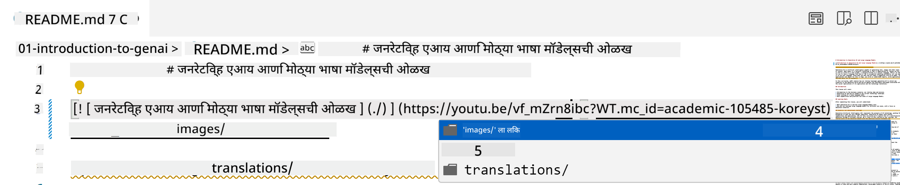
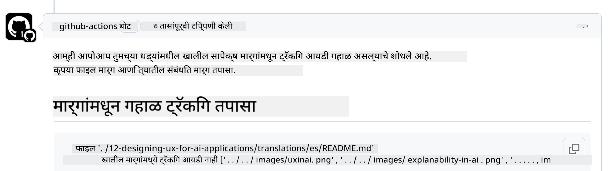
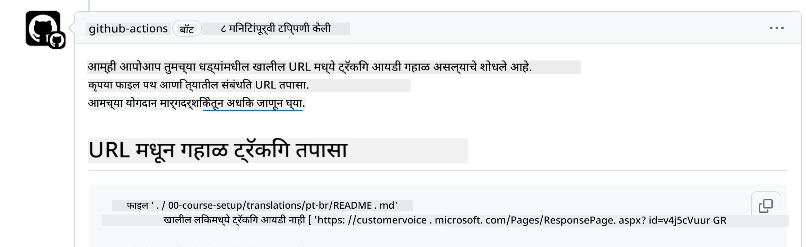
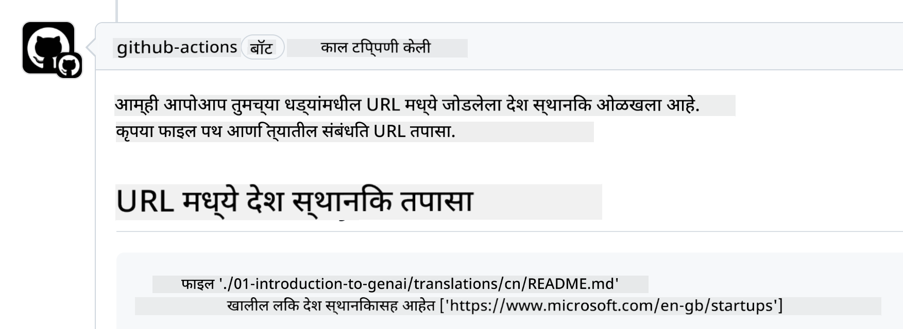

<!--
CO_OP_TRANSLATOR_METADATA:
{
  "original_hash": "57c41f2af71001a2cff9d8eb797cb843",
  "translation_date": "2025-07-09T05:52:03+00:00",
  "source_file": "CONTRIBUTING.md",
  "language_code": "mr"
}
-->
# योगदान देणे

हा प्रकल्प योगदान आणि सूचना स्वागतार्ह मानतो. बहुतेक योगदानांसाठी तुम्हाला Contributor License Agreement (CLA) शी सहमती दर्शवावी लागते, ज्यात तुम्ही घोषित करता की तुम्हाला तुमच्या योगदानाचा वापर करण्याचा अधिकार आहे आणि तुम्ही आम्हाला तो अधिकार देत आहात. तपशीलांसाठी भेट द्या <https://cla.microsoft.com>.

> महत्त्वाचे: या रेपॉमध्ये मजकूराचे भाषांतर करताना कृपया मशीन ट्रान्सलेशन वापरू नका. आम्ही समुदायाद्वारे भाषांतरांची पडताळणी करू, त्यामुळे फक्त त्या भाषांसाठीच भाषांतरासाठी स्वयंसेवक व्हा ज्यात तुम्हाला प्रावीण्य आहे.

जेव्हा तुम्ही पुल रिक्वेस्ट सबमिट करता, तेव्हा CLA-बॉट आपोआप ठरवेल की तुम्हाला CLA प्रदान करणे आवश्यक आहे का आणि PR योग्यरित्या चिन्हांकित करेल (उदा., लेबल, टिप्पणी). फक्त बॉटने दिलेल्या सूचनांचे पालन करा. आमच्या CLA वापरणाऱ्या सर्व रेपॉजिटरीजमध्ये तुम्हाला हे एकदाच करावे लागेल.

## आचारसंहिता

या प्रकल्पाने [Microsoft Open Source Code of Conduct](https://opensource.microsoft.com/codeofconduct/?WT.mc_id=academic-105485-koreyst) स्वीकारली आहे.
अधिक माहितीसाठी [Code of Conduct FAQ](https://opensource.microsoft.com/codeofconduct/faq/?WT.mc_id=academic-105485-koreyst) वाचा किंवा कोणत्याही अतिरिक्त प्रश्नांसाठी किंवा टिप्पण्यांसाठी [opencode@microsoft.com](mailto:opencode@microsoft.com) शी संपर्क करा.

## प्रश्न किंवा समस्या?

सामान्य समर्थन प्रश्नांसाठी GitHub इश्यूज उघडू नका कारण GitHub यादी फिचर विनंत्या आणि बग रिपोर्टसाठी वापरली पाहिजे. अशा प्रकारे आपण कोडमधील वास्तविक समस्या किंवा बग अधिक सोप्या पद्धतीने ट्रॅक करू शकतो आणि सामान्य चर्चा वास्तविक कोडपासून वेगळी ठेवू शकतो.

## टायपो, समस्या, बग आणि योगदान

जेव्हा तुम्ही Generative AI for Beginners रेपॉजिटरीमध्ये कोणतेही बदल सबमिट करता, तेव्हा कृपया खालील शिफारसींचे पालन करा.

* नेहमी तुमच्या स्वतःच्या खात्यात रेपॉजिटरी फोर्क करा आणि नंतर बदल करा
* एकाच पुल रिक्वेस्टमध्ये अनेक बदल एकत्र करू नका. उदाहरणार्थ, बग फिक्स आणि दस्तऐवज अद्यतने वेगळ्या PRs मध्ये सबमिट करा
* जर तुमच्या पुल रिक्वेस्टमध्ये मर्ज कॉन्फ्लिक्ट दिसत असेल, तर तुमच्या स्थानिक main शाखेला मुख्य रेपॉजिटरीतील main शी समक्रमित करा आणि नंतर बदल करा
* जर तुम्ही भाषांतर सबमिट करत असाल, तर सर्व भाषांतरित फाइल्ससाठी एकच PR तयार करा कारण आम्ही अंशतः भाषांतर स्वीकारत नाही
* जर तुम्ही टायपो किंवा दस्तऐवज सुधारणा करत असाल, तर योग्य असल्यास एकाच PR मध्ये बदल एकत्र करू शकता

## लेखनासाठी सामान्य मार्गदर्शन

- तुमच्या सर्व URLs चा वापर चौकोनी कंसात करा आणि त्यानंतर कोपऱ्यात, कोणतेही अतिरिक्त स्पेस न ठेवता `` या स्वरूपात ठेवा.
- कोणताही सापेक्ष लिंक (उदा. रेपॉजिटरीतील इतर फाइल्स आणि फोल्डर्ससाठी लिंक) `./` ने सुरू होणे आवश्यक आहे, जे चालू कार्य निर्देशिकेतील फाइल किंवा फोल्डर दर्शवते, किंवा `../` ने सुरू होणे आवश्यक आहे, जे पालक कार्य निर्देशिकेतील फाइल किंवा फोल्डर दर्शवते.
- कोणत्याही सापेक्ष लिंकच्या शेवटी ट्रॅकिंग आयडी (उदा. `?` किंवा `&` नंतर `wt.mc_id=` किंवा `WT.mc_id=`) असणे आवश्यक आहे.
- खालील डोमेनमधील कोणत्याही URL मध्ये _github.com, microsoft.com, visualstudio.com, aka.ms, आणि azure.com_ ट्रॅकिंग आयडी असणे आवश्यक आहे.
- तुमच्या लिंकमध्ये देशविशिष्ट लोकल (उदा. `/en-us/` किंवा `/en/`) नसावे.
- सर्व प्रतिमा `./images` फोल्डरमध्ये संग्रहित असाव्यात.
- प्रतिमांचे नाव इंग्रजी अक्षरे, संख्या आणि डॅशेस वापरून वर्णनात्मक असावे.

## GitHub वर्कफ्लोज

जेव्हा तुम्ही पुल रिक्वेस्ट सबमिट करता, तेव्हा मागील नियमांची पडताळणी करण्यासाठी चार वेगवेगळे वर्कफ्लोज सुरू होतील.
वर्कफ्लो तपासण्या पार करण्यासाठी येथे दिलेल्या सूचनांचे पालन करा.

- [तुटलेले सापेक्ष मार्ग तपासा](../..)
- [मार्गांमध्ये ट्रॅकिंग आहे का तपासा](../..)
- [URLs मध्ये ट्रॅकिंग आहे का तपासा](../..)
- [URLs मध्ये लोकल नाही याची खात्री करा](../..)

### तुटलेले सापेक्ष मार्ग तपासा

हा वर्कफ्लो तुमच्या फाइलमधील कोणताही सापेक्ष मार्ग कार्यरत आहे का हे सुनिश्चित करतो.
ही रेपॉजिटरी GitHub पेजेसवर तैनात आहे, त्यामुळे लिंक टाइप करताना खूप काळजी घ्या जेणेकरून कोणालाही चुकीच्या ठिकाणी नेले जाऊ नये.

तुमच्या लिंक योग्यरित्या कार्यरत आहेत याची खात्री करण्यासाठी फक्त VS कोड वापरा.

उदाहरणार्थ, जेव्हा तुम्ही तुमच्या फाइलमधील कोणत्याही लिंकवर होवर करता, तेव्हा तुम्हाला **ctrl + click** करून लिंक फॉलो करण्याचा पर्याय दिसेल.

जर तुम्ही लिंकवर क्लिक केला आणि ती स्थानिकरित्या कार्यरत नसेल, तर नक्कीच वर्कफ्लो त्रुटी दाखवेल आणि GitHub वरही ती काम करणार नाही.

ही समस्या सोडवण्यासाठी, VS कोडच्या मदतीने लिंक टाइप करण्याचा प्रयत्न करा.

जेव्हा तुम्ही `./` किंवा `../` टाइप करता, तेव्हा VS कोड तुम्हाला उपलब्ध पर्यायांमधून निवडण्याचा प्रॉम्प्ट देईल.

इच्छित फाइल किंवा फोल्डरवर क्लिक करून मार्ग फॉलो करा आणि तुम्हाला खात्री होईल की तुमचा मार्ग तुटलेला नाही.

योग्य सापेक्ष मार्ग जोडल्यावर, सेव्ह करा आणि तुमचे बदल पुश करा, वर्कफ्लो पुन्हा सुरू होईल आणि तुमचे बदल पडताळेल.
जर तुम्ही तपासणी उत्तीर्ण केली, तर तुम्ही पुढे जाऊ शकता.

### मार्गांमध्ये ट्रॅकिंग आहे का तपासा

हा वर्कफ्लो कोणत्याही सापेक्ष मार्गात ट्रॅकिंग आहे का हे सुनिश्चित करतो.
ही रेपॉजिटरी GitHub पेजेसवर तैनात आहे, त्यामुळे वेगवेगळ्या फाइल्स आणि फोल्डर्समधील हालचाल ट्रॅक करणे आवश्यक आहे.

तुमच्या सापेक्ष मार्गांमध्ये ट्रॅकिंग आहे का हे तपासण्यासाठी मार्गाच्या शेवटी `?wt.mc_id=` हा मजकूर आहे का ते पहा.
जर तो जोडलेला असेल तर तुम्ही हा तपासणी पास कराल.

नसेल तर, तुम्हाला खालील त्रुटी मिळू शकते.

ही समस्या सोडवण्यासाठी, वर्कफ्लोने हायलाइट केलेला फाइल पथ उघडा आणि सापेक्ष मार्गांच्या शेवटी ट्रॅकिंग आयडी जोडा.

ट्रॅकिंग आयडी जोडल्यावर, सेव्ह करा आणि बदल पुश करा, वर्कफ्लो पुन्हा सुरू होईल आणि तुमचे बदल पडताळेल.
जर तुम्ही तपासणी उत्तीर्ण केली, तर तुम्ही पुढे जाऊ शकता.

### URLs मध्ये ट्रॅकिंग आहे का तपासा

हा वर्कफ्लो कोणत्याही वेब URL मध्ये ट्रॅकिंग आहे का हे सुनिश्चित करतो.
ही रेपॉजिटरी सर्वांसाठी उपलब्ध आहे, त्यामुळे ट्रॅफिक कुठून येत आहे हे जाणून घेण्यासाठी प्रवेश ट्रॅक करणे आवश्यक आहे.

तुमच्या URLs मध्ये ट्रॅकिंग आहे का हे तपासण्यासाठी URL च्या शेवटी `?wt.mc_id=` हा मजकूर आहे का ते पहा.
जर तो जोडलेला असेल तर तुम्ही हा तपासणी पास कराल.

नसेल तर, तुम्हाला खालील त्रुटी मिळू शकते.

ही समस्या सोडवण्यासाठी, वर्कफ्लोने हायलाइट केलेला फाइल पथ उघडा आणि URLs च्या शेवटी ट्रॅकिंग आयडी जोडा.

ट्रॅकिंग आयडी जोडल्यावर, सेव्ह करा आणि बदल पुश करा, वर्कफ्लो पुन्हा सुरू होईल आणि तुमचे बदल पडताळेल.
जर तुम्ही तपासणी उत्तीर्ण केली, तर तुम्ही पुढे जाऊ शकता.

### URLs मध्ये लोकल नाही याची खात्री करा

हा वर्कफ्लो कोणत्याही वेब URL मध्ये देशविशिष्ट लोकल नाही याची खात्री करतो.
ही रेपॉजिटरी जगभरातील सर्वांसाठी उपलब्ध आहे, त्यामुळे तुमच्या देशाचा लोकल URLs मध्ये समाविष्ट करू नका.

तुमच्या URLs मध्ये देशविशिष्ट लोकल आहे का हे तपासण्यासाठी URL मध्ये `/en-us/` किंवा `/en/` किंवा इतर कोणताही भाषा लोकल आहे का ते पहा.
जर ते नसले तर तुम्ही हा तपासणी पास कराल.

नसेल तर, तुम्हाला खालील त्रुटी मिळू शकते.

ही समस्या सोडवण्यासाठी, वर्कफ्लोने हायलाइट केलेला फाइल पथ उघडा आणि URLs मधून देशविशिष्ट लोकल काढा.

देशविशिष्ट लोकल काढल्यावर, सेव्ह करा आणि बदल पुश करा, वर्कफ्लो पुन्हा सुरू होईल आणि तुमचे बदल पडताळेल.
जर तुम्ही तपासणी उत्तीर्ण केली, तर तुम्ही पुढे जाऊ शकता.

अभिनंदन! तुमच्या योगदानाबाबत आम्ही शक्य तितक्या लवकर प्रतिक्रिया देऊ.

**अस्वीकरण**:  
हा दस्तऐवज AI अनुवाद सेवा [Co-op Translator](https://github.com/Azure/co-op-translator) वापरून अनुवादित केला आहे. आम्ही अचूकतेसाठी प्रयत्नशील असलो तरी, कृपया लक्षात घ्या की स्वयंचलित अनुवादांमध्ये चुका किंवा अचूकतेची कमतरता असू शकते. मूळ दस्तऐवज त्याच्या स्थानिक भाषेत अधिकृत स्रोत मानला जावा. महत्त्वाच्या माहितीसाठी व्यावसायिक मानवी अनुवाद करण्याची शिफारस केली जाते. या अनुवादाच्या वापरामुळे उद्भवणाऱ्या कोणत्याही गैरसमजुती किंवा चुकीच्या अर्थलागी आम्ही जबाबदार नाही.