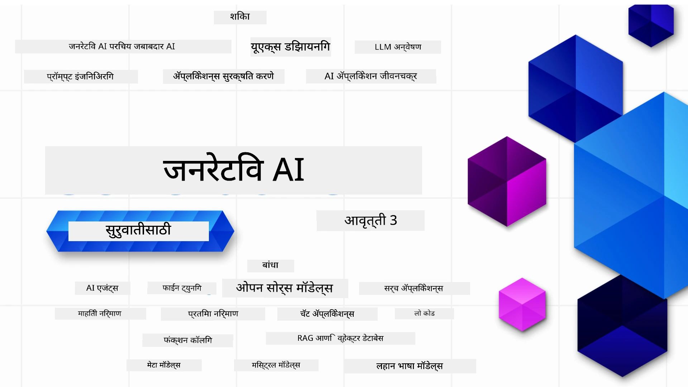

<!--
CO_OP_TRANSLATOR_METADATA:
{
  "original_hash": "054860715e642de31fa8e15c6d01f2b1",
  "translation_date": "2026-01-05T15:24:39+00:00",
  "source_file": "README.md",
  "language_code": "mr"
}
-->


### जनरेटिव AI अनुप्रयोग तयार करण्यासाठी तुम्हाला आवश्यक असलेले सर्वकाही शिकवणाऱ्या २१ धडे

[](https://github.com/microsoft/Generative-AI-For-Beginners/blob/master/LICENSE?WT.mc_id=academic-105485-koreyst)
[](https://GitHub.com/microsoft/Generative-AI-For-Beginners/graphs/contributors/?WT.mc_id=academic-105485-koreyst)
[](https://GitHub.com/microsoft/Generative-AI-For-Beginners/issues/?WT.mc_id=academic-105485-koreyst)
[](https://GitHub.com/microsoft/Generative-AI-For-Beginners/pulls/?WT.mc_id=academic-105485-koreyst)
[](http://makeapullrequest.com?WT.mc_id=academic-105485-koreyst)

[](https://GitHub.com/microsoft/Generative-AI-For-Beginners/watchers/?WT.mc_id=academic-105485-koreyst)
[](https://GitHub.com/microsoft/Generative-AI-For-Beginners/network/?WT.mc_id=academic-105485-koreyst)
[](https://GitHub.com/microsoft/Generative-AI-For-Beginners/stargazers/?WT.mc_id=academic-105485-koreyst)

[](https://discord.gg/nTYy5BXMWG)

### 🌐 बहुभाषिक समर्थन

#### GitHub Action द्वारे समर्थित (स्वयंचलित व सदैव अद्ययावत)

<!-- CO-OP TRANSLATOR LANGUAGES TABLE START -->
[Arabic](../ar/README.md) | [Bengali](../bn/README.md) | [Bulgarian](../bg/README.md) | [Burmese (Myanmar)](../my/README.md) | [Chinese (Simplified)](../zh/README.md) | [Chinese (Traditional, Hong Kong)](../hk/README.md) | [Chinese (Traditional, Macau)](../mo/README.md) | [Chinese (Traditional, Taiwan)](../tw/README.md) | [Croatian](../hr/README.md) | [Czech](../cs/README.md) | [Danish](../da/README.md) | [Dutch](../nl/README.md) | [Estonian](../et/README.md) | [Finnish](../fi/README.md) | [French](../fr/README.md) | [German](../de/README.md) | [Greek](../el/README.md) | [Hebrew](../he/README.md) | [Hindi](../hi/README.md) | [Hungarian](../hu/README.md) | [Indonesian](../id/README.md) | [Italian](../it/README.md) | [Japanese](../ja/README.md) | [Kannada](../kn/README.md) | [Korean](../ko/README.md) | [Lithuanian](../lt/README.md) | [Malay](../ms/README.md) | [Malayalam](../ml/README.md) | [Marathi](./README.md) | [Nepali](../ne/README.md) | [Nigerian Pidgin](../pcm/README.md) | [Norwegian](../no/README.md) | [Persian (Farsi)](../fa/README.md) | [Polish](../pl/README.md) | [Portuguese (Brazil)](../br/README.md) | [Portuguese (Portugal)](../pt/README.md) | [Punjabi (Gurmukhi)](../pa/README.md) | [Romanian](../ro/README.md) | [Russian](../ru/README.md) | [Serbian (Cyrillic)](../sr/README.md) | [Slovak](../sk/README.md) | [Slovenian](../sl/README.md) | [Spanish](../es/README.md) | [Swahili](../sw/README.md) | [Swedish](../sv/README.md) | [Tagalog (Filipino)](../tl/README.md) | [Tamil](../ta/README.md) | [Telugu](../te/README.md) | [Thai](../th/README.md) | [Turkish](../tr/README.md) | [Ukrainian](../uk/README.md) | [Urdu](../ur/README.md) | [Vietnamese](../vi/README.md)

> **स्थानिकरित्या क्लोन करायचे आहे का?**

> या रेपॉजिटरीमध्ये ५०+ भाषांमध्ये भाषांतर आहे ज्यामुळे डाउनलोड आकार महत्त्वपूर्णपणे वाढतो. भाषांतरांशिवाय क्लोन करण्यासाठी, sparse checkout वापरा:
> ```bash
> git clone --filter=blob:none --sparse https://github.com/microsoft/generative-ai-for-beginners.git
> cd generative-ai-for-beginners
> git sparse-checkout set --no-cone '/*' '!translations' '!translated_images'
> ```
> यामुळे कोर्स पूर्ण करण्यासाठी तुम्हाला आवश्यक असलेले सर्वकाही जास्त वेगवान डाउनलोडसह मिळेल.
<!-- CO-OP TRANSLATOR LANGUAGES TABLE END -->

# जनरेटिव AI फॉर बिगिनर्स (आवृत्ती ३) - एक कोर्स

Microsoft Cloud Advocates द्वारे २१ धड्यांच्या व्याप्तीमध्ये जनरेटिव AI अनुप्रयोग तयार करण्याच्या मूलभूत तत्त्वांचा अभ्यास करा.

## 🌱 सुरुवात करणे

या कोर्समध्ये २१ धडे आहेत. प्रत्येक धडा त्याच्या स्वतःच्या विषयावर आहे त्यामुळे तुम्हाला जिथून सुरु करायचे आहे तिथून सुरुवात करा!

शिकण्याच्या धड्यांना "Learn" असे लेबल दिलेले असते जेथे जनरेटिव AI संकल्पना समजावून सांगितली जाते, किंवा "Build" असे धडे जेथे संकल्पना आणि कोड उदाहरणे **Python** आणि **TypeScript** मध्ये शक्य असल्यास दिलेले असतात.

.NET विकासकांसाठी पाहा [Generative AI for Beginners (.NET Edition)](https://github.com/microsoft/Generative-AI-for-beginners-dotnet?WT.mc_id=academic-105485-koreyst)!

प्रत्येक धड्यासह "Keep Learning" भाग देखील आहे ज्यात अतिरिक्त शैक्षणिक साधने दिली आहेत.

## जे तुम्हाला आवश्यक आहे
### या कोर्सचा कोड चालवण्यासाठी, तुम्ही खालीलपैकी कोणतीही वापरू शकता: 
 - [Azure OpenAI Service](https://aka.ms/genai-beginners/azure-open-ai?WT.mc_id=academic-105485-koreyst) - **धडे:** "aoai-assignment"
 - [GitHub Marketplace Model Catalog](https://aka.ms/genai-beginners/gh-models?WT.mc_id=academic-105485-koreyst) - **धडे:** "githubmodels"
 - [OpenAI API](https://aka.ms/genai-beginners/open-ai?WT.mc_id=academic-105485-koreyst) - **धडे:** "oai-assignment" 
   
- Python किंवा TypeScript चा प्राथमिक ज्ञान उपयुक्त आहे - \*पूर्ण नवशिक्यासाठी या [Python](https://aka.ms/genai-beginners/python?WT.mc_id=academic-105485-koreyst) आणि [TypeScript](https://aka.ms/genai-beginners/typescript?WT.mc_id=academic-105485-koreyst) कोर्स तपासा
- GitHub खाते जेणेकरून तुम्ही हा संपूर्ण रेपॉजिटरी [fork](https://aka.ms/genai-beginners/github?WT.mc_id=academic-105485-koreyst) करू शकता

आम्ही **[कोर्स सेटअप](./00-course-setup/README.md?WT.mc_id=academic-105485-koreyst)** हा धडा तयार केला आहे ज्यामुळे तुमचे विकास पर्यावरण सेट करणे सोपे होईल.

नंतर सोप्या शोधासाठी [या रेपोला (🌟) स्टार देणे विसरू नका](https://docs.github.com/en/get-started/exploring-projects-on-github/saving-repositories-with-stars?WT.mc_id=academic-105485-koreyst).

## 🧠 तयार आहात का तैनात करण्यासाठी?

जर तुम्हाला अधिक प्रगत कोड नमुने हवे असतील, तर आमचा [जनरेटिव AI कोड नमुन्यांचा संग्रह](https://aka.ms/genai-beg-code?WT.mc_id=academic-105485-koreyst) पहा जो **Python** आणि **TypeScript** दोन्हीमध्ये उपलब्ध आहे.

## 🗣️ इतर शिकणाऱ्यांशी भेटा, मदत मिळवा

हा कोर्स घेणाऱ्या इतर शिकणाऱ्यांशी भेटण्यासाठी आणि मदत मिळवण्यासाठी आमच्या [अधिकृत Azure AI Foundry Discord सर्व्हर](https://aka.ms/genai-discord?WT.mc_id=academic-105485-koreyst) मध्ये सहभागी व्हा.

GitHub वरील [Azure AI Foundry Developer Forum](https://aka.ms/azureaifoundry/forum) मध्ये प्रश्न विचारा किंवा उत्पादन अभिप्राय शेअर करा.

## 🚀 स्टार्टअप तयार करत आहात?

आजच Azure क्रेडिट्ससह बांधणी कशी सुरू करायची ते जाणून घेण्यासाठी [Microsoft for Startups](https://www.microsoft.com/startups) येथे भेट द्या.

## 🙏 मदत करायची आहे का?

तुमच्याकडे सूचना आहेत किंवा शब्दलेखन किंवा कोड त्रुटी आढळल्या आहेत का? [इशू उघडा](https://github.com/microsoft/generative-ai-for-beginners/issues?WT.mc_id=academic-105485-koreyst) किंवा [पुल रिक्वेस्ट तयार करा](https://github.com/microsoft/generative-ai-for-beginners/pulls?WT.mc_id=academic-105485-koreyst)

## 📂 प्रत्येक धड्यात समाविष्ट आहे:

- विषयाचा संक्षिप्त व्हिडिओ परिचय
- README मध्ये लिहिलेला धडा
- Azure OpenAI आणि OpenAI API साठी Python व TypeScript कोड नमुने
- तुमचे शिक्षण सुरू ठेवण्यासाठी अतिरिक्त साधनांच्या दुव्यांसह

## 🗃️ धडे

| #   | **धडा लिंक**                                                                                                                                | **वर्णन**                                                                                    | **व्हिडिओ**                                                                 | **अतिरिक्त शिक्षण**                                                           |
| --- | ------------------------------------------------------------------------------------------------------------------------------------------- | --------------------------------------------------------------------------------------------- | --------------------------------------------------------------------------- | ------------------------------------------------------------------------------ |
| 00  | [कोर्स सेटअप](./00-course-setup/README.md?WT.mc_id=academic-105485-koreyst)                                                                  | **शिका:** तुमचे विकास पर्यावरण कसे सेट करायचे                                              | व्हिडिओ लवकर येईल                                                         | [अधिक शिका](https://aka.ms/genai-collection?WT.mc_id=academic-105485-koreyst)  |
| 01  | [जनरेटिव AI आणि LLMs ची ओळख](./01-introduction-to-genai/README.md?WT.mc_id=academic-105485-koreyst)                                         | **शिका:** जनरेटिव AI काय आहे आणि मोठे भाषिक मॉडेल (LLMs) कसे कार्य करतात ते समजून घेणे        | [व्हिडिओ](https://aka.ms/gen-ai-lesson-1-gh?WT.mc_id=academic-105485-koreyst)| [अधिक शिका](https://aka.ms/genai-collection?WT.mc_id=academic-105485-koreyst)  |
| 02  | [वेगवेगळ्या LLMs ची तपासणी व तुलना](./02-exploring-and-comparing-different-llms/README.md?WT.mc_id=academic-105485-koreyst)                   | **शिका:** तुमच्या वापरासाठी योग्य मॉडेल कसे निवडायचे                                        | [व्हिडिओ](https://aka.ms/gen-ai-lesson2-gh?WT.mc_id=academic-105485-koreyst) | [अधिक शिका](https://aka.ms/genai-collection?WT.mc_id=academic-105485-koreyst)  |
| 03  | [उत्तरदायित्वाने जनरेटिव AI वापरणे](./03-using-generative-ai-responsibly/README.md?WT.mc_id=academic-105485-koreyst)                          | **शिका:** जनरेटिव AI अनुप्रयोग जबाबदारीने कसे तयार करायचे                                  | [व्हिडिओ](https://aka.ms/gen-ai-lesson3-gh?WT.mc_id=academic-105485-koreyst) | [अधिक शिका](https://aka.ms/genai-collection?WT.mc_id=academic-105485-koreyst)  |
| 04  | [प्रॉम्प्ट इंजिनिअरिंग मूलभूत समज](./04-prompt-engineering-fundamentals/README.md?WT.mc_id=academic-105485-koreyst)                           | **शिका:** प्रॉम्प्ट इंजिनिअरिंग सर्वोत्तम पद्धती प्रत्यक्षात                                    | [व्हिडिओ](https://aka.ms/gen-ai-lesson4-gh?WT.mc_id=academic-105485-koreyst) | [अधिक शिका](https://aka.ms/genai-collection?WT.mc_id=academic-105485-koreyst)  |
| 05  | [अ‍ॅडव्हान्स प्रॉम्प्ट तयार करणे](./05-advanced-prompts/README.md?WT.mc_id=academic-105485-koreyst)                                                | **शिका:** तुमच्या प्रॉम्प्टचा निकाल सुधारण्यासाठी प्रॉम्प्ट अभियांत्रिकी तंत्र कसे लागू करायचे. | [व्हिडिओ](https://aka.ms/gen-ai-lesson5-gh?WT.mc_id=academic-105485-koreyst)  | [अधिक शिका](https://aka.ms/genai-collection?WT.mc_id=academic-105485-koreyst) |
| 06  | [टेक्स्ट जनरेशन अॅप्लिकेशन्स तयार करणे](./06-text-generation-apps/README.md?WT.mc_id=academic-105485-koreyst)                                | **तयार करा:** Azure OpenAI / OpenAI API वापरून टेक्स्ट जनरेशन अॅप                                | [व्हिडिओ](https://aka.ms/gen-ai-lesson6-gh?WT.mc_id=academic-105485-koreyst)  | [अधिक शिका](https://aka.ms/genai-collection?WT.mc_id=academic-105485-koreyst) |
| 07  | [चॅट अॅप्लिकेशन्स तयार करणे](./07-building-chat-applications/README.md?WT.mc_id=academic-105485-koreyst)                                     | **तयार करा:** चॅट अॅप्लिकेशन्स कार्यक्षमपणे तयार आणि एकत्रित करण्यासाठी तंत्र               | [व्हिडिओ](https://aka.ms/gen-ai-lessons7-gh?WT.mc_id=academic-105485-koreyst) | [अधिक शिका](https://aka.ms/genai-collection?WT.mc_id=academic-105485-koreyst) |
| 08  | [सर्च अॅप्स व्हेक्टर डेटाबेस तयार करणे](./08-building-search-applications/README.md?WT.mc_id=academic-105485-koreyst)                        | **तयार करा:** डेटा शोधण्यासाठी एम्बेडिंग वापरणारी सर्च अॅप्लिकेशन                        | [व्हिडिओ](https://aka.ms/gen-ai-lesson8-gh?WT.mc_id=academic-105485-koreyst)  | [अधिक शिका](https://aka.ms/genai-collection?WT.mc_id=academic-105485-koreyst) |
| 09  | [प्रतिमा जनरेशन अॅप्लिकेशन्स तयार करणे](./09-building-image-applications/README.md?WT.mc_id=academic-105485-koreyst)                        | **तयार करा:** प्रतिमा जनरेशन अॅप्लिकेशन                                                       | [व्हिडिओ](https://aka.ms/gen-ai-lesson9-gh?WT.mc_id=academic-105485-koreyst)  | [अधिक शिका](https://aka.ms/genai-collection?WT.mc_id=academic-105485-koreyst) |
| 10  | [लो कोड AI अॅप्लिकेशन्स तयार करणे](./10-building-low-code-ai-applications/README.md?WT.mc_id=academic-105485-koreyst)                       | **तयार करा:** लो कोड टूल्स वापरून जनरेटिव्ह AI अॅप्लिकेशन                                     | [व्हिडिओ](https://aka.ms/gen-ai-lesson10-gh?WT.mc_id=academic-105485-koreyst) | [अधिक शिका](https://aka.ms/genai-collection?WT.mc_id=academic-105485-koreyst) |
| 11  | [फंक्शन कॉलिंगसह बाह्य अॅप्लिकेशन्स समाकलित करणे](./11-integrating-with-function-calling/README.md?WT.mc_id=academic-105485-koreyst) | **तयार करा:** फंक्शन कॉलिंग म्हणजे काय आणि अॅप्लिकेशन्ससाठी त्याचा वापर                         | [व्हिडिओ](https://aka.ms/gen-ai-lesson11-gh?WT.mc_id=academic-105485-koreyst) | [अधिक शिका](https://aka.ms/genai-collection?WT.mc_id=academic-105485-koreyst) |
| 12  | [AI अॅप्लिकेशन्ससाठी UX डिझाइन करणे](./12-designing-ux-for-ai-applications/README.md?WT.mc_id=academic-105485-koreyst)                         | **शिका:** जनरेटिव्ह AI अॅप्लिकेशन्स विकसित करताना UX डिझाइन तत्त्वे कशी लागू करायची         | [व्हिडिओ](https://aka.ms/gen-ai-lesson12-gh?WT.mc_id=academic-105485-koreyst) | [अधिक शिका](https://aka.ms/genai-collection?WT.mc_id=academic-105485-koreyst) |
| 13  | [तुमच्या जनरेटिव्ह AI अॅप्लिकेशन्ससाठी सुरक्षितता](./13-securing-ai-applications/README.md?WT.mc_id=academic-105485-koreyst)                         | **शिका:** AI प्रणालींवर धोके आणि जोखमी आणि त्या प्रणाली सुरक्षित करणे याचे मार्ग             | [व्हिडिओ](https://aka.ms/gen-ai-lesson13-gh?WT.mc_id=academic-105485-koreyst) | [अधिक शिका](https://aka.ms/genai-collection?WT.mc_id=academic-105485-koreyst) |
| 14  | [जनरेटिव्ह AI अॅप्लिकेशनचा जीवनचक्र](./14-the-generative-ai-application-lifecycle/README.md?WT.mc_id=academic-105485-koreyst)           | **शिका:** LLM जीवनचक्र आणि LLMOps व्यवस्थापित करण्यासाठी साधने आणि मेट्रिक्स                         | [व्हिडिओ](https://aka.ms/gen-ai-lesson14-gh?WT.mc_id=academic-105485-koreyst) | [अधिक शिका](https://aka.ms/genai-collection?WT.mc_id=academic-105485-koreyst) |
| 15  | [Retrieval Augmented Generation (RAG) आणि व्हेक्टर डेटाबेस](./15-rag-and-vector-databases/README.md?WT.mc_id=academic-105485-koreyst)        | **तयार करा:** RAG फ्रेमवर्क वापरून व्हेक्टर डेटाबेसमधून एम्बेडिंग पुनर्प्राप्त करण्यासाठी अॅप्लिकेशन  | [व्हिडिओ](https://aka.ms/gen-ai-lesson15-gh?WT.mc_id=academic-105485-koreyst) | [अधिक शिका](https://aka.ms/genai-collection?WT.mc_id=academic-105485-koreyst) |
| 16  | [ओपन सोर्स मॉडेल आणि हगिंग फेस](./16-open-source-models/README.md?WT.mc_id=academic-105485-koreyst)                                    | **तयार करा:** हगिंग फेसवर उपलब्ध असलेल्या ओपन सोर्स मॉडेल्स वापरून अॅप्लिकेशन                    | [व्हिडिओ](https://aka.ms/gen-ai-lesson16-gh?WT.mc_id=academic-105485-koreyst) | [अधिक शिका](https://aka.ms/genai-collection?WT.mc_id=academic-105485-koreyst) |
| 17  | [AI एजंट्स](./17-ai-agents/README.md?WT.mc_id=academic-105485-koreyst)                                                                       | **तयार करा:** AI एजंट फ्रेमवर्क वापरून अॅप्लिकेशन                                           | [व्हिडिओ](https://aka.ms/gen-ai-lesson17-gh?WT.mc_id=academic-105485-koreyst) | [अधिक शिका](https://aka.ms/genai-collection?WT.mc_id=academic-105485-koreyst) |
| 18  | [LLM फाइन-ट्यूनिंग](./18-fine-tuning/README.md?WT.mc_id=academic-105485-koreyst)                                                              | **शिका:** LLM फाइन-ट्यूनिंग काय आहे, का आणि कसे करायचे                                            | [व्हिडिओ](https://aka.ms/gen-ai-lesson18-gh?WT.mc_id=academic-105485-koreyst) | [अधिक शिका](https://aka.ms/genai-collection?WT.mc_id=academic-105485-koreyst) |
| 19  | [SLM वापरून तयार करणे](./19-slm/README.md?WT.mc_id=academic-105485-koreyst)                                                              | **शिका:** लहान भाषा मॉडेल्स वापरून तयार करण्याचे फायदे                                            | लवकरच व्हिडिओ येणार | [अधिक शिका](https://aka.ms/genai-collection?WT.mc_id=academic-105485-koreyst) |
| 20  | [मिस्ट्रल मॉडेल्स वापरून तयार करणे](./20-mistral/README.md?WT.mc_id=academic-105485-koreyst)                                                              | **शिका:** मिस्ट्रल कुटुंब मॉडेल्सच्या वैशिष्ट्ये आणि फरक                                           | लवकरच व्हिडिओ येणार | [अधिक शिका](https://aka.ms/genai-collection?WT.mc_id=academic-105485-koreyst) |
| 21  | [मेटा मॉडेल्स वापरून तयार करणे](./21-meta/README.md?WT.mc_id=academic-105485-koreyst)                                                              | **शिका:** मेटा कुटुंब मॉडेल्सच्या वैशिष्ट्ये आणि फरक                                           | लवकरच व्हिडिओ येणार | [अधिक शिका](https://aka.ms/genai-collection?WT.mc_id=academic-105485-koreyst) |

### 🌟 विशेष आभार

सर्व GitHub अॅक्शन्स आणि वर्कफ्लोज तयार केल्याबद्दल [**John Aziz**](https://www.linkedin.com/in/john0isaac/) यांचे विशेष आभार

प्रत्येक धड्यासाठी शिकणाऱ्याच्या आणि कोड अनुभवासाठी महत्त्वपूर्ण योगदान दिल्याबद्दल [**Bernhard Merkle**](https://www.linkedin.com/in/bernhard-merkle-738b73/) यांचे आभार.

## 🎒 इतर कोर्सेस

आमचा संघ इतर कोर्सेस तयार करतो! तपासा:

<!-- CO-OP TRANSLATOR OTHER COURSES START -->
### LangChain
[](https://aka.ms/langchain4j-for-beginners)
[](https://aka.ms/langchainjs-for-beginners?WT.mc_id=m365-94501-dwahlin)

---

### Azure / Edge / MCP / Agents
[](https://github.com/microsoft/AZD-for-beginners?WT.mc_id=academic-105485-koreyst)
[](https://github.com/microsoft/edgeai-for-beginners?WT.mc_id=academic-105485-koreyst)
[](https://github.com/microsoft/mcp-for-beginners?WT.mc_id=academic-105485-koreyst)
[](https://github.com/microsoft/ai-agents-for-beginners?WT.mc_id=academic-105485-koreyst)

---
 
### जनरेटिव्ह AI सिरीज
[](https://github.com/microsoft/generative-ai-for-beginners?WT.mc_id=academic-105485-koreyst)
[-9333EA?style=for-the-badge&labelColor=E5E7EB&color=9333EA)](https://github.com/microsoft/Generative-AI-for-beginners-dotnet?WT.mc_id=academic-105485-koreyst)
[-C084FC?style=for-the-badge&labelColor=E5E7EB&color=C084FC)](https://github.com/microsoft/generative-ai-for-beginners-java?WT.mc_id=academic-105485-koreyst)
[-E879F9?style=for-the-badge&labelColor=E5E7EB&color=E879F9)](https://github.com/microsoft/generative-ai-with-javascript?WT.mc_id=academic-105485-koreyst)

---
 
### कोअर लर्निंग
[](https://aka.ms/ml-beginners?WT.mc_id=academic-105485-koreyst)
[](https://aka.ms/datascience-beginners?WT.mc_id=academic-105485-koreyst)
[](https://aka.ms/ai-beginners?WT.mc_id=academic-105485-koreyst)
[](https://github.com/microsoft/Security-101?WT.mc_id=academic-96948-sayoung)
[](https://aka.ms/webdev-beginners?WT.mc_id=academic-105485-koreyst)
[](https://aka.ms/iot-beginners?WT.mc_id=academic-105485-koreyst)
[](https://github.com/microsoft/xr-development-for-beginners?WT.mc_id=academic-105485-koreyst)

---
 
### कॉपायलट सिरीज
[](https://aka.ms/GitHubCopilotAI?WT.mc_id=academic-105485-koreyst)
[](https://github.com/microsoft/mastering-github-copilot-for-dotnet-csharp-developers?WT.mc_id=academic-105485-koreyst)
[](https://github.com/microsoft/CopilotAdventures?WT.mc_id=academic-105485-koreyst)
<!-- CO-OP TRANSLATOR OTHER COURSES END -->

## मदत घेणे

जर तुम्हाला अडचण येत असेल किंवा AI ऍप तयार करण्याबद्दल काही प्रश्न असतील तर. MCP विषयी चर्चा करण्यासाठी सहकारी शिकणारे व अनुभवी डेव्हलपर्स यांच्याशी सामील व्हा. हा एक मदतनीस समुदाय आहे जिथे प्रश्न विचारायला हरकत नाही आणि ज्ञान मुक्तपणे वाटले जाते.

[](https://discord.gg/nTYy5BXMWG)

जर तुमच्याकडे उत्पादनाबद्दल अभिप्राय किंवा चुका असतील तर भेट द्या:

[](https://aka.ms/foundry/forum)

---

<!-- CO-OP TRANSLATOR DISCLAIMER START -->
**मुक्तस्फूर्त सूचना**:
हा दस्तऐवज AI भाषांतर सेवा [Co-op Translator](https://github.com/Azure/co-op-translator) वापरून अनुवादित केला आहे. आम्ही अचूकतेसाठी प्रयत्नशील असलो तरी, कृपया लक्षात घ्या की स्वयंचलित भाषांतरांमध्ये चुका किंवा अचूकतेच्या त्रुटी असू शकतात. मूळ दस्तऐवज त्याच्या स्थानिक भाषेत अधिकृत स्रोत समजला जावा. महत्त्वाच्या माहितीसाठी व्यावसायिक मानवी अनुवादाचा सल्ला दिला जातो. या भाषांतराचा वापर करून होणाऱ्या कोणत्याही गैरसमज किंवा चुकीच्या अर्थवाढीबद्दल आम्ही जबाबदार नाही.
<!-- CO-OP TRANSLATOR DISCLAIMER END -->