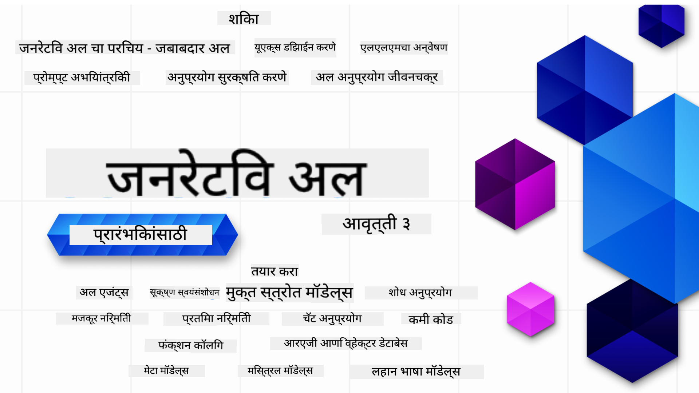

<!--
CO_OP_TRANSLATOR_METADATA:
{
  "original_hash": "f7e9011b478e180177185b73939b774c",
  "translation_date": "2025-10-17T13:36:56+00:00",
  "source_file": "README.md",
  "language_code": "mr"
}
-->

### 21 धडे जे तुम्हाला जेनरेटिव AI अ‍ॅप्लिकेशन्स तयार करण्यासाठी आवश्यक असलेले सर्वकाही शिकवतात

### 🌐 बहुभाषिक समर्थन

#### GitHub Action द्वारे समर्थित (स्वयंचलित आणि नेहमी अद्ययावत)

<!-- CO-OP TRANSLATOR LANGUAGES TABLE START -->
[अरबी](../ar/README.md) | [बंगाली](../bn/README.md) | [बल्गेरियन](../bg/README.md) | [बर्मी (म्यानमार)](../my/README.md) | [चिनी (सरलीकृत)](../zh/README.md) | [चिनी (पारंपरिक, हाँगकाँग)](../hk/README.md) | [चिनी (पारंपरिक, मकाऊ)](../mo/README.md) | [चिनी (पारंपरिक, तैवान)](../tw/README.md) | [क्रोएशियन](../hr/README.md) | [चेक](../cs/README.md) | [डॅनिश](../da/README.md) | [डच](../nl/README.md) | [एस्टोनियन](../et/README.md) | [फिनिश](../fi/README.md) | [फ्रेंच](../fr/README.md) | [जर्मन](../de/README.md) | [ग्रीक](../el/README.md) | [हिब्रू](../he/README.md) | [हिंदी](../hi/README.md) | [हंगेरियन](../hu/README.md) | [इंडोनेशियन](../id/README.md) | [इटालियन](../it/README.md) | [जपानी](../ja/README.md) | [कोरियन](../ko/README.md) | [लिथुआनियन](../lt/README.md) | [मलय](../ms/README.md) | [मराठी](./README.md) | [नेपाळी](../ne/README.md) | [नॉर्वेजियन](../no/README.md) | [पर्शियन (फारसी)](../fa/README.md) | [पोलिश](../pl/README.md) | [पोर्तुगीज (ब्राझील)](../br/README.md) | [पोर्तुगीज (पोर्तुगाल)](../pt/README.md) | [पंजाबी (गुरमुखी)](../pa/README.md) | [रोमानियन](../ro/README.md) | [रशियन](../ru/README.md) | [सर्बियन (सिरिलिक)](../sr/README.md) | [स्लोव्हाक](../sk/README.md) | [स्लोव्हेनियन](../sl/README.md) | [स्पॅनिश](../es/README.md) | [स्वाहिली](../sw/README.md) | [स्वीडिश](../sv/README.md) | [टागालोग (फिलिपिनो)](../tl/README.md) | [तमिळ](../ta/README.md) | [थाई](../th/README.md) | [तुर्की](../tr/README.md) | [युक्रेनियन](../uk/README.md) | [उर्दू](../ur/README.md) | [व्हिएतनामी](../vi/README.md)
<!-- CO-OP TRANSLATOR LANGUAGES TABLE END -->

# जेनरेटिव AI सुरुवातीसाठी (आवृत्ती 3) - एक कोर्स

Microsoft Cloud Advocates द्वारे तयार केलेल्या 21 धड्यांच्या व्यापक कोर्ससह जेनरेटिव AI अ‍ॅप्लिकेशन्स तयार करण्याचे मूलभूत ज्ञान मिळवा.

## 🌱 सुरुवात कशी करावी

या कोर्समध्ये 21 धडे आहेत. प्रत्येक धडा स्वतःचा विषय कव्हर करतो, त्यामुळे तुम्ही कुठूनही सुरुवात करू शकता!

धड्यांना "Learn" किंवा "Build" असे लेबल दिले आहे. "Learn" धडे जेनरेटिव AI संकल्पना स्पष्ट करतात, तर "Build" धडे संकल्पना आणि **Python** आणि **TypeScript** मधील कोड उदाहरणे समजावून सांगतात.

.NET डेव्हलपर्ससाठी [जेनरेटिव AI सुरुवातीसाठी (.NET Edition)](https://github.com/microsoft/Generative-AI-for-beginners-dotnet?WT.mc_id=academic-105485-koreyst) पहा!

प्रत्येक धड्यात "Keep Learning" विभाग आहे ज्यामध्ये अतिरिक्त शिक्षण साधने आहेत.

## तुम्हाला काय आवश्यक आहे
### या कोर्सचा कोड चालवण्यासाठी तुम्ही खालीलपैकी कोणतेही वापरू शकता: 
 - [Azure OpenAI Service](https://aka.ms/genai-beginners/azure-open-ai?WT.mc_id=academic-105485-koreyst) - **धडे:** "aoai-assignment"
 - [GitHub Marketplace Model Catalog](https://aka.ms/genai-beginners/gh-models?WT.mc_id=academic-105485-koreyst) - **धडे:** "githubmodels"
 - [OpenAI API](https://aka.ms/genai-beginners/open-ai?WT.mc_id=academic-105485-koreyst) - **धडे:** "oai-assignment" 
   
- Python किंवा TypeScript चे मूलभूत ज्ञान उपयुक्त आहे - \*पूर्ण सुरुवातीसाठी [Python](https://aka.ms/genai-beginners/python?WT.mc_id=academic-105485-koreyst) आणि [TypeScript](https://aka.ms/genai-beginners/typescript?WT.mc_id=academic-105485-koreyst) कोर्स पहा
- तुमच्या स्वतःच्या GitHub खात्यावर [हे संपूर्ण रेपो फोर्क करण्यासाठी](https://aka.ms/genai-beginners/github?WT.mc_id=academic-105485-koreyst) GitHub खाते आवश्यक आहे

तुमच्या डेव्हलपमेंट एन्व्हायर्नमेंट सेटअपसाठी मदत करण्यासाठी आम्ही **[कोर्स सेटअप](./00-course-setup/README.md?WT.mc_id=academic-105485-koreyst)** धडा तयार केला आहे.

या रेपोला [स्टार (🌟)](https://docs.github.com/en/get-started/exploring-projects-on-github/saving-repositories-with-stars?WT.mc_id=academic-105485-koreyst) देण्यास विसरू नका जेणेकरून नंतर ते शोधणे सोपे होईल.

## 🧠 तयार आहात का तैनात करण्यासाठी?

जर तुम्ही अधिक प्रगत कोड नमुन्यांचा शोध घेत असाल, तर आमचे [जेनरेटिव AI कोड नमुन्यांचे संग्रह](https://aka.ms/genai-beg-code?WT.mc_id=academic-105485-koreyst) पहा, जे **Python** आणि **TypeScript** मध्ये उपलब्ध आहेत.

## 🗣️ इतर शिकणाऱ्यांना भेटा, मदत मिळवा

आमच्या [अधिकृत Azure AI Foundry Discord सर्व्हर](https://aka.ms/genai-discord?WT.mc_id=academic-105485-koreyst) मध्ये सामील व्हा, इतर शिकणाऱ्यांशी संवाद साधा आणि या कोर्ससाठी मदत मिळवा.

आमच्या GitHub वरील [Azure AI Foundry Developer Forum](https://aka.ms/azureaifoundry/forum) मध्ये प्रश्न विचारा किंवा उत्पादनाबद्दल फीडबॅक शेअर करा.

## 🚀 स्टार्टअप तयार करत आहात का?

आजच Azure क्रेडिट्ससह स्टार्टअप तयार करण्यासाठी [Microsoft for Startups](https://www.microsoft.com/startups) ला भेट द्या.

## 🙏 मदत करू इच्छिता?

तुमच्याकडे काही सूचना आहेत का किंवा तुम्हाला स्पेलिंग किंवा कोडमध्ये काही चुका सापडल्या आहेत का? [एक समस्या उभी करा](https://github.com/microsoft/generative-ai-for-beginners/issues?WT.mc_id=academic-105485-koreyst) किंवा [पुल रिक्वेस्ट तयार करा](https://github.com/microsoft/generative-ai-for-beginners/pulls?WT.mc_id=academic-105485-koreyst)

## 📂 प्रत्येक धड्यात समाविष्ट आहे:

- विषयाची एक छोटी व्हिडिओ ओळख
- README मध्ये असलेला लेखी धडा
- Azure OpenAI आणि OpenAI API ला समर्थन देणारे Python आणि TypeScript कोड नमुने
- तुमचे शिक्षण सुरू ठेवण्यासाठी अतिरिक्त संसाधनांचे दुवे

## 🗃️ धडे

| #   | **धड्याचा दुवा**                                                                                                                              | **वर्णन**                                                                                 | **व्हिडिओ**                                                                   | **अतिरिक्त शिक्षण**                                                             |
| --- | -------------------------------------------------------------------------------------------------------------------------------------------- | ----------------------------------------------------------------------------------------------- | --------------------------------------------------------------------------- | ------------------------------------------------------------------------------ |
| 00  | [कोर्स सेटअप](./00-course-setup/README.md?WT.mc_id=academic-105485-koreyst)                                                                 | **शिका:** तुमचे डेव्हलपमेंट एन्व्हायर्नमेंट कसे सेटअप करावे                                            | व्हिडिओ लवकरच येत आहे                                                                 | [अधिक जाणून घ्या](https://aka.ms/genai-collection?WT.mc_id=academic-105485-koreyst) |
| 01  | [जेनरेटिव AI आणि LLMs ची ओळख](./01-introduction-to-genai/README.md?WT.mc_id=academic-105485-koreyst)                              | **शिका:** जेनरेटिव AI म्हणजे काय आणि मोठे भाषा मॉडेल्स (LLMs) कसे कार्य करतात.       | [व्हिडिओ](https://aka.ms/gen-ai-lesson-1-gh?WT.mc_id=academic-105485-koreyst) | [अधिक जाणून घ्या](https://aka.ms/genai-collection?WT.mc_id=academic-105485-koreyst) |
| 02  | [विविध LLMs शोधणे आणि तुलना करणे](./02-exploring-and-comparing-different-llms/README.md?WT.mc_id=academic-105485-koreyst)             | **शिका:** तुमच्या उपयोगासाठी योग्य मॉडेल कसे निवडावे                                      | [व्हिडिओ](https://aka.ms/gen-ai-lesson2-gh?WT.mc_id=academic-105485-koreyst)  | [अधिक जाणून घ्या](https://aka.ms/genai-collection?WT.mc_id=academic-105485-koreyst) |
| 03  | [जेनरेटिव AI जबाबदारीने वापरणे](./03-using-generative-ai-responsibly/README.md?WT.mc_id=academic-105485-koreyst)                           | **शिका:** जेनरेटिव AI अ‍ॅप्लिकेशन्स जबाबदारीने कसे तयार करावे                                  | [व्हिडिओ](https://aka.ms/gen-ai-lesson3-gh?WT.mc_id=academic-105485-koreyst)  | [अधिक जाणून घ्या](https://aka.ms/genai-collection?WT.mc_id=academic-105485-koreyst) |
| 04  | [प्रॉम्प्ट इंजिनिअरिंग मूलभूत गोष्टी समजून घेणे](./04-prompt-engineering-fundamentals/README.md?WT.mc_id=academic-105485-koreyst)             | **शिका:** प्रॉम्प्ट इंजिनिअरिंगसाठी सर्वोत्तम पद्धतींचा प्रत्यक्ष अनुभव                                           | [व्हिडिओ](https://aka.ms/gen-ai-lesson4-gh?WT.mc_id=academic-105485-koreyst)  | [अधिक जाणून घ्या](https://aka.ms/genai-collection?WT.mc_id=academic-105485-koreyst) |
| 05  | [प्रगत प्रॉम्प्ट तयार करणे](./05-advanced-prompts/README.md?WT.mc_id=academic-105485-koreyst)                                                | **शिका:** तुमच्या प्रॉम्प्ट्सच्या परिणाम सुधारण्यासाठी प्रॉम्प्ट इंजिनिअरिंग तंत्र कसे लागू करावे. | [व्हिडिओ](https://aka.ms/gen-ai-lesson5-gh?WT.mc_id=academic-105485-koreyst)  | [अधिक जाणून घ्या](https://aka.ms/genai-collection?WT.mc_id=academic-105485-koreyst) |
| 06  | [टेक्स्ट जनरेशन अ‍ॅप्लिकेशन्स तयार करणे](./06-text-generation-apps/README.md?WT.mc_id=academic-105485-koreyst)                                | **तयार करा:** Azure OpenAI / OpenAI API वापरून टेक्स्ट जनरेशन अ‍ॅप                                | [व्हिडिओ](https://aka.ms/gen-ai-lesson6-gh?WT.mc_id=academic-105485-koreyst)  | [अधिक जाणून घ्या](https://aka.ms/genai-collection?WT.mc_id=academic-105485-koreyst) |
| 07  | [चॅट अ‍ॅप्लिकेशन्स तयार करणे](./07-building-chat-applications/README.md?WT.mc_id=academic-105485-koreyst)                                     | **तयार करा:** चॅट अ‍ॅप्लिकेशन्स कार्यक्षमतेने तयार करण्यासाठी तंत्रज्ञान.               | [व्हिडिओ](https://aka.ms/gen-ai-lessons7-gh?WT.mc_id=academic-105485-koreyst) | [अधिक जाणून घ्या](https://aka.ms/genai-collection?WT.mc_id=academic-105485-koreyst) |
| 08  | [सर्च अ‍ॅप्स व्हेक्टर डेटाबेस तयार करणे](./08-building-search-applications/README.md?WT.mc_id=academic-105485-koreyst)                        | **तयार करा:** डेटा शोधण्यासाठी एम्बेडिंग्स वापरणारे सर्च अ‍ॅप्लिकेशन                        | [व्हिडिओ](https://aka.ms/gen-ai-lesson8-gh?WT.mc_id=academic-105485-koreyst)  | [अधिक जाणून घ्या](https://aka.ms/genai-collection?WT.mc_id=academic-105485-koreyst) |
| 09  | [इमेज जनरेशन अ‍ॅप्लिकेशन्स तयार करणे](./09-building-image-applications/README.md?WT.mc_id=academic-105485-koreyst)                        | **तयार करा:** इमेज जनरेशन अ‍ॅप्लिकेशन                                                       | [व्हिडिओ](https://aka.ms/gen-ai-lesson9-gh?WT.mc_id=academic-105485-koreyst)  | [अधिक जाणून घ्या](https://aka.ms/genai-collection?WT.mc_id=academic-105485-koreyst) |
| 10  | [लो कोड AI अ‍ॅप्लिकेशन्स तयार करणे](./10-building-low-code-ai-applications/README.md?WT.mc_id=academic-105485-koreyst)                       | **तयार करा:** लो कोड टूल्स वापरून जनरेटिव AI अ‍ॅप्लिकेशन                                     | [व्हिडिओ](https://aka.ms/gen-ai-lesson10-gh?WT.mc_id=academic-105485-koreyst) | [अधिक जाणून घ्या](https://aka.ms/genai-collection?WT.mc_id=academic-105485-koreyst) |
| 11  | [फंक्शन कॉलिंगसह बाह्य अ‍ॅप्लिकेशन्स एकत्रित करणे](./11-integrating-with-function-calling/README.md?WT.mc_id=academic-105485-koreyst) | **तयार करा:** फंक्शन कॉलिंग म्हणजे काय आणि अ‍ॅप्लिकेशन्ससाठी त्याचे उपयोग                          | [व्हिडिओ](https://aka.ms/gen-ai-lesson11-gh?WT.mc_id=academic-105485-koreyst) | [अधिक जाणून घ्या](https://aka.ms/genai-collection?WT.mc_id=academic-105485-koreyst) |
| 12  | [AI अ‍ॅप्लिकेशन्ससाठी UX डिझाइन करणे](./12-designing-ux-for-ai-applications/README.md?WT.mc_id=academic-105485-koreyst)                         | **शिका:** जनरेटिव AI अ‍ॅप्लिकेशन्स विकसित करताना UX डिझाइन तत्त्वे कशी लागू करायची         | [व्हिडिओ](https://aka.ms/gen-ai-lesson12-gh?WT.mc_id=academic-105485-koreyst) | [अधिक जाणून घ्या](https://aka.ms/genai-collection?WT.mc_id=academic-105485-koreyst) |
| 13  | [आपले जनरेटिव AI अ‍ॅप्लिकेशन्स सुरक्षित करणे](./13-securing-ai-applications/README.md?WT.mc_id=academic-105485-koreyst)                         | **शिका:** AI प्रणालींवरील धोके आणि जोखीम आणि या प्रणाली सुरक्षित करण्याचे पद्धती.             | [व्हिडिओ](https://aka.ms/gen-ai-lesson13-gh?WT.mc_id=academic-105485-koreyst) | [अधिक जाणून घ्या](https://aka.ms/genai-collection?WT.mc_id=academic-105485-koreyst) |
| 14  | [जनरेटिव AI अ‍ॅप्लिकेशन जीवनचक्र](./14-the-generative-ai-application-lifecycle/README.md?WT.mc_id=academic-105485-koreyst)           | **शिका:** LLM जीवनचक्र आणि LLMOps व्यवस्थापित करण्यासाठी साधने आणि मेट्रिक्स                         | [व्हिडिओ](https://aka.ms/gen-ai-lesson14-gh?WT.mc_id=academic-105485-koreyst) | [अधिक जाणून घ्या](https://aka.ms/genai-collection?WT.mc_id=academic-105485-koreyst) |
| 15  | [रिट्रीव्हल ऑगमेंटेड जनरेशन (RAG) आणि व्हेक्टर डेटाबेस](./15-rag-and-vector-databases/README.md?WT.mc_id=academic-105485-koreyst)        | **तयार करा:** व्हेक्टर डेटाबेसमधून एम्बेडिंग्स मिळवण्यासाठी RAG फ्रेमवर्क वापरणारे अ‍ॅप्लिकेशन  | [व्हिडिओ](https://aka.ms/gen-ai-lesson15-gh?WT.mc_id=academic-105485-koreyst) | [अधिक जाणून घ्या](https://aka.ms/genai-collection?WT.mc_id=academic-105485-koreyst) |
| 16  | [ओपन सोर्स मॉडेल्स आणि हगिंग फेस](./16-open-source-models/README.md?WT.mc_id=academic-105485-koreyst)                                    | **तयार करा:** हगिंग फेसवर उपलब्ध ओपन सोर्स मॉडेल्स वापरणारे अ‍ॅप्लिकेशन                    | [व्हिडिओ](https://aka.ms/gen-ai-lesson16-gh?WT.mc_id=academic-105485-koreyst) | [अधिक जाणून घ्या](https://aka.ms/genai-collection?WT.mc_id=academic-105485-koreyst) |
| 17  | [AI एजंट्स](./17-ai-agents/README.md?WT.mc_id=academic-105485-koreyst)                                                                       | **तयार करा:** AI एजंट फ्रेमवर्क वापरणारे अ‍ॅप्लिकेशन                                           | [व्हिडिओ](https://aka.ms/gen-ai-lesson17-gh?WT.mc_id=academic-105485-koreyst) | [अधिक जाणून घ्या](https://aka.ms/genai-collection?WT.mc_id=academic-105485-koreyst) |
| 18  | [LLMs फाइन-ट्यून करणे](./18-fine-tuning/README.md?WT.mc_id=academic-105485-koreyst)                                                              | **शिका:** LLMs फाइन-ट्यूनिंगचे काय, का आणि कसे                                            | [व्हिडिओ](https://aka.ms/gen-ai-lesson18-gh?WT.mc_id=academic-105485-koreyst) | [अधिक जाणून घ्या](https://aka.ms/genai-collection?WT.mc_id=academic-105485-koreyst) |
| 19  | [SLMs सह तयार करणे](./19-slm/README.md?WT.mc_id=academic-105485-koreyst)                                                              | **शिका:** स्मॉल लँग्वेज मॉडेल्ससह तयार करण्याचे फायदे                                            | व्हिडिओ लवकरच येत आहे | [अधिक जाणून घ्या](https://aka.ms/genai-collection?WT.mc_id=academic-105485-koreyst) |
| 20  | [मिस्ट्रल मॉडेल्ससह तयार करणे](./20-mistral/README.md?WT.mc_id=academic-105485-koreyst)                                                              | **शिका:** मिस्ट्रल फॅमिली मॉडेल्सची वैशिष्ट्ये आणि फरक                                           | व्हिडिओ लवकरच येत आहे | [अधिक जाणून घ्या](https://aka.ms/genai-collection?WT.mc_id=academic-105485-koreyst) |
| 21  | [मेटा मॉडेल्ससह तयार करणे](./21-meta/README.md?WT.mc_id=academic-105485-koreyst)                                                              | **शिका:** मेटा फॅमिली मॉडेल्सची वैशिष्ट्ये आणि फरक                                           | व्हिडिओ लवकरच येत आहे | [अधिक जाणून घ्या](https://aka.ms/genai-collection?WT.mc_id=academic-105485-koreyst) |

### 🌟 विशेष धन्यवाद

[**जॉन अझीज**](https://www.linkedin.com/in/john0isaac/) यांचे GitHub अ‍ॅक्शन्स आणि वर्कफ्लोज तयार केल्याबद्दल विशेष धन्यवाद.

[**बर्नहार्ड मर्कल**](https://www.linkedin.com/in/bernhard-merkle-738b73/) यांचे प्रत्येक धड्याला महत्त्वपूर्ण योगदान दिल्याबद्दल धन्यवाद, ज्यामुळे शिकणाऱ्यांचा आणि कोड अनुभव सुधारला.

## 🎒 इतर अभ्यासक्रम

आमची टीम इतर अभ्यासक्रम तयार करते! पहा:

- [**नवीन** Edge AI for Beginners](https://github.com/microsoft/edgeai-for-beginners)
- [Model Context Protocol for Beginners](https://github.com/microsoft/mcp-for-beginners)
- [AI Agents for Beginners](https://github.com/microsoft/ai-agents-for-beginners)
- [Generative AI for Beginners using .NET](https://github.com/microsoft/Generative-AI-for-beginners-dotnet)
- [Generative AI for Beginners using JavaScript](https://aka.ms/genai-js-course)
- [Generative AI for Beginners using Java](https://aka.ms/genaijava)
- [ML for Beginners](https://aka.ms/ml-beginners)
- [Data Science for Beginners](https://aka.ms/datascience-beginners)
- [AI for Beginners](https://aka.ms/ai-beginners)
- [Cybersecurity for Beginners](https://github.com/microsoft/Security-101)
- [Web Dev for Beginners](https://aka.ms/webdev-beginners)
- [IoT for Beginners](https://aka.ms/iot-beginners)
- [XR Development for Beginners](https://github.com/microsoft/xr-development-for-beginners)
- [Mastering GitHub Copilot for AI Paired Programming](https://aka.ms/GitHubCopilotAI)
- [Mastering GitHub Copilot for C#/.NET Developers](https://github.com/microsoft/mastering-github-copilot-for-dotnet-csharp-developers)
- [Choose Your Own Copilot Adventure](https://github.com/microsoft/CopilotAdventures)

## मदत मिळवा

जर तुम्ही अडकलात किंवा AI अ‍ॅप्स तयार करण्याबद्दल काही प्रश्न असतील, तर सामील व्हा:

जर तुम्हाला उत्पादनाबद्दल अभिप्राय द्यायचा असेल किंवा तयार करताना काही त्रुटी आढळल्यास भेट द्या:

---

**अस्वीकरण**:  
हा दस्तऐवज AI भाषांतर सेवा [Co-op Translator](https://github.com/Azure/co-op-translator) वापरून भाषांतरित करण्यात आला आहे. आम्ही अचूकतेसाठी प्रयत्नशील असलो तरी, कृपयास लक्षात ठेवा की स्वयंचलित भाषांतरांमध्ये त्रुटी किंवा अचूकतेचा अभाव असू शकतो. मूळ भाषेतील दस्तऐवज हा अधिकृत स्रोत मानला जावा. महत्त्वाच्या माहितीसाठी व्यावसायिक मानवी भाषांतराची शिफारस केली जाते. या भाषांतराचा वापर करून झालेल्या कोणत्याही गैरसमज किंवा चुकीच्या अर्थासाठी आम्ही जबाबदार नाही.