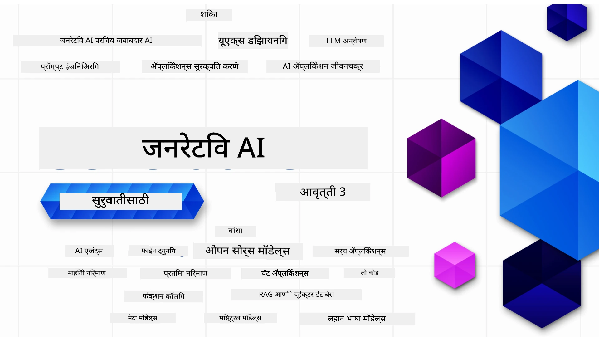

### जनरेटिव्ह AI अनुप्रयोग तयार करण्यासाठी तुम्हाला सर्व काही शिकवणाऱ्या 21 धडे

[](https://github.com/microsoft/Generative-AI-For-Beginners/blob/master/LICENSE?WT.mc_id=academic-105485-koreyst)
[](https://GitHub.com/microsoft/Generative-AI-For-Beginners/graphs/contributors/?WT.mc_id=academic-105485-koreyst)
[](https://GitHub.com/microsoft/Generative-AI-For-Beginners/issues/?WT.mc_id=academic-105485-koreyst)
[](https://GitHub.com/microsoft/Generative-AI-For-Beginners/pulls/?WT.mc_id=academic-105485-koreyst)
[](http://makeapullrequest.com?WT.mc_id=academic-105485-koreyst)

[](https://GitHub.com/microsoft/Generative-AI-For-Beginners/watchers/?WT.mc_id=academic-105485-koreyst)
[](https://GitHub.com/microsoft/Generative-AI-For-Beginners/network/?WT.mc_id=academic-105485-koreyst)
[](https://GitHub.com/microsoft/Generative-AI-For-Beginners/stargazers/?WT.mc_id=academic-105485-koreyst)

[](https://discord.gg/nTYy5BXMWG)

### 🌐 बहुभाषिक समर्थन

#### GitHub Action द्वारे समर्थित (स्वयंचलित आणि नेहमी अद्ययावत)

<!-- CO-OP TRANSLATOR LANGUAGES TABLE START -->
[अरबी](../ar/README.md) | [बंगाली](../bn/README.md) | [बल्गेरियन](../bg/README.md) | [बर्मी (म्यानमार)](../my/README.md) | [चिनी (सोपे)](../zh-CN/README.md) | [चिनी (परंपरागत, हाँगकॉंग)](../zh-HK/README.md) | [चिनी (परंपरागत, मकाऊ)](../zh-MO/README.md) | [चिनी (परंपरागत, तैवान)](../zh-TW/README.md) | [क्रोएशियन](../hr/README.md) | [चेक](../cs/README.md) | [डॅनिश](../da/README.md) | [डच](../nl/README.md) | [एस्टोनियन](../et/README.md) | [फिन्निश](../fi/README.md) | [फ्रेंच](../fr/README.md) | [जर्मन](../de/README.md) | [ग्रीक](../el/README.md) | [हिब्रू](../he/README.md) | [हिंदी](../hi/README.md) | [हंगेरियन](../hu/README.md) | [इंडोनेशियन](../id/README.md) | [इटालियन](../it/README.md) | [जपानी](../ja/README.md) | [कन्नड](../kn/README.md) | [ख्मेर](../km/README.md) | [कोरियन](../ko/README.md) | [लिथुआनियन](../lt/README.md) | [मलय](../ms/README.md) | [मलयाळम](../ml/README.md) | [मराठी](./README.md) | [नेपाली](../ne/README.md) | [नाइजरियन पिडजिन](../pcm/README.md) | [नॉर्वेजियन](../no/README.md) | [फारसी (पर्शियन)](../fa/README.md) | [पोलिश](../pl/README.md) | [ब्राझीलियन पोर्तुगीज](../pt-BR/README.md) | [पोर्तुगीज (पुर्तगाल)](../pt-PT/README.md) | [पंजाबी (गुरमुखी)](../pa/README.md) | [रोमेनियन](../ro/README.md) | [रशियन](../ru/README.md) | [सर्बियन (सिरिलिक)](../sr/README.md) | [स्लोव्हाक](../sk/README.md) | [स्लोव्हेनियन](../sl/README.md) | [स्पॅनिश](../es/README.md) | [स्वाहिली](../sw/README.md) | [स्वीडिश](../sv/README.md) | [टॅगालोग (फिलिपिनो)](../tl/README.md) | [तमिळ](../ta/README.md) | [तेलुगू](../te/README.md) | [थाई](../th/README.md) | [टर्की](../tr/README.md) | [युक्रेनियन](../uk/README.md) | [उर्दू](../ur/README.md) | [व्हिएतनामी](../vi/README.md)

> **स्थानीय क्लोन करायचे आहे का?**
>
> या रिपॉझिटरीमध्ये ५०+ भाषा अनुवाद आहेत ज्यामुळे डाउनलोड आकार मोठा होतो. अनुवादांशिवाय क्लोन करण्यासाठी sparse checkout वापरा:
>
> **Bash / macOS / Linux:**
> ```bash
> git clone --filter=blob:none --sparse https://github.com/microsoft/generative-ai-for-beginners.git
> cd generative-ai-for-beginners
> git sparse-checkout set --no-cone '/*' '!translations' '!translated_images'
> ```
>
> **CMD (Windows):**
> ```cmd
> git clone --filter=blob:none --sparse https://github.com/microsoft/generative-ai-for-beginners.git
> cd generative-ai-for-beginners
> git sparse-checkout set --no-cone "/*" "!translations" "!translated_images"
> ```
>
> यामुळे तुम्हाला कोर्स पूर्ण करण्यासाठी आवश्यक सर्वकाही जलद डाउनलोड होईल.
<!-- CO-OP TRANSLATOR LANGUAGES TABLE END -->

# प्रारंभिकांसाठी जनरेटिव्ह AI (आवृत्ती 3) - एक कोर्स

Microsoft Cloud Advocates कडून आमच्या 21-धड्यांच्या सर्वसमावेशक कोर्ससह जनरेटिव्ह AI अनुप्रयोग तयार करण्याच्या मूलभूत तत्त्वांचा अभ्यास करा.

## 🌱 सुरुवात करा

हा कोर्स 21 धडे आहे. प्रत्येक धडा स्वतःचा विषय समजावून सांगतो त्यामुळे तुम्हाला जिथून आवडेल तिथून सुरुवात करा!

धडे "Learn" म्हणून लेबल केलेले असतात जे जनरेटिव्ह AI संकल्पना समजवतात किंवा "Build" धडे जे संकल्पना आणि दोन्ही **Python** व **TypeScript** मध्ये कोड उदाहरणे देतात (जर शक्य असेल तर).

.NET विकसकांसाठी [Generative AI for Beginners (.NET Edition)](https://github.com/microsoft/Generative-AI-for-beginners-dotnet?WT.mc_id=academic-105485-koreyst) पहा!

प्रत्येक धड्यात "Keep Learning" विभाग असतो ज्यात अतिरिक्त अभ्यासासाठी साधने असतात.

## काय आवश्यक आहे
### या कोर्सचा कोड चालवण्यासाठी, तुम्ही कोणतेही वापरू शकता: 
 - [Azure OpenAI Service](https://aka.ms/genai-beginners/azure-open-ai?WT.mc_id=academic-105485-koreyst) - **धडे:** "aoai-assignment"
 - [GitHub Marketplace Model Catalog](https://aka.ms/genai-beginners/gh-models?WT.mc_id=academic-105485-koreyst) - **धडे:** "githubmodels"
 - [OpenAI API](https://aka.ms/genai-beginners/open-ai?WT.mc_id=academic-105485-koreyst) - **धडे:** "oai-assignment" 
   
- Python किंवा TypeScript चे मूलभूत ज्ञान उपयुक्त आहे - \*पूर्ण नवीन असलेल्यांसाठी या [Python](https://aka.ms/genai-beginners/python?WT.mc_id=academic-105485-koreyst) व [TypeScript](https://aka.ms/genai-beginners/typescript?WT.mc_id=academic-105485-koreyst) कोर्स पहा
- तुमच्या स्वतःच्या GitHub खात्याला [हा संपूर्ण रेपो फोर्क करण्यासाठी आवश्यक GitHub खाते](https://aka.ms/genai-beginners/github?WT.mc_id=academic-105485-koreyst)

आम्ही तुमच्या विकास वातावरण सेटअपसाठी **[Course Setup](./00-course-setup/README.md?WT.mc_id=academic-105485-koreyst)** हा धडा तयार केला आहे.

नंतर सापडण्यासाठी [हा रेपो स्टार (🌟) करा](https://docs.github.com/en/get-started/exploring-projects-on-github/saving-repositories-with-stars?WT.mc_id=academic-105485-koreyst) यास विसरू नका.

## 🧠 तयार आहात तैनात करण्यासाठी?

अधिक प्रगत कोड नमुने पाहण्यासाठी, आमची [जनरेटिव्ह AI कोड नमुन्यांची संच](https://aka.ms/genai-beg-code?WT.mc_id=academic-105485-koreyst) बघा ज्यामध्ये दोन्ही **Python** आणि **TypeScript** आहेत.

## 🗣️ इतर शिकणाऱ्यांना भेटा, मदत मिळवा

आमच्या [ऑफिशियल Azure AI Foundry Discord सर्व्हरमध्ये](https://aka.ms/genai-discord?WT.mc_id=academic-105485-koreyst) सहभागी व्हा, जेथे या कोर्सला घेत असलेल्या इतर शिकणाऱ्यांना भेटा आणि मदत मिळवा.

Github वरील आमच्या [Azure AI Foundry Developer Forum](https://aka.ms/azureaifoundry/forum) वर प्रश्न विचारा किंवा उत्पादनाबाबत अभिप्राय शेअर करा.

## 🚀 स्टार्टअप तयार करत आहात?

आजच Azure क्रेडिट वापरून कसे सुरुवात करायची ते जाणून घेण्यासाठी [Microsoft for Startups](https://www.microsoft.com/startups) ला भेट द्या.

## 🙏 मदत करायची आहे?

तुमच्याकडे सूचना आहेत किंवा ऑर्डिंग अथवा कोडमध्ये चुका आढळल्या आहेत? [इश्यू उघडा](https://github.com/microsoft/generative-ai-for-beginners/issues?WT.mc_id=academic-105485-koreyst) किंवा [पुल रिक्वेस्ट तयार करा](https://github.com/microsoft/generative-ai-for-beginners/pulls?WT.mc_id=academic-105485-koreyst)

## 📂 प्रत्येक धड्यात समाविष्ट आहे:

- विषयावर एक लहान व्हिडिओ परिचय
- README मध्ये लिहिलेला धडा
- Azure OpenAI आणि OpenAI API समर्थित Python आणि TypeScript कोड नमुने
- तुमच्या शिकण्यात सुरू ठेवण्यासाठी अतिरिक्त संसाधनांना लिंक

## 🗃️ धडे

| #   | **धडा लिंक**                                                                                                                              | **वर्णन**                                                                                     | **व्हिडिओ**                                                                 | **अतिरिक्त शिकणे**                                                             |
| --- | ------------------------------------------------------------------------------------------------------------------------------------------- | --------------------------------------------------------------------------------------------- | ------------------------------------------------------------------------- | ------------------------------------------------------------------------------ |
| 00  | [कोर्स सेटअप](./00-course-setup/README.md?WT.mc_id=academic-105485-koreyst)                                                                  | **शिका:** तुमचं विकास वातावरण कसं सेट करायचं                                           | लवकरच व्हिडिओ येणार                                                            | [अधिक शिका](https://aka.ms/genai-collection?WT.mc_id=academic-105485-koreyst) |
| 01  | [जनरेटिव्ह AI आणि LLMs परिचय](./01-introduction-to-genai/README.md?WT.mc_id=academic-105485-koreyst)                                           | **शिका:** जनरेटिव्ह AI काय आहे आणि मोठे भाषा मॉडेल (LLMs) कसे कार्य करतात हे समजून घ्या | [व्हिडिओ](https://aka.ms/gen-ai-lesson-1-gh?WT.mc_id=academic-105485-koreyst) | [अधिक शिका](https://aka.ms/genai-collection?WT.mc_id=academic-105485-koreyst) |
| 02  | [विभिन्न LLMs अन्वेषण आणि तुलना](./02-exploring-and-comparing-different-llms/README.md?WT.mc_id=academic-105485-koreyst)                       | **शिका:** तुमच्या वापरासाठी योग्य मॉडेल कसं निवडायचं                                    | [व्हिडिओ](https://aka.ms/gen-ai-lesson2-gh?WT.mc_id=academic-105485-koreyst)  | [अधिक शिका](https://aka.ms/genai-collection?WT.mc_id=academic-105485-koreyst) |
| 03  | [जनरेटिव्ह AI जबाबदारीने वापरणे](./03-using-generative-ai-responsibly/README.md?WT.mc_id=academic-105485-koreyst)                              | **शिका:** जनरेटिव्ह AI अनुप्रयोग जबाबदारीने कसे तयार करायचे                               | [व्हिडिओ](https://aka.ms/gen-ai-lesson3-gh?WT.mc_id=academic-105485-koreyst)  | [अधिक शिका](https://aka.ms/genai-collection?WT.mc_id=academic-105485-koreyst) |
| 04  | [प्रॉम्प्ट इंजिनीयरिंग मूलतत्व समजून घेणे](./04-prompt-engineering-fundamentals/README.md?WT.mc_id=academic-105485-koreyst)             | **शिका:** प्रॅक्टिकल प्रॉम्प्ट इंजिनीयरिंग सर्वोत्तम पद्धती                                           | [व्हिडिओ](https://aka.ms/gen-ai-lesson4-gh?WT.mc_id=academic-105485-koreyst)  | [अधिक शिका](https://aka.ms/genai-collection?WT.mc_id=academic-105485-koreyst) |
| 05  | [प्रगत प्रॉम्प्ट तयार करणे](./05-advanced-prompts/README.md?WT.mc_id=academic-105485-koreyst)                                                | **शिका:** प्रॉम्प्टच्या परिणामात सुधारणा करणाऱ्या प्रॉम्प्ट इंजिनीयरिंग तंत्रांचा वापर कसा करायचा. | [व्हिडिओ](https://aka.ms/gen-ai-lesson5-gh?WT.mc_id=academic-105485-koreyst)  | [अधिक शिका](https://aka.ms/genai-collection?WT.mc_id=academic-105485-koreyst) |
| 06  | [टेक्स्ट जनरेशन अनुप्रयोग तयार करणे](./06-text-generation-apps/README.md?WT.mc_id=academic-105485-koreyst)                                | **तयार करा:** Azure OpenAI / OpenAI API वापरून टेक्स्ट जनरेशन अॅप                               | [व्हिडिओ](https://aka.ms/gen-ai-lesson6-gh?WT.mc_id=academic-105485-koreyst)  | [अधिक शिका](https://aka.ms/genai-collection?WT.mc_id=academic-105485-koreyst) |
| 07  | [चॅट अनुप्रयोग तयार करणे](./07-building-chat-applications/README.md?WT.mc_id=academic-105485-koreyst)                                     | **तयार करा:** चॅट अनुप्रयोग कार्यक्षमतेने तयार करण्याचे व समाकलित करण्याचे तंत्र                | [व्हिडिओ](https://aka.ms/gen-ai-lessons7-gh?WT.mc_id=academic-105485-koreyst) | [अधिक शिका](https://aka.ms/genai-collection?WT.mc_id=academic-105485-koreyst) |
| 08  | [सर्च अॅप्स व्हेक्टर डेटाबेस तयार करणे](./08-building-search-applications/README.md?WT.mc_id=academic-105485-koreyst)                        | **तयार करा:** एम्बेडिंग्ज वापरून डेटाच्या शोधासाठी सर्च अॅप                                    | [व्हिडिओ](https://aka.ms/gen-ai-lesson8-gh?WT.mc_id=academic-105485-koreyst)  | [अधिक शिका](https://aka.ms/genai-collection?WT.mc_id=academic-105485-koreyst) |
| 09  | [इमेज जनरेशन अनुप्रयोग तयार करणे](./09-building-image-applications/README.md?WT.mc_id=academic-105485-koreyst)                              | **तयार करा:** इमेज जनरेशन अनुप्रयोग                                                        | [व्हिडिओ](https://aka.ms/gen-ai-lesson9-gh?WT.mc_id=academic-105485-koreyst)  | [अधिक शिका](https://aka.ms/genai-collection?WT.mc_id=academic-105485-koreyst) |
| 10  | [लो कोड AI अनुप्रयोग तयार करणे](./10-building-low-code-ai-applications/README.md?WT.mc_id=academic-105485-koreyst)                           | **तयार करा:** लो कोड टूल्स वापरून जनरेटिव्ह AI अनुप्रयोग                                       | [व्हिडिओ](https://aka.ms/gen-ai-lesson10-gh?WT.mc_id=academic-105485-koreyst) | [अधिक शिका](https://aka.ms/genai-collection?WT.mc_id=academic-105485-koreyst) |
| 11  | [फंक्शन कॉलिंगसह बाह्य अनुप्रयोगांचे समाकलन](./11-integrating-with-function-calling/README.md?WT.mc_id=academic-105485-koreyst)             | **तयार करा:** फंक्शन कॉलिंग म्हणजे काय आणि अनुप्रयोगांसाठी त्याचा वापर                         | [व्हिडिओ](https://aka.ms/gen-ai-lesson11-gh?WT.mc_id=academic-105485-koreyst) | [अधिक शिका](https://aka.ms/genai-collection?WT.mc_id=academic-105485-koreyst) |
| 12  | [AI अनुप्रयोगांसाठी UX डिझाइन करणे](./12-designing-ux-for-ai-applications/README.md?WT.mc_id=academic-105485-koreyst)                         | **शिका:** जनरेटिव्ह AI अनुप्रयोग विकसित करताना UX डिझाइन तत्त्वे कशी लागू करावी                  | [व्हिडिओ](https://aka.ms/gen-ai-lesson12-gh?WT.mc_id=academic-105485-koreyst) | [अधिक शिका](https://aka.ms/genai-collection?WT.mc_id=academic-105485-koreyst) |
| 13  | [तुमचे जनरेटिव्ह AI अनुप्रयोग सुरक्षित करणे](./13-securing-ai-applications/README.md?WT.mc_id=academic-105485-koreyst)                         | **शिका:** AI प्रणालींस धोके व जोखमी काय आहेत आणि त्या सुरक्षित करण्याचे मार्ग                   | [व्हिडिओ](https://aka.ms/gen-ai-lesson13-gh?WT.mc_id=academic-105485-koreyst) | [अधिक शिका](https://aka.ms/genai-collection?WT.mc_id=academic-105485-koreyst) |
| 14  | [जनरेटिव्ह AI अनुप्रयोग जीवनचक्र](./14-the-generative-ai-application-lifecycle/README.md?WT.mc_id=academic-105485-koreyst)                   | **शिका:** LLM जीवनचक्र व LLMOps व्यवस्थापित करण्यासाठी उपकरणे आणि मेट्रिक्स                     | [व्हिडिओ](https://aka.ms/gen-ai-lesson14-gh?WT.mc_id=academic-105485-koreyst) | [अधिक शिका](https://aka.ms/genai-collection?WT.mc_id=academic-105485-koreyst) |
| 15  | [रिट्रीव्हल ऑगमेंटेड जनरेशन (RAG) आणि व्हेक्टर डेटाबेस](./15-rag-and-vector-databases/README.md?WT.mc_id=academic-105485-koreyst)               | **तयार करा:** व्हेक्टर डेटाबेसमधून एम्बेडिंग्स येण्याकरिता RAG फ्रेमवर्क वापरून अॅप           | [व्हिडिओ](https://aka.ms/gen-ai-lesson15-gh?WT.mc_id=academic-105485-koreyst) | [अधिक शिका](https://aka.ms/genai-collection?WT.mc_id=academic-105485-koreyst) |
| 16  | [ओपन सोर्स मॉडेल्स आणि हगिंग फेस](./16-open-source-models/README.md?WT.mc_id=academic-105485-koreyst)                                        | **तयार करा:** हगिंग फेसवर उपलब्ध असलेल्या ओपन सोर्स मॉडेल्स वापरून अनुप्रयोग                 | [व्हिडिओ](https://aka.ms/gen-ai-lesson16-gh?WT.mc_id=academic-105485-koreyst) | [अधिक शिका](https://aka.ms/genai-collection?WT.mc_id=academic-105485-koreyst) |
| 17  | [AI एजंट्स](./17-ai-agents/README.md?WT.mc_id=academic-105485-koreyst)                                                                       | **तयार करा:** AI एजंट फ्रेमवर्क वापरून अनुप्रयोग                                            | [व्हिडिओ](https://aka.ms/gen-ai-lesson17-gh?WT.mc_id=academic-105485-koreyst) | [अधिक शिका](https://aka.ms/genai-collection?WT.mc_id=academic-105485-koreyst) |
| 18  | [LLMs फाइन-ट्यूनिंग](./18-fine-tuning/README.md?WT.mc_id=academic-105485-koreyst)                                                            | **शिका:** LLMs फाइन-ट्यूनिंग म्हणजे काय, का आणि कसे करायचे                                  | [व्हिडिओ](https://aka.ms/gen-ai-lesson18-gh?WT.mc_id=academic-105485-koreyst) | [अधिक शिका](https://aka.ms/genai-collection?WT.mc_id=academic-105485-koreyst) |
| 19  | [SLMs सह तयार करणे](./19-slm/README.md?WT.mc_id=academic-105485-koreyst)                                                              | **शिका:** स्मॉल लँग्वेज मॉडेल्ससह तयार करण्याचे फायदे                                            | व्हिडिओ लवकरच येत आहे | [अधिक शिका](https://aka.ms/genai-collection?WT.mc_id=academic-105485-koreyst) |
| 20  | [मिस्ट्राल मॉडेल्ससह तयार करणे](./20-mistral/README.md?WT.mc_id=academic-105485-koreyst)                                                              | **शिका:** मिस्ट्राल कुटुंबातील मॉडेल्सच्या वैशिष्ट्ये आणि फरक                                           | व्हिडिओ लवकरच येत आहे | [अधिक शिका](https://aka.ms/genai-collection?WT.mc_id=academic-105485-koreyst) |
| 21  | [मेटा मॉडेल्ससह तयार करणे](./21-meta/README.md?WT.mc_id=academic-105485-koreyst)                                                              | **शिका:** मेटा कुटुंबातील मॉडेल्सच्या वैशिष्ट्ये आणि फरक                                           | व्हिडिओ लवकरच येत आहे | [अधिक शिका](https://aka.ms/genai-collection?WT.mc_id=academic-105485-koreyst) |

### 🌟 विशेष आभार

[**जॉन अजीज**](https://www.linkedin.com/in/john0isaac/) यांचे GitHub Actions आणि वर्कफ्लोज तयार केल्याबद्दल विशेष आभार

[**बर्नहार्ड मर्कले**](https://www.linkedin.com/in/bernhard-merkle-738b73/) यांचे प्रत्येक धड्याला शिकणाऱ्या आणि कोड अनुभव सुधारण्यासाठी केलेल्या मुख्य योगदानांसाठी आभार. 

## 🎒 इतर कोर्सेस

आमची टीम इतरही कोर्सेस तयार करते! पहा:

<!-- CO-OP TRANSLATOR OTHER COURSES START -->
### LangChain
[](https://aka.ms/langchain4j-for-beginners)
[](https://aka.ms/langchainjs-for-beginners?WT.mc_id=m365-94501-dwahlin)
[](https://github.com/microsoft/langchain-for-beginners?WT.mc_id=m365-94501-dwahlin)
---

### Azure / Edge / MCP / Agents
[](https://github.com/microsoft/AZD-for-beginners?WT.mc_id=academic-105485-koreyst)
[](https://github.com/microsoft/edgeai-for-beginners?WT.mc_id=academic-105485-koreyst)
[](https://github.com/microsoft/mcp-for-beginners?WT.mc_id=academic-105485-koreyst)
[](https://github.com/microsoft/ai-agents-for-beginners?WT.mc_id=academic-105485-koreyst)

---
 
### जनरेटिव्ह AI सिरीज
[](https://github.com/microsoft/generative-ai-for-beginners?WT.mc_id=academic-105485-koreyst)
[-9333EA?style=for-the-badge&labelColor=E5E7EB&color=9333EA)](https://github.com/microsoft/Generative-AI-for-beginners-dotnet?WT.mc_id=academic-105485-koreyst)
[-C084FC?style=for-the-badge&labelColor=E5E7EB&color=C084FC)](https://github.com/microsoft/generative-ai-for-beginners-java?WT.mc_id=academic-105485-koreyst)
[-E879F9?style=for-the-badge&labelColor=E5E7EB&color=E879F9)](https://github.com/microsoft/generative-ai-with-javascript?WT.mc_id=academic-105485-koreyst)

---
 
### मुख्य शिक्षण
[](https://aka.ms/ml-beginners?WT.mc_id=academic-105485-koreyst)
[](https://aka.ms/datascience-beginners?WT.mc_id=academic-105485-koreyst)
[](https://aka.ms/ai-beginners?WT.mc_id=academic-105485-koreyst)
[](https://github.com/microsoft/Security-101?WT.mc_id=academic-96948-sayoung)
[](https://aka.ms/webdev-beginners?WT.mc_id=academic-105485-koreyst)
[](https://aka.ms/iot-beginners?WT.mc_id=academic-105485-koreyst)
[](https://github.com/microsoft/xr-development-for-beginners?WT.mc_id=academic-105485-koreyst)

---
 
### कॉपायलट सिरीज
[](https://aka.ms/GitHubCopilotAI?WT.mc_id=academic-105485-koreyst)
[](https://github.com/microsoft/mastering-github-copilot-for-dotnet-csharp-developers?WT.mc_id=academic-105485-koreyst)
[](https://github.com/microsoft/CopilotAdventures?WT.mc_id=academic-105485-koreyst)
<!-- CO-OP TRANSLATOR OTHER COURSES END -->

## मदत मिळवणे

जर तुम्हाला अडचण येत असेल किंवा AI अॅप्स तयार करताना कोणतेही प्रश्न असतील, तर MCP च्या चर्चा सत्रांमध्ये सहभागी व्हा जिथे शिकणारे आणि अनुभवी विकसक एकत्र येतात. हे एक सहकार्यशील समुदाय आहे जिथे प्रश्न स्वागतार्ह आहेत आणि ज्ञान मोकळेपणाने वाटले जाते.

[](https://discord.gg/nTYy5BXMWG)

जर तुम्हाला उत्पादनाबाबत अभिप्राय द्यायचा असेल किंवा अॅप तयार करताना त्रुटी येत असतील तर भेट द्या:

[](https://aka.ms/foundry/forum)

---

<!-- CO-OP TRANSLATOR DISCLAIMER START -->
**स्पष्टीकरण**:  
हा दस्तऐवज AI भाषांतर सेवा [Co-op Translator](https://github.com/Azure/co-op-translator) वापरून अनुवादित केला आहे. आम्ही अचूकतेसाठी प्रयत्नशील असतो, पण कृपया लक्षात घ्या की स्वयंचलित भाषांतरांमध्ये चुका किंवा असत्यता असू शकते. मूळ दस्तऐवज त्याच्या मूळ भाषेत अधिकृत स्रोत म्हणून मानले पाहिजे. महत्वाची माहिती साठी व्यावसायिक मानवी भाषांतर करणे शिफारसीय आहे. या भाषांतराच्या वापरामुळे उद्भवणाऱ्या कोणत्याही गैरसमजुती किंवा चुकांसाठी आम्ही जबाबदार नाही.
<!-- CO-OP TRANSLATOR DISCLAIMER END -->