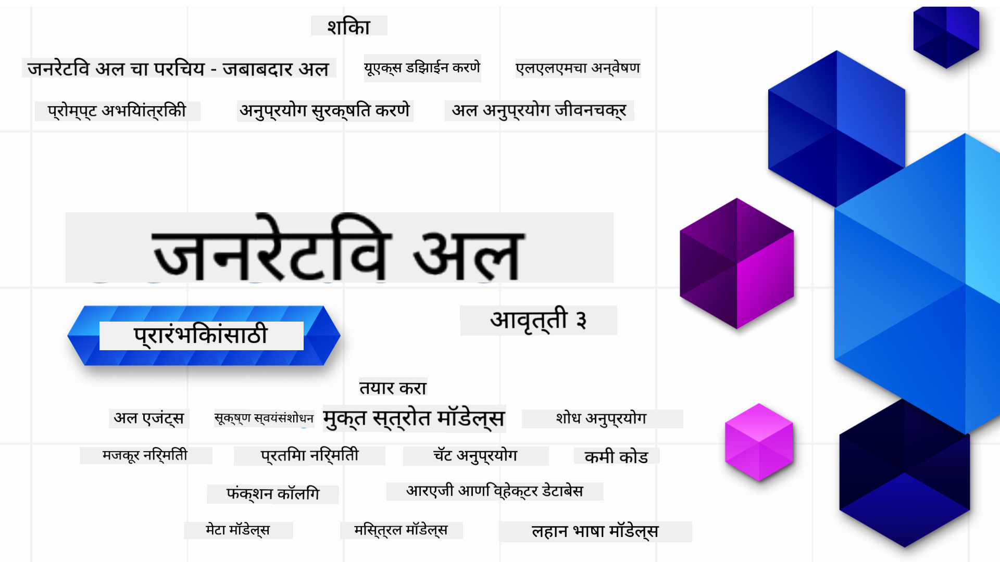

<!--
CO_OP_TRANSLATOR_METADATA:
{
  "original_hash": "6e3f4c8a4f323b8eab1cf11ded304b0f",
  "translation_date": "2025-06-25T07:47:40+00:00",
  "source_file": "README.md",
  "language_code": "mr"
}
-->

### जनरेटिव AI अनुप्रयोग बनवायला सुरुवात करण्यासाठी आवश्यक असलेल्या 21 धडे

### 🌐 बहुभाषिक समर्थन

#### GitHub क्रिया द्वारे समर्थित (स्वयंचलित आणि नेहमी अद्ययावत)

# जनरेटिव AI नवशिक्यांसाठी (आवृत्ती 3) - एक कोर्स

मायक्रोसॉफ्ट क्लाउड अॅडव्होकेट्सद्वारे 21 धड्यांच्या व्यापक कोर्ससह जनरेटिव AI अनुप्रयोग तयार करण्याच्या मूलभूत गोष्टी शिकवा.

## 🌱 सुरुवात करणे

या कोर्समध्ये 21 धडे आहेत. प्रत्येक धडा त्याचा स्वतःचा विषय कव्हर करतो त्यामुळे तुम्हाला हवे तेथून सुरुवात करा!

धड्यांना "शिका" किंवा "बांधा" असे लेबल दिले जाते. "शिका" धडे जनरेटिव AI संकल्पना स्पष्ट करतात तर "बांधा" धडे संकल्पना आणि कोड उदाहरणे स्पष्ट करतात, जे शक्य असल्यास **Python** आणि **TypeScript** मध्ये आहेत.

.NET विकसकांसाठी [जनरेटिव AI नवशिक्यांसाठी (.NET संस्करण)](https://github.com/microsoft/Generative-AI-for-beginners-dotnet?WT.mc_id=academic-105485-koreyst) पाहा!

प्रत्येक धड्यात अतिरिक्त शिकण्याची साधने असलेला "शिकणे सुरू ठेवा" विभाग देखील समाविष्ट आहे.

## तुम्हाला काय आवश्यक आहे
### या कोर्सचा कोड चालवण्यासाठी, तुम्ही खालीलपैकी कोणताही वापरू शकता:
- [Azure OpenAI सेवा](https://aka.ms/genai-beginners/azure-open-ai?WT.mc_id=academic-105485-koreyst) - **धडे:** "aoai-assignment"
- [GitHub मार्केटप्लेस मॉडेल कॅटलॉग](https://aka.ms/genai-beginners/gh-models?WT.mc_id=academic-105485-koreyst) - **धडे:** "githubmodels"
- [OpenAI API](https://aka.ms/genai-beginners/open-ai?WT.mc_id=academic-105485-koreyst) - **धडे:** "oai-assignment"

- Python किंवा TypeScript चे मूलभूत ज्ञान उपयुक्त आहे - \*अत्यंत नवशिक्यांसाठी हे [Python](https://aka.ms/genai-beginners/python?WT.mc_id=academic-105485-koreyst) आणि [TypeScript](https://aka.ms/genai-beginners/typescript?WT.mc_id=academic-105485-koreyst) कोर्स पहा
- [तुमच्या स्वतःच्या GitHub खात्यावर हा संपूर्ण रेपो फोर्क करण्यासाठी](https://aka.ms/genai-beginners/github?WT.mc_id=academic-105485-koreyst) एक GitHub खाते

तुमच्या विकास वातावरणाची सेटअप करण्यात मदत करण्यासाठी आम्ही एक **[कोर्स सेटअप](./00-course-setup/README.md?WT.mc_id=academic-105485-koreyst)** धडा तयार केला आहे.

[या रेपोला स्टार (🌟) द्या](https://docs.github.com/en/get-started/exploring-projects-on-github/saving-repositories-with-stars?WT.mc_id=academic-105485-koreyst) म्हणजे नंतर ते सहज सापडेल.

## 🧠 तैनात करण्यास तयार आहात का?

जर तुम्ही अधिक प्रगत कोड नमुन्यांचा शोध घेत असाल, तर आमच्या [जनरेटिव AI कोड नमुन्यांच्या संग्रह](https://aka.ms/genai-beg-code?WT.mc_id=academic-105485-koreyst) मध्ये **Python** आणि **TypeScript** मध्ये पहा.

## 🗣️ इतर शिकणाऱ्यांना भेटा, समर्थन मिळवा

या कोर्समध्ये सहभागी होणाऱ्या इतर शिकणाऱ्यांना भेटण्यासाठी आणि नेटवर्क करण्यासाठी [आमच्या अधिकृत Azure AI Foundry Discord सर्व्हर](https://aka.ms/genai-discord?WT.mc_id=academic-105485-koreyst) मध्ये सामील व्हा आणि समर्थन मिळवा.

GitHub वरील [Azure AI Foundry Developer Forum](https://aka.ms/azureaifoundry/forum) मध्ये प्रश्न विचारा किंवा उत्पादन अभिप्राय शेअर करा.

## 🚀 स्टार्टअप तयार करत आहात का?

**मोफत OpenAI क्रेडिट्स** आणि **Azure OpenAI सेवांच्या माध्यमातून OpenAI मॉडेल्समध्ये प्रवेश करण्यासाठी Azure क्रेडिट्ससाठी $150k पर्यंत** मिळवण्यासाठी [Microsoft for Startups Founders Hub](https://aka.ms/genai-foundershub?WT.mc_id=academic-105485-koreyst) साठी साइन अप करा.

## 🙏 मदत करू इच्छिता?

तुमच्याकडे सूचना आहेत का किंवा तुम्हाला स्पेलिंग किंवा कोड त्रुटी सापडल्या आहेत? [एक समस्या उचला](https://github.com/microsoft/generative-ai-for-beginners/issues?WT.mc_id=academic-105485-koreyst) किंवा [एक पुल विनंती तयार करा](https://github.com/microsoft/generative-ai-for-beginners/pulls?WT.mc_id=academic-105485-koreyst)

## 📂 प्रत्येक धड्यात समाविष्ट आहे:

- विषयाची एक लहान व्हिडिओ ओळख
- README मध्ये स्थित एक लिखित धडा
- Azure OpenAI आणि OpenAI API ला समर्थन देणारे Python आणि TypeScript कोड नमुने
- तुमचे शिक्षण सुरू ठेवण्यासाठी अतिरिक्त संसाधनांचे दुवे

## 🗃️ धडे

| #   | **धडा दुवा**                                                                                                                             | **वर्णन**                                                                                     | **व्हिडिओ**                                                                   | **अतिरिक्त शिक्षण**                                                             |
| --- | ---------------------------------------------------------------------------------------------------------------------------------------- | --------------------------------------------------------------------------------------------- | ----------------------------------------------------------------------------- | -------------------------------------------------------------------------------- |
| 00  | [कोर्स सेटअप](./00-course-setup/README.md?WT.mc_id=academic-105485-koreyst)                                                              | **शिका:** तुमचे विकास वातावरण कसे सेटअप करावे                                                 | व्हिडिओ लवकरच येत आहे                                                          | [अधिक जाणून घ्या](https://aka.ms/genai-collection?WT.mc_id=academic-105485-koreyst) |
| 01  | [जनरेटिव AI आणि LLM ची ओळख](./01-introduction-to-genai/README.md?WT.mc_id=academic-105485-koreyst)                                       | **शिका:** जनरेटिव AI म्हणजे काय आणि मोठ्या भाषा मॉडेल्स (LLMs) कसे कार्य करतात हे समजून घ्या | [व्हिडिओ](https://aka.ms/gen-ai-lesson-1-gh?WT.mc_id=academic-105485-koreyst) | [अधिक जाणून घ्या](https://aka.ms/genai-collection?WT.mc_id=academic-105485-koreyst) |
| 02  | [वेगवेगळ्या LLM चा शोध घेणे आणि तुलना करणे](./02-exploring-and-comparing-different-llms/README.md?WT.mc_id=academic-105485-koreyst)     | **शिका:** तुमच्या उपयोग प्रकरणासाठी योग्य मॉडेल कसे निवडावे                                    | [व्हिडिओ](https://aka.ms/gen-ai-lesson2-gh?WT.mc_id=academic-105485-koreyst)  | [अधिक जाणून घ्या](https://aka.ms/genai-collection?WT.mc_id=academic-105485-koreyst) |
| 03  | [जनरेटिव AI जबाबदारीने वापरणे](./03-using-generative-ai-responsibly/README.md?WT.mc_id=academic-105485-koreyst)                          | **शिका:** जनरेटिव AI अनुप्रयोग जबाबदारीने कसे तयार करावे                                      | [व्हिडिओ](https://aka.ms/gen-ai-lesson3-gh?WT.mc_id=academic-105485-koreyst)  | [अधिक जाणून घ्या](https://aka.ms/genai-collection?WT.mc_id=academic-105485-koreyst) |
| 04  | [प्रॉम्प्ट इंजिनिअरिंग मूलतत्त्वे समजून घेणे](./04-prompt-engineering-fundamentals/README.md?WT.mc_id=academic-105485-koreyst)            | **शिका:** प्रॉम्प्ट इंजिनिअरिंग सर्वोत्तम पद्धतींचे व्यावहारिक ज्ञान                           | [व्हिडिओ](https://aka.ms/gen-ai-lesson4-gh?WT.mc_id=academic-105485-koreyst)  | [अधिक जाणून घ्या](https://aka.ms/genai-collection?WT.mc_id=academic-105485-koreyst) |
| 05  | [उन्नत प्रॉम्प्ट तयार करणे](./05-advanced-prompts/README.md?WT.mc_id=academic-105485-koreyst)                                                | **शिका:** आपल्या प्रॉम्प्टच्या परिणामांना सुधारण्यासाठी प्रॉम्प्ट इंजिनिअरिंग तंत्रांचा वापर कसा करावा. | [व्हिडिओ](https://aka.ms/gen-ai-lesson5-gh?WT.mc_id=academic-105485-koreyst)  | [अधिक जाणून घ्या](https://aka.ms/genai-collection?WT.mc_id=academic-105485-koreyst) |
| 06  | [टेक्स्ट जनरेशन अनुप्रयोग तयार करणे](./06-text-generation-apps/README.md?WT.mc_id=academic-105485-koreyst)                                | **तयार करा:** Azure OpenAI / OpenAI API वापरून एक टेक्स्ट जनरेशन अनुप्रयोग                                | [व्हिडिओ](https://aka.ms/gen-ai-lesson6-gh?WT.mc_id=academic-105485-koreyst)  | [अधिक जाणून घ्या](https://aka.ms/genai-collection?WT.mc_id=academic-105485-koreyst) |
| 07  | [चॅट अनुप्रयोग तयार करणे](./07-building-chat-applications/README.md?WT.mc_id=academic-105485-koreyst)                                     | **तयार करा:** चॅट अनुप्रयोग कार्यक्षमतेने तयार करण्याच्या आणि समाकलित करण्याच्या तंत्र.               | [व्हिडिओ](https://aka.ms/gen-ai-lessons7-gh?WT.mc_id=academic-105485-koreyst) | [अधिक जाणून घ्या](https://aka.ms/genai-collection?WT.mc_id=academic-105485-koreyst) |
| 08  | [सर्च अनुप्रयोग तयार करणे व्हेक्टर डेटाबेस](./08-building-search-applications/README.md?WT.mc_id=academic-105485-koreyst)                        | **तयार करा:** एम्बेडिंग्ज वापरून डेटा शोधण्यासाठी एक सर्च अनुप्रयोग                        | [व्हिडिओ](https://aka.ms/gen-ai-lesson8-gh?WT.mc_id=academic-105485-koreyst)  | [अधिक जाणून घ्या](https://aka.ms/genai-collection?WT.mc_id=academic-105485-koreyst) |
| 09  | [इमेज जनरेशन अनुप्रयोग तयार करणे](./09-building-image-applications/README.md?WT.mc_id=academic-105485-koreyst)                        | **तयार करा:** एक इमेज जनरेशन अनुप्रयोग                                                       | [व्हिडिओ](https://aka.ms/gen-ai-lesson9-gh?WT.mc_id=academic-105485-koreyst)  | [अधिक जाणून घ्या](https://aka.ms/genai-collection?WT.mc_id=academic-105485-koreyst) |
| 10  | [लो कोड AI अनुप्रयोग तयार करणे](./10-building-low-code-ai-applications/README.md?WT.mc_id=academic-105485-koreyst)                       | **तयार करा:** लो कोड साधने वापरून एक जनरेटिव AI अनुप्रयोग                                     | [व्हिडिओ](https://aka.ms/gen-ai-lesson10-gh?WT.mc_id=academic-105485-koreyst) | [अधिक जाणून घ्या](https://aka.ms/genai-collection?WT.mc_id=academic-105485-koreyst) |
| 11  | [बाह्य अनुप्रयोग फंक्शन कॉलिंगसह समाकलित करणे](./11-integrating-with-function-calling/README.md?WT.mc_id=academic-105485-koreyst) | **तयार करा:** फंक्शन कॉलिंग म्हणजे काय आणि अनुप्रयोगांसाठी त्याचे उपयोग कसे आहेत                          | [व्हिडिओ](https://aka.ms/gen-ai-lesson11-gh?WT.mc_id=academic-105485-koreyst) | [अधिक जाणून घ्या](https://aka.ms/genai-collection?WT.mc_id=academic-105485-koreyst) |
| 12  | [AI अनुप्रयोगांसाठी UX डिझाइन करणे](./12-designing-ux-for-ai-applications/README.md?WT.mc_id=academic-105485-koreyst)                         | **शिका:** जनरेटिव AI अनुप्रयोग विकसित करताना UX डिझाइन तत्त्वे कशी लागू करावीत         | [व्हिडिओ](https://aka.ms/gen-ai-lesson12-gh?WT.mc_id=academic-105485-koreyst) | [अधिक जाणून घ्या](https://aka.ms/genai-collection?WT.mc_id=academic-105485-koreyst) |
| 13  | [आपले जनरेटिव AI अनुप्रयोग सुरक्षित करणे](./13-securing-ai-applications/README.md?WT.mc_id=academic-105485-koreyst)                         | **शिका:** AI प्रणालींवरील धोके आणि जोखीम आणि या प्रणाली सुरक्षित करण्याचे उपाय.             | [व्हिडिओ](https://aka.ms/gen-ai-lesson13-gh?WT.mc_id=academic-105485-koreyst) | [अधिक जाणून घ्या](https://aka.ms/genai-collection?WT.mc_id=academic-105485-koreyst) |
| 14  | [जनरेटिव AI अनुप्रयोग जीवनचक्र](./14-the-generative-ai-application-lifecycle/README.md?WT.mc_id=academic-105485-koreyst)           | **शिका:** LLM जीवनचक्र आणि LLMOps व्यवस्थापित करण्यासाठी साधने आणि मेट्रिक्स                         | [व्हिडिओ](https://aka.ms/gen-ai-lesson14-gh?WT.mc_id=academic-105485-koreyst) | [अधिक जाणून घ्या](https://aka.ms/genai-collection?WT.mc_id=academic-105485-koreyst) |
| 15  | [रिट्रीव्हल ऑगमेंटेड जनरेशन (RAG) आणि व्हेक्टर डेटाबेसेस](./15-rag-and-vector-databases/README.md?WT.mc_id=academic-105485-koreyst)        | **बांधा:** व्हेक्टर डेटाबेसेसमधून एम्बेडिंग्ज मिळवण्यासाठी RAG फ्रेमवर्क वापरून एक अनुप्रयोग  | [व्हिडिओ](https://aka.ms/gen-ai-lesson15-gh?WT.mc_id=academic-105485-koreyst) | [अधिक जाणून घ्या](https://aka.ms/genai-collection?WT.mc_id=academic-105485-koreyst) |
| 16  | [ओपन सोर्स मॉडेल्स आणि हगिंग फेस](./16-open-source-models/README.md?WT.mc_id=academic-105485-koreyst)                                    | **बांधा:** हगिंग फेसवर उपलब्ध ओपन सोर्स मॉडेल्स वापरून एक अनुप्रयोग                    | [व्हिडिओ](https://aka.ms/gen-ai-lesson16-gh?WT.mc_id=academic-105485-koreyst) | [अधिक जाणून घ्या](https://aka.ms/genai-collection?WT.mc_id=academic-105485-koreyst) |
| 17  | [एआय एजंट्स](./17-ai-agents/README.md?WT.mc_id=academic-105485-koreyst)                                                                       | **बांधा:** एआय एजंट फ्रेमवर्क वापरून एक अनुप्रयोग                                           | [व्हिडिओ](https://aka.ms/gen-ai-lesson17-gh?WT.mc_id=academic-105485-koreyst) | [अधिक जाणून घ्या](https://aka.ms/genai-collection?WT.mc_id=academic-105485-koreyst) |
| 18  | [फाईन-ट्यूनिंग LLMs](./18-fine-tuning/README.md?WT.mc_id=academic-105485-koreyst)                                                              | **शिका:** LLMs चे काय, का आणि कसे फाईन-ट्यूनिंग करायचे                                            | [व्हिडिओ](https://aka.ms/gen-ai-lesson18-gh?WT.mc_id=academic-105485-koreyst) | [अधिक जाणून घ्या](https://aka.ms/genai-collection?WT.mc_id=academic-105485-koreyst) |
| 19  | [SLMs सह बांधणी](./19-slm/README.md?WT.mc_id=academic-105485-koreyst)                                                              | **शिका:** लहान भाषा मॉडेल्ससह बांधणीचे फायदे                                            | लवकरच व्हिडिओ येत आहे | [अधिक जाणून घ्या](https://aka.ms/genai-collection?WT.mc_id=academic-105485-koreyst) |
| 20  | [मिस्ट्रल मॉडेल्स सह बांधणी](./20-mistral/README.md?WT.mc_id=academic-105485-koreyst)                                                              | **शिका:** मिस्ट्रल फॅमिली मॉडेल्सच्या वैशिष्ट्ये आणि फरक                                           | लवकरच व्हिडिओ येत आहे | [अधिक जाणून घ्या](https://aka.ms/genai-collection?WT.mc_id=academic-105485-koreyst) |
| 21  | [मेटा मॉडेल्स सह बांधणी](./21-meta/README.md?WT.mc_id=academic-105485-koreyst)                                                              | **शिका:** मेटा फॅमिली मॉडेल्सच्या वैशिष्ट्ये आणि फरक                                           | लवकरच व्हिडिओ येत आहे | [अधिक जाणून घ्या](https://aka.ms/genai-collection?WT.mc_id=academic-105485-koreyst) |

### 🌟 विशेष आभार

[**जॉन अझीज**](https://www.linkedin.com/in/john0isaac/) यांचे विशेष आभार GitHub क्रिया आणि वर्कफ्लोज तयार केल्याबद्दल

[**बर्नहार्ड मर्कल**](https://www.linkedin.com/in/bernhard-merkle-738b73/) यांचे प्रत्येक धड्यात महत्त्वपूर्ण योगदान देऊन शिकणाऱ्याचा आणि कोडचा अनुभव सुधारण्यासाठी केलेल्या प्रयत्नांबद्दल.

## 🎒 इतर अभ्यासक्रम

आमची टीम इतर अभ्यासक्रमही तयार करते! पहा:

- [**नवीन** मॉडेल संदर्भ प्रोटोकॉल नवशिक्यांसाठी](https://github.com/microsoft/mcp-for-beginners?WT.mc_id=academic-105485-koreyst)
- [नवशिक्यांसाठी एआय एजंट्स](https://github.com/microsoft/ai-agents-for-beginners?WT.mc_id=academic-105485-koreyst)
- [.NET वापरून नवशिक्यांसाठी जनरेटिव्ह एआय](https://github.com/microsoft/Generative-AI-for-beginners-dotnet?WT.mc_id=academic-105485-koreyst)
- [जावास्क्रिप्ट वापरून नवशिक्यांसाठी जनरेटिव्ह एआय](https://aka.ms/genai-js-course?WT.mc_id=academic-105485-koreyst)
- [नवशिक्यांसाठी मशीन लर्निंग](https://aka.ms/ml-beginners?WT.mc_id=academic-105485-koreyst)
- [नवशिक्यांसाठी डेटा सायन्स](https://aka.ms/datascience-beginners?WT.mc_id=academic-105485-koreyst)
- [नवशिक्यांसाठी एआय](https://aka.ms/ai-beginners?WT.mc_id=academic-105485-koreyst)
- [नवशिक्यांसाठी सायबरसिक्युरिटी](https://github.com/microsoft/Security-101??WT.mc_id=academic-96948-sayoung)
- [नवशिक्यांसाठी वेब डेव्हलपमेंट](https://aka.ms/webdev-beginners?WT.mc_id=academic-105485-koreyst)
- [नवशिक्यांसाठी आयओटी](https://aka.ms/iot-beginners?WT.mc_id=academic-105485-koreyst)
- [नवशिक्यांसाठी XR विकास](https://github.com/microsoft/xr-development-for-beginners?WT.mc_id=academic-105485-koreyst)
- [AI सहकार्य प्रोग्रामिंगसाठी GitHub Copilot मध्ये पारंगत व्हा](https://aka.ms/GitHubCopilotAI?WT.mc_id=academic-105485-koreyst)
- [C#/.NET विकसकांसाठी GitHub Copilot मध्ये पारंगत व्हा](https://github.com/microsoft/mastering-github-copilot-for-dotnet-csharp-developers?WT.mc_id=academic-105485-koreyst)
- [आपल्या स्वतःच्या Copilot साहसाची निवड करा](https://github.com/microsoft/CopilotAdventures?WT.mc_id=academic-105485-koreyst)

**अस्वीकृती**:  
हा दस्तऐवज AI भाषांतर सेवा [Co-op Translator](https://github.com/Azure/co-op-translator) वापरून भाषांतरित केला आहे. आम्ही अचूकतेसाठी प्रयत्नशील असलो तरी, कृपया लक्षात ठेवा की स्वयंचलित भाषांतरे त्रुटी किंवा अपूर्णता असू शकतात. मूळ भाषेतील दस्तऐवज हा अधिकृत स्रोत मानला पाहिजे. महत्वाच्या माहितीसाठी, व्यावसायिक मानव भाषांतराची शिफारस केली जाते. या भाषांतराचा वापर केल्यामुळे उद्भवणाऱ्या कोणत्याही गैरसमजुती किंवा चुकीच्या अर्थासाठी आम्ही जबाबदार नाही.