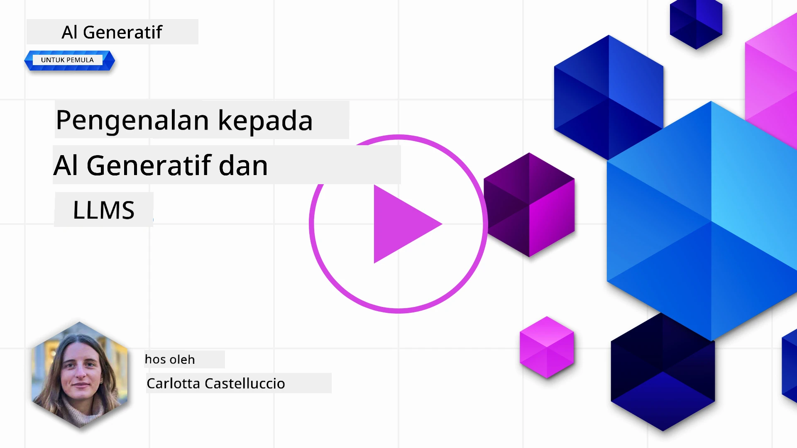
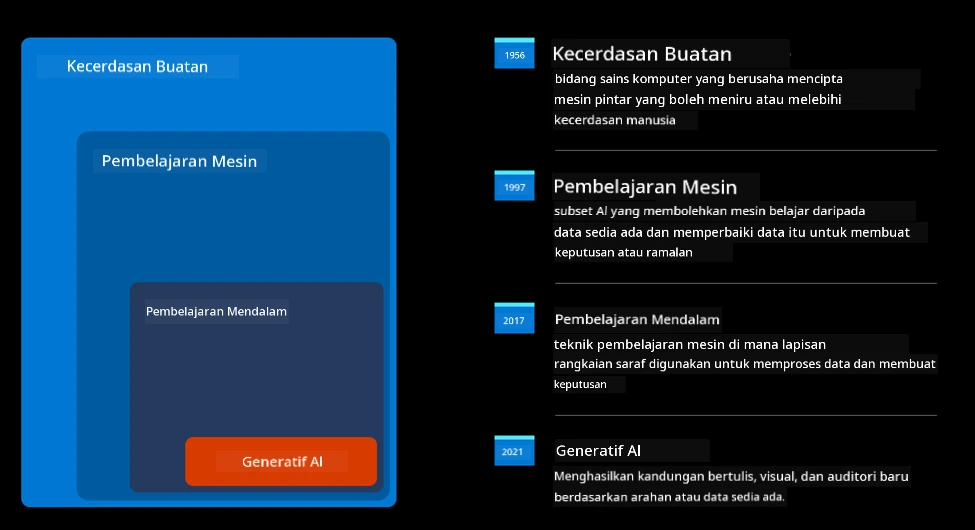
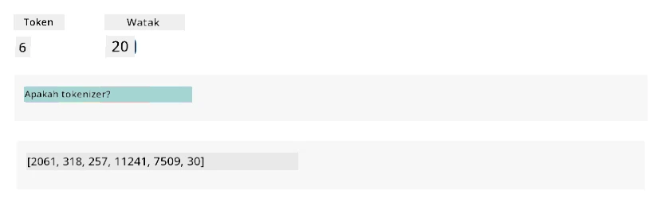
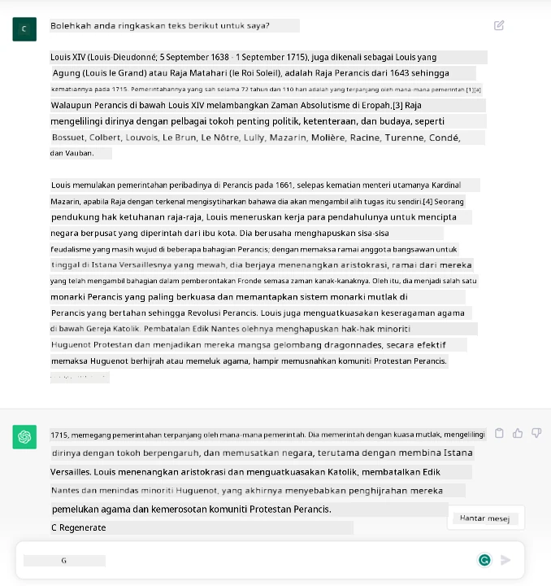
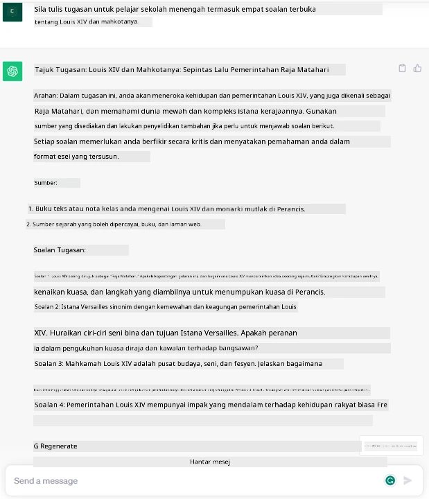
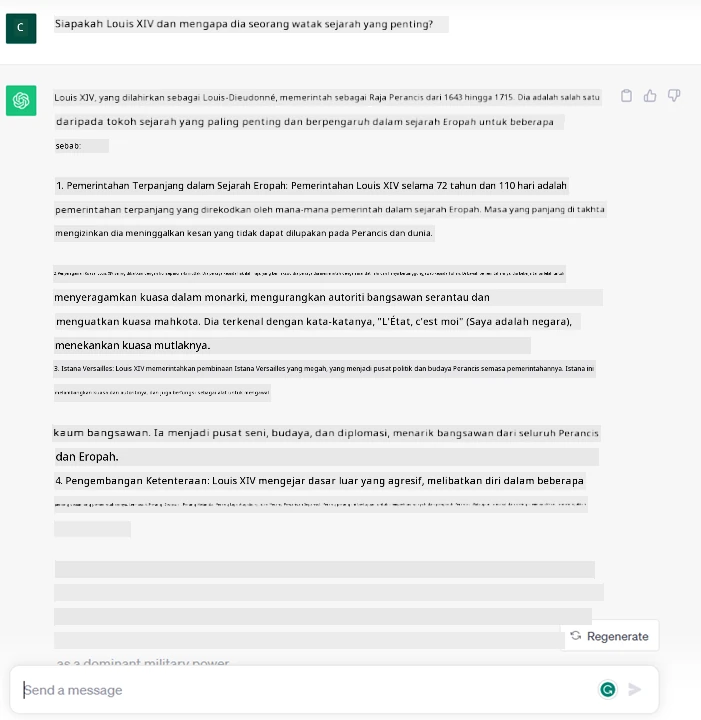
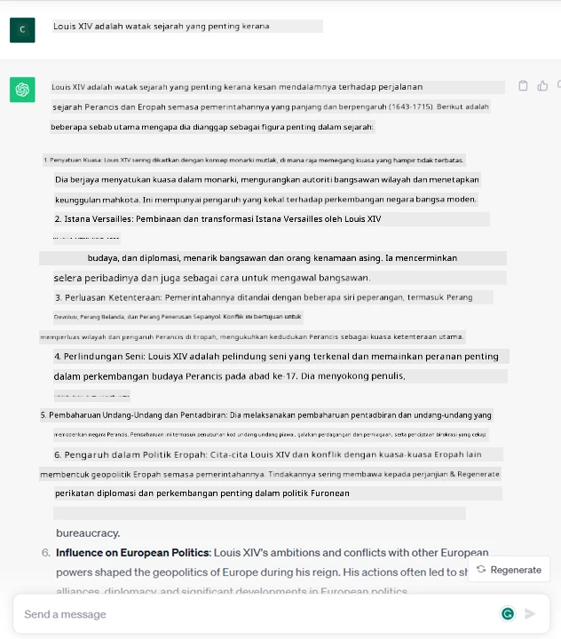
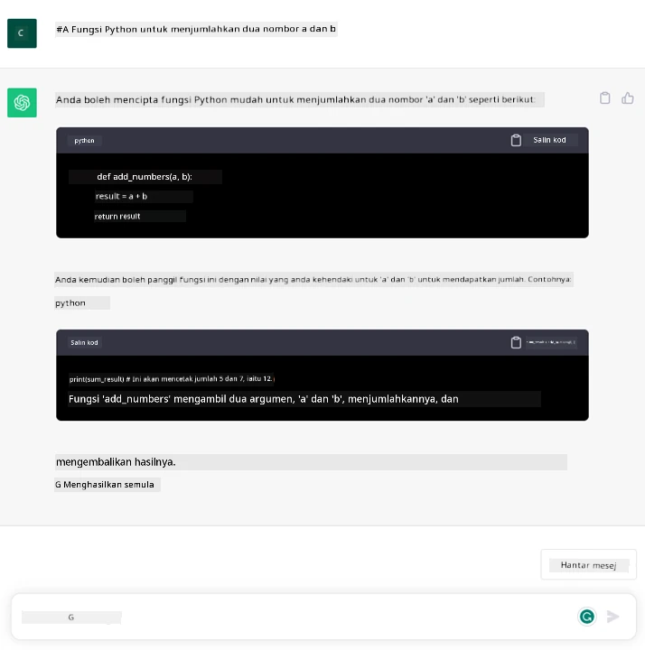

# Pengenalan kepada AI Generatif dan Model Bahasa Besar

_(Klik imej di atas untuk menonton video pelajaran ini)_

AI generatif ialah kecerdasan buatan yang mampu menghasilkan teks, imej dan jenis kandungan lain. Apa yang menjadikannya teknologi hebat adalah ia mendemokrasikan AI, sesiapa sahaja boleh menggunakannya dengan hanya arahan teks, ayat yang ditulis dalam bahasa semula jadi. Tidak perlu anda belajar bahasa seperti Java atau SQL untuk mencapai sesuatu yang bermakna, apa yang anda perlukan hanyalah menggunakan bahasa anda, nyatakan apa yang anda mahu dan keluar cadangan daripada model AI. Aplikasi dan impak untuk ini sangat besar, anda menulis atau memahami laporan, menulis permohonan dan banyak lagi, semua hanya dalam beberapa saat.

Dalam kurikulum ini, kami akan meneroka bagaimana syarikat permulaan kami menggunakan AI generatif untuk membuka senario baru dalam dunia pendidikan dan bagaimana kami menangani cabaran yang tidak dapat dielakkan yang berkaitan dengan implikasi sosial penggunaannya dan kekangan teknologi.

## Pengenalan

Pelajaran ini akan merangkumi:

- Pengenalan kepada senario perniagaan: idea dan misi syarikat permulaan kami.
- AI generatif dan bagaimana kami sampai kepada landskap teknologi semasa.
- Cara kerja dalaman model bahasa besar.
- Keupayaan utama dan kes penggunaan praktikal Model Bahasa Besar.

## Matlamat Pembelajaran

Selepas menamatkan pelajaran ini, anda akan memahami:

- Apa itu AI generatif dan bagaimana Model Bahasa Besar berfungsi.
- Bagaimana anda boleh memanfaatkan model bahasa besar untuk pelbagai kes penggunaan, dengan tumpuan kepada senario pendidikan.

## Senario: syarikat permulaan pendidikan kami

Kecerdasan Buatan Generatif (AI) mewakili kemuncak teknologi AI, menolak sempadan apa yang pernah dianggap mustahil. Model AI generatif mempunyai beberapa keupayaan dan aplikasi, tetapi untuk kurikulum ini kami akan meneroka bagaimana ia merevolusikan pendidikan melalui sebuah syarikat permulaan rekaan. Kami akan merujuk syarikat permulaan ini sebagai _syarikat permulaan kami_. Syarikat permulaan kami beroperasi dalam domain pendidikan dengan pernyataan misi yang bercita-cita tinggi

> _meningkatkan aksesibiliti dalam pembelajaran, secara global, memastikan akses pendidikan yang adil dan menyediakan pengalaman pembelajaran yang diperibadikan kepada setiap pelajar, mengikut keperluan mereka_.

Pasukan syarikat permulaan kami sedar bahawa kami tidak akan dapat mencapai matlamat ini tanpa memanfaatkan salah satu alat paling berkuasa zaman moden – Model Bahasa Besar (LLM).

AI generatif dijangka merevolusikan cara kita belajar dan mengajar hari ini, dengan pelajar mempunyai guru maya sepanjang 24 jam yang menyediakan sejumlah besar maklumat dan contoh, dan guru dapat menggunakan alat inovatif untuk menilai pelajar mereka dan memberi maklum balas.

Untuk memulakan, mari kita definisikan beberapa konsep dan istilah asas yang akan digunakan sepanjang kurikulum.

## Bagaimana kita mendapat AI Generatif?

Walaupun _hype_ luar biasa yang dihasilkan baru-baru ini oleh pengumuman model AI generatif, teknologi ini telah dibangunkan selama beberapa dekad, dengan usaha penyelidikan pertama bermula pada 60-an. Kini kita berada pada tahap AI yang mempunyai kemampuan kognitif manusia, seperti perbualan seperti yang ditunjukkan contohnya oleh [OpenAI ChatGPT](https://openai.com/chatgpt) atau [Microsoft Copilot](https://copilot.microsoft.com/?WT.mc_id=academic-105485-koreyst), yang juga menggunakan model GPT untuk pengalaman carian web perbualannya.

Berundur sedikit, prototaip AI pertama terdiri daripada chatbot yang ditaip, bergantung kepada pangkalan pengetahuan yang diambil daripada sekumpulan pakar dan diwakili dalam komputer. Jawapan dalam pangkalan pengetahuan dicetuskan oleh kata kunci yang muncul dalam teks input.
Namun, ia menjadi jelas bahawa pendekatan seperti itu, menggunakan chatbot yang ditaip, tidak dapat berkembang dengan baik.

### Pendekatan statistik kepada AI: Pembelajaran Mesin

Titik perubahan tiba pada 90-an, dengan penggunaan pendekatan statistik untuk analisis teks. Ini membawa kepada pembangunan algoritma baru – dikenali sebagai pembelajaran mesin – yang mampu mempelajari corak daripada data tanpa diprogramkan secara eksplisit. Pendekatan ini membolehkan mesin mensimulasikan pemahaman bahasa manusia: model statistik dilatih pada pasangan teks-label, membolehkan model mengklasifikasikan teks tidak diketahui dengan label yang telah ditetapkan mewakili niat mesej.

### Rangkaian neural dan pembantu maya moden

Dalam beberapa tahun kebelakangan, evolusi teknologi perkakasan, yang mampu mengendalikan jumlah data yang lebih besar dan pengiraan yang lebih kompleks, menggalakkan penyelidikan dalam AI, membawa kepada pembangunan algoritma pembelajaran mesin maju yang dikenali sebagai rangkaian neural atau algoritma pembelajaran mendalam.

Rangkaian neural (terutamanya Rangkaian Neural Berulang – RNN) meningkatkan pemprosesan bahasa semula jadi dengan ketara, membolehkan perwakilan makna teks dengan cara yang lebih bermakna, menghargai konteks perkataan dalam satu ayat.

Ini adalah teknologi yang menggerakkan pembantu maya yang lahir pada dekad pertama abad baru, sangat cekap dalam mentafsir bahasa manusia, mengenal pasti keperluan, dan melakukan tindakan untuk memenuhinya – seperti menjawab dengan skrip yang telah ditetapkan atau menggunakan perkhidmatan pihak ketiga.

### Hari ini, AI Generatif

Begitulah cara kita sampai ke AI Generatif hari ini, yang boleh dilihat sebagai subset pembelajaran mendalam.

Selepas beberapa dekad penyelidikan dalam bidang AI, satu seni bina model baru – dipanggil _Transformer_ – mengatasi had RNN, mampu menerima urutan teks yang jauh lebih panjang sebagai input. Transformer berdasarkan mekanisme perhatian, membolehkan model memberi berat berbeza kepada input yang diterimanya, ‘memberi lebih perhatian’ di mana maklumat paling relevan tertumpu, tanpa mengira susunan mereka dalam urutan teks.

Kebanyakan model AI generatif baru-baru ini – juga dikenali sebagai Model Bahasa Besar (LLM), kerana mereka bekerja dengan input dan output teks – memang berasaskan seni bina ini. Apa yang menarik tentang model ini – dilatih pada sejumlah besar data tidak berlabel dari sumber pelbagai seperti buku, artikel dan laman web – ialah mereka boleh disesuaikan untuk pelbagai tugas dan menjana teks yang betul secara tatabahasa dengan kesan kreativiti. Jadi, bukan sahaja mereka meningkatkan kapasiti mesin untuk ‘memahami’ teks input dengan luar biasa, tetapi mereka membolehkan kapasiti mereka untuk menjana respons asli dalam bahasa manusia.

## Bagaimana model bahasa besar berfungsi?

Dalam bab seterusnya kita akan meneroka pelbagai jenis model AI generatif, tetapi buat masa ini mari kita lihat bagaimana model bahasa besar berfungsi, dengan tumpuan pada model OpenAI GPT (Generative Pre-trained Transformer).

- **Tokenizer, teks kepada nombor**: Model Bahasa Besar menerima teks sebagai input dan menghasilkan teks sebagai output. Walau bagaimanapun, sebagai model statistik, mereka berfungsi lebih baik dengan nombor berbanding urutan teks. Oleh itu, setiap input ke model diproses oleh tokenizer, sebelum digunakan oleh model teras. Token ialah sekeping teks – terdiri daripada bilangan aksara yang berubah-ubah, jadi tugas utama tokenizer adalah membahagikan input kepada array token. Kemudian, setiap token dipetakan dengan indeks token, iaitu pengekodan integer bagi potongan teks asal.

- **Meramalkan token output**: Diberi n token sebagai input (dengan max n berubah dari satu model ke model lain), model mampu meramalkan satu token sebagai output. Token ini kemudian dimasukkan ke dalam input bagi iterasi seterusnya, dalam corak tetingkap yang berkembang, membolehkan pengalaman pengguna yang lebih baik mendapat satu (atau banyak) ayat sebagai jawapan. Ini menjelaskan mengapa, jika anda pernah bermain dengan ChatGPT, anda mungkin perasan bahawa kadangkala ia kelihatan berhenti di tengah-tengah ayat.

- **Proses pemilihan, taburan kebarangkalian**: Token output dipilih oleh model mengikut kebarangkalian berlakunya selepas urutan teks semasa. Ini kerana model meramalkan taburan kebarangkalian ke atas semua 'token seterusnya' yang mungkin, dikira berdasarkan latihan. Namun, tidak semestinya token dengan kebarangkalian tertinggi dipilih daripada taburan hasil. Tahap rawak ditambah kepada pilihan ini, supaya model bertindak secara tidak deterministik - kita tidak mendapat output yang sama tepat untuk input yang sama. Tahap rawak ini ditambah untuk mensimulasikan proses pemikiran kreatif dan ia boleh dilaras menggunakan parameter model yang dipanggil suhu.

## Bagaimana syarikat permulaan kami boleh memanfaatkan Model Bahasa Besar?

Kini kita sudah lebih memahami cara kerja dalaman model bahasa besar, mari kita lihat beberapa contoh praktikal tugas yang paling biasa mereka lakukan dengan baik, dengan fokus pada senario perniagaan kami.
Kami kata keupayaan utama Model Bahasa Besar adalah _menjana teks dari awal, bermula daripada input teks yang ditulis dalam bahasa semula jadi_.

Tetapi jenis input dan output teks apa?
Input model bahasa besar dikenali sebagai prompt, manakala output dikenali sebagai completion, istilah yang merujuk kepada mekanisme model menjana token seterusnya untuk melengkapkan input semasa. Kita akan menyelami apa itu prompt dan bagaimana mereka direka supaya dapat memanfaatkan model dengan maksimum. Tetapi buat masa ini, katakan sahaja prompt mungkin merangkumi:

- **Arahan** yang menentukan jenis output yang diharapkan daripada model. Arahan ini kadang-kadang mungkin memuatkan beberapa contoh atau data tambahan.

  1. Ringkasan artikel, buku, ulasan produk dan banyak lagi, serta pengekstrakan wawasan daripada data tidak berstruktur.
    
    
  
  2. Ideasi kreatif dan reka bentuk artikel, esei, tugasan atau lebih.
      
     

- **Soalan**, diajukan dalam bentuk perbualan dengan agen.
  
  

- Sekeping **teks untuk dilengkapkan**, yang secara tersirat adalah permintaan bantuan menulis.
  
  

- Sekeping **kod** bersama permintaan untuk menerangkan dan mendokumentasikannya, atau komen yang meminta menjana kod yang melaksanakan tugas tertentu.
  
  

Contoh-contoh di atas adalah cukup mudah dan tidak bertujuan untuk menjadi demonstrasi menyeluruh keupayaan Model Bahasa Besar. Ia bertujuan untuk menunjukkan potensi menggunakan AI generatif, secara khusus tetapi tidak terhad kepada konteks pendidikan.

Selain itu, output model AI generatif tidak sempurna dan kadangkala kreativiti model boleh menjadi kontra-produktif, menghasilkan output yang merupakan gabungan perkataan yang pengguna manusia boleh tafsir sebagai pembohongan realiti, atau mungkin menyinggung. AI generatif bukan pintar – sekurang-kurangnya dalam definisi yang lebih komprehensif tentang kecerdasan, termasuk penalaran kritikal dan kreatif atau kecerdasan emosi; ia bukan deterministik, dan tidak boleh dipercayai, kerana ada fabrikasi, seperti rujukan yang salah, kandungan, dan kenyataan, yang boleh digabungkan dengan maklumat yang betul, dan dipersembahkan dengan cara yang meyakinkan dan yakin. Dalam pelajaran berikut, kami akan mengendalikan semua kekangan ini dan melihat apa yang boleh dilakukan untuk mengurangkannya.

## Tugasan

Tugasan anda adalah untuk membaca lebih lanjut mengenai [AI generatif](https://en.wikipedia.org/wiki/Generative_artificial_intelligence?WT.mc_id=academic-105485-koreyst) dan cuba kenal pasti satu bidang di mana anda akan menambah AI generatif hari ini yang belum ada. Bagaimana impaknya berbeza daripada melakukannya cara "lama", bolehkah anda melakukan sesuatu yang anda tidak boleh lakukan sebelum ini, atau adakah anda lebih pantas? Tulis ringkasan 300 patah perkataan tentang bagaimana rupa syarikat permulaan AI impian anda dan sertakan tajuk seperti "Masalah", "Bagaimana Saya Akan Menggunakan AI", "Impak" dan secara pilihan rancangan perniagaan.

Jika anda melakukan tugasan ini, anda mungkin sudah bersedia untuk memohon ke inkubator Microsoft, [Microsoft for Startups Founders Hub](https://www.microsoft.com/startups?WT.mc_id=academic-105485-koreyst) kami menawarkan kredit untuk Azure, OpenAI, mentor dan banyak lagi, lihatlah!

## Semakan Pengetahuan

Apa yang benar tentang model bahasa besar?

1. Anda mendapat respons yang sama tepat setiap kali.
1. Ia melakukan perkara dengan sempurna, hebat dalam menambah nombor, menghasilkan kod berfungsi dan sebagainya.
1. Respons boleh berbeza walaupun menggunakan prompt yang sama. Ia juga hebat untuk memberi anda draf pertama sesuatu, sama ada teks atau kod. Tetapi anda perlu memperbaiki hasilnya.

A: 3, LLM adalah bukan deterministik, respons berbeza-beza, namun anda boleh mengawal kepelbagaian ini melalui tetapan suhu. Anda juga tidak harus mengharapkannya melakukan perkara dengan sempurna, ia di sini untuk melakukan kerja berat bagi anda yang sering bermaksud anda mendapat percubaan pertama yang baik untuk sesuatu yang perlu anda tingkatkan secara berperingkat.

## Kerja Hebat! Teruskan Perjalanan

Selepas menamatkan pelajaran ini, lihatlah koleksi [Pembelajaran AI Generatif](https://aka.ms/genai-collection?WT.mc_id=academic-105485-koreyst) kami untuk terus meningkatkan pengetahuan AI Generatif anda!

Pergi ke Pelajaran 2 di mana kita akan melihat bagaimana untuk [meneroka dan membandingkan pelbagai jenis LLM](../02-exploring-and-comparing-different-llms/README.md?WT.mc_id=academic-105485-koreyst)!

---

<!-- CO-OP TRANSLATOR DISCLAIMER START -->
**Penafian**:
Dokumen ini telah diterjemahkan menggunakan perkhidmatan terjemahan AI [Co-op Translator](https://github.com/Azure/co-op-translator). Walaupun kami berusaha untuk ketepatan, sila ambil maklum bahawa terjemahan automatik mungkin mengandungi kesilapan atau ketidaktepatan. Dokumen asal dalam bahasa asalnya harus dianggap sebagai sumber yang sahih. Untuk maklumat penting, terjemahan oleh manusia profesional adalah disyorkan. Kami tidak bertanggungjawab terhadap sebarang salah faham atau salah tafsir yang timbul daripada penggunaan terjemahan ini.
<!-- CO-OP TRANSLATOR DISCLAIMER END -->