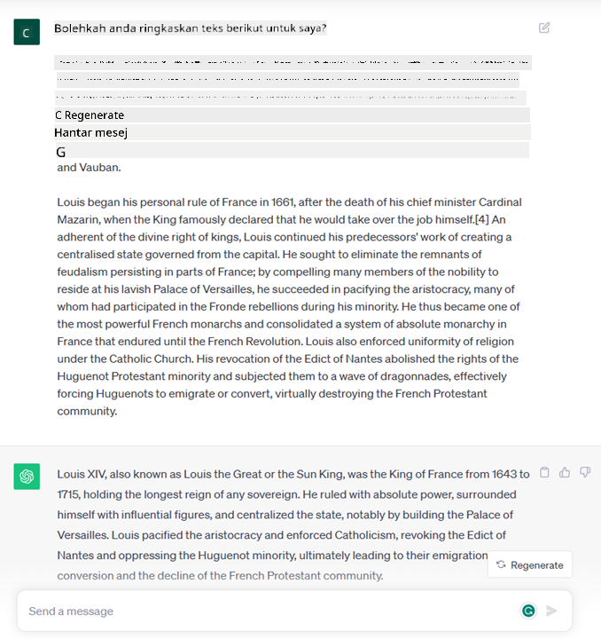
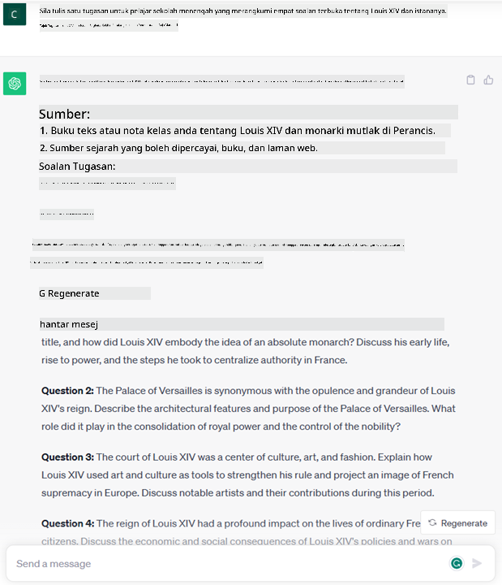
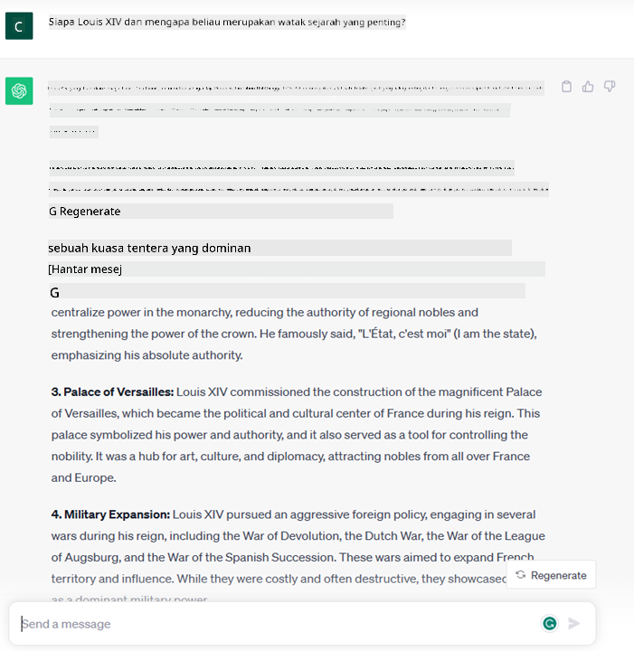

<!--
CO_OP_TRANSLATOR_METADATA:
{
  "original_hash": "bfb7901bdbece1ba3e9f35c400ca33e8",
  "translation_date": "2025-10-17T20:58:14+00:00",
  "source_file": "01-introduction-to-genai/README.md",
  "language_code": "ms"
}
-->
# Pengenalan kepada AI Generatif dan Model Bahasa Besar

_(Klik imej di atas untuk menonton video pelajaran ini)_

AI Generatif adalah kecerdasan buatan yang mampu menghasilkan teks, imej, dan jenis kandungan lain. Apa yang menjadikannya teknologi yang hebat adalah ia mendemokrasikan AI, sesiapa sahaja boleh menggunakannya hanya dengan arahan teks, satu ayat yang ditulis dalam bahasa semula jadi. Anda tidak perlu mempelajari bahasa seperti Java atau SQL untuk mencapai sesuatu yang bernilai, anda hanya perlu menggunakan bahasa anda, nyatakan apa yang anda mahukan dan AI akan memberikan cadangan. Aplikasi dan impaknya sangat besar, anda boleh menulis atau memahami laporan, menulis aplikasi, dan banyak lagi, semuanya dalam beberapa saat.

Dalam kurikulum ini, kita akan meneroka bagaimana startup kita memanfaatkan AI generatif untuk membuka senario baru dalam dunia pendidikan dan bagaimana kita menangani cabaran yang tidak dapat dielakkan berkaitan dengan implikasi sosial penggunaannya dan batasan teknologi.

## Pengenalan

Pelajaran ini akan merangkumi:

- Pengenalan kepada senario perniagaan: idea dan misi startup kita.
- AI Generatif dan bagaimana kita sampai kepada landskap teknologi semasa.
- Cara kerja dalaman model bahasa besar.
- Keupayaan utama dan kes penggunaan praktikal Model Bahasa Besar.

## Matlamat Pembelajaran

Selepas menyelesaikan pelajaran ini, anda akan memahami:

- Apa itu AI generatif dan bagaimana Model Bahasa Besar berfungsi.
- Bagaimana anda boleh memanfaatkan model bahasa besar untuk pelbagai kes penggunaan, dengan fokus pada senario pendidikan.

## Senario: startup pendidikan kita

Kecerdasan Buatan Generatif (AI) mewakili puncak teknologi AI, mendorong batasan apa yang pernah dianggap mustahil. Model AI generatif mempunyai beberapa keupayaan dan aplikasi, tetapi untuk kurikulum ini kita akan meneroka bagaimana ia merevolusikan pendidikan melalui sebuah startup fiksyen. Kita akan merujuk kepada startup ini sebagai _startup kita_. Startup kita beroperasi dalam domain pendidikan dengan misi yang bercita-cita tinggi:

> _meningkatkan aksesibiliti dalam pembelajaran, di peringkat global, memastikan akses pendidikan yang adil dan menyediakan pengalaman pembelajaran yang diperibadikan kepada setiap pelajar, mengikut keperluan mereka_.

Pasukan startup kita sedar bahawa kita tidak akan dapat mencapai matlamat ini tanpa memanfaatkan salah satu alat paling berkuasa zaman moden – Model Bahasa Besar (LLMs).

AI generatif dijangka merevolusikan cara kita belajar dan mengajar hari ini, dengan pelajar mempunyai guru maya yang tersedia 24 jam sehari yang menyediakan sejumlah besar maklumat dan contoh, dan guru dapat memanfaatkan alat inovatif untuk menilai pelajar mereka dan memberikan maklum balas.

Untuk memulakan, mari kita definisikan beberapa konsep asas dan istilah yang akan kita gunakan sepanjang kurikulum ini.

## Bagaimana kita mendapat AI Generatif?

Walaupun _hype_ luar biasa yang dicipta baru-baru ini oleh pengumuman model AI generatif, teknologi ini telah dibangunkan selama beberapa dekad, dengan usaha penyelidikan pertama bermula pada tahun 60-an. Kita kini berada pada titik di mana AI mempunyai keupayaan kognitif manusia, seperti perbualan seperti yang ditunjukkan oleh [OpenAI ChatGPT](https://openai.com/chatgpt) atau [Bing Chat](https://www.microsoft.com/edge/features/bing-chat?WT.mc_id=academic-105485-koreyst), yang juga menggunakan model GPT untuk perbualan carian web Bing.

Melihat kembali, prototaip pertama AI terdiri daripada chatbot bertulis, bergantung pada pangkalan pengetahuan yang diekstrak daripada sekumpulan pakar dan diwakili dalam komputer. Jawapan dalam pangkalan pengetahuan dicetuskan oleh kata kunci yang muncul dalam teks input. 
Namun, tidak lama kemudian menjadi jelas bahawa pendekatan seperti itu, menggunakan chatbot bertulis, tidak dapat berkembang dengan baik.

### Pendekatan statistik kepada AI: Pembelajaran Mesin

Titik perubahan tiba pada tahun 90-an, dengan penerapan pendekatan statistik kepada analisis teks. Ini membawa kepada pembangunan algoritma baru – dikenali sebagai pembelajaran mesin – yang mampu mempelajari pola daripada data tanpa diprogramkan secara eksplisit. Pendekatan ini membolehkan mesin mensimulasikan pemahaman bahasa manusia: model statistik dilatih pada pasangan teks-label, membolehkan model mengklasifikasikan teks input yang tidak diketahui dengan label yang telah ditentukan yang mewakili niat mesej.

### Rangkaian neural dan pembantu maya moden

Dalam beberapa tahun kebelakangan ini, evolusi teknologi perkakasan, yang mampu menangani jumlah data yang lebih besar dan pengiraan yang lebih kompleks, mendorong penyelidikan dalam AI, membawa kepada pembangunan algoritma pembelajaran mesin yang maju yang dikenali sebagai rangkaian neural atau algoritma pembelajaran mendalam.

Rangkaian neural (dan khususnya Rangkaian Neural Berulang – RNNs) secara signifikan meningkatkan pemprosesan bahasa semula jadi, membolehkan perwakilan makna teks dengan cara yang lebih bermakna, menghargai konteks perkataan dalam ayat.

Ini adalah teknologi yang menggerakkan pembantu maya yang lahir dalam dekad pertama abad baru, sangat mahir dalam mentafsirkan bahasa manusia, mengenal pasti keperluan, dan melaksanakan tindakan untuk memenuhinya – seperti menjawab dengan skrip yang telah ditentukan atau menggunakan perkhidmatan pihak ketiga.

### Hari ini, AI Generatif

Jadi begitulah kita sampai kepada AI Generatif hari ini, yang boleh dilihat sebagai subset pembelajaran mendalam.

Selepas beberapa dekad penyelidikan dalam bidang AI, seni bina model baru – yang dipanggil _Transformer_ – mengatasi batasan RNNs, mampu menerima urutan teks yang jauh lebih panjang sebagai input. Transformer berdasarkan mekanisme perhatian, membolehkan model memberikan berat yang berbeza kepada input yang diterima, ‘memberi perhatian lebih’ di mana maklumat yang paling relevan tertumpu, tanpa mengira susunan mereka dalam urutan teks.

Kebanyakan model AI generatif terkini – juga dikenali sebagai Model Bahasa Besar (LLMs), kerana mereka bekerja dengan input dan output teks – memang berdasarkan seni bina ini. Apa yang menarik tentang model ini – dilatih pada sejumlah besar data tanpa label dari pelbagai sumber seperti buku, artikel dan laman web – adalah bahawa mereka boleh disesuaikan dengan pelbagai tugas dan menghasilkan teks yang betul secara tatabahasa dengan sedikit kreativiti. Jadi, bukan sahaja mereka meningkatkan kapasiti mesin untuk ‘memahami’ teks input dengan luar biasa, tetapi mereka juga membolehkan kapasiti mereka untuk menghasilkan respons asli dalam bahasa manusia.

## Bagaimana model bahasa besar berfungsi?

Dalam bab seterusnya kita akan meneroka pelbagai jenis model AI Generatif, tetapi buat masa ini mari kita lihat bagaimana model bahasa besar berfungsi, dengan fokus pada model OpenAI GPT (Generative Pre-trained Transformer).

- **Tokenizer, teks kepada nombor**: Model Bahasa Besar menerima teks sebagai input dan menghasilkan teks sebagai output. Walau bagaimanapun, sebagai model statistik, mereka berfungsi lebih baik dengan nombor daripada urutan teks. Itulah sebabnya setiap input kepada model diproses oleh tokenizer, sebelum digunakan oleh model teras. Token adalah bahagian teks – terdiri daripada bilangan aksara yang berubah-ubah, jadi tugas utama tokenizer adalah membahagikan input kepada array token. Kemudian, setiap token dipetakan dengan indeks token, yang merupakan pengekodan integer bagi bahagian teks asal.

- **Meramalkan token output**: Diberikan n token sebagai input (dengan maksimum n berbeza dari satu model ke model lain), model mampu meramalkan satu token sebagai output. Token ini kemudian dimasukkan ke dalam input iterasi seterusnya, dalam corak tingkap yang berkembang, membolehkan pengalaman pengguna yang lebih baik untuk mendapatkan satu (atau beberapa) ayat sebagai jawapan. Ini menjelaskan mengapa, jika anda pernah bermain dengan ChatGPT, anda mungkin perasan bahawa kadang-kadang ia kelihatan seperti berhenti di tengah-tengah ayat.

- **Proses pemilihan, pengagihan kebarangkalian**: Token output dipilih oleh model mengikut kebarangkalian ia berlaku selepas urutan teks semasa. Ini kerana model meramalkan pengagihan kebarangkalian ke atas semua ‘token seterusnya’ yang mungkin, dikira berdasarkan latihannya. Walau bagaimanapun, tidak selalu token dengan kebarangkalian tertinggi dipilih daripada pengagihan yang terhasil. Tahap keacakan ditambahkan kepada pilihan ini, dengan cara model bertindak secara tidak deterministik - kita tidak mendapat output yang sama untuk input yang sama. Tahap keacakan ini ditambahkan untuk mensimulasikan proses pemikiran kreatif dan ia boleh disesuaikan menggunakan parameter model yang dipanggil suhu.

## Bagaimana startup kita boleh memanfaatkan Model Bahasa Besar?

Sekarang kita mempunyai pemahaman yang lebih baik tentang cara kerja dalaman model bahasa besar, mari kita lihat beberapa contoh praktikal tugas yang paling biasa mereka boleh lakukan dengan baik, dengan fokus kepada senario perniagaan kita. 
Kita berkata bahawa keupayaan utama Model Bahasa Besar adalah _menghasilkan teks dari awal, bermula dari input teks, yang ditulis dalam bahasa semula jadi_.

Tetapi jenis input dan output teks apa?
Input model bahasa besar dikenali sebagai prompt, manakala output dikenali sebagai completion, istilah yang merujuk kepada mekanisme model untuk menghasilkan token seterusnya untuk melengkapkan input semasa. Kita akan mendalami apa itu prompt dan bagaimana merancangnya dengan cara untuk mendapatkan yang terbaik daripada model kita. Tetapi buat masa ini, mari kita katakan bahawa prompt mungkin termasuk:

- **Arahan** yang menentukan jenis output yang kita harapkan daripada model. Arahan ini kadang-kadang mungkin mengandungi beberapa contoh atau data tambahan.

  1. Ringkasan artikel, buku, ulasan produk dan banyak lagi, bersama dengan pengekstrakan pandangan daripada data tidak berstruktur.
    
    
  
  2. Ideasi kreatif dan reka bentuk artikel, esei, tugasan atau lebih lagi.
      
     

- **Soalan**, yang ditanya dalam bentuk perbualan dengan agen.
  
  

- Bahagian **teks untuk dilengkapkan**, yang secara tidak langsung adalah permintaan untuk bantuan penulisan.
  
  

- Bahagian **kod** bersama dengan permintaan untuk menjelaskan dan mendokumentasikannya, atau komen yang meminta untuk menghasilkan sekeping kod yang melaksanakan tugas tertentu.
  
  

Contoh di atas agak mudah dan tidak bertujuan untuk menjadi demonstrasi menyeluruh keupayaan Model Bahasa Besar. Mereka bertujuan untuk menunjukkan potensi menggunakan AI generatif, khususnya tetapi tidak terhad kepada konteks pendidikan.

Selain itu, output model AI generatif tidak sempurna dan kadang-kadang kreativiti model boleh menjadi kelemahan, menghasilkan output yang merupakan gabungan perkataan yang pengguna manusia boleh tafsirkan sebagai penyimpangan realiti, atau ia boleh menjadi ofensif. AI generatif bukanlah pintar - sekurang-kurangnya dalam definisi kecerdasan yang lebih komprehensif, termasuk penaakulan kritikal dan kreatif atau kecerdasan emosi; ia tidak deterministik, dan ia tidak boleh dipercayai, kerana fabrikasi, seperti rujukan, kandungan, dan kenyataan yang salah, mungkin digabungkan dengan maklumat yang betul, dan disampaikan dengan cara yang meyakinkan dan yakin. Dalam pelajaran berikut, kita akan menangani semua batasan ini dan kita akan melihat apa yang boleh kita lakukan untuk mengurangkannya.

## Tugasan

Tugasan anda adalah untuk membaca lebih lanjut tentang [AI generatif](https://en.wikipedia.org/wiki/Generative_artificial_intelligence?WT.mc_id=academic-105485-koreyst) dan cuba mengenal pasti kawasan di mana anda akan menambah AI generatif hari ini yang belum memilikinya. Bagaimana impaknya berbeza daripada melakukannya dengan cara "lama", adakah anda boleh melakukan sesuatu yang tidak boleh dilakukan sebelum ini, atau adakah anda lebih pantas? Tulis ringkasan 300 perkataan tentang bagaimana rupa startup AI impian anda dan sertakan tajuk seperti "Masalah", "Bagaimana saya akan menggunakan AI", "Impak" dan secara opsional pelan perniagaan.

Jika anda melakukan tugas ini, anda mungkin sudah bersedia untuk memohon ke inkubator Microsoft, [Microsoft for Startups Founders Hub](https://www.microsoft.com/startups?WT.mc_id=academic-105485-koreyst) kami menawarkan kredit untuk Azure, OpenAI, bimbingan dan banyak lagi, periksa ia!

## Ujian Pengetahuan

Apa yang benar tentang model bahasa besar?

1. Anda mendapat respons yang sama setiap kali.
1. Ia melakukan perkara dengan sempurna, hebat dalam menambah nombor, menghasilkan kod yang berfungsi dll.
1. Respons mungkin berbeza walaupun menggunakan prompt yang sama. Ia juga hebat dalam memberikan anda draf pertama sesuatu, sama ada teks atau kod. Tetapi anda perlu memperbaiki hasilnya.

A: 3, LLM adalah tidak deterministik, respons berbeza, walau bagaimanapun, anda boleh mengawal variansnya melalui tetapan suhu. Anda juga tidak sepatutnya mengharapkan ia melakukan perkara dengan sempurna, ia di sini untuk melakukan kerja berat untuk anda yang sering bermaksud anda mendapat percubaan pertama yang baik untuk sesuatu yang perlu anda tingkatkan secara beransur-ansur.

## Kerja Hebat! Teruskan Perjalanan

Selepas menyelesaikan pelajaran ini, lihat [koleksi Pembelajaran AI Generatif kami](https://aka.ms/genai-collection?WT.mc_id=academic-105485-koreyst) untuk terus meningkatkan pengetahuan AI Generatif anda!
Pergi ke Pelajaran 2 di mana kita akan melihat cara [meneroka dan membandingkan pelbagai jenis LLM](../02-exploring-and-comparing-different-llms/README.md?WT.mc_id=academic-105485-koreyst)!

---

**Penafian**:  
Dokumen ini telah diterjemahkan menggunakan perkhidmatan terjemahan AI [Co-op Translator](https://github.com/Azure/co-op-translator). Walaupun kami berusaha untuk ketepatan, sila ambil perhatian bahawa terjemahan automatik mungkin mengandungi kesilapan atau ketidaktepatan. Dokumen asal dalam bahasa asalnya harus dianggap sebagai sumber yang berwibawa. Untuk maklumat penting, terjemahan manusia profesional adalah disyorkan. Kami tidak bertanggungjawab atas sebarang salah faham atau salah tafsir yang timbul daripada penggunaan terjemahan ini.