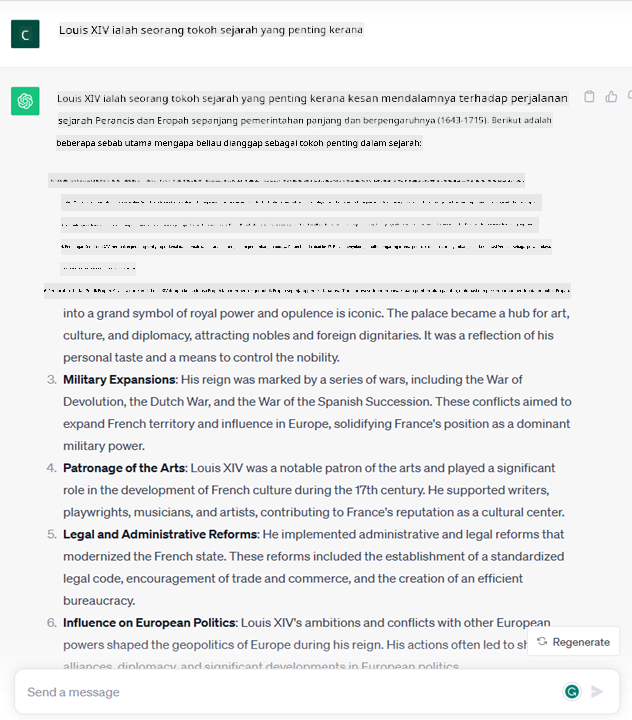

<!--
CO_OP_TRANSLATOR_METADATA:
{
  "original_hash": "f53ba0fa49164f9323043f1c6b11f2b1",
  "translation_date": "2025-07-09T07:58:36+00:00",
  "source_file": "01-introduction-to-genai/README.md",
  "language_code": "ms"
}
-->
# Pengenalan kepada Generative AI dan Large Language Models

_(Klik imej di atas untuk menonton video pelajaran ini)_

Generative AI adalah kecerdasan buatan yang mampu menghasilkan teks, imej dan jenis kandungan lain. Apa yang menjadikannya teknologi hebat adalah ia mendemokrasikan AI, sesiapa sahaja boleh menggunakannya hanya dengan arahan teks ringkas, satu ayat yang ditulis dalam bahasa semula jadi. Anda tidak perlu belajar bahasa pengaturcaraan seperti Java atau SQL untuk mencapai sesuatu yang bermakna, apa yang anda perlukan hanyalah menggunakan bahasa anda, nyatakan apa yang anda mahu dan keluar cadangan daripada model AI. Aplikasi dan impaknya sangat besar, anda boleh menulis atau memahami laporan, menulis permohonan dan banyak lagi, semua dalam beberapa saat.

Dalam kurikulum ini, kita akan meneroka bagaimana startup kami menggunakan generative AI untuk membuka senario baru dalam dunia pendidikan dan bagaimana kami menangani cabaran yang tidak dapat dielakkan berkaitan dengan implikasi sosial penggunaannya serta had teknologi.

## Pengenalan

Pelajaran ini akan merangkumi:

- Pengenalan kepada senario perniagaan: idea dan misi startup kami.
- Generative AI dan bagaimana kami sampai ke landskap teknologi semasa.
- Cara kerja dalaman model bahasa besar.
- Keupayaan utama dan kes penggunaan praktikal Large Language Models.

## Matlamat Pembelajaran

Selepas menamatkan pelajaran ini, anda akan memahami:

- Apa itu generative AI dan bagaimana Large Language Models berfungsi.
- Bagaimana anda boleh memanfaatkan large language models untuk pelbagai kegunaan, dengan fokus pada senario pendidikan.

## Senario: startup pendidikan kami

Generative Artificial Intelligence (AI) mewakili kemuncak teknologi AI, menolak batasan apa yang pernah dianggap mustahil. Model generative AI mempunyai beberapa keupayaan dan aplikasi, tetapi untuk kurikulum ini kita akan meneroka bagaimana ia merevolusikan pendidikan melalui sebuah startup rekaan. Kita akan merujuk kepada startup ini sebagai _startup kami_. Startup kami beroperasi dalam domain pendidikan dengan pernyataan misi yang bercita-cita tinggi:

> _meningkatkan aksesibiliti dalam pembelajaran, di peringkat global, memastikan akses pendidikan yang adil dan menyediakan pengalaman pembelajaran yang diperibadikan kepada setiap pelajar, mengikut keperluan mereka_.

Pasukan startup kami sedar bahawa kami tidak akan dapat mencapai matlamat ini tanpa memanfaatkan salah satu alat paling berkuasa pada zaman moden – Large Language Models (LLMs).

Generative AI dijangka merevolusikan cara kita belajar dan mengajar hari ini, dengan pelajar mempunyai guru maya 24 jam sehari yang menyediakan maklumat dan contoh yang banyak, dan guru dapat menggunakan alat inovatif untuk menilai pelajar mereka dan memberikan maklum balas.

Untuk memulakan, mari kita definisikan beberapa konsep asas dan istilah yang akan kita gunakan sepanjang kurikulum.

## Bagaimana kita mendapat Generative AI?

Walaupun _hype_ luar biasa yang dicipta baru-baru ini oleh pengumuman model generative AI, teknologi ini telah dibangunkan selama beberapa dekad, dengan usaha penyelidikan pertama bermula pada tahun 60-an. Kini kita berada pada tahap AI yang mempunyai keupayaan kognitif manusia, seperti perbualan yang ditunjukkan oleh contohnya [OpenAI ChatGPT](https://openai.com/chatgpt) atau [Bing Chat](https://www.microsoft.com/edge/features/bing-chat?WT.mc_id=academic-105485-koreyst), yang juga menggunakan model GPT untuk perbualan carian web Bing.

Kembali sedikit, prototaip AI pertama terdiri daripada chatbot bertulis, bergantung pada pangkalan pengetahuan yang diekstrak daripada sekumpulan pakar dan diwakili dalam komputer. Jawapan dalam pangkalan pengetahuan dicetuskan oleh kata kunci yang muncul dalam teks input. Namun, ia segera menjadi jelas bahawa pendekatan seperti ini, menggunakan chatbot bertulis, tidak dapat diskalakan dengan baik.

### Pendekatan statistik kepada AI: Pembelajaran Mesin

Titik perubahan berlaku pada tahun 90-an, dengan penerapan pendekatan statistik kepada analisis teks. Ini membawa kepada pembangunan algoritma baru – dikenali sebagai pembelajaran mesin – yang mampu mempelajari corak daripada data tanpa diprogram secara eksplisit. Pendekatan ini membolehkan mesin mensimulasikan pemahaman bahasa manusia: model statistik dilatih pada pasangan teks-label, membolehkan model mengklasifikasikan teks input yang tidak diketahui dengan label yang telah ditetapkan mewakili niat mesej.

### Rangkaian neural dan pembantu maya moden

Dalam beberapa tahun kebelakangan ini, evolusi teknologi perkakasan yang mampu mengendalikan jumlah data yang lebih besar dan pengiraan yang lebih kompleks, menggalakkan penyelidikan dalam AI, membawa kepada pembangunan algoritma pembelajaran mesin maju yang dikenali sebagai rangkaian neural atau algoritma pembelajaran mendalam.

Rangkaian neural (terutamanya Recurrent Neural Networks – RNNs) meningkatkan pemprosesan bahasa semula jadi dengan ketara, membolehkan perwakilan makna teks dengan cara yang lebih bermakna, menghargai konteks sesuatu perkataan dalam ayat.

Inilah teknologi yang menggerakkan pembantu maya yang lahir pada dekad pertama abad baru, sangat mahir dalam mentafsir bahasa manusia, mengenal pasti keperluan, dan melakukan tindakan untuk memenuhinya – seperti menjawab dengan skrip yang telah ditetapkan atau menggunakan perkhidmatan pihak ketiga.

### Masa kini, Generative AI

Begitulah cara kita sampai ke Generative AI hari ini, yang boleh dilihat sebagai subset pembelajaran mendalam.

Selepas beberapa dekad penyelidikan dalam bidang AI, satu seni bina model baru – dipanggil _Transformer_ – mengatasi had RNN, mampu menerima urutan teks yang jauh lebih panjang sebagai input. Transformer berdasarkan mekanisme perhatian, membolehkan model memberi berat berbeza kepada input yang diterima, ‘memberi perhatian lebih’ di mana maklumat paling relevan tertumpu, tanpa mengira susunan dalam urutan teks.

Kebanyakan model generative AI terkini – juga dikenali sebagai Large Language Models (LLMs), kerana mereka bekerja dengan input dan output teks – memang berdasarkan seni bina ini. Apa yang menarik tentang model ini – dilatih pada sejumlah besar data tanpa label dari pelbagai sumber seperti buku, artikel dan laman web – adalah mereka boleh disesuaikan untuk pelbagai tugas dan menghasilkan teks yang betul dari segi tatabahasa dengan sedikit kreativiti. Jadi, bukan sahaja mereka meningkatkan keupayaan mesin untuk ‘memahami’ teks input, tetapi juga membolehkan mereka menghasilkan respons asli dalam bahasa manusia.

## Bagaimana large language models berfungsi?

Dalam bab seterusnya kita akan meneroka pelbagai jenis model Generative AI, tetapi buat masa ini mari kita lihat bagaimana large language models berfungsi, dengan fokus pada model OpenAI GPT (Generative Pre-trained Transformer).

- **Tokenizer, teks kepada nombor**: Large Language Models menerima teks sebagai input dan menghasilkan teks sebagai output. Namun, sebagai model statistik, mereka berfungsi lebih baik dengan nombor berbanding urutan teks. Oleh itu, setiap input kepada model diproses oleh tokenizer sebelum digunakan oleh model teras. Token adalah sekeping teks – terdiri daripada bilangan aksara yang berubah-ubah, jadi tugas utama tokenizer adalah memecahkan input kepada susunan token. Kemudian, setiap token dipetakan dengan indeks token, iaitu pengekodan integer bagi sekeping teks asal.

- **Meramalkan token output**: Diberi n token sebagai input (dengan max n berbeza antara model), model mampu meramalkan satu token sebagai output. Token ini kemudian dimasukkan ke dalam input bagi iterasi seterusnya, dalam corak tetingkap yang berkembang, membolehkan pengalaman pengguna yang lebih baik dengan mendapatkan satu (atau beberapa) ayat sebagai jawapan. Ini menjelaskan mengapa, jika anda pernah bermain dengan ChatGPT, anda mungkin perasan kadang-kadang ia berhenti di tengah ayat.

- **Proses pemilihan, taburan kebarangkalian**: Token output dipilih oleh model mengikut kebarangkalian kemunculannya selepas urutan teks semasa. Ini kerana model meramalkan taburan kebarangkalian ke atas semua ‘token seterusnya’ yang mungkin, dikira berdasarkan latihan model. Namun, tidak semestinya token dengan kebarangkalian tertinggi dipilih daripada taburan tersebut. Tahap rawak ditambah kepada pilihan ini, supaya model bertindak secara tidak deterministik – kita tidak mendapat output yang sama tepat untuk input yang sama. Tahap rawak ini ditambah untuk mensimulasikan proses pemikiran kreatif dan boleh dilaras menggunakan parameter model yang dipanggil temperature.

## Bagaimana startup kami boleh memanfaatkan Large Language Models?

Sekarang kita sudah memahami cara kerja dalaman large language model, mari lihat beberapa contoh praktikal tugas yang paling biasa mereka boleh lakukan dengan baik, dengan fokus pada senario perniagaan kami. Kita katakan keupayaan utama Large Language Model adalah _menghasilkan teks dari awal, bermula dengan input teks yang ditulis dalam bahasa semula jadi_.

Tetapi jenis input dan output teks apa?
Input kepada large language model dikenali sebagai prompt, manakala output dikenali sebagai completion, istilah yang merujuk kepada mekanisme model menghasilkan token seterusnya untuk melengkapkan input semasa. Kita akan mendalami apa itu prompt dan bagaimana mereka bentuknya supaya dapat memanfaatkan model dengan sebaiknya. Tetapi buat masa ini, katakanlah prompt mungkin termasuk:

- **Arahan** yang menentukan jenis output yang kita jangkakan daripada model. Arahan ini kadang-kadang mungkin mengandungi beberapa contoh atau data tambahan.

  1. Ringkasan artikel, buku, ulasan produk dan lain-lain, bersama dengan pengekstrakan maklumat daripada data tidak berstruktur.
    
    
  
  2. Idea kreatif dan reka bentuk artikel, esei, tugasan atau lebih.
      
     

- **Soalan**, diajukan dalam bentuk perbualan dengan agen.
  
  

- Sekeping **teks untuk dilengkapkan**, yang secara tersirat adalah permintaan bantuan menulis.
  
  

- Sekeping **kod** bersama permintaan untuk menerangkan dan mendokumentasikannya, atau komen yang meminta untuk menjana kod yang melakukan tugas tertentu.
  
  

Contoh-contoh di atas agak mudah dan tidak bertujuan untuk menunjukkan sepenuhnya keupayaan Large Language Models. Ia bertujuan untuk menunjukkan potensi penggunaan generative AI, khususnya tetapi tidak terhad kepada konteks pendidikan.

Juga, output model generative AI tidak sempurna dan kadang-kadang kreativiti model boleh menjadi kelemahan, menghasilkan output yang merupakan gabungan perkataan yang pengguna manusia boleh tafsir sebagai kekeliruan realiti, atau boleh menjadi menyinggung. Generative AI bukanlah pintar – sekurang-kurangnya dalam definisi kecerdasan yang lebih menyeluruh, termasuk pemikiran kritikal dan kreatif atau kecerdasan emosi; ia tidak deterministik, dan tidak boleh dipercayai, kerana rekaan seperti rujukan, kandungan dan kenyataan yang salah boleh digabungkan dengan maklumat betul dan dipersembahkan dengan cara yang meyakinkan dan yakin. Dalam pelajaran seterusnya, kita akan menangani semua had ini dan melihat apa yang boleh kita lakukan untuk mengurangkannya.

## Tugasan

Tugasan anda adalah untuk membaca lebih lanjut mengenai [generative AI](https://en.wikipedia.org/wiki/Generative_artificial_intelligence?WT.mc_id=academic-105485-koreyst) dan cuba kenal pasti satu bidang di mana anda akan menambah generative AI hari ini yang belum menggunakannya. Bagaimana impaknya berbeza daripada cara “lama”, bolehkah anda melakukan sesuatu yang sebelum ini tidak boleh, atau adakah anda lebih pantas? Tulis ringkasan 300 patah perkataan tentang bagaimana startup AI impian anda akan kelihatan dan sertakan tajuk seperti "Masalah", "Bagaimana Saya Akan Menggunakan AI", "Impak" dan secara pilihan rancangan perniagaan.

Jika anda melakukan tugasan ini, anda mungkin sudah bersedia untuk memohon ke inkubator Microsoft, [Microsoft for Startups Founders Hub](https://www.microsoft.com/startups?WT.mc_id=academic-105485-koreyst) kami menawarkan kredit untuk Azure, OpenAI, bimbingan dan banyak lagi, cuba lihat!

## Semakan Pengetahuan

Apa yang benar tentang large language models?

1. Anda mendapat respons yang sama tepat setiap kali.
1. Ia melakukan perkara dengan sempurna, hebat dalam menambah nombor, menghasilkan kod yang berfungsi dan sebagainya.
1. Respons mungkin berbeza walaupun menggunakan prompt yang sama. Ia juga hebat untuk memberikan draf pertama sesuatu, sama ada teks atau kod. Tetapi anda perlu memperbaiki hasilnya.

A: 3, LLM adalah tidak deterministik, respons berbeza-beza, namun anda boleh mengawal variansnya melalui tetapan temperature. Anda juga tidak seharusnya mengharapkan ia melakukan perkara dengan sempurna, ia di sini untuk melakukan kerja berat bagi anda yang sering bermakna anda mendapat percubaan pertama yang baik yang perlu anda perbaiki secara berperingkat.

## Kerja Hebat! Teruskan Perjalanan

Selepas menamatkan pelajaran ini, lihat koleksi [Generative AI Learning](https://aka.ms/genai-collection?WT.mc_id=academic-105485-koreyst) kami untuk terus meningkatkan pengetahuan Generative AI anda!
Teruskan ke Pelajaran 2 di mana kita akan melihat cara untuk [meneroka dan membandingkan pelbagai jenis LLM](../02-exploring-and-comparing-different-llms/README.md?WT.mc_id=academic-105485-koreyst)!

**Penafian**:  
Dokumen ini telah diterjemahkan menggunakan perkhidmatan terjemahan AI [Co-op Translator](https://github.com/Azure/co-op-translator). Walaupun kami berusaha untuk ketepatan, sila ambil maklum bahawa terjemahan automatik mungkin mengandungi kesilapan atau ketidaktepatan. Dokumen asal dalam bahasa asalnya harus dianggap sebagai sumber yang sahih. Untuk maklumat penting, terjemahan profesional oleh manusia adalah disyorkan. Kami tidak bertanggungjawab atas sebarang salah faham atau salah tafsir yang timbul daripada penggunaan terjemahan ini.