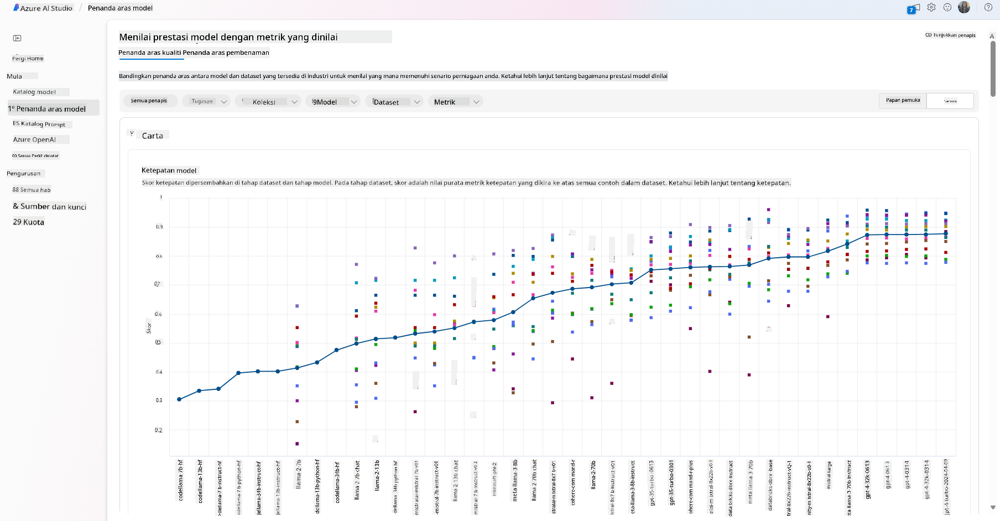
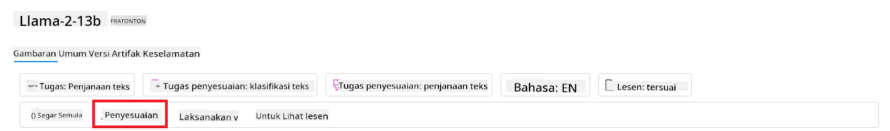
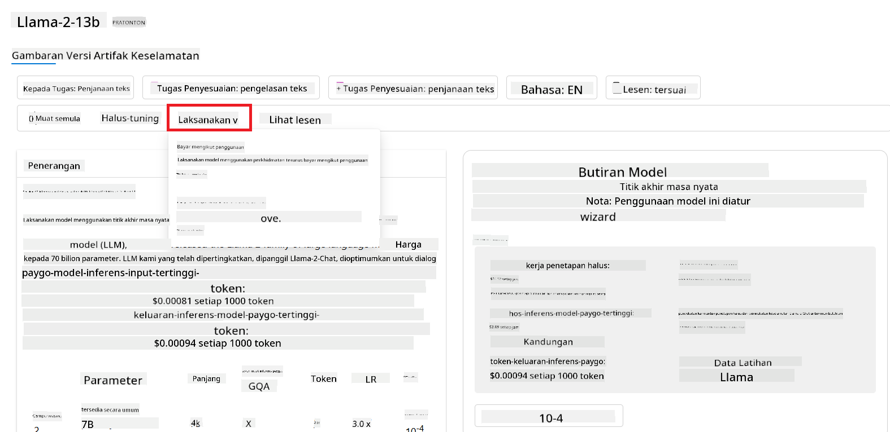
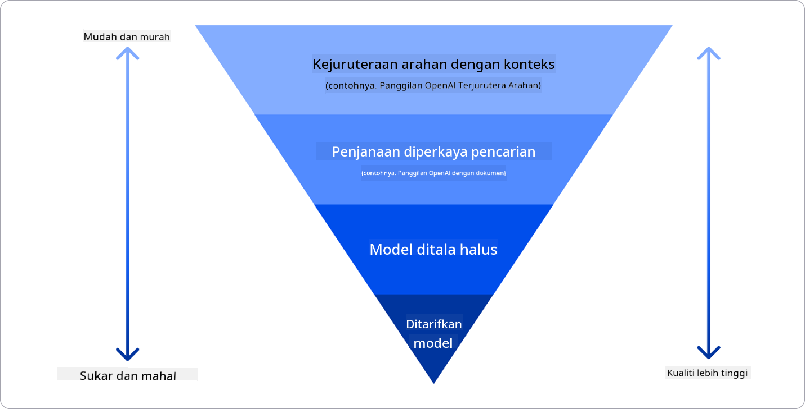

<!--
CO_OP_TRANSLATOR_METADATA:
{
  "original_hash": "e2f686f2eb794941761252ac5e8e090b",
  "translation_date": "2025-05-19T14:14:48+00:00",
  "source_file": "02-exploring-and-comparing-different-llms/README.md",
  "language_code": "ms"
}
-->
# Meneroka dan Membandingkan Pelbagai LLM

> _Klik gambar di atas untuk menonton video pelajaran ini_

Dalam pelajaran sebelumnya, kita telah melihat bagaimana AI Generatif mengubah landskap teknologi, bagaimana Model Bahasa Besar (LLMs) berfungsi dan bagaimana sebuah perniagaan - seperti syarikat permulaan kita - dapat menggunakannya untuk kes penggunaan mereka dan berkembang! Dalam bab ini, kita akan membandingkan dan membezakan pelbagai jenis model bahasa besar (LLMs) untuk memahami kelebihan dan kekurangan mereka.

Langkah seterusnya dalam perjalanan syarikat permulaan kita adalah meneroka landskap semasa LLMs dan memahami mana yang sesuai untuk kes penggunaan kita.

## Pengenalan

Pelajaran ini akan merangkumi:

- Pelbagai jenis LLMs dalam landskap semasa.
- Ujian, iterasi, dan perbandingan model yang berbeza untuk kes penggunaan anda di Azure.
- Bagaimana untuk melancarkan LLM.

## Matlamat Pembelajaran

Selepas menyelesaikan pelajaran ini, anda akan dapat:

- Memilih model yang tepat untuk kes penggunaan anda.
- Memahami cara menguji, mengulangi, dan meningkatkan prestasi model anda.
- Mengetahui bagaimana perniagaan melancarkan model.

## Memahami Pelbagai Jenis LLMs

LLMs boleh mempunyai pelbagai pengkategorian berdasarkan seni bina, data latihan, dan kes penggunaan mereka. Memahami perbezaan ini akan membantu syarikat permulaan kita memilih model yang tepat untuk senario, dan memahami cara menguji, mengulangi, dan meningkatkan prestasi.

Terdapat banyak jenis model LLM yang berbeza, pilihan anda bergantung pada apa yang anda ingin gunakan, data anda, berapa banyak yang anda sanggup bayar dan banyak lagi.

Bergantung pada jika anda ingin menggunakan model untuk teks, audio, video, penjanaan imej dan sebagainya, anda mungkin memilih jenis model yang berbeza.

- **Pengiktirafan audio dan pertuturan**. Untuk tujuan ini, model jenis Whisper adalah pilihan yang hebat kerana ia adalah serba guna dan ditujukan kepada pengiktirafan pertuturan. Ia dilatih pada audio yang pelbagai dan dapat melakukan pengiktirafan pertuturan pelbagai bahasa. Ketahui lebih lanjut mengenai [model jenis Whisper di sini](https://platform.openai.com/docs/models/whisper?WT.mc_id=academic-105485-koreyst).

- **Penjanaan imej**. Untuk penjanaan imej, DALL-E dan Midjourney adalah dua pilihan yang sangat terkenal. DALL-E ditawarkan oleh Azure OpenAI. [Baca lebih lanjut mengenai DALL-E di sini](https://platform.openai.com/docs/models/dall-e?WT.mc_id=academic-105485-koreyst) dan juga dalam Bab 9 kurikulum ini.

- **Penjanaan teks**. Kebanyakan model dilatih pada penjanaan teks dan anda mempunyai pelbagai pilihan dari GPT-3.5 hingga GPT-4. Mereka datang dengan kos yang berbeza dengan GPT-4 menjadi yang paling mahal. Ia berbaloi untuk melihat [Azure OpenAI playground](https://oai.azure.com/portal/playground?WT.mc_id=academic-105485-koreyst) untuk menilai model mana yang paling sesuai dengan keperluan anda dari segi kemampuan dan kos.

- **Multi-modality**. Jika anda ingin menangani pelbagai jenis data dalam input dan output, anda mungkin ingin melihat model seperti [gpt-4 turbo dengan penglihatan atau gpt-4o](https://learn.microsoft.com/azure/ai-services/openai/concepts/models#gpt-4-and-gpt-4-turbo-models?WT.mc_id=academic-105485-koreyst) - keluaran terbaru model OpenAI - yang mampu menggabungkan pemprosesan bahasa semula jadi dengan pemahaman visual, membolehkan interaksi melalui antara muka multi-modal.

Memilih model bermakna anda mendapat beberapa kemampuan asas, yang mungkin tidak mencukupi. Seringkali anda mempunyai data khusus syarikat yang perlu anda beritahu LLM tentang. Terdapat beberapa pilihan berbeza tentang cara mendekatinya, lebih lanjut mengenai itu dalam bahagian seterusnya.

### Model Asas berbanding LLMs

Istilah Model Asas telah [dicipta oleh penyelidik Stanford](https://arxiv.org/abs/2108.07258?WT.mc_id=academic-105485-koreyst) dan ditakrifkan sebagai model AI yang mengikuti beberapa kriteria, seperti:

- **Mereka dilatih menggunakan pembelajaran tanpa penyeliaan atau pembelajaran kendiri**, bermakna mereka dilatih pada data multi-modal tanpa label, dan mereka tidak memerlukan anotasi manusia atau pelabelan data untuk proses latihan mereka.
- **Mereka adalah model yang sangat besar**, berdasarkan rangkaian neural yang sangat dalam dilatih pada berbilion parameter.
- **Mereka biasanya bertujuan untuk berfungsi sebagai 'asas' untuk model lain**, bermakna mereka boleh digunakan sebagai titik permulaan untuk model lain dibina di atasnya, yang boleh dilakukan dengan penalaan halus.

Untuk menjelaskan lagi perbezaan ini, mari kita ambil ChatGPT sebagai contoh. Untuk membina versi pertama ChatGPT, model yang dipanggil GPT-3.5 berfungsi sebagai model asas. Ini bermakna OpenAI menggunakan beberapa data khusus chat untuk mencipta versi yang ditune dari GPT-3.5 yang khusus dalam berprestasi baik dalam senario perbualan, seperti chatbot.

### Model Sumber Terbuka berbanding Proprietari

Cara lain untuk mengkategorikan LLMs adalah sama ada mereka sumber terbuka atau proprietari.

Model sumber terbuka adalah model yang tersedia kepada umum dan boleh digunakan oleh sesiapa sahaja. Mereka sering dibuat tersedia oleh syarikat yang menciptanya, atau oleh komuniti penyelidikan. Model ini dibenarkan untuk diperiksa, diubah suai, dan disesuaikan untuk pelbagai kes penggunaan dalam LLMs. Walau bagaimanapun, mereka tidak selalu dioptimumkan untuk penggunaan produksi, dan mungkin tidak sebaik model proprietari. Selain itu, pembiayaan untuk model sumber terbuka boleh terhad, dan mereka mungkin tidak dikekalkan jangka panjang atau mungkin tidak dikemas kini dengan penyelidikan terbaru. Contoh model sumber terbuka yang popular termasuk [Alpaca](https://crfm.stanford.edu/2023/03/13/alpaca.html?WT.mc_id=academic-105485-koreyst), [Bloom](https://huggingface.co/bigscience/bloom) dan [LLaMA](https://llama.meta.com).

Model proprietari adalah model yang dimiliki oleh sebuah syarikat dan tidak dibuat tersedia kepada umum. Model ini sering dioptimumkan untuk penggunaan produksi. Walau bagaimanapun, mereka tidak dibenarkan untuk diperiksa, diubah suai, atau disesuaikan untuk kes penggunaan yang berbeza. Selain itu, mereka tidak selalu tersedia secara percuma, dan mungkin memerlukan langganan atau pembayaran untuk digunakan. Juga, pengguna tidak mempunyai kawalan ke atas data yang digunakan untuk melatih model, yang bermaksud mereka harus mempercayai pemilik model dengan memastikan komitmen kepada privasi data dan penggunaan AI yang bertanggungjawab. Contoh model proprietari yang popular termasuk [model OpenAI](https://platform.openai.com/docs/models/overview?WT.mc_id=academic-105485-koreyst), [Google Bard](https://sapling.ai/llm/bard?WT.mc_id=academic-105485-koreyst) atau [Claude 2](https://www.anthropic.com/index/claude-2?WT.mc_id=academic-105485-koreyst).

### Pembentukan berbanding Penjanaan Imej berbanding Penjanaan Teks dan Kod

LLMs juga boleh dikategorikan mengikut output yang mereka hasilkan.

Pembentukan adalah satu set model yang boleh menukar teks menjadi bentuk numerik, dipanggil pembentukan, yang merupakan representasi numerik teks input. Pembentukan memudahkan mesin untuk memahami hubungan antara perkataan atau ayat dan boleh digunakan sebagai input oleh model lain, seperti model klasifikasi, atau model pengelompokan yang mempunyai prestasi yang lebih baik pada data numerik. Model pembentukan sering digunakan untuk pembelajaran pemindahan, di mana model dibina untuk tugas pengganti yang mana terdapat banyak data, dan kemudian berat model (pembentukan) digunakan semula untuk tugas hiliran lain. Contoh kategori ini adalah [pembentukan OpenAI](https://platform.openai.com/docs/models/embeddings?WT.mc_id=academic-105485-koreyst).

Model penjanaan imej adalah model yang menghasilkan imej. Model ini sering digunakan untuk penyuntingan imej, sintesis imej, dan terjemahan imej. Model penjanaan imej sering dilatih pada set data imej yang besar, seperti [LAION-5B](https://laion.ai/blog/laion-5b/?WT.mc_id=academic-105485-koreyst), dan boleh digunakan untuk menghasilkan imej baru atau untuk menyunting imej sedia ada dengan teknik inpainting, super-resolution, dan pewarnaan. Contoh termasuk [DALL-E-3](https://openai.com/dall-e-3?WT.mc_id=academic-105485-koreyst) dan [model Stable Diffusion](https://github.com/Stability-AI/StableDiffusion?WT.mc_id=academic-105485-koreyst).

Model penjanaan teks dan kod adalah model yang menghasilkan teks atau kod. Model ini sering digunakan untuk penjumlahan teks, terjemahan, dan penjawaban soalan. Model penjanaan teks sering dilatih pada set data teks yang besar, seperti [BookCorpus](https://www.cv-foundation.org/openaccess/content_iccv_2015/html/Zhu_Aligning_Books_and_ICCV_2015_paper.html?WT.mc_id=academic-105485-koreyst), dan boleh digunakan untuk menghasilkan teks baru, atau untuk menjawab soalan. Model penjanaan kod, seperti [CodeParrot](https://huggingface.co/codeparrot?WT.mc_id=academic-105485-koreyst), sering dilatih pada set data kod yang besar, seperti GitHub, dan boleh digunakan untuk menghasilkan kod baru, atau untuk memperbaiki bug dalam kod sedia ada.

### Encoder-Decoder berbanding Decoder sahaja

Untuk bercakap tentang pelbagai jenis seni bina LLMs, mari gunakan analogi.

Bayangkan pengurus anda memberi anda tugas untuk menulis kuiz untuk pelajar. Anda mempunyai dua rakan sekerja; satu bertanggungjawab mencipta kandungan dan yang lain bertanggungjawab menyemak mereka.

Pencipta kandungan adalah seperti model Decoder sahaja, mereka boleh melihat topik dan melihat apa yang anda sudah tulis dan kemudian dia boleh menulis kursus berdasarkan itu. Mereka sangat baik dalam menulis kandungan yang menarik dan informatif, tetapi mereka tidak sangat baik dalam memahami topik dan objektif pembelajaran. Beberapa contoh model Decoder adalah model keluarga GPT, seperti GPT-3.

Penyemak adalah seperti model Encoder sahaja, mereka melihat kursus yang ditulis dan jawapan, memperhatikan hubungan antara mereka dan memahami konteks, tetapi mereka tidak baik dalam menjana kandungan. Contoh model Encoder sahaja adalah BERT.

Bayangkan kita boleh mempunyai seseorang juga yang boleh mencipta dan menyemak kuiz, ini adalah model Encoder-Decoder. Beberapa contoh adalah BART dan T5.

### Perkhidmatan berbanding Model

Sekarang, mari bercakap tentang perbezaan antara perkhidmatan dan model. Perkhidmatan adalah produk yang ditawarkan oleh Penyedia Perkhidmatan Awan, dan sering kali merupakan gabungan model, data, dan komponen lain. Model adalah komponen teras perkhidmatan, dan sering kali merupakan model asas, seperti LLM.

Perkhidmatan sering dioptimumkan untuk penggunaan produksi dan sering kali lebih mudah digunakan daripada model, melalui antara muka pengguna grafik. Walau bagaimanapun, perkhidmatan tidak selalu tersedia secara percuma, dan mungkin memerlukan langganan atau pembayaran untuk digunakan, sebagai pertukaran untuk memanfaatkan peralatan dan sumber pemilik perkhidmatan, mengoptimumkan perbelanjaan dan skala dengan mudah. Contoh perkhidmatan adalah [Azure OpenAI Service](https://learn.microsoft.com/azure/ai-services/openai/overview?WT.mc_id=academic-105485-koreyst), yang menawarkan pelan kadar bayar-seperti-anda-pergi, bermakna pengguna dikenakan bayaran secara proporsional dengan berapa banyak mereka menggunakan perkhidmatan. Juga, Azure OpenAI Service menawarkan keselamatan gred perusahaan dan rangka kerja AI yang bertanggungjawab di atas kemampuan model.

Model hanyalah Rangkaian Neural, dengan parameter, berat, dan lain-lain. Membenarkan syarikat untuk menjalankan secara lokal, walau bagaimanapun, akan perlu membeli peralatan, membina struktur untuk skala dan membeli lesen atau menggunakan model sumber terbuka. Model seperti LLaMA tersedia untuk digunakan, memerlukan kuasa pengkomputeran untuk menjalankan model.

## Cara untuk menguji dan mengulangi dengan model yang berbeza untuk memahami prestasi di Azure

Setelah pasukan kita meneroka landskap LLMs semasa dan mengenal pasti beberapa calon yang baik untuk senario mereka, langkah seterusnya adalah menguji mereka pada data mereka dan pada beban kerja mereka. Ini adalah proses iteratif, dilakukan melalui eksperimen dan ukuran.
Kebanyakan model yang kita sebutkan dalam perenggan sebelumnya (model OpenAI, model sumber terbuka seperti Llama2, dan transformer Hugging Face) tersedia dalam [Katalog Model](https://learn.microsoft.com/azure/ai-studio/how-to/model-catalog-overview?WT.mc_id=academic-105485-koreyst) di [Azure AI Studio](https://ai.azure.com/?WT.mc_id=academic-105485-koreyst).

[Azure AI Studio](https://learn.microsoft.com/azure/ai-studio/what-is-ai-studio?WT.mc_id=academic-105485-koreyst) adalah Platform Awan yang direka untuk pembangun untuk membina aplikasi AI generatif dan menguruskan keseluruhan kitaran pembangunan - dari eksperimen hingga penilaian - dengan menggabungkan semua perkhidmatan AI Azure ke dalam satu hub dengan GUI yang berguna. Katalog Model di Azure AI Studio membolehkan pengguna untuk:

- Mencari Model Asas yang diminati dalam katalog - sama ada proprietari atau sumber terbuka, menapis mengikut tugas, lesen, atau nama. Untuk meningkatkan kebolehcarian, model diatur dalam koleksi, seperti koleksi Azure OpenAI, koleksi Hugging Face, dan banyak lagi.

- Menyemak kad model, termasuk penerangan terperinci tentang penggunaan yang dimaksudkan dan data latihan, sampel kod dan hasil penilaian pada perpustakaan penilaian dalaman.
- Bandingkan penanda aras merentasi model dan set data yang tersedia dalam industri untuk menilai mana yang memenuhi senario perniagaan, melalui panel [Model Benchmarks](https://learn.microsoft.com/azure/ai-studio/how-to/model-benchmarks?WT.mc_id=academic-105485-koreyst).

- Haluskan model pada data latihan khusus untuk meningkatkan prestasi model dalam beban kerja tertentu, dengan memanfaatkan keupayaan percubaan dan penjejakan Azure AI Studio.

- Sebarkan model pra-latihan asal atau versi yang telah dihaluskan ke inferens masa nyata jauh - pengiraan terurus - atau titik akhir api tanpa pelayan - [bayar mengikut penggunaan](https://learn.microsoft.com/azure/ai-studio/how-to/model-catalog-overview#model-deployment-managed-compute-and-serverless-api-pay-as-you-go?WT.mc_id=academic-105485-koreyst) - untuk membolehkan aplikasi menggunakannya.

> [!NOTE]
> Tidak semua model dalam katalog kini tersedia untuk penyesuaian dan/atau penyebaran bayar mengikut penggunaan. Semak kad model untuk butiran tentang keupayaan dan batasan model.

## Meningkatkan hasil LLM

Kami telah meneroka dengan pasukan permulaan kami pelbagai jenis LLM dan Platform Awan (Azure Machine Learning) yang membolehkan kami membandingkan model yang berbeza, menilai mereka pada data ujian, meningkatkan prestasi dan menyebarkannya pada titik akhir inferens.

Tetapi bilakah mereka harus mempertimbangkan untuk menyesuaikan model daripada menggunakan model pra-latihan? Adakah terdapat pendekatan lain untuk meningkatkan prestasi model pada beban kerja tertentu?

Terdapat beberapa pendekatan yang boleh digunakan oleh perniagaan untuk mendapatkan hasil yang mereka perlukan daripada LLM. Anda boleh memilih jenis model yang berbeza dengan tahap latihan yang berbeza apabila menyebarkan LLM dalam pengeluaran, dengan tahap kerumitan, kos, dan kualiti yang berbeza. Berikut adalah beberapa pendekatan yang berbeza:

- **Kejuruteraan prompt dengan konteks**. Idea ini adalah untuk memberikan konteks yang mencukupi apabila anda memberikan prompt untuk memastikan anda mendapat respons yang anda perlukan.

- **Retrieval Augmented Generation, RAG**. Data anda mungkin wujud dalam pangkalan data atau titik akhir web sebagai contoh, untuk memastikan data ini, atau sebahagian daripadanya, disertakan pada masa prompt, anda boleh mendapatkan data yang berkaitan dan menjadikannya sebahagian daripada prompt pengguna.

- **Model yang dihaluskan**. Di sini, anda melatih model lebih lanjut pada data anda sendiri yang menyebabkan model menjadi lebih tepat dan responsif kepada keperluan anda tetapi mungkin mahal.

Sumber imej: [Four Ways that Enterprises Deploy LLMs | Fiddler AI Blog](https://www.fiddler.ai/blog/four-ways-that-enterprises-deploy-llms?WT.mc_id=academic-105485-koreyst)

### Kejuruteraan Prompt dengan Konteks

LLM pra-latihan berfungsi dengan baik pada tugas bahasa semula jadi umum, walaupun dengan hanya memberikan prompt pendek, seperti ayat untuk dilengkapkan atau soalan – pembelajaran "zero-shot" yang dipanggil.

Walau bagaimanapun, lebih banyak pengguna dapat membingkai pertanyaan mereka, dengan permintaan terperinci dan contoh – Konteks – lebih tepat dan lebih dekat dengan jangkaan pengguna jawapannya. Dalam kes ini, kita bercakap tentang pembelajaran "one-shot" jika prompt termasuk hanya satu contoh dan "pembelajaran few-shot" jika ia termasuk beberapa contoh. Kejuruteraan prompt dengan konteks adalah pendekatan yang paling kos efektif untuk bermula.

### Retrieval Augmented Generation (RAG)

LLM mempunyai batasan bahawa mereka hanya boleh menggunakan data yang telah digunakan semasa latihan mereka untuk menjana jawapan. Ini bermakna mereka tidak tahu apa-apa tentang fakta yang berlaku selepas proses latihan mereka, dan mereka tidak boleh mengakses maklumat bukan awam (seperti data syarikat). Ini boleh diatasi melalui RAG, teknik yang memperkayakan prompt dengan data luaran dalam bentuk cebisan dokumen, dengan mengambil kira had panjang prompt. Ini disokong oleh alat pangkalan data Vektor (seperti [Azure Vector Search](https://learn.microsoft.com/azure/search/vector-search-overview?WT.mc_id=academic-105485-koreyst)) yang mendapatkan cebisan berguna daripada pelbagai sumber data pratakrif dan menambahkannya kepada Konteks prompt.

Teknik ini sangat berguna apabila perniagaan tidak mempunyai data yang mencukupi, masa yang mencukupi, atau sumber daya untuk menghaluskan LLM, tetapi masih ingin meningkatkan prestasi pada beban kerja tertentu dan mengurangkan risiko fabrikasi, iaitu, pemalsuan realiti atau kandungan berbahaya.

### Model yang dihaluskan

Penyejukan adalah proses yang memanfaatkan pembelajaran pemindahan untuk 'menyesuaikan' model kepada tugas hiliran atau untuk menyelesaikan masalah tertentu. Berbeza dengan pembelajaran few-shot dan RAG, ia menghasilkan model baru yang dihasilkan, dengan berat dan bias yang diperbaharui. Ia memerlukan satu set contoh latihan yang terdiri daripada satu input (prompt) dan output yang berkaitan (penyelesaian).
Ini akan menjadi pendekatan pilihan jika:

- **Menggunakan model yang dihaluskan**. Perniagaan ingin menggunakan model kurang mampu yang dihaluskan (seperti model embedding) daripada model berprestasi tinggi, menghasilkan penyelesaian yang lebih kos efektif dan cepat.

- **Mempertimbangkan kependaman**. Kependaman adalah penting untuk kes penggunaan tertentu, jadi tidak mungkin menggunakan prompt yang sangat panjang atau bilangan contoh yang perlu dipelajari oleh model tidak sesuai dengan had panjang prompt.

- **Sentiasa terkini**. Perniagaan mempunyai banyak data berkualiti tinggi dan label kebenaran asas serta sumber daya yang diperlukan untuk mengekalkan data ini terkini dari masa ke masa.

### Model terlatih

Melatih LLM dari awal adalah tanpa keraguan pendekatan yang paling sukar dan paling kompleks untuk diterima pakai, memerlukan sejumlah besar data, sumber daya yang mahir, dan kuasa pengkomputeran yang sesuai. Pilihan ini harus dipertimbangkan hanya dalam senario di mana perniagaan mempunyai kes penggunaan khusus domain dan sejumlah besar data berpusatkan domain.

## Semakan pengetahuan

Apakah pendekatan yang baik untuk meningkatkan hasil penyelesaian LLM?

1. Kejuruteraan prompt dengan konteks
2. RAG
3. Model yang dihaluskan

A:3, jika anda mempunyai masa dan sumber daya serta data berkualiti tinggi, penyesuaian adalah pilihan yang lebih baik untuk sentiasa terkini. Walau bagaimanapun, jika anda ingin memperbaiki sesuatu dan kekurangan masa, pertimbangkan RAG terlebih dahulu.

## 🚀 Cabaran

Baca lebih lanjut tentang bagaimana anda boleh [menggunakan RAG](https://learn.microsoft.com/azure/search/retrieval-augmented-generation-overview?WT.mc_id=academic-105485-koreyst) untuk perniagaan anda.

## Kerja Hebat, Teruskan Pembelajaran Anda

Selepas menyelesaikan pelajaran ini, lihat koleksi [Generative AI Learning](https://aka.ms/genai-collection?WT.mc_id=academic-105485-koreyst) kami untuk terus meningkatkan pengetahuan Generative AI anda!

Pergi ke Pelajaran 3 di mana kami akan melihat bagaimana untuk [membangun dengan Generative AI Secara Bertanggungjawab](../03-using-generative-ai-responsibly/README.md?WT.mc_id=academic-105485-koreyst)!

**Penafian**:  
Dokumen ini telah diterjemahkan menggunakan perkhidmatan terjemahan AI [Co-op Translator](https://github.com/Azure/co-op-translator). Walaupun kami berusaha untuk ketepatan, sila ambil perhatian bahawa terjemahan automatik mungkin mengandungi kesilapan atau ketidaktepatan. Dokumen asal dalam bahasa asalnya harus dianggap sebagai sumber yang berwibawa. Untuk maklumat penting, terjemahan manusia profesional adalah disyorkan. Kami tidak bertanggungjawab atas sebarang salah faham atau salah tafsir yang timbul daripada penggunaan terjemahan ini.