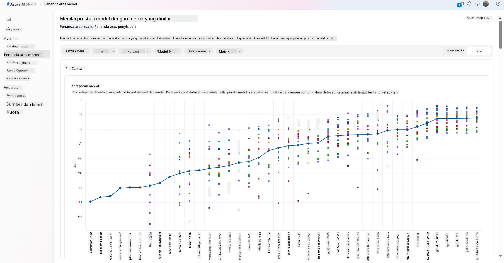
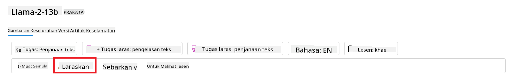
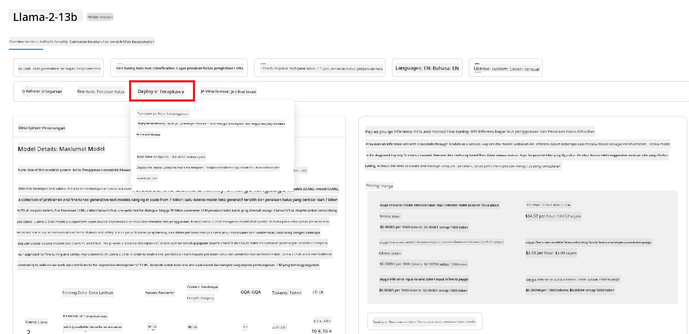
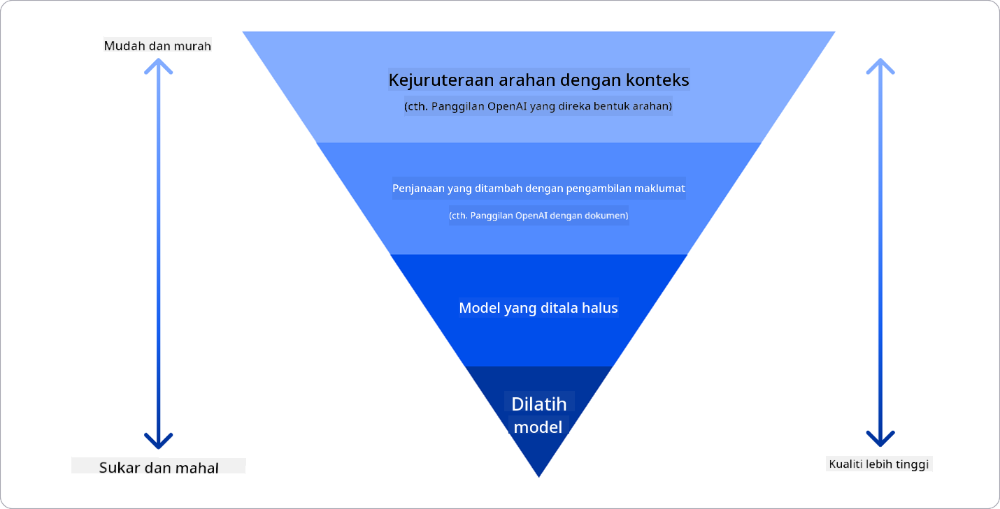

<!--
CO_OP_TRANSLATOR_METADATA:
{
  "original_hash": "e2f686f2eb794941761252ac5e8e090b",
  "translation_date": "2025-06-25T10:52:48+00:00",
  "source_file": "02-exploring-and-comparing-different-llms/README.md",
  "language_code": "ms"
}
-->
# Meneroka dan membandingkan LLM yang berbeza

> _Klik imej di atas untuk melihat video pelajaran ini_

Dalam pelajaran sebelumnya, kita telah melihat bagaimana AI Generatif mengubah landskap teknologi, bagaimana Model Bahasa Besar (LLM) berfungsi dan bagaimana perniagaan - seperti permulaan kita - boleh menerapkannya kepada kes penggunaan mereka dan berkembang! Dalam bab ini, kita akan membandingkan dan membezakan pelbagai jenis model bahasa besar (LLM) untuk memahami kelebihan dan kelemahan mereka.

Langkah seterusnya dalam perjalanan permulaan kita adalah meneroka landskap semasa LLM dan memahami mana yang sesuai untuk kes penggunaan kita.

## Pengenalan

Pelajaran ini akan merangkumi:

- Jenis LLM yang berbeza dalam landskap semasa.
- Menguji, mengulangi, dan membandingkan model yang berbeza untuk kes penggunaan anda di Azure.
- Cara untuk menyebarkan LLM.

## Matlamat Pembelajaran

Selepas menyelesaikan pelajaran ini, anda akan dapat:

- Memilih model yang tepat untuk kes penggunaan anda.
- Memahami cara menguji, mengulangi, dan meningkatkan prestasi model anda.
- Mengetahui bagaimana perniagaan menyebarkan model.

## Memahami jenis LLM yang berbeza

LLM boleh mempunyai pelbagai pengkategorian berdasarkan seni bina, data latihan, dan kes penggunaan mereka. Memahami perbezaan ini akan membantu permulaan kita memilih model yang tepat untuk senario tersebut, dan memahami cara menguji, mengulangi, dan meningkatkan prestasi.

Terdapat banyak jenis model LLM yang berbeza, pilihan model anda bergantung kepada apa yang anda ingin gunakan, data anda, berapa banyak yang anda sedia bayar dan banyak lagi.

Bergantung pada jika anda ingin menggunakan model untuk teks, audio, video, penjanaan imej dan sebagainya, anda mungkin memilih jenis model yang berbeza.

- **Pengiktirafan audio dan ucapan**. Untuk tujuan ini, model jenis Whisper adalah pilihan yang baik kerana mereka adalah serba guna dan ditujukan untuk pengiktirafan ucapan. Ia dilatih pada audio yang pelbagai dan boleh melakukan pengiktirafan ucapan berbilang bahasa. Ketahui lebih lanjut tentang [model jenis Whisper di sini](https://platform.openai.com/docs/models/whisper?WT.mc_id=academic-105485-koreyst).

- **Penjanaan imej**. Untuk penjanaan imej, DALL-E dan Midjourney adalah dua pilihan yang sangat terkenal. DALL-E ditawarkan oleh Azure OpenAI. [Baca lebih lanjut tentang DALL-E di sini](https://platform.openai.com/docs/models/dall-e?WT.mc_id=academic-105485-koreyst) dan juga dalam Bab 9 kurikulum ini.

- **Penjanaan teks**. Kebanyakan model dilatih pada penjanaan teks dan anda mempunyai pelbagai pilihan dari GPT-3.5 hingga GPT-4. Mereka datang dengan kos yang berbeza dengan GPT-4 menjadi yang paling mahal. Ia bernilai untuk melihat [taman permainan Azure OpenAI](https://oai.azure.com/portal/playground?WT.mc_id=academic-105485-koreyst) untuk menilai model mana yang paling sesuai dengan keperluan anda dari segi keupayaan dan kos.

- **Multi-modality**. Jika anda mencari untuk menangani pelbagai jenis data dalam input dan output, anda mungkin ingin melihat model seperti [gpt-4 turbo dengan penglihatan atau gpt-4o](https://learn.microsoft.com/azure/ai-services/openai/concepts/models#gpt-4-and-gpt-4-turbo-models?WT.mc_id=academic-105485-koreyst) - keluaran terbaru model OpenAI - yang mampu menggabungkan pemprosesan bahasa semulajadi dengan pemahaman visual, membolehkan interaksi melalui antara muka multi-modal.

Memilih model bermakna anda mendapat beberapa keupayaan asas, yang mungkin tidak mencukupi. Sering kali anda mempunyai data khusus syarikat yang anda perlu beritahu kepada LLM. Terdapat beberapa pilihan berbeza tentang cara mendekati itu, lebih lanjut tentang itu dalam bahagian yang akan datang.

### Model Asas versus LLM

Istilah Model Asas telah [dicipta oleh penyelidik Stanford](https://arxiv.org/abs/2108.07258?WT.mc_id=academic-105485-koreyst) dan ditakrifkan sebagai model AI yang mengikuti beberapa kriteria, seperti:

- **Mereka dilatih menggunakan pembelajaran tanpa pengawasan atau pembelajaran kendiri**, bermakna mereka dilatih pada data multi-modal tanpa label, dan mereka tidak memerlukan penjelasan manusia atau pelabelan data untuk proses latihan mereka.
- **Mereka adalah model yang sangat besar**, berdasarkan rangkaian neural yang sangat dalam dilatih pada berbilion parameter.
- **Mereka biasanya bertujuan untuk berfungsi sebagai ‘asas’ untuk model lain**, bermakna mereka boleh digunakan sebagai titik permulaan untuk model lain dibina di atasnya, yang boleh dilakukan dengan penalaan.

Untuk menjelaskan lebih lanjut perbezaan ini, mari kita ambil ChatGPT sebagai contoh. Untuk membina versi pertama ChatGPT, model yang dipanggil GPT-3.5 berfungsi sebagai model asas. Ini bermakna OpenAI menggunakan beberapa data khusus chat untuk mencipta versi yang disesuaikan dari GPT-3.5 yang khusus dalam berprestasi baik dalam senario perbualan, seperti chatbot.

### Model Sumber Terbuka versus Proprietari

Cara lain untuk mengkategorikan LLM adalah sama ada mereka sumber terbuka atau proprietari.

Model sumber terbuka adalah model yang dibuat tersedia kepada umum dan boleh digunakan oleh sesiapa sahaja. Mereka sering dibuat tersedia oleh syarikat yang menciptanya, atau oleh komuniti penyelidikan. Model-model ini dibenarkan untuk diperiksa, diubah suai, dan disesuaikan untuk pelbagai kes penggunaan dalam LLM. Walau bagaimanapun, mereka tidak selalu dioptimumkan untuk penggunaan produksi, dan mungkin tidak berprestasi sebaik model proprietari. Tambahan pula, pembiayaan untuk model sumber terbuka boleh terhad, dan mereka mungkin tidak dikekalkan jangka panjang atau mungkin tidak dikemas kini dengan penyelidikan terbaru. Contoh model sumber terbuka yang popular termasuk [Alpaca](https://crfm.stanford.edu/2023/03/13/alpaca.html?WT.mc_id=academic-105485-koreyst), [Bloom](https://huggingface.co/bigscience/bloom) dan [LLaMA](https://llama.meta.com).

Model proprietari adalah model yang dimiliki oleh syarikat dan tidak dibuat tersedia kepada umum. Model-model ini sering dioptimumkan untuk penggunaan produksi. Walau bagaimanapun, mereka tidak dibenarkan untuk diperiksa, diubah suai, atau disesuaikan untuk kes penggunaan yang berbeza. Tambahan pula, mereka tidak selalu tersedia secara percuma, dan mungkin memerlukan langganan atau pembayaran untuk digunakan. Juga, pengguna tidak mempunyai kawalan terhadap data yang digunakan untuk melatih model, yang bermakna mereka harus mempercayai pemilik model untuk memastikan komitmen terhadap privasi data dan penggunaan AI yang bertanggungjawab. Contoh model proprietari yang popular termasuk [model OpenAI](https://platform.openai.com/docs/models/overview?WT.mc_id=academic-105485-koreyst), [Google Bard](https://sapling.ai/llm/bard?WT.mc_id=academic-105485-koreyst) atau [Claude 2](https://www.anthropic.com/index/claude-2?WT.mc_id=academic-105485-koreyst).

### Pembenaman versus Penjanaan Imej versus Penjanaan Teks dan Kod

LLM juga boleh dikategorikan mengikut output yang mereka hasilkan.

Pembenaman adalah satu set model yang boleh menukar teks menjadi bentuk numerik, dipanggil pembenaman, yang merupakan representasi numerik teks input. Pembenaman memudahkan mesin untuk memahami hubungan antara perkataan atau ayat dan boleh digunakan sebagai input oleh model lain, seperti model klasifikasi, atau model pengelompokan yang mempunyai prestasi lebih baik pada data numerik. Model pembenaman sering digunakan untuk pembelajaran pemindahan, di mana model dibina untuk tugas pengganti yang mempunyai banyak data, dan kemudian berat model (pembenaman) digunakan semula untuk tugas hiliran lain. Contoh kategori ini adalah [pembenaman OpenAI](https://platform.openai.com/docs/models/embeddings?WT.mc_id=academic-105485-koreyst).

Model penjanaan imej adalah model yang menghasilkan imej. Model-model ini sering digunakan untuk penyuntingan imej, sintesis imej, dan terjemahan imej. Model penjanaan imej sering dilatih pada set data imej yang besar, seperti [LAION-5B](https://laion.ai/blog/laion-5b/?WT.mc_id=academic-105485-koreyst), dan boleh digunakan untuk menghasilkan imej baru atau untuk menyunting imej sedia ada dengan teknik inpainting, super-resolution, dan pewarnaan. Contoh termasuk [DALL-E-3](https://openai.com/dall-e-3?WT.mc_id=academic-105485-koreyst) dan [model Stable Diffusion](https://github.com/Stability-AI/StableDiffusion?WT.mc_id=academic-105485-koreyst).

Model penjanaan teks dan kod adalah model yang menghasilkan teks atau kod. Model-model ini sering digunakan untuk penjelasan teks, terjemahan, dan menjawab soalan. Model penjanaan teks sering dilatih pada set data teks yang besar, seperti [BookCorpus](https://www.cv-foundation.org/openaccess/content_iccv_2015/html/Zhu_Aligning_Books_and_ICCV_2015_paper.html?WT.mc_id=academic-105485-koreyst), dan boleh digunakan untuk menghasilkan teks baru, atau untuk menjawab soalan. Model penjanaan kod, seperti [CodeParrot](https://huggingface.co/codeparrot?WT.mc_id=academic-105485-koreyst), sering dilatih pada set data kod yang besar, seperti GitHub, dan boleh digunakan untuk menghasilkan kod baru, atau untuk memperbaiki bug dalam kod sedia ada.

### Encoder-Decoder versus Decoder-only

Untuk membincangkan jenis seni bina LLM yang berbeza, mari kita gunakan analogi.

Bayangkan pengurus anda memberi anda tugas untuk menulis kuiz untuk pelajar. Anda mempunyai dua rakan sekerja; satu bertanggungjawab mencipta kandungan dan yang lain bertanggungjawab menyemak mereka.

Pencipta kandungan adalah seperti model Decoder sahaja, mereka boleh melihat topik dan melihat apa yang anda sudah tulis dan kemudian dia boleh menulis kursus berdasarkan itu. Mereka sangat baik dalam menulis kandungan yang menarik dan informatif, tetapi mereka tidak sangat baik dalam memahami topik dan objektif pembelajaran. Beberapa contoh model Decoder adalah model keluarga GPT, seperti GPT-3.

Penyemak adalah seperti model Encoder sahaja, mereka melihat kursus yang ditulis dan jawapan, menyedari hubungan antara mereka dan memahami konteks, tetapi mereka tidak baik dalam menghasilkan kandungan. Contoh model Encoder sahaja adalah BERT.

Bayangkan kita boleh mempunyai seseorang juga yang boleh mencipta dan menyemak kuiz, ini adalah model Encoder-Decoder. Beberapa contoh adalah BART dan T5.

### Perkhidmatan versus Model

Sekarang, mari kita bincangkan perbezaan antara perkhidmatan dan model. Perkhidmatan adalah produk yang ditawarkan oleh Penyedia Perkhidmatan Cloud, dan sering kali merupakan gabungan model, data, dan komponen lain. Model adalah komponen utama perkhidmatan, dan sering kali merupakan model asas, seperti LLM.

Perkhidmatan sering dioptimumkan untuk penggunaan produksi dan sering kali lebih mudah digunakan daripada model, melalui antara muka pengguna grafik. Walau bagaimanapun, perkhidmatan tidak selalu tersedia secara percuma, dan mungkin memerlukan langganan atau pembayaran untuk digunakan, sebagai pertukaran untuk memanfaatkan peralatan dan sumber pemilik perkhidmatan, mengoptimumkan perbelanjaan dan penskalaan dengan mudah. Contoh perkhidmatan adalah [Azure OpenAI Service](https://learn.microsoft.com/azure/ai-services/openai/overview?WT.mc_id=academic-105485-koreyst), yang menawarkan pelan kadar bayar mengikut penggunaan, bermakna pengguna dikenakan bayaran secara proporsional dengan berapa banyak mereka menggunakan perkhidmatan. Juga, Azure OpenAI Service menawarkan keselamatan gred perusahaan dan rangka kerja AI yang bertanggungjawab di atas keupayaan model.

Model hanyalah Rangkaian Neural, dengan parameter, berat, dan lain-lain. Membolehkan syarikat untuk menjalankan secara tempatan, namun, perlu membeli peralatan, membina struktur untuk penskalaan dan membeli lesen atau menggunakan model sumber terbuka. Model seperti LLaMA tersedia untuk digunakan, memerlukan kuasa pengkomputeran untuk menjalankan model.

## Cara menguji dan mengulangi dengan model yang berbeza untuk memahami prestasi di Azure

Setelah pasukan kita meneroka landskap LLM semasa dan mengenal pasti beberapa calon yang baik untuk senario mereka, langkah seterusnya adalah menguji mereka pada data mereka dan pada beban kerja mereka. Ini adalah proses berulang, dilakukan melalui eksperimen dan ukuran.
Kebanyakan model yang kita sebutkan dalam perenggan sebelumnya (model OpenAI, model sumber terbuka seperti Llama2, dan transformer Hugging Face) tersedia dalam [Katalog Model](https://learn.microsoft.com/azure/ai-studio/how-to/model-catalog-overview?WT.mc_id=academic-105485-koreyst) dalam [Azure AI Studio](https://ai.azure.com/?WT.mc_id=academic-105485-koreyst).

[Azure AI Studio](https://learn.microsoft.com/azure/ai-studio/what-is-ai-studio?WT.mc_id=academic-105485-koreyst) adalah Platform Cloud yang direka untuk pembangun untuk membina aplikasi AI generatif dan menguruskan keseluruhan kitaran pembangunan - dari eksperimen hingga penilaian - dengan menggabungkan semua perkhidmatan AI Azure ke dalam satu hab dengan GUI yang mudah. Katalog Model dalam Azure AI Studio membolehkan pengguna untuk:

- Mencari Model Asas yang diminati dalam katalog - sama ada proprietari atau sumber terbuka, menapis mengikut tugas, lesen, atau nama. Untuk meningkatkan kebolehcarian, model-model diatur dalam koleksi, seperti koleksi Azure OpenAI, koleksi Hugging Face, dan banyak lagi.

- Menyemak kad model, termasuk penerangan terperinci tentang penggunaan yang dimaksudkan dan data latihan, sampel kod dan hasil penilaian pada perpustakaan penilaian dalaman.
- Bandingkan penanda aras merentasi model dan set data yang tersedia dalam industri untuk menilai yang mana memenuhi senario perniagaan, melalui panel [Model Benchmarks](https://learn.microsoft.com/azure/ai-studio/how-to/model-benchmarks?WT.mc_id=academic-105485-koreyst).

- Sesuaikan model pada data latihan tersuai untuk meningkatkan prestasi model dalam beban kerja tertentu, menggunakan keupayaan eksperimen dan penjejakan di Azure AI Studio.

- Sebarkan model pra-latih asal atau versi yang telah disesuaikan ke inference masa nyata jauh - pengiraan terurus - atau titik akhir api tanpa pelayan - [bayar mengikut penggunaan](https://learn.microsoft.com/azure/ai-studio/how-to/model-catalog-overview#model-deployment-managed-compute-and-serverless-api-pay-as-you-go?WT.mc_id=academic-105485-koreyst) - untuk membolehkan aplikasi menggunakannya.

> [!NOTE]
> Tidak semua model dalam katalog kini tersedia untuk penyelarasan dan/atau penyebaran bayar mengikut penggunaan. Semak kad model untuk maklumat lanjut tentang keupayaan dan batasan model tersebut.

## Meningkatkan hasil LLM

Kami telah meneroka bersama pasukan permulaan kami pelbagai jenis LLM dan Platform Awan (Azure Machine Learning) yang membolehkan kami membandingkan model yang berbeza, menilai mereka pada data ujian, meningkatkan prestasi dan menyebarkannya pada titik akhir inference.

Tetapi bila mereka perlu mempertimbangkan untuk menyelaraskan model berbanding menggunakan yang pra-latih? Adakah terdapat pendekatan lain untuk meningkatkan prestasi model dalam beban kerja tertentu?

Terdapat beberapa pendekatan yang boleh digunakan oleh perniagaan untuk mendapatkan hasil yang mereka perlukan daripada LLM. Anda boleh memilih pelbagai jenis model dengan pelbagai tahap latihan apabila menyebarkan LLM dalam produksi, dengan pelbagai tahap kerumitan, kos, dan kualiti. Berikut adalah beberapa pendekatan berbeza:

- **Kejuruteraan prompt dengan konteks**. Idea ini adalah untuk menyediakan konteks yang mencukupi apabila anda prompt untuk memastikan anda mendapat respons yang anda perlukan.

- **Retrieval Augmented Generation, RAG**. Data anda mungkin wujud dalam pangkalan data atau titik akhir web contohnya, untuk memastikan data ini, atau subset daripadanya, dimasukkan pada masa prompt, anda boleh mendapatkan data yang berkaitan dan menjadikannya sebahagian daripada prompt pengguna.

- **Model yang disesuaikan**. Di sini, anda melatih model lebih lanjut pada data anda sendiri yang membawa kepada model menjadi lebih tepat dan responsif kepada keperluan anda tetapi mungkin mahal.

Sumber imej: [Four Ways that Enterprises Deploy LLMs | Fiddler AI Blog](https://www.fiddler.ai/blog/four-ways-that-enterprises-deploy-llms?WT.mc_id=academic-105485-koreyst)

### Kejuruteraan Prompt dengan Konteks

LLM pra-latih berfungsi dengan baik pada tugas bahasa semula jadi yang umum, bahkan dengan memanggil mereka dengan prompt pendek, seperti ayat untuk dilengkapkan atau soalan – yang disebut "zero-shot" learning.

Walau bagaimanapun, lebih banyak pengguna boleh merangka pertanyaan mereka, dengan permintaan terperinci dan contoh – Konteks – lebih tepat dan lebih dekat dengan jangkaan pengguna jawapannya. Dalam kes ini, kita bercakap tentang "one-shot" learning jika prompt hanya mengandungi satu contoh dan "few-shot learning" jika ia termasuk pelbagai contoh. Kejuruteraan prompt dengan konteks adalah pendekatan yang paling kos efektif untuk memulakan.

### Retrieval Augmented Generation (RAG)

LLM mempunyai batasan bahawa mereka hanya boleh menggunakan data yang telah digunakan semasa latihan mereka untuk menjana jawapan. Ini bermakna mereka tidak tahu apa-apa tentang fakta yang berlaku selepas proses latihan mereka, dan mereka tidak boleh mengakses maklumat bukan awam (seperti data syarikat). 
Ini boleh diatasi melalui RAG, teknik yang memperkaya prompt dengan data luaran dalam bentuk serpihan dokumen, dengan mempertimbangkan had panjang prompt. Ini disokong oleh alat pangkalan data Vektor (seperti [Azure Vector Search](https://learn.microsoft.com/azure/search/vector-search-overview?WT.mc_id=academic-105485-koreyst)) yang mendapatkan serpihan berguna dari pelbagai sumber data yang telah ditetapkan dan menambahkannya ke dalam Konteks prompt.

Teknik ini sangat berguna apabila perniagaan tidak mempunyai data yang mencukupi, masa yang cukup, atau sumber untuk menyelaraskan LLM, tetapi masih ingin meningkatkan prestasi pada beban kerja tertentu dan mengurangkan risiko fabrikasi, iaitu, mistifikasi realiti atau kandungan berbahaya.

### Model yang Disesuaikan

Penyelarasan adalah proses yang memanfaatkan pembelajaran pemindahan untuk 'menyesuaikan' model ke tugas hiliran atau untuk menyelesaikan masalah tertentu. Berbeza dengan few-shot learning dan RAG, ia menghasilkan model baru yang dihasilkan, dengan berat dan bias yang diperbaharui. Ia memerlukan satu set contoh latihan yang terdiri daripada satu input (prompt) dan output yang berkaitan (penyelesaian).
Ini akan menjadi pendekatan pilihan jika:

- **Menggunakan model yang disesuaikan**. Perniagaan ingin menggunakan model yang disesuaikan yang kurang berkemampuan (seperti model embedding) berbanding model berprestasi tinggi, menghasilkan penyelesaian yang lebih kos efektif dan cepat.

- **Mempertimbangkan latensi**. Latensi penting untuk kes penggunaan tertentu, jadi tidak mungkin menggunakan prompt yang sangat panjang atau jumlah contoh yang harus dipelajari dari model tidak sesuai dengan had panjang prompt.

- **Tetap terkini**. Perniagaan mempunyai banyak data berkualiti tinggi dan label kebenaran asas serta sumber yang diperlukan untuk mengekalkan data ini terkini dari masa ke masa.

### Model yang Dilatih

Melatih LLM dari awal adalah tanpa ragu-ragu pendekatan yang paling sukar dan paling kompleks untuk diterima pakai, memerlukan sejumlah besar data, sumber yang terlatih, dan kuasa pengiraan yang sesuai. Pilihan ini harus dipertimbangkan hanya dalam senario di mana perniagaan mempunyai kes penggunaan khusus domain dan sejumlah besar data berpusatkan domain.

## Semakan Pengetahuan

Apakah pendekatan yang baik untuk meningkatkan hasil penyelesaian LLM?

1. Kejuruteraan prompt dengan konteks
1. RAG
1. Model yang disesuaikan

A:3, jika anda mempunyai masa dan sumber serta data berkualiti tinggi, penyelarasan adalah pilihan yang lebih baik untuk tetap terkini. Walau bagaimanapun, jika anda mencari untuk meningkatkan perkara dan anda kekurangan masa, ia berbaloi untuk mempertimbangkan RAG terlebih dahulu.

## 🚀 Cabaran

Baca lebih lanjut tentang bagaimana anda boleh [menggunakan RAG](https://learn.microsoft.com/azure/search/retrieval-augmented-generation-overview?WT.mc_id=academic-105485-koreyst) untuk perniagaan anda.

## Kerja Hebat, Teruskan Pembelajaran Anda

Setelah menyelesaikan pelajaran ini, lihat koleksi [Pembelajaran AI Generatif](https://aka.ms/genai-collection?WT.mc_id=academic-105485-koreyst) kami untuk terus meningkatkan pengetahuan AI Generatif anda!

Pergi ke Pelajaran 3 di mana kami akan melihat bagaimana untuk [membangun dengan AI Generatif secara Bertanggungjawab](../03-using-generative-ai-responsibly/README.md?WT.mc_id=academic-105485-koreyst)!

**Penafian**:  
Dokumen ini telah diterjemahkan menggunakan perkhidmatan terjemahan AI [Co-op Translator](https://github.com/Azure/co-op-translator). Walaupun kami berusaha untuk ketepatan, sila ambil perhatian bahawa terjemahan automatik mungkin mengandungi kesalahan atau ketidaktepatan. Dokumen asal dalam bahasa asalnya harus dianggap sebagai sumber yang berwibawa. Untuk maklumat penting, terjemahan manusia profesional adalah disyorkan. Kami tidak bertanggungjawab atas sebarang salah faham atau salah tafsir yang timbul daripada penggunaan terjemahan ini.