# Meneroka dan membandingkan pelbagai LLM

[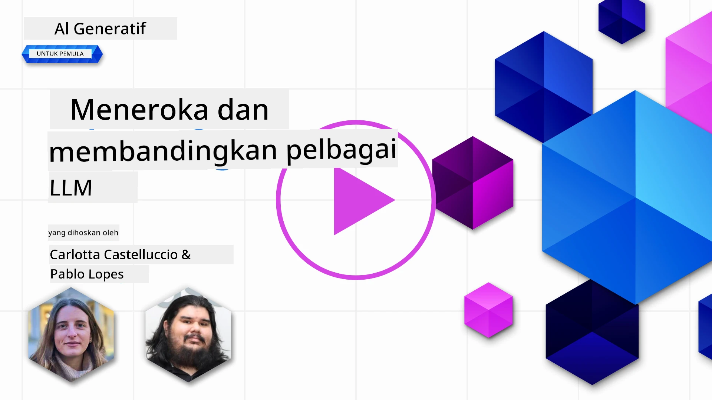](https://youtu.be/KIRUeDKscfI?si=8BHX1zvwzQBn-PlK)

> _Klik imej di atas untuk menonton video pelajaran ini_

Dengan pelajaran sebelumnya, kita telah melihat bagaimana AI Generatif mengubah landskap teknologi, bagaimana Model Bahasa Besar (LLM) berfungsi dan bagaimana perniagaan - seperti startup kita - boleh mengaplikasikannya kepada kes penggunaan mereka dan berkembang! Dalam bab ini, kita akan membanding dan membezakan pelbagai jenis model bahasa besar (LLM) untuk memahami kelebihan dan kekurangannya.

Langkah seterusnya dalam perjalanan startup kita adalah meneroka landskap LLM semasa dan memahami yang mana sesuai untuk kes penggunaan kita.

## Pengenalan

Pelajaran ini akan merangkumi:

- Pelbagai jenis LLM dalam landskap semasa.
- Menguji, mengulangi, dan membandingkan model yang berbeza untuk kes penggunaan anda dalam Azure.
- Cara menggunakan LLM.

## Matlamat Pembelajaran

Selepas melengkapkan pelajaran ini, anda akan dapat:

- Memilih model yang betul untuk kes penggunaan anda.
- Memahami cara menguji, mengulangi, dan meningkatkan prestasi model anda.
- Mengetahui bagaimana perniagaan menggunakan model.

## Memahami pelbagai jenis LLM

LLM boleh dikategorikan mengikut arkitektur, data latihan, dan kes penggunaan mereka. Memahami perbezaan ini akan membantu startup kita memilih model yang tepat untuk senario itu, dan memahami cara menguji, mengulangi, dan meningkatkan prestasi.

Terdapat banyak jenis model LLM berbeza, pilihan anda bergantung pada tujuan penggunaan, data anda, berapa banyak yang anda sanggup bayar dan lain-lain.

Bergantung pada sama ada anda ingin menggunakan model untuk teks, audio, video, penjanaan imej dan sebagainya, anda mungkin memilih jenis model yang berbeza.

- **Pengiktirafan audio dan ucapan**. Model jenis Whisper masih berguna sebagai model pengiktirafan ucapan tujuan umum, tetapi pilihan produksi kini juga termasuk model ucapan-ke-teks yang lebih baru seperti `gpt-4o-transcribe`, `gpt-4o-mini-transcribe`, dan varian diarization. Nilai liputan bahasa, diarization, sokongan masa nyata, kelambatan, dan kos untuk senario anda. Ketahui lebih lanjut dalam [dokumentasi ucapan-ke-teks OpenAI](https://platform.openai.com/docs/guides/speech-to-text?WT.mc_id=academic-105485-koreyst).

- **Penjanaan imej**. DALL-E dan Midjourney adalah pilihan penjanaan imej yang terkenal, tetapi API imej OpenAI semasa memfokuskan pada model GPT Image seperti `gpt-image-2`, manakala Stable Diffusion, Imagen, Flux, dan keluarga model lain juga merupakan pilihan biasa. Bandingkan pematuhan arahan, sokongan penyuntingan, kawalan gaya, keperluan keselamatan, dan pelesenan. Ketahui lebih lanjut dalam [panduan penjanaan imej OpenAI](https://platform.openai.com/docs/guides/images?WT.mc_id=academic-105485-koreyst) dan Bab 9 kurikulum ini.

- **Penjanaan teks**. Model teks kini merangkumi model frontier, model penaakulan, model latensi rendah yang lebih kecil, dan model berat terbuka. Contoh semasa termasuk model OpenAI GPT-5.x, model Anthropic Claude 4.x, model Google Gemini 3.x, model Meta Llama 4, dan model Mistral. Jangan pilih hanya berdasarkan tarikh keluar atau harga; bandingkan kualiti tugas, kelambatan, tetingkap konteks, penggunaan alat, tingkah laku keselamatan, ketersediaan serantau, dan jumlah kos. [Katalog model Microsoft Foundry](https://ai.azure.com/catalog?WT.mc_id=academic-105485-koreyst) adalah tempat yang baik untuk membandingkan model yang tersedia di Azure.

- **Pelbagai modaliti**. Ramai model semasa boleh memproses lebih daripada teks. Sesetengah menerima input imej, audio, atau video; sesetengah boleh memanggil alat; dan model khusus boleh menjana imej, audio, atau video. Contohnya, model OpenAI semasa menyokong input teks dan imej, model Gemini boleh menyokong teks, kod, imej, audio, dan input video bergantung pada varian, dan Llama 4 Scout dan Maverick adalah model multimodal berat terbuka secara asli. Sentiasa periksa setiap kad model untuk modaliti input dan output yang disokong sebelum membina aliran kerja.

Memilih model bermakna anda mendapat beberapa keupayaan asas, yang mungkin tidak mencukupi. Selalunya anda mempunyai data khusus syarikat yang anda perlu memberitahu LLM dengan cara tertentu. Terdapat beberapa pilihan berbeza tentang bagaimana untuk mendekatinya, lebih lanjut mengenainya dalam bahagian berikut.

### Model Asas berbanding LLM

Istilah Model Asas [dicipta oleh penyelidik Stanford](https://arxiv.org/abs/2108.07258?WT.mc_id=academic-105485-koreyst) dan ditakrifkan sebagai model AI yang memenuhi beberapa kriteria, seperti:

- **Mereka dilatih menggunakan pembelajaran tanpa pengawasan atau pembelajaran kendiri**, bermakna mereka dilatih menggunakan data multi-modal tanpa label, dan mereka tidak memerlukan anotasi manusia atau pelabelan data untuk proses latihan mereka.
- **Mereka adalah model yang sangat besar**, berdasarkan rangkaian neural yang sangat dalam yang dilatih pada berbilion parameter.
- **Mereka biasanya ditujukan untuk berfungsi sebagai ‘asas’ kepada model lain**, bermakna mereka boleh digunakan sebagai titik permulaan bagi model lain yang dibina di atasnya, yang boleh dilakukan dengan penalaan halus.

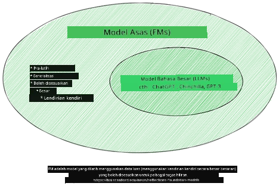

Sumber imej: [Panduan Penting untuk Model Asas dan Model Bahasa Besar | oleh Babar M Bhatti | Medium
](https://thebabar.medium.com/essential-guide-to-foundation-models-and-large-language-models-27dab58f7404)

Untuk menjelaskan perbezaan ini, mari kita ambil ChatGPT sebagai contoh sejarah. Versi awal ChatGPT menggunakan GPT-3.5 sebagai model asas. OpenAI kemudian menggunakan data khusus chat dan teknik penjajaran untuk mencipta versi terlaras yang berprestasi lebih baik dalam senario perbualan, seperti chatbot. Perkhidmatan AI moden sering mengalihkan antara beberapa varian model, jadi nama perkhidmatan dan nama model yang mendasari tidak selalu sama.

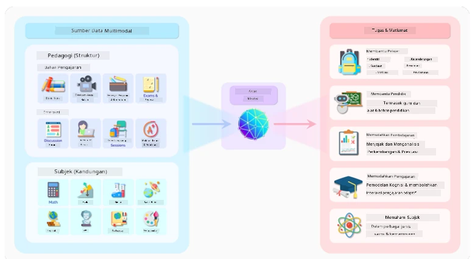

Sumber imej: [2108.07258.pdf (arxiv.org)](https://arxiv.org/pdf/2108.07258.pdf?WT.mc_id=academic-105485-koreyst)

### Model Berat Terbuka/Sumber Terbuka berbanding Model Hak Milik

Satu lagi cara mengkategorikan LLM ialah sama ada mereka berat terbuka, sumber terbuka, atau hak milik.

Model sumber terbuka dan berat terbuka membuat artifak model tersedia untuk pemeriksaan, muat turun, atau pengubahsuaian, tetapi lesen mereka berbeza. Sesetengah sepenuhnya sumber terbuka, sementara yang lain adalah model berat terbuka dengan sekatan penggunaan. Mereka berguna apabila perniagaan memerlukan kawalan lebih ke atas penempatan, lokasi data, kos, atau pengubahsuaian. Walau bagaimanapun, pasukan masih perlu mengkaji terma lesen, kos layanan, penyelenggaraan, kemas kini keselamatan, dan kualiti penilaian sebelum menggunakannya dalam produksi. Contohnya termasuk [Meta Llama 4](https://ai.meta.com/blog/llama-4-multimodal-intelligence/?WT.mc_id=academic-105485-koreyst), beberapa [model Mistral](https://docs.mistral.ai/models/overview?WT.mc_id=academic-105485-koreyst), dan banyak model yang dihoskan di [Hugging Face](https://huggingface.co/models?WT.mc_id=academic-105485-koreyst).

Model hak milik dimiliki dan dihoskan oleh penyedia. Model ini sering dioptimumkan untuk penggunaan produksi terurus dan boleh menawarkan sokongan kuat, sistem keselamatan, integrasi alat, dan skala. Walau bagaimanapun, pelanggan biasanya tidak boleh memeriksa atau mengubah berat model, dan mereka mesti mengkaji terma penyedia untuk privasi, penyimpanan, pematuhan, dan penggunaan yang boleh diterima. Contohnya termasuk [model OpenAI](https://platform.openai.com/docs/models?WT.mc_id=academic-105485-koreyst), [Google Gemini](https://deepmind.google/models/gemini/pro/?WT.mc_id=academic-105485-koreyst), dan [Anthropic Claude](https://platform.claude.com/docs/en/about-claude/models/overview?WT.mc_id=academic-105485-koreyst).

### Penjanaan Penyaluran berbanding Imej berbanding Teks dan Kod

LLM juga boleh dikategorikan mengikut output yang mereka hasilkan.

Penyaluran (Embedding) adalah set model yang boleh menukar teks kepada bentuk nombor, dipanggil embedding, yang merupakan representasi nombor bagi teks input. Penyaluran memudahkan mesin memahami hubungan antara perkataan atau ayat dan boleh digunakan sebagai input oleh model lain, seperti model klasifikasi, atau model pengelompokan yang mempunyai prestasi lebih baik pada data bernombor. Model embedding sering digunakan untuk pembelajaran pindahan, di mana model dibina untuk tugas gantian yang mempunyai banyak data, kemudian berat model (embedding) digunakan semula untuk tugas hiliran lain. Contoh kategori ini ialah [embedding OpenAI](https://platform.openai.com/docs/models/embeddings?WT.mc_id=academic-105485-koreyst).

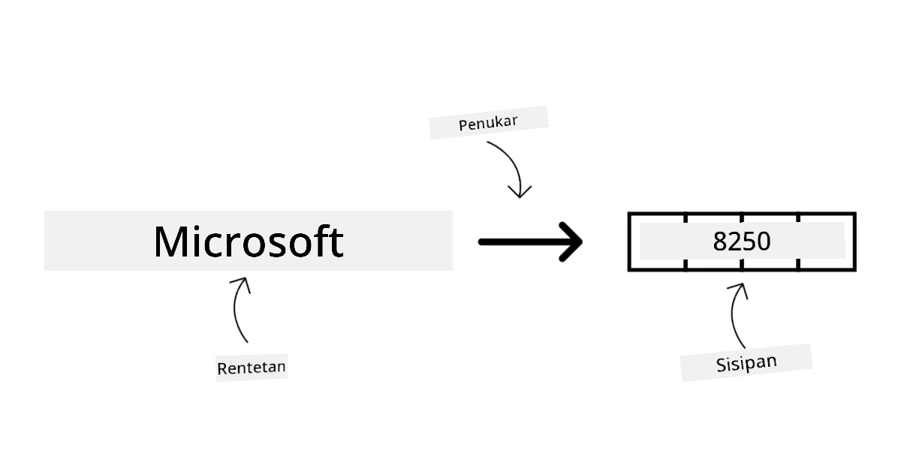

Model penjanaan imej adalah model yang menjana imej. Model ini sering digunakan untuk penyuntingan imej, sintesis imej, dan terjemahan imej. Model penjanaan imej sering dilatih pada set data imej besar, seperti [LAION-5B](https://laion.ai/blog/laion-5b/?WT.mc_id=academic-105485-koreyst), dan boleh digunakan untuk menjana imej baru atau menyunting imej sedia ada dengan teknik inpainting, super-resolution, dan pewarnaan. Contohnya termasuk [Model GPT Image](https://platform.openai.com/docs/guides/images?WT.mc_id=academic-105485-koreyst), [model Stable Diffusion](https://github.com/Stability-AI/StableDiffusion?WT.mc_id=academic-105485-koreyst), dan model Imagen.

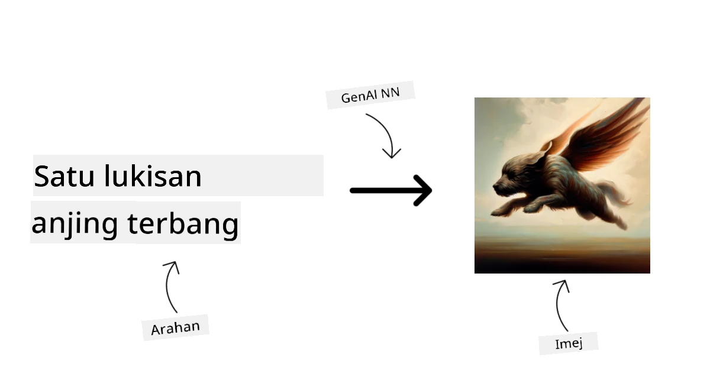

Model penjanaan teks dan kod adalah model yang menjana teks atau kod. Model ini sering digunakan untuk ringkasan teks, terjemahan, dan menjawab soalan. Model penjanaan teks sering dilatih pada set data teks besar, seperti [BookCorpus](https://www.cv-foundation.org/openaccess/content_iccv_2015/html/Zhu_Aligning_Books_and_ICCV_2015_paper.html?WT.mc_id=academic-105485-koreyst), dan boleh digunakan untuk menjana teks baru, atau menjawab soalan. Model penjanaan kod, seperti [CodeParrot](https://huggingface.co/codeparrot?WT.mc_id=academic-105485-koreyst), sering dilatih pada set data kod besar, seperti GitHub, dan boleh digunakan untuk menjana kod baru, atau membaiki pepijat dalam kod sedia ada.

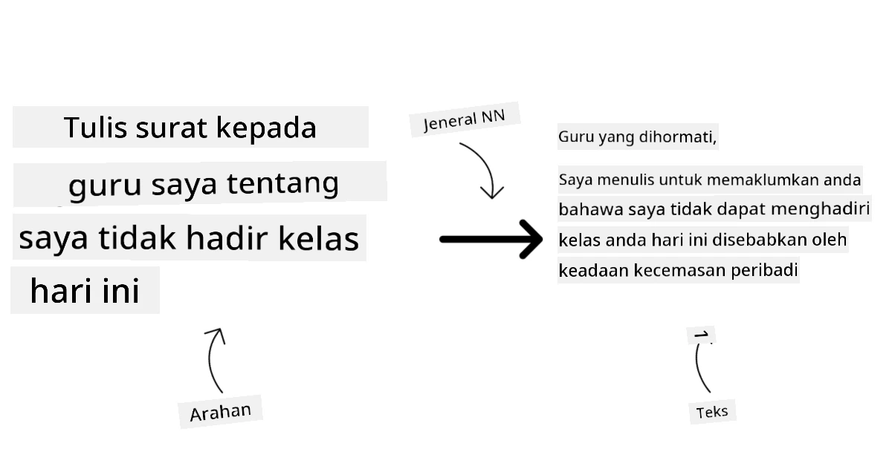

### Encoder-Decoder berbanding Decoder sahaja

Untuk bercakap tentang pelbagai jenis arkitektur LLM, mari kita gunakan analogi.

Bayangkan pengurus anda memberi tugasan untuk menulis kuiz untuk pelajar. Anda mempunyai dua rakan sekerja; seorang menyelia penciptaan kandungan dan seorang lagi menyelia penyemakan.

Pencipta kandungan adalah seperti model decoder sahaja: mereka boleh melihat topik, melihat apa yang telah anda tulis, dan kemudian terus menjana kandungan berdasarkan konteks itu. Mereka sangat mahir menulis kandungan yang menarik dan informatif, tetapi mereka tidak selalu pilihan terbaik apabila tugasan hanya untuk mengklasifikasi, mendapatkan atau menyulitkan maklumat. Contoh keluarga model decoder sahaja termasuk model GPT dan Llama.

Penyemak adalah seperti model Encoder sahaja, mereka melihat kursus yang ditulis dan jawapan, menyedari hubungan antara keduanya dan memahami konteks, tetapi mereka tidak pandai menjana kandungan. Contoh model Encoder sahaja adalah BERT.

Bayangkan kita juga mempunyai seseorang yang boleh mencipta dan menyemak kuiz, ini adalah model Encoder-Decoder. Beberapa contohnya ialah BART dan T5.

### Perkhidmatan berbanding Model

Sekarang, mari kita bincangkan perbezaan antara perkhidmatan dan model. Perkhidmatan adalah produk yang ditawarkan oleh Penyedia Perkhidmatan Awan, dan sering gabungan model, data, dan komponen lain. Model adalah komponen teras perkhidmatan, dan sering model asas, seperti LLM.

Perkhidmatan biasanya dioptimumkan untuk penggunaan produksi dan lebih mudah digunakan berbanding model, melalui antara muka pengguna grafik. Walau bagaimanapun, perkhidmatan tidak selalu tersedia secara percuma, dan mungkin memerlukan langganan atau pembayaran untuk digunakan, sebagai balasan menggunakan peralatan dan sumber pemilik perkhidmatan, mengoptimumkan perbelanjaan dan skala dengan mudah. Contoh perkhidmatan ialah [Azure OpenAI Service](https://learn.microsoft.com/azure/ai-foundry/openai/overview?WT.mc_id=academic-105485-koreyst), yang menawarkan pelan kadar bayar-sesuai-penggunaan, bermakna pengguna dikenakan bayaran mengikut penggunaan perkhidmatan. Azure OpenAI Service juga menawarkan keselamatan tahap perusahaan dan rangka kerja AI bertanggungjawab di atas keupayaan model.

Model adalah artifak rangkaian neural: parameter, berat, arkitektur, tokenizer, dan konfigurasi sokongan. Menjalankan model secara tempatan atau dalam persekitaran persendirian memerlukan perkakasan sesuai, infrastruktur layanan, pemantauan, dan sama ada lesen sumber terbuka/berat terbuka yang serasi atau lesen komersial. Model berat terbuka seperti Llama 4 atau model Mistral boleh dihoskan sendiri, tetapi mereka masih memerlukan kuasa pengkomputeran dan kepakaran operasi.

## Cara menguji dan mengulangi dengan model berbeza untuk memahami prestasi di Azure

Setelah pasukan kami meneroka lanskap LLM semasa dan mengenal pasti beberapa calon yang baik untuk senario mereka, langkah seterusnya adalah mengujinya pada data mereka dan pada beban kerja mereka. Ini adalah proses iteratif, dilakukan melalui eksperimen dan pengukuran.
Kebanyakan model yang kami sebut dalam perenggan sebelum ini (model OpenAI, model berat terbuka seperti Llama 4 dan Mistral, dan model Hugging Face) tersedia dalam [Microsoft Foundry Models](https://learn.microsoft.com/azure/foundry/concepts/foundry-models-overview?WT.mc_id=academic-105485-koreyst).

[Microsoft Foundry](https://learn.microsoft.com/azure/foundry/what-is-foundry?WT.mc_id=academic-105485-koreyst), yang sebelum ini dikenali sebagai Azure AI Studio/Azure AI Foundry, adalah platform Azure yang dipersatukan untuk membina aplikasi dan ejen AI. Ia membantu pembangun mengurus kitaran hidup dari eksperimen dan penilaian hingga pelaksanaan, pemantauan, dan tadbir urus. Katalog model di Microsoft Foundry membolehkan pengguna untuk:

- Mencari model asas yang diminati dalam katalog, termasuk model yang dijual oleh Azure dan model dari rakan kongsi serta penyedia komuniti. Pengguna boleh menapis mengikut tugas, pembekal, lesen, pilihan pelaksanaan, atau nama.

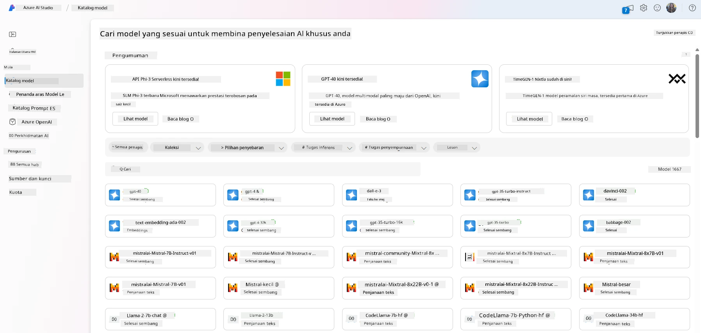

- Menyemak kad model, termasuk penerangan terperinci tentang kegunaan yang dimaksudkan dan data latihan, contoh kod dan keputusan penilaian pada perpustakaan penilaian dalaman.

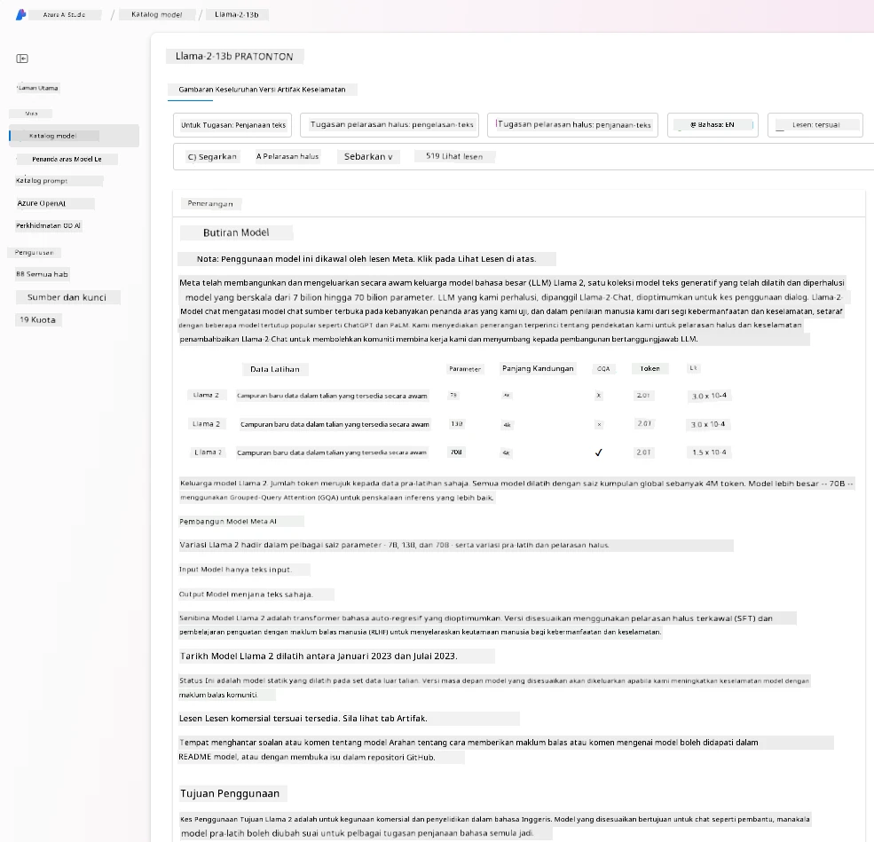

- Membandingkan penanda aras merentas model dan set data yang tersedia dalam industri untuk menilai yang mana memenuhi senario perniagaan, melalui pane [Model Benchmarks](https://learn.microsoft.com/azure/ai-foundry/concepts/model-benchmarks?WT.mc_id=academic-105485-koreyst).

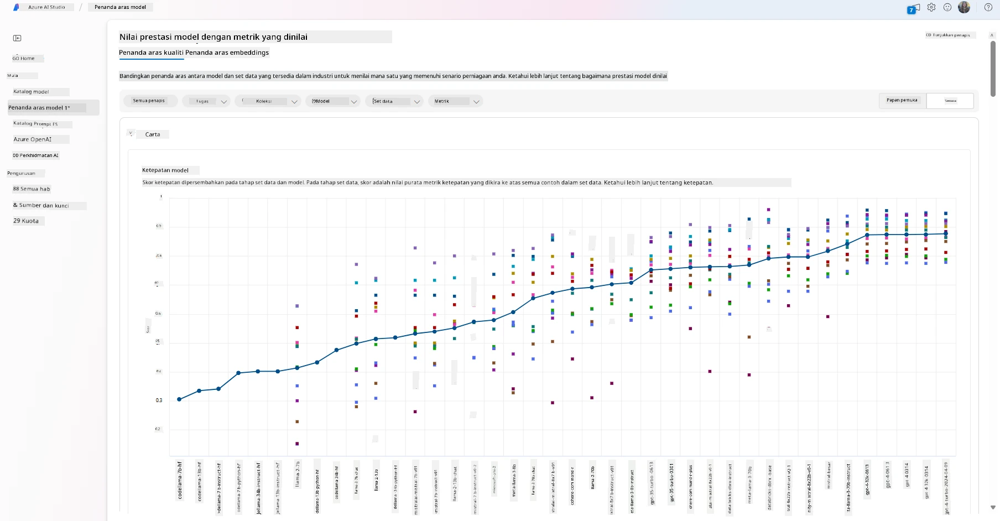

- Menyesuaikan model yang disokong mengikut data latihan khusus untuk meningkatkan prestasi model dalam beban kerja tertentu, memanfaatkan keupayaan eksperimen dan penjejakan Microsoft Foundry.

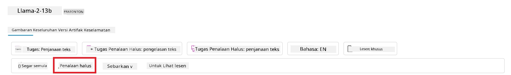

- Melaksanakan model terlatih asal atau versi yang telah ditala halus ke titik inferens masa nyata jauh, menggunakan pilihan pengkomputeran terurus atau pelaksanaan tanpa pelayan, untuk membolehkan aplikasi menggunakannya.

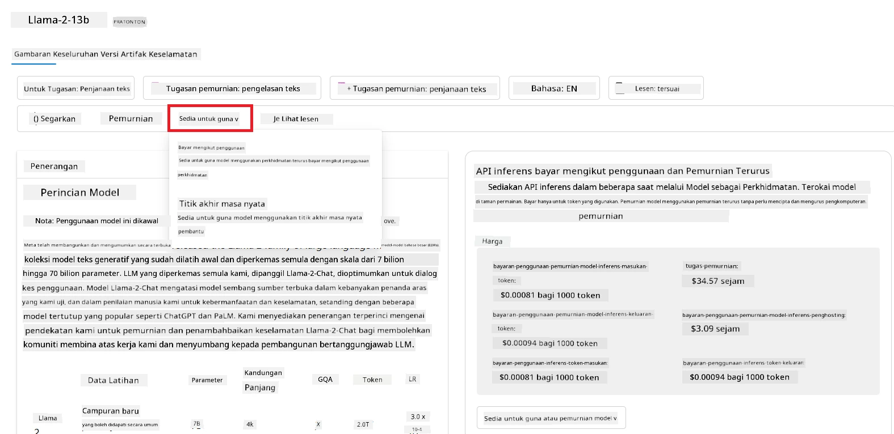

> [!NOTE]
> Tidak semua model dalam katalog kini tersedia untuk penyetelan halus dan/atau pelaksanaan bayar ikut guna. Semak kad model untuk butiran mengenai kebolehan dan keterbatasan model.

## Meningkatkan hasil LLM

Kami telah meneroka bersama pasukan startup kami pelbagai jenis LLM dan platform awan (Microsoft Foundry) yang membolehkan kami membandingkan model berbeza, menilai mereka pada data ujian, meningkatkan prestasi, dan melaksanakan mereka pada titik inferens.

Tetapi bilakah mereka harus mempertimbangkan menyetel halus model berbanding menggunakan model terlatih asal? Adakah terdapat pendekatan lain untuk meningkatkan prestasi model pada beban kerja tertentu?

Terdapat beberapa pendekatan yang boleh digunakan oleh perniagaan untuk mendapatkan hasil yang mereka perlukan daripada LLM. Anda boleh memilih pelbagai jenis model dengan tahap latihan berbeza semasa melaksanakan LLM dalam produksi, dengan tahap kerumitan, kos, dan kualiti yang berbeza. Berikut adalah beberapa pendekatan yang berbeza:

- **Kejuruteraan prompt dengan konteks**. Ianya idea untuk memberikan konteks yang mencukupi apabila anda menyoal untuk memastikan anda mendapat jawapan yang anda perlukan.

- **Retrieval Augmented Generation, RAG**. Data anda mungkin wujud dalam pangkalan data atau titik web contohnya, untuk memastikan data ini, atau subset daripadanya, disertakan pada masa soal jawab, anda boleh mendapatkan data relevan dan menjadikan ia sebahagian daripada prompt pengguna.

- **Model yang disetel halus**. Di sini, anda melatih model lebih lanjut pada data anda sendiri yang menyebabkan model menjadi lebih tepat dan responsif kepada keperluan anda tetapi mungkin mahal.

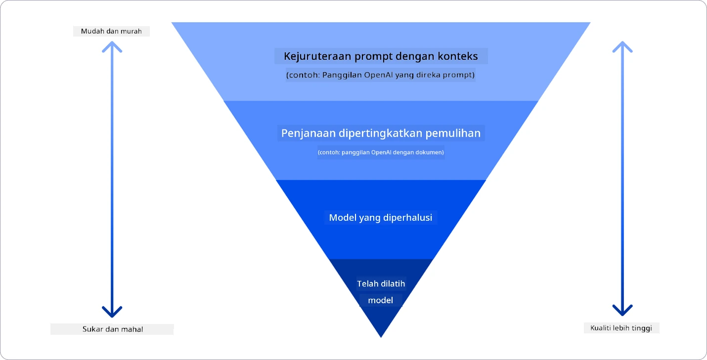

Sumber imej: [Four Ways that Enterprises Deploy LLMs | Fiddler AI Blog](https://www.fiddler.ai/blog/four-ways-that-enterprises-deploy-llms?WT.mc_id=academic-105485-koreyst)

### Kejuruteraan Prompt dengan Konteks

LLM yang telah dilatih sebelumnya berfungsi dengan sangat baik pada tugas bahasa semula jadi yang umum, walaupun dengan memanggilnya dengan prompt pendek, seperti satu ayat untuk dilengkapkan atau satu soalan – disebut pembelajaran “zero-shot”.

Namun, lebih banyak pengguna dapat membingkai soalannya, dengan permintaan terperinci dan contoh – Konteks – lebih tepat dan hampir dengan harapan pengguna jawapannya akan. Dalam hal ini, kita bercakap tentang pembelajaran “one-shot” jika prompt hanya mengandungi satu contoh dan “few shot learning” jika ia mengandungi beberapa contoh.
Kejuruteraan prompt dengan konteks adalah pendekatan paling menjimatkan kos untuk memulakan.

### Retrieval Augmented Generation (RAG)

LLM mempunyai batasan bahawa mereka hanya boleh menggunakan data yang telah digunakan semasa latihan mereka untuk menjana jawapan. Ini bermakna mereka tidak tahu apa-apa tentang fakta yang berlaku selepas proses latihan mereka, dan mereka tidak dapat mengakses maklumat bukan awam (seperti data syarikat).
Ini boleh diatasi melalui RAG, satu teknik yang menambah prompt dengan data luaran dalam bentuk potongan dokumen, mengambil kira had panjang prompt. Ini disokong oleh alat pangkalan data Vector (seperti [Azure Vector Search](https://learn.microsoft.com/azure/search/vector-search-overview?WT.mc_id=academic-105485-koreyst)) yang mendapat potongan berguna dari pelbagai sumber data yang telah ditentukan dan menambahnya ke Konteks prompt.

Teknik ini sangat membantu apabila perniagaan tidak mempunyai data yang cukup, masa yang cukup, atau sumber untuk menyetel halus LLM, tetapi masih ingin meningkatkan prestasi pada beban kerja tertentu dan mengurangkan risiko jawapan yang khayalan, lapuk, atau tidak disokong.

### Model yang Disetel Halus

Penyetelan halus adalah proses yang menggunakan pembelajaran pemindahan untuk ‘menyesuaikan’ model kepada tugas hulu atau untuk menyelesaikan masalah khusus. Berbeza daripada pembelajaran few-shot dan RAG, ia menghasilkan model baru dengan berat dan bias yang dikemas kini. Ia memerlukan satu set contoh latihan yang terdiri daripada satu input (prompt) dan output yang berkaitan (lengkapannya).
Ini akan menjadi pendekatan yang disukai jika:

- **Menggunakan model khusus tugas yang lebih kecil**. Perniagaan ingin menyetel halus model yang lebih kecil untuk tugas sempit daripada berulang-ulang memberi prompt model frontier yang lebih besar, menghasilkan penyelesaian yang lebih menjimatkan kos dan lebih pantas.

- **Mengambil kira kelewatan (latency)**. Kelewatan penting untuk kes penggunaan tertentu, jadi tidak boleh menggunakan prompt yang sangat panjang atau jumlah contoh yang harus dipelajari dari model tidak sesuai dengan had panjang prompt.

- **Menyesuaikan tingkah laku stabil**. Perniagaan mempunyai banyak contoh berkualiti tinggi dan mahu model untuk sentiasa mengikuti corak tugas, format output, nada, atau gaya khusus domain. Jika masalah utama adalah fakta segar atau pengetahuan peribadi yang kerap berubah, gunakan RAG dan bukannya bergantung hanya pada penyetelan halus.

### Model Terlatih

Melatih LLM dari awal tanpa ragu-ragu adalah pendekatan paling sukar dan paling kompleks untuk diambil, memerlukan jumlah data yang besar, sumber mahir, dan kuasa pengkomputeran yang sesuai. Pilihan ini harus dipertimbangkan hanya dalam senario di mana perniagaan mempunyai kes penggunaan khusus domain dan sejumlah besar data berteraskan domain.

## Semakan Pengetahuan

Apakah pendekatan yang baik untuk meningkatkan hasil penyelesaian LLM?

1. Kejuruteraan prompt dengan konteks
1. RAG
1. Model yang disetel halus

A: Ketiga-tiganya boleh membantu. Mulakan dengan kejuruteraan prompt dan konteks untuk penambahbaikan cepat, dan gunakan RAG apabila model memerlukan fakta terkini atau data perniagaan peribadi. Pilih penyetelan halus apabila anda mempunyai cukup contoh berkualiti tinggi dan perlukan model untuk sentiasa mengikuti tugas, format, nada, atau corak domain.

## 🚀 Cabaran

Bacalah lebih lanjut tentang bagaimana anda boleh [menggunakan RAG](https://learn.microsoft.com/azure/search/retrieval-augmented-generation-overview?WT.mc_id=academic-105485-koreyst) untuk perniagaan anda.

## Kerja Hebat, Teruskan Pembelajaran Anda

Setelah menyelesaikan pelajaran ini, lihat koleksi [Pembelajaran AI Generatif](https://aka.ms/genai-collection?WT.mc_id=academic-105485-koreyst) kami untuk terus meningkatkan pengetahuan AI Generatif anda!

Pergi ke Pelajaran 3 di mana kami akan melihat bagaimana untuk [membina dengan AI Generatif secara Bertanggungjawab](../03-using-generative-ai-responsibly/README.md?WT.mc_id=academic-105485-koreyst)!

---

<!-- CO-OP TRANSLATOR DISCLAIMER START -->
**Penafian**:
Dokumen ini telah diterjemahkan menggunakan perkhidmatan terjemahan AI [Co-op Translator](https://github.com/Azure/co-op-translator). Walaupun kami berusaha untuk ketepatan, sila ambil maklum bahawa terjemahan automatik mungkin mengandungi kesilapan atau ketidaktepatan. Dokumen asal dalam bahasa asalnya harus dianggap sebagai sumber yang sahih. Untuk maklumat penting, terjemahan oleh manusia profesional adalah disyorkan. Kami tidak bertanggungjawab terhadap sebarang salah faham atau salah tafsir yang timbul daripada penggunaan terjemahan ini.
<!-- CO-OP TRANSLATOR DISCLAIMER END -->