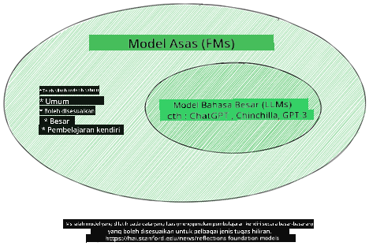
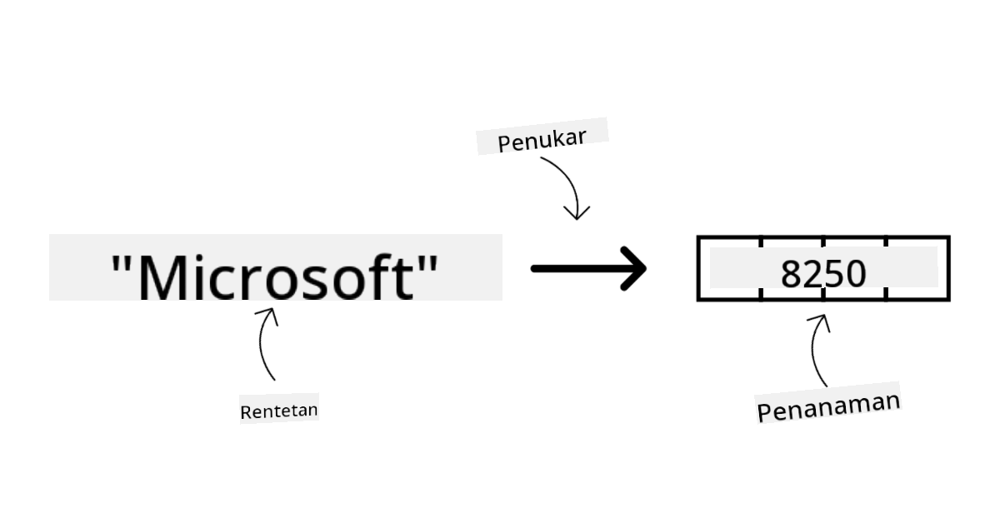
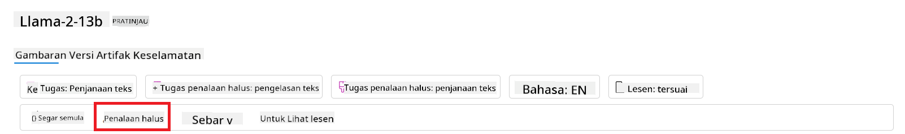
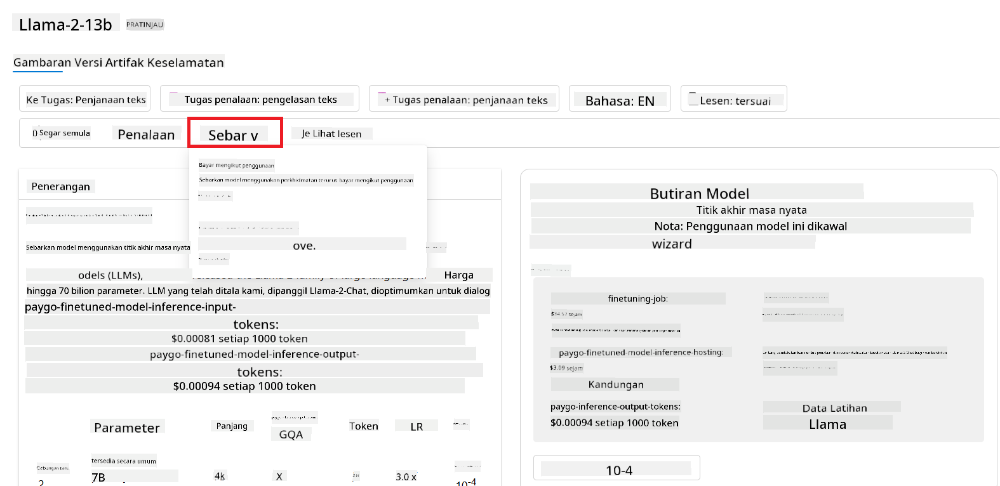

<!--
CO_OP_TRANSLATOR_METADATA:
{
  "original_hash": "e2f686f2eb794941761252ac5e8e090b",
  "translation_date": "2025-07-09T08:34:35+00:00",
  "source_file": "02-exploring-and-comparing-different-llms/README.md",
  "language_code": "ms"
}
-->
# Meneroka dan Membandingkan Pelbagai LLM

> _Klik imej di atas untuk menonton video pelajaran ini_

Dalam pelajaran sebelum ini, kita telah melihat bagaimana Generative AI mengubah landskap teknologi, bagaimana Large Language Models (LLM) berfungsi dan bagaimana perniagaan - seperti startup kita - boleh mengaplikasikannya untuk kes penggunaan mereka dan berkembang! Dalam bab ini, kita akan membandingkan dan membezakan pelbagai jenis model bahasa besar (LLM) untuk memahami kelebihan dan kekurangannya.

Langkah seterusnya dalam perjalanan startup kita adalah meneroka landskap LLM semasa dan memahami yang mana sesuai untuk kes penggunaan kita.

## Pengenalan

Pelajaran ini akan merangkumi:

- Pelbagai jenis LLM dalam landskap semasa.
- Menguji, mengulangi, dan membandingkan model yang berbeza untuk kes penggunaan anda di Azure.
- Cara untuk melaksanakan LLM.

## Matlamat Pembelajaran

Selepas menamatkan pelajaran ini, anda akan dapat:

- Memilih model yang tepat untuk kes penggunaan anda.
- Memahami cara menguji, mengulangi, dan meningkatkan prestasi model anda.
- Mengetahui bagaimana perniagaan melaksanakan model.

## Memahami pelbagai jenis LLM

LLM boleh dikategorikan berdasarkan seni bina, data latihan, dan kes penggunaan mereka. Memahami perbezaan ini akan membantu startup kita memilih model yang sesuai untuk senario tersebut, serta memahami cara menguji, mengulangi, dan meningkatkan prestasi.

Terdapat banyak jenis model LLM, pilihan model anda bergantung pada tujuan penggunaan, data anda, berapa banyak anda sanggup bayar dan lain-lain.

Bergantung pada sama ada anda ingin menggunakan model untuk teks, audio, video, penjanaan imej dan sebagainya, anda mungkin memilih jenis model yang berbeza.

- **Pengecaman audio dan pertuturan**. Untuk tujuan ini, model jenis Whisper adalah pilihan yang baik kerana ia bersifat serba guna dan ditujukan untuk pengecaman pertuturan. Ia dilatih menggunakan pelbagai audio dan boleh melakukan pengecaman pertuturan berbilang bahasa. Ketahui lebih lanjut tentang [model jenis Whisper di sini](https://platform.openai.com/docs/models/whisper?WT.mc_id=academic-105485-koreyst).

- **Penjanaan imej**. Untuk penjanaan imej, DALL-E dan Midjourney adalah dua pilihan yang sangat terkenal. DALL-E ditawarkan oleh Azure OpenAI. [Baca lebih lanjut tentang DALL-E di sini](https://platform.openai.com/docs/models/dall-e?WT.mc_id=academic-105485-koreyst) dan juga dalam Bab 9 kurikulum ini.

- **Penjanaan teks**. Kebanyakan model dilatih untuk penjanaan teks dan anda mempunyai pelbagai pilihan dari GPT-3.5 hingga GPT-4. Mereka datang dengan kos yang berbeza, dengan GPT-4 sebagai yang paling mahal. Berbaloi untuk melihat [Azure OpenAI playground](https://oai.azure.com/portal/playground?WT.mc_id=academic-105485-koreyst) untuk menilai model mana yang paling sesuai dengan keperluan anda dari segi kemampuan dan kos.

- **Multi-modality**. Jika anda ingin mengendalikan pelbagai jenis data dalam input dan output, anda mungkin ingin melihat model seperti [gpt-4 turbo dengan visi atau gpt-4o](https://learn.microsoft.com/azure/ai-services/openai/concepts/models#gpt-4-and-gpt-4-turbo-models?WT.mc_id=academic-105485-koreyst) - keluaran terkini model OpenAI - yang mampu menggabungkan pemprosesan bahasa semula jadi dengan pemahaman visual, membolehkan interaksi melalui antara muka multi-modal.

Memilih model bermakna anda mendapat beberapa keupayaan asas, yang mungkin tidak mencukupi. Selalunya anda mempunyai data khusus syarikat yang perlu anda beritahu kepada LLM. Terdapat beberapa pilihan bagaimana untuk mendekati perkara ini, lebih lanjut akan dibincangkan dalam bahagian seterusnya.

### Foundation Models versus LLMs

Istilah Foundation Model telah [dicipta oleh penyelidik Stanford](https://arxiv.org/abs/2108.07258?WT.mc_id=academic-105485-koreyst) dan ditakrifkan sebagai model AI yang memenuhi beberapa kriteria, seperti:

- **Ia dilatih menggunakan pembelajaran tanpa pengawasan atau pembelajaran kendiri**, bermakna ia dilatih pada data multi-modal tanpa label, dan tidak memerlukan anotasi atau pelabelan manusia untuk proses latihannya.
- **Ia adalah model yang sangat besar**, berdasarkan rangkaian neural yang sangat dalam dan dilatih pada berbilion parameter.
- **Ia biasanya bertujuan untuk menjadi ‘asas’ bagi model lain**, bermakna ia boleh digunakan sebagai titik permulaan untuk membina model lain di atasnya, yang boleh dilakukan melalui penalaan halus (fine-tuning).

Sumber imej: [Essential Guide to Foundation Models and Large Language Models | oleh Babar M Bhatti | Medium](https://thebabar.medium.com/essential-guide-to-foundation-models-and-large-language-models-27dab58f7404)

Untuk menjelaskan perbezaan ini, mari ambil ChatGPT sebagai contoh. Untuk membina versi pertama ChatGPT, model yang dipanggil GPT-3.5 berfungsi sebagai foundation model. Ini bermakna OpenAI menggunakan data khusus chat untuk mencipta versi GPT-3.5 yang ditala khusus untuk berprestasi baik dalam senario perbualan, seperti chatbot.

Sumber imej: [2108.07258.pdf (arxiv.org)](https://arxiv.org/pdf/2108.07258.pdf?WT.mc_id=academic-105485-koreyst)

### Model Sumber Terbuka versus Model Proprietari

Satu lagi cara untuk mengkategorikan LLM adalah sama ada ia sumber terbuka atau proprietari.

Model sumber terbuka adalah model yang tersedia untuk umum dan boleh digunakan oleh sesiapa sahaja. Ia sering disediakan oleh syarikat yang membinanya, atau oleh komuniti penyelidikan. Model ini dibenarkan untuk diperiksa, diubah suai, dan disesuaikan untuk pelbagai kes penggunaan LLM. Namun, ia tidak selalu dioptimumkan untuk penggunaan produksi, dan mungkin tidak sebaik model proprietari dari segi prestasi. Selain itu, pembiayaan untuk model sumber terbuka boleh terhad, dan ia mungkin tidak diselenggara dalam jangka masa panjang atau tidak dikemas kini dengan penyelidikan terkini. Contoh model sumber terbuka yang popular termasuk [Alpaca](https://crfm.stanford.edu/2023/03/13/alpaca.html?WT.mc_id=academic-105485-koreyst), [Bloom](https://huggingface.co/bigscience/bloom) dan [LLaMA](https://llama.meta.com).

Model proprietari adalah model yang dimiliki oleh syarikat dan tidak tersedia untuk umum. Model ini sering dioptimumkan untuk penggunaan produksi. Namun, ia tidak dibenarkan untuk diperiksa, diubah suai, atau disesuaikan untuk kes penggunaan yang berbeza. Selain itu, ia tidak selalu tersedia secara percuma, dan mungkin memerlukan langganan atau bayaran untuk digunakan. Pengguna juga tidak mempunyai kawalan ke atas data yang digunakan untuk melatih model, yang bermakna mereka perlu mempercayai pemilik model untuk memastikan komitmen terhadap privasi data dan penggunaan AI yang bertanggungjawab. Contoh model proprietari yang popular termasuk [model OpenAI](https://platform.openai.com/docs/models/overview?WT.mc_id=academic-105485-koreyst), [Google Bard](https://sapling.ai/llm/bard?WT.mc_id=academic-105485-koreyst) atau [Claude 2](https://www.anthropic.com/index/claude-2?WT.mc_id=academic-105485-koreyst).

### Embedding versus Penjanaan Imej versus Penjanaan Teks dan Kod

LLM juga boleh dikategorikan berdasarkan output yang dihasilkannya.

Embedding adalah set model yang boleh menukar teks kepada bentuk berangka, dipanggil embedding, iaitu representasi berangka bagi teks input. Embedding memudahkan mesin memahami hubungan antara perkataan atau ayat dan boleh digunakan sebagai input oleh model lain, seperti model klasifikasi, atau model pengelompokan yang mempunyai prestasi lebih baik pada data berangka. Model embedding sering digunakan untuk pembelajaran pemindahan (transfer learning), di mana model dibina untuk tugasan pengganti yang mempunyai data yang banyak, dan kemudian berat model (embedding) digunakan semula untuk tugasan hiliran lain. Contoh kategori ini adalah [OpenAI embeddings](https://platform.openai.com/docs/models/embeddings?WT.mc_id=academic-105485-koreyst).

Model penjanaan imej adalah model yang menghasilkan imej. Model ini sering digunakan untuk penyuntingan imej, sintesis imej, dan terjemahan imej. Model penjanaan imej biasanya dilatih pada set data imej yang besar, seperti [LAION-5B](https://laion.ai/blog/laion-5b/?WT.mc_id=academic-105485-koreyst), dan boleh digunakan untuk menghasilkan imej baru atau mengedit imej sedia ada dengan teknik inpainting, super-resolution, dan pewarnaan. Contohnya termasuk [DALL-E-3](https://openai.com/dall-e-3?WT.mc_id=academic-105485-koreyst) dan [model Stable Diffusion](https://github.com/Stability-AI/StableDiffusion?WT.mc_id=academic-105485-koreyst).

Model penjanaan teks dan kod adalah model yang menghasilkan teks atau kod. Model ini sering digunakan untuk ringkasan teks, terjemahan, dan menjawab soalan. Model penjanaan teks biasanya dilatih pada set data teks yang besar, seperti [BookCorpus](https://www.cv-foundation.org/openaccess/content_iccv_2015/html/Zhu_Aligning_Books_and_ICCV_2015_paper.html?WT.mc_id=academic-105485-koreyst), dan boleh digunakan untuk menghasilkan teks baru, atau menjawab soalan. Model penjanaan kod, seperti [CodeParrot](https://huggingface.co/codeparrot?WT.mc_id=academic-105485-koreyst), biasanya dilatih pada set data kod yang besar, seperti GitHub, dan boleh digunakan untuk menghasilkan kod baru, atau membaiki pepijat dalam kod sedia ada.

### Encoder-Decoder versus Decoder sahaja

Untuk membincangkan jenis seni bina LLM yang berbeza, mari gunakan analogi.

Bayangkan pengurus anda memberi tugasan untuk menulis kuiz untuk pelajar. Anda mempunyai dua rakan sekerja; seorang mengawasi penciptaan kandungan dan seorang lagi mengawasi semakan.

Pencipta kandungan adalah seperti model Decoder sahaja, dia boleh melihat topik dan apa yang telah anda tulis dan kemudian dia boleh menulis kursus berdasarkan itu. Mereka sangat mahir menulis kandungan yang menarik dan informatif, tetapi tidak begitu baik dalam memahami topik dan objektif pembelajaran. Contoh model Decoder adalah keluarga model GPT, seperti GPT-3.

Pemeriksa adalah seperti model Encoder sahaja, mereka melihat kursus yang ditulis dan jawapan, menyedari hubungan antara keduanya dan memahami konteks, tetapi mereka tidak pandai menghasilkan kandungan. Contoh model Encoder sahaja adalah BERT.

Bayangkan kita juga boleh mempunyai seseorang yang boleh mencipta dan menyemak kuiz, ini adalah model Encoder-Decoder. Contohnya adalah BART dan T5.

### Perkhidmatan versus Model

Sekarang, mari kita bincangkan perbezaan antara perkhidmatan dan model. Perkhidmatan adalah produk yang ditawarkan oleh Penyedia Perkhidmatan Awan, dan biasanya merupakan gabungan model, data, dan komponen lain. Model adalah komponen teras perkhidmatan, dan biasanya merupakan foundation model, seperti LLM.

Perkhidmatan sering dioptimumkan untuk penggunaan produksi dan biasanya lebih mudah digunakan berbanding model, melalui antara muka grafik. Namun, perkhidmatan tidak selalu tersedia secara percuma, dan mungkin memerlukan langganan atau bayaran untuk digunakan, sebagai pertukaran untuk menggunakan peralatan dan sumber pemilik perkhidmatan, mengoptimumkan perbelanjaan dan memudahkan skala. Contoh perkhidmatan adalah [Azure OpenAI Service](https://learn.microsoft.com/azure/ai-services/openai/overview?WT.mc_id=academic-105485-koreyst), yang menawarkan pelan bayaran mengikut penggunaan, bermakna pengguna dikenakan bayaran mengikut jumlah penggunaan perkhidmatan. Selain itu, Azure OpenAI Service menawarkan keselamatan tahap perusahaan dan rangka kerja AI bertanggungjawab di atas keupayaan model.

Model hanyalah Rangkaian Neural, dengan parameter, berat, dan lain-lain. Membenarkan syarikat menjalankan secara tempatan, namun perlu membeli peralatan, membina struktur untuk skala dan membeli lesen atau menggunakan model sumber terbuka. Model seperti LLaMA tersedia untuk digunakan, memerlukan kuasa pengkomputeran untuk menjalankan model.

## Cara menguji dan mengulangi dengan pelbagai model untuk memahami prestasi di Azure

Setelah pasukan kita meneroka landskap LLM semasa dan mengenal pasti beberapa calon yang baik untuk senario mereka, langkah seterusnya adalah mengujinya pada data dan beban kerja mereka. Ini adalah proses berulang, dilakukan melalui eksperimen dan pengukuran.
Kebanyakan model yang kami sebutkan dalam perenggan sebelum ini (model OpenAI, model sumber terbuka seperti Llama2, dan transformer Hugging Face) tersedia dalam [Model Catalog](https://learn.microsoft.com/azure/ai-studio/how-to/model-catalog-overview?WT.mc_id=academic-105485-koreyst) di [Azure AI Studio](https://ai.azure.com/?WT.mc_id=academic-105485-koreyst).

[Azure AI Studio](https://learn.microsoft.com/azure/ai-studio/what-is-ai-studio?WT.mc_id=academic-105485-koreyst) adalah Platform Awan yang direka untuk pembangun membina aplikasi AI generatif dan mengurus keseluruhan kitaran hayat pembangunan - dari eksperimen hingga penilaian - dengan menggabungkan semua perkhidmatan Azure AI ke dalam satu pusat dengan GUI yang mudah digunakan. Model Catalog dalam Azure AI Studio membolehkan pengguna untuk:

- Mencari Foundation Model yang diminati dalam katalog - sama ada proprietari atau sumber terbuka, dengan menapis mengikut tugasan, lesen, atau nama. Untuk meningkatkan kebolehcapaian carian, model-model disusun dalam koleksi, seperti koleksi Azure OpenAI, koleksi Hugging Face, dan lain-lain.

- Menyemak model card, termasuk penerangan terperinci tentang kegunaan yang dimaksudkan dan data latihan, contoh kod dan keputusan penilaian dalam perpustakaan penilaian dalaman.

- Membandingkan penanda aras antara model dan set data yang tersedia dalam industri untuk menilai yang mana memenuhi senario perniagaan, melalui panel [Model Benchmarks](https://learn.microsoft.com/azure/ai-studio/how-to/model-benchmarks?WT.mc_id=academic-105485-koreyst).

- Melakukan fine-tune model menggunakan data latihan tersuai untuk meningkatkan prestasi model dalam beban kerja tertentu, memanfaatkan keupayaan eksperimen dan penjejakan Azure AI Studio.

- Melaksanakan model asal yang telah dilatih atau versi yang telah di-fine-tune ke endpoint inferens masa nyata jauh - pengkomputeran terurus - atau endpoint API tanpa pelayan - [bayar mengikut penggunaan](https://learn.microsoft.com/azure/ai-studio/how-to/model-catalog-overview#model-deployment-managed-compute-and-serverless-api-pay-as-you-go?WT.mc_id=academic-105485-koreyst) - untuk membolehkan aplikasi menggunakannya.

> [!NOTE]
> Tidak semua model dalam katalog kini tersedia untuk fine-tuning dan/atau pelaksanaan bayar-mengikut-penggunaan. Semak model card untuk maklumat lanjut mengenai keupayaan dan had model tersebut.

## Meningkatkan hasil LLM

Kami telah meneroka bersama pasukan startup kami pelbagai jenis LLM dan Platform Awan (Azure Machine Learning) yang membolehkan kami membandingkan model berbeza, menilai mereka menggunakan data ujian, meningkatkan prestasi dan melaksanakan mereka pada endpoint inferens.

Tetapi bila patut mereka mempertimbangkan untuk fine-tune model berbanding menggunakan model yang telah dilatih sedia ada? Adakah terdapat pendekatan lain untuk meningkatkan prestasi model pada beban kerja tertentu?

Terdapat beberapa pendekatan yang boleh digunakan oleh perniagaan untuk mendapatkan hasil yang diperlukan daripada LLM. Anda boleh memilih jenis model yang berbeza dengan tahap latihan yang berbeza apabila melaksanakan LLM dalam produksi, dengan tahap kerumitan, kos, dan kualiti yang berbeza. Berikut adalah beberapa pendekatan berbeza:

- **Reka bentuk prompt dengan konteks**. Ianya bertujuan untuk memberikan konteks yang mencukupi apabila anda memberi prompt supaya anda mendapat jawapan yang diperlukan.

- **Retrieval Augmented Generation, RAG**. Data anda mungkin wujud dalam pangkalan data atau endpoint web contohnya, untuk memastikan data ini, atau sebahagian daripadanya, disertakan semasa memberi prompt, anda boleh mengambil data yang relevan dan menjadikannya sebahagian daripada prompt pengguna.

- **Model yang di-fine-tune**. Di sini, anda melatih model lebih lanjut menggunakan data anda sendiri yang menyebabkan model menjadi lebih tepat dan responsif kepada keperluan anda tetapi mungkin memerlukan kos yang tinggi.

Sumber imej: [Four Ways that Enterprises Deploy LLMs | Fiddler AI Blog](https://www.fiddler.ai/blog/four-ways-that-enterprises-deploy-llms?WT.mc_id=academic-105485-koreyst)

### Reka Bentuk Prompt dengan Konteks

LLM yang telah dilatih sedia ada berfungsi dengan sangat baik untuk tugasan bahasa semula jadi yang umum, walaupun hanya dengan prompt ringkas, seperti ayat untuk diselesaikan atau soalan – yang dikenali sebagai pembelajaran “zero-shot”.

Walau bagaimanapun, semakin pengguna dapat membingkai pertanyaan mereka, dengan permintaan terperinci dan contoh – iaitu Konteks – semakin tepat dan hampir dengan jangkaan pengguna jawapannya. Dalam kes ini, kita bercakap tentang pembelajaran “one-shot” jika prompt hanya mengandungi satu contoh dan “few-shot learning” jika mengandungi beberapa contoh.
Reka bentuk prompt dengan konteks adalah pendekatan yang paling menjimatkan kos untuk memulakan.

### Retrieval Augmented Generation (RAG)

LLM mempunyai had di mana mereka hanya boleh menggunakan data yang telah digunakan semasa latihan mereka untuk menghasilkan jawapan. Ini bermakna mereka tidak mengetahui fakta yang berlaku selepas proses latihan mereka, dan mereka tidak boleh mengakses maklumat bukan awam (seperti data syarikat).
Ini boleh diatasi melalui RAG, teknik yang menambah prompt dengan data luaran dalam bentuk potongan dokumen, mengambil kira had panjang prompt. Ini disokong oleh alat pangkalan data Vector (seperti [Azure Vector Search](https://learn.microsoft.com/azure/search/vector-search-overview?WT.mc_id=academic-105485-koreyst)) yang mengambil potongan berguna dari pelbagai sumber data yang telah ditetapkan dan menambahkannya ke dalam Konteks prompt.

Teknik ini sangat berguna apabila perniagaan tidak mempunyai data yang mencukupi, masa yang cukup, atau sumber untuk fine-tune LLM, tetapi masih ingin meningkatkan prestasi pada beban kerja tertentu dan mengurangkan risiko rekaan, iaitu, pemalsuan realiti atau kandungan berbahaya.

### Model yang di-fine-tune

Fine-tuning adalah proses yang memanfaatkan pembelajaran pemindahan untuk ‘menyesuaikan’ model kepada tugasan hiliran atau untuk menyelesaikan masalah tertentu. Berbeza dengan few-shot learning dan RAG, ia menghasilkan model baru dengan berat dan bias yang dikemas kini. Ia memerlukan set contoh latihan yang terdiri daripada satu input (prompt) dan output yang berkaitan (penyelesaian).
Ini adalah pendekatan yang disukai jika:

- **Menggunakan model yang di-fine-tune**. Perniagaan ingin menggunakan model yang di-fine-tune yang kurang berkeupayaan (seperti model embedding) berbanding model berprestasi tinggi, menghasilkan penyelesaian yang lebih kos efektif dan pantas.

- **Mengambil kira latensi**. Latensi penting untuk kes penggunaan tertentu, jadi tidak boleh menggunakan prompt yang sangat panjang atau bilangan contoh yang perlu dipelajari oleh model tidak sesuai dengan had panjang prompt.

- **Sentiasa dikemas kini**. Perniagaan mempunyai banyak data berkualiti tinggi dan label kebenaran asas serta sumber yang diperlukan untuk mengekalkan data ini sentiasa dikemas kini dari masa ke masa.

### Model yang dilatih

Melatih LLM dari awal tanpa ragu adalah pendekatan yang paling sukar dan paling kompleks untuk diambil, memerlukan jumlah data yang sangat besar, sumber mahir, dan kuasa pengkomputeran yang sesuai. Pilihan ini hanya patut dipertimbangkan dalam senario di mana perniagaan mempunyai kes penggunaan khusus domain dan sejumlah besar data berfokus domain.

## Semakan Pengetahuan

Apakah pendekatan yang baik untuk meningkatkan hasil penyelesaian LLM?

1. Reka bentuk prompt dengan konteks  
1. RAG  
1. Model yang di-fine-tune

J:3, jika anda mempunyai masa, sumber dan data berkualiti tinggi, fine-tuning adalah pilihan terbaik untuk sentiasa dikemas kini. Walau bagaimanapun, jika anda ingin memperbaiki keadaan dan kekurangan masa, adalah wajar mempertimbangkan RAG terlebih dahulu.

## 🚀 Cabaran

Baca lebih lanjut tentang bagaimana anda boleh [menggunakan RAG](https://learn.microsoft.com/azure/search/retrieval-augmented-generation-overview?WT.mc_id=academic-105485-koreyst) untuk perniagaan anda.

## Kerja Hebat, Teruskan Pembelajaran Anda

Selepas menamatkan pelajaran ini, lihat koleksi [Generative AI Learning](https://aka.ms/genai-collection?WT.mc_id=academic-105485-koreyst) kami untuk terus meningkatkan pengetahuan Generative AI anda!

Teruskan ke Pelajaran 3 di mana kita akan melihat bagaimana untuk [membina dengan Generative AI secara Bertanggungjawab](../03-using-generative-ai-responsibly/README.md?WT.mc_id=academic-105485-koreyst)!

**Penafian**:  
Dokumen ini telah diterjemahkan menggunakan perkhidmatan terjemahan AI [Co-op Translator](https://github.com/Azure/co-op-translator). Walaupun kami berusaha untuk ketepatan, sila ambil maklum bahawa terjemahan automatik mungkin mengandungi kesilapan atau ketidaktepatan. Dokumen asal dalam bahasa asalnya harus dianggap sebagai sumber yang sahih. Untuk maklumat penting, terjemahan profesional oleh manusia adalah disyorkan. Kami tidak bertanggungjawab atas sebarang salah faham atau salah tafsir yang timbul daripada penggunaan terjemahan ini.