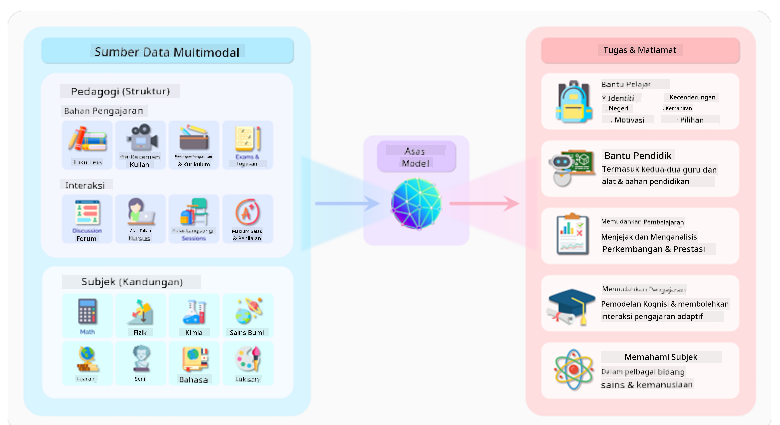
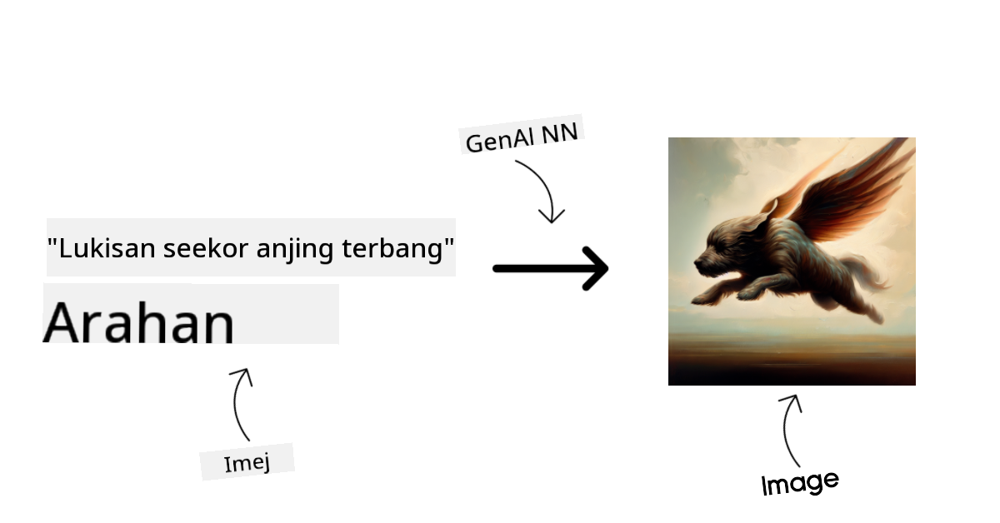
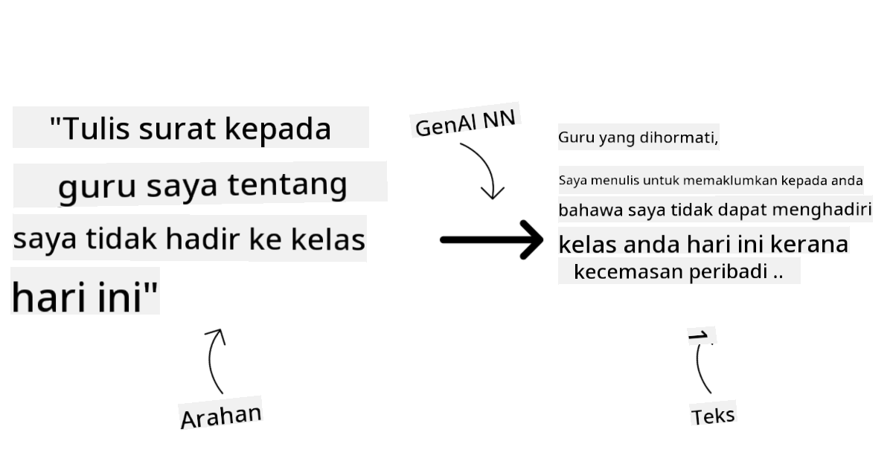
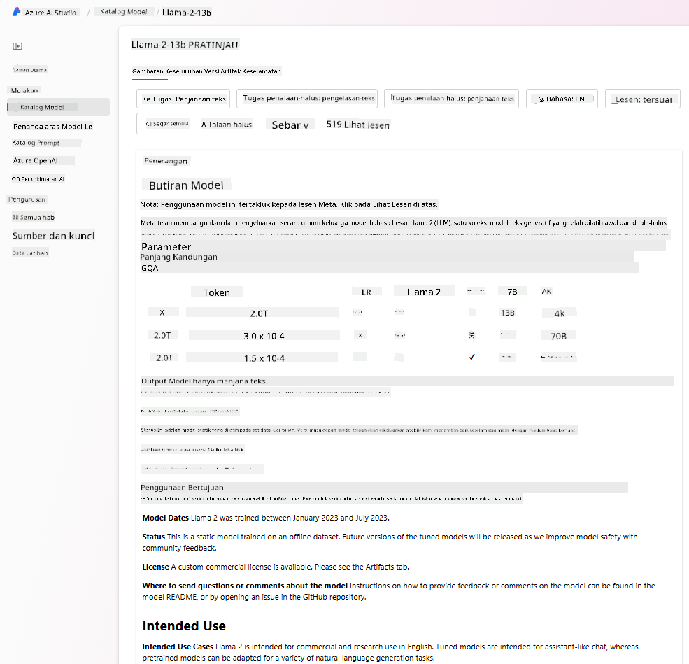

<!--
CO_OP_TRANSLATOR_METADATA:
{
  "original_hash": "6b7629b8ee4d7d874a27213e903d86a7",
  "translation_date": "2025-10-17T20:55:05+00:00",
  "source_file": "02-exploring-and-comparing-different-llms/README.md",
  "language_code": "ms"
}
-->
# Meneroka dan Membandingkan LLM yang Berbeza

> _Klik imej di atas untuk menonton video pelajaran ini_

Dalam pelajaran sebelumnya, kita telah melihat bagaimana AI Generatif mengubah landskap teknologi, bagaimana Model Bahasa Besar (LLM) berfungsi dan bagaimana perniagaan - seperti syarikat permulaan kita - boleh menggunakannya untuk kes penggunaan mereka dan berkembang! Dalam bab ini, kita akan membandingkan dan membezakan pelbagai jenis model bahasa besar (LLM) untuk memahami kelebihan dan kekurangannya.

Langkah seterusnya dalam perjalanan syarikat permulaan kita adalah meneroka landskap semasa LLM dan memahami mana yang sesuai untuk kes penggunaan kita.

## Pengenalan

Pelajaran ini akan merangkumi:

- Jenis-jenis LLM yang berbeza dalam landskap semasa.
- Ujian, iterasi, dan perbandingan model yang berbeza untuk kes penggunaan anda di Azure.
- Cara untuk melancarkan LLM.

## Matlamat Pembelajaran

Selepas menyelesaikan pelajaran ini, anda akan dapat:

- Memilih model yang sesuai untuk kes penggunaan anda.
- Memahami cara menguji, mengulangi, dan meningkatkan prestasi model anda.
- Mengetahui cara perniagaan melancarkan model.

## Memahami Jenis-Jenis LLM yang Berbeza

LLM boleh dikategorikan berdasarkan seni bina, data latihan, dan kes penggunaan mereka. Memahami perbezaan ini akan membantu syarikat permulaan kita memilih model yang sesuai untuk senario tersebut, serta memahami cara menguji, mengulangi, dan meningkatkan prestasi.

Terdapat banyak jenis model LLM yang berbeza, pilihan model anda bergantung pada tujuan penggunaannya, data anda, bajet anda, dan lain-lain.

Bergantung pada sama ada anda ingin menggunakan model untuk teks, audio, video, penjanaan imej dan sebagainya, anda mungkin memilih jenis model yang berbeza.

- **Pengiktirafan audio dan ucapan**. Untuk tujuan ini, model jenis Whisper adalah pilihan yang baik kerana ia bersifat serba guna dan ditujukan untuk pengiktirafan ucapan. Ia dilatih pada pelbagai audio dan boleh melakukan pengiktirafan ucapan pelbagai bahasa. Ketahui lebih lanjut tentang [model jenis Whisper di sini](https://platform.openai.com/docs/models/whisper?WT.mc_id=academic-105485-koreyst).

- **Penjanaan imej**. Untuk penjanaan imej, DALL-E dan Midjourney adalah dua pilihan yang sangat terkenal. DALL-E ditawarkan oleh Azure OpenAI. [Baca lebih lanjut tentang DALL-E di sini](https://platform.openai.com/docs/models/dall-e?WT.mc_id=academic-105485-koreyst) dan juga dalam Bab 9 kurikulum ini.

- **Penjanaan teks**. Kebanyakan model dilatih untuk penjanaan teks dan anda mempunyai pelbagai pilihan dari GPT-3.5 hingga GPT-4. Kosnya berbeza dengan GPT-4 menjadi yang paling mahal. Anda boleh melihat [Azure OpenAI playground](https://oai.azure.com/portal/playground?WT.mc_id=academic-105485-koreyst) untuk menilai model mana yang paling sesuai dengan keperluan anda dari segi kemampuan dan kos.

- **Multi-modality**. Jika anda ingin mengendalikan pelbagai jenis data dalam input dan output, anda mungkin ingin melihat model seperti [gpt-4 turbo dengan vision atau gpt-4o](https://learn.microsoft.com/azure/ai-services/openai/concepts/models#gpt-4-and-gpt-4-turbo-models?WT.mc_id=academic-105485-koreyst) - keluaran terbaru model OpenAI - yang mampu menggabungkan pemprosesan bahasa semula jadi dengan pemahaman visual, membolehkan interaksi melalui antara muka multi-modal.

Memilih model bermaksud anda mendapat beberapa kemampuan asas, yang mungkin tidak mencukupi. Selalunya anda mempunyai data khusus syarikat yang perlu anda sampaikan kepada LLM. Terdapat beberapa pilihan berbeza untuk pendekatan ini, lebih lanjut tentang ini dalam bahagian seterusnya.

### Model Asas berbanding LLM

Istilah Model Asas telah [dicipta oleh penyelidik Stanford](https://arxiv.org/abs/2108.07258?WT.mc_id=academic-105485-koreyst) dan ditakrifkan sebagai model AI yang mengikuti beberapa kriteria, seperti:

- **Dilatih menggunakan pembelajaran tanpa pengawasan atau pembelajaran kendiri**, bermaksud ia dilatih pada data multi-modal yang tidak berlabel, dan tidak memerlukan anotasi atau pelabelan data manusia untuk proses latihannya.
- **Model yang sangat besar**, berdasarkan rangkaian neural yang sangat mendalam yang dilatih pada berbilion parameter.
- **Biasanya bertujuan untuk berfungsi sebagai 'asas' untuk model lain**, bermaksud ia boleh digunakan sebagai titik permulaan untuk membina model lain di atasnya, yang boleh dilakukan dengan penyesuaian.

Sumber imej: [Essential Guide to Foundation Models and Large Language Models | oleh Babar M Bhatti | Medium
](https://thebabar.medium.com/essential-guide-to-foundation-models-and-large-language-models-27dab58f7404)

Untuk menjelaskan lagi perbezaan ini, mari kita ambil ChatGPT sebagai contoh. Untuk membina versi pertama ChatGPT, model yang dipanggil GPT-3.5 berfungsi sebagai model asas. Ini bermaksud OpenAI menggunakan beberapa data khusus chat untuk mencipta versi GPT-3.5 yang disesuaikan dan khusus untuk berprestasi baik dalam senario perbualan, seperti chatbot.

Sumber imej: [2108.07258.pdf (arxiv.org)](https://arxiv.org/pdf/2108.07258.pdf?WT.mc_id=academic-105485-koreyst)

### Model Sumber Terbuka berbanding Model Proprietari

Cara lain untuk mengkategorikan LLM adalah sama ada ia sumber terbuka atau proprietari.

Model sumber terbuka adalah model yang tersedia untuk umum dan boleh digunakan oleh sesiapa sahaja. Ia sering disediakan oleh syarikat yang menciptanya, atau oleh komuniti penyelidikan. Model ini boleh diperiksa, diubah, dan disesuaikan untuk pelbagai kes penggunaan dalam LLM. Walau bagaimanapun, ia tidak selalu dioptimumkan untuk penggunaan produksi, dan mungkin tidak sebaik model proprietari. Tambahan pula, pembiayaan untuk model sumber terbuka boleh terhad, dan ia mungkin tidak dikekalkan jangka panjang atau tidak dikemas kini dengan penyelidikan terkini. Contoh model sumber terbuka yang popular termasuk [Alpaca](https://crfm.stanford.edu/2023/03/13/alpaca.html?WT.mc_id=academic-105485-koreyst), [Bloom](https://huggingface.co/bigscience/bloom) dan [LLaMA](https://llama.meta.com).

Model proprietari adalah model yang dimiliki oleh syarikat dan tidak tersedia untuk umum. Model ini sering dioptimumkan untuk penggunaan produksi. Walau bagaimanapun, ia tidak boleh diperiksa, diubah, atau disesuaikan untuk kes penggunaan yang berbeza. Tambahan pula, ia tidak selalu tersedia secara percuma, dan mungkin memerlukan langganan atau pembayaran untuk digunakan. Juga, pengguna tidak mempunyai kawalan terhadap data yang digunakan untuk melatih model, yang bermaksud mereka harus mempercayai pemilik model untuk memastikan komitmen terhadap privasi data dan penggunaan AI yang bertanggungjawab. Contoh model proprietari yang popular termasuk [Model OpenAI](https://platform.openai.com/docs/models/overview?WT.mc_id=academic-105485-koreyst), [Google Bard](https://sapling.ai/llm/bard?WT.mc_id=academic-105485-koreyst) atau [Claude 2](https://www.anthropic.com/index/claude-2?WT.mc_id=academic-105485-koreyst).

### Embedding berbanding Penjanaan Imej berbanding Penjanaan Teks dan Kod

LLM juga boleh dikategorikan berdasarkan output yang dihasilkannya.

Embedding adalah satu set model yang boleh menukar teks kepada bentuk berangka, yang dipanggil embedding, iaitu representasi berangka teks input. Embedding memudahkan mesin memahami hubungan antara perkataan atau ayat dan boleh digunakan sebagai input oleh model lain, seperti model klasifikasi, atau model pengelompokan yang mempunyai prestasi lebih baik pada data berangka. Model embedding sering digunakan untuk pembelajaran pemindahan, di mana model dibina untuk tugas pengganti yang mempunyai banyak data, dan kemudian berat model (embedding) digunakan semula untuk tugas hiliran lain. Contoh kategori ini adalah [Embedding OpenAI](https://platform.openai.com/docs/models/embeddings?WT.mc_id=academic-105485-koreyst).

Model penjanaan imej adalah model yang menghasilkan imej. Model ini sering digunakan untuk penyuntingan imej, sintesis imej, dan terjemahan imej. Model penjanaan imej sering dilatih pada set data imej yang besar, seperti [LAION-5B](https://laion.ai/blog/laion-5b/?WT.mc_id=academic-105485-koreyst), dan boleh digunakan untuk menghasilkan imej baru atau menyunting imej sedia ada dengan teknik inpainting, super-resolution, dan pewarnaan. Contoh termasuk [DALL-E-3](https://openai.com/dall-e-3?WT.mc_id=academic-105485-koreyst) dan [Model Stable Diffusion](https://github.com/Stability-AI/StableDiffusion?WT.mc_id=academic-105485-koreyst).

Model penjanaan teks dan kod adalah model yang menghasilkan teks atau kod. Model ini sering digunakan untuk ringkasan teks, terjemahan, dan menjawab soalan. Model penjanaan teks sering dilatih pada set data teks yang besar, seperti [BookCorpus](https://www.cv-foundation.org/openaccess/content_iccv_2015/html/Zhu_Aligning_Books_and_ICCV_2015_paper.html?WT.mc_id=academic-105485-koreyst), dan boleh digunakan untuk menghasilkan teks baru, atau menjawab soalan. Model penjanaan kod, seperti [CodeParrot](https://huggingface.co/codeparrot?WT.mc_id=academic-105485-koreyst), sering dilatih pada set data kod yang besar, seperti GitHub, dan boleh digunakan untuk menghasilkan kod baru, atau membetulkan bug dalam kod sedia ada.

### Encoder-Decoder berbanding Decoder-only

Untuk membincangkan jenis seni bina LLM yang berbeza, mari gunakan analogi.

Bayangkan pengurus anda memberikan tugas untuk menulis kuiz untuk pelajar. Anda mempunyai dua rakan sekerja; satu bertanggungjawab mencipta kandungan dan satu lagi bertanggungjawab menyemaknya.

Pencipta kandungan adalah seperti model Decoder-only, mereka boleh melihat topik dan apa yang telah anda tulis dan kemudian dia boleh menulis kursus berdasarkan itu. Mereka sangat baik dalam menulis kandungan yang menarik dan informatif, tetapi mereka tidak begitu baik dalam memahami topik dan objektif pembelajaran. Beberapa contoh model Decoder adalah model keluarga GPT, seperti GPT-3.

Penyemak adalah seperti model Encoder-only, mereka melihat kursus yang ditulis dan jawapan, menyedari hubungan antara mereka dan memahami konteks, tetapi mereka tidak baik dalam menghasilkan kandungan. Contoh model Encoder-only adalah BERT.

Bayangkan kita juga boleh mempunyai seseorang yang boleh mencipta dan menyemak kuiz, ini adalah model Encoder-Decoder. Beberapa contoh adalah BART dan T5.

### Perkhidmatan berbanding Model

Sekarang, mari kita bincangkan perbezaan antara perkhidmatan dan model. Perkhidmatan adalah produk yang ditawarkan oleh Penyedia Perkhidmatan Awan, dan sering kali gabungan model, data, dan komponen lain. Model adalah komponen teras perkhidmatan, dan sering kali merupakan model asas, seperti LLM.

Perkhidmatan sering dioptimumkan untuk penggunaan produksi dan sering lebih mudah digunakan daripada model, melalui antara muka pengguna grafik. Walau bagaimanapun, perkhidmatan tidak selalu tersedia secara percuma, dan mungkin memerlukan langganan atau pembayaran untuk digunakan, sebagai pertukaran untuk memanfaatkan peralatan dan sumber pemilik perkhidmatan, mengoptimumkan perbelanjaan dan skala dengan mudah. Contoh perkhidmatan adalah [Azure OpenAI Service](https://learn.microsoft.com/azure/ai-services/openai/overview?WT.mc_id=academic-105485-koreyst), yang menawarkan pelan kadar bayar-seperti-anda-pergi, bermaksud pengguna dikenakan bayaran secara proporsional dengan seberapa banyak mereka menggunakan perkhidmatan. Selain itu, Azure OpenAI Service menawarkan keselamatan kelas perusahaan dan rangka kerja AI yang bertanggungjawab di atas kemampuan model.

Model hanyalah Rangkaian Neural, dengan parameter, berat, dan lain-lain. Membolehkan syarikat menjalankan secara tempatan, namun, memerlukan pembelian peralatan, membina struktur untuk skala dan membeli lesen atau menggunakan model sumber terbuka. Model seperti LLaMA tersedia untuk digunakan, memerlukan kuasa pengkomputeran untuk menjalankan model.

## Cara Menguji dan Mengulangi dengan Model Berbeza untuk Memahami Prestasi di Azure

Setelah pasukan kita meneroka landskap LLM semasa dan mengenal pasti beberapa calon yang baik untuk senario mereka, langkah seterusnya adalah mengujinya pada data mereka dan pada beban kerja mereka. Ini adalah proses iteratif, dilakukan melalui eksperimen dan ukuran.
Kebanyakan model yang kami sebutkan dalam perenggan sebelumnya (model OpenAI, model sumber terbuka seperti Llama2, dan transformer Hugging Face) tersedia dalam [Katalog Model](https://learn.microsoft.com/azure/ai-studio/how-to/model-catalog-overview?WT.mc_id=academic-105485-koreyst) di [Azure AI Studio](https://ai.azure.com/?WT.mc_id=academic-105485-koreyst).

[Azure AI Studio](https://learn.microsoft.com/azure/ai-studio/what-is-ai-studio?WT.mc_id=academic-105485-koreyst) adalah platform awan yang direka untuk pembangun membina aplikasi AI generatif dan mengurus keseluruhan kitaran pembangunan - dari eksperimen hingga penilaian - dengan menggabungkan semua perkhidmatan Azure AI ke dalam satu hab dengan GUI yang mudah digunakan. Katalog Model dalam Azure AI Studio membolehkan pengguna untuk:

- Mencari Model Asas yang diminati dalam katalog - sama ada model proprietari atau sumber terbuka, dengan menapis mengikut tugas, lesen, atau nama. Untuk meningkatkan kebolehcarian, model-model ini diatur dalam koleksi seperti koleksi Azure OpenAI, koleksi Hugging Face, dan lain-lain.

- Menyemak kad model, termasuk penerangan terperinci tentang penggunaan yang dimaksudkan dan data latihan, sampel kod, dan hasil penilaian dalam perpustakaan penilaian dalaman.

- Membandingkan penanda aras antara model dan dataset yang tersedia dalam industri untuk menilai mana yang memenuhi senario perniagaan, melalui panel [Penanda Aras Model](https://learn.microsoft.com/azure/ai-studio/how-to/model-benchmarks?WT.mc_id=academic-105485-koreyst).

- Menyesuaikan model dengan data latihan tersuai untuk meningkatkan prestasi model dalam beban kerja tertentu, dengan memanfaatkan keupayaan eksperimen dan penjejakan Azure AI Studio.

- Melancarkan model pra-latihan asal atau versi yang telah disesuaikan untuk inferens masa nyata jauh - pengkomputeran terurus - atau titik akhir API tanpa pelayan - [bayar mengikut penggunaan](https://learn.microsoft.com/azure/ai-studio/how-to/model-catalog-overview#model-deployment-managed-compute-and-serverless-api-pay-as-you-go?WT.mc_id=academic-105485-koreyst) - untuk membolehkan aplikasi menggunakannya.

> [!NOTE]
> Tidak semua model dalam katalog kini tersedia untuk penyesuaian dan/atau pelancaran bayar mengikut penggunaan. Semak kad model untuk butiran tentang keupayaan dan batasan model.

## Meningkatkan Hasil LLM

Kami telah meneroka dengan pasukan permulaan kami pelbagai jenis LLM dan platform awan (Azure Machine Learning) yang membolehkan kami membandingkan model yang berbeza, menilai mereka pada data ujian, meningkatkan prestasi, dan melancarkan mereka pada titik akhir inferens.

Tetapi bila mereka harus mempertimbangkan untuk menyesuaikan model daripada menggunakan model pra-latihan? Adakah terdapat pendekatan lain untuk meningkatkan prestasi model pada beban kerja tertentu?

Terdapat beberapa pendekatan yang boleh digunakan oleh perniagaan untuk mendapatkan hasil yang mereka perlukan daripada LLM. Anda boleh memilih pelbagai jenis model dengan tahap latihan yang berbeza semasa melancarkan LLM dalam pengeluaran, dengan tahap kerumitan, kos, dan kualiti yang berbeza. Berikut adalah beberapa pendekatan:

- **Kejuruteraan prompt dengan konteks**. Idea ini adalah untuk memberikan konteks yang mencukupi semasa anda membuat prompt untuk memastikan anda mendapat respons yang anda perlukan.

- **Retrieval Augmented Generation, RAG**. Data anda mungkin wujud dalam pangkalan data atau titik akhir web contohnya, untuk memastikan data ini, atau subset daripadanya, dimasukkan semasa membuat prompt, anda boleh mendapatkan data yang relevan dan menjadikannya sebahagian daripada prompt pengguna.

- **Model yang disesuaikan**. Di sini, anda melatih model lebih lanjut dengan data anda sendiri yang menjadikan model lebih tepat dan responsif kepada keperluan anda tetapi mungkin mahal.

Sumber gambar: [Four Ways that Enterprises Deploy LLMs | Fiddler AI Blog](https://www.fiddler.ai/blog/four-ways-that-enterprises-deploy-llms?WT.mc_id=academic-105485-koreyst)

### Kejuruteraan Prompt dengan Konteks

LLM pra-latihan berfungsi dengan sangat baik pada tugas bahasa semula jadi yang umum, walaupun dengan hanya memberikan prompt pendek, seperti ayat untuk dilengkapkan atau soalan – yang dikenali sebagai pembelajaran "zero-shot".

Namun, semakin banyak pengguna dapat merangka pertanyaan mereka, dengan permintaan terperinci dan contoh – Konteks – semakin tepat dan sesuai dengan jangkaan pengguna jawapannya. Dalam kes ini, kita bercakap tentang pembelajaran "one-shot" jika prompt hanya mengandungi satu contoh dan "few-shot learning" jika ia mengandungi beberapa contoh. Kejuruteraan prompt dengan konteks adalah pendekatan yang paling kos efektif untuk memulakan.

### Retrieval Augmented Generation (RAG)

LLM mempunyai batasan di mana mereka hanya boleh menggunakan data yang telah digunakan semasa latihan mereka untuk menghasilkan jawapan. Ini bermakna mereka tidak tahu apa-apa tentang fakta yang berlaku selepas proses latihan mereka, dan mereka tidak dapat mengakses maklumat bukan awam (seperti data syarikat). 

Ini boleh diatasi melalui RAG, teknik yang menambah prompt dengan data luaran dalam bentuk potongan dokumen, dengan mempertimbangkan had panjang prompt. Ini disokong oleh alat pangkalan data vektor (seperti [Azure Vector Search](https://learn.microsoft.com/azure/search/vector-search-overview?WT.mc_id=academic-105485-koreyst)) yang mendapatkan potongan berguna daripada pelbagai sumber data yang telah ditetapkan dan menambahkannya kepada Konteks prompt.

Teknik ini sangat berguna apabila perniagaan tidak mempunyai cukup data, masa, atau sumber untuk menyesuaikan LLM, tetapi masih ingin meningkatkan prestasi pada beban kerja tertentu dan mengurangkan risiko fabrikasi, iaitu, penyimpangan realiti atau kandungan yang berbahaya.

### Model yang Disesuaikan

Penyesuaian adalah proses yang memanfaatkan pembelajaran pemindahan untuk 'menyesuaikan' model kepada tugas hiliran atau untuk menyelesaikan masalah tertentu. Berbeza dengan pembelajaran few-shot dan RAG, ia menghasilkan model baru dengan berat dan bias yang dikemas kini. Ia memerlukan satu set contoh latihan yang terdiri daripada satu input (prompt) dan output yang berkaitan (penyelesaian). 

Pendekatan ini akan menjadi pilihan jika:

- **Menggunakan model yang disesuaikan**. Perniagaan ingin menggunakan model yang disesuaikan yang kurang mampu (seperti model embedding) daripada model berprestasi tinggi, menghasilkan penyelesaian yang lebih kos efektif dan pantas.

- **Mempertimbangkan latensi**. Latensi adalah penting untuk kes penggunaan tertentu, jadi tidak mungkin menggunakan prompt yang sangat panjang atau jumlah contoh yang harus dipelajari oleh model tidak sesuai dengan had panjang prompt.

- **Tetap terkini**. Perniagaan mempunyai banyak data berkualiti tinggi dan label kebenaran asas serta sumber yang diperlukan untuk mengekalkan data ini terkini dari masa ke masa.

### Model yang Dilatih

Melatih LLM dari awal adalah tanpa ragu-ragu pendekatan yang paling sukar dan paling kompleks untuk diterapkan, memerlukan sejumlah besar data, sumber yang mahir, dan kuasa pengkomputeran yang sesuai. Pilihan ini hanya perlu dipertimbangkan dalam senario di mana perniagaan mempunyai kes penggunaan khusus domain dan sejumlah besar data berpusatkan domain.

## Semakan Pengetahuan

Apakah pendekatan yang baik untuk meningkatkan hasil penyelesaian LLM?

1. Kejuruteraan prompt dengan konteks
1. RAG
1. Model yang disesuaikan

A:3, jika anda mempunyai masa dan sumber serta data berkualiti tinggi, penyesuaian adalah pilihan yang lebih baik untuk tetap terkini. Walau bagaimanapun, jika anda ingin meningkatkan sesuatu dan kekurangan masa, ia berbaloi untuk mempertimbangkan RAG terlebih dahulu.

## 🚀 Cabaran

Baca lebih lanjut tentang bagaimana anda boleh [menggunakan RAG](https://learn.microsoft.com/azure/search/retrieval-augmented-generation-overview?WT.mc_id=academic-105485-koreyst) untuk perniagaan anda.

## Kerja Hebat, Teruskan Pembelajaran Anda

Selepas menyelesaikan pelajaran ini, lihat [koleksi Pembelajaran AI Generatif](https://aka.ms/genai-collection?WT.mc_id=academic-105485-koreyst) kami untuk terus meningkatkan pengetahuan AI Generatif anda!

Pergi ke Pelajaran 3 di mana kita akan melihat bagaimana untuk [membina dengan AI Generatif Secara Bertanggungjawab](../03-using-generative-ai-responsibly/README.md?WT.mc_id=academic-105485-koreyst)!

---

**Penafian**:  
Dokumen ini telah diterjemahkan menggunakan perkhidmatan terjemahan AI [Co-op Translator](https://github.com/Azure/co-op-translator). Walaupun kami berusaha untuk ketepatan, sila ambil perhatian bahawa terjemahan automatik mungkin mengandungi kesilapan atau ketidaktepatan. Dokumen asal dalam bahasa asalnya harus dianggap sebagai sumber yang berwibawa. Untuk maklumat penting, terjemahan manusia profesional adalah disyorkan. Kami tidak bertanggungjawab atas sebarang salah faham atau salah tafsir yang timbul daripada penggunaan terjemahan ini.