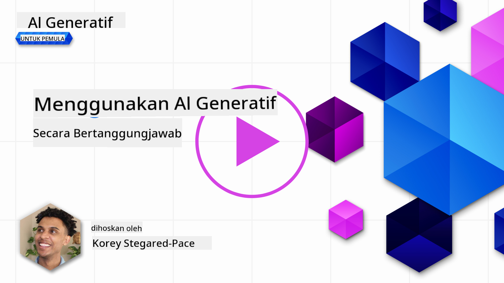
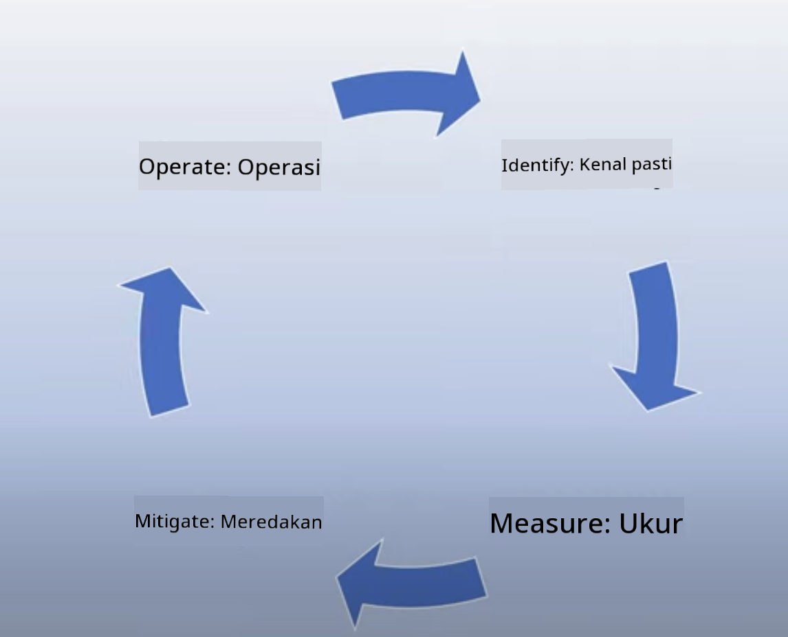

<!--
CO_OP_TRANSLATOR_METADATA:
{
  "original_hash": "13084c6321a2092841b9a081b29497ba",
  "translation_date": "2025-05-19T14:46:19+00:00",
  "source_file": "03-using-generative-ai-responsibly/README.md",
  "language_code": "ms"
}
-->
# Menggunakan AI Generatif Secara Bertanggungjawab

> _Klik gambar di atas untuk menonton video pelajaran ini_

Mudah untuk terpesona dengan AI, khususnya AI generatif, tetapi anda perlu mempertimbangkan bagaimana anda akan menggunakannya secara bertanggungjawab. Anda perlu memikirkan perkara seperti memastikan hasilnya adil, tidak berbahaya dan banyak lagi. Bab ini bertujuan untuk memberikan anda konteks yang disebutkan, apa yang perlu dipertimbangkan, dan bagaimana mengambil langkah aktif untuk meningkatkan penggunaan AI anda.

## Pengenalan

Pelajaran ini akan merangkumi:

- Mengapa anda perlu memprioritaskan AI Bertanggungjawab ketika membina aplikasi AI Generatif.
- Prinsip utama AI Bertanggungjawab dan bagaimana ia berkaitan dengan AI Generatif.
- Cara menerapkan prinsip AI Bertanggungjawab ini melalui strategi dan alat.

## Matlamat Pembelajaran

Selepas menyelesaikan pelajaran ini, anda akan tahu:

- Kepentingan AI Bertanggungjawab ketika membina aplikasi AI Generatif.
- Bila untuk memikirkan dan menerapkan prinsip utama AI Bertanggungjawab ketika membina aplikasi AI Generatif.
- Alat dan strategi yang tersedia untuk anda untuk menerapkan konsep AI Bertanggungjawab.

## Prinsip AI Bertanggungjawab

Keterujaan terhadap AI Generatif tidak pernah lebih tinggi. Keterujaan ini telah menarik banyak pemaju baru, perhatian, dan pembiayaan ke dalam ruang ini. Walaupun ini sangat positif bagi sesiapa yang ingin membina produk dan syarikat menggunakan AI Generatif, adalah penting kita bergerak dengan bertanggungjawab.

Sepanjang kursus ini, kita fokus pada membina startup kita dan produk pendidikan AI kita. Kita akan menggunakan prinsip AI Bertanggungjawab: Keadilan, Inklusiviti, Kebolehpercayaan/Keselamatan, Keselamatan & Privasi, Ketelusan dan Akauntabiliti. Dengan prinsip ini, kita akan meneroka bagaimana ia berkaitan dengan penggunaan AI Generatif dalam produk kita.

## Mengapa Anda Perlu Memprioritaskan AI Bertanggungjawab

Apabila membina produk, mengambil pendekatan berpusatkan manusia dengan menjaga kepentingan terbaik pengguna anda membawa kepada hasil terbaik.

Keunikan AI Generatif adalah kekuatannya untuk mencipta jawapan, maklumat, panduan, dan kandungan yang berguna untuk pengguna. Ini boleh dilakukan tanpa banyak langkah manual yang boleh membawa kepada hasil yang sangat mengagumkan. Tanpa perancangan dan strategi yang betul, ia juga boleh membawa kepada beberapa hasil yang berbahaya bagi pengguna anda, produk anda, dan masyarakat secara keseluruhan.

Mari kita lihat beberapa (tetapi tidak semua) daripada hasil yang berpotensi berbahaya ini:

### Halusinasi

Halusinasi adalah istilah yang digunakan untuk menggambarkan apabila LLM menghasilkan kandungan yang sama sekali tidak masuk akal atau sesuatu yang kita tahu adalah salah berdasarkan sumber maklumat lain.

Mari kita ambil contoh kita membina ciri untuk startup kita yang membolehkan pelajar bertanya soalan sejarah kepada model. Seorang pelajar bertanya soalan `Who was the sole survivor of Titanic?`

Model menghasilkan jawapan seperti yang di bawah:

> _(Sumber: [Flying bisons](https://flyingbisons.com?WT.mc_id=academic-105485-koreyst))_

Ini adalah jawapan yang sangat yakin dan teliti. Malangnya, ia adalah salah. Walaupun dengan sedikit penyelidikan, seseorang akan mendapati ada lebih daripada satu yang terselamat dari bencana Titanic. Bagi seorang pelajar yang baru memulakan penyelidikan topik ini, jawapan ini boleh menjadi cukup meyakinkan untuk tidak dipersoalkan dan dianggap sebagai fakta. Akibatnya boleh menyebabkan sistem AI menjadi tidak boleh dipercayai dan memberi kesan negatif kepada reputasi startup kita.

Dengan setiap iterasi mana-mana LLM yang diberikan, kita telah melihat peningkatan prestasi dalam meminimumkan halusinasi. Walaupun dengan peningkatan ini, kita sebagai pembina aplikasi dan pengguna masih perlu sedar akan batasan ini.

### Kandungan Berbahaya

Kita telah membincangkan dalam bahagian sebelumnya apabila LLM menghasilkan jawapan yang salah atau tidak masuk akal. Risiko lain yang perlu kita sedari adalah apabila model memberikan respons dengan kandungan berbahaya.

Kandungan berbahaya boleh didefinisikan sebagai:

- Memberikan arahan atau menggalakkan kecederaan diri atau kecederaan kepada kumpulan tertentu.
- Kandungan yang membenci atau menghina.
- Memandu perancangan sebarang jenis serangan atau tindakan ganas.
- Memberikan arahan tentang cara mencari kandungan haram atau melakukan tindakan haram.
- Menampilkan kandungan seksual eksplisit.

Untuk startup kita, kita ingin memastikan kita mempunyai alat dan strategi yang betul untuk mencegah jenis kandungan ini dilihat oleh pelajar.

### Kekurangan Keadilan

Keadilan didefinisikan sebagai “memastikan bahawa sistem AI bebas dari bias dan diskriminasi dan bahawa mereka melayan semua orang dengan adil dan sama rata.” Dalam dunia AI Generatif, kita ingin memastikan bahawa pandangan dunia yang mengecualikan kumpulan terpinggir tidak dikuatkan oleh output model.

Jenis output ini bukan sahaja merosakkan untuk membina pengalaman produk yang positif untuk pengguna kita, tetapi juga menyebabkan kerosakan masyarakat lebih lanjut. Sebagai pembina aplikasi, kita harus sentiasa menjaga pangkalan pengguna yang luas dan pelbagai ketika membina penyelesaian dengan AI Generatif.

## Cara Menggunakan AI Generatif Secara Bertanggungjawab

Sekarang kita telah mengenal pasti kepentingan AI Generatif yang Bertanggungjawab, mari kita lihat 4 langkah yang boleh kita ambil untuk membina penyelesaian AI kita secara bertanggungjawab:

### Mengukur Potensi Bahaya

Dalam ujian perisian, kita menguji tindakan yang dijangka dari pengguna pada aplikasi. Begitu juga, menguji set arahan yang pelbagai yang paling mungkin digunakan oleh pengguna adalah cara yang baik untuk mengukur potensi bahaya.

Oleh kerana startup kita sedang membina produk pendidikan, adalah baik untuk menyediakan senarai arahan berkaitan pendidikan. Ini boleh merangkumi subjek tertentu, fakta sejarah, dan arahan tentang kehidupan pelajar.

### Mitigasi Potensi Bahaya

Sekarang adalah masa untuk mencari cara di mana kita boleh mencegah atau mengehadkan potensi bahaya yang disebabkan oleh model dan responsnya. Kita boleh melihat ini dalam 4 lapisan berbeza:

- **Model**. Memilih model yang tepat untuk kes penggunaan yang tepat. Model yang lebih besar dan kompleks seperti GPT-4 boleh menyebabkan lebih banyak risiko kandungan berbahaya apabila diterapkan kepada kes penggunaan yang lebih kecil dan lebih spesifik. Menggunakan data latihan anda untuk menyempurnakan juga mengurangkan risiko kandungan berbahaya.

- **Sistem Keselamatan**. Sistem keselamatan adalah set alat dan konfigurasi pada platform yang menyajikan model yang membantu mengurangkan bahaya. Contoh ini adalah sistem penapisan kandungan pada perkhidmatan Azure OpenAI. Sistem juga harus mengesan serangan jailbreak dan aktiviti yang tidak diingini seperti permintaan dari bot.

- **Metaprompt**. Metaprompts dan peneguhan adalah cara kita boleh mengarahkan atau mengehadkan model berdasarkan tingkah laku dan maklumat tertentu. Ini boleh menggunakan input sistem untuk menentukan had tertentu model. Selain itu, menyediakan output yang lebih relevan dengan skop atau domain sistem.

Ia juga boleh menggunakan teknik seperti Retrieval Augmented Generation (RAG) untuk membolehkan model hanya menarik maklumat dari pilihan sumber yang dipercayai. Terdapat pelajaran kemudian dalam kursus ini untuk [membina aplikasi carian](../08-building-search-applications/README.md?WT.mc_id=academic-105485-koreyst)

- **Pengalaman Pengguna**. Lapisan terakhir adalah di mana pengguna berinteraksi secara langsung dengan model melalui antara muka aplikasi kita dengan cara tertentu. Dengan cara ini kita boleh mereka bentuk UI/UX untuk mengehadkan pengguna pada jenis input yang boleh mereka hantar kepada model serta teks atau imej yang dipaparkan kepada pengguna. Apabila melancarkan aplikasi AI, kita juga harus telus tentang apa yang aplikasi AI Generatif kita boleh dan tidak boleh lakukan.

Kita mempunyai pelajaran yang dikhususkan untuk [Mereka bentuk UX untuk Aplikasi AI](../12-designing-ux-for-ai-applications/README.md?WT.mc_id=academic-105485-koreyst)

- **Menilai model**. Bekerja dengan LLM boleh menjadi mencabar kerana kita tidak selalu mempunyai kawalan ke atas data yang model dilatih. Walau bagaimanapun, kita harus sentiasa menilai prestasi dan output model. Ia masih penting untuk mengukur ketepatan model, kesamaan, peneguhan, dan relevansi output. Ini membantu memberikan ketelusan dan kepercayaan kepada pihak berkepentingan dan pengguna.

### Mengendalikan penyelesaian AI Generatif yang Bertanggungjawab

Membina amalan operasi di sekitar aplikasi AI anda adalah tahap akhir. Ini termasuk bekerjasama dengan bahagian lain dari startup kita seperti Legal dan Security untuk memastikan kita mematuhi semua polisi peraturan. Sebelum melancarkan, kita juga ingin membina rancangan di sekitar penghantaran, menangani insiden, dan rollback untuk mencegah sebarang bahaya kepada pengguna kita dari berkembang.

## Alat

Walaupun kerja membangunkan penyelesaian AI Bertanggungjawab mungkin kelihatan banyak, ia adalah kerja yang berbaloi. Apabila kawasan AI Generatif berkembang, lebih banyak alat untuk membantu pemaju mengintegrasikan tanggungjawab ke dalam aliran kerja mereka dengan cekap akan matang. Sebagai contoh, [Azure AI Content Safety](https://learn.microsoft.com/azure/ai-services/content-safety/overview?WT.mc_id=academic-105485-koreyst) boleh membantu mengesan kandungan dan imej berbahaya melalui permintaan API.

## Pemeriksaan Pengetahuan

Apakah beberapa perkara yang perlu anda ambil berat untuk memastikan penggunaan AI yang bertanggungjawab?

1. Bahawa jawapan adalah betul.
1. Penggunaan berbahaya, bahawa AI tidak digunakan untuk tujuan jenayah.
1. Memastikan AI bebas dari bias dan diskriminasi.

A: 2 dan 3 adalah betul. AI Bertanggungjawab membantu anda mempertimbangkan bagaimana untuk mengurangkan kesan berbahaya dan bias dan banyak lagi.

## 🚀 Cabaran

Baca tentang [Azure AI Content Safety](https://learn.microsoft.com/azure/ai-services/content-safety/overview?WT.mc_id=academic-105485-koreyst) dan lihat apa yang anda boleh terapkan untuk penggunaan anda.

## Kerja Hebat, Teruskan Pembelajaran Anda

Selepas menyelesaikan pelajaran ini, lihat [koleksi Pembelajaran AI Generatif kami](https://aka.ms/genai-collection?WT.mc_id=academic-105485-koreyst) untuk terus meningkatkan pengetahuan AI Generatif anda!

Pergi ke Pelajaran 4 di mana kita akan melihat [Asas Kejuruteraan Arahan](../04-prompt-engineering-fundamentals/README.md?WT.mc_id=academic-105485-koreyst)!

**Penafian**:  
Dokumen ini telah diterjemahkan menggunakan perkhidmatan terjemahan AI [Co-op Translator](https://github.com/Azure/co-op-translator). Walaupun kami berusaha untuk ketepatan, sila ambil perhatian bahawa terjemahan automatik mungkin mengandungi kesilapan atau ketidaktepatan. Dokumen asal dalam bahasa asalnya harus dianggap sebagai sumber yang berwibawa. Untuk maklumat kritikal, terjemahan manusia profesional adalah disyorkan. Kami tidak bertanggungjawab atas sebarang salah faham atau salah tafsir yang timbul daripada penggunaan terjemahan ini.