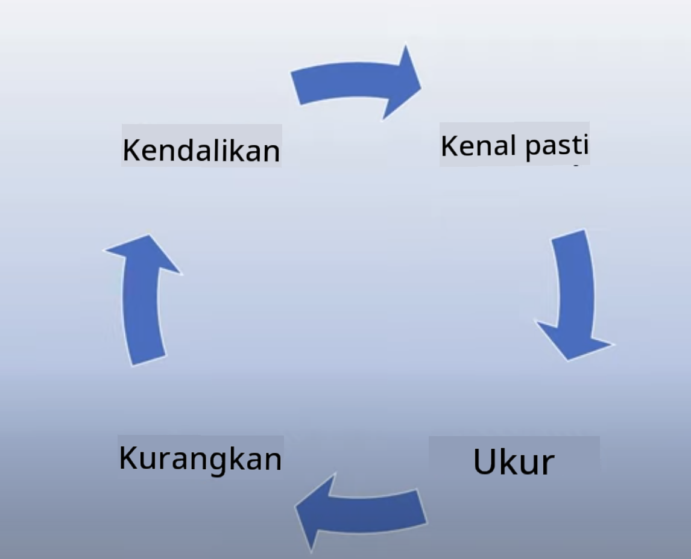

<!--
CO_OP_TRANSLATOR_METADATA:
{
  "original_hash": "4d57fad773cbeb69c5dd62e65c34200d",
  "translation_date": "2025-10-17T20:53:54+00:00",
  "source_file": "03-using-generative-ai-responsibly/README.md",
  "language_code": "ms"
}
-->
# Menggunakan AI Generatif Secara Bertanggungjawab

> _Klik imej di atas untuk menonton video pelajaran ini_

AI, terutamanya AI generatif, memang menarik perhatian ramai, tetapi anda perlu mempertimbangkan cara menggunakannya dengan bertanggungjawab. Anda perlu memikirkan bagaimana memastikan hasilnya adil, tidak berbahaya, dan lain-lain. Bab ini bertujuan untuk memberikan konteks yang disebutkan, perkara yang perlu dipertimbangkan, dan langkah aktif untuk meningkatkan penggunaan AI anda.

## Pengenalan

Pelajaran ini akan merangkumi:

- Mengapa anda perlu mengutamakan AI Bertanggungjawab semasa membina aplikasi AI Generatif.
- Prinsip utama AI Bertanggungjawab dan bagaimana ia berkaitan dengan AI Generatif.
- Cara mengamalkan prinsip AI Bertanggungjawab melalui strategi dan alat.

## Matlamat Pembelajaran

Selepas menyelesaikan pelajaran ini, anda akan mengetahui:

- Kepentingan AI Bertanggungjawab semasa membina aplikasi AI Generatif.
- Bila untuk memikirkan dan menerapkan prinsip utama AI Bertanggungjawab semasa membina aplikasi AI Generatif.
- Alat dan strategi yang tersedia untuk anda untuk mengamalkan konsep AI Bertanggungjawab.

## Prinsip AI Bertanggungjawab

Keterujaan terhadap AI Generatif tidak pernah setinggi ini. Keterujaan ini telah membawa ramai pembangun baru, perhatian, dan pembiayaan ke ruang ini. Walaupun ini sangat positif bagi sesiapa yang ingin membina produk dan syarikat menggunakan AI Generatif, adalah penting untuk kita melangkah dengan bertanggungjawab.

Sepanjang kursus ini, kita akan fokus pada membina startup kita dan produk pendidikan AI kita. Kita akan menggunakan prinsip AI Bertanggungjawab: Keadilan, Keterangkuman, Kebolehpercayaan/Keselamatan, Keselamatan & Privasi, Ketelusan, dan Akauntabiliti. Dengan prinsip ini, kita akan meneroka bagaimana ia berkaitan dengan penggunaan AI Generatif dalam produk kita.

## Mengapa Anda Perlu Mengutamakan AI Bertanggungjawab

Semasa membina produk, pendekatan berpusatkan manusia dengan mengutamakan kepentingan pengguna anda membawa kepada hasil terbaik.

Keunikan AI Generatif adalah kuasanya untuk mencipta jawapan, maklumat, panduan, dan kandungan yang berguna untuk pengguna. Ini boleh dilakukan tanpa banyak langkah manual yang boleh menghasilkan keputusan yang sangat mengagumkan. Tanpa perancangan dan strategi yang betul, ia juga boleh membawa kepada beberapa hasil yang berbahaya untuk pengguna anda, produk anda, dan masyarakat secara keseluruhan.

Mari kita lihat beberapa (tetapi tidak semua) hasil yang berpotensi berbahaya ini:

### Halusinasi

Halusinasi adalah istilah yang digunakan untuk menggambarkan apabila LLM menghasilkan kandungan yang sama sekali tidak masuk akal atau sesuatu yang kita tahu salah secara fakta berdasarkan sumber maklumat lain.

Sebagai contoh, kita membina ciri untuk startup kita yang membolehkan pelajar bertanya soalan sejarah kepada model. Seorang pelajar bertanya soalan `Siapa satu-satunya yang terselamat dari Titanic?`

Model menghasilkan jawapan seperti di bawah:

> _(Sumber: [Flying bisons](https://flyingbisons.com?WT.mc_id=academic-105485-koreyst))_

Ini adalah jawapan yang sangat yakin dan terperinci. Malangnya, ia salah. Walaupun dengan sedikit penyelidikan, seseorang akan mendapati terdapat lebih daripada satu yang terselamat dari bencana Titanic. Bagi seorang pelajar yang baru mula menyelidik topik ini, jawapan ini boleh cukup meyakinkan untuk tidak dipersoalkan dan dianggap sebagai fakta. Akibatnya boleh menyebabkan sistem AI menjadi tidak boleh dipercayai dan memberi kesan negatif kepada reputasi startup kita.

Dengan setiap iterasi mana-mana LLM, kita telah melihat peningkatan prestasi dalam meminimumkan halusinasi. Walaupun dengan peningkatan ini, kita sebagai pembina aplikasi dan pengguna masih perlu sedar akan batasan ini.

### Kandungan Berbahaya

Kita telah membincangkan dalam bahagian sebelumnya apabila LLM menghasilkan respons yang salah atau tidak masuk akal. Risiko lain yang perlu kita sedari adalah apabila model memberikan kandungan yang berbahaya.

Kandungan berbahaya boleh didefinisikan sebagai:

- Memberikan arahan atau menggalakkan mencederakan diri sendiri atau kumpulan tertentu.
- Kandungan yang bersifat kebencian atau merendahkan.
- Membimbing perancangan sebarang jenis serangan atau tindakan ganas.
- Memberikan arahan tentang cara mencari kandungan haram atau melakukan perbuatan haram.
- Memaparkan kandungan yang bersifat seksual secara eksplisit.

Untuk startup kita, kita ingin memastikan kita mempunyai alat dan strategi yang betul untuk mencegah jenis kandungan ini daripada dilihat oleh pelajar.

### Kekurangan Keadilan

Keadilan didefinisikan sebagai “memastikan sistem AI bebas dari bias dan diskriminasi serta melayan semua orang dengan adil dan sama rata.” Dalam dunia AI Generatif, kita ingin memastikan pandangan dunia yang mengecualikan kumpulan terpinggir tidak diperkuat oleh output model.

Jenis output ini bukan sahaja merosakkan pengalaman produk yang positif untuk pengguna kita, tetapi juga menyebabkan kerosakan masyarakat yang lebih besar. Sebagai pembina aplikasi, kita harus sentiasa mempertimbangkan pangkalan pengguna yang luas dan pelbagai semasa membina penyelesaian dengan AI Generatif.

## Cara Menggunakan AI Generatif Secara Bertanggungjawab

Sekarang kita telah mengenal pasti kepentingan AI Generatif yang Bertanggungjawab, mari kita lihat 4 langkah yang boleh kita ambil untuk membina penyelesaian AI kita secara bertanggungjawab:

### Mengukur Potensi Bahaya

Dalam ujian perisian, kita menguji tindakan yang dijangkakan pengguna pada aplikasi. Begitu juga, menguji set pelbagai prompt yang kemungkinan besar akan digunakan oleh pengguna adalah cara yang baik untuk mengukur potensi bahaya.

Oleh kerana startup kita membina produk pendidikan, adalah baik untuk menyediakan senarai prompt berkaitan pendidikan. Ini boleh meliputi subjek tertentu, fakta sejarah, dan prompt tentang kehidupan pelajar.

### Mengurangkan Potensi Bahaya

Kini tiba masanya untuk mencari cara di mana kita boleh mencegah atau mengehadkan potensi bahaya yang disebabkan oleh model dan responsnya. Kita boleh melihat ini dalam 4 lapisan berbeza:

- **Model**. Memilih model yang sesuai untuk kes penggunaan yang sesuai. Model yang lebih besar dan kompleks seperti GPT-4 boleh menyebabkan lebih banyak risiko kandungan berbahaya apabila digunakan untuk kes penggunaan yang lebih kecil dan spesifik. Menggunakan data latihan anda untuk penalaan juga mengurangkan risiko kandungan berbahaya.

- **Sistem Keselamatan**. Sistem keselamatan adalah satu set alat dan konfigurasi pada platform yang menyajikan model yang membantu mengurangkan bahaya. Contohnya adalah sistem penapisan kandungan pada perkhidmatan Azure OpenAI. Sistem juga harus mengesan serangan jailbreak dan aktiviti yang tidak diingini seperti permintaan dari bot.

- **Metaprompt**. Metaprompt dan pengasasan adalah cara kita boleh mengarahkan atau mengehadkan model berdasarkan tingkah laku dan maklumat tertentu. Ini boleh menggunakan input sistem untuk menentukan had tertentu model. Selain itu, memberikan output yang lebih relevan dengan skop atau domain sistem.

Ia juga boleh menggunakan teknik seperti Retrieval Augmented Generation (RAG) untuk membolehkan model hanya mengambil maklumat dari pilihan sumber yang dipercayai. Terdapat pelajaran kemudian dalam kursus ini untuk [membina aplikasi carian](../08-building-search-applications/README.md?WT.mc_id=academic-105485-koreyst)

- **Pengalaman Pengguna**. Lapisan terakhir adalah di mana pengguna berinteraksi secara langsung dengan model melalui antara muka aplikasi kita dalam beberapa cara. Dengan cara ini kita boleh mereka bentuk UI/UX untuk mengehadkan pengguna pada jenis input yang boleh mereka hantar kepada model serta teks atau imej yang dipaparkan kepada pengguna. Semasa melancarkan aplikasi AI, kita juga mesti telus tentang apa yang aplikasi AI Generatif kita boleh dan tidak boleh lakukan.

Kita mempunyai pelajaran khusus untuk [Mereka Bentuk UX untuk Aplikasi AI](../12-designing-ux-for-ai-applications/README.md?WT.mc_id=academic-105485-koreyst)

- **Menilai model**. Bekerja dengan LLM boleh mencabar kerana kita tidak selalu mempunyai kawalan ke atas data yang digunakan untuk melatih model. Walau bagaimanapun, kita harus sentiasa menilai prestasi dan output model. Masih penting untuk mengukur ketepatan, kesamaan, pengasasan, dan relevansi output model. Ini membantu memberikan ketelusan dan kepercayaan kepada pihak berkepentingan dan pengguna.

### Mengoperasikan Penyelesaian AI Generatif yang Bertanggungjawab

Membina amalan operasi di sekitar aplikasi AI anda adalah peringkat terakhir. Ini termasuk bekerjasama dengan bahagian lain dalam startup kita seperti Legal dan Security untuk memastikan kita mematuhi semua polisi peraturan. Sebelum melancarkan, kita juga ingin membina rancangan sekitar penghantaran, pengendalian insiden, dan rollback untuk mencegah sebarang bahaya kepada pengguna kita daripada berkembang.

## Alat

Walaupun kerja membangunkan penyelesaian AI Bertanggungjawab mungkin kelihatan banyak, ia adalah usaha yang sangat berbaloi. Apabila bidang AI Generatif berkembang, lebih banyak alat untuk membantu pembangun mengintegrasikan tanggungjawab ke dalam aliran kerja mereka akan matang. Contohnya, [Azure AI Content Safety](https://learn.microsoft.com/azure/ai-services/content-safety/overview?WT.mc_id=academic-105485-koreyst) boleh membantu mengesan kandungan dan imej berbahaya melalui permintaan API.

## Semakan Pengetahuan

Apakah beberapa perkara yang perlu anda ambil berat untuk memastikan penggunaan AI yang bertanggungjawab?

1. Bahawa jawapan adalah betul.
1. Penggunaan berbahaya, bahawa AI tidak digunakan untuk tujuan jenayah.
1. Memastikan AI bebas dari bias dan diskriminasi.

A: 2 dan 3 adalah betul. AI Bertanggungjawab membantu anda mempertimbangkan cara untuk mengurangkan kesan berbahaya dan bias serta banyak lagi.

## 🚀 Cabaran

Baca tentang [Azure AI Content Safety](https://learn.microsoft.com/azure/ai-services/content-safety/overview?WT.mc_id=academic-105485-koreyst) dan lihat apa yang boleh anda gunakan untuk keperluan anda.

## Kerja Hebat, Teruskan Pembelajaran Anda

Selepas menyelesaikan pelajaran ini, lihat [koleksi Pembelajaran AI Generatif](https://aka.ms/genai-collection?WT.mc_id=academic-105485-koreyst) kami untuk terus meningkatkan pengetahuan AI Generatif anda!

Pergi ke Pelajaran 4 di mana kita akan melihat [Asas Kejuruteraan Prompt](../04-prompt-engineering-fundamentals/README.md?WT.mc_id=academic-105485-koreyst)!

---

**Penafian**:  
Dokumen ini telah diterjemahkan menggunakan perkhidmatan terjemahan AI [Co-op Translator](https://github.com/Azure/co-op-translator). Walaupun kami berusaha untuk ketepatan, sila ambil perhatian bahawa terjemahan automatik mungkin mengandungi kesilapan atau ketidaktepatan. Dokumen asal dalam bahasa asalnya harus dianggap sebagai sumber yang berwibawa. Untuk maklumat penting, terjemahan manusia profesional adalah disyorkan. Kami tidak bertanggungjawab atas sebarang salah faham atau salah tafsir yang timbul daripada penggunaan terjemahan ini.