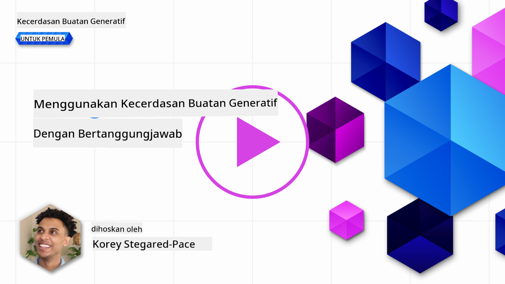

<!--
CO_OP_TRANSLATOR_METADATA:
{
  "original_hash": "7f8f4c11f8c1cb6e1794442dead414ea",
  "translation_date": "2025-07-09T09:00:23+00:00",
  "source_file": "03-using-generative-ai-responsibly/README.md",
  "language_code": "ms"
}
-->
# Menggunakan Generative AI Secara Bertanggungjawab

> _Klik imej di atas untuk menonton video pelajaran ini_

Mudah untuk terpesona dengan AI dan khususnya Generative AI, tetapi anda perlu mempertimbangkan bagaimana untuk menggunakannya secara bertanggungjawab. Anda perlu mengambil kira perkara seperti bagaimana memastikan hasilnya adil, tidak membahayakan dan lain-lain lagi. Bab ini bertujuan untuk memberikan anda konteks tersebut, apa yang perlu dipertimbangkan, dan bagaimana mengambil langkah aktif untuk memperbaiki penggunaan AI anda.

## Pengenalan

Pelajaran ini akan merangkumi:

- Mengapa anda harus mengutamakan Responsible AI apabila membina aplikasi Generative AI.
- Prinsip teras Responsible AI dan bagaimana ia berkaitan dengan Generative AI.
- Cara mengaplikasikan prinsip Responsible AI ini melalui strategi dan alat.

## Matlamat Pembelajaran

Selepas menamatkan pelajaran ini, anda akan mengetahui:

- Kepentingan Responsible AI apabila membina aplikasi Generative AI.
- Bila untuk memikirkan dan mengaplikasikan prinsip teras Responsible AI semasa membina aplikasi Generative AI.
- Alat dan strategi yang tersedia untuk anda bagi mengamalkan konsep Responsible AI.

## Prinsip Responsible AI

Keterujaan terhadap Generative AI tidak pernah setinggi ini. Keterujaan ini telah menarik ramai pembangun baru, perhatian, dan pembiayaan ke dalam bidang ini. Walaupun ini sangat positif bagi sesiapa yang ingin membina produk dan syarikat menggunakan Generative AI, adalah penting kita teruskan dengan penuh tanggungjawab.

Sepanjang kursus ini, kita akan fokus membina startup dan produk pendidikan AI kita. Kita akan menggunakan prinsip Responsible AI: Keadilan, Inklusiviti, Kebolehpercayaan/Keselamatan, Keselamatan & Privasi, Ketelusan dan Akauntabiliti. Dengan prinsip-prinsip ini, kita akan terokai bagaimana ia berkaitan dengan penggunaan Generative AI dalam produk kita.

## Mengapa Anda Perlu Mengutamakan Responsible AI

Apabila membina produk, mengambil pendekatan berpusatkan manusia dengan mengutamakan kepentingan terbaik pengguna anda akan menghasilkan keputusan terbaik.

Keunikan Generative AI adalah kuasanya untuk menghasilkan jawapan, maklumat, panduan, dan kandungan yang berguna untuk pengguna. Ini boleh dilakukan tanpa banyak langkah manual yang boleh menghasilkan keputusan yang sangat mengagumkan. Tanpa perancangan dan strategi yang betul, ia juga boleh membawa kepada hasil yang membahayakan pengguna, produk anda, dan masyarakat secara keseluruhan.

Mari kita lihat beberapa (tetapi bukan semua) hasil yang berpotensi membahayakan ini:

### Halusinasi

Halusinasi adalah istilah yang digunakan untuk menggambarkan apabila LLM menghasilkan kandungan yang sama ada tidak masuk akal sepenuhnya atau sesuatu yang kita tahu salah dari segi fakta berdasarkan sumber maklumat lain.

Contohnya, kita membina ciri untuk startup kita yang membolehkan pelajar bertanya soalan sejarah kepada model. Seorang pelajar bertanya soalan `Siapakah satu-satunya yang terselamat dari Titanic?`

Model menghasilkan jawapan seperti berikut:

> _(Sumber: [Flying bisons](https://flyingbisons.com?WT.mc_id=academic-105485-koreyst))_

Ini adalah jawapan yang sangat yakin dan terperinci. Malangnya, ia tidak betul. Walaupun dengan sedikit penyelidikan, seseorang akan mendapati terdapat lebih daripada seorang yang terselamat dalam bencana Titanic. Bagi pelajar yang baru mula membuat kajian tentang topik ini, jawapan ini boleh cukup meyakinkan untuk tidak dipersoalkan dan dianggap sebagai fakta. Akibatnya, sistem AI ini boleh menjadi tidak boleh dipercayai dan memberi kesan negatif kepada reputasi startup kita.

Dengan setiap iterasi mana-mana LLM, kita telah melihat peningkatan prestasi dalam mengurangkan halusinasi. Walaupun dengan peningkatan ini, kita sebagai pembina aplikasi dan pengguna masih perlu sedar akan had ini.

### Kandungan Berbahaya

Kita telah bincangkan dalam bahagian sebelum ini apabila LLM menghasilkan jawapan yang salah atau tidak masuk akal. Risiko lain yang perlu kita sedari adalah apabila model memberi respons dengan kandungan yang berbahaya.

Kandungan berbahaya boleh ditakrifkan sebagai:

- Memberi arahan atau menggalakkan mencederakan diri sendiri atau mencederakan kumpulan tertentu.
- Kandungan yang membenci atau merendahkan.
- Membimbing perancangan sebarang jenis serangan atau tindakan ganas.
- Memberi arahan bagaimana mencari kandungan haram atau melakukan perbuatan haram.
- Memaparkan kandungan seksual yang eksplisit.

Bagi startup kita, kita mahu memastikan kita mempunyai alat dan strategi yang betul untuk menghalang kandungan jenis ini daripada dilihat oleh pelajar.

### Kekurangan Keadilan

Keadilan ditakrifkan sebagai “memastikan sistem AI bebas daripada bias dan diskriminasi serta melayan semua orang dengan adil dan sama rata.” Dalam dunia Generative AI, kita mahu memastikan pandangan dunia yang mengecualikan kumpulan terpinggir tidak diperkuatkan oleh output model.

Jenis output ini bukan sahaja merosakkan pengalaman produk yang positif untuk pengguna kita, tetapi juga menyebabkan kemudaratan sosial yang lebih luas. Sebagai pembina aplikasi, kita harus sentiasa mengambil kira pengguna yang luas dan pelbagai apabila membina penyelesaian dengan Generative AI.

## Cara Menggunakan Generative AI Secara Bertanggungjawab

Sekarang kita telah mengenal pasti kepentingan Responsible Generative AI, mari kita lihat 4 langkah yang boleh kita ambil untuk membina penyelesaian AI kita secara bertanggungjawab:

### Ukur Potensi Bahaya

Dalam ujian perisian, kita menguji tindakan yang dijangka oleh pengguna pada aplikasi. Begitu juga, menguji set pelbagai prompt yang paling mungkin digunakan oleh pengguna adalah cara yang baik untuk mengukur potensi bahaya.

Memandangkan startup kita membina produk pendidikan, adalah baik untuk menyediakan senarai prompt berkaitan pendidikan. Ini boleh merangkumi subjek tertentu, fakta sejarah, dan prompt tentang kehidupan pelajar.

### Kurangkan Potensi Bahaya

Kini tiba masanya untuk mencari cara di mana kita boleh menghalang atau mengehadkan potensi bahaya yang disebabkan oleh model dan responsnya. Kita boleh melihat ini dalam 4 lapisan berbeza:

- **Model**. Memilih model yang sesuai untuk kes penggunaan yang betul. Model yang lebih besar dan kompleks seperti GPT-4 boleh membawa risiko kandungan berbahaya yang lebih tinggi apabila digunakan untuk kes penggunaan yang lebih kecil dan khusus. Menggunakan data latihan anda untuk melatih semula juga mengurangkan risiko kandungan berbahaya.

- **Sistem Keselamatan**. Sistem keselamatan adalah set alat dan konfigurasi pada platform yang menyajikan model yang membantu mengurangkan bahaya. Contohnya adalah sistem penapisan kandungan pada perkhidmatan Azure OpenAI. Sistem juga harus mengesan serangan jailbreak dan aktiviti yang tidak diingini seperti permintaan dari bot.

- **Metaprompt**. Metaprompt dan grounding adalah cara kita boleh mengarahkan atau mengehadkan model berdasarkan tingkah laku dan maklumat tertentu. Ini boleh menggunakan input sistem untuk menetapkan had tertentu pada model. Selain itu, memberikan output yang lebih relevan dengan skop atau domain sistem.

Ia juga boleh menggunakan teknik seperti Retrieval Augmented Generation (RAG) supaya model hanya menarik maklumat dari sumber yang dipercayai. Terdapat pelajaran kemudian dalam kursus ini untuk [membina aplikasi carian](../08-building-search-applications/README.md?WT.mc_id=academic-105485-koreyst)

- **Pengalaman Pengguna**. Lapisan terakhir adalah di mana pengguna berinteraksi secara langsung dengan model melalui antara muka aplikasi kita. Dengan cara ini kita boleh mereka bentuk UI/UX untuk mengehadkan jenis input yang boleh dihantar pengguna ke model serta teks atau imej yang dipaparkan kepada pengguna. Apabila melancarkan aplikasi AI, kita juga mesti telus tentang apa yang aplikasi Generative AI kita boleh dan tidak boleh lakukan.

Kita mempunyai satu pelajaran khusus untuk [Mereka Bentuk UX untuk Aplikasi AI](../12-designing-ux-for-ai-applications/README.md?WT.mc_id=academic-105485-koreyst)

- **Nilai model**. Bekerja dengan LLM boleh menjadi mencabar kerana kita tidak selalu mempunyai kawalan ke atas data yang digunakan untuk melatih model. Walau bagaimanapun, kita harus sentiasa menilai prestasi dan output model. Penting untuk mengukur ketepatan, kesamaan, keterikatan, dan relevan output model. Ini membantu memberikan ketelusan dan kepercayaan kepada pihak berkepentingan dan pengguna.

### Mengendalikan Penyelesaian Generative AI yang Bertanggungjawab

Membina amalan operasi di sekitar aplikasi AI anda adalah tahap akhir. Ini termasuk bekerjasama dengan bahagian lain dalam startup kita seperti Bahagian Undang-undang dan Keselamatan untuk memastikan kita mematuhi semua polisi peraturan. Sebelum pelancaran, kita juga mahu membina pelan berkaitan penghantaran, pengendalian insiden, dan rollback untuk mengelakkan sebarang kemudaratan kepada pengguna kita daripada berkembang.

## Alat

Walaupun kerja membangunkan penyelesaian Responsible AI mungkin kelihatan banyak, ia adalah usaha yang sangat berbaloi. Apabila bidang Generative AI berkembang, lebih banyak alat untuk membantu pembangun mengintegrasikan tanggungjawab ke dalam aliran kerja mereka akan matang. Contohnya, [Azure AI Content Safety](https://learn.microsoft.com/azure/ai-services/content-safety/overview?WT.mc_id=academic-105485-koreyst) boleh membantu mengesan kandungan dan imej berbahaya melalui permintaan API.

## Semakan Pengetahuan

Apakah perkara yang perlu anda ambil berat untuk memastikan penggunaan AI yang bertanggungjawab?

1. Jawapan itu betul.
1. Penggunaan berbahaya, supaya AI tidak digunakan untuk tujuan jenayah.
1. Memastikan AI bebas daripada bias dan diskriminasi.

A: 2 dan 3 adalah betul. Responsible AI membantu anda mempertimbangkan cara mengurangkan kesan berbahaya dan bias serta lain-lain.

## 🚀 Cabaran

Baca tentang [Azure AI Content Safety](https://learn.microsoft.com/azure/ai-services/content-safety/overview?WT.mc_id=academic-105485-koreyst) dan lihat apa yang boleh anda gunakan untuk kegunaan anda.

## Kerja Hebat, Teruskan Pembelajaran Anda

Selepas menamatkan pelajaran ini, lihat koleksi [Generative AI Learning](https://aka.ms/genai-collection?WT.mc_id=academic-105485-koreyst) kami untuk terus meningkatkan pengetahuan Generative AI anda!

Teruskan ke Pelajaran 4 di mana kita akan melihat [Asas Kejuruteraan Prompt](../04-prompt-engineering-fundamentals/README.md?WT.mc_id=academic-105485-koreyst)!

**Penafian**:  
Dokumen ini telah diterjemahkan menggunakan perkhidmatan terjemahan AI [Co-op Translator](https://github.com/Azure/co-op-translator). Walaupun kami berusaha untuk ketepatan, sila ambil maklum bahawa terjemahan automatik mungkin mengandungi kesilapan atau ketidaktepatan. Dokumen asal dalam bahasa asalnya harus dianggap sebagai sumber yang sahih. Untuk maklumat penting, terjemahan profesional oleh manusia adalah disyorkan. Kami tidak bertanggungjawab atas sebarang salah faham atau salah tafsir yang timbul daripada penggunaan terjemahan ini.