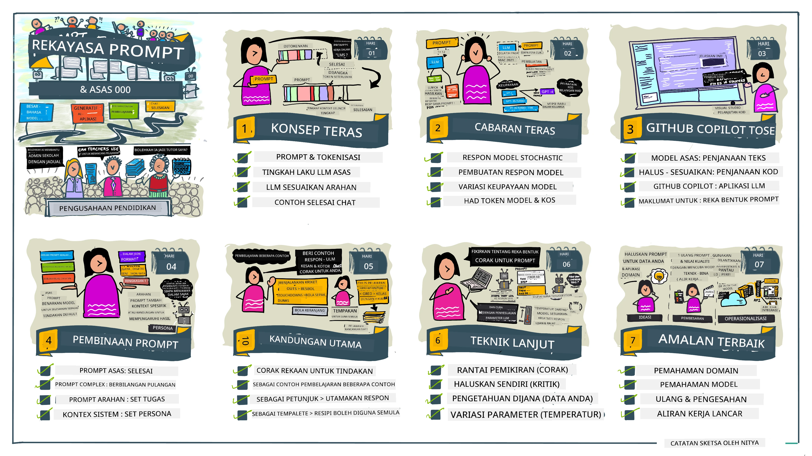
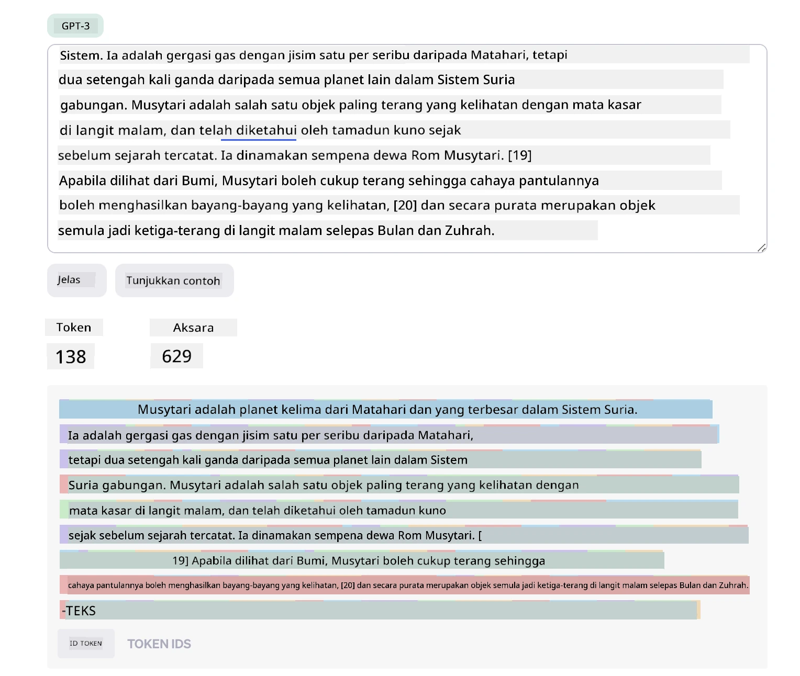
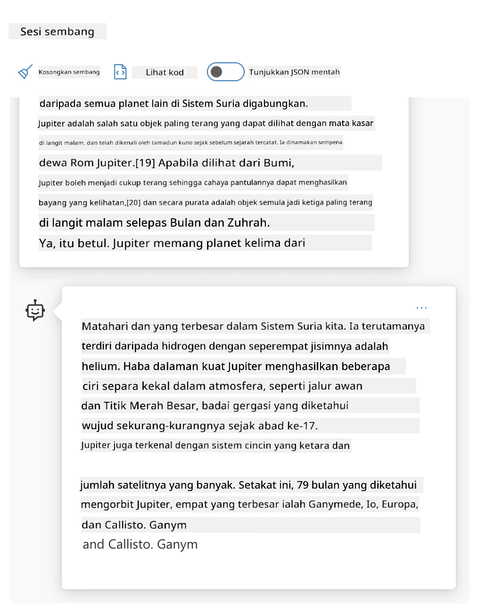
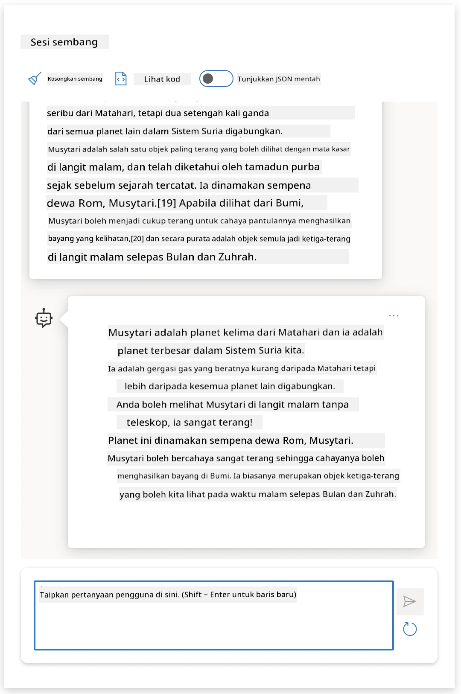
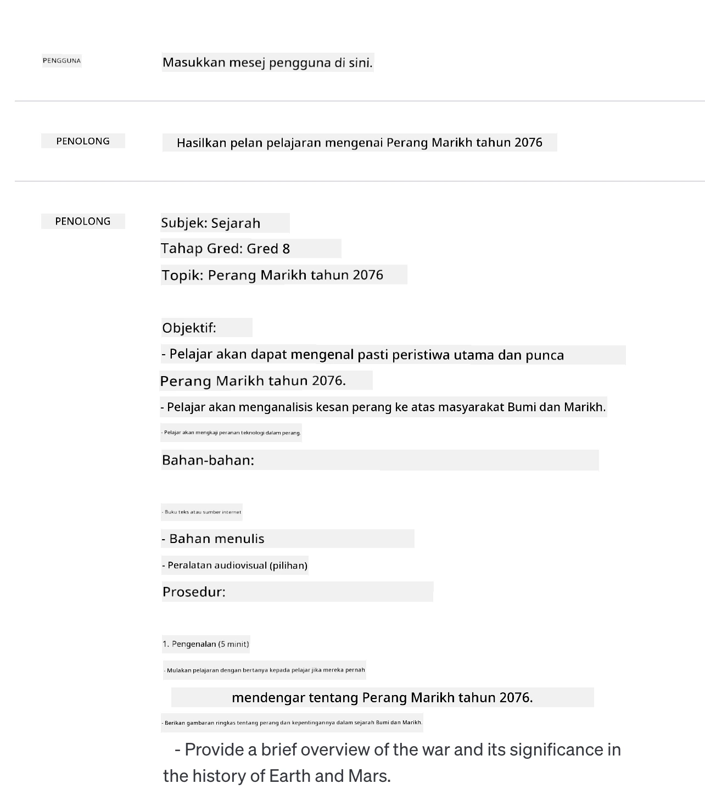
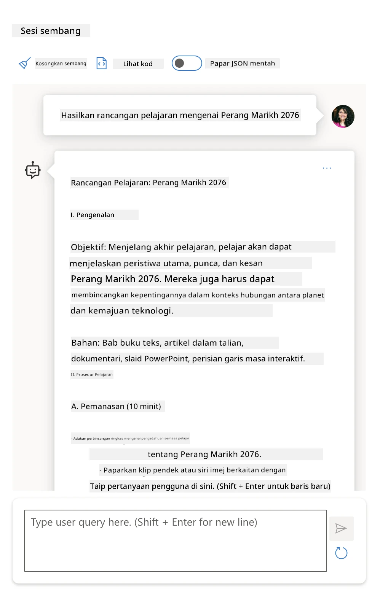
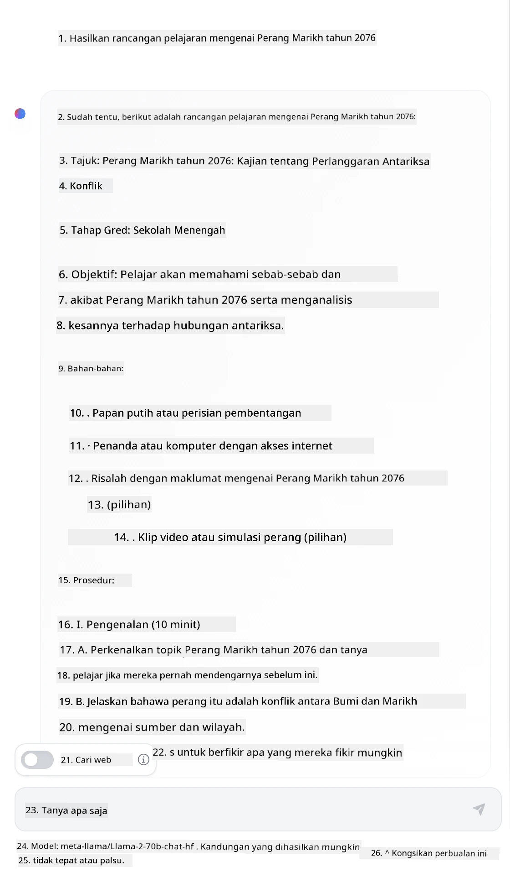

# Asas Kejuruteraan Prompt

[](https://youtu.be/GElCu2kUlRs?si=qrXsBvXnCW12epb8)

## Pengenalan  
Modul ini merangkumi konsep dan teknik penting untuk mencipta prompt yang berkesan dalam model AI generatif. Cara anda menulis prompt kepada LLM juga penting. Prompt yang direka dengan teliti boleh mencapai kualiti respons yang lebih baik. Tetapi apakah sebenarnya maksud istilah seperti _prompt_ dan _kejuruteraan prompt_? Dan bagaimana saya boleh memperbaiki _input_ prompt yang saya hantar ke LLM? Ini adalah soalan yang akan kita cuba jawab dalam bab ini dan seterusnya.

_AI Generatif_ mampu menghasilkan kandungan baru (contohnya, teks, imej, audio, kod dan sebagainya) sebagai tindak balas kepada permintaan pengguna. Ia mencapai ini menggunakan _Model Bahasa Besar_ seperti siri GPT OpenAI ("Generative Pre-trained Transformer") yang dilatih menggunakan bahasa semula jadi dan kod.

Pengguna kini boleh berinteraksi dengan model ini menggunakan paradigma yang biasa seperti chat, tanpa memerlukan kepakaran atau latihan teknikal. Model-model ini adalah _berbasis prompt_ - pengguna menghantar input teks (prompt) dan akan menerima respons AI (penyelesaian). Mereka kemudian boleh "berbual dengan AI" secara berulang, dalam perbualan berbilang pusingan, memperhalusi prompt mereka sehingga respons memenuhi jangkaan mereka.

"Prompts" kini menjadi _antara muka pengaturcaraan_ utama untuk aplikasi AI generatif, memberitahu model apa yang perlu dilakukan dan mempengaruhi kualiti respons yang dikembalikan. "Kejuruteraan Prompt" adalah bidang kajian yang berkembang pesat yang menumpukan pada _reka bentuk dan pengoptimuman_ prompt untuk memberikan respons konsisten dan berkualiti pada skala besar.

## Matlamat Pembelajaran

Dalam pelajaran ini, kita akan belajar apa itu Kejuruteraan Prompt, mengapa ia penting, dan bagaimana kita boleh menghasilkan prompt yang lebih berkesan untuk model dan objektif aplikasi tertentu. Kita akan memahami konsep teras dan amalan terbaik dalam kejuruteraan prompt - dan belajar tentang persekitaran Jupyter Notebooks "sandbox" interaktif di mana kita boleh melihat konsep ini diaplikasikan ke contoh sebenar.

Pada akhir pelajaran ini, kita akan dapat:

1. Menjelaskan apa itu kejuruteraan prompt dan mengapa ia penting.  
2. Menerangkan komponen prompt dan bagaimana ia digunakan.  
3. Mempelajari amalan terbaik dan teknik untuk kejuruteraan prompt.  
4. Menerapkan teknik yang dipelajari kepada contoh sebenar, menggunakan titik akhir OpenAI.

## Istilah Utama

Kejuruteraan Prompt: Amalan mereka bentuk dan memperhalusi input untuk mengarahkan model AI menghasilkan output yang diinginkan.  
Tokenisasi: Proses menukar teks kepada unit yang lebih kecil, dipanggil token, yang dapat difahami dan diproses oleh model.  
LLM Tuned Arahan: Model Bahasa Besar (LLM) yang telah diselaraskan dengan arahan khusus untuk meningkatkan ketepatan dan relevansi respons.

## Kawasan Pembelajaran

Kejuruteraan prompt kini lebih kepada seni daripada sains. Cara terbaik untuk memperbaiki intuisi kita adalah dengan _berlatih lebih banyak_ dan mengamalkan pendekatan cuba-jaya yang menggabungkan kepakaran domain aplikasi dengan teknik yang disyorkan dan pengoptimuman khusus model.

Jupyter Notebook yang menyertai pelajaran ini menyediakan persekitaran _sandbox_ di mana anda boleh mencuba apa yang anda pelajari - sewaktu anda berjalan atau sebagai sebahagian daripada cabaran kod pada akhir pelajaran. Untuk melaksanakan latihan, anda memerlukan:

1. **Kunci API Azure OpenAI** - titik akhir perkhidmatan untuk LLM yang telah dideploy.  
2. **Runtime Python** - di mana Notebook boleh dijalankan.  
3. **Pembolehubah Persekitaran Tempatan** - _lengkapkan langkah [SETUP](./../00-course-setup/02-setup-local.md?WT.mc_id=academic-105485-koreyst) sekarang untuk bersedia_.

Notebook disertakan dengan latihan _permulaan_ - tetapi anda digalakkan untuk menambah bahagian _Markdown_ (penerangan) dan _Kod_ (permintaan prompt) anda sendiri untuk mencuba lebih banyak contoh atau idea - dan membina intuisi anda untuk reka bentuk prompt.

## Panduan Ilustrasi

Ingin mendapatkan gambaran besar tentang apa yang diliputi pelajaran ini sebelum anda mula? Lihat panduan ilustrasi ini, yang memberi anda gambaran mengenai topik utama yang diliputi dan inti pati utama untuk anda renungkan dalam setiap satu. Peta jalan pelajaran membawa anda dari memahami konsep asas dan cabaran hingga mengatasinya dengan teknik kejuruteraan prompt yang relevan dan amalan terbaik. Nota bahawa bahagian "Teknik Lanjutan" dalam panduan ini merujuk kepada kandungan dalam bab _berikutnya_ dalam kurikulum ini.



## Startup Kami

Sekarang, mari kita bincangkan bagaimana _topik ini_ berkaitan dengan misi startup kami untuk [membawa inovasi AI ke pendidikan](https://educationblog.microsoft.com/2023/06/collaborating-to-bring-ai-innovation-to-education?WT.mc_id=academic-105485-koreyst). Kami ingin membina aplikasi berkuasa AI untuk _pembelajaran peribadi_ - jadi mari kita fikirkan bagaimana pengguna berbeza dalam aplikasi kami mungkin "mereka bentuk" prompts:

- **Pentadbir** mungkin meminta AI untuk _menganalisis data kurikulum untuk mengenal pasti jurang liputan_. AI boleh meringkaskan keputusan atau memvisualisasikannya dengan kod.  
- **Pendidik** mungkin meminta AI untuk _menghasilkan pelan pengajaran untuk audiens dan topik sasaran_. AI boleh membina pelan peribadi dalam format yang ditetapkan.  
- **Pelajar** mungkin meminta AI untuk _membimbing mereka dalam subjek yang sukar_. AI kini boleh membimbing pelajar dengan pelajaran, petunjuk & contoh yang disesuaikan dengan tahap mereka.

Itu baru sebahagian kecil sahaja. Semak [Prompts For Education](https://github.com/microsoft/prompts-for-edu/tree/main?WT.mc_id=academic-105485-koreyst) - perpustakaan prompts sumber terbuka yang dikurasi oleh pakar pendidikan - untuk mendapatkan gambaran lebih luas tentang kemungkinan! _Cubalah menjalankan beberapa prompts itu di sandbox atau menggunakan OpenAI Playground untuk melihat hasilnya!_

<!--  
LEMBARAN PELAJARAN:  
Unit ini harus merangkumi konsep teras #1.  
Mengukuhkan konsep dengan contoh dan rujukan.  

KONSEP #1:  
Kejuruteraan Prompt.  
Menakrifkan dan menerangkan mengapa ia diperlukan.  
-->

## Apakah Kejuruteraan Prompt?

Kita mula pelajaran ini dengan mendefinisikan **Kejuruteraan Prompt** sebagai proses _mereka bentuk dan mengoptimumkan_ input teks (prompts) untuk memberikan penyelesaian (completions) yang konsisten dan berkualiti untuk objektif aplikasi dan model tertentu. Kita boleh menganggap ini sebagai proses 2 langkah:

- _mereka bentuk_ prompt awal untuk model dan objektif tertentu  
- _memperhalusi_ prompt secara berulang untuk memperbaiki kualiti respons

Ini sememangnya proses cuba-jaya yang memerlukan intuisi dan usaha pengguna untuk mendapatkan hasil optimum. Jadi kenapa ia penting? Untuk menjawab soalan itu, kita perlu memahami tiga konsep:

- _Tokenisasi_ = bagaimana model "melihat" prompt  
- _LLM Asas_ = bagaimana model asas "memproses" prompt  
- _LLM Tuned Arahan_ = bagaimana model kini dapat melihat "tugasan"

### Tokenisasi

LLM melihat prompt sebagai _urutan token_ di mana model berbeza (atau versi model) boleh menokenkan prompt yang sama dengan cara yang berbeza. Oleh kerana LLM dilatih pada token (bukan pada teks mentah), cara prompt ditokenkan memberi kesan langsung kepada kualiti respons yang dihasilkan.

Untuk mendapatkan gambaran intuitif tentang cara tokenisasi berfungsi, cuba alat seperti [OpenAI Tokenizer](https://platform.openai.com/tokenizer?WT.mc_id=academic-105485-koreyst) yang ditunjukkan di bawah. Salin prompt anda - dan lihat bagaimana ia ditukar menjadi token, perhatikan bagaimana aksara ruang putih dan tanda baca dikendalikan. Nota bahawa contoh ini menunjukkan LLM lama (GPT-3) - jadi mencubanya dengan model baru mungkin menghasilkan keputusan berbeza.



### Konsep: Model Asas

Setelah prompt ditokenkan, fungsi utama ["LLM Asas"](https://blog.gopenai.com/an-introduction-to-base-and-instruction-tuned-large-language-models-8de102c785a6?WT.mc_id=academic-105485-koreyst) (atau model asas) adalah untuk meramalkan token seterusnya dalam urutan itu. Oleh kerana LLM dilatih pada set data teks yang besar, ia mempunyai pemahaman yang baik tentang hubungan statistik antara token dan boleh membuat ramalan itu dengan keyakinan tertentu. Nota bahawa mereka tidak memahami _makna_ kata dalam prompt atau token; mereka hanya melihat corak yang boleh mereka "lengkapkan" dengan ramalan seterusnya. Mereka boleh terus meramalkan urutan sehingga dihentikan oleh campur tangan pengguna atau memenuhi syarat yang telah ditetapkan.

Ingin melihat bagaimana penyelesaian berasaskan prompt berfungsi? Masukkan prompt di atas ke Studio Azure OpenAI [_Chat Playground_](https://oai.azure.com/playground?WT.mc_id=academic-105485-koreyst) dengan tetapan lalai. Sistem dikonfigurasikan untuk menganggap prompts sebagai permintaan maklumat - jadi anda harus melihat penyelesaian yang memuaskan konteks ini.

Tetapi bagaimana jika pengguna mahu melihat sesuatu yang spesifik yang memenuhi kriteria atau objektif tugasan tertentu? Di sinilah LLM _tuned arahan_ masuk ke dalam gambaran.



### Konsep: LLM Tuned Arahan

[LLM Tuned Arahan](https://blog.gopenai.com/an-introduction-to-base-and-instruction-tuned-large-language-models-8de102c785a6?WT.mc_id=academic-105485-koreyst) bermula dengan model asas dan melarasnya dengan contoh atau pasangan input/output (contohnya, "mesej" pelbagai pusingan) yang mengandungi arahan jelas - dan respons dari AI berusaha mengikuti arahan tersebut.

Ini menggunakan teknik seperti Pembelajaran Pengukuhan dengan Maklum Balas Manusia (RLHF) yang boleh melatih model untuk _mengikuti arahan_ dan _belajar dari maklum balas_ supaya ia menghasilkan respons yang lebih sesuai untuk aplikasi praktikal dan lebih relevan dengan objektif pengguna.

Mari cuba - kembali ke prompt di atas, tetapi sekarang ubah _mesej sistem_ untuk memberikan arahan berikut sebagai konteks:

> _Ringkaskan kandungan yang diberikan untuk seorang pelajar Tahun Dua. Kekalkan hasil kepada satu perenggan dengan 3-5 mata peluru._

Lihat bagaimana keputusan kini diselaraskan mengikut matlamat dan format yang diingini? Seorang pendidik kini boleh menggunakan respons ini secara langsung dalam slaid mereka untuk kelas itu.



## Kenapa Kita Memerlukan Kejuruteraan Prompt?

Sekarang kita tahu bagaimana prompts diproses oleh LLM, mari bincangkan _mengapa_ kita memerlukan kejuruteraan prompt. Jawapannya terletak pada hakikat bahawa LLM semasa menghadapi beberapa cabaran yang menjadikan _penyelesaian yang boleh dipercayai dan konsisten_ lebih sukar dicapai tanpa usaha dalam pembinaan dan pengoptimuman prompt. Contohnya:

1. **Respons model bersifat stokastik.** _Prompt yang sama_ mungkin menghasilkan respons yang berbeza dengan model berbeza atau versi model berbeza. Malah ia mungkin menghasilkan keputusan berbeza dengan _model yang sama_ pada masa berbeza. _Teknik kejuruteraan prompt boleh membantu kita meminimumkan variasi ini dengan menyediakan panduan yang lebih baik_.

2. **Model boleh mereka cipta respons.** Model dilatih dengan _data besar tetapi terhad_, bermakna mereka tidak mempunyai pengetahuan tentang konsep di luar skop latihan itu. Akibatnya, mereka boleh menghasilkan penyelesaian yang tidak tepat, imaginer, atau bertentangan secara langsung dengan fakta yang diketahui. _Teknik kejuruteraan prompt membantu pengguna mengenal pasti dan mengurangkan rekaan sebegini contohnya dengan meminta AI memberikan petikan atau hujahan_.

3. **Kebolehan model akan berbeza.** Model baru atau generasi model akan mempunyai kebolehan lebih kaya tetapi juga membawa keunikan dan kompromi dari segi kos & kerumitan. _Kejuruteraan prompt boleh membantu kita membangunkan amalan terbaik dan aliran kerja yang mengabstrak perbezaan tersebut dan menyesuaikan dengan keperluan khusus model secara berskala dan lancar_.

Mari lihat ini dalam tindakan di OpenAI atau Azure OpenAI Playground:

- Gunakan prompt yang sama dengan penyebaran LLM berbeza (contoh, OpenAI, Azure OpenAI, Hugging Face) - adakah anda melihat variasi?  
- Gunakan prompt yang sama berulang kali dengan penyebaran LLM yang _sama_ (contoh, Azure OpenAI playground) - bagaimana variasi tersebut berbeza?

### Contoh Falsafah

Dalam kursus ini, kita menggunakan istilah **"falsafah"** untuk merujuk fenomena di mana LLM kadangkala menghasilkan maklumat yang tidak tepat dari segi fakta kerana had latihan atau kekangan lain. Anda mungkin juga pernah mendengar istilah ini dirujuk sebagai _"halusinasi"_ dalam artikel popular atau kertas penyelidikan. Namun, kami sangat mengesyorkan menggunakan istilah _"falsafah"_ supaya kita tidak secara tidak sengaja melibatkan tingkah laku manusia dengan menganugerahkan ciri manusia kepada hasil mesin. Ini juga mengukuhkan [garis panduan AI Bertanggungjawab](https://www.microsoft.com/ai/responsible-ai?WT.mc_id=academic-105485-koreyst) dari perspektif terminologi, menghapuskan istilah yang mungkin dianggap ofensif atau tidak inklusif dalam beberapa konteks.

Ingin mendapatkan gambaran bagaimana falsafah berfungsi? Fikirkan prompt yang mengarahkan AI menghasilkan kandungan untuk topik yang tidak wujud (untuk memastikan ia tidak terdapat dalam dataset latihan). Contohnya - saya cuba prompt ini:

> **Prompt:** hasilkan pelan pengajaran tentang Perang Marikh tahun 2076.
Carian web menunjukkan bahawa terdapat akaun fiksyen (contoh, siri televisyen atau buku) mengenai perang Marikh - tetapi tiada dalam tahun 2076. Akal fikiran juga memberitahu kita bahawa 2076 adalah _di masa hadapan_ dan oleh itu, tidak boleh dikaitkan dengan peristiwa sebenar.

Jadi apa yang berlaku apabila kita menjalankan arahan ini dengan pembekal LLM yang berbeza?

> **Respons 1**: OpenAI Playground (GPT-35)



> **Respons 2**: Azure OpenAI Playground (GPT-35)



> **Respons 3**: : Hugging Face Chat Playground (LLama-2)



Seperti yang dijangkakan, setiap model (atau versi model) menghasilkan respons yang sedikit berbeza terima kasih kepada kelakuan stokastik dan variasi kemampuan model. Sebagai contoh, satu model mensasarkan audien darjah 8 manakala satu lagi menganggap pelajar sekolah menengah. Tetapi ketiga-tiga model menghasilkan respons yang boleh meyakinkan pengguna yang tidak berpengetahuan bahawa peristiwa itu benar.

Teknik kejuruteraan arahan seperti _metaprompting_ dan _konfigurasi suhu_ mungkin mengurangkan fabrikasi model hingga tahap tertentu. _Arkitektur_ kejuruteraan arahan yang baru juga menggabungkan alat dan teknik baru secara lancar ke dalam aliran arahan, untuk mengurangkan atau memihak sebahagian daripada kesan ini.

## Kajian Kes: GitHub Copilot

Mari kita rumuskan seksyen ini dengan mendapatkan gambaran bagaimana kejuruteraan arahan digunakan dalam penyelesaian dunia sebenar dengan melihat satu Kajian Kes: [GitHub Copilot](https://github.com/features/copilot?WT.mc_id=academic-105485-koreyst).

GitHub Copilot adalah "Rakan Pemrograman AI" anda - ia menukar arahan teks menjadi pelengkapan kod dan disepadukan ke dalam persekitaran pembangunan anda (contohnya, Visual Studio Code) untuk pengalaman pengguna yang lancar. Seperti yang didokumentasikan dalam siri blog di bawah, versi awal berdasarkan model OpenAI Codex - dengan jurutera segera menyedari keperluan untuk menala model dan membangunkan teknik kejuruteraan arahan yang lebih baik, untuk meningkatkan kualiti kod. Pada bulan Julai, mereka [memperkenalkan model AI yang dipertingkatkan yang melebihi Codex](https://github.blog/2023-07-28-smarter-more-efficient-coding-github-copilot-goes-beyond-codex-with-improved-ai-model/?WT.mc_id=academic-105485-koreyst) untuk cadangan lebih pantas.

Baca pos secara berurutan, untuk mengikuti perjalanan pembelajaran mereka.

- **Mei 2023** | [GitHub Copilot Semakin Baik Memahami Kod Anda](https://github.blog/2023-05-17-how-github-copilot-is-getting-better-at-understanding-your-code/?WT.mc_id=academic-105485-koreyst)
- **Mei 2023** | [Di Dalam GitHub: Bekerja dengan LLM di sebalik GitHub Copilot](https://github.blog/2023-05-17-inside-github-working-with-the-llms-behind-github-copilot/?WT.mc_id=academic-105485-koreyst).
- **Jun 2023** | [Cara menulis arahan lebih baik untuk GitHub Copilot](https://github.blog/2023-06-20-how-to-write-better-prompts-for-github-copilot/?WT.mc_id=academic-105485-koreyst).
- **Jul 2023** | [.. GitHub Copilot melebihi Codex dengan model AI yang dipertingkatkan](https://github.blog/2023-07-28-smarter-more-efficient-coding-github-copilot-goes-beyond-codex-with-improved-ai-model/?WT.mc_id=academic-105485-koreyst)
- **Jul 2023** | [Panduan Pembangun untuk Kejuruteraan Arahan dan LLM](https://github.blog/2023-07-17-prompt-engineering-guide-generative-ai-llms/?WT.mc_id=academic-105485-koreyst)
- **Sep 2023** | [Cara membina aplikasi LLM perusahaan: Pengajaran dari GitHub Copilot](https://github.blog/2023-09-06-how-to-build-an-enterprise-llm-application-lessons-from-github-copilot/?WT.mc_id=academic-105485-koreyst)

Anda juga boleh melayari [blog Kejuruteraan mereka](https://github.blog/category/engineering/?WT.mc_id=academic-105485-koreyst) untuk lebih banyak pos seperti [yang ini](https://github.blog/2023-09-27-how-i-used-github-copilot-chat-to-build-a-reactjs-gallery-prototype/?WT.mc_id=academic-105485-koreyst) yang menunjukkan bagaimana model dan teknik ini _dilaksanakan_ untuk mendorong aplikasi dunia nyata.

---

<!--
LESSON TEMPLATE:
This unit should cover core concept #2.
Reinforce the concept with examples and references.

CONCEPT #2:
Prompt Design.
Illustrated with examples.
-->

## Pembinaan Arahan

Kita telah melihat mengapa kejuruteraan arahan itu penting - sekarang mari fahami bagaimana arahan _dibina_ supaya kita dapat menilai teknik yang berbeza untuk reka bentuk arahan yang lebih berkesan.

### Arahan Asas

Mari mulakan dengan arahan asas: input teks yang dihantar kepada model tanpa konteks lain. Berikut adalah contoh - apabila kita menghantar beberapa perkataan pertama lagu kebangsaan AS kepada OpenAI [Completion API](https://platform.openai.com/docs/api-reference/completions?WT.mc_id=academic-105485-koreyst) ia serta-merta _melengkapkan_ respons dengan baris berikut, menggambarkan tingkah laku ramalan asas.

| Arahan (Input)     | Pelengkapan (Output)                                                                                                                        |
| :----------------- | :----------------------------------------------------------------------------------------------------------------------------------------- |
| Oh say can you see | Ia kedengaran seperti anda memulakan lirik "The Star-Spangled Banner," lagu kebangsaan Amerika Syarikat. Lirik penuh adalah ... |

### Arahan Kompleks

Sekarang mari tambah konteks dan arahan kepada arahan asas itu. [Chat Completion API](https://learn.microsoft.com/azure/ai-services/openai/how-to/chatgpt?WT.mc_id=academic-105485-koreyst) membolehkan kita membina arahan kompleks sebagai koleksi _mesej_ dengan:

- Pasangan input/output yang mencerminkan input _pengguna_ dan respons _pembantu_.
- Mesej sistem yang menetapkan konteks untuk tingkah laku atau personaliti pembantu.

Permintaan kini dalam bentuk di bawah, di mana _tokenisasi_ secara efektif menangkap maklumat relevan daripada konteks dan perbualan. Sekarang, mengubah konteks sistem boleh memberi impak yang sama kuat pada kualiti pelengkapan, seperti input pengguna yang diberikan.

```python
response = openai.chat.completions.create(
    model="gpt-3.5-turbo",
    messages=[
        {"role": "system", "content": "You are a helpful assistant."},
        {"role": "user", "content": "Who won the world series in 2020?"},
        {"role": "assistant", "content": "The Los Angeles Dodgers won the World Series in 2020."},
        {"role": "user", "content": "Where was it played?"}
    ]
)
```

### Arahan Instruksi

Dalam contoh di atas, arahan pengguna adalah pertanyaan teks mudah yang boleh ditafsir sebagai permintaan maklumat. Dengan arahan _instruksi_, kita boleh menggunakan teks itu untuk menentukan tugas dengan lebih terperinci, memberikan panduan lebih baik kepada AI. Berikut contoh:

| Arahan (Input)                                                                                                                                                                                                                         | Pelengkapan (Output)                                                                                                        | Jenis Instruksi    |
| :------------------------------------------------------------------------------------------------------------------------------------------------------------------------------------------------------------------------------------- | :------------------------------------------------------------------------------------------------------------------------- | :----------------- |
| Tulis deskripsi tentang Perang Saudara                                                                                                                                                                                               | _mengembalikan perenggan ringkas_                                                                                          | Mudah              |
| Tulis deskripsi tentang Perang Saudara. Berikan tarikh dan peristiwa utama serta terangkan kepentingannya                                                                                                                                 | _mengembalikan perenggan diikuti dengan senarai tarikh peristiwa utama dengan penerangan_                                   | Kompleks           |
| Tulis deskripsi tentang Perang Saudara dalam 1 perenggan. Berikan 3 poin peluru dengan tarikh utama dan kepentingannya. Berikan 3 lagi poin peluru dengan tokoh sejarah utama dan sumbangan mereka. Kembalikan output sebagai fail JSON            | _mengembalikan butiran lebih luas dalam kotak teks, diformatkan sebagai JSON yang boleh anda salin-tampal ke dalam fail dan sahkan jika perlu_ | Kompleks. Diformat. |

## Kandungan Utama

Dalam contoh di atas, arahan masih agak terbuka, membenarkan LLM memutuskan bahagian dataset latihan awalnya yang relevan. Dengan corak reka bentuk _kandungan utama_, teks input dibahagikan kepada dua bahagian:

- satu arahan (tindakan)
- kandungan relevan (yang mempengaruhi tindakan)

Berikut contoh di mana arahan adalah "ringkaskan ini dalam 2 ayat".

| Arahan (Input)                                                                                                                                                                                                                                                                                                                                                                                                                                                                                                                                                                                                                                                                                      | Pelengkapan (Output)                                                                                                                                                                                                                                                                             |
| :-------------------------------------------------------------------------------------------------------------------------------------------------------------------------------------------------------------------------------------------------------------------------------------------------------------------------------------------------------------------------------------------------------------------------------------------------------------------------------------------------------------------------------------------------------------------------------------------------------------------------------------------------------------------------------------------------- | :---------------------------------------------------------------------------------------------------------------------------------------------------------------------------------------------------------------------------------------------------------------------------------------------- |
| Jupiter adalah planet kelima dari Matahari dan yang terbesar dalam Sistem Suria. Ia adalah gergasi gas dengan jisim seribu satu daripada Matahari, tetapi dua setengah kali ganda semua planet lain dalam Sistem Suria digabungkan. Jupiter adalah salah satu objek paling terang yang boleh dilihat dengan mata kasar di langit malam, dan telah diketahui oleh tamadun kuno sejak sebelum sejarah direkodkan. Ia dinamakan sempena dewa Rom, Jupiter.[19] Apabila dilihat dari Bumi, Jupiter boleh menjadi cukup terang untuk cahaya pantulan itu menghasilkan bayang yang kelihatan,[20] dan secara purata adalah objek asli ketiga paling terang di langit malam selepas Bulan dan Zuhrah. <br/> **Ringkaskan ini dalam 2 ayat pendek** | Jupiter, planet kelima dari Matahari, adalah yang terbesar dalam Sistem Suria dan dikenali sebagai salah satu objek paling terang di langit malam. Dinamakan sempena dewa Rom Jupiter, ia adalah gergasi gas dengan jisim dua setengah kali ganda semua planet lain dalam Sistem Suria digabungkan. |

Segmen kandungan utama boleh digunakan dalam pelbagai cara untuk memacu arahan yang lebih berkesan:

- **Contoh** - daripada memberitahu model apa yang perlu dilakukan dengan arahan eksplisit, berikan ia contoh apa yang perlu dibuat dan biarkan ia mentafsir corak.
- **Isyarat** - ikut arahan dengan "isyarat" yang memacu pelengkapan, membimbing model ke arah respons yang lebih relevan.
- **Templat** - ini adalah 'resipi' berulang untuk arahan dengan tempat letak (pembolehubah) yang boleh disesuaikan dengan data untuk kes penggunaan tertentu.

Mari kita terokai ini dengan aksi.

### Menggunakan Contoh

Ini adalah pendekatan di mana anda menggunakan kandungan utama untuk "memberi makan model" beberapa contoh output yang diinginkan untuk arahan tertentu, dan membiarkan ia mentafsir corak output yang diharapkan. Berdasarkan bilangan contoh yang diberikan, kita boleh mempunyai zero-shot prompting, one-shot prompting, few-shot prompting dan sebagainya.

Arahan kini terdiri daripada tiga komponen:

- Penerangan tugas
- Beberapa contoh output yang diingini
- Permulaan contoh baru (yang menjadi penerangan tugas tersirat)

| Jenis Pembelajaran | Arahan (Input)                                                                                                                                        | Pelengkapan (Output)         |
| :----------------- | :---------------------------------------------------------------------------------------------------------------------------------------------------- | :-------------------------- |
| Zero-shot          | "The Sun is Shining". Terjemah ke dalam bahasa Sepanyol                                                                                              | "El Sol está brillando".    |
| One-shot           | "The Sun is Shining" => ""El Sol está brillando". <br> "It's a Cold and Windy Day" =>                                                                 | "Es un día frío y ventoso". |
| Few-shot           | The player ran the bases => Baseball <br/> The player hit an ace => Tennis <br/> The player hit a six => Cricket <br/> The player made a slam-dunk => | Basketball                  |
|                    |                                                                                                                                                       |                             |

Perhatikan bagaimana kita perlu memberikan arahan eksplisit ("Terjemah ke Sepanyol") dalam zero-shot prompting, tetapi ia dapat ditafsir dalam contoh one-shot prompting. Contoh few-shot menunjukkan bagaimana menambah lebih banyak contoh membolehkan model membuat inferens yang lebih tepat tanpa arahan tambahan.

### Isyarat Arahan

Satu teknik lagi menggunakan kandungan utama adalah menyediakan _isyarat_ daripada contoh. Dalam kes ini, kita memberi model dorongan ke arah yang betul dengan _memulakan_ ia dengan petikan yang mencerminkan format respons yang diingini. Model kemudian "mengambil isyarat" untuk meneruskan dalam gaya itu.

| Bilangan Isyarat | Arahan (Input)                                                                                                                                                                                                                                                                                                                                                                                                                                               | Pelengkapan (Output)                                                                                                                                                                                                                                                                                       |
| :---------------- | :----------------------------------------------------------------------------------------------------------------------------------------------------------------------------------------------------------------------------------------------------------------------------------------------------------------------------------------------------------------------------------------------------------------------------------------------------------- | :-------------------------------------------------------------------------------------------------------------------------------------------------------------------------------------------------------------------------------------------------------------------------------------------------------- |
| 0                 | Jupiter adalah planet kelima dari Matahari dan yang terbesar dalam Sistem Suria. Ia adalah gergasi gas dengan jisim seribu satu daripada Matahari, tetapi dua setengah kali ganda semua planet lain dalam Sistem Suria digabungkan. Jupiter adalah salah satu objek paling terang yang boleh dilihat dengan mata kasar di langit malam, dan telah diketahui oleh tamadun kuno sejak sebelum sejarah direkodkan. <br/>**Ringkaskan Ini**                                       | Jupiter adalah planet terbesar dalam Sistem Suria kita dan yang kelima dari Matahari. Ia adalah gergasi gas dengan jisim 1/1000 Matahari, tetapi lebih berat daripada semua planet lain digabungkan. Tamadun kuno telah lama mengetahui tentang Jupiter, dan ia mudah dilihat di langit malam. |
| 1              | Jupiter adalah planet kelima dari Matahari dan yang terbesar dalam Sistem Suria. Ia adalah gergasi gas dengan jisim satu per seribu dari Matahari, tetapi dua setengah kali ganda jisim semua planet lain dalam Sistem Suria jika digabungkan. Jupiter adalah salah satu objek paling terang yang boleh dilihat dengan mata kasar di langit malam, dan telah diketahui oleh tamadun purba sejak sebelum sejarah tercatat. <br/>**Ringkaskan Ini** <br/> Apa yang kita pelajari ialah Jupiter | adalah planet kelima dari Matahari dan yang terbesar dalam Sistem Suria. Ia adalah gergasi gas dengan jisim satu per seribu dari Matahari, tetapi dua setengah kali ganda jisim semua planet lain jika digabungkan. Ia mudah dilihat dengan mata kasar dan telah diketahui sejak zaman purba.                        |
| 2              | Jupiter adalah planet kelima dari Matahari dan yang terbesar dalam Sistem Suria. Ia adalah gergasi gas dengan jisim satu per seribu dari Matahari, tetapi dua setengah kali ganda jisim semua planet lain dalam Sistem Suria jika digabungkan. Jupiter adalah salah satu objek paling terang yang boleh dilihat dengan mata kasar di langit malam, dan telah diketahui oleh tamadun purba sejak sebelum sejarah tercatat. <br/>**Ringkaskan Ini** <br/> 3 Fakta Teratas Yang Kami Pelajari:         | 1. Jupiter adalah planet kelima dari Matahari dan yang terbesar dalam Sistem Suria. <br/> 2. Ia adalah gergasi gas dengan jisim satu per seribu dari Matahari...<br/> 3. Jupiter telah dapat dilihat dengan mata kasar sejak zaman purba ...                                                                       |
|                |                                                                                                                                                                                                                                                                                                                                                                                                                                                              |                                                                                                                                                                                                                                                                                                           |

### Prompt Templates

Templat prompt adalah _resepi yang telah ditetapkan untuk prompt_ yang boleh disimpan dan digunakan semula apabila perlu, untuk menghasilkan pengalaman pengguna yang lebih konsisten dalam skala besar. Dalam bentuk paling ringkas, ia hanyalah koleksi contoh prompt seperti [yang ini dari OpenAI](https://platform.openai.com/examples?WT.mc_id=academic-105485-koreyst) yang menyediakan kedua-dua komponen prompt interaktif (mesej pengguna dan sistem) dan format permintaan API - untuk menyokong penggunaan semula.

Dalam bentuk yang lebih kompleks seperti [contoh ini dari LangChain](https://python.langchain.com/docs/concepts/prompt_templates/?WT.mc_id=academic-105485-koreyst) ia mengandungi _placeholder_ yang boleh digantikan dengan data dari pelbagai sumber (input pengguna, konteks sistem, sumber data luaran dan lain-lain) untuk menghasilkan prompt secara dinamik. Ini membolehkan kita membuat perpustakaan prompt yang boleh digunakan semula yang boleh digunakan untuk menghasilkan pengalaman pengguna yang konsisten **secara programatik** dalam skala besar.

Akhirnya, nilai sebenar templat terletak pada keupayaan untuk mencipta dan menerbitkan _perpustakaan prompt_ untuk domain aplikasi vertikal - di mana templat prompt kini _dioptimumkan_ untuk mencerminkan konteks atau contoh khusus aplikasi yang menjadikan respons lebih relevan dan tepat untuk audiens pengguna yang disasarkan. Repositori [Prompts For Edu](https://github.com/microsoft/prompts-for-edu?WT.mc_id=academic-105485-koreyst) adalah contoh terbaik pendekatan ini, mengumpul perpustakaan prompt untuk domain pendidikan dengan penekanan pada objektif utama seperti perancangan pelajaran, reka bentuk kurikulum, bimbingan pelajar dan sebagainya.

## Supporting Content

Jika kita menganggap pembinaan prompt sebagai mempunyai arahan (tugas) dan sasaran (kandungan utama), maka _kandungan sekunder_ adalah seperti konteks tambahan yang kita berikan untuk **mempengaruhi keluaran dalam beberapa cara**. Ia boleh berupa parameter penyetelan, arahan format, taksonomi topik dan lain-lain yang boleh membantu model _menyesuaikan_ responsnya agar sesuai dengan objektif atau jangkaan pengguna yang dikehendaki.

Sebagai contoh: Diberi katalog kursus dengan metadata yang luas (nama, penerangan, tahap, tag metadata, pengajar dan lain-lain) bagi semua kursus yang ada dalam kurikulum:

- kita boleh tentukan arahan untuk "meringkaskan katalog kursus untuk Musim Gugur 2023"
- kita boleh gunakan kandungan utama untuk memberikan beberapa contoh keluaran yang dikehendaki
- kita boleh gunakan kandungan sekunder untuk mengenal pasti 5 "tag" teratas yang menarik minat.

Kini, model boleh memberikan ringkasan dalam format yang ditunjukkan oleh beberapa contoh tersebut - tetapi jika hasilnya mempunyai pelbagai tag, ia boleh memberi keutamaan kepada 5 tag yang dikenal pasti dalam kandungan sekunder.

---

<!--
LESSON TEMPLATE:
Bahagian ini harus merangkumi konsep utama #1.
Perkukuhkan konsep dengan contoh dan rujukan.

CONCEPT #3:
Teknik Kejuruteraan Prompt.
Apakah beberapa teknik asas untuk kejuruteraan prompt?
Ilustrasikan dengan beberapa latihan.
-->

## Amalan Terbaik Prompting

Kini kita tahu bagaimana prompt boleh _dibina_, kita boleh mula memikirkan cara untuk _mereka bentuk_ ia agar mencerminkan amalan terbaik. Kita boleh fikirkan ini dalam dua bahagian - mempunyai _mindset_ yang betul dan menggunakan _teknik_ yang betul.

### Mindset Kejuruteraan Prompt

Kejuruteraan Prompt adalah proses cuba dan silap jadi ingat tiga faktor panduan utama:

1. **Pemahaman Domain Penting.** Ketepatan dan relevansi respons adalah fungsi kepada _domain_ di mana aplikasi atau pengguna beroperasi. Gunakan naluri dan kepakaran domain anda untuk **menyesuaikan teknik** dengan lebih lanjut. Contohnya, tentukan _personaliti spesifik domain_ dalam prompt sistem anda, atau gunakan _templat spesifik domain_ dalam prompt pengguna anda. Berikan kandungan sekunder yang mencerminkan konteks khusus domain, atau gunakan _petunjuk dan contoh khusus domain_ untuk mengarahkan model ke corak penggunaan yang biasa.

2. **Pemahaman Model Penting.** Kita tahu model adalah stokastik secara semulajadi. Tetapi pelaksanaan model juga boleh berbeza dari segi dataset latihan digunakan (pengetahuan pra-latihan), keupayaan yang disediakan (contohnya, melalui API atau SDK) dan jenis kandungan yang dioptimumkan (contohnya, kod vs imej vs teks). Fahami kekuatan dan batasan model yang anda gunakan, dan gunakan pengetahuan itu untuk _utamakan tugas_ atau bina _templat khusus_ yang dioptimumkan untuk keupayaan model.

3. **Iterasi & Pengesahan Penting.** Model berkembang dengan pesat, begitu juga teknik kejuruteraan prompt. Sebagai pakar domain, anda mungkin mempunyai konteks atau kriteria lain _untuk_ aplikasi khusus anda, yang mungkin tidak terpakai kepada komuniti luas. Gunakan alat & teknik kejuruteraan prompt untuk "memulakan" pembinaan prompt, kemudian ulang dan sahkan keputusan menggunakan naluri dan kepakaran domain anda sendiri. Rekodkan wawasan anda dan cipta **pangkalan pengetahuan** (contohnya, perpustakaan prompt) yang boleh digunakan sebagai garis asas baru oleh orang lain, untuk iterasi yang lebih pantas di masa hadapan.

## Amalan Terbaik

Sekarang mari kita lihat amalan terbaik biasa yang disyorkan oleh pengamal [OpenAI](https://help.openai.com/en/articles/6654000-best-practices-for-prompt-engineering-with-openai-api?WT.mc_id=academic-105485-koreyst) dan [Azure OpenAI](https://learn.microsoft.com/azure/ai-services/openai/concepts/prompt-engineering#best-practices?WT.mc_id=academic-105485-koreyst).

| Apa                               | Kenapa                                                                                                                                                                                                                                            |
| :-------------------------------- | :------------------------------------------------------------------------------------------------------------------------------------------------------------------------------------------------------------------------------------------------- |
| Nilai model terkini.              | Generasi model baru mungkin mempunyai ciri dan kualiti yang lebih baik - tetapi mungkin juga menimbulkan kos yang lebih tinggi. Nilai mereka untuk impak, kemudian buat keputusan migrasi.                                                         |
| Pisahkan arahan & konteks        | Periksa sama ada model/pembekal anda mentakrifkan _pembatas_ untuk membezakan arahan, kandungan utama dan sekunder dengan lebih jelas. Ini boleh membantu model memberikan berat yang lebih tepat kepada token.                                   |
| Jelaskan dan spesifik             | Berikan lebih banyak butiran tentang konteks yang dikehendaki, hasil, panjang, format, gaya dan lain-lain. Ini akan meningkatkan kedua-dua kualiti dan konsistensi respons. Tangkap resepi dalam templat yang boleh digunakan semula.               |
| Gunakan penerangan, contoh        | Model mungkin memberi respons lebih baik kepada pendekatan "tunjuk dan ceritakan". Mulakan dengan pendekatan `zero-shot` di mana anda berikan arahan (tanpa contoh) kemudian cuba `few-shot` sebagai penambahbaikan, menyediakan beberapa contoh output. Gunakan analogi. |
| Gunakan petunjuk untuk memulakan | Dorong ia ke arah hasil yang diingini dengan memberikan beberapa perkataan atau frasa pembayang yang ia boleh gunakan sebagai titik permulaan respons.                                                                                              |
| Gandakan                         | Kadangkala anda perlu mengulangi arahan kepada model. Berikan arahan sebelum dan selepas kandungan utama anda, guna arahan dan petunjuk, dan sebagainya. Ulang dan sahkan untuk lihat apa yang berkesan.                                              |
| Susunan Penting                  | Susunan di mana anda mempersembahkan maklumat kepada model boleh mempengaruhi output, termasuk dalam contoh pembelajaran, disebabkan bias terkini. Cuba pilihan berbeza untuk tengok apa yang terbaik.                                               |
| Berikan model 'jalan keluar'      | Berikan model respons penyempurnaan _fallback_ yang boleh diberi jika ia tidak dapat menyelesaikan tugas atas apa jua sebab. Ini boleh mengurangkan kebarangkalian model menghasilkan respons palsu atau dicipta.                                   |
|                                  |                                                                                                                                                                                                                                                   |

Seperti mana-mana amalan terbaik, ingatlah bahawa _hasil anda mungkin berbeza_ bergantung pada model, tugas dan domain. Gunakan ini sebagai titik permulaan, dan ulang untuk mencari apa yang terbaik untuk anda. Sentiasa nilai semula proses kejuruteraan prompt anda apabila model dan alat baru tersedia, dengan fokus pada skala proses dan kualiti respons.

<!--
LESSON TEMPLATE:
Bahagian ini perlu menyediakan cabaran kod jika sesuai.

CABARAN:
Pautkan kepada Jupyter Notebook dengan hanya komen kod dalam arahan (bahagian kod kosong).

PENYELESAIAN:
Pautkan kepada salinan Notebook tersebut dengan prompt diisi dan dijalankan, menunjukkan satu contoh output sebagai rujukan.
-->

## Tugasan

Tahniah! Anda telah sampai ke penghujung pelajaran! Kini masa untuk menguji beberapa konsep dan teknik itu dengan contoh sebenar!

Untuk tugasan kita, kami akan menggunakan Jupyter Notebook dengan latihan interaktif yang anda boleh selesaikan. Anda juga boleh mengembangkan Notebook tersebut dengan sel Markdown dan Kod anda sendiri untuk meneroka idea dan teknik secara berdikari.

### Untuk bermula, fork repo, kemudian

- (Disyorkan) Lancarkan GitHub Codespaces
- (Alternatif) Klon repo ke peranti tempatan anda dan gunakannya dengan Docker Desktop
- (Alternatif) Buka Notebook dengan persekitaran runtime Notebook pilihan anda.

### Seterusnya, konfigurasikan pemboleh ubah persekitaran anda

- Salin fail `.env.copy` dalam akar repo ke `.env` dan isikan nilai `AZURE_OPENAI_API_KEY`, `AZURE_OPENAI_ENDPOINT` dan `AZURE_OPENAI_DEPLOYMENT`. Kembali ke [bahagian Learning Sandbox](../../../04-prompt-engineering-fundamentals) untuk belajar cara.

### Seterusnya, buka Jupyter Notebook

- Pilih kernel runtime. Jika menggunakan pilihan 1 atau 2, pilih kernel Python 3.10.x lalai yang disediakan oleh container dev.

Anda sudah bersedia untuk menjalankan latihan. Perlu diingat tiada jawapan _betul dan salah_ di sini - hanya meneroka pilihan dengan cuba dan silap dan membina naluri apa yang berkesan untuk model dan domain aplikasi tertentu.

_Untuk sebab ini tiada segmen Penyelesaian Kod dalam pelajaran ini. Sebaliknya, Notebook akan mempunyai sel Markdown bertajuk "My Solution:" yang menunjukkan satu contoh output sebagai rujukan._

 <!--
LESSON TEMPLATE:
Tamatkan bahagian dengan ringkasan dan sumber untuk pembelajaran kendiri.
-->

## Semakan Pengetahuan

Yang manakah prompt yang baik mengikut beberapa amalan terbaik yang munasabah?

1. Tunjukkan saya imej kereta merah
2. Tunjukkan saya imej kereta merah jenama Volvo dan model XC90 yang diparkir di tebing dengan matahari terbenam
3. Tunjukkan saya imej kereta merah jenama Volvo dan model XC90

J: 2, ia adalah prompt terbaik kerana memberikan butiran "apa" dan pergi ke spesifik (bukan sekadar mana-mana kereta tetapi jenama dan model khusus) dan ia juga menerangkan suasana keseluruhan. 3 adalah seterusnya terbaik kerana ia juga mengandungi banyak penerangan.

## 🚀 Cabaran

Lihat jika anda boleh menggunakan teknik "petunjuk" dengan prompt: Lengkapkan ayat "Tunjukkan saya imej kereta merah jenama Volvo dan ". Apakah responsnya, dan bagaimana anda akan memperbaikinya?

## Kerja Hebat! Teruskan Pembelajaran Anda

Ingin belajar lebih banyak tentang konsep Kejuruteraan Prompt yang berbeza? Pergi ke [halaman pembelajaran lanjutan](https://aka.ms/genai-collection?WT.mc_id=academic-105485-koreyst) untuk mencari sumber hebat lain mengenai topik ini.

Pergi ke Pelajaran 5 di mana kita akan melihat [teknik prompt lanjutan](../05-advanced-prompts/README.md?WT.mc_id=academic-105485-koreyst)!

---

<!-- CO-OP TRANSLATOR DISCLAIMER START -->
**Penafian**:  
Dokumen ini telah diterjemahkan menggunakan perkhidmatan terjemahan AI [Co-op Translator](https://github.com/Azure/co-op-translator). Walaupun kami berusaha untuk ketepatan, sila ambil maklum bahawa terjemahan automatik mungkin mengandungi kesilapan atau ketidaktepatan. Dokumen asal dalam bahasa asalnya harus dianggap sebagai sumber yang sahih. Untuk maklumat penting, terjemahan profesional oleh manusia adalah disyorkan. Kami tidak bertanggungjawab atas sebarang salah faham atau salah tafsir yang timbul daripada penggunaan terjemahan ini.
<!-- CO-OP TRANSLATOR DISCLAIMER END -->