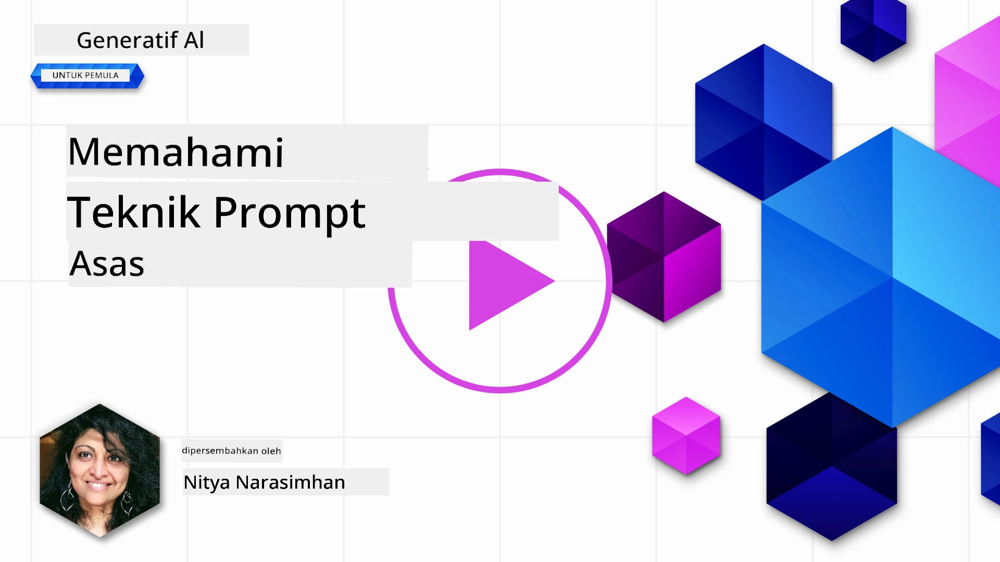
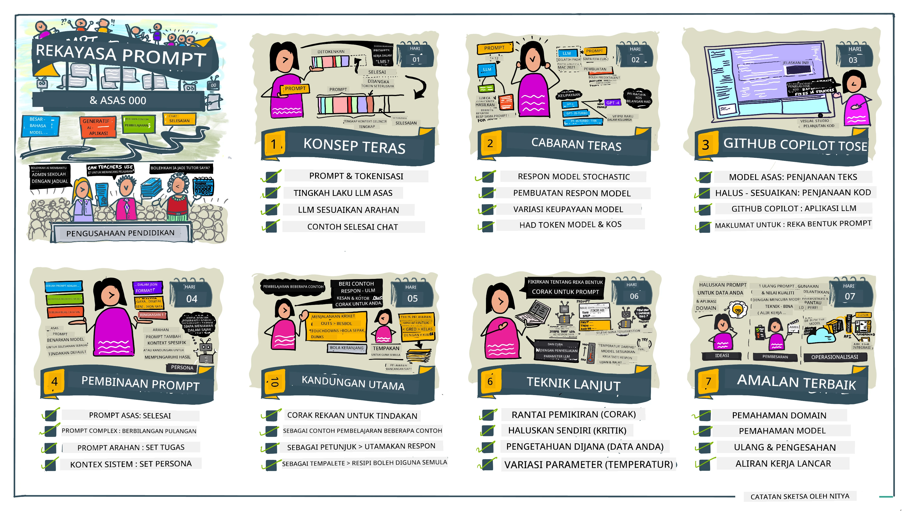
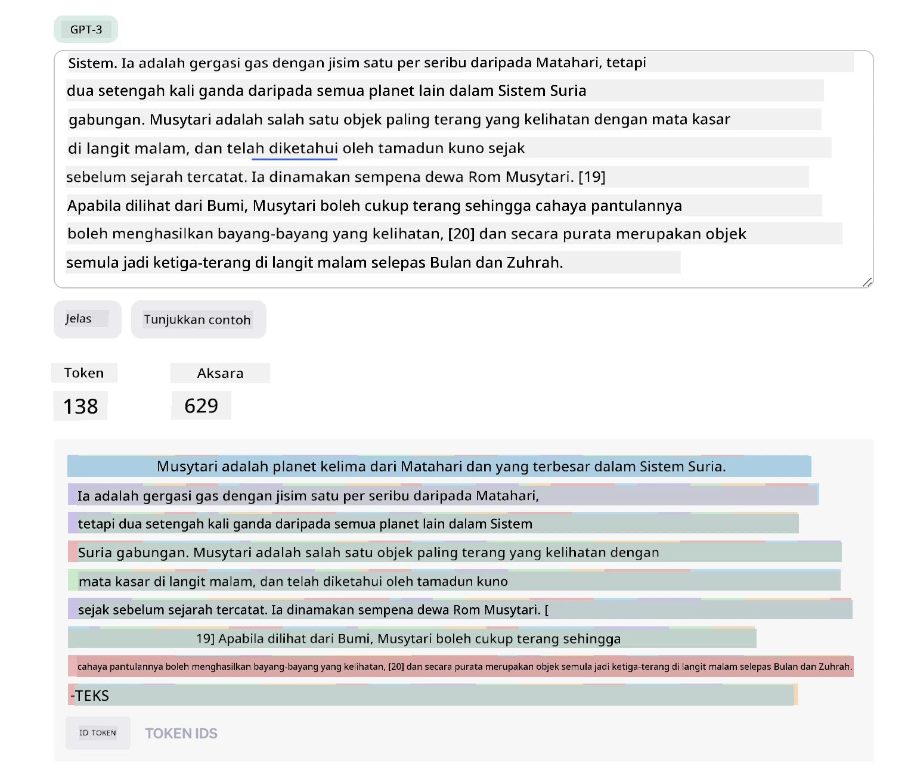
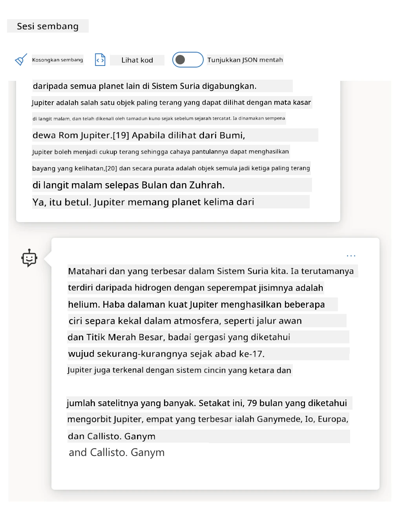
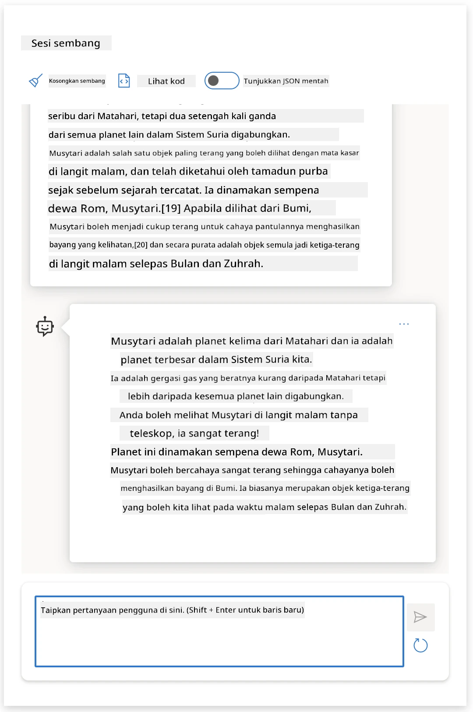
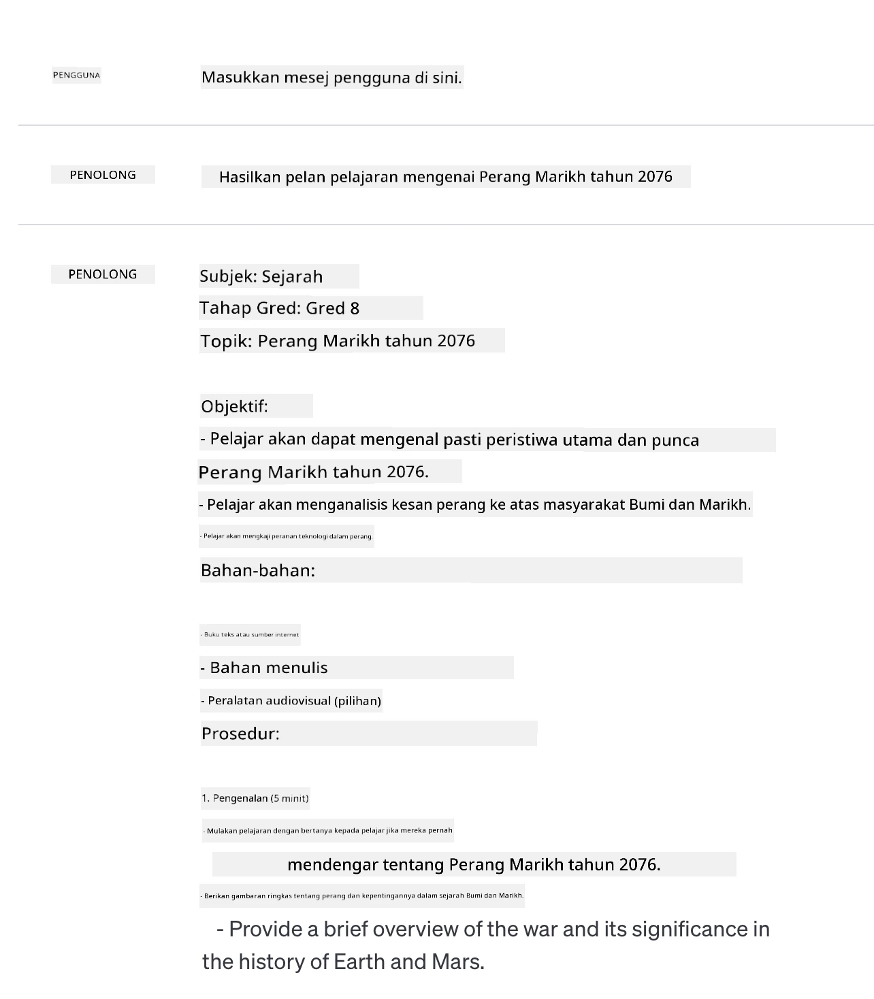
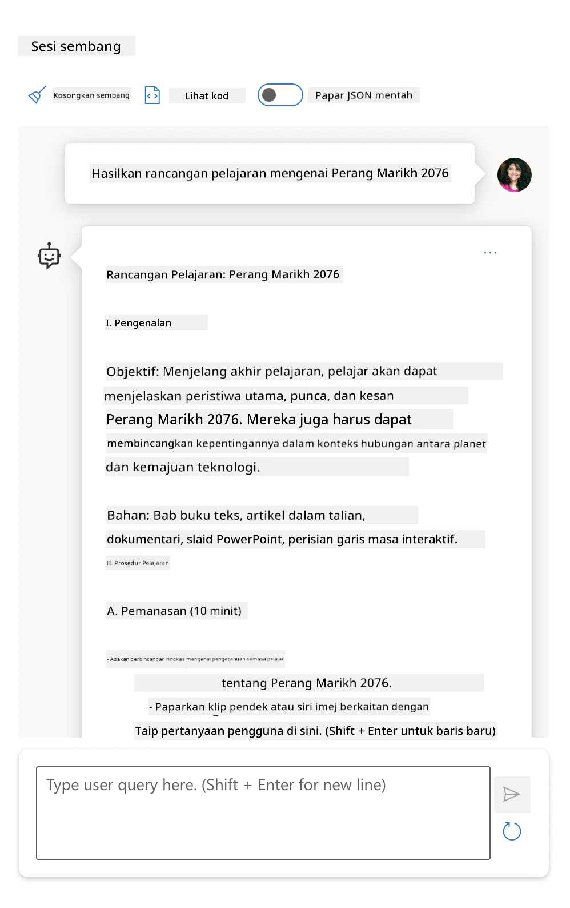
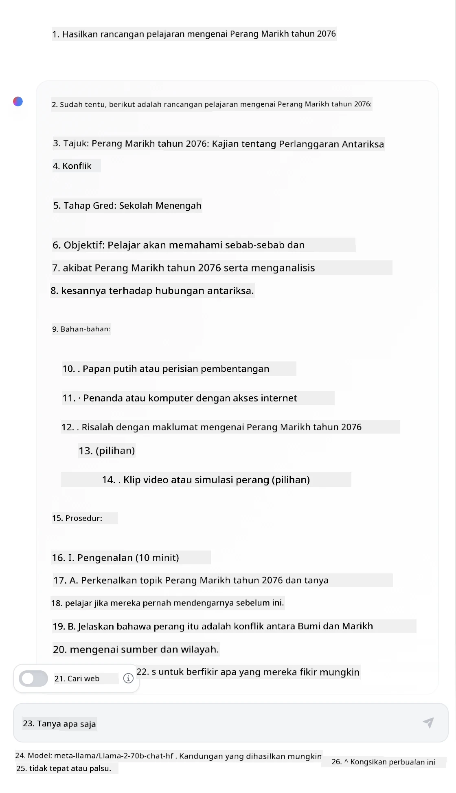

# Asas Kejuruteraan Prompt

[](https://youtu.be/GElCu2kUlRs?si=qrXsBvXnCW12epb8)

## Pengenalan
Modul ini merangkumi konsep dan teknik penting untuk menghasilkan prompt yang berkesan dalam model AI generatif. Cara anda menulis prompt kepada LLM juga penting. Sebuah prompt yang direka dengan teliti boleh menghasilkan tindak balas yang lebih berkualiti. Tetapi apakah sebenarnya maksud istilah seperti _prompt_ dan _kejuruteraan prompt_? Dan bagaimana saya boleh memperbaiki _input_ prompt yang saya hantar ke LLM? Inilah soalan yang akan kita cuba jawab dalam bab ini dan seterusnya.

_AI Generatif_ mampu mencipta kandungan baru (contohnya, teks, imej, audio, kod dan sebagainya) sebagai tindak balas kepada permintaan pengguna. Ia mencapai ini dengan menggunakan _Model Bahasa Besar_ seperti siri GPT (\"Generative Pre-trained Transformer\") OpenAI yang dilatih menggunakan bahasa semula jadi dan kod.

Pengguna kini boleh berinteraksi dengan model ini menggunakan paradigma yang biasa seperti sembang, tanpa memerlukan kepakaran teknikal atau latihan. Model-model ini adalah _berasaskan prompt_ - pengguna menghantar input teks (prompt) dan mendapat balasan AI (penyelesaian). Mereka kemudian boleh \"bersembang dengan AI\" secara berulang, dalam perbualan pelbagai pusingan, memperbaiki prompt mereka sehingga tindak balas memenuhi jangkaan mereka.

\"Prompt\" kini menjadi antara _antara muka pengaturcaraan_ utama untuk aplikasi AI generatif, memberitahu model apa yang perlu dilakukan dan mempengaruhi kualiti jawapan yang dikembalikan. \"Kejuruteraan Prompt\" adalah bidang kajian yang berkembang pesat yang menumpukan pada _reka bentuk dan pengoptimuman_ prompt untuk memberikan jawapan yang konsisten dan berkualiti secara besar-besaran.

## Matlamat Pembelajaran

Dalam pelajaran ini, kita akan belajar apa itu Kejuruteraan Prompt, mengapa ia penting, dan bagaimana kita boleh mereka bentuk prompt yang lebih berkesan untuk model dan objektif aplikasi tertentu. Kita akan memahami konsep teras dan amalan terbaik bagi kejuruteraan prompt - serta belajar tentang persekitaran \"sandbox\" interaktif Jupyter Notebooks di mana kita boleh lihat konsep ini diterapkan pada contoh sebenar.

Pada akhir pelajaran ini, kita akan dapat:

1. Menerangkan apa itu kejuruteraan prompt dan mengapa ia penting.
2. Menerangkan komponen sebuah prompt dan bagaimana ia digunakan.
3. Mempelajari amalan terbaik dan teknik untuk kejuruteraan prompt.
4. Mengaplikasi teknik yang dipelajari kepada contoh sebenar, menggunakan endpoint OpenAI.

## Istilah Penting

Kejuruteraan Prompt: Amalan mereka bentuk dan memperhalusi input untuk membimbing model AI menghasilkan output yang diingini.
Tokenisasi: Proses menukar teks menjadi unit-unit lebih kecil, dipanggil token, yang dapat difahami dan diproses oleh model.
LLM yang Ditala dengan Arahan: Model Bahasa Besar (LLM) yang telah ditingkatkan dengan arahan tertentu untuk meningkatkan ketepatan dan kesesuaian tindak balasnya.

## Sandbox Pembelajaran

Kejuruteraan prompt kini lebih kepada seni daripada sains. Cara terbaik untuk memperbaiki intuisi kita adalah dengan _berlatih lebih banyak_ dan menggunakan pendekatan cuba-dan-silap yang menggabungkan kepakaran domain aplikasi dengan teknik yang disyorkan dan pengoptimuman khusus model.

Jupyter Notebook yang disertakan dengan pelajaran ini menyediakan persekitaran _sandbox_ di mana anda boleh mencuba apa yang anda pelajari - secara langsung atau sebagai sebahagian cabaran kod di akhir. Untuk melaksanakan latihan, anda memerlukan:

1. **Kunci API Azure OpenAI** - titik akhir perkhidmatan untuk LLM yang telah dikerahkan.
2. **Runtime Python** - yang mana Notebook boleh dijalankan.
3. **Pembolehubah Persekitaran Tempatan** - _lengkapkan langkah [SETUP](./../00-course-setup/02-setup-local.md?WT.mc_id=academic-105485-koreyst) sekarang untuk bersedia_.

Notebook ini datang dengan latihan _permulaan_ - tetapi anda digalakkan untuk menambah bahagian _Markdown_ (deskripsi) dan _Kod_ (permintaan prompt) anda sendiri untuk mencuba lebih banyak contoh atau idea - dan membina intuisi anda untuk reka bentuk prompt.

## Panduan Bergambar

Mahu gambaran besar tentang apa yang diliputi pelajaran ini sebelum anda mula? Lihat panduan bergambar ini, yang memberi anda gambaran tentang topik utama yang dibincangkan dan maklumat penting untuk anda fikirkan dalam setiap satu. Laluan pelajaran membawa anda dari memahami konsep teras dan cabaran hingga menanganinya dengan teknik kejuruteraan prompt yang relevan dan amalan terbaik. Nota bahawa bahagian \"Teknik Lanjutan\" dalam panduan ini merujuk kepada kandungan yang diliputi dalam bab _seterusnya_ dalam kurikulum ini.



## Startup Kami

Kini, mari kita bicarakan bagaimana _topik ini_ berkaitan dengan misi startup kami untuk [membawa inovasi AI ke pendidikan](https://educationblog.microsoft.com/2023/06/collaborating-to-bring-ai-innovation-to-education?WT.mc_id=academic-105485-koreyst). Kami mahu membina aplikasi yang dikuasakan AI untuk _pembelajaran peribadi_ - jadi mari fikirkan bagaimana pengguna aplikasi kami yang berbeza mungkin \"mereka bentuk\" prompt:

- **Pentadbir** mungkin meminta AI untuk _menganalisis data kurikulum bagi mengenal pasti jurang dalam liputan_. AI boleh meringkaskan keputusan atau memvisualisasikannya dengan kod.
- **Pendidik** mungkin meminta AI untuk _menghasilkan pelan pelajaran untuk khalayak dan topik sasaran_. AI boleh membina pelan peribadi dalam format yang ditetapkan.
- **Pelajar** mungkin meminta AI untuk _membimbing mereka dalam subjek yang sukar_. AI kini boleh membimbing pelajar dengan pelajaran, petunjuk & contoh yang disesuaikan dengan tahap mereka.

Itu hanyalah permulaan sahaja. Lihat [Prompts For Education](https://github.com/microsoft/prompts-for-edu/tree/main?WT.mc_id=academic-105485-koreyst) - perpustakaan prompt sumber terbuka yang dikurasi oleh pakar pendidikan - untuk mendapatkan gambaran lebih luas tentang kemungkinan! _Cuba jalankan beberapa prompt tersebut dalam sandbox atau menggunakan OpenAI Playground untuk lihat apa yang berlaku!_

<!--
TEMPEL PELAJARAN:
Unit ini harus merangkumi konsep teras #1.
Memperkuat konsep dengan contoh dan rujukan.

KONSEP #1:
Kejuruteraan Prompt.
Takrif dan terangkan mengapa ia diperlukan.
-->

## Apakah Kejuruteraan Prompt?

Kita mula pelajaran ini dengan mentakrifkan **Kejuruteraan Prompt** sebagai proses _mereka bentuk dan mengoptimumkan_ input teks (prompt) untuk memberikan jawapan yang konsisten dan berkualiti (penyelesaian) bagi objektif dan model aplikasi tertentu. Kita boleh fikirkan ini sebagai proses 2-langkah:

- _mereka bentuk_ prompt awal untuk model dan objektif tertentu
- _memperhalusi_ prompt secara berterusan untuk memperbaiki kualiti jawapan

Ini semestinya proses cuba-dan-silap yang memerlukan intuisi dan usaha pengguna untuk mendapatkan hasil yang optimum. Jadi mengapa ia penting? Untuk menjawab soalan itu, kita perlu faham tiga konsep:

- _Tokenisasi_ = bagaimana model \"melihat\" prompt
- _LLM Asas_ = bagaimana model asas \"memproses\" prompt
- _LLM yang Ditala dengan Arahan_ = bagaimana model kini boleh melihat \"tugas\"

### Tokenisasi

LLM melihat prompt sebagai _urutan token_ di mana model berbeza (atau versi model) boleh menokenkan prompt yang sama dengan cara berbeza. Oleh kerana LLM dilatih pada token (dan bukan pada teks mentah), cara prompt ditokenkan mempunyai impak langsung pada kualiti jawapan yang dijana.

Untuk mendapatkan intuisi bagaimana tokenisasi berfungsi, cuba alat seperti [OpenAI Tokenizer](https://platform.openai.com/tokenizer?WT.mc_id=academic-105485-koreyst) yang ditunjukkan di bawah. Salin prompt anda - dan lihat bagaimana ia ditukar menjadi token, beri perhatian kepada cara karakter ruang kosong dan tanda baca dikendalikan. Nota bahawa contoh ini menunjukkan LLM lama (GPT-3) - jadi mencuba ini dengan model yang lebih baru mungkin menghasilkan keputusan yang berbeza.



### Konsep: Model Asas

Setelah prompt ditokenkan, fungsi utama ["LLM Asas"](https://blog.gopenai.com/an-introduction-to-base-and-instruction-tuned-large-language-models-8de102c785a6?WT.mc_id=academic-105485-koreyst) (atau model asas) adalah untuk meramalkan token dalam urutan itu. Oleh kerana LLM dilatih dengan dataset teks yang besar, mereka mempunyai pemahaman yang baik tentang hubungan statistik antara token dan boleh membuat ramalan itu dengan keyakinan tertentu. Perlu diingat bahawa mereka tidak memahami _makna_ perkataan dalam prompt atau token; mereka hanya melihat corak yang boleh mereka \"lengkapkan\" dengan ramalan seterusnya. Mereka boleh meneruskan ramalan urutan itu sehingga dihentikan oleh campur tangan pengguna atau syarat pra-tetap.

Mahu lihat bagaimana penyelesaian berasaskan prompt berfungsi? Masukkan prompt di atas ke dalam [Microsoft Foundry playground](https://ai.azure.com?WT.mc_id=academic-105485-koreyst) dengan tetapan lalai. Sistem disusun untuk menganggap prompt sebagai permintaan maklumat - jadi anda sepatutnya melihat penyelesaian yang memenuhi konteks ini.

Tetapi bagaimana jika pengguna mahu melihat sesuatu yang khusus yang memenuhi kriteria atau objektif tugas? Di sinilah LLM _ditala dengan arahan_ memainkan peranan.



### Konsep: LLM Ditala Dengan Arahan

Sebuah [LLM Ditala Dengan Arahan](https://blog.gopenai.com/an-introduction-to-base-and-instruction-tuned-large-language-models-8de102c785a6?WT.mc_id=academic-105485-koreyst) bermula dengan model asas dan melakukan halus tala dengan contoh atau pasangan input/output (contohnya, mesej berbilang pusingan) yang boleh mengandungi arahan jelas - dan respons dari AI cuba untuk mengikuti arahan itu.

Ini menggunakan teknik seperti Pembelajaran Penguatan dengan Maklum Balas Manusia (RLHF) yang boleh melatih model untuk _mengikuti arahan_ dan _belajar daripada maklum balas_ supaya menghasilkan respons yang lebih sesuai untuk aplikasi praktikal dan lebih relevan dengan objektif pengguna.

Mari cuba - kembali ke prompt di atas, tetapi sekarang tukar _mesej sistem_ untuk memberikan arahan berikut sebagai konteks:

> _Ringkaskan kandungan yang diberikan untuk pelajar gred dua. Kekalkan hasil dalam satu perenggan dengan 3-5 titik peluru._

Lihat bagaimana hasil kini diubah suai untuk mencerminkan matlamat dan format yang diingini? Seorang pendidik kini boleh menggunakan terus respons ini dalam slaid mereka untuk kelas tersebut.



## Mengapa Kita Perlukan Kejuruteraan Prompt?

Kini kita tahu bagaimana prompt diproses oleh LLM, mari bincangkan _mengapa_ kita perlukan kejuruteraan prompt. Jawapannya terletak pada fakta bahawa LLM semasa menghadapi beberapa cabaran yang menjadikan _penyelesaian yang boleh dipercayai dan konsisten_ sukar dicapai tanpa usaha dalam pembinaan dan pengoptimuman prompt. Contohnya:

1. **Tindak balas model adalah stokastik.** _Prompt yang sama_ mungkin menghasilkan tindak balas yang berbeza dengan model atau versi model yang berbeza. Dan ia juga mungkin menghasilkan keputusan yang berbeza dengan _model yang sama_ pada masa yang berlainan. _Teknik kejuruteraan prompt boleh membantu kita meminimumkan variasi ini dengan menyediakan panduan yang lebih baik_.

1. **Model boleh mereka-reka tindak balas.** Model telah dilatih dengan dataset _besar tetapi terhad_, bermakna mereka tidak mempunyai pengetahuan tentang konsep di luar skop latihan tersebut. Oleh itu, mereka boleh menghasilkan penyelesaian yang tidak tepat, khayalan, atau bertentangan secara langsung dengan fakta yang diketahui. _Teknik kejuruteraan prompt membantu pengguna mengenal pasti dan mengurangkan fabrikasi seperti ini contohnya dengan meminta AI menyertakan sumber atau alasan_.

1. **Keupayaan model akan berbeza-beza.** Model baru atau generasi model akan mempunyai keupayaan yang lebih kaya tetapi juga membawa keanehan unik dan pertukaran dalam kos & kerumitan. _Kejuruteraan prompt boleh membantu kita membangunkan amalan terbaik dan aliran kerja yang mengabstrak perbezaan dan menyesuaikan kepada keperluan khusus model dengan cara yang boleh diskalakan dan lancar_.

Mari lihat ini dalam tindakan di OpenAI atau Azure OpenAI Playground:

- Gunakan prompt yang sama dengan pelbagai penyebaran LLM (contohnya, OpenAI, Azure OpenAI, Hugging Face) - adakah anda dapat melihat variasi?
- Gunakan prompt yang sama berulang kali dengan penyebaran LLM _yang sama_ (contohnya, Azure OpenAI playground) - bagaimana variasi ini berbeza?

### Contoh Fabrikasi

Dalam kursus ini, kami menggunakan istilah **\"fabrikasi\"** untuk merujuk kepada fenomena di mana LLM kadang-kadang menghasilkan maklumat yang tidak tepat secara faktual disebabkan oleh had dalam latihan atau batasan lain. Anda juga mungkin pernah mendengar ini dipanggil _\"halusinasi\"_ dalam artikel popular atau kertas penyelidikan. Namun, kami sangat mengesyorkan menggunakan istilah _\"fabrikasi\"_ supaya kita tidak secara tidak sengaja memberi sifat manusia pada tingkah laku ini dengan mengaitkan ciri seperti manusia pada hasil yang digerakkan mesin. Ini juga mengukuhkan [garis panduan AI Bertanggungjawab](https://www.microsoft.com/ai/responsible-ai?WT.mc_id=academic-105485-koreyst) dari perspektif istilah, dengan menghapuskan istilah yang juga mungkin dianggap menghina atau tidak inklusif dalam beberapa konteks.

Mahu merasai bagaimana fabrikasi berfungsi? Fikirkan prompt yang mengarahkan AI untuk menghasilkan kandungan bagi topik yang tidak wujud (untuk memastikan ia tidak terdapat dalam dataset latihan). Contohnya - saya cuba prompt ini:

> **Prompt:** hasilkan pelan pelajaran tentang Perang Marikh tahun 2076.

Carian web menunjukkan kepada saya bahawa terdapat cerita fiksyen (contohnya, siri televisyen atau buku) tentang perang Marikh - tetapi tiada yang dalam tahun 2076. Akal sehat juga memberitahu kita bahawa 2076 adalah _di masa depan_ dan oleh itu, tidak boleh dikaitkan dengan peristiwa sebenar.


Jadi apa yang berlaku apabila kami menjalankan prompt ini dengan penyedia LLM yang berbeza?

> **Respons 1**: OpenAI Playground (GPT-35)



> **Respons 2**: Azure OpenAI Playground (GPT-35)



> **Respons 3**: : Hugging Face Chat Playground (LLama-2)



Seperti yang dijangka, setiap model (atau versi model) menghasilkan respons yang sedikit berbeza terima kasih kepada kelakuan stokastik dan variasi keupayaan model. Contohnya, satu model menyasarkan penonton gred 8 manakala satu lagi menganggap pelajar sekolah menengah. Tetapi ketiga-tiga model menghasilkan respons yang boleh meyakinkan pengguna yang tidak dimaklumkan bahawa kejadian itu benar.

Teknik kejuruteraan prompt seperti _metaprompting_ dan _konfigurasi suhu_ mungkin mengurangkan fabrikasi model sampai tahap tertentu. Seni bina kejuruteraan prompt baru juga menggabungkan alat dan teknik baru dengan lancar ke dalam aliran prompt, untuk mengurangkan atau mengelakkan beberapa kesan ini.

## Kajian Kes: GitHub Copilot

Mari kita rumuskan bahagian ini dengan memahami bagaimana kejuruteraan prompt digunakan dalam penyelesaian dunia sebenar dengan melihat satu Kajian Kes: [GitHub Copilot](https://github.com/features/copilot?WT.mc_id=academic-105485-koreyst).

GitHub Copilot adalah "Rakan Pengaturcara AI" anda - ia menukar prompt teks kepada pelengkap kod dan diintegrasikan dalam persekitaran pembangunan anda (contohnya, Visual Studio Code) untuk pengalaman pengguna yang lancar. Seperti yang didokumenkan dalam siri blog di bawah, versi paling awal adalah berdasarkan model OpenAI Codex - dengan jurutera cepat sedar keperluan menyesuaikan model dan membangunkan teknik kejuruteraan prompt yang lebih baik, untuk meningkatkan kualiti kod. Pada bulan Julai, mereka [memperkenalkan model AI yang dipertingkatkan yang melebihi Codex](https://github.blog/2023-07-28-smarter-more-efficient-coding-github-copilot-goes-beyond-codex-with-improved-ai-model/?WT.mc_id=academic-105485-koreyst) bagi cadangan yang lebih pantas.

Baca kiriman secara berurutan, untuk mengikuti perjalanan pembelajaran mereka.

- **Mei 2023** | [GitHub Copilot Menjadi Lebih Baik Memahami Kod Anda](https://github.blog/2023-05-17-how-github-copilot-is-getting-better-at-understanding-your-code/?WT.mc_id=academic-105485-koreyst)
- **Mei 2023** | [Dalam GitHub: Bekerja dengan LLM di belakang GitHub Copilot](https://github.blog/2023-05-17-inside-github-working-with-the-llms-behind-github-copilot/?WT.mc_id=academic-105485-koreyst).
- **Jun 2023** | [Cara menulis prompt yang lebih baik untuk GitHub Copilot](https://github.blog/2023-06-20-how-to-write-better-prompts-for-github-copilot/?WT.mc_id=academic-105485-koreyst).
- **Jul 2023** | [.. GitHub Copilot melebihi Codex dengan model AI yang dipertingkatkan](https://github.blog/2023-07-28-smarter-more-efficient-coding-github-copilot-goes-beyond-codex-with-improved-ai-model/?WT.mc_id=academic-105485-koreyst)
- **Jul 2023** | [Panduan Pembangun untuk Kejuruteraan Prompt dan LLM](https://github.blog/2023-07-17-prompt-engineering-guide-generative-ai-llms/?WT.mc_id=academic-105485-koreyst)
- **Sep 2023** | [Cara membina aplikasi LLM perusahaan: Pengajaran dari GitHub Copilot](https://github.blog/2023-09-06-how-to-build-an-enterprise-llm-application-lessons-from-github-copilot/?WT.mc_id=academic-105485-koreyst)

Anda juga boleh melayari [blog Kejuruteraan](https://github.blog/category/engineering/?WT.mc_id=academic-105485-koreyst) mereka untuk lebih banyak kiriman seperti [yang ini](https://github.blog/2023-09-27-how-i-used-github-copilot-chat-to-build-a-reactjs-gallery-prototype/?WT.mc_id=academic-105485-koreyst) yang menunjukkan bagaimana model dan teknik ini _digunakan_ untuk memacu aplikasi dunia sebenar.

---

<!--
TEMPEL PELAJARAN:
Unit ini harus merangkumi konsep teras #2.
Mengukuhkan konsep dengan contoh dan rujukan.

KONSEP #2:
Reka Bentuk Prompt.
Diterangkan dengan contoh.
-->

## Pembinaan Prompt

Kita telah melihat mengapa kejuruteraan prompt penting - sekarang mari fahami bagaimana prompt _dibina_ supaya kita dapat menilai teknik berbeza untuk reka bentuk prompt yang lebih berkesan.

### Prompt Asas

Mari mulakan dengan prompt asas: input teks yang dihantar ke model tanpa konteks lain. Berikut adalah contoh - apabila kita menghantar beberapa perkataan pertama lagu kebangsaan AS ke OpenAI [Completion API](https://platform.openai.com/docs/api-reference/completions?WT.mc_id=academic-105485-koreyst) ia segera _melengkapkan_ jawapan dengan beberapa baris seterusnya, menggambarkan kelakuan ramalan asas.

| Prompt (Input)     | Lengkap (Output)                                                                                                                        |
| :----------------- | :----------------------------------------------------------------------------------------------------------------------------------------- |
| Oh say can you see | Bunyi seperti anda memulakan lirik "The Star-Spangled Banner," lagu kebangsaan Amerika Syarikat. Lirik penuhnya adalah ... |

### Prompt Kompleks

Sekarang mari tambah konteks dan arahan pada prompt asas itu. API [Chat Completion](https://learn.microsoft.com/azure/ai-services/openai/how-to/chatgpt?WT.mc_id=academic-105485-koreyst) membolehkan kita membina prompt kompleks sebagai koleksi _mesej_ dengan:

- Pasangan input/output yang mencerminkan input _pengguna_ dan respons _penolong_.
- Mesej sistem menetapkan konteks untuk kelakuan atau personaliti penolong.

Permintaan kini dalam bentuk di bawah, di mana _tokenisasi_ secara berkesan menangkap maklumat relevan dari konteks dan perbualan. Sekarang, mengubah konteks sistem boleh memberi impak kepada kualiti lengkap, sama seperti input pengguna yang diberikan.

```python
response = client.responses.create(
    model="gpt-4o-mini",
    input=[
        {"role": "system", "content": "You are a helpful assistant."},
        {"role": "user", "content": "Who won the world series in 2020?"},
        {"role": "assistant", "content": "The Los Angeles Dodgers won the World Series in 2020."},
        {"role": "user", "content": "Where was it played?"}
    ]
)
```

### Prompt Arahan

Dalam contoh di atas, prompt pengguna adalah pertanyaan teks ringkas yang boleh ditafsir sebagai permintaan maklumat. Dengan prompt _arahan_, kita boleh menggunakan teks itu untuk menentukan tugas dengan lebih terperinci, memberi panduan yang lebih baik kepada AI. Berikut adalah contohnya:

| Prompt (Input)                                                                                                                                                                                                                         | Lengkap (Output)                                                                                                        | Jenis Arahan       |
| :------------------------------------------------------------------------------------------------------------------------------------------------------------------------------------------------------------------------------------- | :------------------------------------------------------------------------------------------------------------------------- | :------------------ |
| Tulis deskripsi Perang Saudara                                                                                                                                                                                                          | _mengembalikan perenggan ringkas_                                                                                         | Mudah               |
| Tulis deskripsi Perang Saudara. Berikan tarikh dan kejadian penting serta jelaskan kepentingannya                                                                                                                                        | _mengembalikan perenggan diikuti senarai tarikh kejadian penting beserta deskripsi_                                        | Kompleks            |
| Tulis deskripsi Perang Saudara dalam 1 perenggan. Berikan 3 perkara utama dengan tarikh dan kepentingannya. Berikan 3 perkara utama lagi dengan tokoh sejarah penting dan sumbangan mereka. Kembalikan output sebagai fail JSON                          | _mengembalikan butiran lebih terperinci dalam kotak teks, diformat sebagai JSON yang boleh disalin tampal ke fail dan validasi jika diperlukan_ | Kompleks. Berformat. |

## Kandungan Utama

Dalam contoh di atas, prompt masih agak terbuka, membenarkan LLM menentukan bahagian dataset pra-latihan yang relevan. Dengan corak reka bentuk _kandungan utama_, teks input dibahagikan kepada dua bahagian:

- arahan (tindakan)
- kandungan relevan (yang mempengaruhi tindakan)

Berikut adalah contoh di mana arahan adalah "ringkaskan ini dalam 2 ayat".

| Prompt (Input)                                                                                                                                                                                                                                                                                                                                                                                                                                                                                                                                                                                                                                                                                      | Lengkap (Output)                                                                                                                                                                                                                                                                             |
| :-------------------------------------------------------------------------------------------------------------------------------------------------------------------------------------------------------------------------------------------------------------------------------------------------------------------------------------------------------------------------------------------------------------------------------------------------------------------------------------------------------------------------------------------------------------------------------------------------------------------------------------------------------------------------------------------------- | :---------------------------------------------------------------------------------------------------------------------------------------------------------------------------------------------------------------------------------------------------------------------------------------------- |
| Jupiter adalah planet kelima dari Matahari dan yang terbesar dalam Sistem Suria. Ia adalah gergasi gas dengan jisim satu per seribu dari Matahari, tetapi dua setengah kali ganda daripada semua planet lain dalam Sistem Suria digabungkan. Jupiter adalah salah satu objek paling terang yang kelihatan dengan mata kasar di langit malam, dan telah diketahui oleh tamadun purba sejak sebelum sejarah direkodkan. Ia dinamakan sempena dewa Rom, Jupiter.[19] Apabila dilihat dari Bumi, Jupiter boleh cukup terang sehingga cahaya pantulannya boleh menghasilkan bayang yang kelihatan,[20] dan secara purata adalah objek semula jadi ketiga paling terang di langit malam selepas Bulan dan Zuhrah. <br/> **Ringkaskan ini dalam 2 ayat pendek** | Jupiter, planet kelima dari Matahari, adalah yang terbesar dalam Sistem Suria dan dikenali sebagai salah satu objek yang paling terang di langit malam. Dinamakan sempena dewa Rom Jupiter, ia merupakan gergasi gas dengan jisim dua setengah kali ganda daripada semua planet lain dalam Sistem Suria digabungkan. |

Segmen kandungan utama boleh digunakan dalam pelbagai cara untuk memacu arahan yang lebih berkesan:

- **Contoh** - bukannya memberitahu model apa yang patut dibuat dengan arahan nyata, berikan contoh apa yang perlu dilakukan dan biarkan ia meneka pola.
- **Isyarat** - ikuti arahan dengan "isyarat" yang merangsang pelengkap, membimbing model ke respons yang lebih relevan.
- **Templat** - ini adalah 'resipi' yang boleh diulang untuk prompt dengan tempat letak (pembolehubah) yang boleh disesuaikan dengan data untuk kes penggunaan tertentu.

Mari jelajahi ini dalam tindakan.

### Menggunakan Contoh

Ini adalah pendekatan di mana anda menggunakan kandungan utama untuk "memberi makan model" beberapa contoh output yang dikehendaki untuk arahan tertentu, dan membiarkannya meneka pola untuk output yang dikehendaki. Berdasarkan bilangan contoh yang diberikan, kita boleh ada zero-shot prompting, one-shot prompting, few-shot prompting dan lain-lain.

Prompt kini terdiri daripada tiga komponen:

- Penerangan tugas
- Beberapa contoh output yang dikehendaki
- Permulaan contoh baru (yang menjadi penerangan tugas secara tersirat)

| Jenis Pembelajaran | Prompt (Input)                                                                                                                                        | Lengkap (Output)         |
| :----------------- | :---------------------------------------------------------------------------------------------------------------------------------------------------- | :------------------------ |
| Zero-shot          | "Matahari Bercahaya". Terjemah ke Bahasa Sepanyol                                                                                                    | "El Sol está brillando".  |
| One-shot           | "Matahari Bercahaya" => ""El Sol está brillando". <br> "Hari ini Sejuk dan Berangin" =>                                                               | "Es un día frío y ventoso". |
| Few-shot           | Pemain berlari di pangkalan => Besbol <br/> Pemain memukul ace => Tenis <br/> Pemain memukul enam => Kriket <br/> Pemain membuat slam-dunk =>            | Bola Keranjang            |
|                    |                                                                                                                                                       |                          |

Perhatikan bagaimana kita perlu memberikan arahan nyata ("Terjemah ke Bahasa Sepanyol") dalam zero-shot prompting, tetapi ia dapat diteka dalam contoh one-shot prompting. Contoh few-shot menunjukkan bagaimana menambahkan lebih banyak contoh membolehkan model membuat inferens yang lebih tepat tanpa arahan tambahan.

### Isyarat Prompt

Teknik lain untuk menggunakan kandungan utama adalah dengan menyediakan _isyarat_ daripada contoh. Dalam kes ini, kita memberi model dorongan ke arah yang betul dengan _memulakannya_ dengan petikan yang mencerminkan format respons yang dikehendaki. Model kemudian "mengambil isyarat" untuk meneruskan dalam rentak tersebut.

| Bilangan Isyarat | Prompt (Input)                                                                                                                                                                                                                                                                                                                                                                                                                                               | Lengkap (Output)                                                                                                                                                                                                                                                                                       |
| :--------------- | :------------------------------------------------------------------------------------------------------------------------------------------------------------------------------------------------------------------------------------------------------------------------------------------------------------------------------------------------------------------------------------------------------------------------------------------------------------- | :------------------------------------------------------------------------------------------------------------------------------------------------------------------------------------------------------------------------------------------------------------------------------------------------------ |
| 0                | Jupiter adalah planet kelima dari Matahari dan yang terbesar dalam Sistem Suria. Ia adalah gergasi gas dengan jisim satu per seribu dari Matahari, tetapi dua setengah kali ganda daripada semua planet lain dalam Sistem Suria digabungkan. Jupiter adalah salah satu objek paling terang yang kelihatan dengan mata kasar di langit malam, dan telah diketahui oleh tamadun purba sejak sebelum sejarah direkodkan. <br/>**Ringkaskan Ini**                                       | Jupiter adalah planet terbesar dalam Sistem Suria kita dan planet kelima dari Matahari. Ia adalah gergasi gas dengan jisim 1/1000 dari Matahari, tetapi lebih berat daripada semua planet lain digabungkan. Tamadun purba telah lama mengenali Jupiter, dan ia mudah kelihatan di langit malam. |
| 1                | Jupiter adalah planet kelima dari Matahari dan yang terbesar dalam Sistem Suria. Ia adalah gergasi gas dengan jisim satu per seribu dari Matahari, tetapi dua setengah kali ganda daripada semua planet lain dalam Sistem Suria digabungkan. Jupiter adalah salah satu objek paling terang yang kelihatan dengan mata kasar di langit malam, dan telah diketahui oleh tamadun purba sejak sebelum sejarah direkodkan. <br/>**Ringkaskan Ini** <br/> Apa yang kami pelajari adalah bahawa Jupiter | adalah planet kelima dari Matahari dan yang terbesar dalam Sistem Suria. Ia adalah gergasi gas dengan jisim satu per seribu dari Matahari, tetapi dua setengah kali ganda daripada semua planet lain digabungkan. Ia mudah dilihat dengan mata kasar dan telah diketahui sejak zaman purba.                         |

| 2              | Jupiter ialah planet kelima dari Matahari dan yang terbesar dalam Sistem Suria. Ia ialah gergasi gas dengan jisim satu per seribu daripada Matahari, tetapi dua setengah kali ganda jisim semua planet lain dalam Sistem Suria digabungkan. Jupiter adalah salah satu objek paling terang yang boleh dilihat dengan mata kasar di langit malam, dan telah dikenali oleh tamadun purba sejak sebelum sejarah direkodkan. <br/>**Ringkaskan Ini** <br/> 3 Fakta Teratas Yang Kami Pelajari:         | 1. Jupiter ialah planet kelima dari Matahari dan yang terbesar dalam Sistem Suria. <br/> 2. Ia ialah gergasi gas dengan jisim satu per seribu daripada Matahari...<br/> 3. Jupiter telah kelihatan dengan mata kasar sejak zaman purba ...                                                                       |
|                |                                                                                                                                                                                                                                                                                                                                                                                                                                                              |                                                                                                                                                                                                                                                                                                           |

### Templat Arahan

Temlat arahan ialah _resipi pra-tetap untuk arahan_ yang boleh disimpan dan digunakan semula mengikut keperluan, untuk memacu pengalaman pengguna yang lebih konsisten secara besar-besaran. Dalam bentuk paling mudah, ia hanyalah koleksi contoh arahan seperti [yang satu ini dari OpenAI](https://cookbook.openai.com/examples/gpt4-1_prompting_guide?WT.mc_id=academic-105485-koreyst) yang menyediakan kedua-dua komponen arahan interaktif (mesej pengguna dan sistem) dan format permintaan yang dipacu API - untuk menyokong penggunaan semula.

Dalam bentuk yang lebih kompleks seperti [contoh ini daripada LangChain](https://python.langchain.com/docs/concepts/prompt_templates/?WT.mc_id=academic-105485-koreyst) ia mengandungi _tempat letak_ yang boleh digantikan dengan data dari pelbagai sumber (input pengguna, konteks sistem, sumber data luaran dan sebagainya) untuk menjana arahan secara dinamik. Ini membolehkan kita mencipta perpustakaan arahan yang boleh digunakan semula yang boleh digunakan untuk memacu pengalaman pengguna yang konsisten **secara berprogram** secara besar-besaran.

Akhir sekali, nilai sebenar templat terletak pada keupayaan untuk mencipta dan menerbitkan _perpustakaan arahan_ untuk domain aplikasi khusus - di mana templar arahan kini _dioptimumkan_ untuk mencerminkan konteks atau contoh spesifik aplikasi yang menjadikan respons lebih relevan dan tepat untuk audiens pengguna sasaran. Repositori [Prompts For Edu](https://github.com/microsoft/prompts-for-edu?WT.mc_id=academic-105485-koreyst) adalah contoh yang baik pendekatan ini, menyusun perpustakaan arahan untuk domain pendidikan dengan penekanan pada objektif utama seperti perancangan pelajaran, reka bentuk kurikulum, bimbingan pelajar dan lain-lain.

## Kandungan Sokongan

Jika kita memikirkan pembinaan arahan sebagai mempunyai arahan (tugas) dan sasaran (kandungan utama), maka _kandungan sekunder_ adalah seperti konteks tambahan yang kita berikan untuk **mempengaruhi output dalam beberapa cara**. Ia boleh jadi parameter penyetelan, arahan format, taksonomi topik dan sebagainya yang boleh membantu model _menyesuaikan_ responsnya supaya sesuai dengan objektif atau jangkaan pengguna yang diinginkan.

Sebagai contoh: Diberi katalog kursus dengan metadata yang luas (nama, penerangan, tahap, tag metadata, pengajar dan lain-lain) pada semua kursus yang tersedia dalam kurikulum:

- kita boleh mendefinisikan arahan untuk "meringkaskan katalog kursus untuk Musim Gugur 2023"
- kita boleh menggunakan kandungan utama untuk menyediakan beberapa contoh output yang dikehendaki
- kita boleh menggunakan kandungan sekunder untuk mengenal pasti 5 "tag" utama yang menarik.

Kini, model boleh memberikan ringkasan dalam format yang ditunjukkan oleh beberapa contoh - tetapi jika hasil mempunyai pelbagai tag, ia boleh mengutamakan 5 tag yang dikenal pasti dalam kandungan sekunder.

---

<!--
TEMPLAT PELAJARAN:
Unit ini harus merangkumi konsep teras #1.
Menguatkan konsep dengan contoh dan rujukan.

KONSEP #3:
Teknik Kejuruteraan Arahan.
Apakah beberapa teknik asas untuk kejuruteraan arahan?
Ilustrasikan dengan beberapa latihan.
-->

## Amalan Terbaik Arahan

Kini kita tahu bagaimana arahan boleh _dibina_, kita boleh mula memikirkan bagaimana untuk _merancang_ mereka untuk mencerminkan amalan terbaik. Kita boleh memikirkannya dalam dua bahagian - mempunyai _mindset_ yang betul dan menggunakan _teknik_ yang betul.

### Mindset Kejuruteraan Arahan

Kejuruteraan Arahan adalah proses cuba dan salah jadi ingat tiga faktor panduan luas ini:

1. **Faham Domain Penting.** Ketepatan dan relevansi respons adalah fungsi _domain_ di mana aplikasi atau pengguna itu beroperasi. Gunakan intuisi dan kepakaran domain anda untuk **menyesuaikan teknik** lebih lanjut. Sebagai contoh, tentukan _personaliti khusus domain_ dalam arahan sistem anda, atau gunakan _templat khusus domain_ dalam arahan pengguna anda. Sediakan kandungan sekunder yang mencerminkan konteks khusus domain, atau gunakan _petunjuk dan contoh khusus domain_ untuk membimbing model ke arah corak penggunaan yang biasa.

2. **Faham Model Penting.** Kita tahu model bersifat stokastik secara semula jadi. Namun pelaksanaan model juga boleh berbeza dari segi set data latihan yang digunakan (pengetahuan pra-latihan), keupayaan yang disediakan (contohnya, melalui API atau SDK) dan jenis kandungan yang dioptimumkan untuknya (contohnya, kod vs imej vs teks). Fahami kekuatan dan keterbatasan model yang anda gunakan, dan gunakan pengetahuan itu untuk _mengutamakan tugas_ atau membina _templat tersuai_ yang dioptimumkan untuk keupayaan model.

3. **Iterasi & Pengesahan Penting.** Model berkembang dengan pesat, begitu juga teknik kejuruteraan arahan. Sebagai pakar domain, anda mungkin mempunyai konteks atau kriteria lain untuk aplikasi khusus _anda_, yang mungkin tidak terpakai kepada masyarakat yang lebih luas. Gunakan alat & teknik kejuruteraan arahan untuk "memulakan" pembinaan arahan, kemudian ulangi dan sahkan keputusan menggunakan intuisi dan kepakaran domain anda sendiri. Catatkan pandangan anda dan cipta **pangkalan pengetahuan** (contohnya, perpustakaan arahan) yang boleh digunakan sebagai garis dasar baru oleh orang lain, untuk iterasi lebih pantas di masa hadapan.

## Amalan Terbaik

Sekarang mari lihat amalan terbaik biasa yang disyorkan oleh pengamal [OpenAI](https://help.openai.com/en/articles/6654000-best-practices-for-prompt-engineering-with-openai-api?WT.mc_id=academic-105485-koreyst) dan [Azure OpenAI](https://learn.microsoft.com/azure/ai-services/openai/concepts/prompt-engineering#best-practices?WT.mc_id=academic-105485-koreyst).

| Apa                              | Kenapa                                                                                                                                                                                                                                               |
| :-------------------------------- | :------------------------------------------------------------------------------------------------------------------------------------------------------------------------------------------------------------------------------------------------ |
| Nilai model terkini.       | Generasi model baru mungkin mempunyai ciri dan kualiti yang lebih baik - tetapi juga mungkin menimbulkan kos lebih tinggi. Nilai impaknya, kemudian buat keputusan migrasi.                                                                                |
| Pisahkan arahan & konteks   | Periksa jika model/pembekal anda mendefinisikan _pembatas_ untuk membezakan arahan, kandungan utama dan kandungan sekunder dengan lebih jelas. Ini boleh membantu model memberikan berat dengan lebih tepat kepada token.                                                         |
| Jadilah spesifik dan jelas             | Beri lebih perincian mengenai konteks yang dikehendaki, hasil, panjang, format, gaya dan sebagainya. Ini akan memperbaiki kedua-dua kualiti dan konsistensi jawapan. Rekod resipi dalam templat yang boleh digunakan semula.                                                          |
| Jadilah deskriptif, gunakan contoh      | Model mungkin memberi respons lebih baik dengan pendekatan "tunjuk dan beri tahu". Mula dengan pendekatan `zero-shot` di mana anda memberinya arahan (tetapi tanpa contoh) kemudian cuba `few-shot` sebagai penambahbaikan, dengan menyediakan beberapa contoh output yang dikehendaki. Gunakan analogi. |
| Gunakan petunjuk untuk memulakan siap sedia | Galakkan model ke arah hasil yang diingini dengan memberinya beberapa perkataan atau frasa pengenalan yang boleh digunakan sebagai titik permulaan untuk respons.                                                                                                               |
| Gandakan                       | Kadang-kadang anda perlu mengulangi arahan kepada model. Beri arahan sebelum dan selepas kandungan utama anda, gunakan arahan dan cue, dan sebagainya. Ulangi & sahkan untuk melihat apa yang berkesan.                                                         |
| Susunan Penting                     | Susunan anda menyampaikan maklumat kepada model mungkin mempengaruhi output, walaupun dalam contoh pembelajaran, disebabkan bias kebaharuan. Cuba pilihan berbeza untuk melihat apa yang paling berkesan.                                                               |
| Beri model satu “jalan keluar”           | Beri model respons penyelesaian _fallback_ yang boleh diberikan jika ia tidak dapat menyelesaikan tugas untuk apa-apa sebab. Ini boleh mengurangkan kemungkinan model menjana respons palsu atau direka.                                                         |
|                                   |                                                                                                                                                                                                                                                   |

Seperti mana-mana amalan terbaik, ingat bahawa _pengalaman anda mungkin berbeza_ bergantung pada model, tugas dan domain. Gunakan ini sebagai titik permulaan, dan ulangi untuk mencari apa yang terbaik untuk anda. Sentiasa menilai semula proses kejuruteraan arahan anda apabila model dan alat baru tersedia, dengan fokus pada skala proses dan kualiti respons.

<!--
TEMPLAT PELAJARAN:
Unit ini harus menyediakan cabaran kod jika berkenaan

CABARAN:
Pautan ke Jupyter Notebook dengan hanya komen kod dalam arahan (bahagian kod kosong).

PENYELESAIAN:
Pautan ke salinan Notebook tersebut dengan arahan diisi dan dijalankan, menunjukkan satu contoh output.
-->

## Tugasan

Tahniah! Anda telah sampai ke penghujung pelajaran! Kini masa untuk menguji beberapa konsep dan teknik itu dengan contoh sebenar!

Untuk tugasan kami, kami akan menggunakan Jupyter Notebook dengan latihan yang anda boleh lengkapkan secara interaktif. Anda juga boleh mengembangkan Notebook dengan sel Markdown dan Kod anda sendiri untuk meneroka idea dan teknik secara sendiri.

### Untuk mula, fork repo, kemudian

- (Disyorkan) Lancarkan GitHub Codespaces
- (Sebagai alternatif) Klon repo ke peranti tempatan anda dan gunakan dengan Docker Desktop
- (Sebagai alternatif) Buka Notebook dengan persekitaran runtime Notebook pilihan anda.

### Seterusnya, konfigurasikan pembolehubah persekitaran anda

- Salin fail `.env.copy` di akar repo ke `.env` dan isikan nilai `AZURE_OPENAI_API_KEY`, `AZURE_OPENAI_ENDPOINT` dan `AZURE_OPENAI_DEPLOYMENT`. Kembali ke [seksyen Sandbox Pembelajaran](#sandbox-pembelajaran) untuk belajar caranya.

### Seterusnya, buka Jupyter Notebook

- Pilih kernel runtime. Jika menggunakan pilihan 1 atau 2, cuma pilih kernel Python 3.10.x lalai yang disediakan oleh bekas pembangunan.

Anda sudah bersedia untuk menjalankan latihan. Perlu diingat tiada jawapan _betul dan salah_ di sini - hanya meneroka pilihan dengan cuba dan salah serta membina intuisi untuk apa yang berkesan bagi satu model dan domain aplikasi tertentu.

_Atas sebab ini tiada segmen Penyelesaian Kod dalam pelajaran ini. Sebaliknya, Notebook akan mempunyai sel Markdown bertajuk "Penyelesaian Saya:" yang menunjukkan satu contoh output untuk rujukan._

 <!--
TEMPLAT PELAJARAN:
Bungkus seksyen dengan ringkasan dan sumber untuk pembelajaran kendiri.
-->

## Periksa Pengetahuan

Yang manakah antara berikut adalah arahan yang baik mengikut beberapa amalan terbaik yang munasabah?

1. Tunjukkan saya imej kereta merah
2. Tunjukkan saya imej kereta merah jenama Volvo dan model XC90 yang diparkir di tepi tebing dengan matahari terbenam
3. Tunjukkan saya imej kereta merah jenama Volvo dan model XC90

A: 2, ia arahan terbaik kerana memberikan butiran tentang "apa" dan masuk ke khusus (bukan hanya kereta apa-apa tetapi jenama dan model tertentu) dan juga menerangkan suasana keseluruhan. 3 yang seterusnya terbaik kerana ia juga mengandungi banyak penerangan.

## 🚀 Cabaran

Lihat jika anda boleh menggunakan teknik "petunjuk" dengan arahan: Lengkapkan ayat "Tunjukkan saya imej kereta merah jenama Volvo dan ". Apa yang ia balas, dan bagaimana anda akan memperbaikinya?

## Kerja Hebat! Teruskan Pembelajaran Anda

Mahu belajar lebih lanjut tentang pelbagai konsep Kejuruteraan Arahan? Pergi ke [laman pembelajaran lanjutan](https://aka.ms/genai-collection?WT.mc_id=academic-105485-koreyst) untuk mencari sumber hebat lain tentang topik ini.

Teruskan ke Pelajaran 5 di mana kita akan lihat [teknik arahan lanjutan](../05-advanced-prompts/README.md?WT.mc_id=academic-105485-koreyst)!

---

<!-- CO-OP TRANSLATOR DISCLAIMER START -->
**Penafian**:
Dokumen ini telah diterjemahkan menggunakan perkhidmatan terjemahan AI [Co-op Translator](https://github.com/Azure/co-op-translator). Walaupun kami berusaha untuk ketepatan, sila ambil maklum bahawa terjemahan automatik mungkin mengandungi kesilapan atau ketidaktepatan. Dokumen asal dalam bahasa asalnya harus dianggap sebagai sumber yang sahih. Untuk maklumat penting, terjemahan oleh manusia profesional adalah disyorkan. Kami tidak bertanggungjawab terhadap sebarang salah faham atau salah tafsir yang timbul daripada penggunaan terjemahan ini.
<!-- CO-OP TRANSLATOR DISCLAIMER END -->