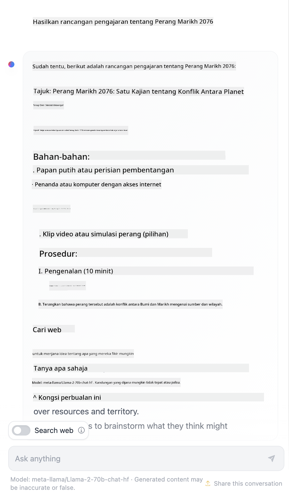

<!--
CO_OP_TRANSLATOR_METADATA:
{
  "original_hash": "a45c318dc6ebc2604f35b8b829f93af2",
  "translation_date": "2025-07-09T10:44:04+00:00",
  "source_file": "04-prompt-engineering-fundamentals/README.md",
  "language_code": "ms"
}
-->
# Asas Kejuruteraan Prompt

[](https://aka.ms/gen-ai-lesson4-gh?WT.mc_id=academic-105485-koreyst)

## Pengenalan  
Modul ini merangkumi konsep dan teknik penting untuk mencipta prompt yang berkesan dalam model AI generatif. Cara anda menulis prompt kepada LLM juga penting. Prompt yang direka dengan teliti boleh menghasilkan respons yang lebih berkualiti. Tetapi apakah sebenarnya maksud istilah seperti _prompt_ dan _kejuruteraan prompt_? Dan bagaimana saya boleh memperbaiki _input_ prompt yang saya hantar ke LLM? Ini adalah soalan yang akan kita cuba jawab dalam bab ini dan bab seterusnya.

_AI Generatif_ mampu mencipta kandungan baru (contohnya, teks, imej, audio, kod dan lain-lain) sebagai tindak balas kepada permintaan pengguna. Ia mencapai ini menggunakan _Model Bahasa Besar_ seperti siri GPT ("Generative Pre-trained Transformer") OpenAI yang dilatih untuk menggunakan bahasa semula jadi dan kod.

Pengguna kini boleh berinteraksi dengan model-model ini menggunakan paradigma yang biasa seperti chat, tanpa memerlukan kepakaran teknikal atau latihan. Model-model ini berasaskan _prompt_ - pengguna menghantar input teks (prompt) dan menerima respons AI (penyempurnaan). Mereka kemudian boleh "berbual dengan AI" secara berulang, dalam perbualan berbilang pusingan, memperbaiki prompt mereka sehingga respons memenuhi jangkaan mereka.

"Prompt" kini menjadi _antara muka pengaturcaraan_ utama untuk aplikasi AI generatif, memberitahu model apa yang perlu dilakukan dan mempengaruhi kualiti respons yang diterima. "Kejuruteraan Prompt" adalah bidang kajian yang berkembang pesat yang memfokuskan pada _rekabentuk dan pengoptimuman_ prompt untuk menghasilkan respons yang konsisten dan berkualiti secara besar-besaran.

## Matlamat Pembelajaran

Dalam pelajaran ini, kita akan belajar apa itu Kejuruteraan Prompt, mengapa ia penting, dan bagaimana kita boleh mereka prompt yang lebih berkesan untuk model dan objektif aplikasi tertentu. Kita akan memahami konsep teras dan amalan terbaik untuk kejuruteraan prompt - serta belajar tentang persekitaran "sandbox" interaktif Jupyter Notebooks di mana kita boleh melihat konsep ini diaplikasikan pada contoh sebenar.

Menjelang akhir pelajaran ini, kita akan dapat:

1. Menerangkan apa itu kejuruteraan prompt dan mengapa ia penting.  
2. Menghuraikan komponen prompt dan bagaimana ia digunakan.  
3. Mempelajari amalan terbaik dan teknik untuk kejuruteraan prompt.  
4. Mengaplikasikan teknik yang dipelajari pada contoh sebenar, menggunakan endpoint OpenAI.

## Istilah Utama

Kejuruteraan Prompt: Amalan mereka bentuk dan memperhalusi input untuk membimbing model AI menghasilkan output yang diingini.  
Tokenisasi: Proses menukar teks kepada unit yang lebih kecil, dipanggil token, yang boleh difahami dan diproses oleh model.  
Instruction-Tuned LLMs: Model Bahasa Besar (LLM) yang telah disesuaikan dengan arahan khusus untuk meningkatkan ketepatan dan relevansi respons mereka.

## Sandbox Pembelajaran

Kejuruteraan prompt kini lebih kepada seni daripada sains. Cara terbaik untuk memperbaiki intuisi kita adalah dengan _berlatih lebih banyak_ dan mengamalkan pendekatan cuba dan salah yang menggabungkan kepakaran domain aplikasi dengan teknik yang disyorkan dan pengoptimuman khusus model.

Jupyter Notebook yang disertakan dengan pelajaran ini menyediakan persekitaran _sandbox_ di mana anda boleh mencuba apa yang anda pelajari - sama ada secara langsung atau sebagai sebahagian daripada cabaran kod di akhir pelajaran. Untuk melaksanakan latihan, anda memerlukan:

1. **Kunci API Azure OpenAI** - titik akhir perkhidmatan untuk LLM yang telah dideploy.  
2. **Runtime Python** - di mana Notebook boleh dijalankan.  
3. **Pembolehubah Persekitaran Tempatan** - _lengkapkan langkah [SETUP](./../00-course-setup/SETUP.md?WT.mc_id=academic-105485-koreyst) sekarang untuk bersedia_.

Notebook ini datang dengan latihan _permulaan_ - tetapi anda digalakkan untuk menambah bahagian _Markdown_ (penerangan) dan _Code_ (permintaan prompt) anda sendiri untuk mencuba lebih banyak contoh atau idea - dan membina intuisi anda untuk reka bentuk prompt.

## Panduan Bergambar

Mahukan gambaran besar tentang apa yang diliputi pelajaran ini sebelum anda mula? Lihat panduan bergambar ini, yang memberi anda gambaran tentang topik utama yang dibincangkan dan perkara penting untuk difikirkan dalam setiap satu. Peta pelajaran membawa anda dari memahami konsep teras dan cabaran kepada mengatasinya dengan teknik kejuruteraan prompt yang relevan dan amalan terbaik. Perhatikan bahawa bahagian "Teknik Lanjutan" dalam panduan ini merujuk kepada kandungan yang dibincangkan dalam bab _seterusnya_ dalam kurikulum ini.


## Startup Kami

Sekarang, mari kita bincangkan bagaimana _topik ini_ berkaitan dengan misi startup kami untuk [membawa inovasi AI ke pendidikan](https://educationblog.microsoft.com/2023/06/collaborating-to-bring-ai-innovation-to-education?WT.mc_id=academic-105485-koreyst). Kami ingin membina aplikasi berkuasa AI untuk _pembelajaran yang diperibadikan_ - jadi mari kita fikirkan bagaimana pengguna berbeza aplikasi kami mungkin "mereka" prompt:

- **Pentadbir** mungkin meminta AI untuk _menganalisis data kurikulum bagi mengenal pasti kekurangan dalam liputan_. AI boleh meringkaskan hasil atau memvisualisasikannya dengan kod.  
- **Pendidik** mungkin meminta AI untuk _menghasilkan pelan pengajaran untuk audiens dan topik sasaran_. AI boleh membina pelan yang diperibadikan dalam format yang ditetapkan.  
- **Pelajar** mungkin meminta AI untuk _membimbing mereka dalam subjek yang sukar_. AI kini boleh membimbing pelajar dengan pelajaran, petunjuk & contoh yang disesuaikan dengan tahap mereka.

Itu baru permulaan sahaja. Lihat [Prompts For Education](https://github.com/microsoft/prompts-for-edu/tree/main?WT.mc_id=academic-105485-koreyst) - perpustakaan prompt sumber terbuka yang dikurasi oleh pakar pendidikan - untuk mendapatkan gambaran lebih luas tentang kemungkinan! _Cuba jalankan beberapa prompt tersebut dalam sandbox atau menggunakan OpenAI Playground untuk lihat apa yang berlaku!_

<!--  
TEMPEL PELAJARAN:  
Unit ini harus merangkumi konsep teras #1.  
Mengukuhkan konsep dengan contoh dan rujukan.  

KONSEP #1:  
Kejuruteraan Prompt.  
Mentakrif dan menerangkan mengapa ia diperlukan.  
-->

## Apakah Kejuruteraan Prompt?

Kita mulakan pelajaran ini dengan mentakrif **Kejuruteraan Prompt** sebagai proses _mereka bentuk dan mengoptimumkan_ input teks (prompt) untuk menghasilkan respons (penyempurnaan) yang konsisten dan berkualiti bagi objektif aplikasi dan model tertentu. Kita boleh anggap ini sebagai proses 2 langkah:

- _mereka bentuk_ prompt awal untuk model dan objektif tertentu  
- _memperhalusi_ prompt secara berulang untuk memperbaiki kualiti respons

Ini sememangnya proses cuba dan salah yang memerlukan intuisi dan usaha pengguna untuk mendapatkan hasil yang optimum. Jadi mengapa ia penting? Untuk menjawab soalan itu, kita perlu faham tiga konsep:

- _Tokenisasi_ = bagaimana model "melihat" prompt  
- _Base LLMs_ = bagaimana model asas "memproses" prompt  
- _Instruction-Tuned LLMs_ = bagaimana model kini boleh "melihat tugasan"

### Tokenisasi

LLM melihat prompt sebagai _urutan token_ di mana model yang berbeza (atau versi model) boleh menokenkan prompt yang sama dengan cara yang berbeza. Oleh kerana LLM dilatih menggunakan token (bukan teks mentah), cara prompt ditokenkan memberi kesan langsung kepada kualiti respons yang dijana.

Untuk mendapatkan intuisi tentang bagaimana tokenisasi berfungsi, cuba alat seperti [OpenAI Tokenizer](https://platform.openai.com/tokenizer?WT.mc_id=academic-105485-koreyst) yang ditunjukkan di bawah. Salin prompt anda - dan lihat bagaimana ia ditukar menjadi token, perhatikan bagaimana ruang kosong dan tanda baca dikendalikan. Perlu diingat contoh ini menunjukkan LLM lama (GPT-3) - jadi mencuba dengan model yang lebih baru mungkin menghasilkan keputusan berbeza.


### Konsep: Model Asas

Setelah prompt ditokenkan, fungsi utama ["Base LLM"](https://blog.gopenai.com/an-introduction-to-base-and-instruction-tuned-large-language-models-8de102c785a6?WT.mc_id=academic-105485-koreyst) (atau model asas) adalah meramalkan token seterusnya dalam urutan itu. Oleh kerana LLM dilatih dengan dataset teks yang besar, mereka mempunyai pemahaman statistik yang baik antara token dan boleh membuat ramalan itu dengan keyakinan tertentu. Perlu diingat mereka tidak memahami _makna_ perkataan dalam prompt atau token; mereka hanya melihat corak yang boleh mereka "lengkapkan" dengan ramalan seterusnya. Mereka boleh terus meramalkan urutan sehingga dihentikan oleh campur tangan pengguna atau syarat yang telah ditetapkan.

Mahukan lihat bagaimana penyempurnaan berasaskan prompt berfungsi? Masukkan prompt di atas ke dalam Azure OpenAI Studio [_Chat Playground_](https://oai.azure.com/playground?WT.mc_id=academic-105485-koreyst) dengan tetapan lalai. Sistem dikonfigurasikan untuk menganggap prompt sebagai permintaan maklumat - jadi anda sepatutnya melihat penyempurnaan yang memenuhi konteks ini.

Tetapi bagaimana jika pengguna mahu melihat sesuatu yang spesifik yang memenuhi kriteria atau objektif tugasan? Di sinilah LLM _instruction-tuned_ masuk ke dalam gambar.


### Konsep: Instruction Tuned LLMs

[Instruction Tuned LLM](https://blog.gopenai.com/an-introduction-to-base-and-instruction-tuned-large-language-models-8de102c785a6?WT.mc_id=academic-105485-koreyst) bermula dengan model asas dan melatih semula dengan contoh atau pasangan input/output (contohnya, "mesej" berbilang pusingan) yang mengandungi arahan jelas - dan respons AI cuba mengikuti arahan tersebut.

Ini menggunakan teknik seperti Pembelajaran Penguatan dengan Maklum Balas Manusia (RLHF) yang boleh melatih model untuk _mengikuti arahan_ dan _belajar dari maklum balas_ supaya menghasilkan respons yang lebih sesuai untuk aplikasi praktikal dan lebih relevan dengan objektif pengguna.

Mari cuba - kembali ke prompt di atas, tetapi kini tukar _mesej sistem_ untuk memberikan arahan berikut sebagai konteks:

> _Ringkaskan kandungan yang diberikan untuk pelajar darjah dua. Kekalkan hasil dalam satu perenggan dengan 3-5 titik peluru._

Lihat bagaimana hasil kini disesuaikan untuk mencerminkan matlamat dan format yang diingini? Seorang pendidik kini boleh terus menggunakan respons ini dalam slaid mereka untuk kelas tersebut.


## Mengapa Kita Perlukan Kejuruteraan Prompt?

Sekarang kita tahu bagaimana prompt diproses oleh LLM, mari kita bincangkan _mengapa_ kita perlukan kejuruteraan prompt. Jawapannya terletak pada hakikat bahawa LLM semasa menghadapi beberapa cabaran yang menjadikan _penyempurnaan yang boleh dipercayai dan konsisten_ lebih sukar dicapai tanpa usaha dalam pembinaan dan pengoptimuman prompt. Contohnya:

1. **Respons model adalah stokastik.** _Prompt yang sama_ mungkin menghasilkan respons berbeza dengan model atau versi model yang berbeza. Malah ia mungkin menghasilkan keputusan berbeza dengan _model yang sama_ pada masa yang berbeza. _Teknik kejuruteraan prompt boleh membantu kita meminimumkan variasi ini dengan menyediakan panduan yang lebih baik_.

1. **Model boleh mereka respons palsu.** Model dilatih dengan dataset _besar tetapi terhad_, bermakna mereka kekurangan pengetahuan tentang konsep di luar skop latihan tersebut. Akibatnya, mereka boleh menghasilkan penyempurnaan yang tidak tepat, rekaan, atau bertentangan secara langsung dengan fakta yang diketahui. _Teknik kejuruteraan prompt membantu pengguna mengenal pasti dan mengurangkan rekaan seperti ini contohnya dengan meminta AI untuk memberikan rujukan atau alasan_.

1. **Keupayaan model akan berbeza.** Model baru atau generasi model akan mempunyai keupayaan yang lebih kaya tetapi juga membawa keunikan dan kompromi dari segi kos & kerumitan. _Kejuruteraan prompt boleh membantu kita membangunkan amalan terbaik dan aliran kerja yang mengabstrakkan perbezaan dan menyesuaikan dengan keperluan khusus model secara skala dan lancar_.

Mari lihat ini dalam tindakan di OpenAI atau Azure OpenAI Playground:

- Gunakan prompt yang sama dengan pelbagai deployment LLM (contohnya, OpenAI, Azure OpenAI, Hugging Face) - adakah anda nampak variasi?  
- Gunakan prompt yang sama berulang kali dengan deployment LLM yang _sama_ (contohnya, Azure OpenAI playground) - bagaimana variasi ini berbeza?

### Contoh Rekaan

Dalam kursus ini, kami menggunakan istilah **"rekaan"** untuk merujuk fenomena di mana LLM kadang-kadang menghasilkan maklumat yang salah secara fakta disebabkan oleh had dalam latihan atau kekangan lain. Anda mungkin juga pernah mendengar ini dirujuk sebagai _"halusinasi"_ dalam artikel popular atau kertas penyelidikan. Namun, kami sangat mengesyorkan menggunakan istilah _"rekaan"_ supaya kita tidak secara tidak sengaja menganggap tingkah laku ini seperti sifat manusia dengan mengaitkannya kepada mesin. Ini juga mengukuhkan [garis panduan AI Bertanggungjawab](https://www.microsoft.com/ai/responsible-ai?WT.mc_id=academic-105485-koreyst) dari perspektif terminologi, menghapuskan istilah yang mungkin dianggap menyinggung atau tidak inklusif dalam beberapa konteks.

Mahukan gambaran bagaimana rekaan berfungsi? Fikirkan prompt yang mengarahkan AI untuk menjana kandungan bagi topik yang tidak wujud (untuk memastikan ia tidak terdapat dalam dataset latihan). Contohnya - saya cuba prompt ini:
# Pelan Pelajaran: Perang Marikh 2076

## Objektif Pembelajaran
- Memahami punca dan latar belakang Perang Marikh 2076.
- Menganalisis peristiwa utama dan strategi yang digunakan dalam perang tersebut.
- Menilai kesan jangka panjang Perang Marikh terhadap hubungan antara Bumi dan Marikh.
- Menggalakkan pemikiran kritis mengenai implikasi teknologi dan politik dalam konflik angkasa lepas.

## Pengenalan
Perang Marikh 2076 merupakan konflik besar antara koloni manusia di Marikh dan kerajaan Bumi. Konflik ini menandakan titik perubahan dalam sejarah penjelajahan angkasa dan hubungan antara planet.

## Aktiviti Kelas

### 1. Perbincangan Kumpulan
- Bahagikan pelajar kepada beberapa kumpulan.
- Setiap kumpulan membincangkan punca utama Perang Marikh 2076 berdasarkan bahan bacaan yang diberikan.
- Kumpulkan hasil perbincangan dan kongsi dengan kelas.

### 2. Kajian Kes
- Analisis peristiwa penting seperti Serangan Pertama di Koloni Olympus Mons dan Pertempuran Orbit Marikh.
- Pelajar menulis ringkasan dan kesan setiap peristiwa.

### 3. Peranan dan Strategi
- Pelajar memilih peranan (contoh: komander tentera, ahli politik, saintis).
- Mereka membentangkan strategi yang mungkin digunakan dari perspektif peranan tersebut.

### 4. Perbincangan Kesan Jangka Panjang
- Bagaimana Perang Marikh mempengaruhi hubungan antara Bumi dan Marikh selepas 2076?
- Apakah perubahan teknologi dan sosial yang berlaku akibat perang?

## Penilaian
- Kuiz mengenai fakta penting Perang Marikh 2076.
- Tugasan esei pendek mengenai pelajaran yang boleh diambil daripada konflik tersebut.
- Pembentangan kumpulan tentang strategi dan kesan perang.

## Sumber Rujukan
- Buku teks Sejarah Angkasa Lepas, Bab 12.
- Artikel jurnal mengenai teknologi ketenteraan Marikh.
- Dokumentari "Perang Marikh: Konflik Abad ke-21".

## Nota Penting
[!NOTE] Pastikan pelajar memahami konteks sejarah dan tidak menganggap Perang Marikh sebagai peristiwa sebenar tanpa bukti saintifik.  
[!TIP] Gunakan peta interaktif Marikh untuk membantu visualisasi lokasi pertempuran.
Carian web menunjukkan bahawa terdapat akaun rekaan (contohnya, siri televisyen atau buku) mengenai perang Marikh - tetapi tiada yang berlaku pada tahun 2076. Akal sehat juga memberitahu kita bahawa 2076 adalah _di masa hadapan_ dan oleh itu, tidak boleh dikaitkan dengan peristiwa sebenar.

Jadi, apa yang berlaku apabila kita menjalankan arahan ini dengan penyedia LLM yang berbeza?

> **Respons 1**: OpenAI Playground (GPT-35)


> **Respons 2**: Azure OpenAI Playground (GPT-35)


> **Respons 3**: : Hugging Face Chat Playground (LLama-2)



Seperti yang dijangka, setiap model (atau versi model) menghasilkan respons yang sedikit berbeza disebabkan oleh tingkah laku stokastik dan variasi keupayaan model. Contohnya, satu model menyasarkan audiens darjah 8 manakala satu lagi menganggap pelajar sekolah menengah. Tetapi ketiga-tiga model menghasilkan respons yang boleh meyakinkan pengguna yang tidak berpengetahuan bahawa peristiwa itu benar.

Teknik kejuruteraan arahan seperti _metaprompting_ dan _konfigurasi suhu_ mungkin dapat mengurangkan rekaan model sehingga tahap tertentu. _Arkitektur_ kejuruteraan arahan baru juga menggabungkan alat dan teknik baru dengan lancar ke dalam aliran arahan, untuk mengurangkan atau mengatasi sebahagian daripada kesan ini.

## Kajian Kes: GitHub Copilot

Mari kita akhiri bahagian ini dengan mendapatkan gambaran bagaimana kejuruteraan arahan digunakan dalam penyelesaian dunia sebenar dengan melihat satu Kajian Kes: [GitHub Copilot](https://github.com/features/copilot?WT.mc_id=academic-105485-koreyst).

GitHub Copilot adalah "Rakan Pengaturcara AI" anda - ia menukar arahan teks kepada pelengkap kod dan diintegrasikan ke dalam persekitaran pembangunan anda (contohnya, Visual Studio Code) untuk pengalaman pengguna yang lancar. Seperti yang didokumentasikan dalam siri blog di bawah, versi awalnya berdasarkan model OpenAI Codex - dengan jurutera segera menyedari keperluan untuk melaras model dan membangunkan teknik kejuruteraan arahan yang lebih baik, untuk meningkatkan kualiti kod. Pada bulan Julai, mereka [memperkenalkan model AI yang dipertingkatkan yang melangkaui Codex](https://github.blog/2023-07-28-smarter-more-efficient-coding-github-copilot-goes-beyond-codex-with-improved-ai-model/?WT.mc_id=academic-105485-koreyst) untuk cadangan yang lebih pantas.

Baca pos-pos tersebut mengikut urutan, untuk mengikuti perjalanan pembelajaran mereka.

- **Mei 2023** | [GitHub Copilot semakin baik dalam memahami kod anda](https://github.blog/2023-05-17-how-github-copilot-is-getting-better-at-understanding-your-code/?WT.mc_id=academic-105485-koreyst)
- **Mei 2023** | [Di dalam GitHub: Bekerja dengan LLM di belakang GitHub Copilot](https://github.blog/2023-05-17-inside-github-working-with-the-llms-behind-github-copilot/?WT.mc_id=academic-105485-koreyst)
- **Jun 2023** | [Cara menulis arahan yang lebih baik untuk GitHub Copilot](https://github.blog/2023-06-20-how-to-write-better-prompts-for-github-copilot/?WT.mc_id=academic-105485-koreyst)
- **Jul 2023** | [.. GitHub Copilot melangkaui Codex dengan model AI yang dipertingkatkan](https://github.blog/2023-07-28-smarter-more-efficient-coding-github-copilot-goes-beyond-codex-with-improved-ai-model/?WT.mc_id=academic-105485-koreyst)
- **Jul 2023** | [Panduan Pembangun untuk Kejuruteraan Arahan dan LLM](https://github.blog/2023-07-17-prompt-engineering-guide-generative-ai-llms/?WT.mc_id=academic-105485-koreyst)
- **Sep 2023** | [Cara membina aplikasi LLM perusahaan: Pengajaran dari GitHub Copilot](https://github.blog/2023-09-06-how-to-build-an-enterprise-llm-application-lessons-from-github-copilot/?WT.mc_id=academic-105485-koreyst)

Anda juga boleh melayari [blog Kejuruteraan mereka](https://github.blog/category/engineering/?WT.mc_id=academic-105485-koreyst) untuk lebih banyak pos seperti [yang ini](https://github.blog/2023-09-27-how-i-used-github-copilot-chat-to-build-a-reactjs-gallery-prototype/?WT.mc_id=academic-105485-koreyst) yang menunjukkan bagaimana model dan teknik ini _dilaksanakan_ untuk memacu aplikasi dunia sebenar.

---

<!--
TEMPEL PELAJARAN:
Unit ini harus merangkumi konsep teras #2.
Mengukuhkan konsep dengan contoh dan rujukan.

KONSEP #2:
Reka Bentuk Arahan.
Diterangkan dengan contoh.
-->

## Pembinaan Arahan

Kita telah melihat mengapa kejuruteraan arahan itu penting - sekarang mari fahami bagaimana arahan _dibina_ supaya kita boleh menilai teknik yang berbeza untuk reka bentuk arahan yang lebih berkesan.

### Arahan Asas

Mari mulakan dengan arahan asas: input teks yang dihantar ke model tanpa konteks lain. Berikut adalah contoh - apabila kita menghantar beberapa patah perkataan pertama lagu kebangsaan AS ke OpenAI [Completion API](https://platform.openai.com/docs/api-reference/completions?WT.mc_id=academic-105485-koreyst), ia segera _melengkapkan_ respons dengan beberapa baris seterusnya, menggambarkan tingkah laku ramalan asas.

| Arahan (Input)     | Pelengkap (Output)                                                                                                                        |
| :----------------- | :----------------------------------------------------------------------------------------------------------------------------------------- |
| Oh say can you see | Nampaknya anda sedang memulakan lirik "The Star-Spangled Banner," lagu kebangsaan Amerika Syarikat. Lirik penuh adalah ... |

### Arahan Kompleks

Sekarang mari tambah konteks dan arahan kepada arahan asas itu. [Chat Completion API](https://learn.microsoft.com/azure/ai-services/openai/how-to/chatgpt?WT.mc_id=academic-105485-koreyst) membolehkan kita membina arahan kompleks sebagai koleksi _mesej_ dengan:

- Pasangan input/output yang mencerminkan input _pengguna_ dan respons _pembantu_.
- Mesej sistem yang menetapkan konteks untuk tingkah laku atau personaliti pembantu.

Permintaan kini dalam bentuk di bawah, di mana _tokenisasi_ secara berkesan menangkap maklumat relevan daripada konteks dan perbualan. Kini, mengubah konteks sistem boleh memberi impak yang sama terhadap kualiti pelengkap seperti input pengguna yang diberikan.

```python
response = openai.chat.completions.create(
    model="gpt-3.5-turbo",
    messages=[
        {"role": "system", "content": "You are a helpful assistant."},
        {"role": "user", "content": "Who won the world series in 2020?"},
        {"role": "assistant", "content": "The Los Angeles Dodgers won the World Series in 2020."},
        {"role": "user", "content": "Where was it played?"}
    ]
)
```

### Arahan Berpanduan

Dalam contoh di atas, arahan pengguna adalah pertanyaan teks mudah yang boleh ditafsirkan sebagai permintaan maklumat. Dengan arahan _berpanduan_, kita boleh menggunakan teks itu untuk menentukan tugas dengan lebih terperinci, memberikan panduan yang lebih baik kepada AI. Berikut adalah contoh:

| Arahan (Input)                                                                                                                                                                                                                         | Pelengkap (Output)                                                                                                        | Jenis Arahan       |
| :------------------------------------------------------------------------------------------------------------------------------------------------------------------------------------------------------------------------------------- | :------------------------------------------------------------------------------------------------------------------------- | :------------------ |
| Tulis satu penerangan tentang Perang Saudara                                                                                                                                                                                           | _mengembalikan perenggan ringkas_                                                                                         | Mudah               |
| Tulis satu penerangan tentang Perang Saudara. Berikan tarikh dan peristiwa penting serta terangkan kepentingannya                                                                                                                     | _mengembalikan perenggan diikuti dengan senarai tarikh peristiwa penting dengan penerangan_                                | Kompleks            |
| Tulis satu penerangan tentang Perang Saudara dalam 1 perenggan. Berikan 3 titik peluru dengan tarikh penting dan kepentingannya. Berikan 3 lagi titik peluru dengan tokoh sejarah utama dan sumbangan mereka. Kembalikan output sebagai fail JSON | _mengembalikan maklumat lebih terperinci dalam kotak teks, diformat sebagai JSON yang boleh anda salin tampal ke fail dan sahkan jika perlu_ | Kompleks. Berformat. |

## Kandungan Utama

Dalam contoh di atas, arahan masih agak terbuka, membenarkan LLM menentukan bahagian mana dalam set data pra-latihan yang relevan. Dengan corak reka bentuk _kandungan utama_, teks input dibahagikan kepada dua bahagian:

- arahan (tindakan)
- kandungan relevan (yang mempengaruhi tindakan)

Berikut adalah contoh di mana arahan adalah "ringkaskan ini dalam 2 ayat".

| Arahan (Input)                                                                                                                                                                                                                                                                                                                                                                                                                                                                                                                                                                                                                                                                                      | Pelengkap (Output)                                                                                                                                                                                                                                                                             |
| :-------------------------------------------------------------------------------------------------------------------------------------------------------------------------------------------------------------------------------------------------------------------------------------------------------------------------------------------------------------------------------------------------------------------------------------------------------------------------------------------------------------------------------------------------------------------------------------------------------------------------------------------------------------------------------------------------- | :---------------------------------------------------------------------------------------------------------------------------------------------------------------------------------------------------------------------------------------------------------------------------------------------- |
| Jupiter adalah planet kelima dari Matahari dan yang terbesar dalam Sistem Suria. Ia adalah gergasi gas dengan jisim satu per seribu daripada Matahari, tetapi dua setengah kali ganda jisim semua planet lain dalam Sistem Suria digabungkan. Jupiter adalah salah satu objek paling terang yang boleh dilihat dengan mata kasar di langit malam, dan telah diketahui oleh tamadun purba sejak sebelum sejarah tercatat. Ia dinamakan sempena dewa Rom Jupiter.[19] Apabila dilihat dari Bumi, Jupiter boleh cukup terang sehingga cahaya pantulannya boleh menghasilkan bayang-bayang yang kelihatan,[20] dan secara purata adalah objek semula jadi ketiga paling terang di langit malam selepas Bulan dan Zuhrah. <br/> **Ringkaskan ini dalam 2 ayat pendek** | Jupiter, planet kelima dari Matahari, adalah yang terbesar dalam Sistem Suria dan dikenali sebagai salah satu objek paling terang di langit malam. Dinamakan sempena dewa Rom Jupiter, ia adalah gergasi gas yang jisimnya dua setengah kali ganda semua planet lain dalam Sistem Suria digabungkan. |

Segmen kandungan utama boleh digunakan dalam pelbagai cara untuk menggerakkan arahan yang lebih berkesan:

- **Contoh** - bukannya memberitahu model apa yang perlu dilakukan dengan arahan eksplisit, berikan contoh apa yang perlu dilakukan dan biarkan ia membuat inferens corak.
- **Isyarat** - ikuti arahan dengan "isyarat" yang mempersiapkan pelengkap, membimbing model ke arah respons yang lebih relevan.
- **Templat** - ini adalah 'resipi' yang boleh diulang untuk arahan dengan tempat letak (pembolehubah) yang boleh disesuaikan dengan data untuk kes penggunaan tertentu.

Mari kita terokai ini dalam tindakan.

### Menggunakan Contoh

Ini adalah pendekatan di mana anda menggunakan kandungan utama untuk "memberi makan model" dengan beberapa contoh output yang diingini untuk arahan tertentu, dan membiarkannya membuat inferens corak output yang diingini. Berdasarkan bilangan contoh yang diberikan, kita boleh ada zero-shot prompting, one-shot prompting, few-shot prompting dan sebagainya.

Arahan kini terdiri daripada tiga komponen:

- Penerangan tugas
- Beberapa contoh output yang diingini
- Permulaan contoh baru (yang menjadi penerangan tugas secara tersirat)

| Jenis Pembelajaran | Arahan (Input)                                                                                                                                        | Pelengkap (Output)         |
| :----------------- | :---------------------------------------------------------------------------------------------------------------------------------------------------- | :-------------------------- |
| Zero-shot          | "The Sun is Shining". Terjemah ke dalam Bahasa Sepanyol                                                                                              | "El Sol está brillando".    |
| One-shot           | "The Sun is Shining" => "El Sol está brillando". <br> "It's a Cold and Windy Day" =>                                                                 | "Es un día frío y ventoso". |
| Few-shot           | Pemain berlari di pangkalan => Baseball <br/> Pemain memukul ace => Tennis <br/> Pemain memukul enam => Kriket <br/> Pemain membuat slam-dunk =>          | Bola Keranjang              |
|                    |                                                                                                                                                       |                             |

Perhatikan bagaimana kita perlu memberikan arahan eksplisit ("Terjemah ke dalam Bahasa Sepanyol") dalam zero-shot prompting, tetapi ia dapat disimpulkan dalam contoh one-shot prompting. Contoh few-shot menunjukkan bagaimana menambah lebih banyak contoh membolehkan model membuat inferens yang lebih tepat tanpa arahan tambahan.

### Isyarat Arahan

Satu lagi teknik menggunakan kandungan utama adalah dengan memberikan _isyarat_ dan bukannya contoh. Dalam kes ini, kita memberi model dorongan ke arah yang betul dengan _memulakan_ ia dengan petikan yang mencerminkan format respons yang diingini. Model kemudian "mengambil isyarat" untuk meneruskan dalam gaya itu.

| Bilangan Isyarat | Arahan (Input)                                                                                                                                                                                                                                                                                                                                                                                                                                               | Pelengkap (Output)                                                                                                                                                                                                                                                                                       |
| :--------------- | :----------------------------------------------------------------------------------------------------------------------------------------------------------------------------------------------------------------------------------------------------------------------------------------------------------------------------------------------------------------------------------------------------------------------------------------------------------- | :-------------------------------------------------------------------------------------------------------------------------------------------------------------------------------------------------------------------------------------------------------------------------------------------------------- |
| 0                | Jupiter adalah planet kelima dari Matahari dan yang terbesar dalam Sistem Suria. Ia adalah gergasi gas dengan jisim satu per seribu daripada Matahari, tetapi dua setengah kali ganda jisim semua planet lain dalam Sistem Suria digabungkan. Jupiter adalah salah satu objek paling terang yang boleh dilihat dengan mata kasar di langit malam, dan telah diketahui oleh tamadun purba sejak sebelum sejarah tercatat.

**Ringkaskan Ini**                                       | Jupiter adalah planet terbesar dalam Sistem Suria kita dan planet kelima dari Matahari. Ia adalah gergasi gas dengan jisim 1/1000 daripada Matahari, tetapi lebih berat daripada semua planet lain digabungkan. Tamadun purba telah lama mengetahui tentang Jupiter, dan ia mudah dilihat di langit malam. |
| 1              | Jupiter adalah planet kelima dari Matahari dan yang terbesar dalam Sistem Suria. Ia adalah gergasi gas dengan jisim satu per seribu daripada Matahari, tetapi dua setengah kali ganda jisim semua planet lain dalam Sistem Suria digabungkan. Jupiter adalah salah satu objek paling terang yang boleh dilihat dengan mata kasar di langit malam, dan telah diketahui oleh tamadun purba sejak sebelum sejarah tercatat. <br/>**Ringkaskan Ini** <br/> Apa yang kita pelajari ialah Jupiter | adalah planet kelima dari Matahari dan yang terbesar dalam Sistem Suria. Ia adalah gergasi gas dengan jisim satu per seribu daripada Matahari, tetapi dua setengah kali ganda jisim semua planet lain digabungkan. Ia mudah dilihat dengan mata kasar dan telah diketahui sejak zaman purba.                        |
| 2              | Jupiter adalah planet kelima dari Matahari dan yang terbesar dalam Sistem Suria. Ia adalah gergasi gas dengan jisim satu per seribu daripada Matahari, tetapi dua setengah kali ganda jisim semua planet lain dalam Sistem Suria digabungkan. Jupiter adalah salah satu objek paling terang yang boleh dilihat dengan mata kasar di langit malam, dan telah diketahui oleh tamadun purba sejak sebelum sejarah tercatat. <br/>**Ringkaskan Ini** <br/> 3 Fakta Teratas Yang Kami Pelajari:         | 1. Jupiter adalah planet kelima dari Matahari dan yang terbesar dalam Sistem Suria. <br/> 2. Ia adalah gergasi gas dengan jisim satu per seribu daripada Matahari...<br/> 3. Jupiter telah dapat dilihat dengan mata kasar sejak zaman purba ...                                                                       |
|                |                                                                                                                                                                                                                                                                                                                                                                                                                                                              |                                                                                                                                                                                                                                                                                                           |

### Templat Prompt

Templat prompt adalah _resipi yang telah ditetapkan untuk prompt_ yang boleh disimpan dan digunakan semula mengikut keperluan, untuk menghasilkan pengalaman pengguna yang lebih konsisten secara besar-besaran. Dalam bentuk paling mudah, ia hanyalah koleksi contoh prompt seperti [yang ini dari OpenAI](https://platform.openai.com/examples?WT.mc_id=academic-105485-koreyst) yang menyediakan komponen prompt interaktif (mesej pengguna dan sistem) serta format permintaan API - untuk menyokong penggunaan semula.

Dalam bentuk yang lebih kompleks seperti [contoh ini dari LangChain](https://python.langchain.com/docs/concepts/prompt_templates/?WT.mc_id=academic-105485-koreyst) ia mengandungi _placeholder_ yang boleh digantikan dengan data dari pelbagai sumber (input pengguna, konteks sistem, sumber data luaran dan lain-lain) untuk menjana prompt secara dinamik. Ini membolehkan kita mencipta perpustakaan prompt yang boleh digunakan semula untuk menghasilkan pengalaman pengguna yang konsisten **secara programatik** dalam skala besar.

Akhir sekali, nilai sebenar templat terletak pada keupayaan untuk mencipta dan menerbitkan _perpustakaan prompt_ untuk domain aplikasi khusus - di mana templat prompt kini _dioptimumkan_ untuk mencerminkan konteks atau contoh khusus aplikasi yang menjadikan respons lebih relevan dan tepat untuk audiens pengguna sasaran. Repositori [Prompts For Edu](https://github.com/microsoft/prompts-for-edu?WT.mc_id=academic-105485-koreyst) adalah contoh hebat pendekatan ini, mengumpul perpustakaan prompt untuk domain pendidikan dengan penekanan pada objektif utama seperti perancangan pelajaran, reka bentuk kurikulum, bimbingan pelajar dan lain-lain.

## Kandungan Sokongan

Jika kita anggap pembinaan prompt mempunyai arahan (tugas) dan sasaran (kandungan utama), maka _kandungan sekunder_ adalah seperti konteks tambahan yang kita berikan untuk **mempengaruhi hasil dengan cara tertentu**. Ia boleh berupa parameter penalaan, arahan format, taksonomi topik dan lain-lain yang membantu model _menyesuaikan_ respons supaya sesuai dengan objektif atau jangkaan pengguna yang diingini.

Contohnya: Diberi katalog kursus dengan metadata yang luas (nama, penerangan, tahap, tag metadata, pengajar dan lain-lain) untuk semua kursus yang tersedia dalam kurikulum:

- kita boleh mentakrifkan arahan untuk "meringkaskan katalog kursus untuk Musim Gugur 2023"
- kita boleh menggunakan kandungan utama untuk memberikan beberapa contoh output yang diingini
- kita boleh menggunakan kandungan sekunder untuk mengenal pasti 5 "tag" utama yang diminati.

Kini, model boleh memberikan ringkasan dalam format yang ditunjukkan oleh beberapa contoh - tetapi jika hasil mempunyai pelbagai tag, ia boleh mengutamakan 5 tag yang dikenal pasti dalam kandungan sekunder.

---

<!--
TEMPEL PELAJARAN:
Unit ini harus merangkumi konsep teras #1.
Perkuatkan konsep dengan contoh dan rujukan.

KONSEP #3:
Teknik Kejuruteraan Prompt.
Apakah beberapa teknik asas untuk kejuruteraan prompt?
Ilustrasikan dengan beberapa latihan.
-->

## Amalan Terbaik Prompting

Sekarang kita tahu bagaimana prompt boleh _dibina_, kita boleh mula berfikir tentang bagaimana untuk _mereka bentuk_ prompt tersebut supaya mencerminkan amalan terbaik. Kita boleh fikirkan ini dalam dua bahagian - mempunyai _mindset_ yang betul dan menggunakan _teknik_ yang sesuai.

### Mindset Kejuruteraan Prompt

Kejuruteraan Prompt adalah proses cuba dan salah jadi ingat tiga faktor panduan utama:

1. **Pemahaman Domain Penting.** Ketepatan dan relevan respons bergantung pada _domain_ di mana aplikasi atau pengguna beroperasi. Gunakan intuisi dan kepakaran domain anda untuk **menyesuaikan teknik** dengan lebih lanjut. Contohnya, tetapkan _personaliti khusus domain_ dalam prompt sistem anda, atau gunakan _templat khusus domain_ dalam prompt pengguna. Berikan kandungan sekunder yang mencerminkan konteks domain, atau gunakan _petunjuk dan contoh khusus domain_ untuk membimbing model ke corak penggunaan yang biasa.

2. **Pemahaman Model Penting.** Kita tahu model bersifat stokastik secara semula jadi. Tetapi pelaksanaan model juga boleh berbeza dari segi set data latihan yang digunakan (pengetahuan pra-latihan), keupayaan yang disediakan (contohnya melalui API atau SDK) dan jenis kandungan yang dioptimumkan (contohnya kod vs imej vs teks). Fahami kekuatan dan keterbatasan model yang anda gunakan, dan gunakan pengetahuan itu untuk _mengutamakan tugas_ atau membina _templat khusus_ yang dioptimumkan untuk keupayaan model.

3. **Iterasi & Pengesahan Penting.** Model berkembang dengan pantas, begitu juga teknik kejuruteraan prompt. Sebagai pakar domain, anda mungkin mempunyai konteks atau kriteria lain untuk aplikasi _anda_ yang mungkin tidak terpakai kepada komuniti lebih luas. Gunakan alat & teknik kejuruteraan prompt untuk "memulakan" pembinaan prompt, kemudian ulang dan sahkan hasil menggunakan intuisi dan kepakaran domain anda sendiri. Rekodkan penemuan anda dan cipta **pangkalan pengetahuan** (contohnya perpustakaan prompt) yang boleh digunakan sebagai asas baru oleh orang lain, untuk iterasi lebih pantas pada masa depan.

## Amalan Terbaik

Sekarang mari kita lihat amalan terbaik biasa yang disyorkan oleh pengamal [OpenAI](https://help.openai.com/en/articles/6654000-best-practices-for-prompt-engineering-with-openai-api?WT.mc_id=academic-105485-koreyst) dan [Azure OpenAI](https://learn.microsoft.com/azure/ai-services/openai/concepts/prompt-engineering#best-practices?WT.mc_id=academic-105485-koreyst).

| Apa                              | Kenapa                                                                                                                                                                                                                                               |
| :-------------------------------- | :------------------------------------------------------------------------------------------------------------------------------------------------------------------------------------------------------------------------------------------------ |
| Nilai model terkini.              | Generasi model baru mungkin mempunyai ciri dan kualiti yang lebih baik - tetapi mungkin juga menimbulkan kos lebih tinggi. Nilai impaknya, kemudian buat keputusan migrasi.                                                                        |
| Pisahkan arahan & konteks        | Periksa jika model/pembekal anda mentakrifkan _pemisah_ untuk membezakan arahan, kandungan utama dan sekunder dengan lebih jelas. Ini membantu model memberikan berat yang lebih tepat kepada token.                                               |
| Jadilah spesifik dan jelas        | Berikan lebih banyak butiran tentang konteks, hasil, panjang, format, gaya yang diingini. Ini akan meningkatkan kualiti dan konsistensi respons. Simpan resipi dalam templat yang boleh digunakan semula.                                            |
| Jadilah deskriptif, gunakan contoh | Model mungkin memberi respons lebih baik dengan pendekatan "tunjuk dan ceritakan". Mulakan dengan pendekatan `zero-shot` di mana anda beri arahan (tanpa contoh) kemudian cuba `few-shot` sebagai penambahbaikan, dengan beberapa contoh output yang diingini. Gunakan analogi. |
| Gunakan petunjuk untuk memulakan respons | Galakkan model ke arah hasil yang diingini dengan memberikan beberapa kata atau frasa permulaan yang boleh digunakan sebagai titik mula respons.                                                                                                   |
| Ulangi jika perlu                 | Kadang-kadang anda perlu mengulangi arahan kepada model. Beri arahan sebelum dan selepas kandungan utama, gunakan arahan dan petunjuk, dan sebagainya. Ulang dan sahkan untuk lihat apa yang berkesan.                                               |
| Susunan Penting                  | Susunan maklumat yang anda berikan kepada model boleh mempengaruhi output, termasuk dalam contoh pembelajaran, disebabkan bias terkini. Cuba pelbagai pilihan untuk lihat apa yang terbaik.                                                         |
| Beri model “jalan keluar†        | Berikan model respons _fallback_ yang boleh diberikan jika ia tidak dapat menyelesaikan tugas atas apa-apa sebab. Ini boleh mengurangkan kemungkinan model menghasilkan respons palsu atau direka-reka.                                               |
|                                 |                                                                                                                                                                                                                                                     |

Seperti mana-mana amalan terbaik, ingat bahawa _keberkesanan anda mungkin berbeza_ bergantung pada model, tugas dan domain. Gunakan ini sebagai titik permulaan, dan ulang untuk cari apa yang terbaik untuk anda. Sentiasa nilai semula proses kejuruteraan prompt anda apabila model dan alat baru tersedia, dengan fokus pada kebolehlaksanaan proses dan kualiti respons.

<!--
TEMPEL PELAJARAN:
Unit ini harus menyediakan cabaran kod jika sesuai

CABARAN:
Pautan ke Jupyter Notebook dengan hanya komen kod dalam arahan (bahagian kod kosong).

PENYELESAIAN:
Pautan ke salinan Notebook tersebut dengan prompt diisi dan dijalankan, menunjukkan satu contoh output sebagai rujukan.
-->

## Tugasan

Tahniah! Anda telah sampai ke penghujung pelajaran! Masa untuk menguji beberapa konsep dan teknik tersebut dengan contoh sebenar!

Untuk tugasan kita, kita akan menggunakan Jupyter Notebook dengan latihan yang boleh anda selesaikan secara interaktif. Anda juga boleh mengembangkan Notebook dengan sel Markdown dan Kod anda sendiri untuk meneroka idea dan teknik secara bebas.

### Untuk bermula, buat fork repo, kemudian

- (Disyorkan) Lancarkan GitHub Codespaces
- (Alternatif) Klon repo ke peranti tempatan dan gunakan dengan Docker Desktop
- (Alternatif) Buka Notebook dengan persekitaran runtime Notebook pilihan anda.

### Seterusnya, konfigurasikan pembolehubah persekitaran anda

- Salin fail `.env.copy` di akar repo ke `.env` dan isi nilai `AZURE_OPENAI_API_KEY`, `AZURE_OPENAI_ENDPOINT` dan `AZURE_OPENAI_DEPLOYMENT`. Kembali ke [bahagian Learning Sandbox](../../../04-prompt-engineering-fundamentals/04-prompt-engineering-fundamentals) untuk belajar caranya.

### Seterusnya, buka Jupyter Notebook

- Pilih kernel runtime. Jika menggunakan pilihan 1 atau 2, pilih sahaja kernel Python 3.10.x lalai yang disediakan oleh kontena pembangunan.

Anda sudah bersedia untuk menjalankan latihan. Perlu diingat tiada jawapan _betul atau salah_ di sini - hanya meneroka pilihan melalui cuba dan salah serta membina intuisi tentang apa yang berkesan untuk model dan domain aplikasi tertentu.

_Untuk sebab ini tiada segmen Penyelesaian Kod dalam pelajaran ini. Sebaliknya, Notebook akan mempunyai sel Markdown bertajuk "Penyelesaian Saya:" yang menunjukkan satu contoh output sebagai rujukan._

 <!--
TEMPEL PELAJARAN:
Bungkus bahagian dengan ringkasan dan sumber untuk pembelajaran kendiri.
-->

## Semakan Pengetahuan

Yang manakah antara berikut merupakan prompt yang baik mengikut beberapa amalan terbaik yang munasabah?

1. Tunjukkan saya gambar kereta merah
2. Tunjukkan saya gambar kereta merah jenama Volvo dan model XC90 yang diparkir di tepi tebing dengan matahari terbenam
3. Tunjukkan saya gambar kereta merah jenama Volvo dan model XC90

A: 2, ia adalah prompt terbaik kerana memberikan butiran tentang "apa" dan masuk ke spesifik (bukan sekadar kereta biasa tetapi jenama dan model tertentu) serta menerangkan suasana keseluruhan. 3 adalah yang kedua terbaik kerana juga mengandungi banyak penerangan.

## 🚀 Cabaran

Cuba gunakan teknik "petunjuk" dengan prompt: Lengkapkan ayat "Tunjukkan saya gambar kereta merah jenama Volvo dan ". Apa responsnya, dan bagaimana anda akan memperbaikinya?

## Kerja Hebat! Teruskan Pembelajaran Anda

Ingin belajar lebih lanjut tentang konsep Kejuruteraan Prompt yang berbeza? Pergi ke [halaman pembelajaran lanjutan](https://aka.ms/genai-collection?WT.mc_id=academic-105485-koreyst) untuk mencari sumber hebat lain mengenai topik ini.

Teruskan ke Pelajaran 5 di mana kita akan melihat [teknik prompting lanjutan](../05-advanced-prompts/README.md?WT.mc_id=academic-105485-koreyst)!

**Penafian**:  
Dokumen ini telah diterjemahkan menggunakan perkhidmatan terjemahan AI [Co-op Translator](https://github.com/Azure/co-op-translator). Walaupun kami berusaha untuk ketepatan, sila ambil maklum bahawa terjemahan automatik mungkin mengandungi kesilapan atau ketidaktepatan. Dokumen asal dalam bahasa asalnya harus dianggap sebagai sumber yang sahih. Untuk maklumat penting, terjemahan profesional oleh manusia adalah disyorkan. Kami tidak bertanggungjawab atas sebarang salah faham atau salah tafsir yang timbul daripada penggunaan terjemahan ini.