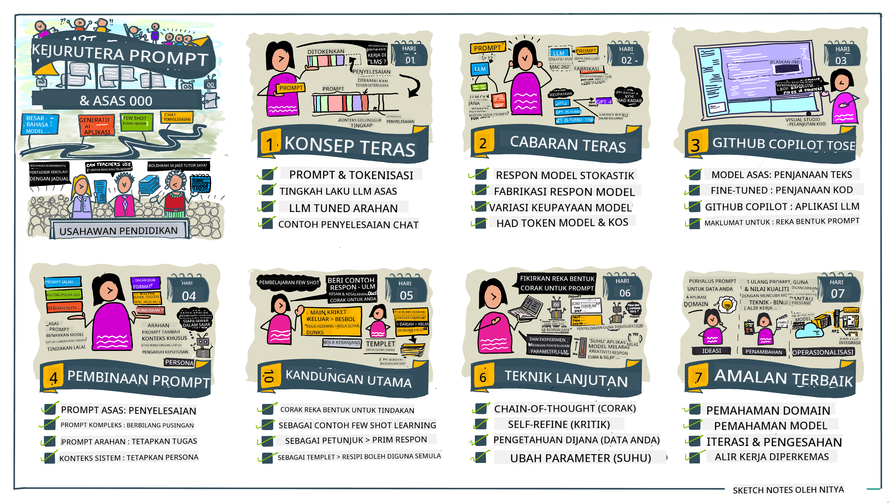
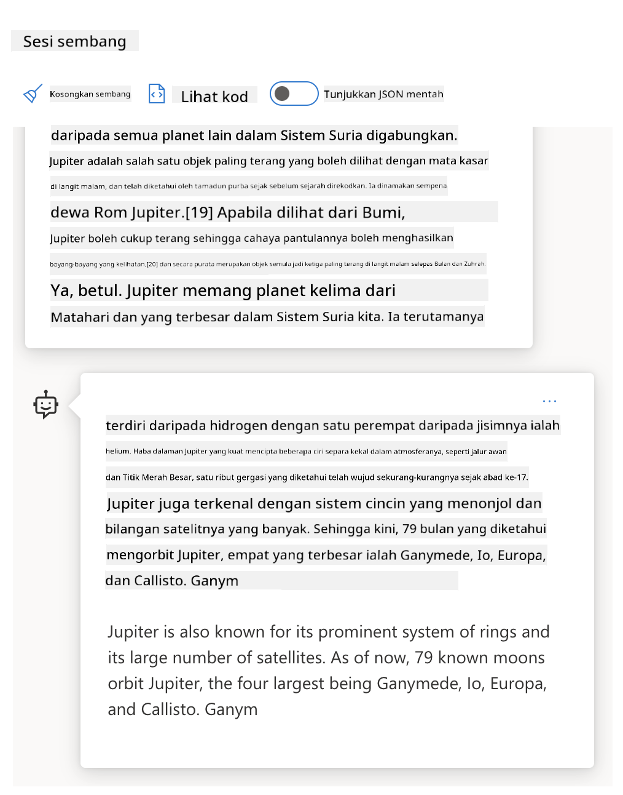
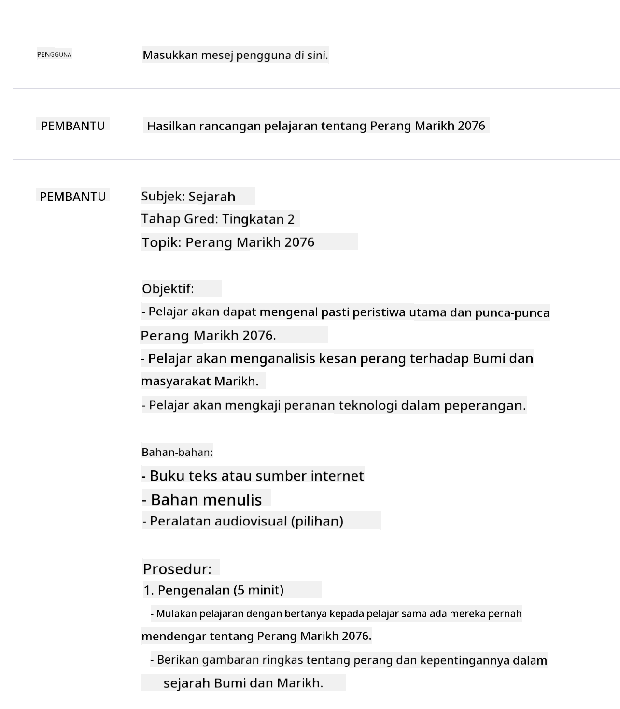

<!--
CO_OP_TRANSLATOR_METADATA:
{
  "original_hash": "8b3cb38518cf4fe7714d2f5e74dfa3eb",
  "translation_date": "2025-10-03T09:59:51+00:00",
  "source_file": "04-prompt-engineering-fundamentals/README.md",
  "language_code": "ms"
}
-->
# Asas Kejuruteraan Prompt

[](https://aka.ms/gen-ai-lesson4-gh?WT.mc_id=academic-105485-koreyst)

## Pengenalan
Modul ini merangkumi konsep dan teknik penting untuk mencipta prompt yang berkesan dalam model AI generatif. Cara anda menulis prompt kepada LLM juga memainkan peranan. Prompt yang direka dengan teliti boleh menghasilkan respons yang lebih berkualiti. Tetapi apa sebenarnya maksud istilah seperti _prompt_ dan _kejuruteraan prompt_? Dan bagaimana saya boleh memperbaiki input _prompt_ yang saya hantar kepada LLM? Ini adalah soalan yang akan kita cuba jawab dalam bab ini dan bab seterusnya.

_AI generatif_ mampu mencipta kandungan baharu (contohnya, teks, imej, audio, kod, dll.) sebagai respons kepada permintaan pengguna. Ia mencapai ini menggunakan _Model Bahasa Besar_ seperti siri GPT ("Generative Pre-trained Transformer") OpenAI yang dilatih untuk menggunakan bahasa semula jadi dan kod.

Pengguna kini boleh berinteraksi dengan model ini menggunakan paradigma yang biasa seperti sembang, tanpa memerlukan kepakaran teknikal atau latihan. Model ini adalah berasaskan _prompt_ - pengguna menghantar input teks (prompt) dan menerima respons AI (penyelesaian). Mereka kemudian boleh "bersembang dengan AI" secara berulang, dalam perbualan berbilang giliran, memperhalusi prompt mereka sehingga respons memenuhi jangkaan mereka.

"Prompt" kini menjadi antara muka _pengaturcaraan utama_ untuk aplikasi AI generatif, memberitahu model apa yang perlu dilakukan dan mempengaruhi kualiti respons yang dikembalikan. "Kejuruteraan Prompt" adalah bidang kajian yang berkembang pesat yang memberi tumpuan kepada _reka bentuk dan pengoptimuman_ prompt untuk memberikan respons yang konsisten dan berkualiti pada skala besar.

## Matlamat Pembelajaran

Dalam pelajaran ini, kita akan belajar apa itu Kejuruteraan Prompt, mengapa ia penting, dan bagaimana kita boleh mencipta prompt yang lebih berkesan untuk model dan objektif aplikasi tertentu. Kita akan memahami konsep asas dan amalan terbaik untuk kejuruteraan prompt - dan belajar tentang persekitaran "sandbox" interaktif Jupyter Notebooks di mana kita boleh melihat konsep ini diterapkan pada contoh sebenar.

Pada akhir pelajaran ini, kita akan dapat:

1. Menerangkan apa itu kejuruteraan prompt dan mengapa ia penting.
2. Menghuraikan komponen prompt dan bagaimana ia digunakan.
3. Mempelajari amalan terbaik dan teknik untuk kejuruteraan prompt.
4. Menerapkan teknik yang dipelajari pada contoh sebenar, menggunakan endpoint OpenAI.

## Istilah Utama

Kejuruteraan Prompt: Amalan mereka bentuk dan memperhalusi input untuk membimbing model AI menghasilkan output yang diinginkan.  
Tokenisasi: Proses menukar teks kepada unit yang lebih kecil, dipanggil token, yang boleh difahami dan diproses oleh model.  
LLM Ditala Arahan: Model Bahasa Besar (LLM) yang telah ditala dengan arahan khusus untuk meningkatkan ketepatan dan relevansi respons mereka.

## Sandbox Pembelajaran

Kejuruteraan prompt pada masa ini lebih kepada seni daripada sains. Cara terbaik untuk meningkatkan intuisi kita mengenainya adalah dengan _berlatih lebih banyak_ dan mengamalkan pendekatan cuba-jaya yang menggabungkan kepakaran domain aplikasi dengan teknik yang disyorkan dan pengoptimuman khusus model.

Jupyter Notebook yang disertakan dengan pelajaran ini menyediakan persekitaran _sandbox_ di mana anda boleh mencuba apa yang anda pelajari - semasa anda belajar atau sebagai sebahagian daripada cabaran kod di akhir. Untuk melaksanakan latihan, anda akan memerlukan:

1. **Kunci API Azure OpenAI** - endpoint perkhidmatan untuk LLM yang telah dikerahkan.  
2. **Runtime Python** - di mana Notebook boleh dilaksanakan.  
3. **Pemboleh ubah Persekitaran Tempatan** - _selesaikan langkah [SETUP](./../00-course-setup/02-setup-local.md?WT.mc_id=academic-105485-koreyst) sekarang untuk bersedia_.  

Notebook ini dilengkapi dengan latihan _permulaan_ - tetapi anda digalakkan untuk menambah bahagian _Markdown_ (penerangan) dan _Kod_ (permintaan prompt) anda sendiri untuk mencuba lebih banyak contoh atau idea - dan membina intuisi anda untuk reka bentuk prompt.

## Panduan Bergambar

Ingin mendapatkan gambaran besar tentang apa yang diliputi dalam pelajaran ini sebelum anda mendalami? Lihat panduan bergambar ini, yang memberikan anda gambaran tentang topik utama yang diliputi dan perkara penting untuk difikirkan dalam setiap satu. Peta jalan pelajaran membawa anda dari memahami konsep asas dan cabaran kepada menangani mereka dengan teknik kejuruteraan prompt yang relevan dan amalan terbaik. Perhatikan bahawa bahagian "Teknik Lanjutan" dalam panduan ini merujuk kepada kandungan yang diliputi dalam bab _seterusnya_ kurikulum ini.



## Misi Permulaan Kami

Sekarang, mari kita bincangkan bagaimana _topik ini_ berkaitan dengan misi permulaan kami untuk [membawa inovasi AI ke dalam pendidikan](https://educationblog.microsoft.com/2023/06/collaborating-to-bring-ai-innovation-to-education?WT.mc_id=academic-105485-koreyst). Kami ingin membina aplikasi pembelajaran _peribadi_ yang dikuasakan oleh AI - jadi mari kita fikirkan bagaimana pengguna yang berbeza dalam aplikasi kami mungkin "mereka bentuk" prompt:

- **Pentadbir** mungkin meminta AI untuk _menganalisis data kurikulum untuk mengenal pasti jurang liputan_. AI boleh meringkaskan hasil atau memvisualisasikannya dengan kod.  
- **Pendidik** mungkin meminta AI untuk _menghasilkan rancangan pelajaran untuk audiens dan topik sasaran_. AI boleh membina rancangan peribadi dalam format yang ditentukan.  
- **Pelajar** mungkin meminta AI untuk _mengajar mereka dalam subjek yang sukar_. AI kini boleh membimbing pelajar dengan pelajaran, petunjuk & contoh yang disesuaikan dengan tahap mereka.  

Itu hanya permulaan. Lihat [Prompts For Education](https://github.com/microsoft/prompts-for-edu/tree/main?WT.mc_id=academic-105485-koreyst) - perpustakaan prompt sumber terbuka yang dikurasi oleh pakar pendidikan - untuk mendapatkan gambaran yang lebih luas tentang kemungkinan! _Cuba jalankan beberapa prompt tersebut dalam sandbox atau menggunakan OpenAI Playground untuk melihat apa yang berlaku!_

<!--
TEMPLATE PELAJARAN:
Unit ini harus merangkumi konsep asas #1.
Perkuatkan konsep dengan contoh dan rujukan.

KONSEP #1:
Kejuruteraan Prompt.
Definisikan dan terangkan mengapa ia diperlukan.
-->

## Apa itu Kejuruteraan Prompt?

Kami memulakan pelajaran ini dengan mendefinisikan **Kejuruteraan Prompt** sebagai proses _mereka bentuk dan mengoptimumkan_ input teks (prompt) untuk memberikan respons yang konsisten dan berkualiti (penyelesaian) untuk objektif aplikasi dan model tertentu. Kita boleh menganggap ini sebagai proses 2 langkah:

- _mereka bentuk_ prompt awal untuk model dan objektif tertentu  
- _memperhalusi_ prompt secara berulang untuk meningkatkan kualiti respons  

Ini semestinya proses cuba-jaya yang memerlukan intuisi dan usaha pengguna untuk mendapatkan hasil yang optimum. Jadi mengapa ia penting? Untuk menjawab soalan itu, kita perlu memahami tiga konsep:

- _Tokenisasi_ = bagaimana model "melihat" prompt  
- _Base LLMs_ = bagaimana model asas "memproses" prompt  
- _LLM Ditala Arahan_ = bagaimana model kini boleh melihat "tugas"  

### Tokenisasi

LLM melihat prompt sebagai _urutan token_ di mana model yang berbeza (atau versi model) boleh men-tokenkan prompt yang sama dengan cara yang berbeza. Oleh kerana LLM dilatih pada token (dan bukan pada teks mentah), cara prompt ditokenkan mempunyai kesan langsung pada kualiti respons yang dihasilkan.

Untuk mendapatkan intuisi tentang bagaimana tokenisasi berfungsi, cuba alat seperti [OpenAI Tokenizer](https://platform.openai.com/tokenizer?WT.mc_id=academic-105485-koreyst) yang ditunjukkan di bawah. Salin prompt anda - dan lihat bagaimana ia ditukar kepada token, dengan memberi perhatian kepada bagaimana watak ruang kosong dan tanda baca dikendalikan. Perhatikan bahawa contoh ini menunjukkan LLM lama (GPT-3) - jadi mencuba ini dengan model yang lebih baru mungkin menghasilkan hasil yang berbeza.


### Konsep: Model Asas

Setelah prompt ditokenkan, fungsi utama ["Base LLM"](https://blog.gopenai.com/an-introduction-to-base-and-instruction-tuned-large-language-models-8de102c785a6?WT.mc_id=academic-105485-koreyst) (atau model asas) adalah untuk meramalkan token dalam urutan tersebut. Oleh kerana LLM dilatih pada dataset teks yang besar, mereka mempunyai pemahaman yang baik tentang hubungan statistik antara token dan boleh membuat ramalan tersebut dengan keyakinan tertentu. Perhatikan bahawa mereka tidak memahami _makna_ perkataan dalam prompt atau token; mereka hanya melihat pola yang boleh mereka "lengkapkan" dengan ramalan seterusnya. Mereka boleh terus meramalkan urutan sehingga dihentikan oleh campur tangan pengguna atau beberapa syarat yang telah ditetapkan.

Ingin melihat bagaimana penyelesaian berasaskan prompt berfungsi? Masukkan prompt di atas ke dalam Azure OpenAI Studio [_Chat Playground_](https://oai.azure.com/playground?WT.mc_id=academic-105485-koreyst) dengan tetapan lalai. Sistem dikonfigurasikan untuk menganggap prompt sebagai permintaan maklumat - jadi anda sepatutnya melihat penyelesaian yang memenuhi konteks ini.

Tetapi bagaimana jika pengguna ingin melihat sesuatu yang spesifik yang memenuhi beberapa kriteria atau objektif tugas? Di sinilah _LLM ditala arahan_ memainkan peranan.



### Konsep: LLM Ditala Arahan

[LLM Ditala Arahan](https://blog.gopenai.com/an-introduction-to-base-and-instruction-tuned-large-language-models-8de102c785a6?WT.mc_id=academic-105485-koreyst) bermula dengan model asas dan menala halusnya dengan contoh atau pasangan input/output (contohnya, "mesej" berbilang giliran) yang boleh mengandungi arahan yang jelas - dan respons daripada AI cuba mengikuti arahan tersebut.

Ini menggunakan teknik seperti Pembelajaran Pengukuhan dengan Maklum Balas Manusia (RLHF) yang boleh melatih model untuk _mengikuti arahan_ dan _belajar daripada maklum balas_ supaya ia menghasilkan respons yang lebih sesuai untuk aplikasi praktikal dan lebih relevan dengan objektif pengguna.

Mari cuba - ulangi prompt di atas, tetapi kini ubah _mesej sistem_ untuk memberikan arahan berikut sebagai konteks:

> _Ringkaskan kandungan yang diberikan untuk pelajar darjah dua. Kekalkan hasil kepada satu perenggan dengan 3-5 poin utama._

Lihat bagaimana hasilnya kini disesuaikan untuk mencerminkan matlamat dan format yang diinginkan? Seorang pendidik kini boleh menggunakan respons ini secara langsung dalam slaid untuk kelas tersebut.


## Mengapa kita memerlukan Kejuruteraan Prompt?

Sekarang kita tahu bagaimana prompt diproses oleh LLM, mari kita bincangkan _mengapa_ kita memerlukan kejuruteraan prompt. Jawapannya terletak pada fakta bahawa LLM semasa menghadapi beberapa cabaran yang menjadikan _penyelesaian yang boleh dipercayai dan konsisten_ lebih sukar dicapai tanpa usaha dalam pembinaan dan pengoptimuman prompt. Sebagai contoh:

1. **Respons model adalah stokastik.** _Prompt yang sama_ mungkin menghasilkan respons yang berbeza dengan model atau versi model yang berbeza. Dan ia mungkin menghasilkan hasil yang berbeza dengan _model yang sama_ pada masa yang berbeza. _Teknik kejuruteraan prompt boleh membantu kita meminimumkan variasi ini dengan menyediakan panduan yang lebih baik_.  

1. **Model boleh mencipta respons.** Model dilatih dengan dataset yang _besar tetapi terhad_, yang bermaksud mereka kekurangan pengetahuan tentang konsep di luar skop latihan tersebut. Akibatnya, mereka boleh menghasilkan penyelesaian yang tidak tepat, imaginasi, atau bercanggah secara langsung dengan fakta yang diketahui. _Teknik kejuruteraan prompt membantu pengguna mengenal pasti dan mengurangkan fabrikasi seperti ini contohnya, dengan meminta AI untuk rujukan atau penalaran_.  

1. **Keupayaan model akan berbeza-beza.** Model yang lebih baru atau generasi model akan mempunyai keupayaan yang lebih kaya tetapi juga membawa keunikan dan kompromi dalam kos & kerumitan. _Kejuruteraan prompt boleh membantu kita membangunkan amalan terbaik dan aliran kerja yang mengabstrakkan perbezaan dan menyesuaikan keperluan khusus model dengan cara yang boleh diskalakan dan lancar_.  

Mari lihat ini dalam tindakan di OpenAI atau Azure OpenAI Playground:

- Gunakan prompt yang sama dengan penyebaran LLM yang berbeza (contohnya, OpenAI, Azure OpenAI, Hugging Face) - adakah anda melihat variasi?  
- Gunakan prompt yang sama berulang kali dengan penyebaran LLM _yang sama_ (contohnya, Azure OpenAI Playground) - bagaimana variasi ini berbeza?  

### Contoh Fabrikasi

Dalam kursus ini, kami menggunakan istilah **"fabrikasi"** untuk merujuk kepada fenomena di mana LLM kadang-kadang menghasilkan maklumat yang tidak tepat secara fakta disebabkan oleh batasan dalam latihan mereka atau kekangan lain. Anda mungkin juga pernah mendengar ini dirujuk sebagai _"halusinasi"_ dalam artikel popular atau kertas penyelidikan. Walau bagaimanapun, kami sangat mengesyorkan menggunakan istilah _"fabrikasi"_ supaya kami tidak secara tidak sengaja mengaitkan tingkah laku manusia kepada hasil yang didorong oleh mesin. Ini juga memperkuatkan [garis panduan AI Bertanggungjawab](https://www.microsoft.com/ai/responsible-ai?WT.mc_id=academic-105485-koreyst) dari perspektif terminologi, menghapuskan istilah yang mungkin dianggap menyinggung atau tidak inklusif dalam beberapa konteks.

Ingin mendapatkan gambaran tentang bagaimana fabrikasi berfungsi? Fikirkan prompt yang mengarahkan AI untuk menghasilkan kandungan untuk topik yang tidak wujud (untuk memastikan ia tidak terdapat dalam dataset latihan). Sebagai contoh - saya mencuba prompt ini:

> **Prompt:** hasilkan rancangan pelajaran tentang Perang Martian tahun 2076.
Carian web menunjukkan bahawa terdapat kisah fiksyen (contohnya, siri televisyen atau buku) tentang peperangan di Marikh - tetapi tiada yang berlaku pada tahun 2076. Akal logik juga memberitahu kita bahawa tahun 2076 adalah _masa depan_ dan oleh itu, tidak boleh dikaitkan dengan peristiwa sebenar.

Jadi, apa yang berlaku apabila kita menggunakan arahan ini dengan penyedia LLM yang berbeza?

> **Respons 1**: OpenAI Playground (GPT-35)



> **Respons 2**: Azure OpenAI Playground (GPT-35)


> **Respons 3**: Hugging Face Chat Playground (LLama-2)


Seperti yang dijangka, setiap model (atau versi model) menghasilkan respons yang sedikit berbeza disebabkan oleh tingkah laku stokastik dan variasi keupayaan model. Sebagai contoh, satu model menyasarkan audiens gred 8 manakala yang lain menganggap audiens pelajar sekolah menengah. Tetapi ketiga-tiga model menghasilkan respons yang boleh meyakinkan pengguna yang tidak berpengetahuan bahawa peristiwa itu adalah benar.

Teknik kejuruteraan arahan seperti _metaprompting_ dan _konfigurasi suhu_ mungkin dapat mengurangkan fabrikasi model hingga tahap tertentu. Seni bina kejuruteraan arahan baharu juga menggabungkan alat dan teknik baharu secara lancar ke dalam aliran arahan, untuk mengurangkan atau mengatasi beberapa kesan ini.

## Kajian Kes: GitHub Copilot

Mari kita akhiri bahagian ini dengan memahami bagaimana kejuruteraan arahan digunakan dalam penyelesaian dunia sebenar dengan melihat satu Kajian Kes: [GitHub Copilot](https://github.com/features/copilot?WT.mc_id=academic-105485-koreyst).

GitHub Copilot adalah "Rakan Pengaturcara AI" anda - ia menukar arahan teks kepada pelengkap kod dan diintegrasikan ke dalam persekitaran pembangunan anda (contohnya, Visual Studio Code) untuk pengalaman pengguna yang lancar. Seperti yang didokumentasikan dalam siri blog di bawah, versi terawal adalah berdasarkan model OpenAI Codex - dengan jurutera dengan cepat menyedari keperluan untuk menyesuaikan model dan membangunkan teknik kejuruteraan arahan yang lebih baik, untuk meningkatkan kualiti kod. Pada bulan Julai, mereka [melancarkan model AI yang lebih baik yang melangkaui Codex](https://github.blog/2023-07-28-smarter-more-efficient-coding-github-copilot-goes-beyond-codex-with-improved-ai-model/?WT.mc_id=academic-105485-koreyst) untuk cadangan yang lebih pantas.

Baca pos-pos ini mengikut urutan untuk mengikuti perjalanan pembelajaran mereka.

- **Mei 2023** | [GitHub Copilot Semakin Baik dalam Memahami Kod Anda](https://github.blog/2023-05-17-how-github-copilot-is-getting-better-at-understanding-your-code/?WT.mc_id=academic-105485-koreyst)
- **Mei 2023** | [Di Dalam GitHub: Bekerja dengan LLM di Sebalik GitHub Copilot](https://github.blog/2023-05-17-inside-github-working-with-the-llms-behind-github-copilot/?WT.mc_id=academic-105485-koreyst).
- **Jun 2023** | [Cara Menulis Arahan yang Lebih Baik untuk GitHub Copilot](https://github.blog/2023-06-20-how-to-write-better-prompts-for-github-copilot/?WT.mc_id=academic-105485-koreyst).
- **Jul 2023** | [.. GitHub Copilot Melangkaui Codex dengan Model AI yang Lebih Baik](https://github.blog/2023-07-28-smarter-more-efficient-coding-github-copilot-goes-beyond-codex-with-improved-ai-model/?WT.mc_id=academic-105485-koreyst)
- **Jul 2023** | [Panduan Pengembang untuk Kejuruteraan Arahan dan LLM](https://github.blog/2023-07-17-prompt-engineering-guide-generative-ai-llms/?WT.mc_id=academic-105485-koreyst)
- **Sep 2023** | [Cara Membina Aplikasi LLM Perusahaan: Pelajaran dari GitHub Copilot](https://github.blog/2023-09-06-how-to-build-an-enterprise-llm-application-lessons-from-github-copilot/?WT.mc_id=academic-105485-koreyst)

Anda juga boleh melayari [Blog Kejuruteraan mereka](https://github.blog/category/engineering/?WT.mc_id=academic-105485-koreyst) untuk lebih banyak pos seperti [yang ini](https://github.blog/2023-09-27-how-i-used-github-copilot-chat-to-build-a-reactjs-gallery-prototype/?WT.mc_id=academic-105485-koreyst) yang menunjukkan bagaimana model dan teknik ini _digunakan_ untuk mendorong aplikasi dunia sebenar.

---

## Pembinaan Arahan

Kita telah melihat mengapa kejuruteraan arahan itu penting - sekarang mari kita fahami bagaimana arahan _dibina_ supaya kita dapat menilai teknik yang berbeza untuk reka bentuk arahan yang lebih berkesan.

### Arahan Asas

Mari kita mulakan dengan arahan asas: input teks yang dihantar kepada model tanpa konteks lain. Berikut adalah contoh - apabila kita menghantar beberapa perkataan pertama lagu kebangsaan AS kepada OpenAI [Completion API](https://platform.openai.com/docs/api-reference/completions?WT.mc_id=academic-105485-koreyst), ia segera _melengkapkan_ respons dengan beberapa baris seterusnya, menggambarkan tingkah laku ramalan asas.

| Arahan (Input)     | Pelengkap (Output)                                                                                                                        |
| :----------------- | :----------------------------------------------------------------------------------------------------------------------------------------- |
| Oh say can you see | Nampaknya anda sedang memulakan lirik "The Star-Spangled Banner," lagu kebangsaan Amerika Syarikat. Lirik penuh adalah ...                 |

### Arahan Kompleks

Sekarang mari kita tambahkan konteks dan arahan kepada arahan asas itu. [Chat Completion API](https://learn.microsoft.com/azure/ai-services/openai/how-to/chatgpt?WT.mc_id=academic-105485-koreyst) membolehkan kita membina arahan kompleks sebagai koleksi _mesej_ dengan:

- Pasangan input/output yang mencerminkan input _pengguna_ dan respons _pembantu_.
- Mesej sistem yang menetapkan konteks untuk tingkah laku atau personaliti pembantu.

Permintaan kini dalam bentuk di bawah, di mana _pengekodan token_ secara efektif menangkap maklumat yang relevan daripada konteks dan perbualan. Kini, mengubah konteks sistem boleh memberi kesan besar pada kualiti pelengkap, seperti input pengguna yang diberikan.

```python
response = openai.chat.completions.create(
    model="gpt-3.5-turbo",
    messages=[
        {"role": "system", "content": "You are a helpful assistant."},
        {"role": "user", "content": "Who won the world series in 2020?"},
        {"role": "assistant", "content": "The Los Angeles Dodgers won the World Series in 2020."},
        {"role": "user", "content": "Where was it played?"}
    ]
)
```

### Arahan Instruksi

Dalam contoh di atas, arahan pengguna adalah pertanyaan teks sederhana yang boleh ditafsirkan sebagai permintaan maklumat. Dengan arahan _instruksi_, kita boleh menggunakan teks itu untuk menentukan tugas dengan lebih terperinci, memberikan panduan yang lebih baik kepada AI. Berikut adalah contoh:

| Arahan (Input)                                                                                                                                                                                                                         | Pelengkap (Output)                                                                                                        | Jenis Instruksi     |
| :------------------------------------------------------------------------------------------------------------------------------------------------------------------------------------------------------------------------------------- | :------------------------------------------------------------------------------------------------------------------------- | :------------------ |
| Tulis penerangan tentang Perang Saudara                                                                                                                                                                                                | _mengembalikan perenggan sederhana_                                                                                       | Sederhana           |
| Tulis penerangan tentang Perang Saudara. Sertakan tarikh dan peristiwa penting serta terangkan kepentingannya                                                                                                                          | _mengembalikan perenggan diikuti oleh senarai tarikh peristiwa penting dengan penerangan_                                  | Kompleks            |
| Tulis penerangan tentang Perang Saudara dalam 1 perenggan. Sertakan 3 poin dengan tarikh penting dan kepentingannya. Sertakan 3 lagi poin dengan tokoh sejarah penting dan sumbangan mereka. Kembalikan output dalam format fail JSON. | _mengembalikan butiran lebih luas dalam kotak teks, diformatkan sebagai JSON yang boleh disalin-tampal ke fail dan disahkan seperti yang diperlukan_ | Kompleks. Berformat.|

## Kandungan Utama

Dalam contoh di atas, arahan masih agak terbuka, membolehkan LLM memutuskan bahagian dataset pra-latihannya yang relevan. Dengan corak reka bentuk _kandungan utama_, teks input dibahagikan kepada dua bahagian:

- arahan (tindakan)
- kandungan relevan (yang mempengaruhi tindakan)

Berikut adalah contoh di mana arahan adalah "ringkaskan ini dalam 2 ayat".

| Arahan (Input)                                                                                                                                                                                                                                                                                                                                                                                                                                                                                                                                                                                                                                                                                      | Pelengkap (Output)                                                                                                                                                                                                                                                                             |
| :-------------------------------------------------------------------------------------------------------------------------------------------------------------------------------------------------------------------------------------------------------------------------------------------------------------------------------------------------------------------------------------------------------------------------------------------------------------------------------------------------------------------------------------------------------------------------------------------------------------------------------------------------------------------------------------------------- | :---------------------------------------------------------------------------------------------------------------------------------------------------------------------------------------------------------------------------------------------------------------------------------------------- |
| Jupiter adalah planet kelima dari Matahari dan yang terbesar dalam Sistem Suria. Ia adalah gergasi gas dengan jisim satu per seribu daripada Matahari, tetapi dua setengah kali daripada semua planet lain dalam Sistem Suria digabungkan. Jupiter adalah salah satu objek paling terang yang dapat dilihat dengan mata kasar di langit malam, dan telah diketahui oleh tamadun purba sejak sebelum sejarah tercatat. Ia dinamakan sempena dewa Rom Jupiter.[19] Apabila dilihat dari Bumi, Jupiter boleh cukup terang sehingga cahaya pantulannya dapat menghasilkan bayang-bayang yang kelihatan,[20] dan secara purata adalah objek semula jadi ketiga paling terang di langit malam selepas Bulan dan Venus. <br/> **Ringkaskan ini dalam 2 ayat pendek** | Jupiter, planet kelima dari Matahari, adalah yang terbesar dalam Sistem Suria dan terkenal sebagai salah satu objek paling terang di langit malam. Dinamakan sempena dewa Rom Jupiter, ia adalah gergasi gas dengan jisim dua setengah kali daripada semua planet lain dalam Sistem Suria digabungkan. |

Segmen kandungan utama boleh digunakan dalam pelbagai cara untuk mendorong arahan yang lebih berkesan:

- **Contoh** - bukannya memberitahu model apa yang perlu dilakukan dengan arahan eksplisit, berikan contoh apa yang perlu dilakukan dan biarkan ia menyimpulkan corak.
- **Petunjuk** - ikuti arahan dengan "petunjuk" yang memulakan pelengkap, membimbing model ke arah respons yang lebih relevan.
- **Templat** - ini adalah 'resipi' berulang untuk arahan dengan tempat letak (pembolehubah) yang boleh disesuaikan dengan data untuk kes penggunaan tertentu.

Mari kita terokai ini dalam tindakan.

### Menggunakan Contoh

Ini adalah pendekatan di mana anda menggunakan kandungan utama untuk "memberi makan kepada model" beberapa contoh output yang diinginkan untuk arahan tertentu, dan biarkan ia menyimpulkan corak untuk output yang diinginkan. Berdasarkan bilangan contoh yang diberikan, kita boleh mempunyai arahan zero-shot, one-shot, few-shot, dan sebagainya.

Arahan kini terdiri daripada tiga komponen:

- Penerangan tugas
- Beberapa contoh output yang diinginkan
- Permulaan contoh baharu (yang menjadi penerangan tugas secara implisit)

| Jenis Pembelajaran | Arahan (Input)                                                                                                                                        | Pelengkap (Output)         |
| :----------------- | :---------------------------------------------------------------------------------------------------------------------------------------------------- | :-------------------------- |
| Zero-shot          | "The Sun is Shining". Terjemahkan ke Bahasa Sepanyol                                                                                                 | "El Sol está brillando".    |
| One-shot           | "The Sun is Shining" => ""El Sol está brillando". <br> "It's a Cold and Windy Day" =>                                                                 | "Es un día frío y ventoso". |
| Few-shot           | Pemain berlari di pangkalan => Baseball <br/> Pemain memukul ace => Tenis <br/> Pemain memukul enam => Kriket <br/> Pemain membuat slam-dunk =>       | Bola Keranjang              |
|                    |                                                                                                                                                       |                             |

Perhatikan bagaimana kita perlu memberikan arahan eksplisit ("Terjemahkan ke Bahasa Sepanyol") dalam arahan zero-shot, tetapi ia disimpulkan dalam contoh one-shot. Contoh few-shot menunjukkan bagaimana menambahkan lebih banyak contoh membolehkan model membuat inferens yang lebih tepat tanpa arahan tambahan.

### Petunjuk Arahan

Teknik lain untuk menggunakan kandungan utama adalah memberikan _petunjuk_ dan bukannya contoh. Dalam kes ini, kita memberikan model dorongan ke arah yang betul dengan _memulakannya_ dengan petikan yang mencerminkan format respons yang diinginkan. Model kemudian "mengambil petunjuk" untuk meneruskan dalam nada yang sama.

| Bilangan Petunjuk | Arahan (Input)                                                                                                                                                                                                                                                                                                                                                                                                                                               | Pelengkap (Output)                                                                                                                                                                                                                                                                                       |
| :--------------- | :----------------------------------------------------------------------------------------------------------------------------------------------------------------------------------------------------------------------------------------------------------------------------------------------------------------------------------------------------------------------------------------------------------------------------------------------------------- | :-------------------------------------------------------------------------------------------------------------------------------------------------------------------------------------------------------------------------------------------------------------------------------------------------------- |
| 0                | Jupiter adalah planet kelima dari Matahari dan yang terbesar dalam Sistem Suria. Ia adalah gergasi gas dengan jisim satu per seribu daripada Matahari, tetapi dua setengah kali daripada semua planet lain dalam Sistem Suria digabungkan. Jupiter adalah salah satu objek paling terang yang dapat dilihat dengan mata kasar di langit malam, dan telah diketahui oleh tamadun purba sejak sebelum sejarah tercatat. <br/>**Ringkaskan Ini**                                       | Jupiter adalah planet terbesar dalam Sistem Suria dan yang kelima dari Matahari. Ia adalah gergasi gas dengan jisim 1/1000 daripada Matahari, tetapi lebih berat daripada semua planet lain digabungkan. Tamadun purba telah lama mengetahui tentang Jupiter, dan ia mudah dilihat di langit malam. |
| 1              | Jupiter adalah planet kelima dari Matahari dan yang terbesar dalam Sistem Suria. Ia adalah gergasi gas dengan jisim satu per seribu daripada Matahari, tetapi dua setengah kali lebih besar daripada semua planet lain dalam Sistem Suria digabungkan. Jupiter adalah salah satu objek paling terang yang dapat dilihat dengan mata kasar di langit malam, dan telah diketahui oleh tamadun purba sejak sebelum sejarah direkodkan. <br/>**Ringkaskan Ini** <br/> Apa yang kita pelajari ialah Jupiter | adalah planet kelima dari Matahari dan yang terbesar dalam Sistem Suria. Ia adalah gergasi gas dengan jisim satu per seribu daripada Matahari, tetapi dua setengah kali lebih besar daripada semua planet lain digabungkan. Ia mudah dilihat dengan mata kasar dan telah diketahui sejak zaman purba.                        |
| 2              | Jupiter adalah planet kelima dari Matahari dan yang terbesar dalam Sistem Suria. Ia adalah gergasi gas dengan jisim satu per seribu daripada Matahari, tetapi dua setengah kali lebih besar daripada semua planet lain dalam Sistem Suria digabungkan. Jupiter adalah salah satu objek paling terang yang dapat dilihat dengan mata kasar di langit malam, dan telah diketahui oleh tamadun purba sejak sebelum sejarah direkodkan. <br/>**Ringkaskan Ini** <br/> 3 Fakta Utama Yang Kita Pelajari:         | 1. Jupiter adalah planet kelima dari Matahari dan yang terbesar dalam Sistem Suria. <br/> 2. Ia adalah gergasi gas dengan jisim satu per seribu daripada Matahari...<br/> 3. Jupiter telah dapat dilihat dengan mata kasar sejak zaman purba ...                                                                       |
|                |                                                                                                                                                                                                                                                                                                                                                                                                                                                              |                                                                                                                                                                                                                                                                                                           |

### Templat Prompt

Templat prompt adalah _resipi yang telah ditetapkan untuk prompt_ yang boleh disimpan dan digunakan semula apabila diperlukan, untuk memberikan pengalaman pengguna yang lebih konsisten pada skala besar. Dalam bentuk yang paling ringkas, ia hanyalah koleksi contoh prompt seperti [contoh ini dari OpenAI](https://platform.openai.com/examples?WT.mc_id=academic-105485-koreyst) yang menyediakan komponen prompt interaktif (mesej pengguna dan sistem) serta format permintaan yang didorong oleh API - untuk menyokong penggunaan semula.

Dalam bentuk yang lebih kompleks seperti [contoh ini dari LangChain](https://python.langchain.com/docs/concepts/prompt_templates/?WT.mc_id=academic-105485-koreyst) ia mengandungi _placeholder_ yang boleh digantikan dengan data dari pelbagai sumber (input pengguna, konteks sistem, sumber data luaran dll.) untuk menghasilkan prompt secara dinamik. Ini membolehkan kita mencipta perpustakaan prompt yang boleh digunakan semula untuk memberikan pengalaman pengguna yang konsisten **secara programatik** pada skala besar.

Akhirnya, nilai sebenar templat terletak pada keupayaan untuk mencipta dan menerbitkan _perpustakaan prompt_ untuk domain aplikasi vertikal - di mana templat prompt kini _dioptimumkan_ untuk mencerminkan konteks atau contoh khusus aplikasi yang menjadikan respons lebih relevan dan tepat untuk audiens pengguna yang disasarkan. Repositori [Prompts For Edu](https://github.com/microsoft/prompts-for-edu?WT.mc_id=academic-105485-koreyst) adalah contoh hebat pendekatan ini, mengumpulkan perpustakaan prompt untuk domain pendidikan dengan penekanan pada objektif utama seperti perancangan pelajaran, reka bentuk kurikulum, bimbingan pelajar dll.

## Kandungan Sokongan

Jika kita menganggap pembinaan prompt sebagai mempunyai arahan (tugas) dan sasaran (kandungan utama), maka _kandungan sekunder_ adalah seperti konteks tambahan yang kita berikan untuk **mempengaruhi output dengan cara tertentu**. Ia boleh menjadi parameter penalaan, arahan pemformatan, taksonomi topik dll. yang boleh membantu model _menyesuaikan_ responsnya agar sesuai dengan objektif atau jangkaan pengguna yang diinginkan.

Sebagai contoh: Diberikan katalog kursus dengan metadata yang luas (nama, deskripsi, tahap, tag metadata, pengajar dll.) pada semua kursus yang tersedia dalam kurikulum:

- kita boleh menentukan arahan untuk "meringkaskan katalog kursus untuk Musim Gugur 2023"
- kita boleh menggunakan kandungan utama untuk memberikan beberapa contoh output yang diinginkan
- kita boleh menggunakan kandungan sekunder untuk mengenal pasti 5 "tag" utama yang diminati.

Kini, model boleh memberikan ringkasan dalam format yang ditunjukkan oleh beberapa contoh - tetapi jika hasilnya mempunyai pelbagai tag, ia boleh memprioritaskan 5 tag yang dikenal pasti dalam kandungan sekunder.

---

<!--
TEMPLAT PELAJARAN:
Unit ini harus merangkumi konsep teras #1.
Perkuatkan konsep dengan contoh dan rujukan.

KONSEP #3:
Teknik Kejuruteraan Prompt.
Apakah beberapa teknik asas untuk kejuruteraan prompt?
Ilustrasikan dengan beberapa latihan.
-->

## Amalan Terbaik Prompting

Sekarang kita tahu bagaimana prompt boleh _dibina_, kita boleh mula memikirkan bagaimana untuk _merancang_ mereka agar mencerminkan amalan terbaik. Kita boleh memikirkannya dalam dua bahagian - mempunyai _mindset_ yang betul dan menerapkan _teknik_ yang betul.

### Mindset Kejuruteraan Prompt

Kejuruteraan Prompt adalah proses cuba dan ralat, jadi ingat tiga faktor panduan utama:

1. **Pemahaman Domain Penting.** Ketepatan dan relevansi respons adalah fungsi _domain_ di mana aplikasi atau pengguna itu beroperasi. Gunakan intuisi dan kepakaran domain anda untuk **menyesuaikan teknik** lebih lanjut. Sebagai contoh, tentukan _personaliti khusus domain_ dalam prompt sistem anda, atau gunakan _templat khusus domain_ dalam prompt pengguna anda. Berikan kandungan sekunder yang mencerminkan konteks khusus domain, atau gunakan _petunjuk dan contoh khusus domain_ untuk membimbing model ke arah pola penggunaan yang biasa.

2. **Pemahaman Model Penting.** Kita tahu model bersifat stokastik secara semula jadi. Tetapi pelaksanaan model juga boleh berbeza dari segi dataset latihan yang mereka gunakan (pengetahuan pra-latihan), kemampuan yang mereka sediakan (contohnya, melalui API atau SDK) dan jenis kandungan yang mereka dioptimumkan (contohnya, kod vs. imej vs. teks). Fahami kekuatan dan batasan model yang anda gunakan, dan gunakan pengetahuan itu untuk _memprioritaskan tugas_ atau membina _templat khusus_ yang dioptimumkan untuk kemampuan model.

3. **Iterasi & Validasi Penting.** Model berkembang dengan cepat, begitu juga teknik untuk kejuruteraan prompt. Sebagai pakar domain, anda mungkin mempunyai konteks atau kriteria lain untuk aplikasi _anda_ yang mungkin tidak berlaku kepada komuniti yang lebih luas. Gunakan alat & teknik kejuruteraan prompt untuk "memulakan" pembinaan prompt, kemudian iterasi dan validasi hasilnya menggunakan intuisi dan kepakaran domain anda sendiri. Rekodkan wawasan anda dan cipta **pangkalan pengetahuan** (contohnya, perpustakaan prompt) yang boleh digunakan sebagai asas baru oleh orang lain, untuk iterasi yang lebih cepat pada masa depan.

## Amalan Terbaik

Sekarang mari kita lihat amalan terbaik yang biasa disarankan oleh [OpenAI](https://help.openai.com/en/articles/6654000-best-practices-for-prompt-engineering-with-openai-api?WT.mc_id=academic-105485-koreyst) dan pengamal [Azure OpenAI](https://learn.microsoft.com/azure/ai-services/openai/concepts/prompt-engineering#best-practices?WT.mc_id=academic-105485-koreyst).

| Apa                               | Mengapa                                                                                                                                                                                                                                               |
| :-------------------------------- | :------------------------------------------------------------------------------------------------------------------------------------------------------------------------------------------------------------------------------------------------ |
| Menilai model terkini.            | Generasi model baru mungkin mempunyai ciri dan kualiti yang lebih baik - tetapi juga mungkin menanggung kos yang lebih tinggi. Nilai mereka untuk impak, kemudian buat keputusan migrasi.                                                                                |
| Pisahkan arahan & konteks         | Periksa jika model/pembekal anda menentukan _pemisah_ untuk membezakan arahan, kandungan utama dan sekunder dengan lebih jelas. Ini boleh membantu model memberikan berat lebih tepat kepada token.                                                         |
| Bersikap spesifik dan jelas       | Berikan lebih banyak butiran tentang konteks, hasil, panjang, format, gaya dll. yang diinginkan. Ini akan meningkatkan kualiti dan konsistensi respons. Tangkap resipi dalam templat yang boleh digunakan semula.                                                          |
| Bersifat deskriptif, gunakan contoh | Model mungkin bertindak balas lebih baik kepada pendekatan "tunjuk dan ceritakan". Mulakan dengan pendekatan `zero-shot` di mana anda memberikannya arahan (tetapi tiada contoh) kemudian cuba `few-shot` sebagai penambahbaikan, memberikan beberapa contoh output yang diinginkan. Gunakan analogi. |
| Gunakan petunjuk untuk memulakan penyelesaian | Dorong ia ke arah hasil yang diinginkan dengan memberikannya beberapa kata atau frasa awal yang boleh digunakan sebagai permulaan untuk respons.                                                                                                               |
| Ulangi                           | Kadang-kadang anda mungkin perlu mengulang arahan kepada model. Berikan arahan sebelum dan selepas kandungan utama anda, gunakan arahan dan petunjuk, dll. Iterasi & validasi untuk melihat apa yang berkesan.                                                         |
| Susunan Penting                  | Susunan di mana anda menyampaikan maklumat kepada model mungkin mempengaruhi output, bahkan dalam contoh pembelajaran, berkat bias kebaruan. Cuba pilihan yang berbeza untuk melihat apa yang terbaik.                                                               |
| Berikan model "keluar"           | Berikan model respons penyelesaian _fallback_ yang boleh disediakan jika ia tidak dapat menyelesaikan tugas atas sebarang sebab. Ini boleh mengurangkan peluang model menghasilkan respons palsu atau rekaan.                                                         |
|                                   |                                                                                                                                                                                                                                                   |

Seperti mana-mana amalan terbaik, ingat bahawa _hasil anda mungkin berbeza_ berdasarkan model, tugas dan domain. Gunakan ini sebagai titik permulaan, dan iterasi untuk mencari apa yang terbaik untuk anda. Sentiasa menilai semula proses kejuruteraan prompt anda apabila model dan alat baru tersedia, dengan fokus pada skalabilitas proses dan kualiti respons.

<!--
TEMPLAT PELAJARAN:
Unit ini harus menyediakan cabaran kod jika berkenaan

CABARAN:
Pautkan ke Jupyter Notebook dengan hanya komen kod dalam arahan (bahagian kod kosong).

PENYELESAIAN:
Pautkan ke salinan Notebook itu dengan prompt diisi dan dijalankan, menunjukkan satu contoh yang boleh digunakan.
-->

## Tugasan

Tahniah! Anda telah sampai ke penghujung pelajaran! Kini tiba masanya untuk menguji beberapa konsep dan teknik tersebut dengan contoh sebenar!

Untuk tugasan kami, kami akan menggunakan Jupyter Notebook dengan latihan yang boleh anda selesaikan secara interaktif. Anda juga boleh memperluaskan Notebook dengan sel Markdown dan Kod anda sendiri untuk meneroka idea dan teknik secara bebas.

### Untuk memulakan, fork repo, kemudian

- (Disarankan) Lancarkan GitHub Codespaces
- (Alternatif) Clone repo ke peranti tempatan anda dan gunakan dengan Docker Desktop
- (Alternatif) Buka Notebook dengan persekitaran runtime Notebook pilihan anda.

### Seterusnya, konfigurasikan pembolehubah persekitaran anda

- Salin fail `.env.copy` di root repo ke `.env` dan isi nilai `AZURE_OPENAI_API_KEY`, `AZURE_OPENAI_ENDPOINT` dan `AZURE_OPENAI_DEPLOYMENT`. Kembali ke [bahagian Learning Sandbox](../../../04-prompt-engineering-fundamentals/04-prompt-engineering-fundamentals) untuk belajar bagaimana.

### Seterusnya, buka Jupyter Notebook

- Pilih kernel runtime. Jika menggunakan pilihan 1 atau 2, hanya pilih kernel Python 3.10.x lalai yang disediakan oleh dev container.

Anda sudah bersedia untuk menjalankan latihan. Perhatikan bahawa tiada _jawapan betul dan salah_ di sini - hanya meneroka pilihan melalui proses cuba dan ralat dan membina intuisi untuk apa yang berkesan untuk model dan domain aplikasi tertentu.

_Oleh sebab itu tiada segmen Penyelesaian Kod dalam pelajaran ini. Sebaliknya, Notebook akan mempunyai sel Markdown bertajuk "Penyelesaian Saya:" yang menunjukkan satu contoh output untuk rujukan._

 <!--
TEMPLAT PELAJARAN:
Bungkus bahagian dengan ringkasan dan sumber untuk pembelajaran kendiri.
-->

## Pemeriksaan Pengetahuan

Yang manakah merupakan prompt yang baik mengikut beberapa amalan terbaik yang munasabah?

1. Tunjukkan saya gambar kereta merah
2. Tunjukkan saya gambar kereta merah jenama Volvo dan model XC90 yang diparkir di tepi tebing dengan matahari terbenam
3. Tunjukkan saya gambar kereta merah jenama Volvo dan model XC90

A: 2, ia adalah prompt terbaik kerana memberikan butiran tentang "apa" dan masuk ke dalam spesifik (bukan sekadar kereta tetapi jenama dan model tertentu) dan ia juga menerangkan suasana keseluruhan. 3 adalah yang terbaik seterusnya kerana ia juga mengandungi banyak deskripsi.

## 🚀 Cabaran

Cuba gunakan teknik "petunjuk" dengan prompt: Lengkapkan ayat "Tunjukkan saya gambar kereta merah jenama Volvo dan ". Apa yang ia balas, dan bagaimana anda akan memperbaikinya?

## Kerja Hebat! Teruskan Pembelajaran Anda

Ingin belajar lebih lanjut tentang pelbagai konsep Kejuruteraan Prompt? Pergi ke [halaman pembelajaran berterusan](https://aka.ms/genai-collection?WT.mc_id=academic-105485-koreyst) untuk mencari sumber hebat lain tentang topik ini.

Pergi ke Pelajaran 5 di mana kita akan melihat [teknik prompting lanjutan](../05-advanced-prompts/README.md?WT.mc_id=academic-105485-koreyst)!

---

**Penafian**:  
Dokumen ini telah diterjemahkan menggunakan perkhidmatan terjemahan AI [Co-op Translator](https://github.com/Azure/co-op-translator). Walaupun kami berusaha untuk memastikan ketepatan, sila ambil perhatian bahawa terjemahan automatik mungkin mengandungi kesilapan atau ketidaktepatan. Dokumen asal dalam bahasa asalnya harus dianggap sebagai sumber yang berwibawa. Untuk maklumat yang kritikal, terjemahan manusia profesional adalah disyorkan. Kami tidak bertanggungjawab atas sebarang salah faham atau salah tafsir yang timbul daripada penggunaan terjemahan ini.