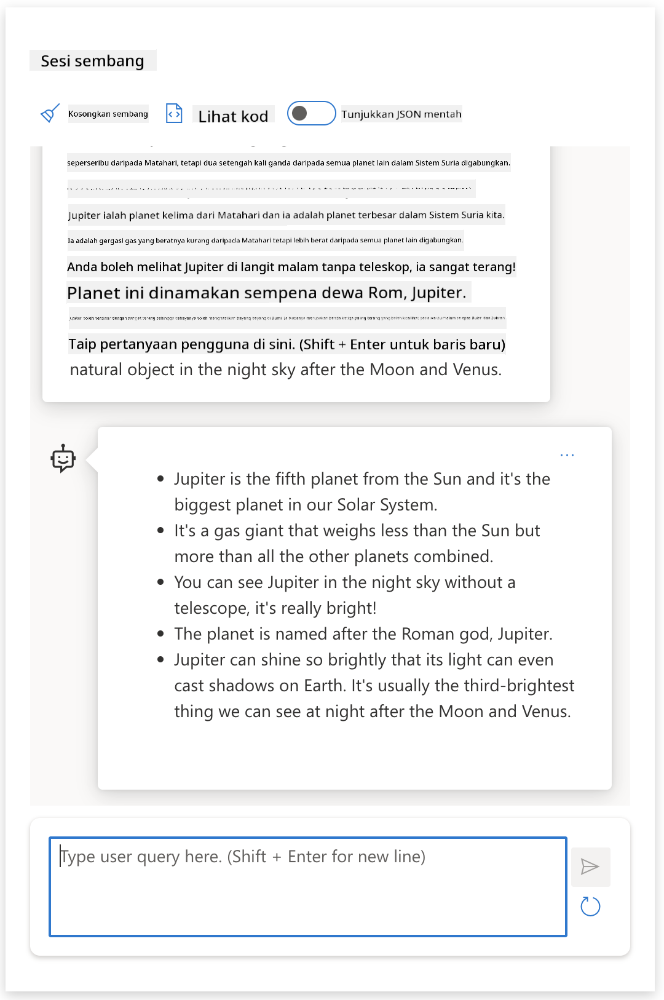
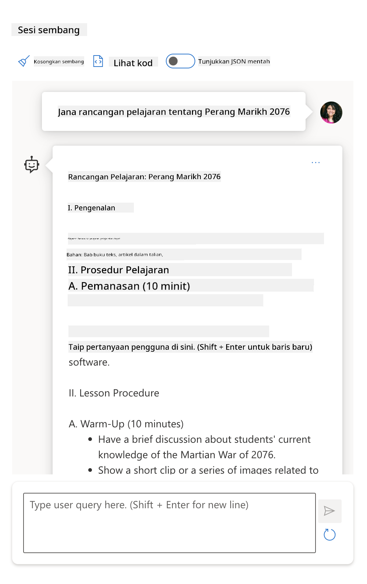

<!--
CO_OP_TRANSLATOR_METADATA:
{
  "original_hash": "dcbaaae026cb50fee071e690685b5843",
  "translation_date": "2025-08-26T18:25:28+00:00",
  "source_file": "04-prompt-engineering-fundamentals/README.md",
  "language_code": "ms"
}
-->
# Asas Kejuruteraan Prompt

[](https://aka.ms/gen-ai-lesson4-gh?WT.mc_id=academic-105485-koreyst)

## Pengenalan
Modul ini merangkumi konsep dan teknik penting untuk menghasilkan prompt yang berkesan dalam model AI generatif. Cara anda menulis prompt kepada LLM juga memainkan peranan. Prompt yang dirancang dengan teliti boleh menghasilkan respons yang lebih berkualiti. Tetapi apa sebenarnya maksud istilah seperti _prompt_ dan _kejuruteraan prompt_? Dan bagaimana saya boleh memperbaiki _input_ prompt yang saya hantar kepada LLM? Inilah persoalan yang akan kita cuba jawab dalam bab ini dan seterusnya.

_AI Generatif_ mampu mencipta kandungan baru (contohnya, teks, imej, audio, kod dan sebagainya) sebagai respons kepada permintaan pengguna. Ia menggunakan _Model Bahasa Besar_ seperti siri GPT ("Generative Pre-trained Transformer") dari OpenAI yang dilatih untuk menggunakan bahasa semula jadi dan kod.

Pengguna kini boleh berinteraksi dengan model-model ini menggunakan kaedah yang biasa seperti chat, tanpa memerlukan kepakaran teknikal atau latihan khusus. Model-model ini adalah _berasaskan prompt_ - pengguna menghantar input teks (prompt) dan menerima respons AI (completion). Mereka boleh "berbual dengan AI" secara berulang, dalam perbualan berbilang pusingan, memperhalusi prompt sehingga respons memenuhi jangkaan mereka.

"Prompt" kini menjadi _antara muka pengaturcaraan_ utama untuk aplikasi AI generatif, memberitahu model apa yang perlu dilakukan dan mempengaruhi kualiti respons yang diterima. "Kejuruteraan Prompt" ialah bidang kajian yang berkembang pesat yang memberi tumpuan kepada _reka bentuk dan pengoptimuman_ prompt untuk menghasilkan respons yang konsisten dan berkualiti secara besar-besaran.

## Objektif Pembelajaran

Dalam pelajaran ini, kita akan belajar apa itu Kejuruteraan Prompt, mengapa ia penting, dan bagaimana kita boleh menghasilkan prompt yang lebih berkesan untuk model dan objektif aplikasi tertentu. Kita akan memahami konsep asas dan amalan terbaik untuk kejuruteraan prompt - serta mengenali persekitaran "sandbox" Jupyter Notebooks interaktif di mana kita boleh melihat konsep ini digunakan pada contoh sebenar.

Pada akhir pelajaran ini, kita akan dapat:

1. Terangkan apa itu kejuruteraan prompt dan mengapa ia penting.
2. Huraikan komponen prompt dan bagaimana ia digunakan.
3. Pelajari amalan terbaik dan teknik untuk kejuruteraan prompt.
4. Gunakan teknik yang dipelajari pada contoh sebenar, menggunakan endpoint OpenAI.

## Istilah Utama

Kejuruteraan Prompt: Amalan mereka bentuk dan memperhalusi input untuk membimbing model AI menghasilkan output yang diingini.
Tokenisasi: Proses menukar teks kepada unit yang lebih kecil, dipanggil token, yang boleh difahami dan diproses oleh model.
LLM Ditala Arahan: Model Bahasa Besar (LLM) yang telah ditala dengan arahan khusus untuk meningkatkan ketepatan dan relevan respons.

## Sandbox Pembelajaran

Kejuruteraan prompt buat masa ini lebih kepada seni berbanding sains. Cara terbaik untuk meningkatkan intuisi kita ialah dengan _banyak berlatih_ dan menggunakan pendekatan cuba-jaya yang menggabungkan kepakaran domain aplikasi dengan teknik yang disyorkan serta pengoptimuman khusus model.

Jupyter Notebook yang disertakan dengan pelajaran ini menyediakan persekitaran _sandbox_ di mana anda boleh mencuba apa yang dipelajari - sama ada secara langsung atau sebagai sebahagian daripada cabaran kod di akhir. Untuk melaksanakan latihan, anda perlukan:

1. **Kunci API Azure OpenAI** - endpoint perkhidmatan untuk LLM yang telah dideploy.
2. **Runtime Python** - untuk menjalankan Notebook.
3. **Pembolehubah Persekitaran Tempatan** - _lengkapkan langkah [SETUP](./../00-course-setup/02-setup-local.md?WT.mc_id=academic-105485-koreyst) sekarang untuk bersedia_.

Notebook ini disertakan dengan latihan _permulaan_ - tetapi anda digalakkan untuk menambah bahagian _Markdown_ (penerangan) dan _Kod_ (permintaan prompt) anda sendiri untuk mencuba lebih banyak contoh atau idea - dan membina intuisi anda untuk reka bentuk prompt.

## Panduan Bergambar

Mahukan gambaran keseluruhan tentang apa yang dibincangkan dalam pelajaran ini sebelum bermula? Lihat panduan bergambar ini, yang memberi anda gambaran tentang topik utama yang dibincangkan dan perkara penting untuk difikirkan dalam setiap bahagian. Peta pelajaran ini membawa anda daripada memahami konsep dan cabaran utama kepada cara menanganinya dengan teknik kejuruteraan prompt dan amalan terbaik yang relevan. Perhatikan bahawa bahagian "Teknik Lanjutan" dalam panduan ini merujuk kepada kandungan yang akan dibincangkan dalam bab _seterusnya_ dalam kurikulum ini.


## Startup Kita

Sekarang, mari bincangkan bagaimana _topik ini_ berkait dengan misi startup kita untuk [membawa inovasi AI ke bidang pendidikan](https://educationblog.microsoft.com/2023/06/collaborating-to-bring-ai-innovation-to-education?WT.mc_id=academic-105485-koreyst). Kita ingin membina aplikasi pembelajaran _peribadi_ berkuasa AI - jadi mari fikirkan bagaimana pengguna berbeza dalam aplikasi kita mungkin "mereka bentuk" prompt:

- **Pentadbir** mungkin meminta AI untuk _menganalisis data kurikulum bagi mengenal pasti jurang liputan_. AI boleh meringkaskan hasil atau memvisualisasikannya dengan kod.
- **Pendidik** mungkin meminta AI untuk _menjana rancangan pelajaran untuk audiens dan topik tertentu_. AI boleh membina rancangan peribadi dalam format yang ditetapkan.
- **Pelajar** mungkin meminta AI untuk _membimbing mereka dalam subjek yang sukar_. AI kini boleh membimbing pelajar dengan pelajaran, petunjuk & contoh yang disesuaikan dengan tahap mereka.

Itu baru permulaan. Lihat [Prompts For Education](https://github.com/microsoft/prompts-for-edu/tree/main?WT.mc_id=academic-105485-koreyst) - pustaka prompt sumber terbuka yang dikurasi oleh pakar pendidikan - untuk gambaran lebih luas tentang kemungkinan yang ada! _Cuba jalankan beberapa prompt tersebut dalam sandbox atau gunakan OpenAI Playground untuk lihat hasilnya!_

<!--
TEMPLAT PELAJARAN:
Unit ini perlu merangkumi konsep teras #1.
Perkukuhkan konsep dengan contoh dan rujukan.

KONSEP #1:
Kejuruteraan Prompt.
Definisikan dan terangkan mengapa ia diperlukan.
-->

## Apa itu Kejuruteraan Prompt?

Kita mulakan pelajaran ini dengan mendefinisikan **Kejuruteraan Prompt** sebagai proses _mereka bentuk dan mengoptimumkan_ input teks (prompt) untuk menghasilkan respons yang konsisten dan berkualiti (completion) bagi objektif aplikasi dan model tertentu. Kita boleh anggap ini sebagai proses 2 langkah:

- _mereka bentuk_ prompt awal untuk model dan objektif tertentu
- _memperhalusi_ prompt secara berulang untuk meningkatkan kualiti respons

Ini sememangnya proses cuba-jaya yang memerlukan intuisi dan usaha pengguna untuk mendapatkan hasil optimum. Jadi, mengapa ia penting? Untuk menjawab soalan itu, kita perlu faham tiga konsep:

- _Tokenisasi_ = bagaimana model "melihat" prompt
- _LLM Asas_ = bagaimana model asas "memproses" prompt
- _LLM Ditala Arahan_ = bagaimana model kini boleh melihat "tugas"

### Tokenisasi

LLM melihat prompt sebagai _urutan token_ di mana model berbeza (atau versi model) boleh men-token-kan prompt yang sama dengan cara yang berbeza. Oleh kerana LLM dilatih menggunakan token (bukan teks mentah), cara prompt ditokenkan memberi kesan langsung kepada kualiti respons yang dijana.

Untuk mendapatkan intuisi tentang cara tokenisasi berfungsi, cuba alat seperti [OpenAI Tokenizer](https://platform.openai.com/tokenizer?WT.mc_id=academic-105485-koreyst) yang ditunjukkan di bawah. Salin prompt anda - dan lihat bagaimana ia ditukar kepada token, perhatikan bagaimana aksara ruang kosong dan tanda baca dikendalikan. Perlu diingat contoh ini menunjukkan LLM lama (GPT-3) - jadi mencuba dengan model lebih baru mungkin menghasilkan keputusan berbeza.


### Konsep: Model Asas

Selepas prompt ditokenkan, fungsi utama ["LLM Asas"](https://blog.gopenai.com/an-introduction-to-base-and-instruction-tuned-large-language-models-8de102c785a6?WT.mc_id=academic-105485-koreyst) (atau model asas) ialah meramal token dalam urutan tersebut. Oleh kerana LLM dilatih dengan set data teks yang sangat besar, mereka mempunyai pemahaman statistik yang baik antara token dan boleh membuat ramalan dengan yakin. Perlu diingat mereka tidak memahami _makna_ perkataan dalam prompt atau token; mereka hanya melihat corak yang boleh "dilengkapkan" dengan ramalan seterusnya. Mereka boleh terus meramal urutan sehingga dihentikan oleh pengguna atau syarat yang telah ditetapkan.

Mahukan gambaran bagaimana completion berasaskan prompt berfungsi? Masukkan prompt di atas ke dalam [_Chat Playground_](https://oai.azure.com/playground?WT.mc_id=academic-105485-koreyst) Azure OpenAI Studio dengan tetapan lalai. Sistem dikonfigurasikan untuk menganggap prompt sebagai permintaan maklumat - jadi anda akan lihat completion yang memenuhi konteks ini.

Tetapi bagaimana jika pengguna mahu sesuatu yang spesifik yang memenuhi kriteria atau objektif tugas tertentu? Di sinilah LLM _ditala arahan_ memainkan peranan.


### Konsep: LLM Ditala Arahan

[LLM Ditala Arahan](https://blog.gopenai.com/an-introduction-to-base-and-instruction-tuned-large-language-models-8de102c785a6?WT.mc_id=academic-105485-koreyst) bermula dengan model asas dan menala dengan contoh atau pasangan input/output (contohnya, "mesej" berbilang pusingan) yang mengandungi arahan jelas - dan respons AI cuba mengikuti arahan tersebut.

Ini menggunakan teknik seperti Reinforcement Learning with Human Feedback (RLHF) yang melatih model untuk _mengikuti arahan_ dan _belajar daripada maklum balas_ supaya ia menghasilkan respons yang lebih sesuai untuk aplikasi praktikal dan lebih relevan dengan objektif pengguna.

Mari cuba - ulang semula prompt di atas, tetapi kali ini tukar _mesej sistem_ untuk memberikan arahan berikut sebagai konteks:

> _Ringkaskan kandungan yang diberikan untuk pelajar darjah dua. Kekalkan hasil kepada satu perenggan dengan 3-5 poin utama._

Lihat bagaimana hasilnya kini ditala untuk mencerminkan matlamat dan format yang diingini? Seorang pendidik kini boleh terus menggunakan respons ini dalam slaid kelas mereka.



## Kenapa kita perlukan Kejuruteraan Prompt?

Sekarang kita tahu bagaimana prompt diproses oleh LLM, mari bincangkan _mengapa_ kita perlukan kejuruteraan prompt. Jawapannya terletak pada hakikat bahawa LLM semasa mempunyai beberapa cabaran yang menjadikan _completion yang boleh dipercayai dan konsisten_ sukar dicapai tanpa usaha dalam pembinaan dan pengoptimuman prompt. Contohnya:

1. **Respons model adalah stokastik.** _Prompt yang sama_ mungkin menghasilkan respons berbeza dengan model atau versi model yang berlainan. Malah, ia boleh menghasilkan keputusan berbeza dengan _model yang sama_ pada masa berlainan. _Teknik kejuruteraan prompt boleh membantu kita meminimumkan variasi ini dengan menyediakan panduan yang lebih baik_.

1. **Model boleh mereka-reka respons.** Model dilatih dengan set data yang _besar tetapi terhad_, bermakna mereka tidak tahu tentang konsep di luar skop latihan tersebut. Akibatnya, mereka boleh menghasilkan completion yang tidak tepat, rekaan, atau bercanggah dengan fakta yang diketahui. _Teknik kejuruteraan prompt membantu pengguna mengenal pasti dan mengurangkan rekaan seperti ini, contohnya dengan meminta AI memberikan rujukan atau penjelasan_.

1. **Keupayaan model berbeza-beza.** Model baru atau generasi model akan mempunyai keupayaan lebih luas tetapi juga membawa keunikan dan kompromi dari segi kos & kerumitan. _Kejuruteraan prompt boleh membantu kita membangunkan amalan terbaik dan aliran kerja yang mengabstrak perbezaan dan menyesuaikan keperluan khusus model dengan cara yang berskala dan lancar_.

Mari lihat ini secara langsung dalam OpenAI atau Azure OpenAI Playground:

- Gunakan prompt yang sama dengan deployment LLM berbeza (contohnya, OpenAI, Azure OpenAI, Hugging Face) - adakah anda nampak variasi?
- Gunakan prompt yang sama berulang kali dengan deployment LLM _yang sama_ (contohnya, Azure OpenAI playground) - bagaimana variasi ini berbeza?

### Contoh Rekaan

Dalam kursus ini, kita gunakan istilah **"rekaan"** untuk merujuk fenomena di mana LLM kadang-kadang menghasilkan maklumat yang tidak tepat kerana had latihan atau kekangan lain. Anda mungkin pernah dengar istilah _"halusinasi"_ dalam artikel popular atau kertas kajian. Namun, kami sangat menggalakkan penggunaan istilah _"rekaan"_ supaya kita tidak secara tidak sengaja mengaitkan sifat manusia kepada hasil yang dihasilkan mesin. Ini juga selari dengan [garis panduan AI Bertanggungjawab](https://www.microsoft.com/ai/responsible-ai?WT.mc_id=academic-105485-koreyst) dari segi istilah, mengelakkan penggunaan istilah yang mungkin dianggap tidak sesuai atau tidak inklusif dalam sesetengah konteks.

Mahukan gambaran bagaimana rekaan berlaku? Fikirkan prompt yang mengarahkan AI untuk menghasilkan kandungan bagi topik yang tidak wujud (supaya ia tidak terdapat dalam set data latihan). Contohnya - saya cuba prompt ini:
> **Arahan:** hasilkan rancangan pembelajaran tentang Perang Marikh tahun 2076.

# Rancangan Pembelajaran: Perang Marikh 2076

## Objektif Pembelajaran
- Memahami punca dan kesan Perang Marikh 2076.
- Mengenal pasti pihak-pihak yang terlibat dan strategi utama yang digunakan.
- Menganalisis impak perang terhadap masyarakat Marikh dan Bumi.

## Pengenalan
Perang Marikh 2076 merupakan konflik besar antara koloni manusia di Marikh dan beberapa negara di Bumi. Perang ini tercetus akibat persaingan sumber, isu politik, dan keinginan untuk kemerdekaan Marikh.

## Aktiviti 1: Latar Belakang Sejarah
- Bincangkan perkembangan koloni manusia di Marikh sejak tahun 2050.
- Terangkan hubungan antara koloni Marikh dan kerajaan di Bumi sebelum perang bermula.

## Aktiviti 2: Punca Perang
- Kenal pasti faktor utama yang mencetuskan konflik, seperti perebutan air, teknologi, dan hak autonomi.
- Bincangkan peranan organisasi seperti United Earth Federation dan Martian Council.

## Aktiviti 3: Kronologi Perang
- Susun peristiwa penting dari permulaan hingga tamat perang.
- Gunakan garis masa untuk membantu pelajar memahami urutan kejadian.

## Aktiviti 4: Strategi dan Teknologi
- Terangkan teknologi ketenteraan yang digunakan, seperti robot tempur dan sistem pertahanan laser.
- Bincangkan strategi peperangan di persekitaran Marikh yang unik.

## Aktiviti 5: Kesan Perang
- Analisis impak sosial, ekonomi, dan politik terhadap penduduk Marikh dan Bumi.
- Bincangkan perubahan dalam hubungan antara dua planet selepas perang.

## Penutup
- Rumuskan pengajaran yang boleh diambil daripada Perang Marikh 2076.
- Galakkan pelajar berbincang tentang cara mengelakkan konflik serupa pada masa depan.

## Penilaian
- Kuiz tentang fakta utama Perang Marikh 2076.
- Tugasan esei: "Bagaimana Perang Marikh 2076 mengubah masa depan manusia?"

## Sumber
- Buku teks sejarah interplanetari
- Artikel jurnal mengenai konflik Marikh-Bumi
- Dokumentari video tentang Perang Marikh 2076
Carian web menunjukkan bahawa terdapat kisah fiksyen (contohnya, siri televisyen atau buku) tentang peperangan di Marikh - tetapi tiada yang berlaku pada tahun 2076. Logik juga memberitahu kita bahawa tahun 2076 adalah _masa depan_ dan oleh itu, tidak boleh dikaitkan dengan peristiwa sebenar.

Jadi, apa yang berlaku apabila kita jalankan arahan ini dengan penyedia LLM yang berbeza?

> **Respons 1**: OpenAI Playground (GPT-35)


> **Respons 2**: Azure OpenAI Playground (GPT-35)



> **Respons 3**: : Hugging Face Chat Playground (LLama-2)


Seperti dijangka, setiap model (atau versi model) menghasilkan respons yang sedikit berbeza disebabkan oleh kelakuan stokastik dan variasi keupayaan model. Sebagai contoh, satu model mensasarkan penonton pelajar darjah 8 manakala satu lagi menganggap pelajar sekolah menengah. Tetapi ketiga-tiga model ini menghasilkan respons yang boleh meyakinkan pengguna yang tidak tahu bahawa peristiwa itu benar-benar berlaku.

Teknik kejuruteraan prompt seperti _metaprompting_ dan _konfigurasi suhu_ boleh mengurangkan fabrikasi model sehingga tahap tertentu. Reka bentuk kejuruteraan prompt yang baru juga menggabungkan alat dan teknik baru secara lancar ke dalam aliran prompt, untuk mengurangkan atau mengawal kesan-kesan ini.

## Kajian Kes: GitHub Copilot

Mari kita akhiri bahagian ini dengan melihat bagaimana kejuruteraan prompt digunakan dalam penyelesaian dunia sebenar melalui satu Kajian Kes: [GitHub Copilot](https://github.com/features/copilot?WT.mc_id=academic-105485-koreyst).

GitHub Copilot ialah "Rakan Pengaturcaraan AI" anda - ia menukar arahan teks kepada pelengkap kod dan diintegrasikan ke dalam persekitaran pembangunan anda (contohnya, Visual Studio Code) untuk pengalaman pengguna yang lancar. Seperti yang didokumentasikan dalam siri blog di bawah, versi terawal adalah berdasarkan model OpenAI Codex - dengan jurutera pantas menyedari keperluan untuk menala model dan membangunkan teknik kejuruteraan prompt yang lebih baik, untuk meningkatkan kualiti kod. Pada bulan Julai, mereka [memperkenalkan model AI yang lebih baik dan melangkaui Codex](https://github.blog/2023-07-28-smarter-more-efficient-coding-github-copilot-goes-beyond-codex-with-improved-ai-model/?WT.mc_id=academic-105485-koreyst) untuk cadangan yang lebih pantas.

Baca posting mengikut urutan untuk mengikuti perjalanan pembelajaran mereka.

- **Mei 2023** | [GitHub Copilot Semakin Baik Memahami Kod Anda](https://github.blog/2023-05-17-how-github-copilot-is-getting-better-at-understanding-your-code/?WT.mc_id=academic-105485-koreyst)
- **Mei 2023** | [Di Sebalik GitHub: Bekerja dengan LLM di sebalik GitHub Copilot](https://github.blog/2023-05-17-inside-github-working-with-the-llms-behind-github-copilot/?WT.mc_id=academic-105485-koreyst).
- **Jun 2023** | [Cara Menulis Prompt yang Lebih Baik untuk GitHub Copilot](https://github.blog/2023-06-20-how-to-write-better-prompts-for-github-copilot/?WT.mc_id=academic-105485-koreyst).
- **Jul 2023** | [.. GitHub Copilot melangkaui Codex dengan model AI yang dipertingkatkan](https://github.blog/2023-07-28-smarter-more-efficient-coding-github-copilot-goes-beyond-codex-with-improved-ai-model/?WT.mc_id=academic-105485-koreyst)
- **Jul 2023** | [Panduan Pembangun untuk Kejuruteraan Prompt dan LLM](https://github.blog/2023-07-17-prompt-engineering-guide-generative-ai-llms/?WT.mc_id=academic-105485-koreyst)
- **Sep 2023** | [Cara membina aplikasi LLM perusahaan: Pengajaran dari GitHub Copilot](https://github.blog/2023-09-06-how-to-build-an-enterprise-llm-application-lessons-from-github-copilot/?WT.mc_id=academic-105485-koreyst)

Anda juga boleh melayari [blog Kejuruteraan mereka](https://github.blog/category/engineering/?WT.mc_id=academic-105485-koreyst) untuk lebih banyak posting seperti [yang ini](https://github.blog/2023-09-27-how-i-used-github-copilot-chat-to-build-a-reactjs-gallery-prototype/?WT.mc_id=academic-105485-koreyst) yang menunjukkan bagaimana model dan teknik ini _digunakan_ untuk membangunkan aplikasi dunia sebenar.

---

<!--
TEMPLAT PENGAJARAN:
Unit ini perlu merangkumi konsep teras #2.
Perkukuhkan konsep dengan contoh dan rujukan.

KONSEP #2:
Reka Bentuk Prompt.
Diterangkan dengan contoh.
-->

## Pembinaan Prompt

Kita telah lihat mengapa kejuruteraan prompt itu penting - sekarang mari fahami bagaimana prompt _dibina_ supaya kita boleh menilai pelbagai teknik untuk reka bentuk prompt yang lebih berkesan.

### Prompt Asas

Mari mulakan dengan prompt asas: input teks yang dihantar kepada model tanpa sebarang konteks lain. Berikut adalah contoh - apabila kita hantar beberapa perkataan pertama lagu kebangsaan Amerika Syarikat kepada OpenAI [Completion API](https://platform.openai.com/docs/api-reference/completions?WT.mc_id=academic-105485-koreyst) ia serta-merta _melengkapkan_ respons dengan beberapa baris seterusnya, menunjukkan tingkah laku ramalan asas.

| Prompt (Input)     | Completion (Output)                                                                                                                        |
| :----------------- | :----------------------------------------------------------------------------------------------------------------------------------------- |
| Oh say can you see | Nampaknya anda sedang memulakan lirik "The Star-Spangled Banner," lagu kebangsaan Amerika Syarikat. Lirik penuh adalah ...                |

### Prompt Kompleks

Sekarang mari tambah konteks dan arahan kepada prompt asas tadi. [Chat Completion API](https://learn.microsoft.com/azure/ai-services/openai/how-to/chatgpt?WT.mc_id=academic-105485-koreyst) membolehkan kita membina prompt kompleks sebagai koleksi _mesej_ dengan:

- Pasangan input/output yang mencerminkan input _pengguna_ dan respons _pembantu_.
- Mesej sistem yang menetapkan konteks untuk tingkah laku atau personaliti pembantu.

Permintaan kini dalam bentuk di bawah, di mana _tokenization_ secara berkesan menangkap maklumat berkaitan daripada konteks dan perbualan. Kini, menukar konteks sistem boleh memberi impak besar kepada kualiti pelengkap, sama seperti input pengguna yang diberikan.

```python
response = openai.chat.completions.create(
    model="gpt-3.5-turbo",
    messages=[
        {"role": "system", "content": "You are a helpful assistant."},
        {"role": "user", "content": "Who won the world series in 2020?"},
        {"role": "assistant", "content": "The Los Angeles Dodgers won the World Series in 2020."},
        {"role": "user", "content": "Where was it played?"}
    ]
)
```

### Prompt Arahan

Dalam contoh di atas, prompt pengguna adalah pertanyaan teks ringkas yang boleh ditafsirkan sebagai permintaan maklumat. Dengan prompt _arahan_, kita boleh gunakan teks itu untuk menentukan tugas dengan lebih terperinci, memberi panduan yang lebih baik kepada AI. Berikut adalah contoh:

| Prompt (Input)                                                                                                                                                                                                                         | Completion (Output)                                                                                                        | Instruction Type    |
| :------------------------------------------------------------------------------------------------------------------------------------------------------------------------------------------------------------------------------------- | :------------------------------------------------------------------------------------------------------------------------- | :------------------ |
| Tulis penerangan tentang Perang Saudara                                                                                                                                                                                                | _mengembalikan satu perenggan ringkas_                                                                                     | Ringkas             |
| Tulis penerangan tentang Perang Saudara. Sertakan tarikh dan peristiwa penting serta terangkan kepentingannya                                                                                                                          | _mengembalikan perenggan diikuti senarai tarikh peristiwa penting dengan penerangan_                                       | Kompleks             |
| Tulis penerangan tentang Perang Saudara dalam 1 perenggan. Sertakan 3 butir peluru dengan tarikh penting dan kepentingannya. Sertakan 3 lagi butir peluru dengan tokoh sejarah utama dan sumbangan mereka. Kembalikan output sebagai fail JSON | _mengembalikan maklumat lebih terperinci dalam kotak teks, diformat sebagai JSON yang boleh anda salin dan sahkan seperti diperlukan_ | Kompleks. Berformat. |

## Kandungan Utama

Dalam contoh di atas, prompt masih agak terbuka, membenarkan LLM menentukan bahagian mana dalam set data pra-latihannya yang relevan. Dengan corak reka bentuk _kandungan utama_, teks input dibahagikan kepada dua bahagian:

- satu arahan (tindakan)
- kandungan berkaitan (yang mempengaruhi tindakan)

Berikut adalah contoh di mana arahan ialah "ringkaskan ini dalam 2 ayat".

| Prompt (Input)                                                                                                                                                                                                                                                                                                                                                                                                                                                                                                                                                                                                                                                                                      | Completion (Output)                                                                                                                                                                                                                                                                             |
| :-------------------------------------------------------------------------------------------------------------------------------------------------------------------------------------------------------------------------------------------------------------------------------------------------------------------------------------------------------------------------------------------------------------------------------------------------------------------------------------------------------------------------------------------------------------------------------------------------------------------------------------------------------------------------------------------------- | :---------------------------------------------------------------------------------------------------------------------------------------------------------------------------------------------------------------------------------------------------------------------------------------------- |
| Jupiter ialah planet kelima dari Matahari dan yang terbesar dalam Sistem Suria. Ia ialah gergasi gas dengan jisim satu per seribu daripada Matahari, tetapi dua setengah kali ganda daripada semua planet lain dalam Sistem Suria digabungkan. Jupiter adalah antara objek paling terang yang boleh dilihat dengan mata kasar di langit malam, dan telah diketahui oleh tamadun purba sejak sebelum sejarah direkodkan. Ia dinamakan sempena dewa Rom, Jupiter.[19] Apabila dilihat dari Bumi, Jupiter boleh cukup terang sehingga cahaya pantulannya boleh menghasilkan bayang yang kelihatan,[20] dan secara purata merupakan objek semula jadi ketiga paling terang di langit malam selepas Bulan dan Zuhrah. <br/> **Ringkaskan ini dalam 2 ayat pendek** | Jupiter, planet kelima dari Matahari, ialah yang terbesar dalam Sistem Suria dan terkenal sebagai salah satu objek paling terang di langit malam. Dinamakan sempena dewa Rom Jupiter, ia ialah gergasi gas dengan jisim dua setengah kali ganda daripada semua planet lain dalam Sistem Suria digabungkan. |

Segmen kandungan utama boleh digunakan dengan pelbagai cara untuk menghasilkan arahan yang lebih berkesan:

- **Contoh** - daripada memberitahu model apa yang perlu dilakukan dengan arahan jelas, berikan contoh apa yang perlu dilakukan dan biarkan model meneka coraknya.
- **Petunjuk** - ikut arahan dengan "petunjuk" yang memulakan pelengkap, membimbing model ke arah respons yang lebih relevan.
- **Templat** - ini ialah 'resipi' prompt yang boleh diulang dengan tempat letak (pembolehubah) yang boleh disesuaikan dengan data untuk kes penggunaan tertentu.

Mari kita lihat bagaimana ia digunakan.

### Menggunakan Contoh

Ini ialah pendekatan di mana anda gunakan kandungan utama untuk "memberi makan model" beberapa contoh output yang diingini untuk satu arahan, dan biarkan model meneka corak output yang diingini. Berdasarkan bilangan contoh yang diberikan, kita boleh ada prompt zero-shot, one-shot, few-shot dan sebagainya.

Prompt kini terdiri daripada tiga komponen:

- Penerangan tugas
- Beberapa contoh output yang diingini
- Permulaan contoh baru (yang menjadi penerangan tugas secara tidak langsung)

| Jenis Pembelajaran | Prompt (Input)                                                                                                                                        | Completion (Output)         |
| :----------------- | :---------------------------------------------------------------------------------------------------------------------------------------------------- | :-------------------------- |
| Zero-shot          | "The Sun is Shining". Translate to Spanish                                                                                                            | "El Sol está brillando".    |
| One-shot           | "The Sun is Shining" => ""El Sol está brillando". <br> "It's a Cold and Windy Day" =>                                                                 | "Es un día frío y ventoso". |
| Few-shot           | The player ran the bases => Baseball <br/> The player hit an ace => Tennis <br/> The player hit a six => Cricket <br/> The player made a slam-dunk => | Basketball                  |
|                    |                                                                                                                                                       |                             |

Perhatikan bagaimana kita perlu beri arahan jelas ("Translate to Spanish") dalam prompt zero-shot, tetapi ia dapat diteka dalam contoh one-shot. Contoh few-shot menunjukkan bagaimana menambah lebih banyak contoh membolehkan model membuat tekaan yang lebih tepat tanpa arahan tambahan.

### Petunjuk Prompt

Satu lagi teknik menggunakan kandungan utama ialah memberi _petunjuk_ dan bukannya contoh. Dalam kes ini, kita memberi model dorongan ke arah yang betul dengan _memulakan_ dengan petikan yang mencerminkan format respons yang diingini. Model kemudian "mengambil petunjuk" untuk meneruskan dalam gaya yang sama.

| Bilangan Petunjuk | Prompt (Input)                                                                                                                                                                                                                                                                                                                                                                                                                                               | Completion (Output)                                                                                                                                                                                                                                                                                       |
| :---------------- | :----------------------------------------------------------------------------------------------------------------------------------------------------------------------------------------------------------------------------------------------------------------------------------------------------------------------------------------------------------------------------------------------------------------------------------------------------------- | :-------------------------------------------------------------------------------------------------------------------------------------------------------------------------------------------------------------------------------------------------------------------------------------------------------- |
| 0                 | Jupiter ialah planet kelima dari Matahari dan yang terbesar dalam Sistem Suria. Ia ialah gergasi gas dengan jisim satu per seribu daripada Matahari, tetapi dua setengah kali ganda daripada semua planet lain dalam Sistem Suria digabungkan. Jupiter adalah antara objek paling terang yang boleh dilihat dengan mata kasar di langit malam, dan telah diketahui oleh tamadun purba sejak sebelum sejarah direkodkan.

**Ringkaskan Ini**                                       | Musytari ialah planet terbesar dalam Sistem Suria kita dan yang kelima dari Matahari. Ia merupakan gergasi gas dengan jisim 1/1000 daripada Matahari, tetapi lebih berat daripada semua planet lain digabungkan. Tamadun purba telah lama mengetahui tentang Musytari, dan ia mudah dilihat di langit malam. |
| 1              | Musytari ialah planet kelima dari Matahari dan yang terbesar dalam Sistem Suria. Ia merupakan gergasi gas dengan jisim satu per seribu daripada Matahari, tetapi dua setengah kali ganda daripada semua planet lain dalam Sistem Suria digabungkan. Musytari adalah salah satu objek paling terang yang boleh dilihat dengan mata kasar di langit malam, dan telah diketahui oleh tamadun purba sejak sebelum sejarah dicatat. <br/>**Ringkaskan Ini** <br/> Apa yang kita pelajari ialah Musytari | ialah planet kelima dari Matahari dan yang terbesar dalam Sistem Suria. Ia merupakan gergasi gas dengan jisim satu per seribu daripada Matahari, tetapi dua setengah kali ganda daripada semua planet lain digabungkan. Ia mudah dilihat dengan mata kasar dan telah diketahui sejak zaman purba.                        |
| 2              | Musytari ialah planet kelima dari Matahari dan yang terbesar dalam Sistem Suria. Ia merupakan gergasi gas dengan jisim satu per seribu daripada Matahari, tetapi dua setengah kali ganda daripada semua planet lain dalam Sistem Suria digabungkan. Musytari adalah salah satu objek paling terang yang boleh dilihat dengan mata kasar di langit malam, dan telah diketahui oleh tamadun purba sejak sebelum sejarah dicatat. <br/>**Ringkaskan Ini** <br/> 3 Fakta Utama Yang Kita Pelajari:         | 1. Musytari ialah planet kelima dari Matahari dan yang terbesar dalam Sistem Suria. <br/> 2. Ia merupakan gergasi gas dengan jisim satu per seribu daripada Matahari...<br/> 3. Musytari telah dapat dilihat dengan mata kasar sejak zaman purba ...                                                                       |
|                |                                                                                                                                                                                                                                                                                                                                                                                                                                                              |                                                                                                                                                                                                                                                                                                           |

### Templat Prompt

Templat prompt ialah _resipi pra-tetap untuk prompt_ yang boleh disimpan dan digunakan semula mengikut keperluan, untuk menghasilkan pengalaman pengguna yang lebih konsisten pada skala besar. Dalam bentuk paling ringkas, ia hanyalah koleksi contoh prompt seperti [yang ini dari OpenAI](https://platform.openai.com/examples?WT.mc_id=academic-105485-koreyst) yang menyediakan kedua-dua komponen prompt interaktif (mesej pengguna dan sistem) serta format permintaan API - untuk menyokong penggunaan semula.

Dalam bentuk yang lebih kompleks seperti [contoh dari LangChain](https://python.langchain.com/docs/concepts/prompt_templates/?WT.mc_id=academic-105485-koreyst) ia mengandungi _placeholder_ yang boleh digantikan dengan data dari pelbagai sumber (input pengguna, konteks sistem, sumber data luaran dsb.) untuk menjana prompt secara dinamik. Ini membolehkan kita membina pustaka prompt boleh guna semula yang boleh digunakan untuk menghasilkan pengalaman pengguna yang konsisten **secara programatik** pada skala besar.

Akhir sekali, nilai sebenar templat terletak pada keupayaan untuk mencipta dan menerbitkan _pustaka prompt_ untuk domain aplikasi menegak - di mana templat prompt kini _dioptimumkan_ untuk mencerminkan konteks atau contoh khusus aplikasi yang menjadikan respons lebih relevan dan tepat untuk audiens pengguna yang disasarkan. Repositori [Prompts For Edu](https://github.com/microsoft/prompts-for-edu?WT.mc_id=academic-105485-koreyst) ialah contoh hebat pendekatan ini, mengumpulkan pustaka prompt untuk bidang pendidikan dengan penekanan pada objektif utama seperti perancangan pelajaran, reka bentuk kurikulum, bimbingan pelajar dan sebagainya.

## Kandungan Sokongan

Jika kita fikirkan pembinaan prompt sebagai mempunyai arahan (tugas) dan sasaran (kandungan utama), maka _kandungan sekunder_ ialah konteks tambahan yang kita berikan untuk **mempengaruhi output dengan cara tertentu**. Ia boleh jadi parameter penalaan, arahan pemformatan, taksonomi topik dan sebagainya yang boleh membantu model _menyesuaikan_ responsnya agar sesuai dengan objektif atau jangkaan pengguna.

Contohnya: Diberikan katalog kursus dengan metadata terperinci (nama, penerangan, tahap, tag metadata, pengajar dsb.) untuk semua kursus yang tersedia dalam kurikulum:

- kita boleh tetapkan arahan untuk "meringkaskan katalog kursus untuk Musim Luruh 2023"
- kita boleh gunakan kandungan utama untuk menyediakan beberapa contoh output yang diingini
- kita boleh gunakan kandungan sekunder untuk mengenal pasti 5 "tag" utama yang diminati.

Kini, model boleh memberikan ringkasan dalam format seperti contoh yang diberikan - tetapi jika satu hasil mempunyai banyak tag, ia boleh mengutamakan 5 tag yang dikenal pasti dalam kandungan sekunder.

---

<!--
TEMPLAT PELAJARAN:
Unit ini perlu merangkumi konsep teras #1.
Kukuhkan konsep dengan contoh dan rujukan.

KONSEP #3:
Teknik Kejuruteraan Prompt.
Apakah beberapa teknik asas untuk kejuruteraan prompt?
Tunjukkan dengan beberapa latihan.
-->

## Amalan Terbaik Prompting

Sekarang kita tahu bagaimana prompt boleh _dibina_, kita boleh mula memikirkan bagaimana untuk _mereka_ prompt supaya mencerminkan amalan terbaik. Kita boleh fikirkan ini dalam dua bahagian - mempunyai _mindset_ yang betul dan menggunakan _teknik_ yang sesuai.

### Mindset Kejuruteraan Prompt

Kejuruteraan Prompt ialah proses cuba dan jaya jadi ingat tiga faktor panduan utama:

1. **Fahami Domain.** Ketepatan dan kerelevanan respons bergantung pada _domain_ di mana aplikasi atau pengguna itu beroperasi. Gunakan intuisi dan kepakaran domain anda untuk **menyesuaikan teknik** dengan lebih lanjut. Contohnya, tentukan _personaliti khusus domain_ dalam prompt sistem anda, atau gunakan _templat khusus domain_ dalam prompt pengguna anda. Sediakan kandungan sekunder yang mencerminkan konteks khusus domain, atau gunakan _petunjuk dan contoh khusus domain_ untuk membimbing model ke arah corak penggunaan yang biasa.

2. **Fahami Model.** Kita tahu model bersifat stokastik. Tetapi pelaksanaan model juga boleh berbeza dari segi set data latihan yang digunakan (pengetahuan pra-latihan), keupayaan yang disediakan (cth, melalui API atau SDK) dan jenis kandungan yang dioptimumkan (cth, kod vs. imej vs. teks). Fahami kekuatan dan batasan model yang anda gunakan, dan gunakan pengetahuan itu untuk _memilih tugas_ atau membina _templat khusus_ yang dioptimumkan untuk keupayaan model.

3. **Iterasi & Pengesahan Penting.** Model berkembang dengan pantas, begitu juga teknik kejuruteraan prompt. Sebagai pakar domain, anda mungkin mempunyai konteks atau kriteria lain untuk aplikasi _anda_ yang mungkin tidak terpakai kepada komuniti umum. Gunakan alat & teknik kejuruteraan prompt untuk "memulakan" pembinaan prompt, kemudian ulang dan sahkan hasil menggunakan intuisi dan kepakaran anda sendiri. Catat penemuan anda dan bina **pangkalan pengetahuan** (cth, pustaka prompt) yang boleh digunakan sebagai asas baharu oleh orang lain, untuk iterasi lebih pantas pada masa hadapan.

## Amalan Terbaik

Sekarang mari lihat amalan terbaik yang biasa disyorkan oleh pengamal [OpenAI](https://help.openai.com/en/articles/6654000-best-practices-for-prompt-engineering-with-openai-api?WT.mc_id=academic-105485-koreyst) dan [Azure OpenAI](https://learn.microsoft.com/azure/ai-services/openai/concepts/prompt-engineering#best-practices?WT.mc_id=academic-105485-koreyst).

| Apa                              | Kenapa                                                                                                                                                                                                                                               |
| :-------------------------------- | :------------------------------------------------------------------------------------------------------------------------------------------------------------------------------------------------------------------------------------------------ |
| Nilai model terkini.       | Generasi model baharu mungkin mempunyai ciri dan kualiti yang lebih baik - tetapi juga mungkin lebih mahal. Nilai impaknya, kemudian buat keputusan migrasi.                                                                                |
| Asingkan arahan & konteks   | Semak sama ada model/pembekal anda menentukan _pemisah_ untuk membezakan arahan, kandungan utama dan kandungan sekunder dengan lebih jelas. Ini boleh membantu model memberikan berat yang lebih tepat kepada token.                                                         |
| Spesifik dan jelas             | Berikan lebih banyak butiran tentang konteks, hasil, panjang, format, gaya dsb. yang diingini. Ini akan meningkatkan kualiti dan konsistensi respons. Simpan resipi dalam templat boleh guna semula.                                                          |
| Huraikan, gunakan contoh      | Model mungkin bertindak balas lebih baik dengan pendekatan "tunjuk dan cerita". Mulakan dengan pendekatan `zero-shot` di mana anda hanya beri arahan (tanpa contoh) kemudian cuba `few-shot` sebagai penambahbaikan, dengan memberi beberapa contoh output yang diingini. Gunakan analogi. |
| Guna petunjuk untuk mulakan jawapan | Dorong model ke arah hasil yang diingini dengan memberi beberapa perkataan atau frasa permulaan yang boleh digunakan sebagai titik mula respons.                                                                                                               |
| Ulangi arahan                       | Kadang-kadang anda perlu ulang arahan kepada model. Beri arahan sebelum dan selepas kandungan utama, gunakan arahan dan petunjuk, dsb. Ulang & sahkan untuk lihat apa yang berkesan.                                                         |
| Susunan Penting                     | Susunan maklumat yang anda berikan kepada model boleh mempengaruhi output, termasuk dalam contoh pembelajaran, kerana bias kebaruan. Cuba pelbagai pilihan untuk lihat mana yang terbaik.                                                               |
| Beri model “jalan keluar”           | Beri model respons _fallback_ yang boleh digunakan jika ia tidak dapat menyiapkan tugas atas apa-apa sebab. Ini boleh mengurangkan kemungkinan model menghasilkan respons palsu atau rekaan.                                                         |
|                                   |                                                                                                                                                                                                                                                   |

Seperti mana-mana amalan terbaik, ingat bahawa _hasil anda mungkin berbeza_ bergantung pada model, tugas dan domain. Gunakan ini sebagai permulaan, dan ulang untuk cari apa yang paling sesuai untuk anda. Sentiasa nilai semula proses kejuruteraan prompt anda apabila model dan alat baharu tersedia, dengan fokus pada kebolehskalaan proses dan kualiti respons.

<!--
TEMPLAT PELAJARAN:
Unit ini perlu menyediakan cabaran kod jika sesuai

CABARAN:
Pautan ke Jupyter Notebook dengan hanya komen kod dalam arahan (bahagian kod kosong).

PENYELESAIAN:
Pautan ke salinan Notebook itu dengan prompt diisi dan dijalankan, menunjukkan satu contoh output.
-->

## Tugasan

Tahniah! Anda telah sampai ke penghujung pelajaran! Kini masa untuk menguji beberapa konsep dan teknik tersebut dengan contoh sebenar!

Untuk tugasan ini, kita akan menggunakan Jupyter Notebook dengan latihan yang boleh anda lengkapkan secara interaktif. Anda juga boleh menambah sendiri sel Markdown dan Kod dalam Notebook untuk meneroka idea dan teknik anda sendiri.

### Untuk bermula, fork repo ini, kemudian

- (Disyorkan) Lancarkan GitHub Codespaces
- (Alternatif) Klon repo ke peranti anda dan gunakan dengan Docker Desktop
- (Alternatif) Buka Notebook dengan persekitaran runtime Notebook pilihan anda.

### Seterusnya, tetapkan pembolehubah persekitaran anda

- Salin fail `.env.copy` di root repo ke `.env` dan isikan nilai `AZURE_OPENAI_API_KEY`, `AZURE_OPENAI_ENDPOINT` dan `AZURE_OPENAI_DEPLOYMENT`. Kembali ke [bahagian Learning Sandbox](../../../04-prompt-engineering-fundamentals/04-prompt-engineering-fundamentals) untuk belajar caranya.

### Seterusnya, buka Jupyter Notebook

- Pilih kernel runtime. Jika menggunakan pilihan 1 atau 2, hanya pilih kernel Python 3.10.x lalai yang disediakan oleh dev container.

Anda sudah bersedia untuk menjalankan latihan. Perlu diingat tiada jawapan _betul atau salah_ di sini - hanya meneroka pilihan secara cuba dan jaya dan membina intuisi untuk apa yang berkesan bagi model dan domain aplikasi tertentu.

_Oleh itu tiada segmen Penyelesaian Kod dalam pelajaran ini. Sebaliknya, Notebook akan mempunyai sel Markdown bertajuk "Penyelesaian Saya:" yang menunjukkan satu contoh output untuk rujukan._

 <!--
TEMPLAT PELAJARAN:
Akhiri bahagian dengan ringkasan dan sumber untuk pembelajaran kendiri.
-->

## Semakan Pengetahuan

Yang manakah antara berikut merupakan prompt yang baik mengikut beberapa amalan terbaik?

1. Tunjukkan saya imej kereta merah
2. Tunjukkan saya imej kereta merah jenama Volvo dan model XC90 yang diletakkan di tepi tebing dengan matahari terbenam
3. Tunjukkan saya imej kereta merah jenama Volvo dan model XC90

A: 2, ini adalah prompt terbaik kerana ia memberikan butiran tentang "apa" dan sangat spesifik (bukan sekadar kereta tetapi jenama dan model tertentu) dan ia juga menerangkan suasana keseluruhan. 3 adalah yang kedua terbaik kerana ia juga mengandungi banyak perincian.

## 🚀 Cabaran

Cuba gunakan teknik "petunjuk" dengan prompt: Lengkapkan ayat "Tunjukkan saya imej kereta merah jenama Volvo dan ". Apa respons yang anda dapat, dan bagaimana anda akan memperbaikinya?

## Kerja Bagus! Teruskan Pembelajaran Anda

Ingin tahu lebih lanjut tentang pelbagai konsep Kejuruteraan Prompt? Pergi ke [halaman pembelajaran lanjutan](https://aka.ms/genai-collection?WT.mc_id=academic-105485-koreyst) untuk mencari sumber hebat lain tentang topik ini.

Teruskan ke Pelajaran 5 di mana kita akan melihat [teknik prompting lanjutan](../05-advanced-prompts/README.md?WT.mc_id=academic-105485-koreyst)!

---

**Penafian**:
Dokumen ini telah diterjemahkan menggunakan perkhidmatan terjemahan AI [Co-op Translator](https://github.com/Azure/co-op-translator). Walaupun kami berusaha untuk memastikan ketepatan, sila ambil maklum bahawa terjemahan automatik mungkin mengandungi kesilapan atau ketidaktepatan. Dokumen asal dalam bahasa asalnya harus dianggap sebagai sumber yang berwibawa. Untuk maklumat kritikal, terjemahan manusia profesional adalah disyorkan. Kami tidak bertanggungjawab atas sebarang salah faham atau salah tafsir yang timbul daripada penggunaan terjemahan ini.