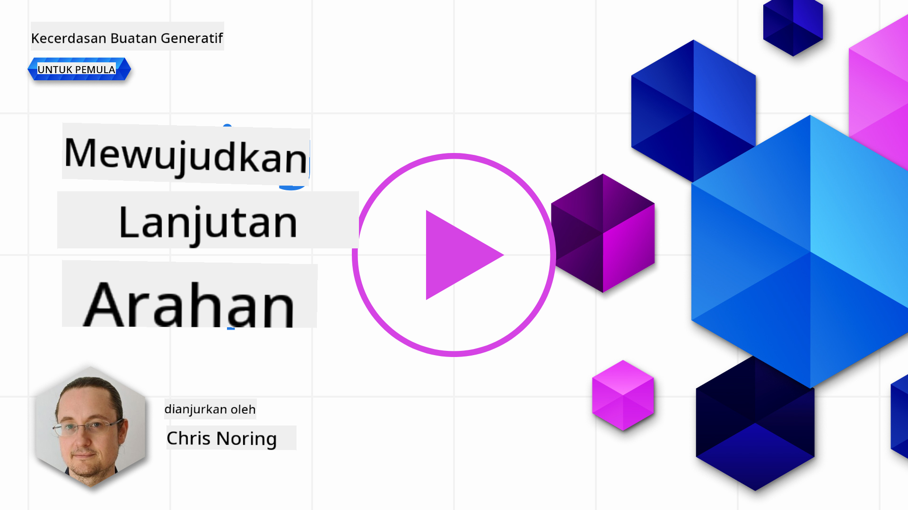

<!--
CO_OP_TRANSLATOR_METADATA:
{
  "original_hash": "b2651fb16bcfbc62b8e518751ed90fdb",
  "translation_date": "2025-10-17T20:51:10+00:00",
  "source_file": "05-advanced-prompts/README.md",
  "language_code": "ms"
}
-->
# Membuat Prompt Lanjutan

[](https://youtu.be/BAjzkaCdRok?si=NmUIyRf7-cDgbjtt)

Mari kita ulang kaji beberapa pembelajaran dari bab sebelumnya:

> Kejuruteraan _prompt_ adalah proses di mana kita **membimbing model ke arah respons yang lebih relevan** dengan memberikan arahan atau konteks yang lebih berguna.

Terdapat dua langkah dalam menulis prompt: membina prompt dengan memberikan konteks yang relevan, dan _pengoptimuman_, iaitu bagaimana untuk meningkatkan prompt secara beransur-ansur.

Pada tahap ini, kita mempunyai pemahaman asas tentang cara menulis prompt, tetapi kita perlu mendalami lagi. Dalam bab ini, anda akan beralih daripada mencuba pelbagai prompt kepada memahami mengapa satu prompt lebih baik daripada yang lain. Anda akan belajar cara membina prompt dengan mengikuti beberapa teknik asas yang boleh digunakan pada mana-mana LLM.

## Pengenalan

Dalam bab ini, kita akan membincangkan topik berikut:

- Memperluaskan pengetahuan anda tentang kejuruteraan prompt dengan menerapkan teknik yang berbeza pada prompt anda.
- Mengkonfigurasi prompt anda untuk menghasilkan output yang berbeza.

## Matlamat Pembelajaran

Selepas menyelesaikan pelajaran ini, anda akan dapat:

- Menerapkan teknik kejuruteraan prompt yang meningkatkan hasil daripada prompt anda.
- Melakukan prompting yang sama ada berbeza atau deterministik.

## Kejuruteraan Prompt

Kejuruteraan prompt adalah proses mencipta prompt yang akan menghasilkan hasil yang diinginkan. Kejuruteraan prompt lebih daripada sekadar menulis teks prompt. Ia bukan disiplin kejuruteraan, tetapi lebih kepada satu set teknik yang boleh anda gunakan untuk mendapatkan hasil yang diinginkan.

### Contoh Prompt

Mari kita ambil contoh prompt asas seperti ini:

> Hasilkan 10 soalan tentang geografi.

Dalam prompt ini, anda sebenarnya menerapkan satu set teknik prompt yang berbeza.

Mari kita pecahkan.

- **Konteks**, anda menentukan ia harus mengenai "geografi".
- **Mengehadkan output**, anda mahukan tidak lebih daripada 10 soalan.

### Keterbatasan Prompt Mudah

Anda mungkin atau mungkin tidak mendapat hasil yang diinginkan. Anda akan mendapat soalan yang dihasilkan, tetapi geografi adalah topik yang besar dan anda mungkin tidak mendapat apa yang anda mahukan kerana sebab-sebab berikut:

- **Topik besar**, anda tidak tahu sama ada ia akan mengenai negara, ibu kota, sungai, dan sebagainya.
- **Format**, bagaimana jika anda mahukan soalan diformatkan dengan cara tertentu?

Seperti yang anda lihat, terdapat banyak perkara yang perlu dipertimbangkan semasa mencipta prompt.

Setakat ini, kita telah melihat contoh prompt mudah, tetapi AI generatif mampu melakukan lebih banyak perkara untuk membantu orang dalam pelbagai peranan dan industri. Mari kita terokai beberapa teknik asas seterusnya.

### Teknik untuk Prompting

Pertama, kita perlu memahami bahawa prompting adalah sifat _emergent_ LLM yang bermaksud ini bukan ciri yang dibina dalam model tetapi sesuatu yang kita temui semasa menggunakan model.

Terdapat beberapa teknik asas yang boleh kita gunakan untuk memprompt LLM. Mari kita terokai.

- **Prompting tanpa templat (Zero-shot prompting)**, ini adalah bentuk prompting yang paling asas. Ia adalah satu prompt tunggal yang meminta respons daripada LLM berdasarkan data latihannya sahaja.
- **Prompting dengan beberapa contoh (Few-shot prompting)**, jenis prompting ini membimbing LLM dengan memberikan 1 atau lebih contoh yang boleh digunakan untuk menghasilkan responsnya.
- **Rantai pemikiran (Chain-of-thought)**, jenis prompting ini memberitahu LLM bagaimana untuk memecahkan masalah kepada langkah-langkah.
- **Pengetahuan yang dihasilkan (Generated knowledge)**, untuk meningkatkan respons prompt, anda boleh memberikan fakta atau pengetahuan yang dihasilkan sebagai tambahan kepada prompt anda.
- **Dari yang paling mudah ke yang paling sukar (Least to most)**, seperti rantai pemikiran, teknik ini adalah tentang memecahkan masalah kepada satu siri langkah dan kemudian meminta langkah-langkah ini dilakukan mengikut urutan.
- **Penyempurnaan diri (Self-refine)**, teknik ini adalah tentang mengkritik output LLM dan kemudian memintanya untuk memperbaiki.
- **Prompting maieutik (Maieutic prompting)**. Apa yang anda mahukan di sini adalah memastikan jawapan LLM adalah betul dan anda memintanya untuk menjelaskan pelbagai bahagian jawapan. Ini adalah satu bentuk penyempurnaan diri.

### Prompting Tanpa Templat (Zero-shot prompting)

Gaya prompting ini sangat mudah, ia terdiri daripada satu prompt tunggal. Teknik ini mungkin adalah apa yang anda gunakan semasa mula belajar tentang LLM. Berikut adalah contoh:

- Prompt: "Apa itu Algebra?"
- Jawapan: "Algebra adalah cabang matematik yang mengkaji simbol matematik dan peraturan untuk memanipulasi simbol-simbol ini."

### Prompting dengan Beberapa Contoh (Few-shot prompting)

Gaya prompting ini membantu model dengan memberikan beberapa contoh bersama permintaan. Ia terdiri daripada satu prompt dengan data khusus tugas tambah
Seperti yang anda lihat, hasilnya sangat berbeza.

> Perhatikan bahawa terdapat lebih banyak parameter yang boleh anda ubah untuk memvariasikan output, seperti top-k, top-p, penalti pengulangan, penalti panjang, dan penalti kepelbagaian tetapi ini berada di luar skop kurikulum ini.

## Amalan Baik

Terdapat banyak amalan yang boleh anda gunakan untuk mendapatkan hasil yang diinginkan. Anda akan menemui gaya anda sendiri apabila semakin kerap menggunakan teknik prompting.

Selain teknik yang telah kita bincangkan, terdapat beberapa amalan baik yang perlu dipertimbangkan semasa membuat prompt untuk LLM.

Berikut adalah beberapa amalan baik yang perlu dipertimbangkan:

- **Nyatakan konteks**. Konteks adalah penting, semakin banyak anda boleh nyatakan seperti domain, topik, dan sebagainya, semakin baik.
- Hadkan output. Jika anda mahukan bilangan item tertentu atau panjang tertentu, nyatakannya.
- **Nyatakan apa dan bagaimana**. Ingat untuk menyebut apa yang anda mahukan dan bagaimana anda mahukannya, contohnya "Buat API Web Python dengan laluan produk dan pelanggan, bahagikan kepada 3 fail".
- **Gunakan templat**. Selalunya, anda ingin memperkayakan prompt anda dengan data daripada syarikat anda. Gunakan templat untuk melakukannya. Templat boleh mempunyai pemboleh ubah yang anda gantikan dengan data sebenar.
- **Eja dengan betul**. LLM mungkin memberikan anda respons yang betul, tetapi jika anda mengeja dengan betul, anda akan mendapat respons yang lebih baik.

## Tugasan

Berikut adalah kod dalam Python yang menunjukkan cara membina API mudah menggunakan Flask:

```python
from flask import Flask, request

app = Flask(__name__)

@app.route('/')
def hello():
    name = request.args.get('name', 'World')
    return f'Hello, {name}!'

if __name__ == '__main__':
    app.run()
```

Gunakan pembantu AI seperti GitHub Copilot atau ChatGPT dan gunakan teknik "self-refine" untuk memperbaiki kod tersebut.

## Penyelesaian

Sila cuba selesaikan tugasan dengan menambah prompt yang sesuai pada kod.

> [!TIP]
> Rangka ayat prompt untuk meminta ia memperbaiki, adalah idea yang baik untuk menghadkan berapa banyak penambahbaikan. Anda juga boleh meminta untuk memperbaikinya dengan cara tertentu, contohnya seni bina, prestasi, keselamatan, dan sebagainya.

[Penyelesaian](../../../05-advanced-prompts/python/aoai-solution.py)

## Semakan Pengetahuan

Mengapa saya menggunakan chain-of-thought prompting? Tunjukkan 1 jawapan yang betul dan 2 jawapan yang salah.

1. Untuk mengajar LLM cara menyelesaikan masalah.
1. B, Untuk mengajar LLM mencari kesilapan dalam kod.
1. C, Untuk mengarahkan LLM menghasilkan penyelesaian yang berbeza.

A: 1, kerana chain-of-thought adalah tentang menunjukkan kepada LLM cara menyelesaikan masalah dengan memberikan langkah-langkah, dan masalah serupa serta cara ia diselesaikan.

## 🚀 Cabaran

Anda baru sahaja menggunakan teknik self-refine dalam tugasan. Ambil mana-mana program yang telah anda bina dan pertimbangkan penambahbaikan yang ingin anda terapkan padanya. Sekarang gunakan teknik self-refine untuk menerapkan perubahan yang dicadangkan. Apa pendapat anda tentang hasilnya, lebih baik atau lebih buruk?

## Kerja Hebat! Teruskan Pembelajaran Anda

Selepas menyelesaikan pelajaran ini, lihat [koleksi Pembelajaran AI Generatif kami](https://aka.ms/genai-collection?WT.mc_id=academic-105485-koreyst) untuk terus meningkatkan pengetahuan AI Generatif anda!

Pergi ke Pelajaran 6 di mana kita akan menerapkan pengetahuan kita tentang Prompt Engineering dengan [membina aplikasi penjanaan teks](../06-text-generation-apps/README.md?WT.mc_id=academic-105485-koreyst)

---

**Penafian**:  
Dokumen ini telah diterjemahkan menggunakan perkhidmatan terjemahan AI [Co-op Translator](https://github.com/Azure/co-op-translator). Walaupun kami berusaha untuk ketepatan, sila ambil perhatian bahawa terjemahan automatik mungkin mengandungi kesilapan atau ketidaktepatan. Dokumen asal dalam bahasa asalnya harus dianggap sebagai sumber yang berwibawa. Untuk maklumat penting, terjemahan manusia profesional adalah disyorkan. Kami tidak bertanggungjawab atas sebarang salah faham atau salah tafsir yang timbul daripada penggunaan terjemahan ini.