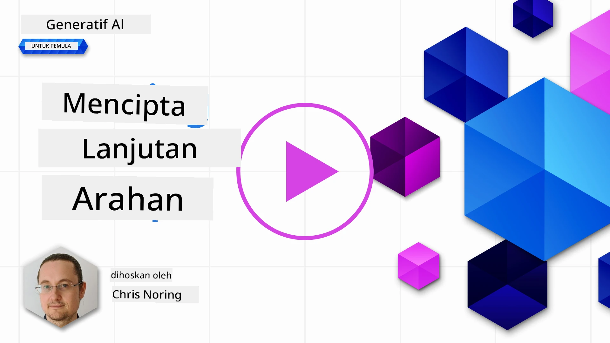

# Membuat Prompt Lanjutan

[](https://youtu.be/BAjzkaCdRok?si=NmUIyRf7-cDgbjtt)

Mari kita ulang kaji beberapa pembelajaran dari bab sebelumnya:

> Kejuruteraan prompt adalah proses di mana kita **mengarahkan model ke arah respons yang lebih relevan** dengan memberikan arahan atau konteks yang lebih berguna.

Terdapat juga dua langkah untuk menulis prompt: membina prompt, dengan menyediakan konteks yang berkaitan, dan _pengoptimuman_, bagaimana untuk secara beransur-ansur memperbaiki prompt.

Pada ketika ini, kita mempunyai sedikit pemahaman asas tentang cara menulis prompt, tetapi kita perlu pergi lebih dalam. Dalam bab ini, anda akan melalui pelbagai percubaan prompt sehingga memahami mengapa satu prompt lebih baik daripada yang lain. Anda akan belajar bagaimana membina prompt mengikut beberapa teknik asas yang boleh diterapkan pada mana-mana LLM.

## Pengenalan

Dalam bab ini, kita akan membincangkan topik-topik berikut:

- Meluaskan pengetahuan anda tentang kejuruteraan prompt dengan menerapkan pelbagai teknik pada prompt anda.
- Mengkonfigurasi prompt anda untuk mempelbagaikan output.

## Matlamat pembelajaran

Selepas menamatkan pelajaran ini, anda akan dapat:

- Menerapkan teknik kejuruteraan prompt yang meningkatkan hasil prompt anda.
- Melakukan prompting yang sama ada bervariasi atau deterministik.

## Kejuruteraan prompt

Kejuruteraan prompt adalah proses membuat prompt yang akan menghasilkan hasil yang diinginkan. Ada lebih daripada sekadar menulis prompt teks sahaja dalam kejuruteraan prompt. Kejuruteraan prompt bukan disiplin kejuruteraan, ia lebih kepada satu set teknik yang boleh anda aplikasikan untuk mendapatkan hasil yang diinginkan.

### Contoh prompt

Mari kita ambil prompt asas seperti berikut:

> Hasilkan 10 soalan tentang geografi.

Dalam prompt ini, anda sebenarnya menggunakan satu set pelbagai teknik prompt.

Mari kita pecahkan ini.

- **Konteks**, anda nyatakan ia harus tentang "geografi".
- **Hadkan output**, anda mahu tidak lebih daripada 10 soalan.

### Keterbatasan prompting mudah

Anda mungkin akan atau tidak akan mendapat hasil yang diingini. Anda akan dapat soalan yang dihasilkan, tetapi geografi adalah topik yang besar dan anda mungkin tidak dapat apa yang anda mahu kerana sebab-sebab berikut:

- **Topik besar**, anda tidak tahu jika ia tentang negara, ibu kota, sungai dan sebagainya.
- **Format**, bagaimana jika anda mahukan soalan itu diformatkan secara tertentu?

Seperti yang anda lihat, banyak perkara perlu dipertimbangkan semasa membuat prompt.

Setakat ini, kita telah lihat contoh prompt mudah, tetapi AI generatif mampu melakukan lebih banyak untuk membantu orang dalam pelbagai peranan dan industri. Mari kita terokai beberapa teknik asas seterusnya.

### Teknik untuk prompting

Mula-mula, kita perlu faham bahawa prompting adalah sifat _munculan_ LLM yang bermaksud ini bukan ciri terbina dalam model tetapi sesuatu yang kita temui semasa menggunakan model.

Terdapat beberapa teknik asas yang boleh kita gunakan untuk prompt LLM. Mari kita terokai mereka.

- **Zero-shot prompting**, ini adalah bentuk paling asas prompting. Ia ialah satu prompt tunggal yang meminta respons dari LLM berdasarkan data latihan sahaja.
- **Few-shot prompting**, jenis prompting ini membimbing LLM dengan menyediakan satu atau lebih contoh yang boleh digunakan untuk menjana respons.
- **Chain-of-thought**, jenis prompting ini memberitahu LLM cara memecahkan masalah kepada langkah-langkah.
- **Generated knowledge**, untuk meningkatkan respons prompt, anda boleh menyediakan fakta atau ilmu yang dijana sebagai tambahan kepada prompt anda.
- **Least to most**, seperti chain-of-thought, teknik ini ialah memecahkan masalah kepada siri langkah dan kemudian meminta langkah-langkah ini dilakukan mengikut urutan.
- **Self-refine**, teknik ini adalah mengkritik output LLM dan kemudian memintanya memperbaiki.
- **Maieutic prompting**. Apa yang anda mahu di sini adalah memastikan jawapan LLM betul dan anda memintanya untuk jelaskan bahagian-bahagian jawapan. Ini adalah bentuk self-refine.

### Zero-shot prompting

Gaya prompting ini sangat mudah, ia terdiri daripada satu prompt tunggal. Teknik ini mungkin yang anda gunakan apabila mula belajar mengenai LLM. Berikut contohnya:

- Prompt: "Apa itu Algebra?"
- Jawapan: "Algebra adalah cabang matematik yang mengkaji simbol matematik dan peraturan untuk mengendalikan simbol ini."

### Few-shot prompting

Gaya prompting ini membantu model dengan menyediakan beberapa contoh bersama permintaan. Ia terdiri daripada satu prompt dengan data khusus tugasan tambahan. Berikut contohnya:

- Prompt: "Tulis puisi dalam gaya Shakespeare. Berikut beberapa contoh soneta Shakespeare:
  Soneta 18: 'Haruskah aku membandingkan dirimu dengan hari musim panas? Engkau lebih indah dan seimbang...'
  Soneta 116: 'Biarkan aku tidak menghalang pernikahan pikiran sejati Terimalah halangan. Cinta bukan cinta Yang berubah bila ia menemukan perubahan...'
  Soneta 132: 'Matamu kucintai, dan mereka, kasihan padaku, Mengetahui hatimu menyiksaku dengan penghinaan,...'
  Sekarang, tulis soneta tentang kecantikan bulan."
- Jawapan: "Di langit, bulan bersinar lembut, Dalam cahaya perak yang memancarkan keanggunan,..."

Contoh memberi LLM konteks, format atau gaya output yang diinginkan. Ia membantu model memahami tugasan khusus dan menghasilkan respons yang lebih tepat dan relevan.

### Chain-of-thought

Chain-of-thought adalah teknik yang sangat menarik kerana ia melibatkan membawa LLM melalui siri langkah. Idea adalah untuk mengarahkan LLM supaya ia faham cara melakukan sesuatu. Pertimbangkan contoh berikut, dengan dan tanpa chain-of-thought:

    - Prompt: "Alice mempunyai 5 epal, membuang 3 epal, memberi 2 kepada Bob dan Bob memberi satu kembali, berapa epal yang Alice miliki?"
    - Jawapan: 5

LLM menjawab 5, yang salah. Jawapan betul ialah 1 epal, mengikut kiraan (5 -3 -2 + 1 = 1).

Jadi bagaimana kita mengajar LLM melakukan ini dengan betul?

Mari cuba chain-of-thought. Menggunakan chain-of-thought bermaksud:

1. Berikan LLM contoh yang serupa.
1. Tunjukkan kiraannya, dan cara mengiranya dengan betul.
1. Berikan prompt asal.

Ini caranya:

- Prompt: "Lisa mempunyai 7 epal, membuang 1 epal, memberi 4 epal kepada Bart dan Bart memberi satu kembali:
  7 -1 = 6
  6 -4 = 2
  2 +1 = 3  
  Alice mempunyai 5 epal, membuang 3 epal, memberi 2 kepada Bob dan Bob memberi satu kembali, berapa epal yang Alice miliki?"
  Jawapan: 1

Perhatikan bagaimana kita menulis prompt yang jauh lebih panjang dengan satu lagi contoh, satu kiraan dan kemudian prompt asal dan kita sampai pada jawapan yang betul iaitu 1.

Seperti yang anda lihat, chain-of-thought adalah teknik yang sangat berkuasa.

### Generated knowledge

Banyak kali apabila anda mahu membina prompt, anda ingin melakukannya menggunakan data syarikat anda sendiri. Anda mahu sebahagian dari prompt datang dari syarikat dan bahagian lain adalah prompt sebenar yang anda minati.

Sebagai contoh, begini rupa prompt anda jika anda dalam perniagaan insurans:

```text
{{company}}: {{company_name}}
{{products}}:
{{products_list}}
Please suggest an insurance given the following budget and requirements:
Budget: {{budget}}
Requirements: {{requirements}}
```

Di atas, anda melihat bagaimana prompt dibina menggunakan templat. Dalam templat terdapat beberapa pembolehubah, dilambangkan dengan `{{variable}}`, yang akan diganti dengan nilai sebenar dari API syarikat.

Berikut contoh bagaimana prompt itu akan kelihatan setelah pembolehubah digantikan dengan kandungan dari syarikat anda:

```text
Insurance company: ACME Insurance
Insurance products (cost per month):
- Car, cheap, 500 USD
- Car, expensive, 1100 USD
- Home, cheap, 600 USD
- Home, expensive, 1200 USD
- Life, cheap, 100 USD

Please suggest an insurance given the following budget and requirements:
Budget: $1000
Requirements: Car, Home, and Life insurance
```

Menjalankan prompt ini melalui LLM akan menghasilkan respons seperti ini:

```output
Given the budget and requirements, we suggest the following insurance package from ACME Insurance:
- Car, cheap, 500 USD
- Home, cheap, 600 USD
- Life, cheap, 100 USD
Total cost: $1,200 USD
```

Seperti yang anda lihat, ia juga mencadangkan Takaful Hayat, yang sepatutnya tidak. Hasil ini menunjukkan bahawa kita perlu mengoptimumkan prompt dengan mengubah prompt menjadi lebih jelas tentang apa yang dibenarkan. Setelah beberapa _cubaan dan kesilapan_, kita sampai pada prompt berikut:

```text
Insurance company: ACME Insurance
Insurance products (cost per month):
- type: Car, cheap, cost: 500 USD
- type: Car, expensive, cost: 1100 USD
- type: Home, cheap, cost: 600 USD
- type: Home, expensive, cost: 1200 USD
- type: Life, cheap, cost: 100 USD

Please suggest an insurance given the following budget and requirements:
Budget: $1000 restrict choice to types: Car, Home
```

Perhatikan bagaimana menambah _jenis_ dan _kos_ dan juga menggunakan kata kunci _hadkan_ membantu LLM memahami apa yang kita mahu.

Kini kita mendapatkan respons berikut:

```output
Given the budget and requirements, we suggest the Car, Cheap insurance product which costs 500 USD per month.
```

Tujuan contoh ini adalah untuk menunjukkan bahawa walaupun kita menggunakan teknik asas seperti _generated knowledge_, kita masih perlu mengoptimumkan prompt dalam kebanyakan kes untuk mendapatkan hasil yang diinginkan.

### Least-to-most

Idea dengan prompting Least-to-most adalah memecahkan masalah besar kepada sub-masalah. Dengan cara itu, anda membantu membimbing LLM bagaimana untuk "menakluk" masalah besar itu. Contoh yang baik mungkin untuk sains data di mana anda boleh meminta LLM membahagikan masalah seperti ini:

> Prompt: Bagaimana melakukan sains data dalam 5 langkah?

Dengan pembantu AI anda menjawab:

1. Kumpul data
1. Bersihkan data
1. Analisis data
1. Plot data
1. Persembahkan data

### Self-refine, kritik hasil

Dengan AI generatif dan LLM, anda tidak boleh mempercayai output begitu sahaja. Anda perlu mengesahkannya. Lagipun, LLM hanya membentangkan apa yang paling mungkin untuk dikatakan seterusnya, bukan apa yang betul. Oleh itu, idea yang baik adalah untuk meminta LLM mengkritik dirinya sendiri, yang membawa kita kepada teknik self-refine.

Cara ia berfungsi adalah anda mengikuti langkah berikut:

1. Prompt awal meminta LLM menyelesaikan masalah
1. LLM menjawab
1. Anda mengkritik jawapan dan minta AI memperbaiki
1. LLM menjawab lagi, kali ini mengambil kira kritikan dan mencadangkan penyelesaian yang dikemukakan

Anda boleh ulang proses ini sebanyak mana kali yang anda mahu.

Berikut contoh menggunakan teknik ini:

> Prompt: "Buat API Web Python dengan laluan produk dan pelanggan"

Jawapan AI:

```python
import flask
app = Flask(__name__)

@app.route('/products')
def products():
    return 'Products'

@app.route('/customers')
def customers():
    return 'Customers'
```

> Prompt: cadangkan 3 penambahbaikan pada kod di atas

Jawapan AI:

```text
Sure, here are three suggestions to improve the code:

Import the correct module: The first line should import Flask instead of flask. The correct import statement should be from flask import Flask.

Add a main function: Add a if __name__ == '__main__': block to the end of the file to run the application when the file is executed.

Use f-strings: Use f-strings to format the return statements in the route functions. For example, return 'Products' can be changed to return f'This is the {request.path} page'.
```

```python
from flask import Flask, request

app = Flask(__name__)

@app.route('/products')
def products():
    return f'This is the {request.path} page'

@app.route('/customers')
def customers():
    return f'This is the {request.path} page'

if __name__ == '__main__':
    app.run()
```

Seperti yang anda lihat, respons AI di atas memperbaiki kod yang dicadangkan pertama terima kasih kepada mengkritik jawapan pertama.

### Maieutic prompting

Maieutic prompting adalah teknik yang serupa dengan self-refine tetapi ia lebih kepada meminta LLM menjelaskan dirinya sendiri. Matlamatnya adalah mengurangkan ketidakkonsistenan dalam output LLM supaya ia sampai pada jawapan yang betul. Aliran kerja yang diikuti ialah:

1. Tanya LLM untuk menjawab satu soalan
1. Untuk setiap bahagian jawapan, tanya LLM untuk jelaskan dengan lebih mendalam.
1. Jika ada ketidakkonsistenan, buang bahagian yang tidak konsisten.

Ulang 2 dan 3 sehingga anda telah melalui semua bahagian dan puas hati dengan jawapan.

Berikut contoh prompt:

> prompt: Bagaimana saya boleh membuat pelan krisis untuk mengurangkan pandemik dalam 5 langkah?
> Jawapan LLM:

```text
1. Identify the risks
1. Identify the stakeholders
1. Identify the resources
1. Identify the actions
1. Identify the communication channels
```

Ia mengenal pasti 5 langkah, tetapi bolehkah kita tentukan jika ini betul? Mari tanya LLM untuk jelaskan setiap langkah:

> prompt: Terangkan langkah pertama dengan lebih terperinci, apa risiko dalam terperinci dengan pandemik?

```text
The risks are the following:

- Loss of life
- Loss of business
- Loss of reputation
- Loss of customers
- Loss of employees
```

Pada ketika ini, kita mahu pastikan LLM betul maka kita minta ia jelaskan risiko pertama dengan lebih terperinci dan harap ia konsisten dengan jawapan di atas:

> prompt: Dalam Pandemik, apakah risiko terbesar dan mengapa?

```text
The biggest risk is loss of life because it's the most important thing to protect.
```

> Apakah dua risiko terbesar dalam pandemik?

```text
The two biggest risks are loss of life and loss of business.
```

Pada ketika ini, LLM konsisten dan menyebut "kehidupan" dan "perniagaan" sebagai dua risiko utama. Kita sekarang boleh terus ke langkah seterusnya dan rasa cukup yakin. Walau bagaimanapun, kita tidak harus mempercayai LLM secara buta, kita sentiasa perlu mengesahkan output.

## Memvariasikan output anda

LLM adalah nondeterministik secara semula jadi, bermakna anda akan mendapat keputusan berbeza setiap kali anda jalankan prompt yang sama. Cuba prompt berikut sebagai contoh:

> "Hasilkan kod untuk API Web Python"

```python
# Import modul yang diperlukan
import flask
from flask import request, jsonify

# Cipta aplikasi Flask
app = flask.Flask(__name__)

# Cipta laluan untuk API
@app.route('/api', methods=['GET'])
def api():
    # Dapatkan data dari permintaan
    data = request.args

    # Proses data
    result = process_data(data)

    # Pulangkan keputusan sebagai JSON
    return jsonify(result)

# Fungsi untuk memproses data
def process_data(data):
    # Lakukan sesuatu dengan data
    result = data + 1

    # Pulangkan keputusan
    return result

# Jalankan aplikasi
if __name__ == '__main__':
    app.run()

```

Menjalankan prompt yang sama sekali lagi menghasilkan respons yang sedikit berbeza:

```python
#import pakej yang diperlukan
import flask
from flask import request, jsonify

#buat aplikasi Flask
app = flask.Flask(__name__)
app.config["DEBUG"] = True

#buat senarai buku
books = [
    {'id': 0,
     'title': 'A Fire Upon the Deep',
     'author': 'Vernor Vinge',
     'first_sentence': 'The coldsleep itself was dreamless.',
     'year_published': '1992'},
    {'id': 1,
     'title': 'The Ones Who Walk Away From Omelas',
     'author': 'Ursula K. Le Guin',
     'first_sentence': 'With a clamor of bells that set the swallows soaring, the Festival of Summer came to the city Omelas, bright-towered by the sea.',
     'published': '1973'},
    {'id': 2,
     'title': 'Dhalgren',
     'author': 'Samuel R. Delany',
     'first_sentence': 'to wound the autumnal city.',
     'published': '1975'}
]

#buat titik hujung untuk API
@app.route('/', methods=['GET'])
def home():
    return '''<h1>Books API</h1>
<p>A prototype API for retrieving books.</p>'''

#buat titik hujung untuk memulangkan semua buku
@app.route('/api/v1/resources/books/all', methods=['GET'])
def api_all():
    return jsonify(books)

#buat titik hujung untuk memulangkan satu buku
@app.route('/api/v1/resources/books', methods=['GET'])
def api_id():
    #periksa jika ID diberikan sebagai sebahagian daripada URL
    #jika ID diberikan, tetapkan pada pembolehubah
    #jika tiada ID diberikan, paparkan ralat
    if 'id' in request.args:
        id = int(request.args['id'])
    else:
        return "Error: No id field provided. Please specify an id."

    #buat senarai kosong untuk hasil kami
    results = []

    #ulang melalui data dan padankan hasil yang sesuai dengan ID yang diminta
    #ID adalah unik, tetapi medan lain mungkin mengembalikan banyak hasil
    for book in books:
        if book['id'] == id:
            results.append(book)

    #gunakan fungsi jsonify dari Flask untuk menukar senarai kami
    #kamus Python ke dalam format JSON
    return jsonify(results)

app.run()
```

> Jadi, adakah output yang pelbagai masalah?

Bergantung pada apa yang anda cuba lakukan. Jika anda mahu respons tertentu maka ia masalah. Jika anda ok dengan output pelbagai seperti "Hasilkan mana-mana 3 soalan tentang geografi", maka ia bukan masalah.

### Menggunakan suhu untuk mempelbagaikan output anda

Ok, jadi kita telah putuskan kita mahu mengehadkan output supaya lebih boleh diramal, iaitu lebih deterministik. Bagaimana kita buat itu?

Suhu adalah nilai antara 0 dan 1, di mana 0 adalah paling deterministik dan 1 adalah paling pelbagai. Nilai lalai ialah 0.7. Mari lihat apa yang berlaku dengan dua kali jalankan prompt yang sama dengan suhu ditetapkan ke 0.1:

> "Hasilkan kod untuk API Web Python"

```python
#import perpustakaan yang diperlukan
import flask
from flask import request, jsonify

#cipta satu instance kelas Flask
app = flask.Flask(__name__)

#cipta satu titik akhir untuk API
@app.route('/api/v1/endpoint', methods=['GET'])
def api_endpoint():
    #dapatkan data permintaan
    data = request.get_json()

    #proses data
    result = process_data(data)

    #kembalikan hasil
    return jsonify(result)

#fungsi untuk memproses data
def process_data(data):
    #proses data
    result = {'result': 'success'}

    #kembalikan hasil
    return result

#jalankan aplikasi Flask
if __name__ == '__main__':
    app.run()

```

Menjalankan prompt sekali lagi memberi keputusan berikut:

```python
#import perpustakaan yang diperlukan
import flask
from flask import request, jsonify

#buat aplikasi Flask
app = flask.Flask(__name__)

#buat laluan untuk API
@app.route('/api', methods=['GET'])
def api_call():
    #dapatkan data dari permintaan
    data = request.get_json()

    #proses data
    result = process_data(data)

    #kembalikan keputusan
    return jsonify(result)

#definisikan fungsi process_data
def process_data(data):
    #lakukan sesuatu dengan data
    result = data + 1

    #kembalikan keputusan
    return result

#jalankan aplikasi
if __name__ == '__main__':
    app.run()

```

Hanya terdapat perbezaan kecil antara dua output ini. Mari buat sebaliknya kali ini, tetapkan suhu kepada 0.9:

```python
# Import perpustakaan yang diperlukan
import flask
from flask import request, jsonify

# Cipta aplikasi Flask
app = flask.Flask(__name__)

# Cipta laluan untuk API
@app.route('/api', methods=['GET'])
def api_call():
    # Dapatkan data dari permintaan
    data = request.args

    # Proses data
    result = process_data(data)

    # Pulangkan hasil
    return jsonify(result)

# Fungsi untuk memproses data
def process_data(data):
    # Lakukan sesuatu dengan data
    result = data + 1

    # Pulangkan hasil
    return result

# Jalankan aplikasi
if __name__ == '__main__':
    app.run()

```

dan cubaan kedua pada nilai suhu 0.9:

```python
import flask
from flask import request, jsonify

# cipta aplikasi Flask
app = flask.Flask(__name__)
app.config['DEBUG'] = True

# cipta beberapa data ujian
books = [
    {'id': 0, 'title': 'A Fire Upon The Deep', 'author': 'Vernor Vinge', 'first_sentence': 'The coldsleep itself was dreamless.', 'year_published': '1992'},
    {'id': 1, 'title': 'The Ones Who Walk Away From Omelas', 'author': 'Ursula K. Le Guin', 'first_sentence': 'With a clamor of bells that set the swallows soaring, the Festival of Summer came to the city Omelas, bright-towered by the sea.', 'published': '1973'},
    {'id': 2, 'title': 'Dhalgren', 'author': 'Samuel R. Delany', 'first_sentence': 'to wound the autumnal city.', 'published': '1975'}
]

# cipta satu titik akhir
@app.route('/', methods=['GET'])
def home():
    return '''<h1>Welcome to our book API!</h1>'''

@app.route('/api/v1/resources/books

```

Seperti yang anda lihat, hasil sangat bervariasi.


> Perlu diingat, terdapat lebih banyak parameter yang boleh anda ubah untuk memvariasikan output, seperti top-k, top-p, penalti pengulangan, penalti panjang dan penalti kepelbagaian tetapi ini di luar skop kurikulum ini.

## Amalan Baik

Terdapat banyak amalan yang boleh anda gunakan untuk mencuba mendapatkan apa yang anda mahukan. Anda akan menemui gaya anda sendiri apabila anda menggunakan prompt semakin banyak.

Selain teknik yang telah kita bincangkan, terdapat beberapa amalan baik yang perlu dipertimbangkan apabila memberi arahan kepada LLM.

Berikut adalah beberapa amalan baik yang perlu dipertimbangkan:

- **Nyatakan konteks**. Konteks penting, semakin banyak anda boleh nyatakan seperti domain, topik, dan sebagainya, semakin baik.
- Hadkan output. Jika anda mahukan bilangan item tertentu atau panjang tertentu, nyatakannya.
- **Nyatakan kedua-dua apa dan bagaimana**. Ingat untuk menyatakan kedua-dua apa yang anda mahukan dan bagaimana anda mahu ia, contohnya "Cipta API Web Python dengan laluan produk dan pelanggan, bahagi ia kepada 3 fail".
- **Gunakan templat**. Selalunya, anda ingin memperkayakan prompt anda dengan data daripada syarikat anda. Gunakan templat untuk berbuat demikian. Templat boleh mempunyai pembolehubah yang anda gantikan dengan data sebenar.
- **Eja dengan betul**. LLM mungkin memberikan jawapan yang betul, tetapi jika anda mengeja dengan betul, anda akan mendapat jawapan yang lebih baik.

## Tugasan

Berikut adalah kod Python yang menunjukkan cara membina API ringkas menggunakan Flask:

```python
from flask import Flask, request

app = Flask(__name__)

@app.route('/')
def hello():
    name = request.args.get('name', 'World')
    return f'Hello, {name}!'

if __name__ == '__main__':
    app.run()
```

Gunakan pembantu AI seperti GitHub Copilot atau ChatGPT dan terapkan teknik "self-refine" untuk memperbaiki kod tersebut.

## Penyelesaian

Sila cuba selesaikan tugasan dengan menambah prompt yang sesuai pada kod tersebut.

> [!TIP]
> Rangka ayat prompt untuk meminta penambahbaikan, adalah idea yang baik untuk mengehadkan berapa banyak penambahbaikan. Anda juga boleh meminta penambahbaikan dalam cara tertentu, contohnya seni bina, prestasi, keselamatan, dan lain-lain.

[Penyelesaian](../../../05-advanced-prompts/python/aoai-solution.py)

## Semakan Pengetahuan

Mengapakah saya menggunakan prompt chain-of-thought? Tunjukkan 1 jawapan yang betul dan 2 jawapan yang salah.

1. Untuk mengajar LLM cara menyelesaikan masalah.
1. B, Untuk mengajar LLM mencari kesilapan dalam kod.
1. C, Untuk mengarahkan LLM mencipta penyelesaian yang berbeza.

A: 1, kerana chain-of-thought adalah tentang menunjukkan kepada LLM cara menyelesaikan masalah dengan memberikannya satu siri langkah, dan masalah yang serupa serta bagaimana ia diselesaikan.

## 🚀 Cabaran

Anda baru sahaja menggunakan teknik self-refine dalam tugasan. Ambil mana-mana program yang anda bangunkan dan fikirkan penambahbaikan apa yang anda mahu terapkan padanya. Sekarang gunakan teknik self-refine untuk menerapkan perubahan yang dicadangkan. Apakah pendapat anda mengenai hasilnya, lebih baik atau lebih buruk?

## Kerja Hebat! Teruskan Pembelajaran Anda

Selepas menamatkan pelajaran ini, lihat koleksi [Pembelajaran AI Generatif kami](https://aka.ms/genai-collection?WT.mc_id=academic-105485-koreyst) untuk terus meningkatkan pengetahuan AI Generatif anda!

Teruskan ke Pelajaran 6 di mana kita akan menggunakan pengetahuan Kejuruteraan Prompt dengan [membina aplikasi penjanaan teks](../06-text-generation-apps/README.md?WT.mc_id=academic-105485-koreyst)

---

<!-- CO-OP TRANSLATOR DISCLAIMER START -->
**Penafian**:
Dokumen ini telah diterjemahkan menggunakan perkhidmatan terjemahan AI [Co-op Translator](https://github.com/Azure/co-op-translator). Walaupun kami berusaha untuk ketepatan, sila ambil maklum bahawa terjemahan automatik mungkin mengandungi kesilapan atau ketidaktepatan. Dokumen asal dalam bahasa asalnya harus dianggap sebagai sumber yang sahih. Untuk maklumat penting, terjemahan oleh manusia profesional adalah disyorkan. Kami tidak bertanggungjawab terhadap sebarang salah faham atau salah tafsir yang timbul daripada penggunaan terjemahan ini.
<!-- CO-OP TRANSLATOR DISCLAIMER END -->