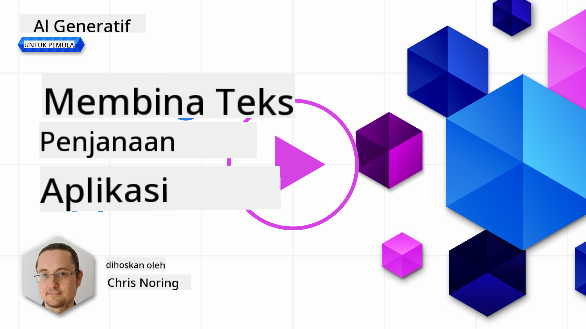

<!--
CO_OP_TRANSLATOR_METADATA:
{
  "original_hash": "5ec6c92b629564538ef397c550adb73e",
  "translation_date": "2025-05-19T17:09:42+00:00",
  "source_file": "06-text-generation-apps/README.md",
  "language_code": "ms"
}
-->
# Membangun Aplikasi Penjanaan Teks

[](https://aka.ms/gen-ai-lesson6-gh?WT.mc_id=academic-105485-koreyst)

> _(Klik imej di atas untuk menonton video pelajaran ini)_

Sehingga kini, melalui kurikulum ini, anda telah melihat konsep asas seperti arahan dan juga satu disiplin yang dipanggil "kejuruteraan arahan". Banyak alat yang anda boleh berinteraksi seperti ChatGPT, Office 365, Microsoft Power Platform dan lain-lain, menyokong anda menggunakan arahan untuk mencapai sesuatu.

Untuk menambah pengalaman sedemikian ke dalam aplikasi, anda perlu memahami konsep seperti arahan, penyelesaian dan memilih perpustakaan untuk digunakan. Itulah yang akan anda pelajari dalam bab ini.

## Pengenalan

Dalam bab ini, anda akan:

- Mempelajari tentang perpustakaan openai dan konsep asasnya.
- Membina aplikasi penjanaan teks menggunakan openai.
- Memahami bagaimana menggunakan konsep seperti arahan, suhu, dan token untuk membina aplikasi penjanaan teks.

## Matlamat pembelajaran

Pada akhir pelajaran ini, anda akan dapat:

- Menerangkan apa itu aplikasi penjanaan teks.
- Membina aplikasi penjanaan teks menggunakan openai.
- Mengkonfigurasi aplikasi anda untuk menggunakan lebih atau kurang token dan juga menukar suhu, untuk output yang berbeza.

## Apakah aplikasi penjanaan teks?

Biasanya apabila anda membina aplikasi, ia mempunyai beberapa jenis antara muka seperti berikut:

- Berasaskan arahan. Aplikasi konsol adalah aplikasi tipikal di mana anda menaip arahan dan ia melaksanakan tugas. Contohnya, `git` adalah aplikasi berasaskan arahan.
- Antara muka pengguna (UI). Beberapa aplikasi mempunyai antara muka pengguna grafik (GUI) di mana anda mengklik butang, memasukkan teks, memilih pilihan dan banyak lagi.

### Aplikasi konsol dan UI terhad

Bandingkan dengan aplikasi berasaskan arahan di mana anda menaip arahan:

- **Ia terhad**. Anda tidak boleh menaip sebarang arahan, hanya yang disokong oleh aplikasi.
- **Spesifik bahasa**. Beberapa aplikasi menyokong banyak bahasa, tetapi secara lalai aplikasi dibina untuk bahasa tertentu, walaupun anda boleh menambah sokongan bahasa lain.

### Kelebihan aplikasi penjanaan teks

Jadi bagaimana aplikasi penjanaan teks berbeza?

Dalam aplikasi penjanaan teks, anda mempunyai lebih banyak fleksibiliti, anda tidak terhad kepada set arahan atau bahasa input tertentu. Sebaliknya, anda boleh menggunakan bahasa semula jadi untuk berinteraksi dengan aplikasi. Satu lagi kelebihan adalah kerana anda sudah berinteraksi dengan sumber data yang telah dilatih dengan korpus maklumat yang luas, manakala aplikasi tradisional mungkin terhad pada apa yang ada dalam pangkalan data.

### Apa yang boleh saya bina dengan aplikasi penjanaan teks?

Terdapat banyak perkara yang boleh anda bina. Sebagai contoh:

- **Chatbot**. Chatbot yang menjawab soalan tentang topik, seperti syarikat anda dan produknya boleh menjadi padanan yang baik.
- **Pembantu**. LLM hebat dalam perkara seperti meringkaskan teks, mendapatkan wawasan dari teks, menghasilkan teks seperti resume dan banyak lagi.
- **Pembantu kod**. Bergantung pada model bahasa yang anda gunakan, anda boleh membina pembantu kod yang membantu anda menulis kod. Sebagai contoh, anda boleh menggunakan produk seperti GitHub Copilot serta ChatGPT untuk membantu anda menulis kod.

## Bagaimana saya boleh memulakan?

Baiklah, anda perlu mencari cara untuk mengintegrasikan dengan LLM yang biasanya melibatkan dua pendekatan berikut:

- Gunakan API. Di sini anda membina permintaan web dengan arahan anda dan mendapatkan teks yang dijana semula.
- Gunakan perpustakaan. Perpustakaan membantu menyembunyikan panggilan API dan menjadikannya lebih mudah digunakan.

## Perpustakaan/SDK

Terdapat beberapa perpustakaan terkenal untuk bekerja dengan LLM seperti:

- **openai**, perpustakaan ini memudahkan sambungan ke model anda dan menghantar arahan.

Kemudian terdapat perpustakaan yang beroperasi pada tahap lebih tinggi seperti:

- **Langchain**. Langchain terkenal dan menyokong Python.
- **Kernel Semantik**. Kernel Semantik adalah perpustakaan oleh Microsoft yang menyokong bahasa C#, Python, dan Java.

## Aplikasi pertama menggunakan openai

Mari kita lihat bagaimana kita boleh membina aplikasi pertama kita, perpustakaan apa yang kita perlukan, berapa banyak yang diperlukan dan sebagainya.

### Pasang openai

Terdapat banyak perpustakaan di luar sana untuk berinteraksi dengan OpenAI atau Azure OpenAI. Adalah mungkin untuk menggunakan pelbagai bahasa pengaturcaraan juga seperti C#, Python, JavaScript, Java dan banyak lagi. Kami telah memilih untuk menggunakan perpustakaan Python `openai`, jadi kami akan menggunakan `pip` untuk memasangnya.

```bash
pip install openai
```

### Buat sumber

Anda perlu melaksanakan langkah-langkah berikut:

- Buat akaun di Azure [https://azure.microsoft.com/free/](https://azure.microsoft.com/free/?WT.mc_id=academic-105485-koreyst).
- Dapatkan akses ke Azure OpenAI. Pergi ke [https://learn.microsoft.com/azure/ai-services/openai/overview#how-do-i-get-access-to-azure-openai](https://learn.microsoft.com/azure/ai-services/openai/overview#how-do-i-get-access-to-azure-openai?WT.mc_id=academic-105485-koreyst) dan minta akses.

  > [!NOTE]
  > Pada masa penulisan, anda perlu memohon akses ke Azure OpenAI.

- Pasang Python <https://www.python.org/>
- Telah membuat sumber Perkhidmatan Azure OpenAI. Lihat panduan ini untuk bagaimana [membuat sumber](https://learn.microsoft.com/azure/ai-services/openai/how-to/create-resource?pivots=web-portal?WT.mc_id=academic-105485-koreyst).

### Cari kunci API dan titik akhir

Pada ketika ini, anda perlu memberitahu perpustakaan `openai` anda kunci API mana yang hendak digunakan. Untuk mencari kunci API anda, pergi ke bahagian "Kunci dan Titik Akhir" sumber Azure OpenAI anda dan salin nilai "Kunci 1".


Sekarang bahawa anda telah menyalin maklumat ini, mari kita arahkan perpustakaan untuk menggunakannya.

> [!NOTE]
> Adalah berbaloi untuk memisahkan kunci API anda dari kod anda. Anda boleh melakukannya dengan menggunakan pembolehubah persekitaran.
>
> - Tetapkan pembolehubah persekitaran `OPENAI_API_KEY` to your API key.
>   `export OPENAI_API_KEY='sk-...'`

### Tetapkan konfigurasi Azure

Jika anda menggunakan Azure OpenAI, berikut adalah cara anda menetapkan konfigurasi:

```python
openai.api_type = 'azure'
openai.api_key = os.environ["OPENAI_API_KEY"]
openai.api_version = '2023-05-15'
openai.api_base = os.getenv("API_BASE")
```

Di atas kami menetapkan perkara berikut:

- `api_type` to `azure`. This tells the library to use Azure OpenAI and not OpenAI.
- `api_key`, this is your API key found in the Azure Portal.
- `api_version`, this is the version of the API you want to use. At the time of writing, the latest version is `2023-05-15`.
- `api_base`, this is the endpoint of the API. You can find it in the Azure Portal next to your API key.

> [!NOTE] > `os.getenv` is a function that reads environment variables. You can use it to read environment variables like `OPENAI_API_KEY` and `API_BASE`. Set these environment variables in your terminal or by using a library like `dotenv`.

## Generate text

The way to generate text is to use the `Completion` class. Berikut adalah contohnya:

```python
prompt = "Complete the following: Once upon a time there was a"

completion = openai.Completion.create(model="davinci-002", prompt=prompt)
print(completion.choices[0].text)
```

Dalam kod di atas, kami mencipta objek completion dan memasukkan model yang ingin kami gunakan dan arahan. Kemudian kami mencetak teks yang dijana.

### Penyelesaian chat

Setakat ini, anda telah melihat bagaimana kami menggunakan `Completion` to generate text. But there's another class called `ChatCompletion` yang lebih sesuai untuk chatbot. Berikut adalah contoh penggunaannya:

```python
import openai

openai.api_key = "sk-..."

completion = openai.ChatCompletion.create(model="gpt-3.5-turbo", messages=[{"role": "user", "content": "Hello world"}])
print(completion.choices[0].message.content)
```

Lebih lanjut mengenai fungsi ini dalam bab yang akan datang.

## Latihan - aplikasi penjanaan teks pertama anda

Sekarang bahawa kami belajar bagaimana menyediakan dan mengkonfigurasi openai, sudah tiba masanya untuk membina aplikasi penjanaan teks pertama anda. Untuk membina aplikasi anda, ikuti langkah-langkah ini:

1. Buat persekitaran maya dan pasang openai:

   ```bash
   python -m venv venv
   source venv/bin/activate
   pip install openai
   ```

   > [!NOTE]
   > Jika anda menggunakan Windows taip `venv\Scripts\activate` instead of `source venv/bin/activate`.

   > [!NOTE]
   > Locate your Azure OpenAI key by going to [https://portal.azure.com/](https://portal.azure.com/?WT.mc_id=academic-105485-koreyst) and search for `Open AI` and select the `Open AI resource` and then select `Keys and Endpoint` and copy the `Key 1` value.

1. Buat fail _app.py_ dan berikan kod berikut:

   ```python
   import openai

   openai.api_key = "<replace this value with your open ai key or Azure OpenAI key>"

   openai.api_type = 'azure'
   openai.api_version = '2023-05-15'
   openai.api_base = "<endpoint found in Azure Portal where your API key is>"
   deployment_name = "<deployment name>"

   # add your completion code
   prompt = "Complete the following: Once upon a time there was a"
   messages = [{"role": "user", "content": prompt}]

   # make completion
   completion = openai.chat.completions.create(model=deployment_name, messages=messages)

   # print response
   print(completion.choices[0].message.content)
   ```

   > [!NOTE]
   > Jika anda menggunakan Azure OpenAI, anda perlu menetapkan `api_type` to `azure` and set the `api_key` kepada kunci Azure OpenAI anda.

   Anda sepatutnya melihat output seperti berikut:

   ```output
    very unhappy _____.

   Once upon a time there was a very unhappy mermaid.
   ```

## Jenis arahan yang berbeza, untuk perkara yang berbeza

Sekarang anda telah melihat bagaimana untuk menjana teks menggunakan arahan. Anda malah mempunyai program yang berjalan yang anda boleh ubah dan tukar untuk menjana jenis teks yang berbeza.

Arahan boleh digunakan untuk pelbagai tugas. Sebagai contoh:

- **Menjana jenis teks**. Contohnya, anda boleh menjana puisi, soalan untuk kuiz dll.
- **Cari maklumat**. Anda boleh menggunakan arahan untuk mencari maklumat seperti contoh berikut 'Apa maksud CORS dalam pembangunan web?'.
- **Menjana kod**. Anda boleh menggunakan arahan untuk menjana kod, contohnya membangunkan ekspresi biasa yang digunakan untuk mengesahkan emel atau kenapa tidak menjana keseluruhan program, seperti aplikasi web?

## Kes penggunaan yang lebih praktikal: penjana resipi

Bayangkan anda mempunyai bahan-bahan di rumah dan anda mahu memasak sesuatu. Untuk itu, anda memerlukan resipi. Cara untuk mencari resipi adalah menggunakan enjin carian atau anda boleh menggunakan LLM untuk melakukannya.

Anda boleh menulis arahan seperti berikut:

> "Tunjukkan kepada saya 5 resipi untuk hidangan dengan bahan-bahan berikut: ayam, kentang, dan lobak merah. Setiap resipi, senaraikan semua bahan yang digunakan"

Berdasarkan arahan di atas, anda mungkin mendapat jawapan seperti:

```output
1. Roasted Chicken and Vegetables:
Ingredients:
- 4 chicken thighs
- 2 potatoes, cut into cubes
- 2 carrots, cut into cubes
- 2 tablespoons olive oil
- 2 cloves garlic, minced
- 1 teaspoon dried thyme
- 1 teaspoon dried oregano
- Salt and pepper, to taste

2. Chicken and Potato Stew:
Ingredients:
- 2 tablespoons olive oil
- 1 onion, diced
- 2 cloves garlic, minced
- 2 chicken breasts, cut into cubes
- 2 potatoes, cut into cubes
- 2 carrots, cut into cubes
- 1 teaspoon dried oregano
- 1 teaspoon dried thyme
- 1 cup chicken broth
- Salt and pepper, to taste

3. Chicken and Potato Bake:
Ingredients:
- 2 tablespoons olive oil
- 2 chicken breasts, cut into cubes
- 2 potatoes, cut into cubes
- 2 carrots, cut into cubes
- 1 onion, diced
- 2 cloves garlic, minced
- 1 teaspoon dried oregano
- 1 teaspoon dried thyme
- 1 cup chicken broth
- Salt and pepper, to taste

4. Chicken and Potato Soup:
Ingredients:
- 2 tablespoons olive oil
- 1 onion, diced
- 2 cloves garlic, minced
- 2 chicken breasts, cut into cubes
- 2 potatoes, cut into cubes
- 2 carrots, cut into cubes
- 1 teaspoon dried oregano
- 1 teaspoon dried thyme
- 4 cups chicken broth
- Salt and pepper, to taste

5. Chicken and Potato Hash:
Ingredients:
- 2 tablespoons olive oil
- 2 chicken breasts, cut into cubes
- 2 potatoes, cut into cubes
- 2 carrots, cut into cubes
- 1 onion, diced
- 2 cloves garlic, minced
- 1 teaspoon dried oregano
```

Hasil ini bagus, saya tahu apa yang hendak dimasak. Pada ketika ini, apa yang boleh menjadi penambahbaikan yang berguna adalah:

- Menapis bahan-bahan yang saya tidak suka atau alah kepada.
- Menghasilkan senarai belanja, sekiranya saya tidak mempunyai semua bahan di rumah.

Untuk kes-kes di atas, mari kita tambah arahan tambahan:

> "Sila keluarkan resipi dengan bawang putih kerana saya alah dan gantikan dengan sesuatu yang lain. Juga, sila hasilkan senarai belanja untuk resipi tersebut, memandangkan saya sudah mempunyai ayam, kentang dan lobak merah di rumah."

Sekarang anda mempunyai hasil baru, iaitu:

```output
1. Roasted Chicken and Vegetables:
Ingredients:
- 4 chicken thighs
- 2 potatoes, cut into cubes
- 2 carrots, cut into cubes
- 2 tablespoons olive oil
- 1 teaspoon dried thyme
- 1 teaspoon dried oregano
- Salt and pepper, to taste

2. Chicken and Potato Stew:
Ingredients:
- 2 tablespoons olive oil
- 1 onion, diced
- 2 chicken breasts, cut into cubes
- 2 potatoes, cut into cubes
- 2 carrots, cut into cubes
- 1 teaspoon dried oregano
- 1 teaspoon dried thyme
- 1 cup chicken broth
- Salt and pepper, to taste

3. Chicken and Potato Bake:
Ingredients:
- 2 tablespoons olive oil
- 2 chicken breasts, cut into cubes
- 2 potatoes, cut into cubes
- 2 carrots, cut into cubes
- 1 onion, diced
- 1 teaspoon dried oregano
- 1 teaspoon dried thyme
- 1 cup chicken broth
- Salt and pepper, to taste

4. Chicken and Potato Soup:
Ingredients:
- 2 tablespoons olive oil
- 1 onion, diced
- 2 chicken breasts, cut into cubes
- 2 potatoes, cut into cubes
- 2 carrots, cut into cubes
- 1 teaspoon dried oregano
- 1 teaspoon dried thyme
- 4 cups chicken broth
- Salt and pepper, to taste

5. Chicken and Potato Hash:
Ingredients:
- 2 tablespoons olive oil
- 2 chicken breasts, cut into cubes
- 2 potatoes, cut into cubes
- 2 carrots, cut into cubes
- 1 onion, diced
- 1 teaspoon dried oregano

Shopping List:
- Olive oil
- Onion
- Thyme
- Oregano
- Salt
- Pepper
```

Itulah lima resipi anda, tanpa bawang putih disebutkan dan anda juga mempunyai senarai belanja memandangkan apa yang sudah anda miliki di rumah.

## Latihan - bina penjana resipi

Sekarang bahawa kami telah memainkan senario, mari kita tulis kod untuk menyesuaikan senario yang ditunjukkan. Untuk melakukannya, ikuti langkah-langkah ini:

1. Gunakan fail _app.py_ yang sedia ada sebagai titik permulaan
1. Cari pembolehubah `prompt` dan tukar kodnya kepada yang berikut:

   ```python
   prompt = "Show me 5 recipes for a dish with the following ingredients: chicken, potatoes, and carrots. Per recipe, list all the ingredients used"
   ```

   Jika anda sekarang menjalankan kod tersebut, anda sepatutnya melihat output yang serupa dengan:

   ```output
   -Chicken Stew with Potatoes and Carrots: 3 tablespoons oil, 1 onion, chopped, 2 cloves garlic, minced, 1 carrot, peeled and chopped, 1 potato, peeled and chopped, 1 bay leaf, 1 thyme sprig, 1/2 teaspoon salt, 1/4 teaspoon black pepper, 1 1/2 cups chicken broth, 1/2 cup dry white wine, 2 tablespoons chopped fresh parsley, 2 tablespoons unsalted butter, 1 1/2 pounds boneless, skinless chicken thighs, cut into 1-inch pieces
   -Oven-Roasted Chicken with Potatoes and Carrots: 3 tablespoons extra-virgin olive oil, 1 tablespoon Dijon mustard, 1 tablespoon chopped fresh rosemary, 1 tablespoon chopped fresh thyme, 4 cloves garlic, minced, 1 1/2 pounds small red potatoes, quartered, 1 1/2 pounds carrots, quartered lengthwise, 1/2 teaspoon salt, 1/4 teaspoon black pepper, 1 (4-pound) whole chicken
   -Chicken, Potato, and Carrot Casserole: cooking spray, 1 large onion, chopped, 2 cloves garlic, minced, 1 carrot, peeled and shredded, 1 potato, peeled and shredded, 1/2 teaspoon dried thyme leaves, 1/4 teaspoon salt, 1/4 teaspoon black pepper, 2 cups fat-free, low-sodium chicken broth, 1 cup frozen peas, 1/4 cup all-purpose flour, 1 cup 2% reduced-fat milk, 1/4 cup grated Parmesan cheese

   -One Pot Chicken and Potato Dinner: 2 tablespoons olive oil, 1 pound boneless, skinless chicken thighs, cut into 1-inch pieces, 1 large onion, chopped, 3 cloves garlic, minced, 1 carrot, peeled and chopped, 1 potato, peeled and chopped, 1 bay leaf, 1 thyme sprig, 1/2 teaspoon salt, 1/4 teaspoon black pepper, 2 cups chicken broth, 1/2 cup dry white wine

   -Chicken, Potato, and Carrot Curry: 1 tablespoon vegetable oil, 1 large onion, chopped, 2 cloves garlic, minced, 1 carrot, peeled and chopped, 1 potato, peeled and chopped, 1 teaspoon ground coriander, 1 teaspoon ground cumin, 1/2 teaspoon ground turmeric, 1/2 teaspoon ground ginger, 1/4 teaspoon cayenne pepper, 2 cups chicken broth, 1/2 cup dry white wine, 1 (15-ounce) can chickpeas, drained and rinsed, 1/2 cup raisins, 1/2 cup chopped fresh cilantro
   ```

   > NOTE, LLM anda adalah nondeterministik, jadi anda mungkin mendapat hasil yang berbeza setiap kali anda menjalankan program.

   Hebat, mari kita lihat bagaimana kita boleh memperbaiki perkara. Untuk memperbaiki perkara, kita mahu memastikan kod tersebut fleksibel, jadi bahan-bahan dan bilangan resipi boleh diperbaiki dan diubah.

1. Mari kita ubah kod dengan cara berikut:

   ```python
   no_recipes = input("No of recipes (for example, 5): ")

   ingredients = input("List of ingredients (for example, chicken, potatoes, and carrots): ")

   # interpolate the number of recipes into the prompt an ingredients
   prompt = f"Show me {no_recipes} recipes for a dish with the following ingredients: {ingredients}. Per recipe, list all the ingredients used"
   ```

   Menjalankan kod ini, mungkin kelihatan seperti ini:

   ```output
   No of recipes (for example, 5): 3
   List of ingredients (for example, chicken, potatoes, and carrots): milk,strawberries

   -Strawberry milk shake: milk, strawberries, sugar, vanilla extract, ice cubes
   -Strawberry shortcake: milk, flour, baking powder, sugar, salt, unsalted butter, strawberries, whipped cream
   -Strawberry milk: milk, strawberries, sugar, vanilla extract
   ```

### Memperbaiki dengan menambah penapis dan senarai belanja

Kami kini mempunyai aplikasi yang berfungsi mampu menghasilkan resipi dan ia fleksibel kerana ia bergantung pada input daripada pengguna, kedua-dua bilangan resipi tetapi juga bahan-bahan yang digunakan.

Untuk memperbaikinya lagi, kami mahu menambah perkara berikut:

- **Menapis bahan-bahan**. Kami mahu dapat menapis bahan-bahan yang kami tidak suka atau alah kepada. Untuk melaksanakan perubahan ini, kami boleh mengedit arahan sedia ada dan menambah syarat penapis pada akhir seperti berikut:

  ```python
  filter = input("Filter (for example, vegetarian, vegan, or gluten-free): ")

  prompt = f"Show me {no_recipes} recipes for a dish with the following ingredients: {ingredients}. Per recipe, list all the ingredients used, no {filter}"
  ```

  Di atas, kami menambah `{filter}` pada akhir arahan dan kami juga menangkap nilai penapis daripada pengguna.

  Contoh input menjalankan program kini boleh kelihatan seperti ini:

  ```output
  No of recipes (for example, 5): 3
  List of ingredients (for example, chicken, potatoes, and carrots): onion,milk
  Filter (for example, vegetarian, vegan, or gluten-free): no milk

  1. French Onion Soup

  Ingredients:

  -1 large onion, sliced
  -3 cups beef broth
  -1 cup milk
  -6 slices french bread
  -1/4 cup shredded Parmesan cheese
  -1 tablespoon butter
  -1 teaspoon dried thyme
  -1/4 teaspoon salt
  -1/4 teaspoon black pepper

  Instructions:

  1. In a large pot, sauté onions in butter until golden brown.
  2. Add beef broth, milk, thyme, salt, and pepper. Bring to a boil.
  3. Reduce heat and simmer for 10 minutes.
  4. Place french bread slices on soup bowls.
  5. Ladle soup over bread.
  6. Sprinkle with Parmesan cheese.

  2. Onion and Potato Soup

  Ingredients:

  -1 large onion, chopped
  -2 cups potatoes, diced
  -3 cups vegetable broth
  -1 cup milk
  -1/4 teaspoon black pepper

  Instructions:

  1. In a large pot, sauté onions in butter until golden brown.
  2. Add potatoes, vegetable broth, milk, and pepper. Bring to a boil.
  3. Reduce heat and simmer for 10 minutes.
  4. Serve hot.

  3. Creamy Onion Soup

  Ingredients:

  -1 large onion, chopped
  -3 cups vegetable broth
  -1 cup milk
  -1/4 teaspoon black pepper
  -1/4 cup all-purpose flour
  -1/2 cup shredded Parmesan cheese

  Instructions:

  1. In a large pot, sauté onions in butter until golden brown.
  2. Add vegetable broth, milk, and pepper. Bring to a boil.
  3. Reduce heat and simmer for 10 minutes.
  4. In a small bowl, whisk together flour and Parmesan cheese until smooth.
  5. Add to soup and simmer for an additional 5 minutes, or until soup has thickened.
  ```

  Seperti yang anda lihat, sebarang resipi dengan susu di dalamnya telah ditapis keluar. Tetapi, jika anda tidak toleran laktosa, anda mungkin mahu menapis resipi dengan keju juga, jadi ada keperluan untuk menjadi jelas.

- **Menghasilkan senarai belanja**. Kami mahu menghasilkan senarai belanja, memandangkan apa yang sudah kami miliki di rumah.

  Untuk fungsi ini, kami boleh sama ada cuba menyelesaikan segala-galanya dalam satu arahan atau kami boleh membahagikannya kepada dua arahan. Mari kita cuba pendekatan kedua. Di sini kami mencadangkan menambah arahan tambahan, tetapi untuk itu berfungsi, kami perlu menambah hasil daripada arahan pertama sebagai konteks kepada arahan kedua.

  Cari bahagian dalam kod yang mencetak hasil daripada arahan pertama dan tambahkan kod berikut di bawah:

  ```python
  old_prompt_result = completion.choices[0].message.content
  prompt = "Produce a shopping list for the generated recipes and please don't include ingredients that I already have."

  new_prompt = f"{old_prompt_result} {prompt}"
  messages = [{"role": "user", "content": new_prompt}]
  completion = openai.Completion.create(engine=deployment_name, messages=messages, max_tokens=1200)

  # print response
  print("Shopping list:")
  print(completion.choices[0].message.content)
  ```

  Perhatikan perkara berikut:

  1. Kami membina arahan baru dengan menambah hasil daripada arahan pertama kepada arahan baru:

     ```python
     new_prompt = f"{old_prompt_result} {prompt}"
     ```

  1. Kami membuat permintaan baru, tetapi juga mempertimbangkan bilangan token yang kami minta dalam arahan pertama, jadi kali ini kami mengatakan `max_tokens` adalah 1200.

     ```python
     completion = openai.Completion.create(engine=deployment_name, prompt=new_prompt, max_tokens=1200)
     ```

     Menjalankan kod ini, kami kini tiba pada output berikut:

     ```output
     No of recipes (for example, 5): 2
     List of ingredients (for example, chicken, potatoes, and carrots): apple,flour
     Filter (for example, vegetarian, vegan, or gluten-free): sugar


     -Apple and flour pancakes: 1 cup flour, 1/2 tsp baking powder, 1/2 tsp baking soda, 1/4 tsp salt, 1 tbsp sugar, 1 egg, 1 cup buttermilk or sour milk, 1/4 cup melted butter, 1 Granny Smith apple, peeled and grated
     -Apple fritters: 1-1/2 cups flour, 1 tsp baking powder, 1/4 tsp salt, 1/4 tsp baking soda, 1/4 tsp nutmeg, 1/4 tsp cinnamon, 1/4 tsp allspice, 1/4 cup sugar, 1/4 cup vegetable shortening, 1/4 cup milk, 1 egg, 2 cups shredded, peeled apples
     Shopping list:
     -Flour, baking powder, baking soda, salt, sugar, egg, buttermilk, butter, apple, nutmeg, cinnamon, allspice
     ```

## Perbaiki tetapan anda

Apa yang kami ada setakat ini adalah kod yang berfungsi, tetapi terdapat beberapa penyesuaian yang harus kami lakukan untuk memperbaiki perkara lebih lanjut. Beberapa perkara yang harus kami lakukan adalah:

- **Pisahkan rahsia dari kod**, seperti kunci API. Rahsia tidak sepatutnya berada dalam kod dan harus disimpan di lokasi yang selamat. Untuk memisahkan rahsia dari kod, kami boleh menggunakan pembolehubah persekitaran dan perpustakaan seperti `python-dotenv` to load them from a file. Here's how that would look like in code:

  1. Create a `.env` file dengan kandungan berikut:

     ```bash
     OPENAI_API_KEY=sk-...
     ```

     > Nota, untuk Azure, anda perlu menetapkan pembolehubah persekitaran berikut:

     ```bash
     OPENAI_API_TYPE=azure
     OPENAI_API_VERSION=2023-05-15
     OPENAI_API_BASE=<replace>
     ```

     Dalam kod, anda akan memuatkan pembolehubah persekitaran seperti berikut:

     ```python
     from dotenv import load_dotenv

     load_dotenv()

     openai.api_key = os.environ["OPENAI_API_KEY"]
     ```

- **Perkataan tentang panjang token**. Kami harus mempertimbangkan berapa banyak token yang kami perlukan untuk menjana teks yang kami mahu. Token menelan kos, jadi jika boleh, kami harus cuba berjimat dengan bilangan token yang kami gunakan. Sebagai contoh, bolehkah kami merangka arahan supaya kami boleh menggunakan kurang token?

  Untuk menukar token yang digunakan, anda boleh menggunakan parameter `max_tokens`. Sebagai contoh, jika anda mahu menggunakan 100 token, anda akan lakukan:

  ```python
  completion = client.chat.completions.create(model=deployment, messages=messages, max_tokens=100)
  ```

- **Bereksperimen dengan suhu**. Suhu adalah sesuatu yang belum kami sebutkan setakat ini tetapi adalah konteks penting untuk bagaimana program kami berfungsi. Semakin tinggi nilai suhu semakin rawak outputnya. Sebaliknya, semakin rendah nilai suhu semakin boleh diramal outputnya. Pertimbangkan sama ada anda mahu variasi dalam output anda atau tidak.

  Untuk mengubah suhu, anda boleh menggunakan parameter `temperature`. Sebagai contoh, jika anda mahu menggunakan suhu 0.5, anda akan lakukan:

  ```python
  completion = client.chat.completions.create(model=deployment, messages=messages, temperature=0.5)
  ```

  > Nota, semakin hampir kepada 1.0, semakin pelbagai outputnya.

## Tugasan

Untuk tugasan ini, anda boleh memilih apa yang hendak dibina.

Berikut adalah beberapa cadangan:

- Ubahsuai aplikasi penjana resipi untuk memperbaikinya lebih lanjut. Mainkan dengan nilai suhu, dan arahan untuk melihat apa yang anda boleh hasilkan.
- Bina "rakan belajar". Aplikasi ini sepatutnya dapat menjawab soalan tentang topik contohnya Python, anda boleh mempunyai arahan seperti "Apakah topik tertentu dalam Python?", atau anda boleh mempunyai arahan yang mengatakan, tunjukkan kod untuk topik tertentu dll.
- Bot sejarah, buat sejarah menjadi hidup, arahkan bot untuk memainkan watak sejarah tertentu dan tanya soalan tentang kehidupannya dan zamannya.

## Penyelesaian

### Rakan belajar

Di bawah adalah arahan permulaan, lihat bagaimana anda boleh menggunakannya dan mengubahnya mengikut keinginan anda.

```text
- "You're an expert on the Python language

    Suggest a beginner lesson for Python in the following format:

    Format:
    - concepts:
    - brief explanation of the lesson:
    - exercise in code with solutions"
```

### Bot sejarah

Berikut adalah beberapa arahan yang anda boleh gunakan:

```text
- "You are Abe Lincoln, tell me about yourself in 3 sentences, and respond using grammar and words like Abe would have used"
- "You are Abe Lincoln, respond using grammar and words like Abe would have used:

   Tell me about your greatest accomplishments, in 300 words"
```

## Semakan pengetahuan

Apakah yang dilakukan oleh konsep suhu?

1. Ia mengawal betapa rawaknya output.
1. Ia mengawal betapa besarnya respons.
1. Ia mengawal berapa banyak token yang digunakan.

## 🚀 Cabaran

Semasa mengerjakan tugasan, cuba variasikan suhu, cuba tetapkan kepada 0, 0.5, dan 1. Ingat bahawa 0 adalah yang paling kurang pelbagai dan 1 adalah yang paling pelbagai, nilai mana yang berfungsi terbaik untuk aplikasi anda?

## Kerja yang Hebat! Teruskan Pembelajaran Anda

Selepas melengkapkan pelajaran ini, lihat koleksi Pembelajaran AI Generatif kami [Generative AI Learning collection](https://aka.ms/genai-collection?WT.mc_id=academic-105485-koreyst) untuk terus meningkatkan pengetahuan AI Generatif anda!

Pergi ke Pelajaran 7 di mana kita akan melihat bagaimana untuk [membina aplikasi chat](../07-building

**Penafian**:  
Dokumen ini telah diterjemahkan menggunakan perkhidmatan terjemahan AI [Co-op Translator](https://github.com/Azure/co-op-translator). Walaupun kami berusaha untuk ketepatan, sila ambil perhatian bahawa terjemahan automatik mungkin mengandungi kesilapan atau ketidaktepatan. Dokumen asal dalam bahasa asalnya harus dianggap sebagai sumber berwibawa. Untuk maklumat kritikal, terjemahan manusia profesional adalah disyorkan. Kami tidak bertanggungjawab atas sebarang salah faham atau salah tafsir yang timbul daripada penggunaan terjemahan ini.