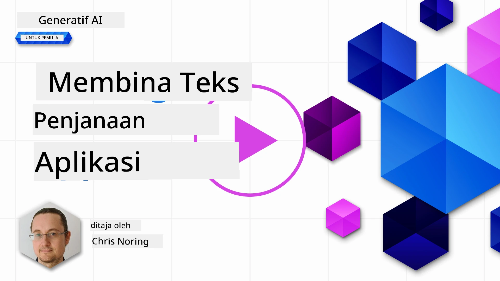

# Membina Aplikasi Penjanaan Teks

[](https://youtu.be/0Y5Luf5sRQA?si=t_xVg0clnAI4oUFZ)

> _(Klik imej di atas untuk menonton video pelajaran ini)_

Anda telah melihat setakat ini melalui kurikulum ini bahawa terdapat konsep teras seperti arahan (prompts) dan bahkan satu disiplin lengkap yang dipanggil "jurutera arahan" (prompt engineering). Banyak alat yang anda boleh berinteraksi dengannya seperti ChatGPT, Office 365, Microsoft Power Platform dan lain-lain, menyokong penggunaan arahan untuk mencapai sesuatu.

Untuk anda menambah pengalaman sedemikian ke dalam sebuah aplikasi, anda perlu memahami konsep seperti arahan, penyelesaian (completions) dan memilih perpustakaan untuk digunakan. Itu tepat apa yang anda akan pelajari dalam bab ini.

## Pengenalan

Dalam bab ini, anda akan:

- Mempelajari tentang perpustakaan openai dan konsep terasnya.
- Membina aplikasi penjanaan teks menggunakan openai.
- Memahami bagaimana menggunakan konsep seperti arahan (prompt), suhu (temperature), dan token untuk membina aplikasi penjanaan teks.

## Matlamat pembelajaran

Pada akhir pelajaran ini, anda akan dapat:

- Menjelaskan apa itu aplikasi penjanaan teks.
- Membina aplikasi penjanaan teks menggunakan openai.
- Mengkonfigurasi aplikasi anda untuk menggunakan lebih atau kurang token dan juga mengubah suhu, untuk hasil yang bervariasi.

## Apakah itu aplikasi penjanaan teks?

Biasanya apabila anda membina aplikasi ia mempunyai jenis antara muka seperti berikut:

- Berasaskan arahan. Aplikasi konsol adalah aplikasi biasa di mana anda menaip arahan dan ia melaksanakan tugas. Contohnya, `git` adalah aplikasi berasaskan arahan.
- Antara muka pengguna (UI). Sesetengah aplikasi mempunyai antara muka pengguna grafik (GUI) di mana anda klik butang, masukkan teks, pilih pilihan dan lain-lain.

### Aplikasi Konsol dan UI ada keterbatasan

Bandingkan dengan aplikasi berasaskan arahan di mana anda menaip arahan:

- **Ia terhad**. Anda tidak boleh menaip sebarang arahan, hanya yang disokong oleh aplikasi.
- **Spesifik bahasa**. Sesetengah aplikasi menyokong banyak bahasa, tetapi secara lalai aplikasi dibina untuk bahasa tertentu, walaupun anda boleh menambah sokongan bahasa lain.

### Kelebihan aplikasi penjanaan teks

Jadi bagaimana aplikasi penjanaan teks berbeza?

Dalam aplikasi penjanaan teks, anda mempunyai lebih banyak fleksibiliti, anda tidak terhad kepada set arahan atau bahasa input tertentu. Sebaliknya, anda boleh menggunakan bahasa semula jadi untuk berinteraksi dengan aplikasi. Satu lagi kelebihan adalah anda sudah berinteraksi dengan sumber data yang telah dilatih pada korpus maklumat yang luas, manakala aplikasi tradisional mungkin terhad kepada apa yang ada dalam pangkalan data.

### Apa yang saya boleh bina dengan aplikasi penjanaan teks?

Terdapat banyak perkara yang boleh anda bina. Contohnya:

- **Chatbot**. Chatbot menjawab soalan mengenai topik, seperti syarikat anda dan produk-produknya boleh menjadi padanan yang baik.
- **Pembantu**. LLM hebat dalam perkara seperti meringkaskan teks, mendapatkan maklumat daripada teks, menghasilkan teks seperti resume dan banyak lagi.
- **Pembantu kod**. Bergantung pada model bahasa yang anda guna, anda boleh bina pembantu kod yang membantu anda menulis kod. Contohnya, anda boleh menggunakan produk seperti GitHub Copilot serta ChatGPT untuk membantu menulis kod.

## Bagaimana saya boleh bermula?

Baiklah, anda perlu mencari cara untuk berintegrasi dengan LLM yang biasanya melibatkan dua pendekatan berikut:

- Gunakan API. Di sini anda membina permintaan web dengan arahan anda dan mendapat teks yang dijana kembali.
- Gunakan perpustakaan. Perpustakaan membantu menginkapsulasi panggilan API dan memudahkan penggunaannya.

## Perpustakaan/SDK

Terdapat beberapa perpustakaan terkenal untuk bekerja dengan LLM seperti:

- **openai**, perpustakaan ini memudahkan untuk menyambung ke model anda dan menghantar arahan.

Kemudian terdapat perpustakaan yang beroperasi pada tahap lebih tinggi seperti:

- **Langchain**. Langchain terkenal dan menyokong Python.
- **Semantic Kernel**. Semantic Kernel adalah perpustakaan oleh Microsoft yang menyokong bahasa C#, Python, dan Java.

## Aplikasi pertama menggunakan openai

Mari kita lihat bagaimana kita boleh membina aplikasi pertama kita, perpustakaan apa yang kita perlukan, berapa banyak yang diperlukan dan sebagainya.

### Pasang openai

Terdapat banyak perpustakaan untuk berinteraksi dengan OpenAI atau Azure OpenAI. Anda juga boleh menggunakan pelbagai bahasa pengaturcaraan seperti C#, Python, JavaScript, Java dan lain-lain. Kami memilih untuk menggunakan perpustakaan Python `openai`, jadi kita akan gunakan `pip` untuk memasangnya.

```bash
pip install openai
```

### Cipta sumber

Anda perlu melaksanakan langkah-langkah berikut:

- Cipta akaun di Azure [https://azure.microsoft.com/free/](https://azure.microsoft.com/free/?WT.mc_id=academic-105485-koreyst).
- Dapatkan akses ke Azure OpenAI. Pergi ke [https://learn.microsoft.com/azure/ai-services/openai/overview#how-do-i-get-access-to-azure-openai](https://learn.microsoft.com/azure/ai-services/openai/overview#how-do-i-get-access-to-azure-openai?WT.mc_id=academic-105485-koreyst) dan mohon akses.

  > [!NOTE]
  > Pada masa penulisan, anda perlu memohon akses ke Azure OpenAI.

- Pasang Python <https://www.python.org/>
- Telah mencipta sumber Azure OpenAI Service. Lihat panduan ini untuk cara [mencipta sumber](https://learn.microsoft.com/azure/ai-services/openai/how-to/create-resource?pivots=web-portal?WT.mc_id=academic-105485-koreyst).

### Cari kunci API dan titik hujung

Pada tahap ini, anda perlu beritahu perpustakaan `openai` kunci API yang hendak digunakan. Untuk mencari kunci API, pergi ke bahagian "Keys and Endpoint" sumber Azure OpenAI anda dan salin nilai "Key 1".


Sekarang anda sudah menyalin maklumat ini, mari kita perintahkan perpustakaan untuk menggunakannya.

> [!NOTE]
> Adalah baik untuk memisahkan kunci API anda dari kod anda. Anda boleh melakukannya dengan menggunakan pembolehubah persekitaran.
>
> - Tetapkan pembolehubah persekitaran `OPENAI_API_KEY` kepada kunci API anda.
>   `export OPENAI_API_KEY='sk-...'`

### Sediakan konfigurasi Azure

Jika anda menggunakan Azure OpenAI (sekarang sebahagian daripada Microsoft Foundry), berikut adalah cara anda menyediakan konfigurasi. Kami menggunakan klien standard `OpenAI` yang ditunjukkan ke titik hujung Azure OpenAI `/openai/v1/`, yang berfungsi dengan Responses API dan tidak memerlukan `api_version`:

```python
import os
from openai import OpenAI

client = OpenAI(
    api_key=os.environ["AZURE_OPENAI_API_KEY"],
    base_url=f"{os.environ['AZURE_OPENAI_ENDPOINT'].rstrip('/')}/openai/v1/",
)
```

Di atas kami menetapkan perkara berikut:

- `api_key`, ini adalah kunci API anda yang dijumpai di Azure Portal atau portal Microsoft Foundry.
- `base_url`, ini adalah titik hujung sumber Foundry anda dengan `/openai/v1/` dilampirkan. Titik hujung v1 stabil ini berfungsi merentas OpenAI dan Azure OpenAI tanpa pengurusan `api_version`.

> [!NOTE] > `os.environ` membaca pembolehubah persekitaran. Anda boleh menggunakannya untuk membaca pembolehubah persekitaran seperti `AZURE_OPENAI_API_KEY` dan `AZURE_OPENAI_ENDPOINT`. Tetapkan pembolehubah persekitaran ini di terminal anda atau dengan menggunakan perpustakaan seperti `dotenv`.

## Menjana teks

Cara menjana teks adalah menggunakan Responses API melalui kaedah `responses.create`. Berikut contoh:

```python
prompt = "Complete the following: Once upon a time there was a"

response = client.responses.create(
    model="gpt-4o-mini",  # ini adalah nama penerapan model anda
    input=prompt,
    store=False,
)
print(response.output_text)
```

Dalam kod di atas, kami mencipta respons dan menghantar model yang kami mahu guna serta arahan (prompt). Kemudian kami cetak teks yang dijana melalui `response.output_text`.

### Perbualan pelbagai giliran

Responses API sesuai untuk penjanaan teks satu giliran dan chatbot pelbagai giliran - anda menyediakan senarai mesej dalam `input` untuk membina perbualan:

```python
from openai import OpenAI

client = OpenAI(api_key="sk-...")

response = client.responses.create(model="gpt-4o-mini", input="Hello world", store=False)
print(response.output_text)
```

Lebih lanjut mengenai fungsi ini dalam bab yang akan datang.

## Latihan - aplikasi penjanaan teks pertama anda

Sekarang kita sudah belajar cara menyediakan dan mengkonfigurasi openai, tiba masanya untuk membina aplikasi penjanaan teks pertama anda. Untuk membina aplikasi anda, ikut langkah-langkah berikut:

1. Cipta persekitaran maya dan pasang openai:

   ```bash
   python -m venv venv
   source venv/bin/activate
   pip install openai
   ```

   > [!NOTE]
   > Jika anda menggunakan Windows taip `venv\Scripts\activate` dan bukannya `source venv/bin/activate`.

   > [!NOTE]
   > Cari kunci Azure OpenAI anda dengan pergi ke [https://portal.azure.com/](https://portal.azure.com/?WT.mc_id=academic-105485-koreyst) dan cari `Open AI` dan pilih `Open AI resource` kemudian pilih `Keys and Endpoint` dan salin nilai `Key 1`.

1. Cipta fail _app.py_ dan berikan kod berikut:

   ```python
   import os
   from openai import OpenAI

   client = OpenAI(
       api_key="<replace this value with your Azure OpenAI key>",
       base_url="<endpoint found in Azure Portal>/openai/v1/",
   )
   deployment_name = "<deployment name>"

   # tambah kod penyelesaian anda
   prompt = "Complete the following: Once upon a time there was a"

   # buat permintaan menggunakan API Responses
   response = client.responses.create(model=deployment_name, input=prompt, store=False)

   # cetak respons
   print(response.output_text)
   ```

   > [!NOTE]
   > Jika anda menggunakan OpenAI biasa (bukan Azure), gunakan `client = OpenAI(api_key="<gantikan nilai ini dengan kunci OpenAI anda>")` (tiada `base_url`) dan hantar nama model seperti `gpt-4o-mini` bukan nama deployment.

   Anda sepatutnya melihat output seperti berikut:

   ```output
    very unhappy _____.

   Once upon a time there was a very unhappy mermaid.
   ```

## Jenis-jenis arahan (prompts) berbeza, untuk perkara berbeza

Kini anda telah melihat cara menjana teks menggunakan arahan. Anda juga sudah mempunyai program yang berfungsi yang boleh anda ubah dan sesuaikan untuk menjana jenis teks berbeza.

Arahan boleh digunakan untuk pelbagai jenis tugasan. Contohnya:

- **Menjana jenis teks**. Contohnya, anda boleh menjana puisi, soalan untuk kuiz dan sebagainya.
- **Mencari maklumat**. Anda boleh menggunakan arahan untuk mencari maklumat seperti contoh berikut 'Apa maksud CORS dalam pembangunan web?'.
- **Menjana kod**. Anda boleh menggunakan arahan untuk menjana kod, contohnya membangunkan ekspresi biasa yang digunakan untuk mengesahkan e-mel atau mengapa tidak menjana keseluruhan program, seperti aplikasi web?

## Kegunaan lebih praktikal: penjana resipi

Bayangkan anda mempunyai bahan di rumah dan anda ingin memasak sesuatu. Untuk itu, anda memerlukan resipi. Cara untuk mencari resipi adalah menggunakan enjin carian atau anda boleh menggunakan LLM untuk berbuat demikian.

Anda boleh menulis arahan seperti berikut:

> "Tunjukkan saya 5 resipi untuk hidangan dengan bahan berikut: ayam, kentang, dan lobak merah. Pada setiap resipi, senaraikan semua bahan yang digunakan"

Berdasarkan arahan di atas, anda mungkin mendapat respons serupa:

```output
1. Roasted Chicken and Vegetables:
Ingredients:
- 4 chicken thighs
- 2 potatoes, cut into cubes
- 2 carrots, cut into cubes
- 2 tablespoons olive oil
- 2 cloves garlic, minced
- 1 teaspoon dried thyme
- 1 teaspoon dried oregano
- Salt and pepper, to taste

2. Chicken and Potato Stew:
Ingredients:
- 2 tablespoons olive oil
- 1 onion, diced
- 2 cloves garlic, minced
- 2 chicken breasts, cut into cubes
- 2 potatoes, cut into cubes
- 2 carrots, cut into cubes
- 1 teaspoon dried oregano
- 1 teaspoon dried thyme
- 1 cup chicken broth
- Salt and pepper, to taste

3. Chicken and Potato Bake:
Ingredients:
- 2 tablespoons olive oil
- 2 chicken breasts, cut into cubes
- 2 potatoes, cut into cubes
- 2 carrots, cut into cubes
- 1 onion, diced
- 2 cloves garlic, minced
- 1 teaspoon dried oregano
- 1 teaspoon dried thyme
- 1 cup chicken broth
- Salt and pepper, to taste

4. Chicken and Potato Soup:
Ingredients:
- 2 tablespoons olive oil
- 1 onion, diced
- 2 cloves garlic, minced
- 2 chicken breasts, cut into cubes
- 2 potatoes, cut into cubes
- 2 carrots, cut into cubes
- 1 teaspoon dried oregano
- 1 teaspoon dried thyme
- 4 cups chicken broth
- Salt and pepper, to taste

5. Chicken and Potato Hash:
Ingredients:
- 2 tablespoons olive oil
- 2 chicken breasts, cut into cubes
- 2 potatoes, cut into cubes
- 2 carrots, cut into cubes
- 1 onion, diced
- 2 cloves garlic, minced
- 1 teaspoon dried oregano
```

Keputusan ini bagus, saya tahu apa nak masak. Pada tahap ini, apa yang boleh menjadi penambahbaikan berguna adalah:

- Menapis bahan yang saya tidak suka atau saya alah.
- Menghasilkan senarai membeli-belah, sekiranya saya tidak mempunyai semua bahan di rumah.

Untuk kes di atas, mari tambahkan arahan tambahan:

> "Sila buang resipi yang ada bawang putih kerana saya alah dan gantikan dengan sesuatu yang lain. Juga, sila hasilkan senarai membeli-belah untuk resipi ini, mengambil kira saya sudah ada ayam, kentang dan lobak merah di rumah."

Kini anda mempunyai keputusan baru, iaitu:

```output
1. Roasted Chicken and Vegetables:
Ingredients:
- 4 chicken thighs
- 2 potatoes, cut into cubes
- 2 carrots, cut into cubes
- 2 tablespoons olive oil
- 1 teaspoon dried thyme
- 1 teaspoon dried oregano
- Salt and pepper, to taste

2. Chicken and Potato Stew:
Ingredients:
- 2 tablespoons olive oil
- 1 onion, diced
- 2 chicken breasts, cut into cubes
- 2 potatoes, cut into cubes
- 2 carrots, cut into cubes
- 1 teaspoon dried oregano
- 1 teaspoon dried thyme
- 1 cup chicken broth
- Salt and pepper, to taste

3. Chicken and Potato Bake:
Ingredients:
- 2 tablespoons olive oil
- 2 chicken breasts, cut into cubes
- 2 potatoes, cut into cubes
- 2 carrots, cut into cubes
- 1 onion, diced
- 1 teaspoon dried oregano
- 1 teaspoon dried thyme
- 1 cup chicken broth
- Salt and pepper, to taste

4. Chicken and Potato Soup:
Ingredients:
- 2 tablespoons olive oil
- 1 onion, diced
- 2 chicken breasts, cut into cubes
- 2 potatoes, cut into cubes
- 2 carrots, cut into cubes
- 1 teaspoon dried oregano
- 1 teaspoon dried thyme
- 4 cups chicken broth
- Salt and pepper, to taste

5. Chicken and Potato Hash:
Ingredients:
- 2 tablespoons olive oil
- 2 chicken breasts, cut into cubes
- 2 potatoes, cut into cubes
- 2 carrots, cut into cubes
- 1 onion, diced
- 1 teaspoon dried oregano

Shopping List:
- Olive oil
- Onion
- Thyme
- Oregano
- Salt
- Pepper
```

Itu adalah lima resipi anda, tanpa bawang putih disebut dan anda juga mempunyai senarai membeli-belah mengambil kira apa yang anda sudah ada di rumah.

## Latihan - bina penjana resipi

Sekarang kita sudah memainkan senario, mari tulis kod yang sepadan dengan senario yang telah ditunjukkan. Untuk berbuat demikian, ikut langkah berikut:

1. Gunakan fail _app.py_ sedia ada sebagai titik mula
1. Cari pembolehubah `prompt` dan ubah kodnya kepada yang berikut:

   ```python
   prompt = "Show me 5 recipes for a dish with the following ingredients: chicken, potatoes, and carrots. Per recipe, list all the ingredients used"
   ```

   Jika anda sekarang menjalankan kod, anda harus lihat output yang serupa:

   ```output
   -Chicken Stew with Potatoes and Carrots: 3 tablespoons oil, 1 onion, chopped, 2 cloves garlic, minced, 1 carrot, peeled and chopped, 1 potato, peeled and chopped, 1 bay leaf, 1 thyme sprig, 1/2 teaspoon salt, 1/4 teaspoon black pepper, 1 1/2 cups chicken broth, 1/2 cup dry white wine, 2 tablespoons chopped fresh parsley, 2 tablespoons unsalted butter, 1 1/2 pounds boneless, skinless chicken thighs, cut into 1-inch pieces
   -Oven-Roasted Chicken with Potatoes and Carrots: 3 tablespoons extra-virgin olive oil, 1 tablespoon Dijon mustard, 1 tablespoon chopped fresh rosemary, 1 tablespoon chopped fresh thyme, 4 cloves garlic, minced, 1 1/2 pounds small red potatoes, quartered, 1 1/2 pounds carrots, quartered lengthwise, 1/2 teaspoon salt, 1/4 teaspoon black pepper, 1 (4-pound) whole chicken
   -Chicken, Potato, and Carrot Casserole: cooking spray, 1 large onion, chopped, 2 cloves garlic, minced, 1 carrot, peeled and shredded, 1 potato, peeled and shredded, 1/2 teaspoon dried thyme leaves, 1/4 teaspoon salt, 1/4 teaspoon black pepper, 2 cups fat-free, low-sodium chicken broth, 1 cup frozen peas, 1/4 cup all-purpose flour, 1 cup 2% reduced-fat milk, 1/4 cup grated Parmesan cheese

   -One Pot Chicken and Potato Dinner: 2 tablespoons olive oil, 1 pound boneless, skinless chicken thighs, cut into 1-inch pieces, 1 large onion, chopped, 3 cloves garlic, minced, 1 carrot, peeled and chopped, 1 potato, peeled and chopped, 1 bay leaf, 1 thyme sprig, 1/2 teaspoon salt, 1/4 teaspoon black pepper, 2 cups chicken broth, 1/2 cup dry white wine

   -Chicken, Potato, and Carrot Curry: 1 tablespoon vegetable oil, 1 large onion, chopped, 2 cloves garlic, minced, 1 carrot, peeled and chopped, 1 potato, peeled and chopped, 1 teaspoon ground coriander, 1 teaspoon ground cumin, 1/2 teaspoon ground turmeric, 1/2 teaspoon ground ginger, 1/4 teaspoon cayenne pepper, 2 cups chicken broth, 1/2 cup dry white wine, 1 (15-ounce) can chickpeas, drained and rinsed, 1/2 cup raisins, 1/2 cup chopped fresh cilantro
   ```

   > NOTA, LLM anda tidak deterministik, jadi anda mungkin mendapat keputusan berbeza setiap kali anda jalankan program.

   Bagus, mari kita lihat bagaimana kita boleh memperbaiki perkara. Untuk memperbaiki, kita mahu pastikan kod itu fleksibel, jadi bahan dan bilangan resipi boleh diperbaiki dan diubah.

1. Mari ubah kod dengan cara berikut:

   ```python
   no_recipes = input("No of recipes (for example, 5): ")

   ingredients = input("List of ingredients (for example, chicken, potatoes, and carrots): ")

   # selitkan bilangan resipi ke dalam petunjuk dan bahan-bahan
   prompt = f"Show me {no_recipes} recipes for a dish with the following ingredients: {ingredients}. Per recipe, list all the ingredients used"
   ```

   Menjalankan kod ujian boleh kelihatan seperti ini:

   ```output
   No of recipes (for example, 5): 3
   List of ingredients (for example, chicken, potatoes, and carrots): milk,strawberries

   -Strawberry milk shake: milk, strawberries, sugar, vanilla extract, ice cubes
   -Strawberry shortcake: milk, flour, baking powder, sugar, salt, unsalted butter, strawberries, whipped cream
   -Strawberry milk: milk, strawberries, sugar, vanilla extract
   ```

### Memperbaiki dengan menambah penapis dan senarai membeli-belah

Kini kita mempunyai aplikasi yang berfungsi mampu menghasilkan resipi dan ia fleksibel kerana bergantung pada input pengguna, baik dari segi bilangan resipi dan juga bahan yang digunakan.

Untuk memperbaikinya lagi, kita mahu tambah perkara berikut:

- **Menapis bahan**. Kita mahu boleh menapis bahan yang kita tidak suka atau kita alah. Untuk melaksanakan perubahan ini, kita boleh sunting arahan sedia ada dan tambah syarat penapis di hujung arahan seperti berikut:

  ```python
  filter = input("Filter (for example, vegetarian, vegan, or gluten-free): ")

  prompt = f"Show me {no_recipes} recipes for a dish with the following ingredients: {ingredients}. Per recipe, list all the ingredients used, no {filter}"
  ```

  Di atas, kami tambah `{filter}` di hujung arahan dan kami juga tangkap nilai penapis daripada pengguna.

  Contoh input menjalankan program kini boleh kelihatan seperti ini:

  ```output
  No of recipes (for example, 5): 3
  List of ingredients (for example, chicken, potatoes, and carrots): onion,milk
  Filter (for example, vegetarian, vegan, or gluten-free): no milk

  1. French Onion Soup

  Ingredients:

  -1 large onion, sliced
  -3 cups beef broth
  -1 cup milk
  -6 slices french bread
  -1/4 cup shredded Parmesan cheese
  -1 tablespoon butter
  -1 teaspoon dried thyme
  -1/4 teaspoon salt
  -1/4 teaspoon black pepper

  Instructions:

  1. In a large pot, sauté onions in butter until golden brown.
  2. Add beef broth, milk, thyme, salt, and pepper. Bring to a boil.
  3. Reduce heat and simmer for 10 minutes.
  4. Place french bread slices on soup bowls.
  5. Ladle soup over bread.
  6. Sprinkle with Parmesan cheese.

  2. Onion and Potato Soup

  Ingredients:

  -1 large onion, chopped
  -2 cups potatoes, diced
  -3 cups vegetable broth
  -1 cup milk
  -1/4 teaspoon black pepper

  Instructions:

  1. In a large pot, sauté onions in butter until golden brown.
  2. Add potatoes, vegetable broth, milk, and pepper. Bring to a boil.
  3. Reduce heat and simmer for 10 minutes.
  4. Serve hot.

  3. Creamy Onion Soup

  Ingredients:

  -1 large onion, chopped
  -3 cups vegetable broth
  -1 cup milk
  -1/4 teaspoon black pepper
  -1/4 cup all-purpose flour
  -1/2 cup shredded Parmesan cheese

  Instructions:

  1. In a large pot, sauté onions in butter until golden brown.
  2. Add vegetable broth, milk, and pepper. Bring to a boil.
  3. Reduce heat and simmer for 10 minutes.
  4. In a small bowl, whisk together flour and Parmesan cheese until smooth.
  5. Add to soup and simmer for an additional 5 minutes, or until soup has thickened.
  ```

  Seperti yang anda lihat, mana-mana resipi yang ada susu telah ditapis keluar. Tetapi, jika anda intoleran laktosa, anda mungkin mahu menapis resipi yang ada keju juga, jadi perlu ada penjelasan lebih jelas.


- **Hasilkan senarai beli-belah**. Kami ingin menghasilkan senarai beli-belah, mengambil kira apa yang sudah kami ada di rumah.

  Untuk fungsi ini, kami boleh cuba menyelesaikan semuanya dalam satu perintah atau kami boleh membahagikannya kepada dua perintah. Mari kita cuba pendekatan yang kedua. Di sini kami mencadangkan menambah satu perintah tambahan, tetapi untuk itu berfungsi, kami perlu menambah hasil dari perintah yang pertama sebagai konteks kepada perintah yang kedua.

  Cari bahagian dalam kod yang mencetak hasil dari perintah pertama dan tambahkan kod berikut di bawah:

  ```python
  old_prompt_result = response.output_text
  prompt = "Produce a shopping list for the generated recipes and please don't include ingredients that I already have."

  new_prompt = f"{old_prompt_result} {prompt}"
  response = client.responses.create(model=deployment_name, input=new_prompt, max_output_tokens=1200, store=False)

  # cetak respons
  print("Shopping list:")
  print(response.output_text)
  ```

  Perhatikan perkara berikut:

  1. Kami membina perintah baru dengan menambah hasil dari perintah pertama ke perintah baru:

     ```python
     new_prompt = f"{old_prompt_result} {prompt}"
     ```

  1. Kami membuat permintaan baru, tetapi juga mengambil kira jumlah token yang kami minta dalam perintah pertama, jadi kali ini kami tetapkan `max_output_tokens` kepada 1200.

     ```python
     response = client.responses.create(model=deployment_name, input=new_prompt, max_output_tokens=1200, store=False)
     ```

     Dengan menjalankan kod ini, kami kini mendapat output berikut:

     ```output
     No of recipes (for example, 5): 2
     List of ingredients (for example, chicken, potatoes, and carrots): apple,flour
     Filter (for example, vegetarian, vegan, or gluten-free): sugar


     -Apple and flour pancakes: 1 cup flour, 1/2 tsp baking powder, 1/2 tsp baking soda, 1/4 tsp salt, 1 tbsp sugar, 1 egg, 1 cup buttermilk or sour milk, 1/4 cup melted butter, 1 Granny Smith apple, peeled and grated
     -Apple fritters: 1-1/2 cups flour, 1 tsp baking powder, 1/4 tsp salt, 1/4 tsp baking soda, 1/4 tsp nutmeg, 1/4 tsp cinnamon, 1/4 tsp allspice, 1/4 cup sugar, 1/4 cup vegetable shortening, 1/4 cup milk, 1 egg, 2 cups shredded, peeled apples
     Shopping list:
     -Flour, baking powder, baking soda, salt, sugar, egg, buttermilk, butter, apple, nutmeg, cinnamon, allspice
     ```

## Perbaiki tetapan anda

Apa yang kami ada setakat ini adalah kod yang berfungsi, tetapi ada beberapa penambahbaikan yang harus kami lakukan untuk mempertingkatkan lagi. Beberapa perkara yang harus kami lakukan adalah:

- **Pisahkan rahsia dari kod**, seperti kunci API. Rahsia tidak sepatutnya berada dalam kod dan harus disimpan di lokasi yang selamat. Untuk memisahkan rahsia dari kod, kami boleh guna pemboleh ubah persekitaran dan perpustakaan seperti `python-dotenv` untuk memuatkannya dari fail. Berikut adalah bagaimana ia akan kelihatan dalam kod:

  1. Cipta fail `.env` dengan kandungan berikut:

     ```bash
     OPENAI_API_KEY=sk-...
     ```

     > Nota, untuk Azure OpenAI dalam Microsoft Foundry, anda perlu tetapkan pemboleh ubah persekitaran berikut sebagai gantinya:

     ```bash
     AZURE_OPENAI_API_KEY=<replace>
     AZURE_OPENAI_ENDPOINT=<replace>
     AZURE_OPENAI_API_VERSION=2024-10-21
     ```

     Dalam kod, anda akan memuat pemboleh ubah persekitaran seperti berikut:

     ```python
     import os
     from dotenv import load_dotenv
     from openai import OpenAI

     load_dotenv()

     client = OpenAI(api_key=os.environ["OPENAI_API_KEY"])
     ```

- **Satu kata tentang panjang token**. Kami harus pertimbangkan berapa banyak token yang diperlukan untuk menjana teks yang kami mahukan. Token memerlukan kos, jadi jika boleh, kami harus cuba berjimat dengan jumlah token yang digunakan. Sebagai contoh, bolehkah kami susun perintah agar menggunakan token yang lebih sedikit?

  Untuk mengubah jumlah token yang digunakan, anda boleh guna parameter `max_output_tokens`. Sebagai contoh, jika anda mahu menggunakan 100 token, anda boleh lakukan:

  ```python
  response = client.responses.create(model=deployment, input=prompt, max_output_tokens=100, store=False)
  ```

- **Eksperimen dengan suhu**. Suhu adalah sesuatu yang belum kami sebut setakat ini tetapi penting sebagai konteks bagaimana program kami berfungsi. Nilai suhu yang lebih tinggi menyebabkan output menjadi lebih rawak. Sebaliknya, nilai suhu yang lebih rendah menyebabkan output menjadi lebih boleh diramal. Pertimbangkan sama ada anda mahukan variasi dalam output anda atau tidak.

  Untuk mengubah suhu, anda boleh guna parameter `temperature`. Sebagai contoh, jika anda mahu menggunakan suhu 0.5, anda boleh lakukan:

  ```python
  response = client.responses.create(model=deployment, input=prompt, temperature=0.5, store=False)
  ```

  > Nota, semakin hampir kepada 1.0, semakin banyak variasi output.

## Tugasan

Untuk tugasan ini, anda boleh memilih apa yang mahu dibina.

Berikut adalah beberapa cadangan:

- Penambahbaiki aplikasi penjana resipi mengikut keperluan. Cuba main dengan nilai suhu, dan perintah untuk lihat apa yang boleh anda hasilkan.
- Bina "rakan belajar". Aplikasi ini harus mampu menjawab soalan tentang sesuatu topik contohnya Python, anda boleh ada perintah seperti "Apa itu topik tertentu dalam Python?", atau anda boleh ada perintah yang berkata, tunjukkan saya kod untuk topik tertentu dan sebagainya.
- Bot sejarah, hidupkan sejarah, arahkan bot untuk memainkan watak sejarah tertentu dan tanya soalan tentang kehidupan dan zamannya.

## Penyelesaian

### Rakan belajar

Berikut adalah perintah permulaan, lihat bagaimana anda boleh guna dan ubah suai mengikut citarasa anda.

```text
- "You're an expert on the Python language

    Suggest a beginner lesson for Python in the following format:

    Format:
    - concepts:
    - brief explanation of the lesson:
    - exercise in code with solutions"
```

### Bot sejarah

Berikut adalah beberapa perintah yang boleh anda gunakan:

```text
- "You are Abe Lincoln, tell me about yourself in 3 sentences, and respond using grammar and words like Abe would have used"
- "You are Abe Lincoln, respond using grammar and words like Abe would have used:

   Tell me about your greatest accomplishments, in 300 words"
```

## Semak pengetahuan

Apa fungsi konsep suhu?

1. Ia mengawal seberapa rawak output.
1. Ia mengawal saiz respons.
1. Ia mengawal berapa banyak token digunakan.

## 🚀 Cabaran

Apabila mengerjakan tugasan, cuba ubah-ubah suhu, cuba tetapkan ke 0, 0.5, dan 1. Ingat bahawa 0 adalah variasi paling sedikit dan 1 adalah paling banyak. Nilai manakah yang paling sesuai untuk aplikasi anda?

## Kerja Hebat! Teruskan Pembelajaran Anda

Selepas menamatkan pelajaran ini, lihat koleksi [Pembelajaran AI Generatif kami](https://aka.ms/genai-collection?WT.mc_id=academic-105485-koreyst) untuk terus meningkatkan pengetahuan AI Generatif anda!

Pergi ke Pelajaran 7 di mana kami akan melihat cara untuk [membina aplikasi chat](../07-building-chat-applications/README.md?WT.mc_id=academic-105485-koreyst)!

---

<!-- CO-OP TRANSLATOR DISCLAIMER START -->
**Penafian**:
Dokumen ini telah diterjemahkan menggunakan perkhidmatan terjemahan AI [Co-op Translator](https://github.com/Azure/co-op-translator). Walaupun kami berusaha untuk ketepatan, sila ambil maklum bahawa terjemahan automatik mungkin mengandungi kesilapan atau ketidaktepatan. Dokumen asal dalam bahasa asalnya harus dianggap sebagai sumber yang sahih. Untuk maklumat penting, terjemahan oleh manusia profesional adalah disyorkan. Kami tidak bertanggungjawab terhadap sebarang salah faham atau salah tafsir yang timbul daripada penggunaan terjemahan ini.
<!-- CO-OP TRANSLATOR DISCLAIMER END -->