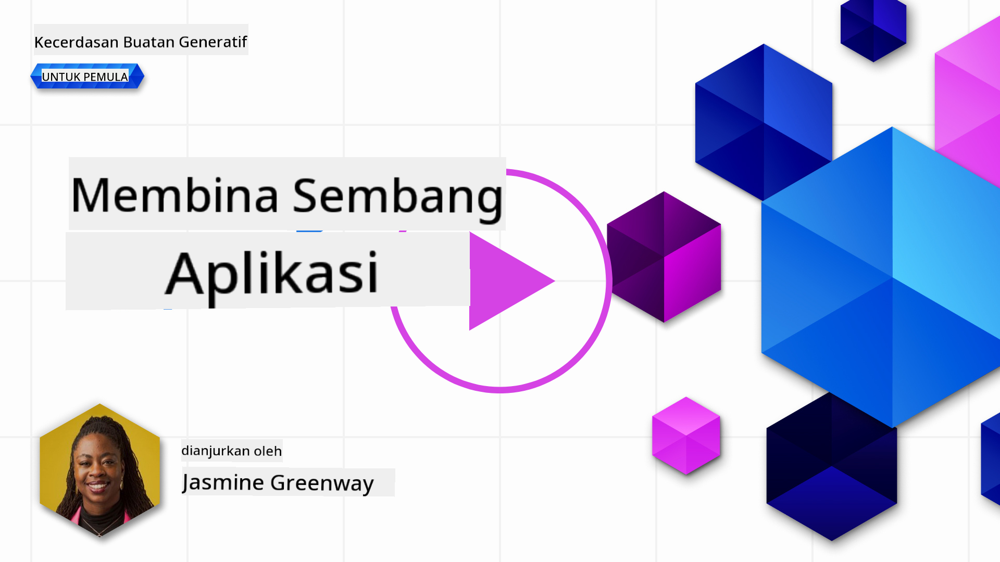
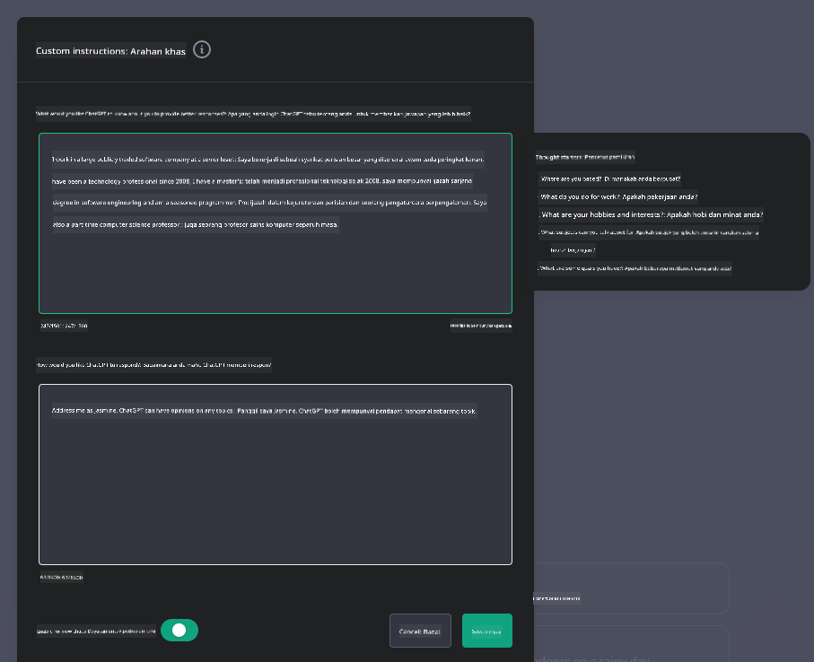
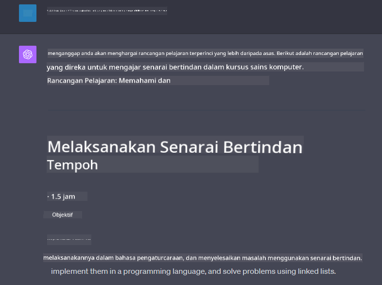

<!--
CO_OP_TRANSLATOR_METADATA:
{
  "original_hash": "ea4bbe640847aafbbba14dae4625e9af",
  "translation_date": "2025-06-25T15:46:29+00:00",
  "source_file": "07-building-chat-applications/README.md",
  "language_code": "ms"
}
-->
# Membangun Aplikasi Chat Berkuasa AI Generatif

[](https://aka.ms/gen-ai-lessons7-gh?WT.mc_id=academic-105485-koreyst)

> _(Klik gambar di atas untuk menonton video pelajaran ini)_

Sekarang kita telah melihat bagaimana kita boleh membina aplikasi penjanaan teks, mari kita lihat aplikasi chat.

Aplikasi chat telah menjadi sebahagian daripada kehidupan harian kita, menawarkan lebih daripada sekadar cara untuk berbual santai. Mereka adalah bahagian penting dalam perkhidmatan pelanggan, sokongan teknikal, dan juga sistem nasihat canggih. Kemungkinan besar anda telah mendapat bantuan daripada aplikasi chat tidak lama dahulu. Apabila kita mengintegrasikan teknologi yang lebih maju seperti AI generatif ke dalam platform ini, kerumitannya meningkat dan begitu juga cabarannya.

Beberapa soalan yang perlu kita jawab adalah:

- **Membina aplikasi**. Bagaimana kita boleh membina dan mengintegrasikan aplikasi berkuasa AI ini dengan cekap untuk kes penggunaan tertentu?
- **Pemantauan**. Setelah digunakan, bagaimana kita boleh memantau dan memastikan bahawa aplikasi beroperasi pada tahap kualiti tertinggi, baik dari segi fungsi dan mematuhi [enam prinsip AI bertanggungjawab](https://www.microsoft.com/ai/responsible-ai?WT.mc_id=academic-105485-koreyst)?

Ketika kita bergerak lebih jauh ke dalam zaman yang ditentukan oleh automasi dan interaksi manusia-mesin yang lancar, memahami bagaimana AI generatif mengubah skop, kedalaman, dan kebolehsuaian aplikasi chat menjadi penting. Pelajaran ini akan menyiasat aspek seni bina yang menyokong sistem rumit ini, mendalami metodologi untuk menyesuaikannya untuk tugas khusus domain, dan menilai metrik dan pertimbangan yang berkaitan untuk memastikan penggunaan AI yang bertanggungjawab.

## Pengenalan

Pelajaran ini merangkumi:

- Teknik untuk membina dan mengintegrasikan aplikasi chat dengan cekap.
- Cara untuk menerapkan penyesuaian dan penalaan halus kepada aplikasi.
- Strategi dan pertimbangan untuk memantau aplikasi chat dengan berkesan.

## Matlamat Pembelajaran

Menjelang akhir pelajaran ini, anda akan dapat:

- Menggambarkan pertimbangan untuk membina dan mengintegrasikan aplikasi chat ke dalam sistem yang sedia ada.
- Menyesuaikan aplikasi chat untuk kes penggunaan tertentu.
- Mengenal pasti metrik utama dan pertimbangan untuk memantau dan mengekalkan kualiti aplikasi chat berkuasa AI dengan berkesan.
- Memastikan aplikasi chat memanfaatkan AI dengan bertanggungjawab.

## Mengintegrasikan AI Generatif ke dalam Aplikasi Chat

Meningkatkan aplikasi chat melalui AI generatif bukan hanya tertumpu kepada menjadikannya lebih pintar; ia adalah tentang mengoptimumkan seni bina, prestasi, dan antara muka pengguna mereka untuk memberikan pengalaman pengguna yang berkualiti. Ini melibatkan penyiasatan asas seni bina, integrasi API, dan pertimbangan antara muka pengguna. Bahagian ini bertujuan untuk menawarkan anda peta jalan komprehensif untuk menavigasi landskap yang kompleks ini, sama ada anda memasangnya ke dalam sistem yang sedia ada atau membinanya sebagai platform berdiri sendiri.

Menjelang akhir bahagian ini, anda akan dilengkapi dengan kepakaran yang diperlukan untuk membina dan menggabungkan aplikasi chat dengan cekap.

### Chatbot atau Aplikasi Chat?

Sebelum kita mendalami pembinaan aplikasi chat, mari kita bandingkan 'chatbots' dengan 'aplikasi chat berkuasa AI,' yang berfungsi dan memainkan peranan yang berbeza. Tujuan utama chatbot adalah untuk mengautomasikan tugas perbualan tertentu, seperti menjawab soalan yang sering ditanya atau menjejaki pakej. Ia biasanya dikawal oleh logik berasaskan peraturan atau algoritma AI yang kompleks. Sebaliknya, aplikasi chat berkuasa AI adalah persekitaran yang jauh lebih luas yang direka untuk memudahkan pelbagai bentuk komunikasi digital, seperti teks, suara, dan video antara pengguna manusia. Ciri penentu adalah integrasi model AI generatif yang mensimulasikan perbualan yang bernuansa, seperti manusia, menghasilkan respons berdasarkan pelbagai input dan petunjuk kontekstual. Aplikasi chat berkuasa AI generatif boleh terlibat dalam perbincangan domain terbuka, menyesuaikan diri dengan konteks perbualan yang berkembang, dan juga menghasilkan dialog yang kreatif atau kompleks.

Jadual di bawah menggariskan perbezaan dan persamaan utama untuk membantu kita memahami peranan unik mereka dalam komunikasi digital.

| Chatbot                               | Aplikasi Chat Berkuasa AI Generatif    |
| ------------------------------------- | -------------------------------------- |
| Berfokus kepada tugas dan berasaskan peraturan | Sedar konteks                          |
| Sering diintegrasikan ke dalam sistem yang lebih besar | Boleh menjadi tuan rumah satu atau beberapa chatbot |
| Terhad kepada fungsi yang diprogramkan | Menggabungkan model AI generatif       |
| Interaksi khusus & berstruktur        | Mampu perbincangan domain terbuka      |

### Memanfaatkan fungsi yang telah dibina dengan SDK dan API

Apabila membina aplikasi chat, langkah pertama yang baik adalah menilai apa yang sudah ada di luar sana. Menggunakan SDK dan API untuk membina aplikasi chat adalah strategi yang menguntungkan untuk pelbagai sebab. Dengan mengintegrasikan SDK dan API yang didokumentasikan dengan baik, anda meletakkan aplikasi anda secara strategik untuk kejayaan jangka panjang, menangani kebimbangan skalabiliti dan penyelenggaraan.

- **Mempercepatkan proses pembangunan dan mengurangkan overhead**: Mengandalkan fungsi yang telah dibina daripada proses yang mahal untuk membinanya sendiri membolehkan anda memberi tumpuan kepada aspek lain aplikasi anda yang mungkin anda anggap lebih penting, seperti logik perniagaan.
- **Prestasi yang lebih baik**: Apabila membina fungsi dari awal, anda akhirnya akan bertanya kepada diri sendiri "Bagaimana ia skala? Adakah aplikasi ini mampu menangani lonjakan pengguna secara tiba-tiba?" SDK dan API yang diselenggara dengan baik sering mempunyai penyelesaian terbina dalam untuk kebimbangan ini.
- **Penyelenggaraan yang lebih mudah**: Kemas kini dan penambahbaikan lebih mudah diuruskan kerana kebanyakan API dan SDK hanya memerlukan kemas kini ke perpustakaan apabila versi yang lebih baru dikeluarkan.
- **Akses kepada teknologi terkini**: Memanfaatkan model yang telah ditala halus dan dilatih pada set data yang luas memberikan aplikasi anda keupayaan bahasa semula jadi.

Mengakses fungsi SDK atau API biasanya melibatkan mendapatkan kebenaran untuk menggunakan perkhidmatan yang disediakan, yang sering dilakukan melalui penggunaan kunci unik atau token pengesahan. Kita akan menggunakan OpenAI Python Library untuk meneroka bagaimana rupa ini. Anda juga boleh mencubanya sendiri dalam [notebook untuk OpenAI](../../../07-building-chat-applications/python/oai-assignment.ipynb) atau [notebook untuk Azure OpenAI Services](../../../07-building-chat-applications/python/aoai-assignment.ipynb) untuk pelajaran ini.

```python
import os
from openai import OpenAI

API_KEY = os.getenv("OPENAI_API_KEY","")

client = OpenAI(
    api_key=API_KEY
    )

chat_completion = client.chat.completions.create(model="gpt-3.5-turbo", messages=[{"role": "user", "content": "Suggest two titles for an instructional lesson on chat applications for generative AI."}])
```

Contoh di atas menggunakan model GPT-3.5 Turbo untuk melengkapkan prompt, tetapi perhatikan bahawa kunci API ditetapkan sebelum melakukannya. Anda akan menerima ralat jika anda tidak menetapkan kunci.

## Pengalaman Pengguna (UX)

Prinsip UX umum berlaku untuk aplikasi chat, tetapi terdapat beberapa pertimbangan tambahan yang menjadi sangat penting kerana komponen pembelajaran mesin yang terlibat.

- **Mekanisme untuk menangani kekaburan**: Model AI generatif kadang-kadang menghasilkan jawapan yang kabur. Ciri yang membolehkan pengguna meminta penjelasan boleh berguna sekiranya mereka menghadapi masalah ini.
- **Pengekalan konteks**: Model AI generatif yang maju mempunyai keupayaan untuk mengingati konteks dalam perbualan, yang boleh menjadi aset yang diperlukan untuk pengalaman pengguna. Memberikan pengguna keupayaan untuk mengawal dan mengurus konteks meningkatkan pengalaman pengguna, tetapi memperkenalkan risiko mengekalkan maklumat pengguna yang sensitif. Pertimbangan untuk berapa lama maklumat ini disimpan, seperti memperkenalkan dasar pengekalan, boleh mengimbangi keperluan untuk konteks terhadap privasi.
- **Pemersonalisasian**: Dengan keupayaan untuk belajar dan menyesuaikan diri, model AI menawarkan pengalaman individu untuk pengguna. Menyesuaikan pengalaman pengguna melalui ciri seperti profil pengguna bukan sahaja membuat pengguna merasa difahami, tetapi juga membantu usaha mereka mencari jawapan tertentu, mewujudkan interaksi yang lebih efisien dan memuaskan.

Satu contoh pemersonalisasian ialah tetapan "Arahan Tersuai" dalam ChatGPT OpenAI. Ia membolehkan anda memberikan maklumat tentang diri anda yang mungkin menjadi konteks penting untuk prompt anda. Berikut adalah contoh arahan tersuai.



"Profil" ini meminta ChatGPT untuk membuat rancangan pelajaran mengenai senarai pautan. Perhatikan bahawa ChatGPT mengambil kira bahawa pengguna mungkin mahukan rancangan pelajaran yang lebih mendalam berdasarkan pengalamannya.



### Kerangka Pesanan Sistem Microsoft untuk Model Bahasa Besar

[Microsoft telah memberikan panduan](https://learn.microsoft.com/azure/ai-services/openai/concepts/system-message#define-the-models-output-format?WT.mc_id=academic-105485-koreyst) untuk menulis mesej sistem yang berkesan semasa menjana respons daripada LLM yang dipecahkan kepada 4 kawasan:

1. Menentukan untuk siapa model itu, serta keupayaan dan batasannya.
2. Menentukan format output model.
3. Memberikan contoh khusus yang menunjukkan tingkah laku yang dimaksudkan oleh model.
4. Memberikan panduan tingkah laku tambahan.

### Kebolehcapaian

Sama ada pengguna mempunyai masalah penglihatan, pendengaran, motor, atau kognitif, aplikasi chat yang direka dengan baik harus boleh digunakan oleh semua. Senarai berikut memecahkan ciri-ciri khusus yang bertujuan untuk meningkatkan kebolehcapaian untuk pelbagai masalah pengguna.

- **Ciri untuk Masalah Penglihatan**: Tema kontras tinggi dan teks yang boleh disesuaikan saiz, keserasian pembaca skrin.
- **Ciri untuk Masalah Pendengaran**: Fungsi teks-ke-ucapan dan ucapan-ke-teks, isyarat visual untuk pemberitahuan audio.
- **Ciri untuk Masalah Motor**: Sokongan navigasi papan kekunci, arahan suara.
- **Ciri untuk Masalah Kognitif**: Pilihan bahasa yang dipermudahkan.

## Penyesuaian dan Penalaan Halus untuk Model Bahasa Khusus Domain

Bayangkan aplikasi chat yang memahami jargon syarikat anda dan menjangkakan pertanyaan khusus yang sering ditanya oleh pangkalan penggunanya. Terdapat beberapa pendekatan yang patut disebutkan:

- **Memanfaatkan model DSL**. DSL bermaksud bahasa khusus domain. Anda boleh memanfaatkan model DSL yang dipanggil dilatih pada domain tertentu untuk memahami konsep dan senarionya.
- **Menerapkan penalaan halus**. Penalaan halus adalah proses melatih model anda lebih lanjut dengan data khusus.

## Penyesuaian: Menggunakan DSL

Memanfaatkan model bahasa khusus domain (Model DSL) dapat meningkatkan penglibatan pengguna dengan menyediakan interaksi yang khusus dan relevan secara kontekstual. Ia adalah model yang dilatih atau ditala halus untuk memahami dan menghasilkan teks yang berkaitan dengan bidang, industri, atau subjek tertentu. Pilihan untuk menggunakan model DSL boleh berbeza dari melatih satu dari awal, kepada menggunakan yang sedia ada melalui SDK dan API. Pilihan lain ialah penalaan halus, yang melibatkan mengambil model yang telah dilatih dan menyesuaikannya untuk domain tertentu.

## Penyesuaian: Menerapkan penalaan halus

Penalaan halus sering dipertimbangkan apabila model yang telah dilatih tidak memenuhi keperluan dalam domain khusus atau tugas tertentu.

Sebagai contoh, pertanyaan perubatan adalah kompleks dan memerlukan banyak konteks. Apabila seorang profesional perubatan mendiagnosis pesakit, ia berdasarkan pelbagai faktor seperti gaya hidup atau keadaan sedia ada, dan mungkin juga bergantung pada jurnal perubatan terkini untuk mengesahkan diagnosis mereka. Dalam senario yang bernuansa seperti ini, aplikasi chat AI tujuan umum tidak boleh menjadi sumber yang boleh dipercayai.

### Senario: aplikasi perubatan

Pertimbangkan aplikasi chat yang direka untuk membantu pengamal perubatan dengan memberikan rujukan cepat kepada garis panduan rawatan, interaksi ubat, atau penemuan penyelidikan terkini.

Model tujuan umum mungkin memadai untuk menjawab soalan perubatan asas atau memberikan nasihat umum, tetapi ia mungkin menghadapi kesukaran dengan perkara berikut:

- **Kes yang sangat khusus atau kompleks**. Sebagai contoh, seorang pakar neurologi mungkin bertanya kepada aplikasi, "Apakah amalan terbaik semasa untuk menguruskan epilepsi tahan ubat pada pesakit pediatrik?"
- **Kekurangan kemajuan terkini**. Model tujuan umum mungkin menghadapi kesukaran untuk memberikan jawapan semasa yang menggabungkan kemajuan terkini dalam neurologi dan farmakologi.

Dalam kes seperti ini, penalaan halus model dengan set data perubatan khusus dapat meningkatkan keupayaannya untuk menangani pertanyaan perubatan yang rumit ini dengan lebih tepat dan boleh dipercayai. Ini memerlukan akses kepada set data yang besar dan relevan yang mewakili cabaran dan soalan khusus domain yang perlu ditangani.

## Pertimbangan untuk Pengalaman Chat Berkuasa AI Berkualiti Tinggi

Bahagian ini menggariskan kriteria untuk aplikasi chat "berkualiti tinggi", yang termasuk penangkapan metrik yang dapat diambil tindakan dan pematuhan kepada kerangka yang memanfaatkan teknologi AI secara bertanggungjawab.

### Metrik Utama

Untuk mengekalkan prestasi berkualiti tinggi aplikasi, adalah penting untuk menjejaki metrik utama dan pertimbangan. Pengukuran ini bukan sahaja memastikan fungsi aplikasi tetapi juga menilai kualiti model AI dan pengalaman pengguna. Berikut adalah senarai yang merangkumi metrik asas, AI, dan pengalaman pengguna yang perlu dipertimbangkan.

| Metrik                        | Definisi                                                                                                             | Pertimbangan untuk Pembangun Chat                                        |
| ----------------------------- | -------------------------------------------------------------------------------------------------------------------- | ------------------------------------------------------------------------ |
| **Waktu Beroperasi**          | Mengukur masa aplikasi beroperasi dan boleh diakses oleh pengguna.                                                   | Bagaimana anda akan meminimumkan waktu henti?                            |
| **Masa Respons**              | Masa yang diambil oleh aplikasi untuk membalas pertanyaan pengguna.                                                  | Bagaimana anda boleh mengoptimumkan pemprosesan pertanyaan untuk meningkatkan masa respons? |
| **Ketepatan**                 | Nisbah ramalan positif benar kepada jumlah keseluruhan ramalan positif                                               | Bagaimana anda akan mengesahkan ketepatan model anda?                    |
| **Pengingatan (Sensitiviti)** | Nisbah ramalan positif benar kepada jumlah sebenar positif                                                           | Bagaimana anda akan mengukur dan meningkatkan pengingatan?               |
| **Skor F1**                   | Purata harmonik ketepatan dan pengingatan, yang mengimbangi kompromi antara keduanya.                                | Apakah sasaran Skor F1 anda? Bagaimana anda akan mengimbangi ketepatan dan pengingatan? |
| **Perpleksiti**               | Mengukur sejauh mana taburan kebarangkalian yang diramalkan oleh model sepadan dengan taburan sebenar data.          | Bagaimana anda akan meminimumkan perpleksiti?                            |
| **Metrik Kepuasan Pengguna**  | Mengukur persepsi pengguna terhadap aplikasi. Sering kali ditangkap melalui tinjauan.                                | Seberapa kerap anda akan mengumpul maklum balas pengguna? Bagaimana anda akan menyesuaikan diri berdasarkan maklum balas tersebut? |
| **Kadar Kesalahan**           | Kadar di mana model membuat kesilapan dalam pemahaman atau output.                                                  | Apakah strategi yang anda ada untuk mengurangkan kadar kesalahan?        |
| **Kitaran Pelatihan Semula**  | Kekerapan model dikemas kini untuk menggabungkan data dan wawasan baru.                                             | Seberapa kerap anda akan melatih semula model? Apa yang mencetuskan kitaran pelatihan semula? |
| **Pengesanan Anomali**        | Alat dan teknik untuk mengenal pasti corak yang tidak biasa yang tidak sesuai dengan tingkah laku yang dijangka.     | Bagaimana anda akan bertindak balas terhadap anomali?                    |

### Mengimplementasikan Amalan AI Bertanggungjawab dalam Aplikasi Chat

Pendekatan Microsoft kepada AI Bertanggungjawab telah mengenal pasti enam prinsip yang harus membimbing pembangunan dan penggunaan AI. Berikut adalah prinsip-prinsip tersebut, definisinya, dan perkara yang perlu dipertimbangkan oleh pembangun chat serta mengapa mereka harus mengambilnya dengan serius.

| Prinsip                | Definisi Microsoft                                    | Pertimbangan untuk Pembangun Chat                                       | Mengapa Ia Penting                                                                      |
| ---------------------- | ----------------------------------------------------- | ----------------------------------------------------------------------- | --------------------------------------------------------------------------------------- |
| Keadilan               | Sistem AI harus melayani semua orang secara adil.     | Pastikan aplikasi chat tidak mendiskriminasi berdasarkan data pengguna. | Untuk membina kepercayaan dan inklusiviti di kalangan pengguna; mengelakkan implikasi undang-undang. |
| Kebolehpercayaan dan Keselamatan | Sistem AI harus berfungsi dengan boleh dipercayai dan selamat. | Melaksanakan pengujian dan langkah keselamatan untuk meminimumkan kesalahan dan risiko. | Memastikan kepuasan pengguna dan mencegah potensi bahaya.                              |
| Privasi dan Keselamatan | Sistem AI harus selamat dan menghormati privasi.      | Melaksanakan penyulitan yang kuat dan langkah perlindungan data.        | Untuk melindungi data pengguna yang sensitif dan mematuhi undang-undang privasi.        |
| Inklusiviti            | Sistem AI harus memberdayakan semua orang dan melibatkan orang. | Reka bentuk UI/UX yang boleh diakses dan mudah digunakan untuk pelbagai audiens. | Memastikan pelbagai jenis orang boleh menggunakan aplikasi dengan berkesan.            |
| Ketelusan              | Sistem AI harus dapat difahami.                       | Memberikan dokumentasi dan penjelasan yang jelas untuk respons AI.      | Pengguna lebih cenderung mempercayai sistem jika mereka dapat memahami bagaimana keputusan

**Penafian**:  
Dokumen ini telah diterjemahkan menggunakan perkhidmatan terjemahan AI [Co-op Translator](https://github.com/Azure/co-op-translator). Walaupun kami berusaha untuk ketepatan, sila ambil perhatian bahawa terjemahan automatik mungkin mengandungi kesilapan atau ketidaktepatan. Dokumen asal dalam bahasa asalnya harus dianggap sebagai sumber yang berwibawa. Untuk maklumat penting, terjemahan manusia profesional adalah disyorkan. Kami tidak bertanggungjawab atas sebarang salah faham atau salah tafsir yang timbul daripada penggunaan terjemahan ini.