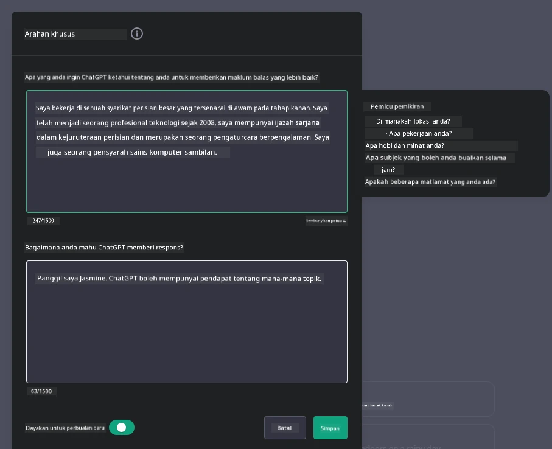
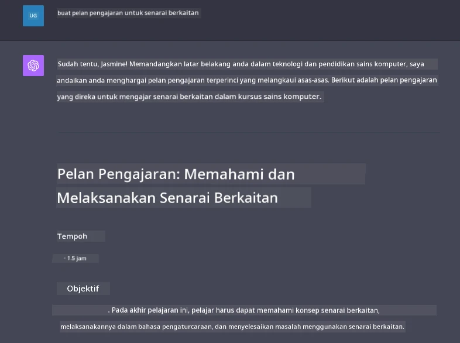

# Membina Aplikasi Sembang Berkuasa AI Generatif

[](https://youtu.be/R9V0ZY1BEQo?si=IHuU-fS9YWT8s4sA)

> _(Klik imej di atas untuk menonton video pelajaran ini)_

Sekarang bahawa kita telah melihat bagaimana kita boleh membina aplikasi penjanaan teks, mari kita lihat aplikasi sembang.

Aplikasi sembang telah menjadi sebahagian daripada kehidupan harian kita, menawarkan lebih daripada sekadar sarana perbualan santai. Ia adalah bahagian penting dalam perkhidmatan pelanggan, sokongan teknikal, dan juga sistem penasihat yang canggih. Kemungkinan anda telah mendapat bantuan daripada aplikasi sembang tidak lama dahulu. Apabila kita mengintegrasikan teknologi yang lebih maju seperti AI generatif ke dalam platform ini, kerumitan meningkat dan begitu juga cabarannya.

Beberapa soalan yang perlu kita jawab adalah:

- **Membina aplikasi**. Bagaimana kita membina dan mengintegrasikan aplikasi berkuasa AI ini dengan cekap untuk kes penggunaan tertentu?
- **Pemantauan**. Setelah digunakan, bagaimana kita boleh memantau dan memastikan aplikasi beroperasi pada tahap kualiti tertinggi, dari segi fungsi dan mematuhi [enam prinsip AI yang bertanggungjawab](https://www.microsoft.com/ai/responsible-ai?WT.mc_id=academic-105485-koreyst)?

Ketika kita melangkah lebih jauh ke era yang ditakrifkan oleh automasi dan interaksi manusia-mesin yang lancar, memahami bagaimana AI generatif mengubah skop, kedalaman, dan kebolehupayaan aplikasi sembang menjadi penting. Pelajaran ini akan menyelidiki aspek seni bina yang menyokong sistem kompleks ini, meneroka metodologi untuk menala halusnya untuk tugasan khusus domain, dan menilai metrik serta pertimbangan yang berkaitan bagi memastikan penggunaan AI yang bertanggungjawab.

## Pengenalan

Pelajaran ini merangkumi:

- Teknik untuk membina dan mengintegrasikan aplikasi sembang dengan cekap.
- Cara untuk menerapkan penyesuaian dan menala halus aplikasi.
- Strategi dan pertimbangan untuk memantau aplikasi sembang dengan berkesan.

## Matlamat Pembelajaran

Menjelang akhir pelajaran ini, anda akan dapat:

- Menggambarkan pertimbangan untuk membina dan mengintegrasikan aplikasi sembang ke dalam sistem sedia ada.
- Menyesuaikan aplikasi sembang untuk kes penggunaan tertentu.
- Mengenal pasti metrik utama dan pertimbangan untuk memantau dan mengekalkan kualiti aplikasi sembang berkuasa AI dengan berkesan.
- Memastikan aplikasi sembang menggunakan AI secara bertanggungjawab.

## Mengintegrasikan AI Generatif ke dalam Aplikasi Sembang

Meningkatkan aplikasi sembang melalui AI generatif bukan hanya tentang menjadikannya lebih pintar; ia adalah tentang mengoptimumkan seni bina, prestasi, dan antara muka pengguna untuk menyediakan pengalaman pengguna berkualiti. Ini melibatkan menyelidiki asas seni bina, integrasi API, dan pertimbangan antara muka pengguna. Bahagian ini bertujuan untuk menawarkan peta jalan yang komprehensif untuk menavigasi landskap kompleks ini, sama ada anda menghubungkannya ke dalam sistem sedia ada atau membinanya sebagai platform bebas.

Pada akhir bahagian ini, anda akan dilengkapi dengan kepakaran yang diperlukan untuk membina dan menggabungkan aplikasi sembang dengan cekap.

### Sembangbot atau Aplikasi Sembang?

Sebelum kita meneroka pembinaan aplikasi sembang, mari kita bandingkan 'sembangbot' dengan 'aplikasi sembang berkuasa AI,' yang berperanan dan berfungsi dengan berbeza. Tujuan utama sembangbot adalah untuk mengautomasikan tugas perbualan tertentu, seperti menjawab soalan lazim atau menjejaki pakej. Ia biasanya dikawal oleh logik berasaskan peraturan atau algoritma AI yang kompleks. Sebaliknya, aplikasi sembang berkuasa AI adalah persekitaran yang jauh lebih luas direka untuk memudahkan pelbagai bentuk komunikasi digital, seperti sembang teks, suara, dan video antara pengguna manusia. Ciri penentuannya adalah pengintegrasian model AI generatif yang mensimulasikan perbualan seperti manusia yang bernuansa, menghasilkan respons berdasarkan pelbagai input dan konteks. Aplikasi sembang berkuasa AI generatif boleh terlibat dalam perbincangan domain terbuka, menyesuaikan diri dengan konteks perbualan yang berubah, dan bahkan menghasilkan dialog yang kreatif atau kompleks.

Jadual di bawah menggariskan perbezaan dan persamaan utama untuk membantu kita memahami peranan unik mereka dalam komunikasi digital.

| Sembangbot                            | Aplikasi Sembang Berkuasa AI Generatif   |
| ------------------------------------- | -------------------------------------- |
| Fokus pada Tugasan dan berasaskan peraturan | Sedar konteks                            |
| Selalunya diintegrasikan ke dalam sistem lebih besar | Boleh menampung satu atau beberapa sembangbot |
| Terhad kepada fungsi yang diprogramkan | Menggabungkan model AI generatif        |
| Interaksi khusus & berstruktur          | Mampu perbincangan domain terbuka       |

### Memanfaatkan fungsi terbina dengan SDK dan API

Apabila membina aplikasi sembang, satu langkah awal yang baik adalah menilai apa yang sudah tersedia. Menggunakan SDK dan API untuk membina aplikasi sembang adalah strategi yang menguntungkan atas pelbagai sebab. Dengan mengintegrasikan SDK dan API yang didokumentasi dengan baik, anda meletakkan aplikasi anda secara strategik untuk kejayaan jangka panjang, menangani kebimbangan penskalaan dan penyelenggaraan.

- **Mempercepatkan proses pembangunan dan mengurangkan beban**: Bergantung pada fungsi terbina daripada proses mahal membina sendiri membolehkan anda menumpukan perhatian pada aspek lain aplikasi yang anda anggap lebih penting, seperti logik perniagaan.
- **Prestasi lebih baik**: Apabila membina fungsi dari awal, anda akan bertanya pada diri sendiri "Bagaimana ia berskala? Adakah aplikasi ini mampu menangani lonjakan pengguna secara tiba-tiba?" SDK dan API yang dijaga dengan baik selalunya mempunyai penyelesaian terbina untuk kebimbangan ini.
- **Penyelenggaraan lebih mudah**: Kemas kini dan penambahbaikan lebih mudah diurus kerana kebanyakan API dan SDK hanya memerlukan kemas kini perpustakaan apabila versi baru dikeluarkan.
- **Akses kepada teknologi terkini**: Memanfaatkan model yang telah ditala halus dan dilatih dengan dataset yang luas memberikan aplikasi anda keupayaan bahasa semula jadi.

Mengakses fungsi SDK atau API biasanya melibatkan mendapatkan kebenaran untuk menggunakan perkhidmatan yang disediakan, yang selalunya melalui penggunaan kunci unik atau token pengesahan. Kita akan menggunakan Perpustakaan Python OpenAI untuk meneroka bagaimana ini dilakukan. Anda juga boleh mencubanya sendiri dalam [notebook untuk OpenAI](./python/oai-assignment.ipynb?WT.mc_id=academic-105485-koreyst) atau [notebook untuk Azure OpenAI Services](./python/aoai-assignment.ipynb?WT.mc_id=academic-105485-koreys) untuk pelajaran ini.

```python
import os
from openai import OpenAI

API_KEY = os.getenv("OPENAI_API_KEY","")

client = OpenAI(
    api_key=API_KEY
    )

response = client.responses.create(model="gpt-4o-mini", input="Suggest two titles for an instructional lesson on chat applications for generative AI.", store=False)
print(response.output_text)
```

Contoh di atas menggunakan model GPT-4o mini dengan API Respons untuk melengkapkan arahan, tetapi perhatikan bahawa kunci API ditetapkan sebelum itu. Anda akan menerima ralat jika tidak menetapkan kunci tersebut.

## Pengalaman Pengguna (UX)

Prinsip UX umum terpakai pada aplikasi sembang, tetapi berikut adalah beberapa pertimbangan tambahan yang menjadi penting disebabkan komponen pembelajaran mesin yang terlibat.

- **Mekanisme untuk menangani kekaburan**: Model AI generatif kadang-kadang menghasilkan jawapan yang kabur. Ciri yang membenarkan pengguna meminta penjelasan boleh membantu jika mereka menemui masalah ini.
- **Penyimpanan konteks**: Model AI generatif lanjutan mempunyai keupayaan untuk mengingati konteks dalam perbualan, yang boleh menjadi aset penting dalam pengalaman pengguna. Memberi kuasa kepada pengguna untuk mengawal dan mengurus konteks menambah baik pengalaman pengguna, tetapi memperkenalkan risiko penyimpanan maklumat pengguna yang sensitif. Pertimbangan berapa lama maklumat ini disimpan, seperti memperkenalkan polisi penyimpanan, boleh mengimbangi keperluan konteks dengan privasi.
- **Personalisasi**: Dengan keupayaan belajar dan menyesuaikan diri, model AI menawarkan pengalaman yang diperibadikan kepada pengguna. Menyesuaikan pengalaman pengguna melalui ciri seperti profil pengguna bukan sahaja membuat pengguna rasa difahami, tetapi juga membantu mereka mencari jawapan tertentu dengan lebih cekap dan memuaskan.

Salah satu contoh personalisasi adalah tetapan "Arahan tersuai" di ChatGPT OpenAI. Ia membenarkan anda menyediakan maklumat tentang diri anda yang mungkin menjadi konteks penting untuk arahan anda. Berikut adalah contoh arahan tersuai.



"Profil" ini menggesa ChatGPT untuk membuat pelan pelajaran mengenai senarai berangkai. Perhatikan bahawa ChatGPT mengambil kira bahawa pengguna mungkin mahukan pelan pelajaran yang lebih mendalam berdasarkan pengalamannya.



### Rangka Kerja Mesej Sistem Microsoft untuk Model Bahasa Besar

[Microsoft telah menyediakan panduan](https://learn.microsoft.com/azure/ai-services/openai/concepts/system-message#define-the-models-output-format?WT.mc_id=academic-105485-koreyst) untuk menulis mesej sistem yang berkesan apabila menghasilkan respons daripada LLM yang dibahagikan kepada 4 bidang:

1. Mendefinisikan siapa model untuk, serta keupayaan dan hadnya.
2. Mendefinisikan format output model.
3. Memberikan contoh khusus yang menunjukkan tingkah laku model yang dimaksudkan.
4. Memberikan garis panduan tingkah laku tambahan.

### Kebolehcapaian

Sama ada pengguna mengalami kecacatan penglihatan, pendengaran, motor, atau kognitif, aplikasi sembang yang direka dengan baik patut boleh digunakan oleh semua. Senarai berikut memecahkan ciri khusus yang bertujuan untuk meningkatkan kebolehcapaian bagi pelbagai kecacatan pengguna.

- **Ciri untuk Kecacatan Penglihatan**: Tema kontras tinggi dan teks boleh diubah saiz, keserasian pembaca skrin.
- **Ciri untuk Kecacatan Pendengaran**: Fungsi teks-ke-ucapan dan ucapan-ke-teks, petunjuk visual untuk notifikasi audio.
- **Ciri untuk Kecacatan Motor**: Sokongan navigasi papan kekunci, arahan suara.
- **Ciri untuk Kecacatan Kognitif**: Pilihan bahasa yang dipermudahkan.

## Penyesuaian dan Penalaan Halus untuk Model Bahasa Khusus Domain

Bayangkan aplikasi sembang yang memahami jargon syarikat anda dan menjangka soalan khusus yang sering diajukan oleh pengguna. Terdapat beberapa pendekatan yang patut disebut:

- **Memanfaatkan model DSL**. DSL bermaksud bahasa khusus domain. Anda boleh menggunakan model DSL yang dilatih pada domain tertentu untuk memahami konsep dan senarionya.
- **Menerapkan penalaan halus**. Penalaan halus adalah proses melatih model anda lebih lanjut dengan data khusus.

## Penyesuaian: Menggunakan DSL

Memanfaatkan model bahasa khusus domain (Model DSL) boleh meningkatkan penglibatan pengguna dengan menyediakan interaksi khusus dan relevan secara konteks. Ia adalah model yang dilatih atau ditala halus untuk memahami dan menjana teks berkaitan bidang, industri, atau subjek tertentu. Pilihan menggunakan model DSL boleh berbeza dari melatih satu dari awal, hingga menggunakan yang telah ada melalui SDK dan API. Pilihan lain adalah penalaan halus, yang melibatkan mengambil model terlatih sedia ada dan menyesuaikannya untuk domain tertentu.

## Penyesuaian: Menerapkan penalaan halus

Penalaan halus biasanya dipertimbangkan apabila model pra-latih tidak mencukupi dalam domain khusus atau tugasan tertentu.

Sebagai contoh, soalan perubatan adalah kompleks dan memerlukan banyak konteks. Apabila seorang profesional perubatan mendiagnosis pesakit, ia berdasarkan pelbagai faktor seperti gaya hidup atau keadaan sedia ada, dan mungkin bergantung pada jurnal perubatan terkini untuk mengesahkan diagnosis mereka. Dalam scenario bernuansa sedemikian, aplikasi sembang AI umum tidak boleh menjadi sumber yang boleh dipercayai.

### Senario: aplikasi perubatan

Pertimbangkan aplikasi sembang yang direka untuk membantu pengamal perubatan dengan menyediakan rujukan pantas kepada garis panduan rawatan, interaksi ubat, atau penemuan kajian terkini.

Model umum mungkin memadai untuk menjawab soalan perubatan asas atau memberikan nasihat umum, tetapi ia mungkin menghadapi kesukaran dengan:

- **Kes yang sangat khusus atau kompleks**. Contohnya, seorang ahli neurologi mungkin bertanya aplikasi itu, "Apakah amalan terbaik terkini untuk menguruskan epilepsi tahan ubat pada pesakit pediatrik?"
- **Kekurangan kemajuan terkini**. Model am boleh menghadapi kesukaran memberikan jawapan terkini yang menggabungkan kemajuan terbaru dalam neurologi dan farmakologi.

Dalam kes seperti ini, menala halus model dengan dataset perubatan khusus boleh meningkatkan dengan ketara kemampuannya untuk menangani pertanyaan perubatan rumit ini dengan lebih tepat dan boleh dipercayai. Ini memerlukan akses kepada dataset yang besar dan berkaitan yang mewakili cabaran dan soalan domain khusus yang perlu ditangani.

## Pertimbangan untuk Pengalaman Sembang Berkuasa AI Berkualiti Tinggi

Bahagian ini menggariskan kriteria untuk aplikasi sembang "berkualiti tinggi," yang termasuk pengambilan metrik boleh tindakan dan pematuhan kepada rangka kerja yang menggunakan teknologi AI secara bertanggungjawab.

### Metrik Utama

Untuk mengekalkan prestasi aplikasi yang berkualiti tinggi, adalah penting untuk mengesan metrik dan pertimbangan utama. Ukuran ini bukan sahaja memastikan fungsi aplikasi tetapi juga menilai kualiti model AI dan pengalaman pengguna. Di bawah adalah senarai yang merangkumi metrik asas, AI, dan pengalaman pengguna yang perlu dipertimbangkan.

| Metrik                        | Definisi                                                                                                             | Pertimbangan untuk Pembangun Sembang                                    |
| ----------------------------- | -------------------------------------------------------------------------------------------------------------------- | ---------------------------------------------------------------------- |
| **Waktu Beroperasi**           | Mengukur masa aplikasi beroperasi dan boleh diakses oleh pengguna.                                                   | Bagaimana anda akan meminimumkan masa henti?                           |
| **Masa Respons**               | Masa yang diambil oleh aplikasi untuk membalas pertanyaan pengguna.                                                 | Bagaimana anda boleh mengoptimumkan pemprosesan pertanyaan untuk menambah baik masa respons? |
| **Ketepatan**                 | Nisbah ramalan benar positif kepada jumlah ramalan positif.                                                         | Bagaimana anda akan mengesahkan ketepatan model anda?                 |
| **Pemanggilan (Sensitiviti)** | Nisbah ramalan benar positif kepada jumlah sebenar positif.                                                         | Bagaimana anda akan mengukur dan meningkatkan pemanggilan?            |
| **Skor F1**                   | Purata harmonik ketepatan dan pemanggilan yang menyeimbangkan pertukaran antara kedua-duanya.                        | Apakah sasaran Skor F1 anda? Bagaimana anda akan mengimbangi ketepatan dan pemanggilan? |
| **Perplexity**                | Mengukur sejauh mana taburan kebarangkalian yang diramalkan oleh model sejajar dengan taburan sebenar data.           | Bagaimana anda akan meminimumkan perplexity?                          |
| **Metrik Kepuasan Pengguna** | Mengukur persepsi pengguna terhadap aplikasi. Selalunya diambil melalui tinjauan.                                    | Berapa kerap anda akan mengumpul maklum balas pengguna? Bagaimana anda akan menyesuaikan berdasarkan maklum balas itu? |
| **Kadar Ralat**               | Kadar di mana model membuat kesilapan dalam memahami atau menghasilkan output.                                       | Apakah strategi yang anda ada untuk mengurangkan kadar ralat?        |
| **Kitaran Latihan Semula**    | Kekerapan model dikemas kini untuk memasukkan data dan pandangan baru.                                              | Berapa kerap anda akan melatih semula model? Apa yang mencetuskan kitaran latihan semula? |

| **Pengesanan Anomali**         | Alat dan teknik untuk mengenal pasti corak luar biasa yang tidak selaras dengan tingkah laku yang dijangka.                        | Bagaimana anda akan bertindak balas terhadap anomali?                                        |

### Melaksanakan Amalan AI Bertanggungjawab dalam Aplikasi Sembang

Pendekatan Microsoft terhadap AI Bertanggungjawab telah mengenal pasti enam prinsip yang harus memandu pembangunan dan penggunaan AI. Berikut adalah prinsip-prinsip, definisinya, dan perkara yang harus dipertimbangkan oleh pembangun sembang serta sebab mengapa mereka harus menganggapnya serius.

| Prinsip               | Definisi Microsoft                                    | Pertimbangan untuk Pembangun Sembang                                   | Mengapa Ia Penting                                                                    |
| --------------------- | ---------------------------------------------------- | ---------------------------------------------------------------------- | ------------------------------------------------------------------------------------- |
| Keadilan              | Sistem AI harus melayan semua orang secara adil.    | Pastikan aplikasi sembang tidak membezakan berdasarkan data pengguna.  | Untuk membina kepercayaan dan keterangkuman dalam kalangan pengguna; mengelak implikasi undang-undang. |
| Kebolehpercayaan dan Keselamatan | Sistem AI harus berfungsi dengan boleh dipercayai dan selamat. | Laksanakan ujian dan mekanisme keselamatan untuk meminimumkan kesilapan dan risiko. | Memastikan kepuasan pengguna dan mengelakkan potensi bahaya.                           |
| Privasi dan Keselamatan | Sistem AI harus selamat dan menghormati privasi.    | Laksanakan penyulitan yang kuat dan langkah perlindungan data.          | Untuk menjaga data pengguna yang sensitif dan mematuhi undang-undang privasi.          |
| Keterangkuman          | Sistem AI harus memberdayakan semua orang dan melibatkan mereka. | Reka bentuk UI/UX yang boleh diakses dan mudah digunakan untuk pelbagai audiens. | Memastikan lebih ramai orang dapat menggunakan aplikasi dengan berkesan.              |
| Ketelusan              | Sistem AI harus difahami.                            | Sediakan dokumentasi yang jelas dan alasan untuk respon AI.             | Pengguna lebih cenderung mempercayai sistem jika mereka dapat memahami bagaimana keputusan dibuat. |
| Akauntabiliti          | Orang harus bertanggungjawab atas sistem AI.        | Wujudkan proses yang jelas untuk mengaudit dan memperbaiki keputusan AI. | Membolehkan penambahbaikan berterusan dan langkah pembetulan sekiranya terdapat kesilapan. |

## Tugasan

Lihat [tugasan](../../../07-building-chat-applications/python). Ia akan membawa anda melalui beberapa latihan dari menjalankan arahan sembang pertama anda, mengklasifikasikan dan merumuskan teks dan sebagainya. Perhatikan bahawa tugasan-tugasan tersedia dalam pelbagai bahasa pengaturcaraan!

## Kerja Hebat! Teruskan Perjalanan

Selepas melengkapkan pelajaran ini, semak koleksi [Pembelajaran AI Generatif](https://aka.ms/genai-collection?WT.mc_id=academic-105485-koreyst) kami untuk terus meningkatkan pengetahuan AI Generatif anda!

Pergi ke Pelajaran 8 untuk melihat bagaimana anda boleh mula [membangun aplikasi carian](../08-building-search-applications/README.md?WT.mc_id=academic-105485-koreyst)!

---

<!-- CO-OP TRANSLATOR DISCLAIMER START -->
**Penafian**:
Dokumen ini telah diterjemahkan menggunakan perkhidmatan terjemahan AI [Co-op Translator](https://github.com/Azure/co-op-translator). Walaupun kami berusaha untuk ketepatan, sila ambil maklum bahawa terjemahan automatik mungkin mengandungi kesilapan atau ketidaktepatan. Dokumen asal dalam bahasa asalnya harus dianggap sebagai sumber yang sahih. Untuk maklumat penting, terjemahan oleh manusia profesional adalah disyorkan. Kami tidak bertanggungjawab terhadap sebarang salah faham atau salah tafsir yang timbul daripada penggunaan terjemahan ini.
<!-- CO-OP TRANSLATOR DISCLAIMER END -->