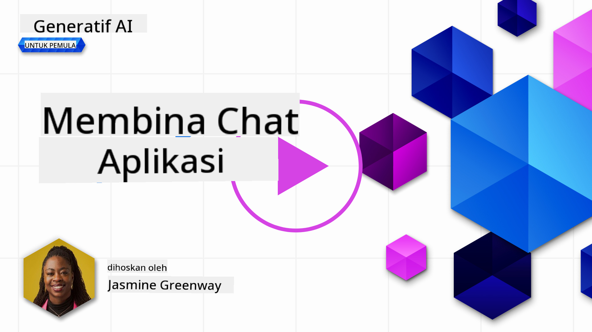
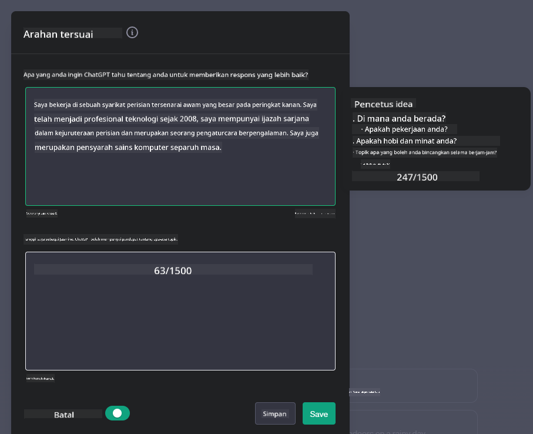

<!--
CO_OP_TRANSLATOR_METADATA:
{
  "original_hash": "a5308963a56cfbad2d73b0fa99fe84b3",
  "translation_date": "2025-10-17T20:57:39+00:00",
  "source_file": "07-building-chat-applications/README.md",
  "language_code": "ms"
}
-->
# Membina Aplikasi Chat Berkuasa AI Generatif

[](https://youtu.be/R9V0ZY1BEQo?si=IHuU-fS9YWT8s4sA)

> _(Klik imej di atas untuk menonton video pelajaran ini)_

Sekarang kita telah melihat bagaimana membina aplikasi penjanaan teks, mari kita terokai aplikasi chat.

Aplikasi chat telah menjadi sebahagian daripada kehidupan harian kita, menawarkan lebih daripada sekadar alat untuk perbualan santai. Ia adalah komponen penting dalam perkhidmatan pelanggan, sokongan teknikal, dan juga sistem penasihat yang canggih. Kemungkinan besar anda pernah mendapatkan bantuan daripada aplikasi chat tidak lama dahulu. Apabila kita mengintegrasikan teknologi yang lebih maju seperti AI generatif ke dalam platform ini, kerumitan meningkat begitu juga dengan cabarannya.

Beberapa persoalan yang perlu dijawab adalah:

- **Membina aplikasi**. Bagaimana kita membina dan mengintegrasikan aplikasi berkuasa AI ini dengan cekap untuk kes penggunaan tertentu?
- **Pemantauan**. Setelah dilancarkan, bagaimana kita boleh memantau dan memastikan aplikasi beroperasi pada tahap kualiti tertinggi, baik dari segi fungsi dan mematuhi [enam prinsip AI bertanggungjawab](https://www.microsoft.com/ai/responsible-ai?WT.mc_id=academic-105485-koreyst)?

Apabila kita bergerak lebih jauh ke era yang ditakrifkan oleh automasi dan interaksi manusia-mesin yang lancar, memahami bagaimana AI generatif mengubah skop, kedalaman, dan kebolehsuaian aplikasi chat menjadi penting. Pelajaran ini akan menyelidiki aspek seni bina yang menyokong sistem yang rumit ini, meneroka metodologi untuk penyesuaian tugas khusus domain, dan menilai metrik serta pertimbangan yang relevan untuk memastikan pelaksanaan AI yang bertanggungjawab.

## Pengenalan

Pelajaran ini merangkumi:

- Teknik untuk membina dan mengintegrasikan aplikasi chat dengan cekap.
- Cara menerapkan penyesuaian dan penyesuaian aplikasi.
- Strategi dan pertimbangan untuk memantau aplikasi chat dengan berkesan.

## Matlamat Pembelajaran

Pada akhir pelajaran ini, anda akan dapat:

- Menghuraikan pertimbangan untuk membina dan mengintegrasikan aplikasi chat ke dalam sistem sedia ada.
- Menyesuaikan aplikasi chat untuk kes penggunaan tertentu.
- Mengenal pasti metrik utama dan pertimbangan untuk memantau dan mengekalkan kualiti aplikasi chat berkuasa AI dengan berkesan.
- Memastikan aplikasi chat menggunakan AI secara bertanggungjawab.

## Mengintegrasikan AI Generatif ke dalam Aplikasi Chat

Meningkatkan aplikasi chat melalui AI generatif bukan sahaja berpusat pada menjadikannya lebih pintar; ia juga tentang mengoptimumkan seni bina, prestasi, dan antara muka pengguna untuk memberikan pengalaman pengguna yang berkualiti. Ini melibatkan penyelidikan asas seni bina, integrasi API, dan pertimbangan antara muka pengguna. Bahagian ini bertujuan untuk menawarkan anda peta jalan yang komprehensif untuk menavigasi landskap yang kompleks ini, sama ada anda menyambungkannya ke sistem sedia ada atau membinanya sebagai platform berdiri sendiri.

Pada akhir bahagian ini, anda akan dilengkapi dengan kepakaran yang diperlukan untuk membina dan menggabungkan aplikasi chat dengan cekap.

### Chatbot atau Aplikasi Chat?

Sebelum kita mendalami pembinaan aplikasi chat, mari kita bandingkan 'chatbot' dengan 'aplikasi chat berkuasa AI,' yang mempunyai peranan dan fungsi yang berbeza. Tujuan utama chatbot adalah untuk mengautomasi tugas perbualan tertentu, seperti menjawab soalan lazim atau menjejaki pakej. Ia biasanya dikawal oleh logik berasaskan peraturan atau algoritma AI yang kompleks. Sebaliknya, aplikasi chat berkuasa AI adalah persekitaran yang jauh lebih luas yang direka untuk memudahkan pelbagai bentuk komunikasi digital, seperti teks, suara, dan video chat antara pengguna manusia. Ciri utamanya adalah integrasi model AI generatif yang mensimulasikan perbualan yang bernuansa dan menyerupai manusia, menghasilkan respons berdasarkan pelbagai input dan petunjuk konteks. Aplikasi chat berkuasa AI generatif boleh terlibat dalam perbincangan domain terbuka, menyesuaikan diri dengan konteks perbualan yang berkembang, dan bahkan menghasilkan dialog yang kreatif atau kompleks.

Jadual di bawah menggariskan perbezaan dan persamaan utama untuk membantu kita memahami peranan unik mereka dalam komunikasi digital.

| Chatbot                               | Aplikasi Chat Berkuasa AI Generatif    |
| ------------------------------------- | -------------------------------------- |
| Berfokus pada tugas dan berasaskan peraturan | Sedar konteks                          |
| Selalunya diintegrasikan ke dalam sistem yang lebih besar | Mungkin menjadi hos kepada satu atau lebih chatbot |
| Terhad kepada fungsi yang diprogramkan | Menggabungkan model AI generatif       |
| Interaksi khusus & berstruktur        | Mampu perbincangan domain terbuka      |

### Memanfaatkan Fungsi Sedia Ada dengan SDK dan API

Apabila membina aplikasi chat, langkah pertama yang baik adalah menilai apa yang sudah tersedia. Menggunakan SDK dan API untuk membina aplikasi chat adalah strategi yang menguntungkan atas pelbagai sebab. Dengan mengintegrasikan SDK dan API yang didokumentasikan dengan baik, anda secara strategik meletakkan aplikasi anda untuk kejayaan jangka panjang, menangani kebimbangan skalabiliti dan penyelenggaraan.

- **Mempercepatkan proses pembangunan dan mengurangkan kos**: Bergantung pada fungsi sedia ada daripada proses mahal membina sendiri membolehkan anda memberi tumpuan kepada aspek lain aplikasi anda yang mungkin lebih penting, seperti logik perniagaan.
- **Prestasi lebih baik**: Apabila membina fungsi dari awal, anda akhirnya akan bertanya "Bagaimana ia berskala? Adakah aplikasi ini mampu menangani lonjakan pengguna secara tiba-tiba?" SDK dan API yang diselenggara dengan baik sering mempunyai penyelesaian terbina untuk kebimbangan ini.
- **Penyelenggaraan lebih mudah**: Kemas kini dan penambahbaikan lebih mudah diuruskan kerana kebanyakan API dan SDK hanya memerlukan kemas kini kepada perpustakaan apabila versi baru dikeluarkan.
- **Akses kepada teknologi terkini**: Memanfaatkan model yang telah disesuaikan dan dilatih pada set data yang luas memberikan aplikasi anda keupayaan bahasa semula jadi.

Mengakses fungsi SDK atau API biasanya melibatkan mendapatkan kebenaran untuk menggunakan perkhidmatan yang disediakan, yang sering dilakukan melalui penggunaan kunci unik atau token pengesahan. Kita akan menggunakan Perpustakaan Python OpenAI untuk meneroka bagaimana ini kelihatan. Anda juga boleh mencubanya sendiri dalam [notebook untuk OpenAI](./python/oai-assignment.ipynb?WT.mc_id=academic-105485-koreyst) atau [notebook untuk Azure OpenAI Services](./python/aoai-assignment.ipynb?WT.mc_id=academic-105485-koreys) untuk pelajaran ini.

```python
import os
from openai import OpenAI

API_KEY = os.getenv("OPENAI_API_KEY","")

client = OpenAI(
    api_key=API_KEY
    )

chat_completion = client.chat.completions.create(model="gpt-3.5-turbo", messages=[{"role": "user", "content": "Suggest two titles for an instructional lesson on chat applications for generative AI."}])
```

Contoh di atas menggunakan model GPT-3.5 Turbo untuk melengkapkan prompt, tetapi perhatikan bahawa kunci API ditetapkan sebelum melakukannya. Anda akan menerima ralat jika anda tidak menetapkan kunci.

## Pengalaman Pengguna (UX)

Prinsip UX umum terpakai kepada aplikasi chat, tetapi berikut adalah beberapa pertimbangan tambahan yang menjadi sangat penting kerana komponen pembelajaran mesin yang terlibat.

- **Mekanisme untuk menangani kekaburan**: Model AI generatif kadang-kadang menghasilkan jawapan yang kabur. Ciri yang membolehkan pengguna meminta penjelasan boleh membantu jika mereka menghadapi masalah ini.
- **Pengekalan konteks**: Model AI generatif yang maju mempunyai keupayaan untuk mengingati konteks dalam perbualan, yang boleh menjadi aset yang diperlukan untuk pengalaman pengguna. Memberikan pengguna keupayaan untuk mengawal dan mengurus konteks meningkatkan pengalaman pengguna, tetapi memperkenalkan risiko menyimpan maklumat pengguna yang sensitif. Pertimbangan untuk berapa lama maklumat ini disimpan, seperti memperkenalkan dasar pengekalan, boleh mengimbangi keperluan konteks terhadap privasi.
- **Personalisasi**: Dengan keupayaan untuk belajar dan menyesuaikan diri, model AI menawarkan pengalaman individu untuk pengguna. Menyesuaikan pengalaman pengguna melalui ciri seperti profil pengguna bukan sahaja membuat pengguna merasa difahami, tetapi juga membantu mereka mencari jawapan tertentu, mewujudkan interaksi yang lebih efisien dan memuaskan.

Satu contoh personalisasi adalah tetapan "Arahan Tersuai" dalam ChatGPT OpenAI. Ia membolehkan anda memberikan maklumat tentang diri anda yang mungkin menjadi konteks penting untuk prompt anda. Berikut adalah contoh arahan tersuai.



"Profil" ini meminta ChatGPT untuk mencipta rancangan pelajaran tentang senarai berkait. Perhatikan bahawa ChatGPT mengambil kira bahawa pengguna mungkin mahukan rancangan pelajaran yang lebih mendalam berdasarkan pengalamannya.


### Rangka Kerja Mesej Sistem Microsoft untuk Model Bahasa Besar

[Microsoft telah menyediakan panduan](https://learn.microsoft.com/azure/ai-services/openai/concepts/system-message#define-the-models-output-format?WT.mc_id=academic-105485-koreyst) untuk menulis mesej sistem yang berkesan apabila menghasilkan respons daripada LLM yang dibahagikan kepada 4 kawasan:

1. Menentukan siapa model itu untuk, serta keupayaan dan batasannya.
2. Menentukan format output model.
3. Memberikan contoh khusus yang menunjukkan tingkah laku model yang dimaksudkan.
4. Memberikan pengawal tingkah laku tambahan.

### Kebolehcapaian

Sama ada pengguna mempunyai gangguan visual, pendengaran, motor, atau kognitif, aplikasi chat yang direka dengan baik harus boleh digunakan oleh semua. Senarai berikut memecahkan ciri khusus yang bertujuan untuk meningkatkan kebolehcapaian untuk pelbagai gangguan pengguna.

- **Ciri untuk Gangguan Visual**: Tema kontras tinggi dan teks boleh disesuaikan, keserasian pembaca skrin.
- **Ciri untuk Gangguan Pendengaran**: Fungsi teks ke ucapan dan ucapan ke teks, petunjuk visual untuk pemberitahuan audio.
- **Ciri untuk Gangguan Motor**: Sokongan navigasi papan kekunci, arahan suara.
- **Ciri untuk Gangguan Kognitif**: Pilihan bahasa yang dipermudahkan.

## Penyesuaian dan Penyesuaian untuk Model Bahasa Khusus Domain

Bayangkan aplikasi chat yang memahami jargon syarikat anda dan menjangka pertanyaan khusus yang sering diajukan oleh pangkalan pengguna. Terdapat beberapa pendekatan yang patut disebut:

- **Memanfaatkan model DSL**. DSL bermaksud bahasa khusus domain. Anda boleh memanfaatkan model DSL yang dilatih pada domain tertentu untuk memahami konsep dan senarionya.
- **Menerapkan penyesuaian**. Penyesuaian adalah proses melatih model anda lebih lanjut dengan data tertentu.

## Penyesuaian: Menggunakan DSL

Memanfaatkan model bahasa khusus domain (Model DSL) boleh meningkatkan penglibatan pengguna dengan menyediakan interaksi yang khusus dan relevan secara kontekstual. Ia adalah model yang dilatih atau disesuaikan untuk memahami dan menghasilkan teks yang berkaitan dengan bidang, industri, atau subjek tertentu. Pilihan untuk menggunakan model DSL boleh berbeza dari melatih satu dari awal, kepada menggunakan yang sedia ada melalui SDK dan API. Pilihan lain adalah penyesuaian, yang melibatkan mengambil model yang telah dilatih dan menyesuaikannya untuk domain tertentu.

## Penyesuaian: Menerapkan Penyesuaian

Penyesuaian sering dipertimbangkan apabila model yang telah dilatih tidak mencukupi dalam domain khusus atau tugas tertentu.

Sebagai contoh, pertanyaan perubatan adalah kompleks dan memerlukan banyak konteks. Apabila seorang profesional perubatan mendiagnosis pesakit, ia berdasarkan pelbagai faktor seperti gaya hidup atau keadaan sedia ada, dan mungkin bergantung pada jurnal perubatan terkini untuk mengesahkan diagnosis mereka. Dalam senario yang begitu bernuansa, aplikasi chat AI tujuan umum tidak boleh menjadi sumber yang boleh dipercayai.

### Senario: aplikasi perubatan

Pertimbangkan aplikasi chat yang direka untuk membantu pengamal perubatan dengan menyediakan rujukan cepat kepada garis panduan rawatan, interaksi ubat, atau penemuan penyelidikan terkini.

Model tujuan umum mungkin mencukupi untuk menjawab soalan perubatan asas atau memberikan nasihat umum, tetapi ia mungkin menghadapi kesukaran dengan perkara berikut:

- **Kes yang sangat khusus atau kompleks**. Sebagai contoh, seorang pakar neurologi mungkin bertanya kepada aplikasi, "Apakah amalan terbaik semasa untuk menguruskan epilepsi tahan ubat pada pesakit pediatrik?"
- **Kekurangan kemajuan terkini**. Model tujuan umum mungkin menghadapi kesukaran untuk memberikan jawapan terkini yang menggabungkan kemajuan terkini dalam neurologi dan farmakologi.

Dalam keadaan seperti ini, menyesuaikan model dengan set data perubatan khusus boleh meningkatkan keupayaannya untuk menangani pertanyaan perubatan yang rumit dengan lebih tepat dan boleh dipercayai. Ini memerlukan akses kepada set data yang besar dan relevan yang mewakili cabaran dan soalan khusus domain yang perlu ditangani.

## Pertimbangan untuk Pengalaman Chat Berkuasa AI Berkualiti Tinggi

Bahagian ini menggariskan kriteria untuk aplikasi chat "berkualiti tinggi," yang merangkumi penangkapan metrik yang boleh diambil tindakan dan pematuhan kepada rangka kerja yang menggunakan teknologi AI secara bertanggungjawab.

### Metrik Utama

Untuk mengekalkan prestasi berkualiti tinggi aplikasi, adalah penting untuk menjejaki metrik utama dan pertimbangan. Pengukuran ini bukan sahaja memastikan fungsi aplikasi tetapi juga menilai kualiti model AI dan pengalaman pengguna. Berikut adalah senarai yang merangkumi metrik asas, AI, dan pengalaman pengguna untuk dipertimbangkan.

| Metrik                        | Definisi                                                                                                             | Pertimbangan untuk Pembangun Chat                                         |
| ----------------------------- | ---------------------------------------------------------------------------------------------------------------------- | ------------------------------------------------------------------------- |
| **Waktu Operasi**             | Mengukur masa aplikasi beroperasi dan boleh diakses oleh pengguna.                                                    | Bagaimana anda akan meminimumkan waktu tidak beroperasi?                  |
| **Masa Respons**              | Masa yang diambil oleh aplikasi untuk membalas pertanyaan pengguna.                                                   | Bagaimana anda boleh mengoptimumkan pemprosesan pertanyaan untuk meningkatkan masa respons? |
| **Ketepatan**                 | Nisbah ramalan positif benar kepada jumlah ramalan positif.                                                           | Bagaimana anda akan mengesahkan ketepatan model anda?                     |
| **Panggilan Balik (Sensitiviti)** | Nisbah ramalan positif benar kepada jumlah positif sebenar.                                                         | Bagaimana anda akan mengukur dan meningkatkan panggilan balik?            |
| **Skor F1**                   | Purata harmonik ketepatan dan panggilan balik, yang mengimbangi pertukaran antara kedua-duanya.                        | Apakah sasaran Skor F1 anda? Bagaimana anda akan mengimbangi ketepatan dan panggilan balik? |
| **Perplexity**                | Mengukur sejauh mana pengedaran kebarangkalian yang diramalkan oleh model sejajar dengan pengedaran sebenar data.       | Bagaimana anda akan meminimumkan perplexity?                              |
| **Metrik Kepuasan Pengguna**  | Mengukur persepsi pengguna terhadap aplikasi. Selalunya ditangkap melalui tinjauan.                                   | Seberapa kerap anda akan mengumpulkan maklum balas pengguna? Bagaimana anda akan menyesuaikan berdasarkan maklum balas tersebut? |
| **Kadar Ralat**               | Kadar di mana model membuat kesilapan dalam memahami atau output.                                                     | Apakah strategi yang anda ada untuk mengurangkan kadar ralat?             |
| **Kitaran Latihan Semula**    | Kekerapan model dikemas kini untuk menggabungkan data dan wawasan baru.                                               | Seberapa kerap anda akan melatih semula model? Apa yang mencetuskan kitaran latihan semula? |
| **Pengesanan Anomali**         | Alat dan teknik untuk mengenal pasti corak luar biasa yang tidak selaras dengan tingkah laku yang dijangkakan.                        | Bagaimana anda akan bertindak balas terhadap anomali?                                        |

### Melaksanakan Amalan AI Bertanggungjawab dalam Aplikasi Chat

Pendekatan Microsoft terhadap AI Bertanggungjawab telah mengenal pasti enam prinsip yang harus membimbing pembangunan dan penggunaan AI. Berikut adalah prinsip-prinsip tersebut, definisi mereka, dan perkara yang perlu dipertimbangkan oleh pembangun aplikasi chat serta mengapa mereka perlu mengambilnya dengan serius.

| Prinsip                | Definisi Microsoft                                   | Pertimbangan untuk Pembangun Aplikasi Chat                             | Mengapa Ia Penting                                                                      |
| ---------------------- | ----------------------------------------------------- | ---------------------------------------------------------------------- | -------------------------------------------------------------------------------------- |
| Keadilan               | Sistem AI harus melayan semua orang dengan adil.      | Pastikan aplikasi chat tidak mendiskriminasi berdasarkan data pengguna. | Untuk membina kepercayaan dan keterangkuman di kalangan pengguna; mengelakkan implikasi undang-undang. |
| Kebolehpercayaan dan Keselamatan | Sistem AI harus berfungsi dengan boleh dipercayai dan selamat. | Laksanakan ujian dan langkah-langkah keselamatan untuk meminimumkan kesilapan dan risiko. | Menjamin kepuasan pengguna dan mencegah potensi bahaya.                                |
| Privasi dan Keselamatan | Sistem AI harus selamat dan menghormati privasi.      | Laksanakan penyulitan yang kuat dan langkah-langkah perlindungan data. | Untuk melindungi data sensitif pengguna dan mematuhi undang-undang privasi.            |
| Keterangkuman          | Sistem AI harus memberdayakan semua orang dan melibatkan mereka. | Reka bentuk UI/UX yang boleh diakses dan mudah digunakan untuk pelbagai audiens. | Memastikan lebih ramai orang dapat menggunakan aplikasi dengan berkesan.               |
| Ketelusan              | Sistem AI harus dapat difahami.                       | Sediakan dokumentasi yang jelas dan alasan untuk respons AI.           | Pengguna lebih cenderung mempercayai sistem jika mereka dapat memahami bagaimana keputusan dibuat. |
| Akauntabiliti          | Orang harus bertanggungjawab terhadap sistem AI.      | Tetapkan proses yang jelas untuk mengaudit dan memperbaiki keputusan AI. | Membolehkan penambahbaikan berterusan dan langkah pembetulan sekiranya berlaku kesilapan. |

## Tugasan

Lihat [tugasan](../../../07-building-chat-applications/python). Ia akan membawa anda melalui beberapa latihan daripada menjalankan arahan chat pertama anda, kepada mengklasifikasikan dan meringkaskan teks dan banyak lagi. Perhatikan bahawa tugasan tersedia dalam pelbagai bahasa pengaturcaraan!

## Kerja Hebat! Teruskan Perjalanan

Selepas menyelesaikan pelajaran ini, lihat [koleksi Pembelajaran AI Generatif](https://aka.ms/genai-collection?WT.mc_id=academic-105485-koreyst) kami untuk terus meningkatkan pengetahuan AI Generatif anda!

Pergi ke Pelajaran 8 untuk melihat bagaimana anda boleh mula [membina aplikasi carian](../08-building-search-applications/README.md?WT.mc_id=academic-105485-koreyst)!

---

**Penafian**:  
Dokumen ini telah diterjemahkan menggunakan perkhidmatan terjemahan AI [Co-op Translator](https://github.com/Azure/co-op-translator). Walaupun kami berusaha untuk ketepatan, sila ambil perhatian bahawa terjemahan automatik mungkin mengandungi kesilapan atau ketidaktepatan. Dokumen asal dalam bahasa asalnya harus dianggap sebagai sumber yang berwibawa. Untuk maklumat penting, terjemahan manusia profesional adalah disyorkan. Kami tidak bertanggungjawab atas sebarang salah faham atau salah tafsir yang timbul daripada penggunaan terjemahan ini.