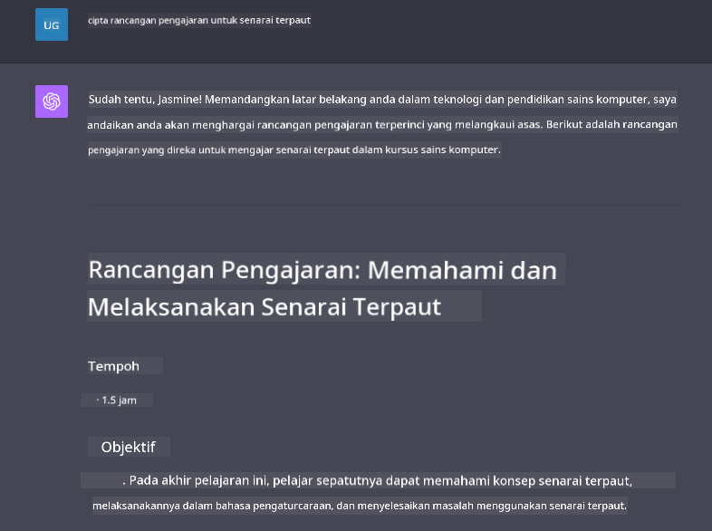

<!--
CO_OP_TRANSLATOR_METADATA:
{
  "original_hash": "ea4bbe640847aafbbba14dae4625e9af",
  "translation_date": "2025-07-09T12:35:38+00:00",
  "source_file": "07-building-chat-applications/README.md",
  "language_code": "ms"
}
-->
# Membangunkan Aplikasi Sembang Berkuasa AI Generatif

[](https://aka.ms/gen-ai-lessons7-gh?WT.mc_id=academic-105485-koreyst)

> _(Klik imej di atas untuk menonton video pelajaran ini)_

Kini setelah kita melihat bagaimana membina aplikasi penjanaan teks, mari kita terokai aplikasi sembang.

Aplikasi sembang telah menjadi sebahagian daripada kehidupan harian kita, menawarkan lebih daripada sekadar medium perbualan santai. Ia merupakan bahagian penting dalam perkhidmatan pelanggan, sokongan teknikal, dan juga sistem penasihat yang canggih. Mungkin anda baru-baru ini mendapat bantuan daripada aplikasi sembang. Apabila kita mengintegrasikan teknologi lebih maju seperti AI generatif ke dalam platform ini, kerumitan dan cabaran juga meningkat.

Beberapa soalan yang perlu dijawab adalah:

- **Membangunkan aplikasi**. Bagaimana kita membina dan mengintegrasikan aplikasi berkuasa AI ini dengan cekap untuk kes penggunaan tertentu?
- **Pemantauan**. Setelah dilancarkan, bagaimana kita memantau dan memastikan aplikasi beroperasi pada tahap kualiti tertinggi, dari segi fungsi dan mematuhi [enam prinsip AI bertanggungjawab](https://www.microsoft.com/ai/responsible-ai?WT.mc_id=academic-105485-koreyst)?

Ketika kita melangkah ke era yang ditakrifkan oleh automasi dan interaksi manusia-mesin yang lancar, memahami bagaimana AI generatif mengubah skop, kedalaman, dan kebolehsuaian aplikasi sembang menjadi penting. Pelajaran ini akan menyelidiki aspek seni bina yang menyokong sistem rumit ini, mendalami metodologi untuk melaraskan mereka bagi tugasan khusus domain, dan menilai metrik serta pertimbangan yang berkaitan untuk memastikan penggunaan AI yang bertanggungjawab.

## Pengenalan

Pelajaran ini merangkumi:

- Teknik untuk membina dan mengintegrasikan aplikasi sembang dengan cekap.
- Cara menerapkan penyesuaian dan pelarasan halus pada aplikasi.
- Strategi dan pertimbangan untuk memantau aplikasi sembang dengan berkesan.

## Matlamat Pembelajaran

Menjelang akhir pelajaran ini, anda akan dapat:

- Menerangkan pertimbangan untuk membina dan mengintegrasikan aplikasi sembang ke dalam sistem sedia ada.
- Menyesuaikan aplikasi sembang untuk kes penggunaan tertentu.
- Mengenal pasti metrik utama dan pertimbangan untuk memantau dan mengekalkan kualiti aplikasi sembang berkuasa AI dengan berkesan.
- Memastikan aplikasi sembang menggunakan AI secara bertanggungjawab.

## Mengintegrasikan AI Generatif ke dalam Aplikasi Sembang

Meningkatkan aplikasi sembang melalui AI generatif bukan sahaja tentang menjadikannya lebih pintar; ia juga mengenai mengoptimumkan seni bina, prestasi, dan antara muka pengguna untuk memberikan pengalaman pengguna yang berkualiti. Ini melibatkan penyelidikan asas seni bina, integrasi API, dan pertimbangan antara muka pengguna. Bahagian ini bertujuan memberikan anda peta jalan menyeluruh untuk menavigasi landskap kompleks ini, sama ada anda menyambungkannya ke sistem sedia ada atau membinanya sebagai platform berdiri sendiri.

Menjelang akhir bahagian ini, anda akan dilengkapi dengan kepakaran yang diperlukan untuk membina dan menggabungkan aplikasi sembang dengan cekap.

### Chatbot atau Aplikasi Sembang?

Sebelum kita menyelami pembangunan aplikasi sembang, mari bandingkan 'chatbot' dengan 'aplikasi sembang berkuasa AI,' yang mempunyai peranan dan fungsi berbeza. Tujuan utama chatbot adalah untuk mengautomasikan tugasan perbualan tertentu, seperti menjawab soalan lazim atau mengesan bungkusan. Ia biasanya dikawal oleh logik berasaskan peraturan atau algoritma AI yang kompleks. Sebaliknya, aplikasi sembang berkuasa AI adalah persekitaran yang jauh lebih luas yang direka untuk memudahkan pelbagai bentuk komunikasi digital, seperti sembang teks, suara, dan video antara pengguna manusia. Ciri utamanya adalah integrasi model AI generatif yang mensimulasikan perbualan yang halus dan menyerupai manusia, menghasilkan respons berdasarkan pelbagai input dan petunjuk konteks. Aplikasi sembang berkuasa AI generatif boleh terlibat dalam perbincangan domain terbuka, menyesuaikan diri dengan konteks perbualan yang berubah, dan bahkan menghasilkan dialog kreatif atau kompleks.

Jadual di bawah menggariskan perbezaan dan persamaan utama untuk membantu kita memahami peranan unik mereka dalam komunikasi digital.

| Chatbot                               | Aplikasi Sembang Berkuasa AI Generatif |
| ------------------------------------- | -------------------------------------- |
| Fokus pada tugasan dan berasaskan peraturan | Sedar konteks                          |
| Selalunya diintegrasikan ke dalam sistem lebih besar | Boleh menempatkan satu atau beberapa chatbot |
| Terhad kepada fungsi yang diprogramkan | Menggabungkan model AI generatif       |
| Interaksi khusus & berstruktur         | Mampu perbincangan domain terbuka      |

### Memanfaatkan fungsi sedia ada dengan SDK dan API

Apabila membina aplikasi sembang, langkah pertama yang baik adalah menilai apa yang sudah tersedia. Menggunakan SDK dan API untuk membina aplikasi sembang adalah strategi yang menguntungkan atas pelbagai sebab. Dengan mengintegrasikan SDK dan API yang didokumentasikan dengan baik, anda meletakkan aplikasi anda secara strategik untuk kejayaan jangka panjang, menangani kebimbangan skala dan penyelenggaraan.

- **Mempercepat proses pembangunan dan mengurangkan beban**: Bergantung pada fungsi sedia ada daripada membinanya sendiri yang mahal membolehkan anda memberi tumpuan kepada aspek lain aplikasi yang lebih penting, seperti logik perniagaan.
- **Prestasi lebih baik**: Apabila membina fungsi dari awal, anda akan bertanya "Bagaimana ia boleh diskalakan? Adakah aplikasi ini mampu mengendalikan lonjakan pengguna secara tiba-tiba?" SDK dan API yang dijaga dengan baik biasanya mempunyai penyelesaian terbina untuk kebimbangan ini.
- **Penyelenggaraan lebih mudah**: Kemas kini dan penambahbaikan lebih mudah diurus kerana kebanyakan API dan SDK hanya memerlukan kemas kini perpustakaan apabila versi baru dikeluarkan.
- **Akses kepada teknologi terkini**: Memanfaatkan model yang telah dilaraskan halus dan dilatih pada set data yang luas memberikan aplikasi anda keupayaan bahasa semula jadi.

Mengakses fungsi SDK atau API biasanya melibatkan mendapatkan kebenaran untuk menggunakan perkhidmatan yang disediakan, yang sering melalui penggunaan kunci unik atau token pengesahan. Kita akan menggunakan Perpustakaan Python OpenAI untuk meneroka bagaimana ini dilakukan. Anda juga boleh mencubanya sendiri dalam [notebook untuk OpenAI](../../../07-building-chat-applications/python/oai-assignment.ipynb) atau [notebook untuk Azure OpenAI Services](../../../07-building-chat-applications/python/aoai-assignment.ipynb) untuk pelajaran ini.

```python
import os
from openai import OpenAI

API_KEY = os.getenv("OPENAI_API_KEY","")

client = OpenAI(
    api_key=API_KEY
    )

chat_completion = client.chat.completions.create(model="gpt-3.5-turbo", messages=[{"role": "user", "content": "Suggest two titles for an instructional lesson on chat applications for generative AI."}])
```

Contoh di atas menggunakan model GPT-3.5 Turbo untuk melengkapkan arahan, tetapi perhatikan bahawa kunci API ditetapkan terlebih dahulu. Anda akan menerima ralat jika tidak menetapkan kunci tersebut.

## Pengalaman Pengguna (UX)

Prinsip UX umum terpakai pada aplikasi sembang, tetapi berikut adalah beberapa pertimbangan tambahan yang menjadi sangat penting kerana komponen pembelajaran mesin yang terlibat.

- **Mekanisme untuk menangani kekaburan**: Model AI generatif kadang-kadang menghasilkan jawapan yang kabur. Ciri yang membolehkan pengguna meminta penjelasan boleh membantu jika mereka menghadapi masalah ini.
- **Pengekalan konteks**: Model AI generatif maju mempunyai keupayaan untuk mengingati konteks dalam perbualan, yang boleh menjadi aset penting untuk pengalaman pengguna. Memberi pengguna kawalan dan pengurusan konteks meningkatkan pengalaman pengguna, tetapi memperkenalkan risiko mengekalkan maklumat sensitif pengguna. Pertimbangan tentang berapa lama maklumat ini disimpan, seperti memperkenalkan polisi pengekalan, boleh mengimbangi keperluan konteks dengan privasi.
- **Personalisasi**: Dengan keupayaan untuk belajar dan menyesuaikan diri, model AI menawarkan pengalaman yang diperibadikan untuk pengguna. Menyesuaikan pengalaman pengguna melalui ciri seperti profil pengguna bukan sahaja membuat pengguna rasa difahami, tetapi juga membantu mereka mencari jawapan khusus dengan lebih cekap dan memuaskan.

Satu contoh personalisasi adalah tetapan "Custom instructions" dalam ChatGPT OpenAI. Ia membolehkan anda memberikan maklumat tentang diri anda yang mungkin menjadi konteks penting untuk arahan anda. Berikut adalah contoh arahan tersuai.


"Profil" ini mengarahkan ChatGPT untuk membuat pelan pelajaran mengenai linked lists. Perhatikan bahawa ChatGPT mengambil kira bahawa pengguna mungkin mahukan pelan pelajaran yang lebih mendalam berdasarkan pengalamannya.



### Rangka Kerja Mesej Sistem Microsoft untuk Model Bahasa Besar

[Microsoft telah menyediakan panduan](https://learn.microsoft.com/azure/ai-services/openai/concepts/system-message#define-the-models-output-format?WT.mc_id=academic-105485-koreyst) untuk menulis mesej sistem yang berkesan apabila menjana respons dari LLM yang dibahagikan kepada 4 bidang:

1. Menentukan siapa model itu untuk, serta keupayaan dan hadnya.
2. Menentukan format output model.
3. Memberikan contoh khusus yang menunjukkan tingkah laku yang dimaksudkan model.
4. Memberikan panduan tingkah laku tambahan.

### Kebolehcapaian

Sama ada pengguna mempunyai kecacatan penglihatan, pendengaran, motor, atau kognitif, aplikasi sembang yang direka dengan baik harus boleh digunakan oleh semua. Senarai berikut memecahkan ciri khusus yang bertujuan meningkatkan kebolehcapaian untuk pelbagai kecacatan pengguna.

- **Ciri untuk Kecacatan Penglihatan**: Tema kontras tinggi dan teks boleh diubah saiz, keserasian pembaca skrin.
- **Ciri untuk Kecacatan Pendengaran**: Fungsi teks-ke-ucapan dan ucapan-ke-teks, isyarat visual untuk pemberitahuan audio.
- **Ciri untuk Kecacatan Motor**: Sokongan navigasi papan kekunci, arahan suara.
- **Ciri untuk Kecacatan Kognitif**: Pilihan bahasa yang dipermudahkan.

## Penyesuaian dan Pelarasan Halus untuk Model Bahasa Khusus Domain

Bayangkan aplikasi sembang yang memahami jargon syarikat anda dan menjangka soalan khusus yang sering ditanya oleh pengguna. Terdapat beberapa pendekatan yang patut disebut:

- **Memanfaatkan model DSL**. DSL bermaksud domain specific language (bahasa khusus domain). Anda boleh menggunakan model DSL yang dilatih pada domain tertentu untuk memahami konsep dan senarionya.
- **Menerapkan pelarasan halus**. Pelarasan halus adalah proses melatih model anda lebih lanjut dengan data khusus.

## Penyesuaian: Menggunakan DSL

Memanfaatkan model bahasa khusus domain (Model DSL) boleh meningkatkan penglibatan pengguna dengan menyediakan interaksi yang khusus dan relevan mengikut konteks. Ia adalah model yang dilatih atau dilaraskan halus untuk memahami dan menjana teks berkaitan bidang, industri, atau subjek tertentu. Pilihan menggunakan model DSL boleh berbeza dari melatih model baru, hingga menggunakan yang sedia ada melalui SDK dan API. Pilihan lain adalah pelarasan halus, yang melibatkan mengambil model pra-latih sedia ada dan menyesuaikannya untuk domain tertentu.

## Penyesuaian: Menerapkan pelarasan halus

Pelarasan halus sering dipertimbangkan apabila model pra-latih tidak mencukupi dalam domain khusus atau tugasan tertentu.

Sebagai contoh, soalan perubatan adalah kompleks dan memerlukan banyak konteks. Apabila seorang profesional perubatan mendiagnosis pesakit, ia berdasarkan pelbagai faktor seperti gaya hidup atau keadaan sedia ada, dan mungkin juga bergantung pada jurnal perubatan terkini untuk mengesahkan diagnosis mereka. Dalam senario yang rumit sebegini, aplikasi sembang AI tujuan umum tidak boleh menjadi sumber yang boleh dipercayai.

### Senario: aplikasi perubatan

Pertimbangkan aplikasi sembang yang direka untuk membantu pengamal perubatan dengan menyediakan rujukan pantas kepada garis panduan rawatan, interaksi ubat, atau penemuan penyelidikan terkini.

Model tujuan umum mungkin mencukupi untuk menjawab soalan perubatan asas atau memberikan nasihat umum, tetapi mungkin menghadapi kesukaran dengan perkara berikut:

- **Kes yang sangat khusus atau kompleks**. Contohnya, seorang pakar neurologi mungkin bertanya kepada aplikasi, "Apakah amalan terbaik terkini untuk menguruskan epilepsi tahan ubat pada pesakit pediatrik?"
- **Kekurangan kemajuan terkini**. Model tujuan umum mungkin sukar memberikan jawapan terkini yang merangkumi kemajuan terbaru dalam neurologi dan farmakologi.

Dalam kes seperti ini, pelarasan halus model dengan set data perubatan khusus boleh meningkatkan keupayaannya untuk mengendalikan pertanyaan perubatan rumit ini dengan lebih tepat dan boleh dipercayai. Ini memerlukan akses kepada set data besar dan relevan yang mewakili cabaran dan soalan khusus domain yang perlu ditangani.

## Pertimbangan untuk Pengalaman Sembang Berkuasa AI Berkualiti Tinggi

Bahagian ini menggariskan kriteria untuk aplikasi sembang "berkualiti tinggi," yang merangkumi pengumpulan metrik boleh diambil tindakan dan pematuhan kepada rangka kerja yang menggunakan teknologi AI secara bertanggungjawab.

### Metrik Utama

Untuk mengekalkan prestasi aplikasi yang berkualiti tinggi, adalah penting untuk menjejaki metrik dan pertimbangan utama. Ukuran ini bukan sahaja memastikan fungsi aplikasi tetapi juga menilai kualiti model AI dan pengalaman pengguna. Berikut adalah senarai yang merangkumi metrik asas, AI, dan pengalaman pengguna yang perlu dipertimbangkan.

| Metrik                        | Definisi                                                                                                             | Pertimbangan untuk Pembangun Sembang                                  |
| ----------------------------- | ---------------------------------------------------------------------------------------------------------------------- | -------------------------------------------------------------------- |
| **Masa Beroperasi (Uptime)**  | Mengukur masa aplikasi beroperasi dan boleh diakses oleh pengguna.                                                    | Bagaimana anda akan meminimumkan masa tidak beroperasi?              |
| **Masa Respons**              | Masa yang diambil oleh aplikasi untuk membalas pertanyaan pengguna.                                                  | Bagaimana anda boleh mengoptimumkan pemprosesan pertanyaan untuk mempercepat masa respons? |
| **Ketepatan (Precision)**     | Nisbah ramalan benar positif kepada jumlah ramalan positif.                                                          | Bagaimana anda akan mengesahkan ketepatan model anda?                |
| **Ingatan Semula (Recall/Sensitiviti)** | Nisbah ramalan benar positif kepada jumlah sebenar positif.                                                        | Bagaimana anda akan mengukur dan meningkatkan ingatan semula?        |
| **Skor F1**                  | Purata harmonik ketepatan dan ingatan semula, yang mengimbangi pertukaran antara kedua-duanya.                        | Apakah sasaran Skor F1 anda? Bagaimana anda akan mengimbangi ketepatan dan ingatan semula? |
| **Perplexity**               | Mengukur sejauh mana taburan kebarangkalian yang diramalkan oleh model sejajar dengan taburan sebenar data.           | Bagaimana anda akan meminimumkan perplexity?                         |
| **Metrik Kepuasan Pengguna** | Mengukur persepsi pengguna terhadap aplikasi. Selalunya dikumpul melalui tinjauan.                                   | Berapa kerap anda akan mengumpul maklum balas pengguna? Bagaimana anda akan menyesuaikan berdasarkan maklum balas itu? |
| **Kadar Ralat**              | Kadar di mana model membuat kesilapan dalam pemahaman atau output.                                                    | Apakah strategi yang anda ada untuk mengurangkan kadar ralat?       |
| **Kitaran Latihan Semula**   | Kekerapan model dikemas kini untuk memasukkan data dan pandangan baru.                                               | Berapa kerap anda akan melatih semula model? Apakah pencetus untuk kitaran latihan semula? |
| **Pengesanan Anomali**         | Alat dan teknik untuk mengenal pasti corak luar biasa yang tidak mematuhi tingkah laku yang dijangka.                        | Bagaimana anda akan bertindak balas terhadap anomali?                                        |

### Melaksanakan Amalan AI Bertanggungjawab dalam Aplikasi Chat

Pendekatan Microsoft terhadap AI Bertanggungjawab telah mengenal pasti enam prinsip yang harus menjadi panduan dalam pembangunan dan penggunaan AI. Berikut adalah prinsip-prinsip tersebut, definisinya, serta perkara yang perlu dipertimbangkan oleh pembangun chat dan mengapa mereka harus mengambilnya dengan serius.

| Prinsip                | Definisi Microsoft                                    | Pertimbangan untuk Pembangun Chat                                      | Mengapa Ia Penting                                                                     |
| ---------------------- | ----------------------------------------------------- | ---------------------------------------------------------------------- | -------------------------------------------------------------------------------------- |
| Keadilan               | Sistem AI harus melayan semua orang dengan adil.      | Pastikan aplikasi chat tidak mendiskriminasi berdasarkan data pengguna. | Untuk membina kepercayaan dan keterangkuman di kalangan pengguna; mengelakkan implikasi undang-undang.                |
| Kebolehpercayaan dan Keselamatan | Sistem AI harus berfungsi dengan boleh dipercayai dan selamat. | Laksanakan ujian dan mekanisme keselamatan untuk mengurangkan kesilapan dan risiko.         | Memastikan kepuasan pengguna dan mengelakkan potensi bahaya.                                 |
| Privasi dan Keselamatan | Sistem AI harus selamat dan menghormati privasi.      | Laksanakan penyulitan kuat dan langkah perlindungan data.              | Melindungi data sensitif pengguna dan mematuhi undang-undang privasi.                         |
| Keterangkuman          | Sistem AI harus memberdayakan semua orang dan melibatkan mereka. | Reka bentuk UI/UX yang boleh diakses dan mudah digunakan untuk pelbagai audiens. | Memastikan lebih ramai orang dapat menggunakan aplikasi dengan berkesan.                   |
| Ketelusan              | Sistem AI harus mudah difahami.                        | Sediakan dokumentasi yang jelas dan alasan bagi respons AI.            | Pengguna lebih cenderung mempercayai sistem jika mereka memahami bagaimana keputusan dibuat. |
| Akauntabiliti          | Orang harus bertanggungjawab terhadap sistem AI.      | Wujudkan proses yang jelas untuk audit dan penambahbaikan keputusan AI.     | Membolehkan penambahbaikan berterusan dan tindakan pembetulan sekiranya berlaku kesilapan.               |

## Tugasan

Lihat [assignment](../../../07-building-chat-applications/python) yang akan membawa anda melalui beberapa latihan dari menjalankan arahan chat pertama anda, mengklasifikasikan dan meringkaskan teks dan banyak lagi. Perhatikan bahawa tugasan tersedia dalam pelbagai bahasa pengaturcaraan!

## Kerja Hebat! Teruskan Perjalanan

Selepas menamatkan pelajaran ini, lihat koleksi [Generative AI Learning](https://aka.ms/genai-collection?WT.mc_id=academic-105485-koreyst) kami untuk terus meningkatkan pengetahuan Generative AI anda!

Teruskan ke Pelajaran 8 untuk melihat bagaimana anda boleh mula [membangunkan aplikasi carian](../08-building-search-applications/README.md?WT.mc_id=academic-105485-koreyst)!

**Penafian**:  
Dokumen ini telah diterjemahkan menggunakan perkhidmatan terjemahan AI [Co-op Translator](https://github.com/Azure/co-op-translator). Walaupun kami berusaha untuk ketepatan, sila ambil maklum bahawa terjemahan automatik mungkin mengandungi kesilapan atau ketidaktepatan. Dokumen asal dalam bahasa asalnya harus dianggap sebagai sumber yang sahih. Untuk maklumat penting, terjemahan profesional oleh manusia adalah disyorkan. Kami tidak bertanggungjawab atas sebarang salah faham atau salah tafsir yang timbul daripada penggunaan terjemahan ini.